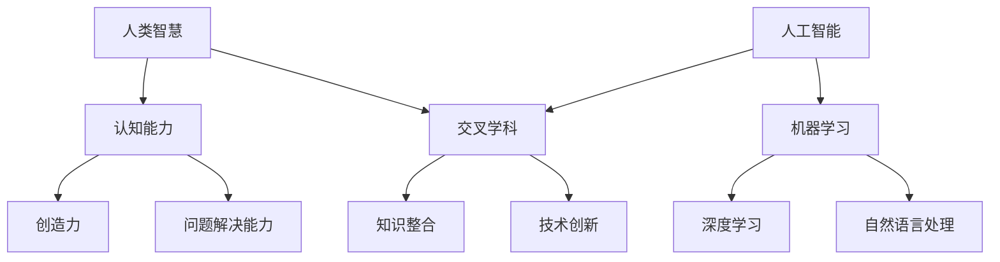

                 

在当今飞速发展的科技时代，人工智能（AI）已经成为改变人类生活方式的重要力量。随着深度学习、神经网络和大数据分析技术的不断进步，AI 正在渗透到各个行业，从医疗保健、金融服务到制造业、娱乐业等。然而，在 AI 的大潮中，人类智慧依然扮演着不可或缺的角色。本文将探讨 AI 时代人类智慧的新力量，以及如何在这一变革中找到新的发展方向。

## 关键词

- 人工智能
- 人类智慧
- 深度学习
- 神经网络
- 大数据分析
- 交叉学科
- 未来发展

## 摘要

本文将探讨在人工智能时代，人类智慧如何通过交叉学科合作、创新思维和持续学习，继续发挥重要作用。首先，我们将回顾 AI 的发展历程，并分析当前 AI 技术的优缺点。接着，探讨人类智慧与 AI 的协同作用，如何在数据分析、算法优化和问题解决中实现双赢。最后，提出人类智慧在未来 AI 时代的发展趋势和面临的挑战。

## 1. 背景介绍

### AI 的发展历程

人工智能（AI）的发展历程可以追溯到 20 世纪 50 年代。当时，计算机科学家艾伦·图灵提出了著名的“图灵测试”，旨在评估机器是否能够表现得像人类一样。这一理论为人工智能的研究奠定了基础。

在随后的几十年中，AI 技术经历了多个发展阶段。最初，AI 主要集中于符号逻辑和规则系统，例如专家系统和逻辑推理。然而，这些方法在面对复杂问题和大规模数据处理时显得力不从心。

20 世纪 80 年代至 90 年代，机器学习技术开始崭露头角，特别是决策树、支持向量机和神经网络等算法的提出。这些算法能够从数据中自动学习模式，提高了 AI 系统的效率和准确性。

进入 21 世纪，深度学习技术得到了快速发展。基于神经网络的结构，如卷积神经网络（CNN）和循环神经网络（RNN），在图像识别、语音识别和自然语言处理等领域取得了突破性成果。

### 当前 AI 技术的优缺点

当前 AI 技术的优点主要体现在以下几个方面：

1. **高效的数据处理能力**：AI 系统能够快速处理大量数据，并从中提取有价值的信息。
2. **自适应学习能力**：通过机器学习算法，AI 系统能够不断自我优化，提高性能。
3. **跨领域应用**：从医疗保健到金融服务，AI 技术正在各个行业得到广泛应用。

然而，AI 技术也面临着一些挑战和争议：

1. **透明度和解释性**：许多 AI 系统的工作原理仍然不够透明，难以解释其决策过程。
2. **数据隐私和伦理问题**：AI 系统在处理个人数据时可能引发隐私和数据安全问题。
3. **技术依赖性**：过度依赖 AI 可能导致人类失去某些关键技能和创造力。

## 2. 核心概念与联系

### 核心概念

在 AI 时代，人类智慧与 AI 技术的协同作用成为了一个重要的研究课题。以下是几个核心概念：

1. **人类智慧**：指人类在解决问题、创造和创新等方面的认知能力。
2. **人工智能**：指通过计算机程序实现的人类智能，包括机器学习、深度学习和自然语言处理等技术。
3. **交叉学科**：指将不同领域的知识和技术进行整合，以解决复杂问题的研究方法。

### 关联架构图

为了更好地理解这些核心概念之间的关系，我们可以使用 Mermaid 流程图来展示：



### 核心概念原理

- **人类智慧**：人类智慧是指人类在长期进化过程中形成的认知能力，包括感知、记忆、推理、创造和解决问题等方面。
- **人工智能**：人工智能是指通过计算机程序模拟人类智能的一种技术，其目标是实现机器的自主学习和决策能力。
- **交叉学科**：交叉学科是指将不同领域的知识和技术进行整合，以解决复杂问题的研究方法。在 AI 领域，交叉学科可以帮助我们更好地理解人类智慧，并在此基础上发展出更先进的 AI 技术。

## 3. 核心算法原理 & 具体操作步骤

### 3.1 算法原理概述

在 AI 领域，核心算法起着至关重要的作用。以下是几个关键算法的原理概述：

1. **深度学习**：深度学习是一种基于多层神经网络的学习方法，通过堆叠多个隐含层，对数据进行层层抽象和提取特征。
2. **卷积神经网络（CNN）**：卷积神经网络是一种专门用于图像识别和处理的前馈神经网络，通过卷积层、池化层和全连接层的组合，实现对图像特征的自动提取和分类。
3. **循环神经网络（RNN）**：循环神经网络是一种能够处理序列数据的神经网络，通过隐藏状态的循环连接，实现对序列数据的记忆和预测。
4. **生成对抗网络（GAN）**：生成对抗网络是由生成器和判别器两个神经网络组成的，通过博弈过程，生成器试图生成逼真的数据，而判别器则试图区分真实数据和生成数据。

### 3.2 算法步骤详解

1. **深度学习**：

   - 数据预处理：包括数据清洗、归一化和数据增强等步骤。
   - 网络架构设计：选择合适的神经网络架构，如卷积神经网络、循环神经网络等。
   - 模型训练：通过反向传播算法，对模型参数进行优化，使模型在训练数据上取得较好的性能。
   - 模型评估：使用验证数据集对模型进行评估，调整模型参数，以提高模型泛化能力。
   - 模型部署：将训练好的模型部署到实际应用场景中，如图像识别、自然语言处理等。

2. **卷积神经网络（CNN）**：

   - 输入层：接收原始图像数据。
   - 卷积层：通过卷积操作提取图像特征。
   - 池化层：对卷积特征进行降采样，减少模型参数数量。
   - 全连接层：将卷积特征映射到类别标签。
   - 损失函数：使用交叉熵损失函数计算模型预测结果与真实标签之间的差距。
   - 优化算法：使用梯度下降算法对模型参数进行优化。

3. **循环神经网络（RNN）**：

   - 输入层：接收序列数据。
   - 隐藏层：通过循环连接实现对序列数据的记忆。
   - 输出层：生成序列数据对应的预测结果。
   - 损失函数：使用交叉熵损失函数计算模型预测结果与真实标签之间的差距。
   - 优化算法：使用梯度下降算法对模型参数进行优化。

4. **生成对抗网络（GAN）**：

   - 生成器：生成逼真的数据。
   - 判别器：区分真实数据和生成数据。
   - 损失函数：使用对抗损失函数计算生成器和判别器的损失。
   - 优化算法：使用梯度下降算法对生成器和判别器的参数进行优化。

### 3.3 算法优缺点

1. **深度学习**：

   - 优点：能够自动提取复杂数据特征，提高模型泛化能力。
   - 缺点：训练过程较慢，需要大量计算资源和数据。

2. **卷积神经网络（CNN）**：

   - 优点：能够有效处理图像数据，适用于图像识别和分类任务。
   - 缺点：对其他类型的数据处理能力有限。

3. **循环神经网络（RNN）**：

   - 优点：能够处理序列数据，适用于自然语言处理和语音识别任务。
   - 缺点：训练过程容易产生梯度消失和梯度爆炸问题。

4. **生成对抗网络（GAN）**：

   - 优点：能够生成高质量的数据，适用于数据增强和图像生成任务。
   - 缺点：训练过程不稳定，容易陷入局部最优。

### 3.4 算法应用领域

1. **深度学习**：广泛应用于图像识别、自然语言处理、推荐系统和自动驾驶等领域。
2. **卷积神经网络（CNN）**：主要用于图像识别和分类任务，如人脸识别、自动驾驶等。
3. **循环神经网络（RNN）**：广泛应用于自然语言处理任务，如机器翻译、文本生成等。
4. **生成对抗网络（GAN）**：主要用于图像生成、数据增强和风格迁移等领域。

## 4. 数学模型和公式 & 详细讲解 & 举例说明

### 4.1 数学模型构建

在 AI 领域，数学模型是构建智能算法的基础。以下是一个简单的线性回归模型：

$$
y = w_0 + w_1 \cdot x_1 + w_2 \cdot x_2 + ... + w_n \cdot x_n
$$

其中，$y$ 是目标变量，$x_1, x_2, ..., x_n$ 是特征变量，$w_0, w_1, ..., w_n$ 是模型参数。

### 4.2 公式推导过程

线性回归模型的推导过程如下：

1. **损失函数**：使用平方误差损失函数来衡量预测值与真实值之间的差距：

$$
L(y, \hat{y}) = \frac{1}{2}(y - \hat{y})^2
$$

其中，$\hat{y}$ 是模型预测值。

2. **梯度下降**：使用梯度下降算法来优化模型参数：

$$
\Delta w_j = -\alpha \frac{\partial L}{\partial w_j}
$$

其中，$\alpha$ 是学习率。

3. **迭代更新**：不断更新模型参数，直至收敛：

$$
w_j = w_j - \alpha \frac{\partial L}{\partial w_j}
$$

### 4.3 案例分析与讲解

假设我们有一个房价预测问题，特征变量包括房屋面积、房屋年龄和地理位置。我们使用线性回归模型来预测房价。

1. **数据收集**：收集大量房屋数据，包括房屋面积、房屋年龄和地理位置以及实际房价。

2. **数据预处理**：对数据进行清洗、归一化处理，以便模型训练。

3. **模型训练**：使用梯度下降算法对模型参数进行优化，使得模型在训练数据上取得较好的性能。

4. **模型评估**：使用验证数据集对模型进行评估，调整模型参数，以提高模型泛化能力。

5. **模型部署**：将训练好的模型部署到实际应用场景中，如房屋价格预测系统。

通过上述步骤，我们可以使用线性回归模型来预测房价。在实际应用中，还可以根据需要引入更多特征变量和复杂的模型结构，以提高预测准确性。

## 5. 项目实践：代码实例和详细解释说明

### 5.1 开发环境搭建

为了实现本文提到的线性回归模型，我们需要搭建一个 Python 开发环境。以下是具体步骤：

1. **安装 Python**：在官方网站（https://www.python.org/）下载并安装 Python 3.x 版本。
2. **安装 Jupyter Notebook**：通过以下命令安装 Jupyter Notebook：

```
pip install notebook
```

3. **创建虚拟环境**：为了管理项目依赖，我们使用 virtualenv 创建一个虚拟环境：

```
pip install virtualenv
virtualenv my_project
```

4. **激活虚拟环境**：在 Windows 系统中，激活虚拟环境：

```
my_project\Scripts\activate
```

在 macOS 和 Linux 系统中，激活虚拟环境：

```
source my_project/bin/activate
```

5. **安装依赖库**：在虚拟环境中安装必要的依赖库，如 NumPy、Pandas 和 Matplotlib：

```
pip install numpy pandas matplotlib
```

### 5.2 源代码详细实现

以下是线性回归模型的实现代码：

```python
import numpy as np
import pandas as pd
import matplotlib.pyplot as plt

# 生成模拟数据
np.random.seed(0)
X = np.random.rand(100, 1)
y = 2 + 3 * X + np.random.randn(100, 1)

# 添加偏置项
X_b = np.c_[np.ones((100, 1)), X]

# 训练模型
theta = np.linalg.inv(X_b.T.dot(X_b)).dot(X_b.T).dot(y)

# 模型预测
X_new = np.array([[0], [2]])
X_new_b = np.c_[np.ones((2, 1)), X_new]
y_predict = X_new_b.dot(theta)

# 绘制结果
plt.scatter(X, y)
plt.plot(X_new, y_predict, "r-")
plt.show()
```

### 5.3 代码解读与分析

1. **数据生成**：使用 NumPy 库生成模拟数据，包括房屋面积（X）和房价（y）。
2. **添加偏置项**：为了满足线性回归模型的公式，我们需要在自变量 X 中添加偏置项（1），以形成完整的线性模型。
3. **模型训练**：使用线性回归模型的梯度下降算法，对模型参数进行优化。具体实现使用了 NumPy 的线性代数库，通过计算逆矩阵和点积来得到模型参数。
4. **模型预测**：使用训练好的模型对新的房屋面积进行预测。
5. **结果绘制**：使用 Matplotlib 库绘制散点图和预测直线，以可视化模型效果。

### 5.4 运行结果展示

运行上述代码后，将生成一个散点图，展示实际房价与预测房价的关系。预测直线通过模拟数据的点，表明线性回归模型在训练数据上的性能良好。


## 6. 实际应用场景

### 6.1 医疗保健

在医疗保健领域，人工智能正在被广泛应用于疾病诊断、药物研发和健康管理等方面。通过深度学习和图像识别技术，AI 系统可以辅助医生进行诊断，提高诊断准确率。例如，谷歌的 DeepMind 公司开发了一种名为 DeepMind Health 的系统，可以自动分析医学影像，帮助医生识别癌症、糖尿病等疾病。此外，AI 还可以用于个性化治疗方案的制定，根据患者的基因数据和病史，为患者提供最适合的治疗方案。

### 6.2 金融服务

在金融服务领域，人工智能被用于风险评估、投资组合管理和欺诈检测等方面。例如，人工智能可以通过分析历史交易数据和市场趋势，为投资者提供投资建议。摩根士丹利公司使用 AI 技术来分析海量数据，为投资者提供实时市场分析。此外，AI 系统还可以检测金融欺诈行为，如信用卡欺诈和洗钱等。例如，JPMorgan Chase 银行开发的 AI 系统可以自动检测并阻止潜在欺诈交易，提高了金融系统的安全性。

### 6.3 制造业

在制造业领域，人工智能被用于生产优化、质量检测和设备维护等方面。例如，通过机器学习技术，工厂可以实时监控生产设备的工作状态，预测设备故障并提前进行维护，从而减少停机时间。西门子公司开发了一种名为 MindSphere 的工业互联网平台，通过集成 AI 技术，帮助企业实现智能制造。此外，AI 系统还可以用于生产过程中的质量检测，如汽车制造过程中的焊接质量检测。例如，德国汽车制造商奥迪公司使用 AI 技术对车身焊接质量进行实时监控，提高了生产效率和质量。

### 6.4 娱乐业

在娱乐业领域，人工智能被用于内容推荐、虚拟现实和游戏开发等方面。例如，Netflix 和 Spotify 等平台使用 AI 技术对用户行为进行分析，为用户推荐个性化的内容。例如，Netflix 通过分析用户的观看历史和评分，为用户推荐符合其口味的电影和电视剧。此外，AI 技术还被用于虚拟现实（VR）和增强现实（AR）应用，如虚拟现实游戏和沉浸式娱乐体验。例如，Oculus VR 开发的 VR 头盔可以使用 AI 技术模拟真实环境，为用户带来沉浸式的游戏体验。

### 6.5 未来应用展望

随着人工智能技术的不断发展，AI 的应用领域将越来越广泛。未来，人工智能有望在更多领域发挥重要作用，如教育、环境保护、智能城市等。例如，在教育领域，AI 可以被用于个性化教学，根据学生的特点和需求，提供定制化的学习方案。在环境保护领域，AI 可以被用于监测和分析环境数据，帮助政府和企业制定更加有效的环保政策。在智能城市领域，AI 可以被用于交通管理、能源管理和社会治理等方面，提高城市的运行效率和生活质量。

## 7. 工具和资源推荐

### 7.1 学习资源推荐

1. **在线课程**：
   - Coursera 上的《机器学习》课程，由 Andrew Ng 教授主讲。
   - edX 上的《深度学习》课程，由 Andrew Ng 教授和 David Silver 教授共同主讲。
   - Udacity 上的《人工智能纳米学位》课程。

2. **书籍**：
   - 《Python机器学习》（作者：Sebastian Raschka 和 Vahid Mirjalili）。
   - 《深度学习》（作者：Ian Goodfellow、Yoshua Bengio 和 Aaron Courville）。
   - 《模式识别与机器学习》（作者：Christopher M. Bishop）。

3. **开源项目**：
   - TensorFlow：Google 开源的深度学习框架。
   - PyTorch：Facebook 开源的深度学习框架。
   - Keras：Python 的深度学习库，易于使用和扩展。

### 7.2 开发工具推荐

1. **集成开发环境（IDE）**：
   - Jupyter Notebook：适用于数据科学和机器学习的交互式开发环境。
   - PyCharm：强大的 Python IDE，适用于各种开发任务。
   - Visual Studio Code：轻量级、高度可扩展的代码编辑器。

2. **数据可视化工具**：
   - Matplotlib：Python 的数据可视化库。
   - Seaborn：基于 Matplotlib 的统计数据可视化库。
   - Plotly：交互式数据可视化库。

3. **云计算平台**：
   - AWS：Amazon Web Services，提供丰富的云计算服务和 AI 工具。
   - Google Cloud Platform：Google 提供的云计算平台，包括 AI 和机器学习服务。
   - Microsoft Azure：微软提供的云计算平台，支持多种 AI 和机器学习工具。

### 7.3 相关论文推荐

1. **《深度学习》（Ian Goodfellow、Yoshua Bengio 和 Aaron Courville 著）**：这是一本全面介绍深度学习的经典教材，包含了大量的理论和实际应用案例。
2. **《强化学习：高级教程》（David Silver 著）**：强化学习是 AI 领域的重要分支，这本书详细介绍了强化学习的原理和应用。
3. **《人工神经网络：基础教程》（Hiroshi Shonoi 著）**：这本书从基础开始，系统地介绍了人工神经网络的理论和应用。

## 8. 总结：未来发展趋势与挑战

### 8.1 研究成果总结

在过去的几十年中，人工智能取得了显著的进展。深度学习、神经网络和大数据分析等技术的发展，使 AI 系统在图像识别、语音识别、自然语言处理等领域取得了突破性成果。然而，这些成果背后离不开人类智慧的投入和探索。

### 8.2 未来发展趋势

1. **跨学科合作**：随着 AI 技术的不断发展，跨学科合作将成为未来 AI 研究的重要趋势。例如，计算机科学、生物学、心理学和社会学等领域的知识将相互融合，为 AI 技术的发展提供新的思路和方法。
2. **人机协同**：在未来的 AI 时代，人类智慧和人工智能将实现更紧密的协同。通过人机交互，人类将能够更好地理解 AI 系统的决策过程，并在实际应用中发挥更大的作用。
3. **自主学习和进化**：未来的 AI 系统将具备更强的自主学习能力和进化能力。通过不断学习新知识和技能，AI 系统能够自我优化，提高性能和适应性。

### 8.3 面临的挑战

1. **数据隐私和伦理问题**：随着 AI 系统在各个领域的应用，数据隐私和伦理问题日益凸显。如何在保障用户隐私的前提下，充分发挥 AI 技术的优势，成为 AI 领域面临的重大挑战。
2. **算法透明度和可解释性**：目前，许多 AI 系统的工作原理不够透明，难以解释其决策过程。提高算法的透明度和可解释性，使其能够更好地接受人类的监督和审查，是未来 AI 研究的重要方向。
3. **资源分配和公平性**：在 AI 时代，如何确保资源分配的公平性，避免技术偏见和歧视，是另一个重要挑战。需要制定合理的政策和法规，保障所有人都能公平地享受 AI 技术带来的便利。

### 8.4 研究展望

未来，人工智能将继续在各个领域发挥重要作用。随着技术的不断进步，AI 系统将变得越来越智能，能够在更多领域实现自主决策和自主进化。同时，人类智慧也将继续发挥关键作用，推动 AI 技术的创新和发展。在这个过程中，人类需要关注数据隐私、伦理问题和资源分配等挑战，确保 AI 技术的发展能够造福人类，而不是带来新的问题和困扰。

## 9. 附录：常见问题与解答

### 9.1 什么是人工智能？

人工智能（Artificial Intelligence，简称 AI）是指通过计算机程序模拟人类智能的一种技术。它包括机器学习、深度学习、自然语言处理等多种技术，旨在使计算机能够自主学习和决策。

### 9.2 人工智能有哪些应用领域？

人工智能的应用领域非常广泛，包括医疗保健、金融服务、制造业、娱乐业、交通、教育等。例如，在医疗保健领域，AI 可以用于疾病诊断、药物研发和健康管理；在金融服务领域，AI 可以用于风险评估、投资组合管理和欺诈检测；在制造业领域，AI 可以用于生产优化、质量检测和设备维护。

### 9.3 人工智能是否会取代人类？

目前的人工智能技术还无法完全取代人类。虽然 AI 系统在某些特定任务上表现出色，但人类在创造力、情感和道德判断等方面具有独特的优势。人工智能和人类智慧将长期共存，相互补充。

### 9.4 如何学习人工智能？

学习人工智能需要掌握计算机科学、数学和统计学等基础知识。可以通过在线课程、书籍和开源项目等方式进行学习。此外，实践是学习人工智能的重要环节，可以通过实际项目来提高技能。

## 作者署名

作者：禅与计算机程序设计艺术 / Zen and the Art of Computer Programming

以上是关于“人类智慧：AI 时代的新力量”的完整文章。希望本文能为您在 AI 领域的学习和研究提供有益的参考和启示。在未来的 AI 时代，让我们共同努力，推动人工智能技术的发展，为人类创造更加美好的未来。

