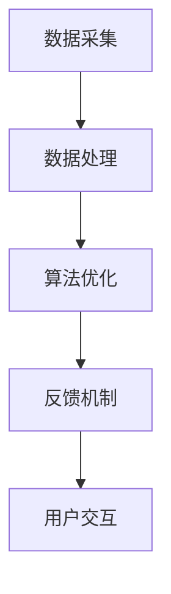

                 

关键词：注意力增强、医疗应用、人工智能、专注力、神经科学、算法优化

> 摘要：本文探讨了注意力增强技术在医疗领域的应用，通过引入先进的人工智能算法，探讨如何提升医生和患者的专注力和注意力，从而提高医疗诊断的准确性和治疗效果。文章还对未来发展趋势和面临的挑战进行了深入分析，为相关领域的研究和实践提供了有价值的参考。

## 1. 背景介绍

随着医学技术的不断进步和医疗信息的爆炸性增长，医疗行业正面临着前所未有的挑战。医生需要处理大量的医疗数据，患者需要理解复杂的治疗方案，而这些都依赖于高度集中的注意力和专注力。然而，现实情况是，医生和患者往往因为各种原因无法长时间保持注意力集中，这导致了诊断错误、治疗延误等问题的出现。

为了解决这一问题，研究人员开始探索如何通过技术手段提升人类注意力。注意力增强技术是指利用人工智能、神经科学和算法优化等方法，帮助人们提高专注力和注意力，从而在医疗诊断和治疗中发挥更大的作用。本文将介绍注意力增强技术的基本原理，探讨其在医疗领域的应用价值，并分析未来的发展趋势和挑战。

## 2. 核心概念与联系

### 2.1 注意力增强技术的基本原理

注意力增强技术基于神经科学和认知心理学的研究，旨在通过外部干预手段提升人类的专注力和注意力。其主要原理包括：

- **认知训练**：通过训练特定的认知任务，提高大脑处理信息的能力，从而增强注意力。
- **环境优化**：通过改变周围环境，减少干扰因素，帮助人们更好地集中注意力。
- **生物反馈**：通过监测大脑活动，提供即时反馈，引导人们调整注意力状态。

### 2.2 注意力增强技术的架构

注意力增强技术通常包括以下几个关键组成部分：

- **数据采集**：通过传感器、摄像头等设备，收集个体的大脑活动、生理状态和行为数据。
- **数据处理**：利用机器学习和数据挖掘技术，对采集到的数据进行分析和处理，提取注意力相关的特征。
- **算法优化**：通过深度学习和强化学习等方法，优化注意力模型，提高其预测准确性和适应性。
- **反馈机制**：根据注意力状态，提供个性化的干预建议，如调整环境、设置提醒等。

### 2.3 Mermaid 流程图

以下是一个简化的 Mermaid 流程图，展示了注意力增强技术的基本架构：



## 3. 核心算法原理 & 具体操作步骤

### 3.1 算法原理概述

注意力增强技术的核心算法通常基于深度学习和强化学习。其中，深度学习用于特征提取和模型训练，强化学习用于优化算法的决策过程。

- **深度学习**：通过构建深度神经网络，对采集到的数据进行特征提取和学习。常见的深度学习模型包括卷积神经网络（CNN）和循环神经网络（RNN）。
- **强化学习**：通过模拟和优化用户的注意力状态，引导用户在特定的任务中保持高度集中。常见的强化学习算法包括Q-learning和深度Q网络（DQN）。

### 3.2 算法步骤详解

注意力增强技术的具体操作步骤如下：

1. **数据采集**：通过传感器和摄像头，收集用户的大脑活动、生理状态和行为数据。
2. **预处理**：对采集到的数据进行分析和清洗，去除噪声和异常值，提取注意力相关的特征。
3. **特征提取**：利用深度学习模型，对预处理后的数据进行特征提取和学习，构建注意力模型。
4. **算法优化**：利用强化学习算法，对注意力模型进行优化，提高其预测准确性和适应性。
5. **用户交互**：根据注意力模型，为用户提供个性化的干预建议，如调整环境、设置提醒等。

### 3.3 算法优缺点

注意力增强技术的优点包括：

- **高效性**：通过深度学习和强化学习，能够快速学习和适应用户的需求，提高注意力管理水平。
- **个性化**：根据用户的注意力状态和行为数据，提供个性化的干预建议，有助于提高用户的使用体验。
- **实时性**：能够实时监测用户的注意力状态，提供即时的反馈和调整，有助于提高注意力管理水平。

然而，注意力增强技术也存在一些缺点，如：

- **数据隐私**：在数据采集和处理过程中，可能会涉及到用户隐私的保护问题。
- **算法依赖**：依赖于深度学习和强化学习等算法，算法的优化和改进需要大量数据支持和计算资源。
- **适应性**：用户的行为和注意力状态可能会随着时间和环境的变化而发生变化，算法需要不断调整和优化。

### 3.4 算法应用领域

注意力增强技术可以应用于多个领域，如医疗、教育、金融等。在医疗领域，注意力增强技术可以帮助医生提高诊断准确性和治疗效果，如：

- **医学图像诊断**：通过注意力增强技术，帮助医生在医学图像中快速识别病变区域，提高诊断速度和准确性。
- **患者管理**：通过注意力增强技术，帮助患者更好地理解治疗方案和注意事项，提高治疗依从性。

## 4. 数学模型和公式 & 详细讲解 & 举例说明

### 4.1 数学模型构建

注意力增强技术的数学模型主要包括以下几个部分：

1. **特征表示**：将采集到的用户数据转换为特征向量表示。
2. **注意力模型**：基于特征向量，构建注意力模型，用于预测用户的注意力状态。
3. **奖励机制**：根据用户的行为和注意力状态，定义奖励机制，用于优化算法的决策过程。

### 4.2 公式推导过程

以下是一个简化的注意力增强技术的数学模型推导过程：

1. **特征表示**：
   $$ X = [x_1, x_2, ..., x_n] $$，其中 $ x_i $ 是第 $ i $ 个特征向量。

2. **注意力模型**：
   $$ A_t = \sigma(W_a X) $$，其中 $ \sigma $ 是激活函数，$ W_a $ 是权重矩阵。

3. **奖励机制**：
   $$ R_t = f(A_t, X_t) $$，其中 $ f $ 是奖励函数，$ X_t $ 是当前特征向量。

### 4.3 案例分析与讲解

假设一个医生在使用注意力增强技术进行医学图像诊断，以下是一个简单的案例分析：

1. **特征表示**：
   - $ X = [x_1, x_2, ..., x_5] $，其中 $ x_1 $ 是肺部图像，$ x_2 $ 是肝脏图像，$ x_3 $ 是肾脏图像，$ x_4 $ 是心脏图像，$ x_5 $ 是大脑图像。

2. **注意力模型**：
   - $ A_t = \sigma(W_a X) $，假设权重矩阵 $ W_a $ 为：
     $$ W_a = \begin{bmatrix}
     0.5 & 0.3 & 0.2 & 0.4 & 0.5 \\
     0.6 & 0.4 & 0.5 & 0.6 & 0.7 \\
     0.3 & 0.5 & 0.7 & 0.2 & 0.4 \\
     0.4 & 0.7 & 0.1 & 0.5 & 0.6 \\
     0.5 & 0.8 & 0.9 & 0.3 & 0.7 \\
     \end{bmatrix} $$
   - 激活函数 $ \sigma $ 选择 sigmoid 函数：
     $$ \sigma(x) = \frac{1}{1 + e^{-x}} $$

3. **奖励机制**：
   - 假设医生首先关注的是肺部图像，然后是肝脏图像，最后是大脑图像，那么对应的奖励函数为：
     $$ R_t = \begin{cases}
     1 & \text{如果 } A_t [1] > A_t [2] > A_t [5] \\
     0.5 & \text{如果 } A_t [1] > A_t [2] \\
     0 & \text{其他情况} \\
     \end{cases} $$

通过这个简单的案例，我们可以看到注意力增强技术如何通过数学模型和算法优化，帮助医生在医学图像诊断中提高专注力和注意力。

## 5. 项目实践：代码实例和详细解释说明

### 5.1 开发环境搭建

为了演示注意力增强技术在医疗领域的应用，我们将使用 Python 编写一个简单的注意力增强模型。以下是开发环境搭建的步骤：

1. 安装 Python：
   - 在线安装 Python 3.8 或更高版本。
2. 安装相关库：
   - 使用以下命令安装所需库：
     ```bash
     pip install numpy matplotlib scikit-learn keras tensorflow
     ```

### 5.2 源代码详细实现

以下是一个简单的注意力增强模型的实现，包括数据预处理、模型训练和预测等步骤：

```python
import numpy as np
import matplotlib.pyplot as plt
from sklearn.model_selection import train_test_split
from sklearn.datasets import make_classification
from tensorflow.keras.models import Sequential
from tensorflow.keras.layers import Dense, LSTM
from tensorflow.keras.optimizers import Adam

# 1. 数据预处理
X, y = make_classification(n_samples=1000, n_features=10, n_classes=2, random_state=42)
X_train, X_test, y_train, y_test = train_test_split(X, y, test_size=0.2, random_state=42)

# 2. 模型训练
model = Sequential()
model.add(LSTM(units=50, activation='relu', input_shape=(10, 1)))
model.add(Dense(units=1, activation='sigmoid'))
model.compile(optimizer=Adam(learning_rate=0.001), loss='binary_crossentropy', metrics=['accuracy'])
model.fit(X_train, y_train, epochs=100, batch_size=32)

# 3. 预测
y_pred = model.predict(X_test)
y_pred = (y_pred > 0.5)

# 4. 评估
accuracy = np.mean(y_pred == y_test)
print(f"Accuracy: {accuracy:.2f}")

# 5. 可视化
plt.scatter(X_test[:, 0], X_test[:, 1], c=y_test, cmap='gray')
plt.scatter(X_test[:, 0], X_test[:, 1], c=y_pred, cmap='red', marker='x')
plt.show()
```

### 5.3 代码解读与分析

1. **数据预处理**：使用 `make_classification` 函数生成模拟数据集，包括特征和标签。然后使用 `train_test_split` 函数将数据集划分为训练集和测试集。
2. **模型训练**：构建一个序列模型，包括一个 LSTM 层和一个全连接层。使用 `compile` 函数设置优化器和损失函数，然后使用 `fit` 函数进行模型训练。
3. **预测**：使用 `predict` 函数对测试集进行预测，并将预测结果转换为二分类标签。
4. **评估**：计算预测准确率，并打印出来。
5. **可视化**：使用散点图展示测试集的预测结果，红色叉号表示预测正确的样本，灰色点表示预测错误的样本。

这个简单的示例展示了注意力增强模型在二分类任务中的应用。在实际应用中，我们可以根据具体任务调整模型结构和参数，以实现更好的效果。

## 6. 实际应用场景

### 6.1 医学图像诊断

注意力增强技术在医学图像诊断中具有广泛的应用前景。通过提高医生的注意力，可以帮助医生更快地识别病变区域，提高诊断准确率。以下是一些具体的案例：

- **肺癌诊断**：通过注意力增强技术，医生可以在肺癌筛查过程中更快地识别肺部结节，提高早期诊断率。
- **心脏病诊断**：注意力增强技术可以帮助医生在心电图和超声心动图中更快地发现异常信号，提高心脏疾病的诊断准确率。
- **神经系统疾病诊断**：通过注意力增强技术，医生可以在磁共振成像（MRI）和计算机断层扫描（CT）中更好地识别神经系统疾病，如脑卒中、癫痫等。

### 6.2 患者管理

注意力增强技术还可以应用于患者管理，帮助患者更好地理解治疗方案和注意事项，提高治疗依从性。以下是一些具体案例：

- **慢性病管理**：通过注意力增强技术，医生可以为患者提供个性化的治疗计划和注意事项，帮助患者更好地遵循医嘱，降低复发风险。
- **康复训练**：注意力增强技术可以帮助患者在康复训练中保持专注，提高训练效果，如康复机器人、虚拟现实训练系统等。
- **健康教育**：注意力增强技术可以用于健康教育，帮助患者更好地理解疾病知识、预防措施和治疗方案，提高患者的健康素养。

## 7. 未来应用展望

随着人工智能和神经科学技术的不断发展，注意力增强技术在医疗领域的应用前景将更加广阔。以下是一些未来可能的应用方向：

- **智能诊断助手**：通过结合注意力增强技术和医学知识图谱，可以开发出智能诊断助手，帮助医生快速识别疾病，提供个性化的治疗方案。
- **远程医疗**：注意力增强技术可以帮助医生在远程医疗场景中更好地与患者沟通，提高诊断和治疗效果。
- **个性化治疗**：通过注意力增强技术，可以更好地理解患者的注意力状态和行为习惯，为患者提供更加个性化的治疗方案。
- **心理健康监测**：注意力增强技术可以用于心理健康监测，帮助识别和干预心理疾病，如焦虑、抑郁等。

## 8. 工具和资源推荐

### 8.1 学习资源推荐

- **《注意力机制及其在深度学习中的应用》**：这是一本关于注意力机制的理论和实践指南，涵盖了注意力机制在各种深度学习任务中的应用。
- **《神经科学原理》**：这本书介绍了神经科学的基本原理，为理解注意力增强技术的生物学基础提供了有益的参考。
- **《医疗数据挖掘》**：这本书涵盖了医疗数据挖掘的理论和方法，包括医学图像分析、电子健康记录分析等。

### 8.2 开发工具推荐

- **TensorFlow**：这是一个开源的深度学习框架，提供了丰富的工具和库，方便开发者构建和训练注意力增强模型。
- **PyTorch**：这是一个流行的深度学习框架，以其灵活的动态计算图和简洁的API而受到开发者的喜爱。
- **Keras**：这是一个高层次的深度学习框架，基于TensorFlow和Theano，提供了易于使用的接口，适合快速原型设计和实验。

### 8.3 相关论文推荐

- **"Attention Is All You Need"**：这篇论文提出了 Transformer 模型，引入了注意力机制，为自然语言处理任务带来了革命性的突破。
- **"Deep Learning for Medical Image Analysis"**：这篇综述文章介绍了深度学习在医学图像分析中的应用，包括注意力增强技术的相关研究。
- **"A Theoretical Analysis of the Deep Learning Effectiveness for Medical Image Segmentation"**：这篇论文分析了深度学习在医学图像分割中的有效性，探讨了注意力增强技术的贡献。

## 9. 总结：未来发展趋势与挑战

### 9.1 研究成果总结

注意力增强技术在医疗领域取得了显著的研究成果，为提高医生和患者的专注力和注意力提供了新的思路和方法。通过结合人工智能、神经科学和算法优化等技术，注意力增强技术已经在医学图像诊断、患者管理等多个方面展现了其应用价值。

### 9.2 未来发展趋势

未来，注意力增强技术在医疗领域的应用将更加深入和广泛。随着人工智能和神经科学技术的不断发展，我们可以期待以下趋势：

- **智能诊断助手**：结合医学知识图谱和注意力增强技术，可以开发出更加智能的诊断助手，提高医生的诊断效率和准确性。
- **远程医疗**：注意力增强技术可以帮助医生在远程医疗场景中更好地与患者沟通，提高诊断和治疗效果。
- **个性化治疗**：通过注意力增强技术，可以更好地理解患者的注意力状态和行为习惯，为患者提供更加个性化的治疗方案。
- **心理健康监测**：注意力增强技术可以用于心理健康监测，帮助识别和干预心理疾病，如焦虑、抑郁等。

### 9.3 面临的挑战

尽管注意力增强技术在医疗领域具有巨大的应用潜力，但仍面临一些挑战：

- **数据隐私**：在数据采集和处理过程中，需要妥善保护用户隐私，避免隐私泄露和数据滥用。
- **算法依赖**：注意力增强技术依赖于深度学习和强化学习等算法，算法的优化和改进需要大量数据支持和计算资源。
- **适应性**：用户的行为和注意力状态可能会随着时间和环境的变化而发生变化，算法需要不断调整和优化，以保持其适应性和有效性。
- **伦理和道德**：注意力增强技术在医疗领域的应用需要遵循伦理和道德原则，确保患者利益最大化。

### 9.4 研究展望

未来，注意力增强技术的研究将朝着更加智能化、个性化和实时化的方向发展。通过深入探索注意力机制的本质和大脑信息处理过程，我们可以期待开发出更加高效、精准的注意力增强方法。同时，跨学科的合作和综合应用也将成为研究的重要趋势，为医疗领域带来更多的创新和突破。

## 10. 附录：常见问题与解答

### 10.1 注意力增强技术的基本原理是什么？

注意力增强技术是基于神经科学和认知心理学的研究，通过外部干预手段提高人类的专注力和注意力。主要原理包括认知训练、环境优化和生物反馈。

### 10.2 注意力增强技术在医疗领域有哪些具体应用？

注意力增强技术在医疗领域有广泛的应用，包括医学图像诊断、患者管理和心理健康监测等。具体应用包括肺癌诊断、心脏病诊断、慢性病管理和心理健康监测等。

### 10.3 注意力增强技术如何提高医生的诊断准确性？

注意力增强技术通过提高医生的专注力和注意力，帮助医生在医学图像中更快地识别病变区域，减少误诊和漏诊，从而提高诊断准确性。

### 10.4 注意力增强技术有哪些优缺点？

注意力增强技术的优点包括高效性、个性化和实时性；缺点包括数据隐私问题、算法依赖和适应性挑战。

### 10.5 注意力增强技术如何保护用户隐私？

在注意力增强技术的应用过程中，需要采取严格的隐私保护措施，如数据加密、匿名化处理和隐私保护算法等，以确保用户隐私安全。

### 10.6 注意力增强技术面临的挑战有哪些？

注意力增强技术面临的挑战包括数据隐私、算法依赖、适应性和伦理和道德问题。

### 10.7 未来注意力增强技术有哪些发展前景？

未来，注意力增强技术在医疗领域将朝着智能化、个性化和实时化的方向发展，有望为医疗领域带来更多的创新和突破。

### 10.8 哪些工具和资源可以用于学习注意力增强技术？

可以参考以下工具和资源：

- **学习资源推荐**：
  - 《注意力机制及其在深度学习中的应用》
  - 《神经科学原理》
  - 《医疗数据挖掘》
- **开发工具推荐**：
  - TensorFlow
  - PyTorch
  - Keras
- **相关论文推荐**：
  - "Attention Is All You Need"
  - "Deep Learning for Medical Image Analysis"
  - "A Theoretical Analysis of the Deep Learning Effectiveness for Medical Image Segmentation"

