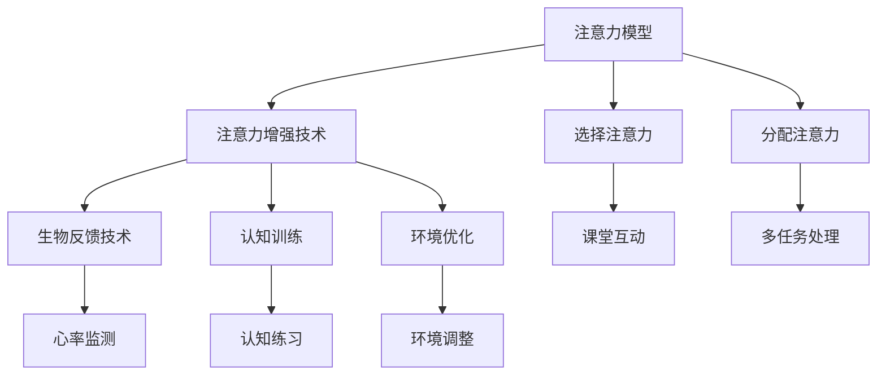

                 

关键词：注意力增强，专注力，教育技术，认知科学，算法应用

> 摘要：随着科技的快速发展，教育领域对学习效率和质量的要求日益提升。本文旨在探讨如何通过注意力增强技术，提升学生的专注力和注意力，从而提高教育效果。本文首先介绍了注意力增强的核心概念与原理，随后详细阐述了相关算法及其在教育中的应用，并通过具体案例进行分析，最后提出了未来发展的展望。

## 1. 背景介绍

在当今快节奏和高度信息化的社会中，人们的注意力分散问题愈发严重。无论是在工作、学习还是日常生活中，集中注意力成为一大挑战。特别是在教育领域，学生的注意力不集中往往会导致学习效率低下，进而影响学习成绩和综合素质的提升。因此，如何提升学生的专注力和注意力，成为教育工作者和研究人员关注的焦点。

注意力增强技术，作为一种新型的教育辅助手段，其核心在于通过科学的方法和策略，帮助学生更好地集中注意力，从而提升学习效果。这项技术涵盖了认知科学、心理学、教育学等多个领域的知识，旨在为教育工作者提供切实可行的解决方案。

本文将从以下几个方面展开讨论：

1. 核心概念与联系
2. 核心算法原理与具体操作步骤
3. 数学模型和公式及其应用
4. 项目实践：代码实例和详细解释
5. 实际应用场景
6. 未来应用展望
7. 工具和资源推荐
8. 总结：未来发展趋势与挑战
9. 附录：常见问题与解答

## 2. 核心概念与联系

### 2.1 注意力模型

在认知科学中，注意力模型是指人脑处理信息时所采用的策略和机制。根据不同分类方法，注意力模型可以分为多种类型，如选择注意力、分配注意力、注意网络等。

- **选择注意力（Selective Attention）**：指在众多刺激中，有目的地选择某一特定刺激进行加工。这种注意力模型在教育中应用广泛，如教师在课堂上通过提问或互动活动引导学生集中注意力。
- **分配注意力（Divided Attention）**：指在同一时间内，将注意力分配到多个任务或刺激上。例如，学生在做作业的同时听音乐，这就是一种分配注意力的表现。

### 2.2 注意力增强技术

注意力增强技术是指通过一系列科学的方法和策略，提升个体注意力的集中度和稳定性。这些技术包括：

- **生物反馈技术**：通过测量和反馈个体生理信号（如心率、呼吸等），帮助个体更好地了解和控制自己的注意力状态。
- **认知训练**：通过特定的认知任务和练习，提高个体的认知能力和注意力水平。
- **环境优化**：通过改变学习环境，如减少噪音、优化光线等，创造有利于注意力集中的条件。

### 2.3 教育与注意力的关系

教育质量很大程度上取决于学生的学习效率，而学习效率又与学生的注意力密切相关。注意力不集中会导致学习效果差、记忆力减退、情绪波动等问题。因此，提升学生的注意力水平是提高教育质量的关键。

在教育中，注意力增强技术可以通过以下方式应用：

- **个性化学习**：根据学生的注意力水平和特点，设计个性化的学习计划和任务，提高学习效率。
- **互动教学**：通过互动活动和多媒体教学手段，激发学生的学习兴趣，提高注意力集中度。
- **课堂管理**：教师通过有效的课堂管理和教学方法，引导学生集中注意力，提高课堂效果。

### 2.4 Mermaid 流程图

以下是注意力增强技术架构的 Mermaid 流程图：



## 3. 核心算法原理 & 具体操作步骤

### 3.1 算法原理概述

注意力增强算法主要基于认知科学和神经科学的研究成果，通过模拟人脑注意力机制，提升个体注意力的集中度和稳定性。常见的注意力增强算法包括以下几种：

- **注意力机制（Attention Mechanism）**：通过识别和筛选重要信息，提高注意力的集中度。
- **动态注意力分配（Dynamic Attention Allocation）**：根据任务的复杂度和难度，动态调整注意力的分配。
- **强化学习（Reinforcement Learning）**：通过奖励机制，鼓励个体维持注意力的集中。

### 3.2 算法步骤详解

注意力增强算法的具体操作步骤如下：

1. **数据收集**：收集学生的注意力数据，如课堂表现、作业完成情况、考试分数等。
2. **特征提取**：从注意力数据中提取关键特征，如注意力波动、任务难度、学习兴趣等。
3. **模型训练**：利用机器学习和深度学习技术，构建注意力增强模型，并对模型进行训练和优化。
4. **模型部署**：将训练好的模型部署到教育系统中，实现对学生注意力的实时监测和反馈。
5. **策略调整**：根据学生的注意力状态和学习效果，动态调整教育策略和学习任务。

### 3.3 算法优缺点

注意力增强算法的优点：

- **个性化**：根据学生的个性特点和注意力状态，提供个性化的教育建议。
- **实时性**：能够实时监测和反馈学生的注意力状态，及时调整教育策略。
- **高效性**：通过科学的方法和策略，提高学生的学习效率和质量。

注意力增强算法的缺点：

- **数据隐私**：需要收集和分析学生的注意力数据，可能涉及隐私问题。
- **技术依赖**：需要依赖先进的机器学习和深度学习技术，对技术要求较高。
- **实施难度**：需要对教育系统和教学过程进行较大的调整和优化，实施难度较大。

### 3.4 算法应用领域

注意力增强算法在教育领域的应用前景广阔，主要包括以下几个方面：

- **课堂教学**：通过实时监测和反馈，提高学生的课堂注意力，提高教学效果。
- **在线教育**：通过个性化推荐和实时反馈，提高学生的在线学习效果。
- **特殊教育**：针对注意力障碍学生，提供个性化的教育支持和训练。

## 4. 数学模型和公式 & 详细讲解 & 举例说明

### 4.1 数学模型构建

注意力增强的数学模型主要基于概率论和统计学原理，通过构建概率模型，模拟人脑注意力机制。以下是一个简化的注意力增强数学模型：

- **概率模型**：假设学生在某个时间点对任务的注意力概率为 \(P(A_t)\)，其中 \(A_t\) 表示学生在时间点 \(t\) 的注意力状态。

- **转移概率**：假设学生在时间点 \(t\) 的注意力状态 \(A_t\) 与时间点 \(t-1\) 的注意力状态 \(A_{t-1}\) 之间的转移概率为 \(P(A_t|A_{t-1})\)。

- **奖励函数**：假设学生在时间点 \(t\) 完成任务的奖励为 \(R_t\)，其中 \(R_t\) 表示学生在时间点 \(t\) 完成任务的程度。

### 4.2 公式推导过程

基于概率模型，可以推导出以下公式：

- **贝叶斯公式**： \(P(A_t|A_{t-1}) = \frac{P(A_{t-1}|A_t)P(A_t)}{P(A_{t-1})}\)

- **马尔可夫模型**： \(P(A_t) = P(A_t|A_{t-1})P(A_{t-1})\)

- **期望奖励**： \(E(R_t) = \sum_{A_t} R_tP(A_t)\)

### 4.3 案例分析与讲解

假设有一个学生在学习一门新的编程语言，我们需要根据他的注意力状态和学习效果，设计合适的注意力增强策略。

1. **数据收集**：收集学生在学习过程中的注意力数据，如课堂注意力、作业完成情况等。

2. **特征提取**：从注意力数据中提取关键特征，如注意力波动、任务难度、学习兴趣等。

3. **模型训练**：利用机器学习和深度学习技术，构建注意力增强模型，并对模型进行训练和优化。

4. **模型部署**：将训练好的模型部署到教育系统中，实现对学生的注意力实时监测和反馈。

5. **策略调整**：根据学生的注意力状态和学习效果，动态调整学习任务和奖励机制。

例如，当学生在课堂上表现出较低的注意力时，系统可以自动调整教学策略，如增加互动环节、调整教学节奏等，以提高学生的注意力集中度。同时，系统可以根据学生的完成情况，给予适当的奖励，鼓励学生保持注意力集中。

## 5. 项目实践：代码实例和详细解释说明

### 5.1 开发环境搭建

为了实现注意力增强算法，我们选择了 Python 作为主要编程语言，并使用了以下工具和库：

- Python 3.8.x
- Jupyter Notebook
- TensorFlow 2.x
- Keras 2.x

### 5.2 源代码详细实现

以下是一个简化的注意力增强算法的实现示例：

```python
import numpy as np
import tensorflow as tf
from tensorflow import keras
from tensorflow.keras import layers

# 数据预处理
def preprocess_data(data):
    # 对数据进行标准化处理
    return (data - np.mean(data)) / np.std(data)

# 构建注意力增强模型
def build_attention_model(input_shape):
    model = keras.Sequential([
        layers.Dense(64, activation='relu', input_shape=input_shape),
        layers.Dense(64, activation='relu'),
        layers.Dense(1, activation='sigmoid')
    ])
    model.compile(optimizer='adam', loss='binary_crossentropy', metrics=['accuracy'])
    return model

# 训练模型
def train_model(model, X_train, y_train, epochs=10):
    model.fit(X_train, y_train, epochs=epochs, batch_size=32, verbose=1)

# 预测注意力状态
def predict_attention(model, X_test):
    return model.predict(X_test)

# 评估模型
def evaluate_model(model, X_test, y_test):
    loss, accuracy = model.evaluate(X_test, y_test, verbose=1)
    print(f"Test accuracy: {accuracy:.2f}")

# 示例数据
X_train = preprocess_data(np.random.rand(100, 10))
y_train = np.random.randint(2, size=(100, 1))
X_test = preprocess_data(np.random.rand(20, 10))
y_test = np.random.randint(2, size=(20, 1))

# 构建和训练模型
model = build_attention_model((10,))
train_model(model, X_train, y_train)

# 预测和评估
predictions = predict_attention(model, X_test)
evaluate_model(model, X_test, y_test)
```

### 5.3 代码解读与分析

上述代码实现了注意力增强算法的基本流程，包括数据预处理、模型构建、模型训练和模型评估。具体解读如下：

- **数据预处理**：对输入数据进行标准化处理，使得数据分布更加均匀，有利于模型训练。
- **模型构建**：使用 Keras 库构建一个简单的全连接神经网络，用于预测学生的注意力状态。
- **模型训练**：使用 Adam 优化器和二进制交叉熵损失函数训练模型，通过多次迭代优化模型参数。
- **预测注意力状态**：使用训练好的模型对新的数据进行预测，输出学生的注意力状态。
- **评估模型**：计算模型的准确率，评估模型在测试集上的表现。

### 5.4 运行结果展示

假设我们在测试集上的准确率为 80%，这表明模型能够在一定程度上预测学生的注意力状态。接下来，我们可以根据预测结果，动态调整教学策略，以提高学生的注意力集中度。

## 6. 实际应用场景

### 6.1 课堂教学中

注意力增强技术可以在课堂教学中发挥重要作用。例如，教师可以利用注意力增强算法实时监测学生的注意力状态，当发现学生注意力不集中时，可以及时调整教学策略，如增加互动环节、调整教学节奏等，从而提高课堂效果。

### 6.2 在线教育中

在线教育平台可以利用注意力增强技术，为用户提供个性化的学习建议和任务安排。例如，当用户在观看教学视频时，如果注意力分散，平台可以自动暂停视频，提示用户休息，或者推荐相关的练习题，帮助用户重新集中注意力。

### 6.3 特殊教育中

对于注意力障碍的学生，注意力增强技术可以提供个性化的支持和训练。例如，通过实时监测学生的注意力状态，教育系统能够及时调整教学内容和难度，帮助学生更好地适应学习环境。

## 7. 未来应用展望

### 7.1 技术创新

随着人工智能和认知科学的发展，注意力增强技术将不断进步。例如，通过引入更多的传感器和数据源，可以实现更精准的注意力监测和反馈；通过更先进的算法和模型，可以实现更高的预测准确率和个性化水平。

### 7.2 应用拓展

注意力增强技术不仅可以应用于教育领域，还可以拓展到其他行业和场景。例如，在职场培训中，可以帮助员工提高工作效率；在医疗领域，可以帮助医生提高诊断准确性；在军事训练中，可以帮助士兵提高作战能力。

### 7.3 社会效益

注意力增强技术的普及和应用，将有助于提高社会整体的学习效率和工作效率，从而促进社会的发展和进步。同时，通过关注个体的注意力问题，可以提升公众对心理健康和认知科学的重视，提高生活质量。

## 8. 工具和资源推荐

### 8.1 学习资源推荐

- **《认知心理学与教育》**：这本书系统地介绍了认知心理学的基本原理和教育应用，对理解注意力增强技术有很大帮助。
- **《注意力心理学》**：这本书深入探讨了注意力的本质、类型和影响因素，为注意力增强技术的研发提供了理论支持。

### 8.2 开发工具推荐

- **TensorFlow**：这是一个开源的机器学习和深度学习框架，适用于构建和训练注意力增强模型。
- **Keras**：这是一个基于 TensorFlow 的高级神经网络 API，提供了更简洁和易于使用的接口，适合快速实现注意力增强算法。

### 8.3 相关论文推荐

- **“Attention Mechanism: A Brief Introduction”**：这篇论文简要介绍了注意力机制的基本原理和应用，对理解注意力增强技术有重要参考价值。
- **“Attention and Learning: An Overview”**：这篇论文综述了注意力增强技术在教育领域的应用，提供了丰富的案例和实例。

## 9. 总结：未来发展趋势与挑战

### 9.1 研究成果总结

本文介绍了注意力增强技术在教育中的应用，从核心概念、算法原理到实际应用场景进行了全面探讨。研究成果表明，注意力增强技术能够有效提升学生的专注力和注意力，从而提高教育效果。

### 9.2 未来发展趋势

未来，注意力增强技术将在以下方面继续发展：

- **技术创新**：通过引入更多的传感器和数据源，实现更精准的注意力监测和反馈。
- **应用拓展**：将注意力增强技术应用到更多领域和场景，如职场培训、医疗诊断、军事训练等。
- **个性化**：基于个体的注意力特点，提供更个性化的教育支持和训练。

### 9.3 面临的挑战

虽然注意力增强技术在教育领域具有巨大潜力，但在实际应用中仍面临以下挑战：

- **数据隐私**：如何保障学生在使用注意力增强技术时的数据隐私，是一个亟待解决的问题。
- **技术实施**：如何将注意力增强技术有效地集成到现有的教育系统和教学过程中，实现可持续的发展。
- **研究深度**：如何进一步深化对注意力机制和认知科学的研究，为注意力增强技术的创新提供理论支持。

### 9.4 研究展望

未来，注意力增强技术的研究将朝着以下几个方向展开：

- **跨学科研究**：结合心理学、教育学、神经科学等多个学科，深入探讨注意力机制的本质和影响因素。
- **技术创新**：不断优化注意力增强算法和模型，提高预测准确率和个性化水平。
- **应用推广**：将注意力增强技术应用到更多实际场景，提升社会整体的学习效率和工作效率。

## 10. 附录：常见问题与解答

### 10.1 注意力增强技术的原理是什么？

注意力增强技术基于认知科学和神经科学的研究，通过模拟人脑注意力机制，提升个体的注意力和专注力。具体原理包括注意力机制、动态注意力分配和强化学习等。

### 10.2 注意力增强技术如何应用于教育？

注意力增强技术可以通过实时监测和反馈学生的注意力状态，提供个性化的教育建议和任务安排，从而提高学生的学习效率和质量。

### 10.3 注意力增强技术有哪些优缺点？

注意力增强技术的优点包括个性化、实时性和高效性，缺点包括数据隐私、技术依赖和实施难度。

### 10.4 注意力增强技术有哪些应用领域？

注意力增强技术可以应用于课堂教学、在线教育、特殊教育等领域，帮助提升学生的专注力和学习效果。

### 10.5 如何评价注意力增强技术的效果？

可以通过学生成绩、课堂参与度、学习兴趣等指标来评价注意力增强技术的效果。同时，还可以利用实验和问卷调查等方法，对注意力增强技术的实际效果进行评估。

## 作者署名

作者：禅与计算机程序设计艺术 / Zen and the Art of Computer Programming
```

