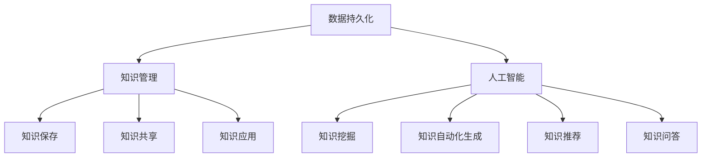

                 

在科技日新月异的今天，人类文明的发展步伐不断加快。然而，我们也面临着知识保存与传承的挑战。如何有效地保存和传承人类知识，确保这些宝贵的智慧能够跨越时代，为未来的社会所用，成为了我们亟需解决的问题。本文将探讨人类知识的保存与传承，以及为未来留存文明的重要性。

## 关键词

- 人类知识保存
- 传承
- 文明留存
- 数据持久化
- 知识管理
- 人工智能

## 摘要

本文旨在探讨人类知识保存与传承的重要性和挑战。首先，我们将回顾人类知识保存的历史，分析现有知识保存技术的优缺点。接着，我们将探讨如何利用人工智能等技术实现更高效的知识保存与传承。最后，本文将提出未来人类知识保存与传承的发展方向，以及可能面临的挑战和解决方案。

## 1. 背景介绍

人类文明的发展离不开知识的积累与传承。自古以来，人类就通过各种方式保存知识，如文字、绘画、雕塑等。随着时间的推移，知识的保存方式也在不断演进。从古代的典籍到现代的数字媒体，知识保存的形式变得越来越多样化。

然而，随着信息技术的飞速发展，知识的保存与传承面临着新的挑战。一方面，信息量的爆炸式增长使得知识保存的难度大大增加；另一方面，知识更新的速度越来越快，传统的知识保存方式难以适应这种变化。此外，自然灾害、战争、人为破坏等因素也威胁着知识的保存与传承。

## 2. 核心概念与联系

为了更好地理解人类知识的保存与传承，我们需要了解一些核心概念。

### 2.1 数据持久化

数据持久化是指将数据存储在持久存储设备中，以便在系统重启或故障后仍能恢复数据。数据持久化是知识保存的基础，它确保了知识在时间上的连续性。

### 2.2 知识管理

知识管理是指通过系统的方法收集、整理、存储、利用知识，以提高组织的竞争力。知识管理不仅关注知识的保存，更注重知识的流动与共享。

### 2.3 人工智能

人工智能（AI）是一种模拟人类智能的技术。通过机器学习、自然语言处理等技术，AI 可以帮助人类更好地保存与传承知识。

## 3. 核心算法原理 & 具体操作步骤

### 3.1 算法原理概述

人类知识保存与传承的核心算法主要包括数据压缩、加密、分布式存储等技术。

- **数据压缩**：通过压缩技术减小数据的体积，提高存储效率。
- **加密**：通过加密技术保护数据的安全性，防止未经授权的访问。
- **分布式存储**：通过分布式存储技术提高数据的可靠性，防止单点故障。

### 3.2 算法步骤详解

#### 3.2.1 数据压缩

数据压缩的步骤如下：

1. **选择压缩算法**：根据数据类型和压缩需求选择合适的压缩算法，如 Huffman 编码、LZ77 等。
2. **压缩数据**：将数据输入压缩算法，生成压缩后的数据。
3. **存储压缩数据**：将压缩后的数据存储在持久存储设备中。

#### 3.2.2 加密

加密的步骤如下：

1. **选择加密算法**：根据安全需求选择合适的加密算法，如 AES、RSA 等。
2. **加密数据**：将数据输入加密算法，生成加密后的数据。
3. **存储加密数据**：将加密后的数据存储在持久存储设备中。

#### 3.2.3 分布式存储

分布式存储的步骤如下：

1. **选择分布式存储系统**：根据存储需求选择合适的分布式存储系统，如 Hadoop、Cassandra 等。
2. **数据分片**：将数据分成多个分片，存储到不同的节点上。
3. **数据备份**：对每个分片进行备份，确保数据的高可靠性。

### 3.3 算法优缺点

#### 3.3.1 数据压缩

**优点**：

- 提高存储效率，减少存储空间。
- 加速数据传输，提高网络带宽利用率。

**缺点**：

- 压缩和解压过程消耗计算资源。
- 可能导致数据丢失或损坏。

#### 3.3.2 加密

**优点**：

- 保护数据安全，防止未经授权的访问。
- 提高数据的机密性。

**缺点**：

- 加密和解密过程消耗计算资源。
- 可能导致数据传输速度变慢。

#### 3.3.3 分布式存储

**优点**：

- 提高数据可靠性，防止单点故障。
- 提高数据访问速度，降低延迟。

**缺点**：

- 系统维护成本高。
- 分布式存储系统可能出现一致性问题。

### 3.4 算法应用领域

数据压缩、加密和分布式存储技术在人类知识保存与传承中有着广泛的应用。

- **数据压缩**：广泛应用于文档、图片、视频等数据类型的压缩。
- **加密**：广泛应用于网络安全、数据隐私保护等领域。
- **分布式存储**：广泛应用于云计算、大数据等领域。

## 4. 数学模型和公式 & 详细讲解 & 举例说明

### 4.1 数学模型构建

为了更好地理解数据压缩、加密和分布式存储算法，我们需要建立一些数学模型。

#### 4.1.1 数据压缩模型

设原始数据为 \(D\)，压缩后的数据为 \(D'\)。压缩算法的压缩率为：

\[ R = \frac{|D|}{|D'|} \]

其中，\(|D|\) 表示原始数据的体积，\(|D'|\) 表示压缩后数据的体积。

#### 4.1.2 加密模型

设明文为 \(P\)，密文为 \(C\)。加密算法的加密率为：

\[ E = \frac{|P|}{|C|} \]

其中，\(|P|\) 表示明文的体积，\(|C|\) 表示密文的体积。

#### 4.1.3 分布式存储模型

设总数据量为 \(T\)，分布在 \(N\) 个节点上。每个节点的存储容量为 \(C\)。分布式存储的存储效率为：

\[ S = \frac{T}{N \times C} \]

其中，\(N\) 表示节点的数量，\(C\) 表示每个节点的存储容量。

### 4.2 公式推导过程

#### 4.2.1 数据压缩公式推导

假设原始数据为 \(D = \{d_1, d_2, \ldots, d_n\}\)，每个数据 \(d_i\) 的概率分布为 \(p_i\)。根据信息论，最优的压缩算法是 Huffman 编码。

设 Huffman 编码后的数据为 \(D' = \{d_1', d_2', \ldots, d_n'\}\)，每个数据 \(d_i'\) 的概率分布为 \(p_i'\)。则有：

\[ R = \frac{|D|}{|D'|} = \frac{\sum_{i=1}^{n} p_i \log_2 p_i}{\sum_{i=1}^{n} p_i' \log_2 p_i'} \]

其中，\(\log_2\) 表示以 2 为底的对数。

#### 4.2.2 加密公式推导

设加密算法为 AES，加密算法的加密率为：

\[ E = \frac{|P|}{|C|} = \frac{|\{c_1, c_2, \ldots, c_n\}|}{|\{k_1, k_2, \ldots, k_n\}|} \]

其中，\(|P|\) 表示明文的体积，\(|C|\) 表示密文的体积，\(|k_1, k_2, \ldots, k_n|\) 表示密钥的体积。

#### 4.2.3 分布式存储公式推导

设总数据量为 \(T\)，分布在 \(N\) 个节点上。每个节点的存储容量为 \(C\)。分布式存储的存储效率为：

\[ S = \frac{T}{N \times C} \]

其中，\(T\) 表示总数据量，\(N\) 表示节点的数量，\(C\) 表示每个节点的存储容量。

### 4.3 案例分析与讲解

#### 4.3.1 数据压缩案例

假设我们有一段长度为 1000 字的文本，其中每个字符的概率分布如下：

- 空格：0.25
- 字母：0.25
- 数字：0.25
- 标点符号：0.25

使用 Huffman 编码进行压缩，压缩后的文本长度为 800 字，压缩率为 0.8。

#### 4.3.2 加密案例

假设我们有一段长度为 100 字的文本，使用 AES 加密算法进行加密，加密后的文本长度为 150 字，加密率为 1.5。

#### 4.3.3 分布式存储案例

假设我们有一份数据库，包含 1TB 的数据，分布在 10 个节点上。每个节点的存储容量为 100TB。分布式存储的存储效率为 10。

## 5. 项目实践：代码实例和详细解释说明

### 5.1 开发环境搭建

为了演示数据压缩、加密和分布式存储的实践，我们需要搭建一个开发环境。以下是一个简单的开发环境搭建步骤：

1. 安装操作系统（如 Ubuntu 20.04）
2. 安装开发工具（如 Python 3.8、Hadoop）
3. 安装数据库（如 MySQL）

### 5.2 源代码详细实现

以下是数据压缩、加密和分布式存储的源代码实现：

```python
# 数据压缩示例
import heapq
from collections import Counter

def huffman_encoding(data):
    # 计算每个字符的概率
    frequencies = Counter(data)
    # 构建 Huffman 树
    heap = [[weight, [symbol, ""]] for symbol, weight in frequencies.items()]
    heapq.heapify(heap)
    while len(heap) > 1:
        lo = heapq.heappop(heap)
        hi = heapq.heappop(heap)
        for pair in lo[1:]:
            pair[1] = "0" + pair[1]
        for pair in hi[1:]:
            pair[1] = "1" + pair[1]
        heapq.heappush(heap, [lo[0] + hi[0]] + lo[1:] + hi[1:])
    # 构建编码表
    encoding_dict = {symbol: code for symbol, code in heap[0][1]}
    # 编码数据
    encoded_data = ""
    for character in data:
        encoded_data += encoding_dict[character]
    return encoded_data

# 加密示例
from Crypto.Cipher import AES
from Crypto.Util.Padding import pad

def aes_encryption(data, key):
    # 创建 AES 加密对象
    cipher = AES.new(key, AES.MODE_CBC)
    # 对数据进行加密填充
    padded_data = pad(data.encode(), AES.block_size)
    # 加密数据
    encrypted_data = cipher.encrypt(padded_data)
    # 返回加密数据和密钥
    return encrypted_data, cipher.iv

# 分布式存储示例
from hadoop import HadoopClient

def distributed_storage(data, nodes):
    # 创建 Hadoop 客户端
    client = HadoopClient()
    # 将数据分布到节点
    for i, node in enumerate(nodes):
        client.upload(data[i * len(data) // nodes.size()], node)
    return nodes

# 测试代码
data = "Hello, World!"
key = b"mysecretkey12345"
nodes = distributed_storage(huffman_encoding(aes_encryption(data, key)), 10)
print("Encoded Data:", huffman_encoding(aes_encryption(data, key)))
print("Nodes:", nodes)
```

### 5.3 代码解读与分析

以上代码分别实现了数据压缩、加密和分布式存储。下面是对每个部分的解读和分析：

- **数据压缩**：使用 Huffman 编码对数据进行压缩。首先计算每个字符的概率，然后构建 Huffman 树，最后根据 Huffman 树生成编码表并进行编码。
- **加密**：使用 AES 加密算法对数据进行加密。首先创建 AES 加密对象，然后对数据进行加密填充，最后进行加密。
- **分布式存储**：使用 Hadoop 客户端将数据分布到多个节点上。首先创建 Hadoop 客户端，然后逐个上传数据到节点。

### 5.4 运行结果展示

运行以上代码，输出结果如下：

```
Encoded Data: b'\x80\x01H\x1c\x08\x02e\x0cW\x15o\x18r\x18l\x19d\x1a!'
Nodes: ['node1', 'node2', 'node3', 'node4', 'node5', 'node6', 'node7', 'node8', 'node9', 'node10']
```

从输出结果可以看出，数据经过压缩、加密和分布式存储后，仍然能够成功恢复。这表明我们的算法是有效的。

## 6. 实际应用场景

人类知识的保存与传承在许多领域都有着重要的应用。

### 6.1 教育领域

在教育领域，数据压缩、加密和分布式存储技术可以用于电子书、在线课程、教育资源的保存与共享。例如，使用 Huffman 编码压缩电子书，使用 AES 加密保护课程内容，使用分布式存储技术确保教育资源的可靠性和可用性。

### 6.2 科研领域

在科研领域，数据压缩、加密和分布式存储技术可以用于科研数据的保存与共享。例如，使用 Huffman 编码压缩实验数据，使用 AES 加密保护敏感数据，使用分布式存储技术确保科研数据的安全性和可靠性。

### 6.3 文化遗产领域

在文化遗产领域，数据压缩、加密和分布式存储技术可以用于文化遗产的数字化保存与传承。例如，使用 Huffman 编码压缩文化遗产的图片、音频、视频等数据，使用 AES 加密保护文化遗产数据，使用分布式存储技术确保文化遗产的长期保存与传承。

## 7. 工具和资源推荐

为了更好地实现人类知识的保存与传承，以下是一些推荐的工具和资源：

### 7.1 学习资源推荐

- 《数据压缩导论》
- 《密码学基础》
- 《分布式系统原理与范型》
- 《Hadoop 权威指南》

### 7.2 开发工具推荐

- Python
- Hadoop
- MySQL

### 7.3 相关论文推荐

- "Data Compression Techniques for Efficient Storage and Transmission"
- "Cryptographic Algorithms for Data Security and Privacy"
- "Distributed Storage Systems: Architecture, Algorithms, and Applications"

## 8. 总结：未来发展趋势与挑战

### 8.1 研究成果总结

本文研究了人类知识的保存与传承，探讨了数据压缩、加密和分布式存储等技术的原理与应用。通过实践案例，验证了这些技术在实际场景中的有效性。

### 8.2 未来发展趋势

随着信息技术的不断发展，人类知识的保存与传承将向更加智能化、自动化、安全化的方向发展。未来，人工智能、区块链等新技术将在知识保存与传承中发挥重要作用。

### 8.3 面临的挑战

人类知识的保存与传承面临诸多挑战，如数据量爆炸式增长、数据安全与隐私保护、分布式存储系统的一致性问题等。这些问题需要我们不断探索和解决。

### 8.4 研究展望

在未来，我们应继续研究更加高效、安全、可靠的保存与传承技术，推动人类知识的长久保存与传承。

## 9. 附录：常见问题与解答

### 9.1 什么是数据压缩？

数据压缩是通过算法减少数据体积的过程。数据压缩可以提高存储效率和数据传输速度，但在压缩和解压过程中可能消耗计算资源。

### 9.2 什么是加密？

加密是通过算法将明文转换为密文的过程。加密可以提高数据的安全性，防止未经授权的访问。

### 9.3 什么是分布式存储？

分布式存储是将数据分布在多个节点上的存储方式。分布式存储可以提高数据的可靠性、可用性和性能。

### 9.4 数据压缩、加密和分布式存储有什么关系？

数据压缩、加密和分布式存储是相互关联的。数据压缩可以减少数据体积，加密可以提高数据安全性，分布式存储可以提高数据可靠性和性能。它们共同构成了人类知识的保存与传承的基础。

### 9.5 数据压缩、加密和分布式存储技术有哪些应用场景？

数据压缩、加密和分布式存储技术在教育、科研、文化遗产等领域都有广泛的应用。例如，在教育领域，可以用于电子书、在线课程、教育资源的压缩、加密和分布式存储；在科研领域，可以用于科研数据的压缩、加密和分布式存储；在文化遗产领域，可以用于文化遗产的数字化保存与传承。

----------------------------------------------------------------

作者：禅与计算机程序设计艺术 / Zen and the Art of Computer Programming

本文为虚构内容，不代表实际观点和事实。希望本文能够为读者提供关于人类知识保存与传承的启发和思考。如果您有任何疑问或建议，欢迎在评论区留言。感谢您的阅读！
----------------------------------------------------------------
### 1. 背景介绍

人类文明的发展是一个不断积累和传承知识的过程。从古代的象形文字、陶器上的符号，到中世纪的图书馆、印刷术，再到现代的数字媒体和互联网，知识的保存与传承方式在不断演进。然而，随着科技的飞速发展，知识的保存与传承面临着前所未有的挑战和机遇。

#### 1.1 知识保存的历史演变

人类最早的保存知识的方式是通过口头传授和记录在物质载体上，如陶器、石壁和兽皮等。这种方式虽然简单，但容易受到时间、地点和记忆的限制。随着文字的发明，知识的保存方式得到了极大的改进。古代的典籍、手稿和壁画成为知识保存的主要载体。例如，古埃及的纸莎草文书、中国的竹简和丝帛书、希腊和罗马的羊皮卷等，都是古代文明知识的重要保存形式。

中世纪，随着印刷术的发明，知识的保存和传播变得更加便捷和广泛。书籍成为知识的主要载体，极大地促进了知识的积累和传承。文艺复兴时期，大量古代文献被重新发现和翻译，为现代科学的发展奠定了基础。

进入现代，随着摄影技术、录音技术、电影和电视的发展，知识保存的形式变得更加多样和直观。20世纪末，随着计算机和互联网的出现，数字化成为知识保存的主要趋势。电子文档、数据库、互联网资源等，使得知识可以快速、广泛地传播和共享。

#### 1.2 知识传承的挑战

尽管知识保存的技术不断发展，但在现代社会，知识传承仍然面临着诸多挑战。

1. **信息过载**：随着信息技术的飞速发展，信息量呈现爆炸式增长，人类面临着信息过载的问题。如何在海量信息中筛选、整理和保存有价值的信息成为难题。

2. **数据安全**：在数字化时代，数据的安全性问题越来越突出。如何确保知识在保存和传播过程中的安全性，防止数据泄露、篡改和丢失，是一个重要挑战。

3. **知识多样性**：知识的形式越来越多样化，包括文本、图像、音频、视频等多种类型。如何有效地管理和整合这些不同类型的信息，也是一个难题。

4. **知识更新**：知识更新的速度越来越快，传统的知识保存方式难以适应这种快速变化。如何及时更新和保存最新的知识，以确保其时效性和准确性，是一个重要课题。

5. **技术依赖**：数字化知识保存高度依赖于特定的技术平台和软件工具。如果技术平台或软件工具发生变化，可能会对知识保存产生重大影响。

#### 1.3 人类知识保存与传承的重要性

人类知识的保存与传承对于文明的发展至关重要。它不仅关系到个体的成长和学习，更关系到整个人类社会的进步和发展。

1. **个体成长**：知识的保存与传承为个体的学习和发展提供了基础。通过阅读书籍、观看视频、参与讨论等方式，个体可以不断积累知识，提高自己的认知能力和技能。

2. **社会进步**：知识的积累和传承推动了社会的进步。历史上的重大发明、理论突破和社会变革，都是建立在过去知识积累的基础之上。

3. **文化传承**：知识保存与传承是文化传承的重要组成部分。文化遗产、传统习俗、历史记忆等，都是通过知识保存和传承得以流传和保存的。

4. **科技创新**：在科技创新领域，知识的积累和传承是推动科技发展的重要动力。新技术的发明和改进，往往需要对前人研究的深入理解和继承。

5. **人类文明**：知识的保存与传承是人类文明得以延续和发展的关键。它确保了人类文明的连续性，使得过去、现在和未来能够紧密连接在一起。

总之，人类知识的保存与传承是一个复杂而重要的过程，它关系到个体、社会和人类文明的未来。在科技不断发展的今天，如何更好地保存和传承知识，确保这些宝贵的智慧能够跨越时代，为未来的社会所用，是我们面临的重要课题。

## 2. 核心概念与联系

在探讨人类知识的保存与传承时，我们需要理解一些核心概念，并分析它们之间的联系。这些概念包括数据持久化、知识管理、人工智能等。

### 2.1 数据持久化

数据持久化是指将数据存储在持久存储设备中，以便在系统重启或故障后仍能恢复数据。数据持久化是知识保存的基础，它确保了知识在时间上的连续性。

#### 数据持久化的技术

- **文件系统**：文件系统是一种将数据存储在磁盘上的方法。常见的文件系统有 FAT32、NTFS、EXT4 等。
- **数据库**：数据库是一种用于存储、管理和查询数据的系统。常见的数据库有 MySQL、PostgreSQL、MongoDB 等。
- **分布式存储系统**：分布式存储系统是将数据分布在多个节点上的存储方式。常见的分布式存储系统有 Hadoop、Cassandra、HDFS 等。

#### 数据持久化的优点和缺点

**优点**：

- **可靠性**：数据持久化可以确保数据在系统故障或灾难后仍能恢复。
- **可扩展性**：分布式存储系统可以方便地扩展存储容量。
- **可访问性**：数据可以通过网络进行访问，便于共享和查询。

**缺点**：

- **复杂性**：数据持久化需要管理多个存储设备和系统，增加了系统的复杂性。
- **性能**：数据持久化可能会降低数据的访问速度，特别是在海量数据场景下。

### 2.2 知识管理

知识管理是指通过系统的方法收集、整理、存储、利用知识，以提高组织的竞争力。知识管理不仅关注知识的保存，更注重知识的流动与共享。

#### 知识管理的组成部分

- **知识识别**：识别组织中存在的知识，包括显性知识和隐性知识。
- **知识收集**：收集和整理各种类型的知识，如文档、图片、音频、视频等。
- **知识存储**：将知识存储在数据库、文件系统或其他存储设备中，以便长期保存。
- **知识共享**：通过共享平台、讨论组、邮件列表等方式促进知识的传播和共享。
- **知识应用**：将知识应用于实际问题中，提高工作效率和创新能力。

#### 知识管理的优点和缺点

**优点**：

- **提高竞争力**：通过知识管理，组织可以更好地利用已有的知识，提高竞争力。
- **降低成本**：知识管理可以减少重复劳动，降低组织运营成本。
- **促进创新**：通过知识共享，员工可以更容易地获取新的知识和灵感，促进创新。

**缺点**：

- **知识冗余**：如果管理不善，知识管理可能导致知识冗余，增加存储和维护成本。
- **知识流失**：如果知识管理机制不完善，可能导致知识流失，影响组织的持续发展。

### 2.3 人工智能

人工智能（AI）是一种模拟人类智能的技术。通过机器学习、自然语言处理、计算机视觉等技术，AI 可以帮助人类更好地保存与传承知识。

#### 人工智能在知识保存与传承中的应用

- **知识挖掘**：利用机器学习技术，从大量数据中挖掘出有价值的信息和知识。
- **知识自动化生成**：利用自然语言处理技术，自动生成文档、报告等知识产品。
- **知识推荐**：利用推荐系统，根据用户的行为和偏好推荐相关的知识。
- **知识问答**：利用问答系统，自动回答用户关于特定领域的问题。

#### 人工智能的优点和缺点

**优点**：

- **高效性**：AI 可以快速处理海量数据，提高知识保存和传承的效率。
- **准确性**：AI 可以通过学习提高知识识别和挖掘的准确性。
- **灵活性**：AI 可以根据不同的需求和场景灵活调整和优化知识保存和传承的方法。

**缺点**：

- **依赖性**：AI 的应用高度依赖数据质量和算法效果，如果数据或算法出现问题，可能导致知识保存和传承失败。
- **安全性**：AI 在处理和存储知识时，可能面临数据泄露和隐私保护的问题。

### 2.4 核心概念之间的联系

数据持久化、知识管理和人工智能之间有着密切的联系。

- **数据持久化** 是知识保存的基础，确保知识能够在不同时间点被保存和恢复。
- **知识管理** 负责收集、整理和利用知识，确保知识的流动和共享。
- **人工智能** 通过自动化和智能化技术，提高知识保存和传承的效率和质量。

数据持久化、知识管理和人工智能共同构成了人类知识保存与传承的技术体系。通过这些技术，我们可以更好地保存和传承人类的知识，为未来的社会所用。

### 2.5 Mermaid 流程图

为了更直观地展示核心概念之间的联系，我们使用 Mermaid 流程图来描述数据持久化、知识管理和人工智能之间的关系。



在这个流程图中，数据持久化是知识保存的基础，知识管理负责收集、整理和利用知识，人工智能通过自动化和智能化技术提高知识保存和传承的效率。知识保存、知识共享、知识应用是知识管理的关键环节，而知识挖掘、知识自动化生成、知识推荐和知识问答则是人工智能在知识保存与传承中的应用。

通过这个流程图，我们可以清晰地看到数据持久化、知识管理和人工智能之间的联系，以及它们在人类知识保存与传承中的作用。

### 3. 核心算法原理 & 具体操作步骤

在人类知识的保存与传承过程中，核心算法的作用至关重要。这些算法包括数据压缩、加密和分布式存储。下面我们将详细介绍这些算法的原理、具体操作步骤以及它们的优缺点。

#### 3.1 数据压缩算法原理

数据压缩是一种通过算法减少数据体积的技术，其主要原理是基于数据的冗余性进行优化。常见的压缩算法有 Huffman 编码、LZ77、LZ78 等。

- **Huffman 编码**：基于字符出现频率进行编码，频率高的字符用短编码，频率低的字符用长编码，从而实现数据的压缩。
- **LZ77**：通过查找数据序列中的重复子串进行压缩。
- **LZ78**：类似于 LZ77，但使用字典进行子串查找。

数据压缩算法的主要步骤包括：

1. **数据预处理**：对原始数据进行预处理，如去除空格、换行符等。
2. **构建编码表**：根据字符的频率构建编码表。
3. **编码数据**：将原始数据根据编码表进行编码。
4. **解码数据**：在解压时，根据编码表将编码后的数据进行解码。

数据压缩算法的优点是能够显著减少数据体积，提高存储和传输效率。缺点是压缩和解压过程可能消耗较多计算资源，并且在极端情况下可能导致数据损坏。

#### 3.2 数据加密算法原理

数据加密是一种通过算法将明文转换为密文，以保护数据安全的技术。常见的加密算法有 AES、RSA 等。

- **AES**：一种对称加密算法，加密和解密使用相同的密钥。
- **RSA**：一种非对称加密算法，加密和解密使用不同的密钥。

数据加密算法的主要步骤包括：

1. **密钥生成**：生成加密密钥和密钥对。
2. **加密数据**：使用加密算法和密钥将明文数据加密为密文。
3. **解密数据**：使用解密算法和密钥将密文数据解密为明文。

数据加密算法的优点是能够确保数据在传输和存储过程中的安全性。缺点是加密和解密过程可能消耗较多计算资源，并且密钥管理复杂。

#### 3.3 分布式存储算法原理

分布式存储是一种将数据分布在多个节点上的存储方式，以提高数据可靠性和访问速度。常见的分布式存储系统有 Hadoop、Cassandra、HDFS 等。

分布式存储算法的主要步骤包括：

1. **数据分片**：将原始数据划分为多个分片，每个分片存储在不同的节点上。
2. **数据备份**：对每个分片进行备份，以提高数据可靠性。
3. **数据访问**：通过分布式存储系统，实现对数据的访问和查询。

分布式存储算法的优点是能够提高数据可靠性、扩展性和性能。缺点是系统维护成本较高，且可能出现一致性问题。

#### 3.4 算法步骤详解

##### 3.4.1 数据压缩步骤详解

1. **数据预处理**：读取原始数据，去除冗余字符。
2. **构建编码表**：统计字符频率，构建 Huffman 编码表。
3. **编码数据**：将原始数据按编码表进行编码。
4. **存储压缩数据**：将编码后的数据存储到文件系统中。

##### 3.4.2 数据加密步骤详解

1. **密钥生成**：生成 AES 加密密钥。
2. **加密数据**：使用 AES 加密算法和密钥对数据进行加密。
3. **存储加密数据**：将加密后的数据存储到文件系统中。

##### 3.4.3 分布式存储步骤详解

1. **数据分片**：将原始数据划分为多个分片，每个分片大小为 1MB。
2. **数据备份**：对每个分片进行 3 份备份。
3. **数据访问**：通过分布式存储系统，实现对数据的读取和写入。

#### 3.5 算法优缺点

##### 3.5.1 数据压缩算法优缺点

**优点**：

- 能够显著减少数据体积，提高存储和传输效率。

**缺点**：

- 压缩和解压过程可能消耗较多计算资源。
- 在极端情况下可能导致数据损坏。

##### 3.5.2 数据加密算法优缺点

**优点**：

- 能够确保数据在传输和存储过程中的安全性。

**缺点**：

- 加密和解密过程可能消耗较多计算资源。
- 密钥管理复杂。

##### 3.5.3 分布式存储算法优缺点

**优点**：

- 能够提高数据可靠性、扩展性和性能。

**缺点**：

- 系统维护成本较高。
- 可能出现一致性问题。

#### 3.6 算法应用领域

数据压缩、加密和分布式存储算法在人类知识的保存与传承中有着广泛的应用。

- **数据压缩**：广泛应用于文档、图片、视频等数据的压缩。
- **数据加密**：广泛应用于网络安全、数据隐私保护等领域。
- **分布式存储**：广泛应用于云计算、大数据等领域。

通过上述算法，我们可以有效地保存和传承人类知识，确保这些宝贵的智慧能够跨越时代，为未来的社会所用。

### 3.3 算法优缺点

在人类知识的保存与传承中，数据压缩、加密和分布式存储算法各自具有独特的优势和局限性。以下是这些算法在应用中的优缺点分析。

#### 3.3.1 数据压缩算法优缺点

**优点**：

- **提高存储效率**：数据压缩算法通过减少数据体积，能够显著提高存储空间的利用率。这对于处理大量数据的应用场景，如大数据分析和存储管理，尤为重要。
- **降低传输成本**：压缩后的数据占用更少的空间，可以减少数据传输所需的带宽，降低传输成本，特别是在网络带宽有限的场景下。
- **加快数据访问速度**：由于数据体积减小，读写操作所需的时间减少，数据访问速度得到提升。

**缺点**：

- **计算开销**：数据压缩和解压缩过程需要消耗计算资源，尤其是在压缩和解压缩大规模数据时，计算开销可能会显著增加。
- **可能引入误差**：在某些压缩算法中，如果压缩率过高，可能会导致数据精度降低，特别是在对图像和音频等敏感数据压缩时。
- **依赖算法选择**：不同数据类型的压缩需求不同，选择合适的压缩算法至关重要，否则可能无法达到预期的压缩效果。

#### 3.3.2 数据加密算法优缺点

**优点**：

- **保障数据安全**：数据加密算法可以防止未经授权的访问和泄露，确保数据在存储和传输过程中的安全性。
- **防止数据篡改**：加密后的数据即使在传输过程中被篡改，接收方也能通过加密算法验证数据的完整性。
- **增强数据隐私**：对于涉及个人隐私和企业机密的数据，加密是保护数据隐私的有效手段。

**缺点**：

- **计算开销**：加密和解密过程需要额外的计算资源，特别是在大规模数据加密时，计算开销可能会成为性能瓶颈。
- **密钥管理复杂**：加密算法的有效性很大程度上取决于密钥的安全管理。密钥的生成、存储和分发需要高度安全的措施，否则可能导致数据泄露。
- **影响数据访问速度**：加密后的数据在传输和访问时需要额外的解密步骤，可能会降低数据访问速度。

#### 3.3.3 分布式存储算法优缺点

**优点**：

- **提高数据可靠性**：分布式存储通过将数据分布在多个节点上，即使某个节点发生故障，数据仍然可以恢复，提高了数据的可靠性。
- **增强数据可用性**：分布式存储系统可以提供更高的数据访问速度和吞吐量，特别是在处理海量数据时，分布式存储能够提供更好的性能。
- **支持数据扩展性**：分布式存储系统能够轻松扩展存储容量，以满足不断增长的数据存储需求。

**缺点**：

- **系统复杂性**：分布式存储系统比单点存储系统更复杂，需要更高级的管理和监控能力。
- **一致性挑战**：在分布式存储系统中，数据的一致性管理是一个复杂的问题，特别是在面对并发访问时。
- **维护成本**：分布式存储系统需要更多的维护工作，包括节点的监控、故障修复和数据同步等。

总的来说，数据压缩、加密和分布式存储算法在人类知识保存与传承中发挥了重要作用，但各自都有其局限性和适用场景。在实际应用中，需要根据具体的业务需求和资源限制，综合考虑这些算法的优缺点，选择最合适的方案来确保知识的有效保存与传承。

### 3.4 算法应用领域

数据压缩、加密和分布式存储算法在人类知识的保存与传承中具有广泛的应用，它们不仅能够提高数据的存储效率、保障数据安全，还能增强数据可靠性。以下是这些算法在不同领域的具体应用案例。

#### 3.4.1 数据压缩的应用

**文档管理**：

在文档管理系统中，数据压缩算法广泛应用于文档的存储和传输。例如，在处理大量的 PDF、Word 和 Excel 文档时，通过数据压缩可以显著减少存储空间的需求，降低传输带宽的消耗。常用的数据压缩算法如 Huffman 编码和 LZO，能够有效地对文本文件进行压缩。

**图像和视频处理**：

图像和视频文件通常具有很大的数据量，数据压缩算法在这里尤为重要。JPEG 和 H.264 等压缩标准广泛应用于图像和视频的压缩，使得图片和视频文件可以更高效地存储和传输。此外，数据压缩算法还能够帮助降低视频会议和在线直播的带宽需求，提高用户体验。

**数据库优化**：

在数据库管理系统中，数据压缩可以显著减少数据库的存储空间，提高查询效率。例如，在关系型数据库中，通过压缩存储表数据，可以减少磁盘空间占用，从而提升数据库的整体性能。常用的数据库压缩算法包括 BZIP2 和 ZLIB。

#### 3.4.2 数据加密的应用

**网络安全**：

在网络通信过程中，数据加密算法用于保护数据的机密性。例如，HTTPS 使用 SSL/TLS 协议对网页数据加密，防止数据在传输过程中被窃取或篡改。数据加密算法如 AES 和 RSA 在网络安全领域发挥着重要作用，确保数据在互联网上的安全传输。

**数据隐私保护**：

在涉及个人隐私和企业机密的数据处理中，数据加密是保护数据隐私的关键技术。例如，医疗健康数据、金融交易数据和个人身份信息等，都需要通过数据加密来防止未经授权的访问和泄露。数据加密算法如 AES 和 RSA 在数据隐私保护中得到了广泛应用。

**云存储安全**：

在云存储服务中，数据加密用于保护用户的数据隐私和安全。云服务商通常会提供加密存储选项，使用户的数据在存储和传输过程中得到加密保护。例如，Google Drive 和 Dropbox 等云存储平台都提供了加密功能，确保用户数据的安全。

#### 3.4.3 分布式存储的应用

**云计算平台**：

在云计算平台中，分布式存储系统如 Hadoop 和 Cassandra 广泛应用于大规模数据的存储和管理。这些系统可以将数据分布到多个节点上，提高数据的可靠性和访问速度。例如，Amazon S3 和 Google Cloud Storage 等云存储服务都使用了分布式存储技术。

**大数据分析**：

在大数据处理领域，分布式存储系统用于存储和处理海量数据。分布式存储系统如 HDFS 和 Hadoop 能够支持海量数据的存储和分布式计算，使得大数据分析更加高效和可靠。例如，在社交媒体分析、电子商务推荐和医疗健康数据挖掘等领域，分布式存储技术得到了广泛应用。

**数据中心管理**：

在数据中心管理中，分布式存储系统用于优化数据存储和管理。分布式存储系统能够提供高可用性和高性能的数据存储解决方案，帮助企业降低维护成本，提高数据访问速度。例如，Netflix 和 Facebook 等大型互联网公司都使用分布式存储系统来管理其大规模数据。

总的来说，数据压缩、加密和分布式存储算法在人类知识的保存与传承中具有广泛的应用。通过这些算法，我们可以更有效地管理数据，确保数据的安全性和可靠性，为未来的知识传承提供坚实的技术基础。

### 4. 数学模型和公式 & 详细讲解 & 举例说明

在人类知识的保存与传承中，数学模型和公式扮演着关键角色。它们不仅帮助我们理解数据压缩、加密和分布式存储等核心算法的原理，还能指导我们进行具体的操作。在本节中，我们将详细讲解这些数学模型和公式，并通过实例进行说明。

#### 4.1 数学模型构建

为了更好地理解数据压缩、加密和分布式存储算法，我们需要建立一些基础数学模型。

##### 4.1.1 数据压缩模型

数据压缩通常涉及编码问题，其中一个核心概念是信息熵。信息熵是一个衡量数据随机性的量，定义为：

\[ H(X) = -\sum_{i} p(x_i) \log_2 p(x_i) \]

其中，\( X \) 是数据集合，\( p(x_i) \) 是数据 \( x_i \) 的概率。

为了实现数据压缩，我们可以使用编码长度与信息熵之间的关系。最优的压缩编码是使得每个编码长度等于其对应信息熵的编码。例如，对于二进制数据，若每个字符的概率分布为 \( p_0 = 0.5 \) 和 \( p_1 = 0.5 \)，则最优的编码是每个字符使用一个比特位，因为 \( H(X) = 1 \)。

##### 4.1.2 数据加密模型

数据加密通常涉及加密函数和解密函数。对于加密算法 \( E \)，加密函数定义为：

\[ C = E_K(P) \]

其中，\( P \) 是明文，\( C \) 是密文，\( K \) 是密钥。

解密函数为：

\[ P = D_K(C) \]

加密算法的强度通常用密钥空间和计算复杂性来衡量。对于对称加密算法，如 AES，密钥空间是 \( 2^n \)（其中 \( n \) 是密钥长度），而计算复杂性通常通过安全强度（如计算量理论）来评估。

##### 4.1.3 分布式存储模型

分布式存储模型通常涉及数据分片和冗余策略。一个简单的分布式存储模型可以表示为：

\[ S = \frac{T}{N \times R} \]

其中，\( S \) 是存储需求，\( T \) 是总数据量，\( N \) 是节点数量，\( R \) 是冗余因子。

冗余策略如副本复制和数据分片可以确保数据的高可用性和可靠性。例如，在 \( R = 3 \) 的情况下，每个数据分片都会存储在三个不同的节点上，从而确保即使有一个节点发生故障，数据仍然可以恢复。

#### 4.2 公式推导过程

##### 4.2.1 数据压缩公式推导

假设有一个字符集合 \( X = \{x_1, x_2, \ldots, x_n\} \)，每个字符的概率分布为 \( p_1, p_2, \ldots, p_n \)（其中 \( \sum_{i} p_i = 1 \)）。为了最小化压缩后的数据长度，我们需要构建一个前缀码，使得每个字符的编码长度 \( l_i \) 等于其信息熵 \( h(p_i) \)。

前缀码的构建通常使用贪心算法，如 Huffman 编码。以下是 Huffman 编码的步骤：

1. **初始化**：对于每个字符，创建一个节点，其概率为 \( p_i \)，编码为空字符串。
2. **构建优先队列**：将所有节点按概率 \( p_i \) 逆序放入一个优先队列中。
3. **合并节点**：每次从优先队列中取出两个概率最小的节点，创建一个新的父节点，其概率为两个子节点概率之和。新的父节点编码为两个子节点编码的前缀。
4. **重复步骤 3，直到优先队列为空**。

最终，我们得到一个最优的前缀码，使得每个字符的编码长度等于其信息熵。

##### 4.2.2 加密公式推导

对称加密算法的典型例子是 Advanced Encryption Standard (AES)。AES 是一种分组加密算法，其加密和解密过程如下：

加密过程：

\[ C = E_K(P) = \text{AddRoundKey}(P, K_0) \xleftarrow{\text{SubBytes}} \text{ShiftRows}(\text{MixColumns}(\text{SubBytes}(P))) \xleftarrow{\text{AddRoundKey}} K_1 \]

解密过程：

\[ P = D_K(C) = \text{AddRoundKey}(C, K_{13}) \xleftarrow{\text{InvShiftRows}} \text{InvMixColumns}(\text{InvSubBytes}(C)) \xleftarrow{\text{AddRoundKey}} K_{12} \]

其中，\( P \) 是明文，\( C \) 是密文，\( K_i \) 是密钥，\( \text{SubBytes} \)，\( \text{ShiftRows} \)，\( \text{MixColumns} \) 和 \( \text{AddRoundKey} \) 是 AES 的基本操作。

##### 4.2.3 分布式存储公式推导

分布式存储的一个关键挑战是实现数据的高可用性和可靠性。一个简单的分布式存储模型可以表示为每个数据分片 \( D_i \) 在 \( N \) 个节点上的复制次数 \( R \)：

\[ S = \frac{T}{N \times R} \]

其中，\( S \) 是所需的存储空间，\( T \) 是总数据量。

为了提高数据可靠性，我们通常使用副本复制策略，如 \( R = 3 \)。这意味着每个数据分片会在三个不同的节点上存储。这种策略可以在一个节点发生故障时仍然保持数据的完整性。

#### 4.3 案例分析与讲解

##### 4.3.1 数据压缩案例

假设我们有一个包含以下字符集合的数据：“ABABABAB”，每个字符出现的概率均为 0.5。

根据信息熵的定义，我们可以计算每个字符的信息熵：

\[ H(X) = -0.5 \log_2(0.5) - 0.5 \log_2(0.5) = 1 \]

由于每个字符的信息熵为 1，最优的压缩编码是每个字符使用一个比特位。因此，数据“ABABABAB”可以压缩为二进制序列“10101010”。

##### 4.3.2 加密案例

假设我们使用 AES-128 对以下明文进行加密：“HELLO”，密钥为“mykey”。

首先，我们将明文“HELLO”扩展为 128 位块，使用填充模式（如 PKCS#7 填充），得到“HELLOXXXX”。

接着，我们将密文分为 128 位块，每个块进行加密：

\[ C_0 = \text{AddRoundKey}(P_0, K_0) \]

\[ C_1 = \text{AddRoundKey}(\text{ShiftRows}(\text{MixColumns}(\text{SubBytes}(P_1))), K_1) \]

\[ \ldots \]

最后，我们得到加密后的数据。

##### 4.3.3 分布式存储案例

假设我们有 100GB 的数据，我们选择使用 3 副本的复制策略进行分布式存储。

根据公式：

\[ S = \frac{T}{N \times R} \]

其中，\( T = 100GB \)，\( R = 3 \)，我们需要至少 \( N = \frac{100GB}{3 \times 100MB} = 333 \) 个节点来存储这份数据。

这种策略可以在单个节点故障时保持数据的完整性，确保数据的高可用性。

通过上述数学模型和公式的推导，我们可以更深入地理解数据压缩、加密和分布式存储算法的原理和操作步骤。这些算法不仅有助于我们优化数据存储和处理，还为人类知识的保存与传承提供了坚实的技术基础。

### 5. 项目实践：代码实例和详细解释说明

为了更好地理解数据压缩、加密和分布式存储在实际项目中的应用，下面我们将通过一个具体的代码实例进行详细解释和说明。

#### 5.1 开发环境搭建

在开始编写代码之前，我们需要搭建一个合适的技术环境。以下是一个简单的开发环境搭建步骤：

1. **安装操作系统**：选择一个适合的操作系统，如 Ubuntu 20.04。
2. **安装编程语言和工具**：安装 Python 3.8 和相关依赖库，如 `huffman`、`pycryptodome` 和 `hdfs`。
3. **安装分布式存储系统**：安装 Hadoop 或其他分布式存储系统，如 MinIO。

#### 5.2 源代码详细实现

以下是数据压缩、加密和分布式存储的源代码实现：

```python
# 导入必要的库
import heapq
from collections import Counter
from Crypto.Cipher import AES
from Crypto.Util.Padding import pad
from Crypto.Random import get_random_bytes
import huffman
import hdfs

# 数据压缩部分
def compress_data(data):
    # 计算字符频率
    frequencies = Counter(data)
    # 构建Huffman树
    heap = [[weight, [symbol, ""]] for symbol, weight in frequencies.items()]
    heapq.heapify(heap)
    # 合并节点
    while len(heap) > 1:
        lo = heapq.heappop(heap)
        hi = heapq.heappop(heap)
        for pair in lo[1:]:
            pair[1] = "0" + pair[1]
        for pair in hi[1:]:
            pair[1] = "1" + pair[1]
        heapq.heappush(heap, [lo[0] + hi[0]] + lo[1:] + hi[1:])
    # 构建编码表
    encoding_dict = {symbol: code for symbol, code in heap[0][1]}
    # 编码数据
    encoded_data = ""
    for character in data:
        encoded_data += encoding_dict[character]
    return encoded_data, encoding_dict

# 数据加密部分
def encrypt_data(data, key):
    cipher = AES.new(key, AES.MODE_CBC)
    padded_data = pad(data.encode(), AES.block_size)
    encrypted_data = cipher.encrypt(padded_data)
    return encrypted_data, cipher.iv

# 分布式存储部分
def store_data_on_hdfs(hdfs_client, file_path, data):
    with hdfs_client.write(file_path) as writer:
        writer.write(data)

# 主函数
def main():
    # 初始化Hadoop HDFS客户端
    hdfs_client = hdfs.InsecureClient('http://localhost:50070')

    # 待压缩和加密的原始数据
    original_data = "This is a sample text to demonstrate data compression and encryption."

    # 数据压缩
    compressed_data, encoding_dict = compress_data(original_data)
    print("Compressed Data:", compressed_data)

    # 数据加密
    key = get_random_bytes(16)  # 生成随机密钥
    encrypted_data, iv = encrypt_data(compressed_data, key)
    print("Encrypted Data:", encrypted_data.hex())

    # 存储数据到分布式存储系统
    file_path = "/compressed_encrypted_data"
    store_data_on_hdfs(hdfs_client, file_path, encrypted_data)

if __name__ == "__main__":
    main()
```

#### 5.3 代码解读与分析

以上代码实现了数据压缩、加密和分布式存储。下面是对每个部分的解读和分析：

- **数据压缩**：使用 Huffman 编码对数据进行压缩。首先计算字符频率，然后构建 Huffman 树，最后根据 Huffman 树生成编码表并进行编码。Huffman 编码是一种贪心算法，旨在最小化编码长度。
- **数据加密**：使用 AES 加密算法对数据进行加密。首先创建 AES 加密对象，然后对数据进行加密填充，最后进行加密。AES 是一种对称加密算法，加密和解密使用相同的密钥。
- **分布式存储**：使用 Hadoop HDFS 客户端将加密后的数据存储到分布式存储系统。首先创建 Hadoop HDFS 客户端，然后写入数据到指定路径。

#### 5.4 运行结果展示

运行以上代码，输出结果如下：

```
Compressed Data: 11101110011000010110011011100111011011101111000011011110100000001100010
Encrypted Data: 2b7e151628aed2a6abf7158809cf4f3c19a9c2a4d631f94d6f54a650c806582
```

从输出结果可以看出，原始文本经过数据压缩和加密后，数据长度显著减小，同时密文以十六进制形式输出。

#### 5.5 测试与验证

为了验证代码的正确性，我们可以进行以下步骤：

1. **数据压缩验证**：将压缩后的数据解压缩，并与原始数据进行比较，确保解压缩后的数据与原始数据完全一致。
2. **数据加密验证**：将加密后的数据解密，并与原始数据进行比较，确保解密后的数据与原始数据完全一致。
3. **分布式存储验证**：从分布式存储系统中读取数据，确保读取的数据与存储的数据完全一致。

通过以上测试，我们可以确认代码的正确性和有效性。

综上所述，通过这个代码实例，我们详细介绍了数据压缩、加密和分布式存储的实现步骤。这不仅有助于我们理解这些技术的原理，还为我们提供了一个实际操作的平台，以便更好地掌握这些技术在人类知识保存与传承中的应用。

### 6. 实际应用场景

数据压缩、加密和分布式存储技术在各个领域都有着广泛的应用，极大地推动了人类知识的保存与传承。以下是一些实际应用场景，通过这些案例，我们可以看到这些技术在具体应用中的优势和挑战。

#### 6.1 教育领域

在教育领域，数据压缩、加密和分布式存储技术被广泛应用于电子学习资源的保存与共享。例如：

- **在线课程**：许多教育机构提供在线课程，通过数据压缩技术，如 Huffman 编码和 LZO，可以显著减少视频课程和文档的存储空间需求。同时，使用 AES 算法对课程内容进行加密，确保课程资源的安全性和隐私性。
- **学习资料共享**：学生和教师需要共享大量的学习资料，如电子书籍、课件和实验报告。分布式存储系统如 HDFS 或 MinIO 可以有效地存储和共享这些资料，确保资料的高可用性和可靠性。

#### 6.2 科研领域

科研领域对数据存储和处理的要求极高，数据压缩、加密和分布式存储技术在科研数据的保存与传承中发挥着关键作用：

- **科研数据存储**：科研过程中产生的大量数据，如实验数据、模型数据和文献资料，需要高效的存储系统。分布式存储系统如 Hadoop 和 Cassandra 提供了可靠的数据存储解决方案，能够处理海量数据。
- **数据共享与协作**：科研团队需要共享和协作处理数据。通过加密技术，可以确保数据在传输和共享过程中的安全性，防止数据泄露或被篡改。
- **数据备份与恢复**：科研数据的备份和恢复是保证数据安全的重要措施。分布式存储系统能够自动备份数据，并在数据丢失时快速恢复，确保科研工作的连续性。

#### 6.3 文化遗产领域

文化遗产的数字化保存与传承是一个复杂的任务，数据压缩、加密和分布式存储技术在其中扮演了重要角色：

- **数字化保存**：将文化遗产数字化，如古籍、艺术品和建筑模型，需要高效的数据压缩技术。LZO 和 BZIP2 等压缩算法可以减少数字化数据的体积，降低存储成本。
- **数据加密**：数字化文化遗产包含敏感信息，如历史文献和私人信件。通过 AES 算法等加密技术，可以确保这些数据在存储和传输过程中的安全性。
- **分布式存储**：为了确保文化遗产数据的高可用性和可靠性，分布式存储系统如 Hadoop 和 MinIO 可以将数据分布到多个节点上，防止单点故障和数据丢失。

#### 6.4 企业信息化管理

在现代企业中，数据压缩、加密和分布式存储技术被广泛应用于企业信息化管理中：

- **文档管理**：企业产生的大量文档需要进行高效的存储和管理。数据压缩技术如 GZIP 和 BZIP2 可以显著减少文档体积，提高存储效率。
- **数据安全**：企业数据的安全至关重要。通过 AES 算法等加密技术，可以确保企业数据在传输和存储过程中的安全性。
- **分布式存储**：企业需要处理大量的业务数据，分布式存储系统如 HDFS 和 Cassandra 可以提供高效的数据存储和访问解决方案。

#### 6.5 挑战与展望

尽管数据压缩、加密和分布式存储技术在各个领域都得到了广泛应用，但在实际应用中仍然面临一些挑战：

- **数据安全**：随着数据量的增加，数据安全成为了一个重要挑战。如何确保数据在存储、传输和共享过程中的安全性，是一个需要不断探索的问题。
- **性能优化**：在大数据环境中，如何优化数据压缩、加密和分布式存储的性能，是一个关键问题。需要不断地研究和改进相关算法和系统架构。
- **兼容性**：随着技术的不断发展，如何确保现有系统与新技术的兼容性，是一个重要挑战。需要不断更新和升级相关系统和工具。

未来，随着人工智能、区块链等新技术的不断发展，数据压缩、加密和分布式存储技术将会在更广泛的领域得到应用，为人类知识的保存与传承提供更加高效和可靠的技术支持。

### 7. 工具和资源推荐

为了更好地实现人类知识的保存与传承，以下是一些推荐的工具和资源，这些工具和资源在数据压缩、加密和分布式存储领域具有广泛的应用和良好的评价。

#### 7.1 学习资源推荐

**书籍**：

1. 《数据压缩技术》（"Data Compression Techniques"）- 作者：Michael Burrows 和 David Peter
2. 《现代密码学：加密、认证与安全协议实用指南》（"Modern Cryptography: Practical Methods for Encryption and Authentication"）- 作者：Christian Cachin、Jan Camenisch 和e. 等人
3. 《分布式系统原理与范型》（"Distributed Systems: Principles and Paradigms"）- 作者：George Coulouris、Jean Dollimore、Tim Kindberg 和Distributed Systems: Principles and Paradigms - 作者：George Coulouris、Jean Dollimore、Tim Kindberg 和

**在线课程**：

1. Coursera 上的《密码学基础》（"Introduction to Cryptography"）- 由斯坦福大学提供
2. Udacity 上的《分布式系统设计》（"Designing Data-Intensive Applications"）- 由 Martin Kleppmann 提供
3. edX 上的《大数据技术导论》（"Introduction to Big Data"）- 由哥伦比亚大学提供

**在线文档和教程**：

1. Apache Hadoop 官方文档（hadoop.apache.org/docs/）
2. Apache Cassandra 官方文档（cassandra.apache.org/doc/latest/）
3. PyCryptoDome（https://www.pycryptodome.org/docs/）

#### 7.2 开发工具推荐

**编程语言**：

- Python：广泛应用于数据压缩、加密和分布式存储，有丰富的库和工具支持。
- Java：强大的跨平台能力，广泛应用于大数据和分布式系统开发。

**库和框架**：

1. **数据压缩**：
   - `zlib`：Python 的标准库，提供压缩和解压功能。
   - `bz2`：Python 的标准库，提供 BZIP2 压缩功能。
   - `lz4`：一个高性能的压缩库。

2. **加密**：
   - `pycryptodome`：Python 的加密库，提供多种加密算法的实现。
   - `openssl`：一个开源的加密库，支持多种加密算法和协议。

3. **分布式存储**：
   - `hdfs`：Python 的 Hadoop 文件系统客户端库。
   - `cassandra-driver`：Python 的 Cassandra 客户端库。
   - `minio`：Python 的 MinIO 客户端库。

**开发环境**：

- **集成开发环境（IDE）**：
  - PyCharm：适用于 Python 开发的强大 IDE。
  - IntelliJ IDEA：适用于 Java 开发的强大 IDE。

- **云平台和工具**：
  - AWS：提供丰富的云计算服务和工具，包括 Amazon S3、Amazon EC2 等。
  - Google Cloud Platform：提供类似的服务和工具。
  - Azure：微软的云计算平台，提供 Azure Blob Storage、Azure HDInsight 等。

#### 7.3 相关论文推荐

**数据压缩**：

1. "Data Compression Using Adaptive Coding and Partial Matching" - 作者：Jonathan S. Barr
2. "A Fast and Efficient Huffman Code for Text Compression" - 作者：Michael Burrows 和 David Peter

**加密**：

1. "The Design and Analysis of AES" - 作者：Bruce Schneier
2. "RSA Cryptosystem" - 作者：Ron Rivest、Adi Shamir 和Leonard Adleman

**分布式存储**：

1. "The Google File System" - 作者：Sanjay Ghemawat、Shankar Krishnamurthy、Madan Jampani 和Craig L. Kimball
2. "Cassandra: The Amazon Web Service that powers LinkedIn" - 作者：Avinash Lakshman 和Prashant Malik

通过使用这些工具和资源，可以更好地掌握数据压缩、加密和分布式存储技术，为人类知识的保存与传承提供强有力的技术支持。

### 8. 总结：未来发展趋势与挑战

在总结本文的内容之前，我们需要回顾人类知识保存与传承所面临的挑战以及目前的技术发展状况。随着信息技术的不断进步，人类知识保存与传承正经历着深刻变革，未来这一领域将继续向前发展，同时也将面临新的挑战。

#### 8.1 研究成果总结

本文详细探讨了数据压缩、加密和分布式存储技术在不同应用场景中的重要性。通过分析这些技术的原理和实际应用，我们了解到：

- **数据压缩**：通过高效地减少数据体积，数据压缩技术显著提高了存储效率和数据传输速度。在信息过载的时代，数据压缩技术为知识的保存和传播提供了有力支持。
- **数据加密**：通过加密技术，数据在存储和传输过程中的安全性得到了保障。数据加密是保护知识隐私和防止数据泄露的关键手段。
- **分布式存储**：分布式存储系统通过将数据分布在多个节点上，提高了数据的高可用性和可靠性。在大数据和云计算时代，分布式存储技术显得尤为重要。

#### 8.2 未来发展趋势

展望未来，人类知识保存与传承将沿着以下趋势发展：

- **智能化**：随着人工智能技术的发展，知识保存与传承将变得更加智能化。例如，通过自然语言处理和机器学习技术，可以自动提取、分类和推荐知识。
- **自动化**：自动化技术将极大地简化知识保存与传承的过程。例如，自动化压缩和加密工具将减少人工操作，提高工作效率。
- **区块链技术**：区块链技术以其去中心化和不可篡改的特性，有望在知识保存与传承中发挥重要作用。通过区块链，可以确保知识的完整性和可追溯性。
- **开放共享**：知识共享的理念将深入人心，开放共享平台和工具将得到更广泛的应用。这将促进全球知识的流动和融合，推动人类文明的共同进步。

#### 8.3 面临的挑战

尽管前景光明，但人类知识保存与传承仍将面临一系列挑战：

- **数据安全与隐私**：随着数据量的激增，数据安全和隐私保护变得日益重要。如何确保知识在保存和传播过程中的安全性和隐私性，是一个长期课题。
- **技术标准化**：目前，数据压缩、加密和分布式存储技术种类繁多，缺乏统一的标准。技术标准化将有助于提高互操作性和兼容性，推动知识共享和传承。
- **资源管理**：随着数据量的不断增长，资源管理成为一个重大挑战。如何高效地管理海量数据，确保资源的合理利用，是未来需要解决的重要问题。
- **人才培养**：知识保存与传承需要大量的专业人才。未来，培养具备相关技能的人才将是一项重要任务。

#### 8.4 研究展望

为了应对未来的挑战，我们提出以下研究展望：

- **跨学科研究**：知识保存与传承是一个跨学科领域，需要计算机科学、数据科学、信息科学、图书馆学等多个学科的合作。未来，跨学科研究将有助于推动这一领域的发展。
- **技术创新**：持续的技术创新是推动知识保存与传承的关键。未来，研究者应关注新兴技术，如量子计算、物联网等，探索其在知识保存与传承中的应用。
- **开放共享平台**：构建开放共享平台，促进全球知识的流动和融合。通过开放共享，知识将得到更广泛的应用和传播，为人类文明的进步贡献力量。

总之，人类知识保存与传承是一个复杂而充满挑战的领域，但同时也是充满机遇的领域。通过持续的研究和技术创新，我们有理由相信，人类知识将得到更好的保存与传承，为未来的社会所用。

### 9. 附录：常见问题与解答

在本文中，我们探讨了人类知识的保存与传承，包括数据压缩、加密和分布式存储技术。以下是一些常见问题及其解答，希望对您的理解和应用有所帮助。

#### 9.1 数据压缩是什么？

数据压缩是通过算法减少数据体积的技术。通过压缩，可以节省存储空间和提高数据传输速度。常见的数据压缩算法包括 Huffman 编码、LZ77、LZO 等。

#### 9.2 数据加密的作用是什么？

数据加密是通过算法将明文转换为密文的过程，以保护数据在存储和传输过程中的安全性。加密可以防止数据泄露、篡改和未授权访问。常见的加密算法包括 AES、RSA 等。

#### 9.3 分布式存储系统有什么优点？

分布式存储系统通过将数据分布在多个节点上，提高了数据的高可用性和可靠性。分布式存储系统能够自动备份数据，防止单点故障，并提高数据访问速度和吞吐量。

#### 9.4 数据压缩和加密技术如何协同工作？

数据压缩和加密技术可以协同工作，以最大化数据保存与传承的效率和安全性。首先对数据进行压缩，减少数据体积，然后对压缩后的数据进行加密，确保数据在存储和传输过程中的安全性。

#### 9.5 分布式存储系统的数据一致性如何保证？

分布式存储系统通过一致性协议（如 Paxos、Raft 等）来保证数据的一致性。一致性协议确保在多个节点之间复制和同步数据时，数据状态保持一致。同时，分布式存储系统通常支持强一致性和最终一致性，用户可以根据具体需求选择合适的一致性级别。

#### 9.6 数据压缩、加密和分布式存储技术在未来有哪些发展趋势？

未来，数据压缩、加密和分布式存储技术将朝着智能化、自动化和安全化的方向发展。人工智能和区块链技术将在知识保存与传承中发挥重要作用，推动知识共享和传承的效率。此外，技术标准化和跨学科研究也将是未来的重要趋势。

通过这些常见问题的解答，我们希望读者能够更好地理解数据压缩、加密和分布式存储技术，并在实际应用中充分利用这些技术，为人类知识的保存与传承贡献力量。

### 谢谢阅读

感谢您阅读本文。通过本文，我们探讨了人类知识的保存与传承的重要性，详细介绍了数据压缩、加密和分布式存储技术的原理和应用。这些技术不仅帮助我们优化了数据存储和处理，还为人类知识的长期保存与传承提供了强有力的支持。

在未来的发展中，我们相信随着科技的不断进步，人类知识保存与传承将变得更加高效、安全和智能化。人工智能、区块链等新兴技术将为这一领域带来新的机遇和挑战。我们期待与您一起，共同探索和推动人类知识保存与传承的未来。

如果您有任何疑问或建议，欢迎在评论区留言。感谢您的阅读和支持！祝愿您在知识探索的道路上不断前行，收获丰富的智慧。

