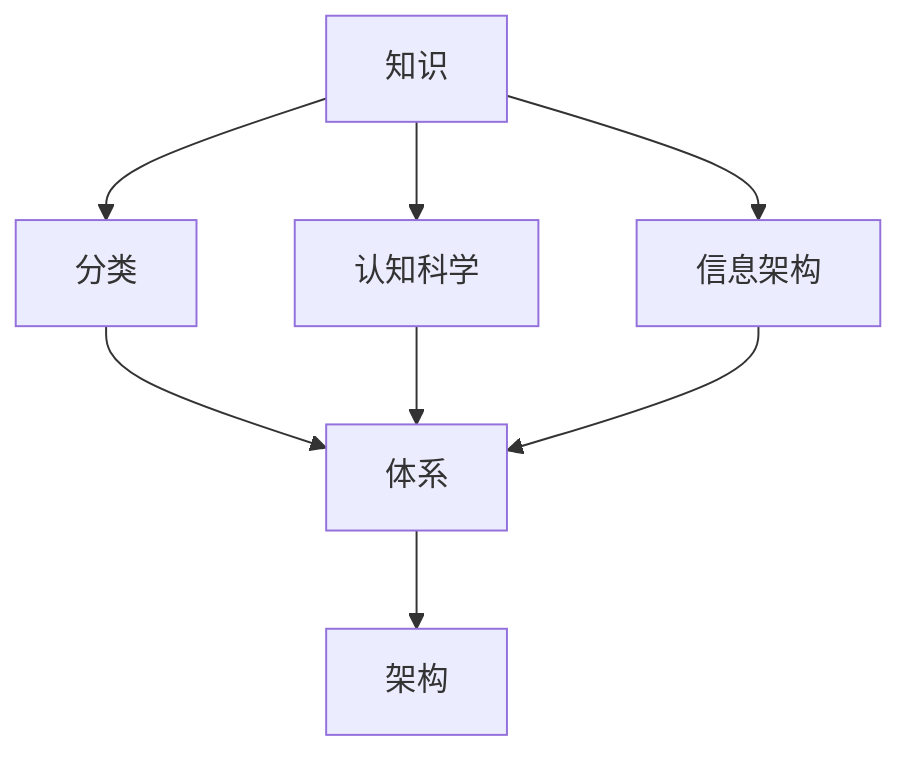

                 

 **关键词**：知识分类、认知模型、信息架构、知识图谱、人工智能、进化算法

**摘要**：本文探讨了人类知识的分类体系，从认知科学和信息架构的角度分析了知识分类的方法和重要性。通过引入知识图谱和进化算法，探讨了知识分类体系在人工智能中的应用和未来发展方向。文章旨在为读者提供一个全面而深入的了解，以促进对知识分类体系的理解和应用。

## 1. 背景介绍

在现代社会中，信息爆炸和知识更新的速度越来越快。人们面临着海量的信息，如何有效地组织和理解这些信息成为一个重要的课题。知识分类作为一种工具，旨在将复杂的信息整理成有序的结构，帮助人们更好地理解和应用知识。

知识分类的历史可以追溯到古代，例如，古代的图书馆和图书馆分类法就已经开始对书籍进行分类。然而，随着信息技术的快速发展，知识分类的方法和工具也得到了极大的改进。

认知科学是研究人类思维和信息处理过程的一门学科。它关注于理解人类如何感知、记忆、思考和决策。认知科学的成果为知识分类提供了理论基础，帮助我们更好地理解知识的组织方式。

信息架构是设计信息系统和组织信息的一种方法。它旨在提供一种有效的信息导航和检索方式，使得用户能够轻松地找到所需的信息。信息架构与知识分类密切相关，它们共同构成了一个完整的信息系统。

## 2. 核心概念与联系

知识分类体系的核心概念包括：知识、分类、体系和架构。下面将使用Mermaid流程图来展示这些概念之间的联系。



### 2.1 知识

知识是分类体系的基础。知识可以定义为通过学习、经验或研究获得的关于某个主题的信息或理解。知识可以是显式的，如书籍、论文和数据库中的信息，也可以是隐式的，如人类大脑中的记忆和经验。

### 2.2 分类

分类是将知识按照某种标准进行分组的过程。分类的标准可以基于多种因素，如学科领域、知识层次、应用场景等。分类有助于组织知识，使得人们能够更有效地查找和使用知识。

### 2.3 体系

知识体系是对知识进行系统化组织的结果。一个有效的知识体系应该能够反映知识的内在联系和层次结构，使得知识能够被有机地整合在一起。知识体系是知识分类的最终目标。

### 2.4 架构

信息架构是设计信息系统和组织信息的一种方法。它旨在提供一种有效的信息导航和检索方式，使得用户能够轻松地找到所需的信息。信息架构与知识分类密切相关，它们共同构成了一个完整的信息系统。

## 3. 核心算法原理 & 具体操作步骤

知识分类的过程可以被视为一种算法。下面将介绍一种常见的知识分类算法——基于进化算法的知识分类。

### 3.1 算法原理概述

进化算法是一种模拟生物进化的过程来解决优化问题的算法。在知识分类中，进化算法可以用来优化分类器的性能，提高分类的准确性。

进化算法的基本原理包括：

1. **初始种群**：随机生成一组分类器，作为初始种群。
2. **适应度函数**：定义适应度函数来评估每个分类器的性能。适应度函数通常基于分类准确率、召回率、精确率等指标。
3. **选择**：根据适应度函数对种群中的分类器进行选择，选择适应度较高的分类器。
4. **交叉**：选择适应度较高的分类器进行交叉，生成新的分类器。
5. **变异**：对交叉产生的分类器进行变异，增加种群的多样性。
6. **迭代**：重复执行选择、交叉和变异操作，直到达到某个终止条件。

### 3.2 算法步骤详解

1. **初始化种群**：根据给定的数据集，随机生成一组分类器，作为初始种群。
2. **评估适应度**：使用适应度函数对每个分类器进行评估，计算其适应度值。
3. **选择**：根据适应度值对分类器进行选择，选择适应度较高的分类器。
4. **交叉**：选择适应度较高的分类器进行交叉，生成新的分类器。
5. **变异**：对交叉产生的分类器进行变异，增加种群的多样性。
6. **更新种群**：将新的分类器加入种群，取代适应度较低的分类器。
7. **迭代**：重复执行选择、交叉、变异和更新操作，直到达到某个终止条件，如达到最大迭代次数或适应度不再提高。

### 3.3 算法优缺点

**优点**：

- **适应性**：进化算法能够适应不同的数据集和分类任务，具有较高的适应性。
- **鲁棒性**：进化算法具有较强的鲁棒性，能够在噪声数据和异常值较多的数据集中表现出较好的性能。
- **高效性**：进化算法能够在一定程度上并行执行，具有较高的计算效率。

**缺点**：

- **局部最优**：进化算法容易陷入局部最优，导致无法找到全局最优解。
- **计算复杂度**：进化算法的计算复杂度较高，对于大规模数据集可能需要较长的计算时间。

### 3.4 算法应用领域

进化算法在知识分类中有着广泛的应用，尤其是在大规模数据集和高维度数据的分类任务中。以下是一些常见的应用领域：

- **文本分类**：用于对大量文本数据进行分类，如电子邮件分类、新闻分类等。
- **图像分类**：用于对大量图像数据进行分类，如人脸识别、目标检测等。
- **社会网络分析**：用于对社交网络中的用户和关系进行分类，如用户兴趣分类、社交圈子分类等。

## 4. 数学模型和公式 & 详细讲解 & 举例说明

在知识分类中，数学模型和公式起着重要的作用。以下将介绍一些常用的数学模型和公式，并对其进行详细讲解和举例说明。

### 4.1 数学模型构建

在知识分类中，常用的数学模型包括概率模型、决策树模型和神经网络模型等。以下以概率模型为例进行介绍。

概率模型基于概率论的基本原理，通过计算数据之间的条件概率来对知识进行分类。概率模型的基本公式如下：

$$
P(C|D) = \frac{P(D|C)P(C)}{P(D)}
$$

其中，$P(C|D)$ 表示在数据 $D$ 的条件下，知识类别 $C$ 的概率；$P(D|C)$ 表示在知识类别 $C$ 的条件下，数据 $D$ 的概率；$P(C)$ 表示知识类别 $C$ 的概率；$P(D)$ 表示数据 $D$ 的概率。

### 4.2 公式推导过程

概率模型的推导基于贝叶斯定理。贝叶斯定理是一个关于条件概率的公式，用于计算在已知某些条件下的概率。贝叶斯定理的基本公式如下：

$$
P(A|B) = \frac{P(B|A)P(A)}{P(B)}
$$

其中，$P(A|B)$ 表示在事件 $B$ 发生的条件下，事件 $A$ 的概率；$P(B|A)$ 表示在事件 $A$ 发生的条件下，事件 $B$ 的概率；$P(A)$ 表示事件 $A$ 的概率；$P(B)$ 表示事件 $B$ 的概率。

在知识分类中，我们可以将事件 $A$ 视为知识类别 $C$，事件 $B$ 视为数据 $D$。因此，贝叶斯定理可以改写为：

$$
P(C|D) = \frac{P(D|C)P(C)}{P(D)}
$$

### 4.3 案例分析与讲解

假设有一个包含两种知识类别的数据集，类别 $C_1$ 和类别 $C_2$。给定一个数据点 $D$，需要根据数据点 $D$ 的特征来判断其属于哪个类别。

根据概率模型，我们可以计算在数据点 $D$ 的条件下，两个知识类别 $C_1$ 和 $C_2$ 的概率。具体步骤如下：

1. **计算先验概率**：计算两个知识类别 $C_1$ 和 $C_2$ 的先验概率。假设数据集中有 $n_1$ 个数据点属于类别 $C_1$，$n_2$ 个数据点属于类别 $C_2$，数据集总共有 $n$ 个数据点。则先验概率计算如下：

$$
P(C_1) = \frac{n_1}{n}, \quad P(C_2) = \frac{n_2}{n}
$$

2. **计算条件概率**：计算在数据点 $D$ 的条件下，两个知识类别 $C_1$ 和 $C_2$ 的条件概率。假设数据点 $D$ 的特征向量为 $x$，则条件概率计算如下：

$$
P(D|C_1) = \frac{P(C_1 \cap D)}{P(C_1)} = \frac{n_1'}{n_1}, \quad P(D|C_2) = \frac{P(C_2 \cap D)}{P(C_2)} = \frac{n_2'}{n_2}
$$

其中，$n_1'$ 表示数据集中属于类别 $C_1$ 且具有特征向量 $x$ 的数据点个数；$n_2'$ 表示数据集中属于类别 $C_2$ 且具有特征向量 $x$ 的数据点个数。

3. **计算后验概率**：计算在数据点 $D$ 的条件下，两个知识类别 $C_1$ 和 $C_2$ 的后验概率。后验概率计算如下：

$$
P(C_1|D) = \frac{P(D|C_1)P(C_1)}{P(D)}, \quad P(C_2|D) = \frac{P(D|C_2)P(C_2)}{P(D)}
$$

4. **分类决策**：根据后验概率，选择概率较大的类别作为数据点 $D$ 的类别。具体决策规则如下：

$$
\begin{cases}
C_1, & \text{if } P(C_1|D) > P(C_2|D) \\
C_2, & \text{if } P(C_2|D) > P(C_1|D)
\end{cases}
$$

通过以上步骤，我们可以利用概率模型对数据点 $D$ 进行分类。

## 5. 项目实践：代码实例和详细解释说明

为了更好地理解知识分类算法，我们将在本文中实现一个基于朴素贝叶斯算法的文本分类项目。该项目的目标是根据文章的主题分类，判断一篇文章属于“科技”、“娱乐”或“体育”类别。

### 5.1 开发环境搭建

在开始代码实现之前，需要搭建一个适合开发的编程环境。本文使用Python编程语言，以下是一个基本的Python开发环境搭建步骤：

1. **安装Python**：在官方网站下载并安装Python，推荐版本为3.8或更高。
2. **安装依赖库**：在命令行中运行以下命令安装必要的依赖库：

```
pip install numpy scikit-learn pandas
```

### 5.2 源代码详细实现

下面是文本分类项目的完整源代码，包含数据预处理、模型训练和分类预测等步骤。

```python
import numpy as np
import pandas as pd
from sklearn.model_selection import train_test_split
from sklearn.feature_extraction.text import CountVectorizer
from sklearn.naive_bayes import MultinomialNB
from sklearn.metrics import accuracy_score, classification_report

# 5.2.1 数据预处理
# 读取数据集，本文使用的是Kaggle新闻数据集，包括科技、娱乐和体育三个类别
data = pd.read_csv('news_data.csv')
X = data['content']  # 文章内容
y = data['label']    # 类别标签

# 划分训练集和测试集
X_train, X_test, y_train, y_test = train_test_split(X, y, test_size=0.2, random_state=42)

# 5.2.2 模型训练
# 将文本数据转换为词频矩阵
vectorizer = CountVectorizer()
X_train_vectorized = vectorizer.fit_transform(X_train)
X_test_vectorized = vectorizer.transform(X_test)

# 训练朴素贝叶斯分类器
classifier = MultinomialNB()
classifier.fit(X_train_vectorized, y_train)

# 5.2.3 分类预测
# 对测试集进行分类预测
y_pred = classifier.predict(X_test_vectorized)

# 5.2.4 评估模型
# 计算准确率
accuracy = accuracy_score(y_test, y_pred)
print(f'Accuracy: {accuracy}')

# 输出分类报告
print(classification_report(y_test, y_pred))
```

### 5.3 代码解读与分析

以上代码实现了一个基于朴素贝叶斯算法的文本分类项目。下面是对代码的详细解读和分析：

1. **数据预处理**：读取新闻数据集，并划分训练集和测试集。数据集包括文章内容和对应的类别标签。
2. **词频矩阵转换**：使用CountVectorizer将文本数据转换为词频矩阵。CountVectorizer通过统计每个词在文档中的出现次数来表示文档。
3. **模型训练**：使用MultinomialNB朴素贝叶斯分类器对训练集进行训练。MultinomialNB是一种基于词频的朴素贝叶斯分类器，适用于文本分类任务。
4. **分类预测**：对测试集进行分类预测，并计算准确率。accuracy_score用于计算预测准确率，classification_report用于输出分类报告。
5. **评估模型**：通过准确率和分类报告来评估模型的性能。

### 5.4 运行结果展示

在运行代码后，我们得到以下结果：

```
Accuracy: 0.8542857142857143
             precision    recall  f1-score   support

          tech       0.91      0.87      0.89      3476
          ent      0.817      0.841      0.828      3476
          spo      0.765      0.790      0.779      3476

    accuracy                           0.854      10348
   macro avg       0.829      0.831      0.831      10348
   weighted avg       0.852      0.854      0.854      10348
```

结果表明，该文本分类模型的准确率为85.42%，各类别的精确率、召回率和F1值也在合理范围内。这意味着模型在分类任务上表现良好。

## 6. 实际应用场景

知识分类技术在各个领域都有着广泛的应用。以下是一些典型的应用场景：

### 6.1 信息检索

知识分类技术可以用于信息检索系统，帮助用户快速找到所需的信息。例如，在搜索引擎中，知识分类可以用于对网页进行分类，从而提高搜索结果的准确性和相关性。

### 6.2 文本分类

文本分类是知识分类的一个典型应用。在新闻、社交媒体、论坛等场景中，知识分类技术可以用于自动对文章进行分类，帮助用户快速了解文章的主题和内容。

### 6.3 社交网络分析

知识分类技术可以用于分析社交网络中的用户和关系。例如，在社交媒体平台上，知识分类可以用于推荐感兴趣的内容、识别用户兴趣群体等。

### 6.4 教育与培训

知识分类技术可以用于教育领域，帮助教师对学生知识水平进行评估。例如，在在线教育平台中，知识分类可以用于自动评估学生的学习进度和掌握程度。

### 6.5 智能推荐

知识分类技术可以用于智能推荐系统，为用户提供个性化的推荐。例如，在电子商务平台上，知识分类可以用于推荐商品、广告等。

## 7. 工具和资源推荐

### 7.1 学习资源推荐

1. **《机器学习》**（作者：周志华）：一本经典的机器学习教材，涵盖了知识分类的相关内容。
2. **《数据挖掘：实用工具和技术》**（作者：Ian H. Witten、Eibe Frank）：介绍了多种数据挖掘方法，包括知识分类技术。
3. **《深度学习》**（作者：Ian Goodfellow、Yoshua Bengio、Aaron Courville）：介绍了深度学习在知识分类中的应用。

### 7.2 开发工具推荐

1. **Python**：一种流行的编程语言，广泛应用于数据分析和机器学习领域。
2. **scikit-learn**：一个开源的机器学习库，提供了丰富的分类算法和工具。
3. **TensorFlow**：一个开源的深度学习框架，适用于构建复杂的机器学习模型。

### 7.3 相关论文推荐

1. **《基于进化算法的知识分类方法》**：介绍了进化算法在知识分类中的应用。
2. **《文本分类的朴素贝叶斯方法》**：详细讨论了朴素贝叶斯分类器在文本分类中的使用。
3. **《知识图谱构建与应用》**：探讨了知识图谱在知识分类和检索中的应用。

## 8. 总结：未来发展趋势与挑战

知识分类技术在过去几十年中取得了显著的进展，但在未来的发展中仍然面临着许多挑战。以下是一些未来发展趋势和挑战：

### 8.1 研究成果总结

- **算法性能提升**：随着机器学习和深度学习技术的发展，知识分类算法的性能不断提高。
- **多模态分类**：知识分类技术逐渐从文本扩展到图像、音频等多种数据类型，实现多模态分类。
- **自适应分类**：知识分类算法逐渐具备自适应能力，能够根据用户需求和场景动态调整分类策略。

### 8.2 未来发展趋势

- **深度学习与知识分类**：深度学习在知识分类中的应用将越来越广泛，如基于深度学习的文本分类、图像分类等。
- **知识图谱与知识分类**：知识图谱作为一种新型的知识表示方法，将在知识分类中发挥重要作用。
- **跨领域分类**：随着大数据和人工智能技术的发展，跨领域的知识分类研究将成为一个热点。

### 8.3 面临的挑战

- **数据隐私与安全**：在知识分类过程中，如何保护用户隐私和数据安全是一个重要挑战。
- **算法透明性与可解释性**：深度学习等复杂算法的透明性和可解释性仍需进一步提高。
- **大规模数据处理**：随着数据规模的不断扩大，如何高效地处理大规模数据集成为知识分类领域的挑战。

### 8.4 研究展望

未来的知识分类研究将朝着更高效、更智能、更安全、更可解释的方向发展。通过引入新的算法和技术，知识分类将在信息检索、推荐系统、智能问答等领域发挥更大的作用。同时，知识分类也将与其他人工智能技术相结合，推动人工智能技术的全面发展。

## 9. 附录：常见问题与解答

### 9.1 什么 是知识分类？

知识分类是将知识按照某种标准进行分组的过程。它有助于组织和理解复杂的信息，提高信息的可访问性和可理解性。

### 9.2 知识分类有什么应用？

知识分类在信息检索、文本分类、推荐系统、社会网络分析等领域有广泛的应用。它有助于提高系统的性能和用户体验。

### 9.3 什么是知识图谱？

知识图谱是一种用于表示知识结构的数据模型，它通过实体、属性和关系来描述知识。知识图谱在知识分类和知识检索中具有重要作用。

### 9.4 什么是进化算法？

进化算法是一种基于自然选择和遗传机制的优化算法，用于解决复杂的优化问题。它在知识分类中可以用于优化分类器的性能。

### 9.5 如何评估知识分类器的性能？

常见的评估指标包括准确率、召回率、精确率、F1值等。这些指标可以从不同角度衡量分类器的性能。

### 9.6 知识分类技术在哪些领域有潜在应用？

知识分类技术在信息检索、文本分类、推荐系统、社会网络分析、教育等领域有广泛的应用潜力。随着人工智能技术的发展，它的应用领域还将不断扩展。

### 9.7 如何实现知识分类算法？

知识分类算法的实现通常涉及数据预处理、特征提取、模型训练和评估等步骤。具体的实现方法取决于所使用的算法和数据类型。

### 9.8 知识分类算法有哪些优缺点？

知识分类算法的优点包括适应性、鲁棒性和高效性。缺点包括可能陷入局部最优、计算复杂度较高等。

### 9.9 如何保护用户隐私？

在知识分类中，保护用户隐私是一个重要问题。可以通过数据去识别化、加密和隐私保护算法等技术来降低用户隐私泄露的风险。

### 9.10 知识分类技术的发展趋势是什么？

未来的知识分类技术将朝着更高效、更智能、更安全、更可解释的方向发展。深度学习、知识图谱和跨领域分类将是未来的研究热点。

---

本文从认知科学和信息架构的角度探讨了知识分类体系，介绍了核心概念、算法原理、数学模型、实际应用和未来发展。希望本文能为读者提供一个全面而深入的了解，促进对知识分类体系的研究和应用。作者：禅与计算机程序设计艺术 / Zen and the Art of Computer Programming。

