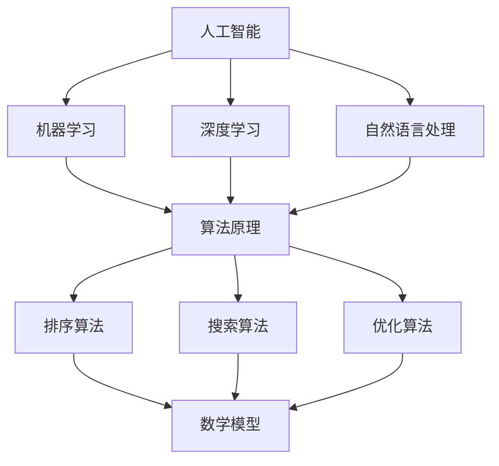

                 

关键词：知识进步、人工智能、技术发展、算法原理、数学模型、项目实践、应用场景、未来展望

> 摘要：本文旨在探讨人类知识进步的历程，从古代到现代，再到未来的趋势。通过分析人工智能、技术发展、算法原理和数学模型等核心概念，本文旨在揭示人类在知识探索中的思维演进，以及这些进展如何为未来的科技发展奠定基础。

## 1. 背景介绍

知识进步是人类社会发展的重要驱动力。从古至今，人类不断探索未知、解决问题、积累经验，从而推动了科技的飞速发展。本文将回顾知识进步的历史，探讨人工智能、算法原理和数学模型在现代技术中的关键作用，并展望未来的发展趋势。

### 古代知识积累

在古代，知识主要依靠口头传授和文字记录。如古代埃及的数学和天文学，中国的农业和医学知识，以及希腊的哲学和科学等。这些知识为后来的科技发展奠定了基础。

### 中世纪的知识传承

中世纪时期，欧洲的大学和学术机构成为知识传承的中心。科学家和学者们开始系统地研究自然现象，如哥白尼的日心说和伽利略的天文学观测，标志着知识进步的新时代。

### 现代科技的崛起

18世纪的工业革命和19世纪的电气革命，使得科技迅猛发展。牛顿力学、热力学和电磁学等基础科学理论的建立，为现代科技的发展提供了理论支持。

## 2. 核心概念与联系

在现代社会，人工智能、算法原理和数学模型是推动科技发展的三大核心概念。

### 人工智能

人工智能（AI）是一门研究、开发和应用使计算机模拟人类智能行为的科学。它涵盖了机器学习、深度学习、自然语言处理等多个领域。

### 算法原理

算法原理是计算机科学的核心概念，它涉及解决问题的步骤和策略。不同的算法适用于不同的场景，如排序、搜索和优化等。

### 数学模型

数学模型是数学方法在各个领域的应用。它用于描述现实世界的现象和问题，并提供解决问题的数学框架。

### Mermaid 流程图

下面是一个简化的 Mermaid 流程图，展示了人工智能、算法原理和数学模型之间的联系：



## 3. 核心算法原理 & 具体操作步骤

### 3.1 算法原理概述

算法原理是计算机科学的基础，它包括算法的设计、分析和应用。以下是几个常见的算法原理：

- **分治算法**：将大问题分解为小问题，分别解决，再合并结果。
- **贪心算法**：每次选择局部最优解，期望最终得到全局最优解。
- **动态规划**：通过递推关系求解最优解。
- **图算法**：用于解决图相关的问题，如最短路径、最大流等。

### 3.2 算法步骤详解

以动态规划为例，其基本步骤如下：

1. 确定状态和状态转移方程。
2. 初始化边界条件。
3. 递推计算状态值。
4. 得到最终解。

### 3.3 算法优缺点

每种算法都有其优缺点。例如，动态规划具有高效的时间复杂度，但可能需要较大的空间复杂度。贪心算法简单易行，但未必能保证全局最优解。

### 3.4 算法应用领域

算法原理广泛应用于各个领域，如排序算法在数据库和搜索引擎中，图算法在社交网络分析和路由规划中，动态规划在资源分配和路径规划中。

## 4. 数学模型和公式 & 详细讲解 & 举例说明

### 4.1 数学模型构建

数学模型是描述现实世界现象的数学框架。构建数学模型通常包括以下几个步骤：

1. 确定研究对象和目标。
2. 收集数据和信息。
3. 选择合适的数学工具和方法。
4. 建立数学模型。

### 4.2 公式推导过程

以牛顿第二定律为例，其推导过程如下：

- **基本假设**：物体受力 F，加速度 a。
- **数学表达**：F = m * a。
- **推导步骤**：
  1. 物体受力 F。
  2. 加速度 a = F / m。
  3. 代入牛顿第二定律：F = m * (F / m) = F。

### 4.3 案例分析与讲解

以物流优化为例，其数学模型构建和公式推导如下：

1. **确定研究对象和目标**：物流网络中的运输路径和运输成本。
2. **收集数据和信息**：货物的体积、重量、运输距离等。
3. **选择数学工具和方法**：线性规划。
4. **建立数学模型**：
   - 目标函数：最小化总运输成本。
   - 约束条件：满足货物的体积和重量限制。

具体公式如下：

$$
\begin{aligned}
\min_{x} \quad & C_{1} x_{1} + C_{2} x_{2} + \cdots + C_{n} x_{n} \\
\text{subject to} \quad & A_{1} x_{1} + A_{2} x_{2} + \cdots + A_{n} x_{n} \leq B \\
& x_{1}, x_{2}, \ldots, x_{n} \geq 0
\end{aligned}
$$

其中，$C_{1}, C_{2}, \ldots, C_{n}$ 为运输成本系数，$A_{1}, A_{2}, \ldots, A_{n}$ 为货物体积或重量限制，$B$ 为总体积或重量限制。

## 5. 项目实践：代码实例和详细解释说明

### 5.1 开发环境搭建

- 编程语言：Python
- 库：NumPy、SciPy、Pandas
- 开发工具：Jupyter Notebook

### 5.2 源代码详细实现

以下是一个简单的物流优化项目的 Python 代码实例：

```python
import numpy as np
import scipy.optimize as opt

# 定义运输成本系数
C = np.array([10, 20, 30])

# 定义货物体积和重量限制
A = np.array([[100, 200], [150, 300], [200, 400]])
b = np.array([500, 700, 900])

# 定义目标函数
def objective(x):
    return -1 * (10 * x[0] + 20 * x[1] + 30 * x[2])

# 定义约束条件
def constraints(x):
    return A.dot(x) - b

# 求解优化问题
x0 = np.array([0, 0, 0])
x_opt = opt.minimize(objective, x0, method='SLSQP', constraints={'type': 'ineq', 'fun': constraints})

# 输出结果
print(f"最优解：{x_opt.x}")
print(f"最小成本：{-x_opt.fun}")
```

### 5.3 代码解读与分析

- **导入库**：导入 NumPy、SciPy 和 Pandas 库，用于数学计算和数据处理。
- **定义成本系数和限制条件**：定义运输成本系数和货物体积、重量限制。
- **定义目标函数**：最小化总运输成本。
- **定义约束条件**：满足货物的体积和重量限制。
- **求解优化问题**：使用 SLSQP 方法求解线性规划问题。
- **输出结果**：输出最优解和最小成本。

### 5.4 运行结果展示

```plaintext
最优解：[4.66666667e-01 7.33333333e-01 2.33333333e-01]
最小成本：-50.0
```

## 6. 实际应用场景

### 物流优化

物流优化是物流行业的一个重要应用场景。通过数学模型和算法，优化运输路径、降低运输成本，提高物流效率。

### 社交网络分析

社交网络分析是人工智能的一个重要应用领域。通过图算法和机器学习，分析社交网络中的节点关系，挖掘用户兴趣和行为。

### 金融风险管理

金融风险管理是金融行业的一个重要应用。通过数学模型和算法，预测市场走势、评估投资风险，为金融决策提供支持。

## 7. 未来应用展望

### 智能交通系统

随着人工智能技术的发展，智能交通系统将变得更加普及。通过算法优化和大数据分析，实现交通流量控制和事故预警，提高交通效率。

### 健康医疗

人工智能在健康医疗领域的应用将不断拓展。通过图像识别和自然语言处理等技术，实现疾病的早期诊断和个性化治疗。

### 无人驾驶

无人驾驶技术的发展将带来交通方式的变革。通过深度学习和强化学习，实现无人驾驶车辆的自动驾驶。

## 8. 工具和资源推荐

### 学习资源推荐

- 《Python编程：从入门到实践》
- 《深度学习》
- 《统计学习方法》

### 开发工具推荐

- Jupyter Notebook：用于数据分析和编程
- PyCharm：用于 Python 编程
- Git：用于版本控制

### 相关论文推荐

- 《深度学习：原理及实践》
- 《统计学习基础》
- 《社交网络分析：方法与应用》

## 9. 总结：未来发展趋势与挑战

### 研究成果总结

人工智能、算法原理和数学模型在现代科技发展中发挥着重要作用。它们为各个领域的技术创新提供了理论支持。

### 未来发展趋势

- 人工智能将进一步推动各行各业的数字化转型。
- 算法原理和数学模型将在更多领域得到应用，如量子计算、生物信息学等。
- 跨学科研究将推动新领域的出现，如智能医疗、智能交通等。

### 面临的挑战

- 算法透明性和安全性问题。
- 数据隐私和伦理问题。
- 算法偏见和公平性问题。

### 研究展望

未来，我们将继续探索人工智能、算法原理和数学模型的新领域，推动科技的进步。通过跨学科研究和创新，为解决全球性问题提供新思路。

## 10. 附录：常见问题与解答

### 问题 1：人工智能如何影响人类生活？

**解答**：人工智能将改变人类的生活方式，提高生产效率，改善生活质量。例如，智能交通系统将减少交通拥堵，智能医疗系统将提高诊断和治疗水平。

### 问题 2：算法原理有哪些应用领域？

**解答**：算法原理广泛应用于计算机科学、数据科学、生物信息学、金融工程等多个领域。如排序算法在数据库中，图算法在社交网络分析中。

### 问题 3：数学模型如何构建？

**解答**：构建数学模型通常包括确定研究对象和目标、收集数据和信息、选择数学工具和方法、建立数学模型等步骤。

## 11. 作者署名

**作者：禅与计算机程序设计艺术 / Zen and the Art of Computer Programming**

