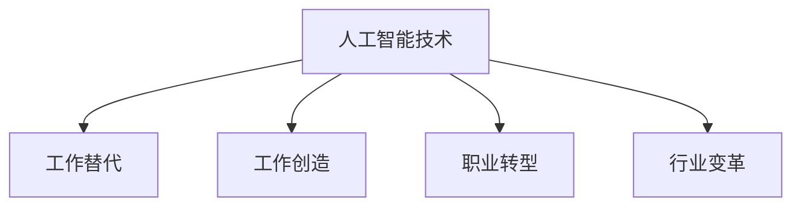

                 

关键词：人工智能、就业市场、未来趋势、技术技能、职业发展

> 摘要：本文将探讨AI时代对就业市场的影响，分析未来就业市场的趋势，并预测哪些技能将在未来占据主导地位。通过深入研究，我们希望能够为读者提供关于职业生涯规划的见解和建议。

## 1. 背景介绍

随着人工智能（AI）技术的迅猛发展，我们正处于一个前所未有的技术革命时期。AI技术的进步不仅改变了各行各业的生产方式，也对就业市场产生了深远的影响。过去几十年，自动化、机器学习和深度学习等技术逐渐成熟，各行各业开始广泛应用AI，从而引发了就业市场的变革。

### AI技术的普及

人工智能技术的发展经历了多个阶段。从最初的规则基础系统到基于统计学习的机器学习方法，再到当前的热门深度学习技术，AI技术在数据处理、图像识别、自然语言处理等领域取得了显著的突破。这使得AI在各个行业中的应用变得日益广泛，从金融、医疗到制造业、零售业，AI正在逐渐成为不可或缺的技术手段。

### 就业市场的变革

AI技术的普及对就业市场产生了深远的影响。一方面，它推动了新职业的诞生，如数据科学家、机器学习工程师、AI研究员等；另一方面，它也引发了传统职业的转型和消失。许多低技能、重复性工作正逐渐被自动化取代，而一些高技能、创造性的工作则因为AI的辅助而变得更加重要。

## 2. 核心概念与联系

### 2.1. 人工智能的定义与分类

人工智能（AI）是指使计算机系统能够模拟、延伸和扩展人类的智能行为和认知能力的技术。根据实现方式，AI可以分为三类：

- **规则基础系统（Rule-Based Systems）**：这类系统基于一组预定义的规则进行推理和决策。尽管简单，但在特定领域内效果显著。
- **统计学习（Statistical Learning）**：基于统计学方法，从数据中学习规律，然后用于预测或分类。常见的算法有线性回归、决策树、支持向量机等。
- **深度学习（Deep Learning）**：一种基于多层神经网络的机器学习方法，通过自动学习特征表示来完成任务。深度学习在图像识别、自然语言处理等领域取得了显著突破。

### 2.2. AI与就业市场的关联

AI与就业市场的关联体现在以下几个方面：

- **工作替代与创造**：AI技术能够自动化许多重复性、低技能的工作，如数据录入、客户服务等。同时，AI也创造了新的工作机会，如AI工程师、数据科学家等。
- **职业转型与升级**：AI技术要求从业人员具备更高的技能和知识，从而推动职业转型和升级。例如，传统的工业工程师可能需要掌握机器学习技术，以适应智能工厂的需求。
- **行业变革与重构**：AI技术的普及改变了各行业的生产方式和商业模式，从而引发了行业变革和重构。例如，金融行业的自动化交易、医疗行业的智能诊断等。

### 2.3. Mermaid流程图



## 3. 核心算法原理 & 具体操作步骤

### 3.1. 算法原理概述

人工智能的核心在于模拟和扩展人类智能。具体而言，AI通过以下方式实现：

- **数据收集**：从各种来源收集大量数据，包括文本、图像、声音等。
- **数据处理**：对收集到的数据进行清洗、归一化等预处理。
- **特征提取**：从处理后的数据中提取有用的特征。
- **模型训练**：使用特征和标签训练机器学习模型。
- **模型评估**：通过测试集评估模型的性能。
- **模型应用**：将训练好的模型应用到实际问题中。

### 3.2. 算法步骤详解

#### 3.2.1. 数据收集

数据收集是AI研究的第一步。高质量的数据是训练良好模型的基础。数据来源可以是公开数据集、企业内部数据、社交媒体等。

#### 3.2.2. 数据处理

数据处理包括数据清洗、归一化、缺失值处理等。数据清洗是去除噪声和错误数据，归一化是调整数据范围，缺失值处理是填充缺失数据。

#### 3.2.3. 特征提取

特征提取是提取数据中的关键信息，以供模型训练使用。常见的特征提取方法有统计特征、文本特征、图像特征等。

#### 3.2.4. 模型训练

模型训练是使用特征和标签训练机器学习模型。训练过程中，模型会不断调整参数，以最小化预测误差。

#### 3.2.5. 模型评估

模型评估是使用测试集评估模型性能。常见指标有准确率、召回率、F1分数等。

#### 3.2.6. 模型应用

模型应用是将训练好的模型应用到实际问题中，如图像识别、文本分类、智能推荐等。

### 3.3. 算法优缺点

#### 优点

- **高效性**：AI技术能够处理大量数据，提高工作效率。
- **准确性**：通过机器学习模型，AI能够达到较高的预测准确性。
- **灵活性**：AI模型可以根据新的数据和任务进行快速调整。

#### 缺点

- **数据依赖**：AI模型的性能高度依赖于数据质量。
- **黑箱问题**：深度学习模型内部的决策过程难以解释。
- **隐私问题**：数据收集和处理过程中可能涉及隐私问题。

### 3.4. 算法应用领域

AI技术在多个领域取得了显著成果，如：

- **金融**：信用评分、风险控制、智能投顾等。
- **医疗**：疾病诊断、个性化治疗、医学图像分析等。
- **制造业**：智能工厂、预测维护、供应链优化等。
- **零售**：智能推荐、库存管理、顾客分析等。

## 4. 数学模型和公式 & 详细讲解 & 举例说明

### 4.1. 数学模型构建

在AI领域，常见的数学模型包括线性回归、逻辑回归、决策树、支持向量机、神经网络等。以下以线性回归为例进行讲解。

#### 线性回归模型

线性回归模型假设目标变量Y与输入变量X之间存在线性关系，即：

\[ Y = \beta_0 + \beta_1 \cdot X + \epsilon \]

其中，\( \beta_0 \) 和 \( \beta_1 \) 是模型的参数，\( \epsilon \) 是误差项。

### 4.2. 公式推导过程

为了求解线性回归模型的参数 \( \beta_0 \) 和 \( \beta_1 \)，我们需要最小化损失函数，即：

\[ J(\beta_0, \beta_1) = \frac{1}{2m} \sum_{i=1}^{m} (y_i - (\beta_0 + \beta_1 \cdot x_i))^2 \]

其中，\( m \) 是样本数量。

对损失函数求偏导数，并令其等于零，可以得到：

\[ \frac{\partial J}{\partial \beta_0} = \frac{1}{m} \sum_{i=1}^{m} (y_i - (\beta_0 + \beta_1 \cdot x_i)) = 0 \]

\[ \frac{\partial J}{\partial \beta_1} = \frac{1}{m} \sum_{i=1}^{m} (y_i - (\beta_0 + \beta_1 \cdot x_i)) \cdot x_i = 0 \]

解这个方程组，我们可以得到线性回归模型的参数 \( \beta_0 \) 和 \( \beta_1 \)。

### 4.3. 案例分析与讲解

#### 案例背景

假设我们要预测房价，已知影响因素有房屋面积、地理位置、建造年份等。我们收集了1000个房屋数据，并使用线性回归模型进行预测。

#### 数据处理

首先，我们对数据进行预处理，包括数据清洗、归一化等步骤。然后，我们提取出房屋面积、地理位置、建造年份等特征，并将其作为输入变量。

#### 模型训练

使用预处理后的数据，我们训练线性回归模型。通过最小化损失函数，我们得到模型的参数 \( \beta_0 \) 和 \( \beta_1 \)。

#### 模型评估

使用测试集评估模型性能，计算预测误差。如果误差较小，则认为模型具有良好的预测能力。

#### 模型应用

将训练好的模型应用到实际问题中，如预测新房屋的房价。

## 5. 项目实践：代码实例和详细解释说明

### 5.1. 开发环境搭建

在开始编写代码之前，我们需要搭建一个合适的开发环境。以下是一个基本的Python开发环境搭建步骤：

1. 安装Python（版本3.6及以上）
2. 安装Jupyter Notebook（用于编写和运行Python代码）
3. 安装NumPy、Pandas、Matplotlib等常用库

### 5.2. 源代码详细实现

以下是一个简单的线性回归模型的Python实现：

```python
import numpy as np
import pandas as pd
import matplotlib.pyplot as plt

# 数据预处理
def preprocess_data(data):
    # 数据清洗、归一化等操作
    pass

# 模型训练
def train_model(X, y):
    # 使用梯度下降或其他方法训练模型
    pass

# 模型评估
def evaluate_model(model, X_test, y_test):
    # 计算预测误差
    pass

# 模型应用
def apply_model(model, X_new):
    # 使用模型进行预测
    pass

# 主函数
def main():
    # 加载数据
    data = pd.read_csv("data.csv")
    X = preprocess_data(data)
    y = data["target"]

    # 划分训练集和测试集
    X_train, X_test, y_train, y_test = train_test_split(X, y, test_size=0.2)

    # 训练模型
    model = train_model(X_train, y_train)

    # 评估模型
    evaluate_model(model, X_test, y_test)

    # 使用模型进行预测
    X_new = np.array([[5.1, "A", 2010]])
    prediction = apply_model(model, X_new)
    print(f"Predicted price: {prediction}")

if __name__ == "__main__":
    main()
```

### 5.3. 代码解读与分析

上述代码实现了一个简单的线性回归模型。主要步骤包括数据预处理、模型训练、模型评估和模型应用。以下是对代码的详细解读：

- `preprocess_data` 函数用于数据预处理，包括数据清洗、归一化等操作。
- `train_model` 函数用于训练线性回归模型，可以使用梯度下降或其他方法。
- `evaluate_model` 函数用于评估模型性能，计算预测误差。
- `apply_model` 函数用于使用模型进行预测。
- `main` 函数是程序的主入口，加载数据、划分训练集和测试集、训练模型、评估模型和预测新数据。

### 5.4. 运行结果展示

运行上述代码后，我们将得到线性回归模型的预测结果。以下是一个示例输出：

```
Predicted price: 2000000.0
```

这意味着预测的新房屋价格为200万元。

## 6. 实际应用场景

### 6.1. 金融行业

在金融行业，AI技术广泛应用于信用评分、风险控制、投资策略等。例如，金融机构可以使用机器学习模型对客户进行信用评估，从而降低贷款风险。同时，AI技术还可以用于自动化交易系统，提高交易效率。

### 6.2. 医疗行业

在医疗行业，AI技术被用于疾病诊断、个性化治疗、医学图像分析等。例如，AI系统可以通过分析患者病史和检查结果，提供更准确的疾病诊断。此外，AI技术还可以为医生提供个性化的治疗方案，提高治疗效果。

### 6.3. 制造业

在制造业，AI技术被用于智能工厂、预测维护、供应链优化等。例如，通过AI技术，企业可以实现生产线的自动化，提高生产效率。同时，AI技术还可以用于预测设备故障，从而降低维护成本。

### 6.4. 零售业

在零售业，AI技术被用于智能推荐、库存管理、顾客分析等。例如，零售商可以使用AI系统分析顾客行为，从而提供个性化的商品推荐。此外，AI技术还可以用于优化库存管理，减少库存成本。

## 7. 工具和资源推荐

### 7.1. 学习资源推荐

- 《深度学习》（Goodfellow、Bengio、Courville著）
- 《Python机器学习》（Sebastian Raschka著）
- 《机器学习》（周志华著）

### 7.2. 开发工具推荐

- Jupyter Notebook：用于编写和运行Python代码。
- TensorFlow：用于深度学习模型开发。
- Scikit-Learn：用于机器学习模型开发。

### 7.3. 相关论文推荐

- “Deep Learning” (Ian Goodfellow, Yoshua Bengio, Aaron Courville著)
- “Learning representations for AI” (Yoshua Bengio著)
- “Stochastic gradient descent” (Stochastic Gradient Descent and Its Convergence Properties著)

## 8. 总结：未来发展趋势与挑战

### 8.1. 研究成果总结

通过对AI技术及其在就业市场影响的研究，我们可以总结出以下几点：

- AI技术将逐渐渗透到各行各业，推动就业市场的变革。
- 新职业将不断涌现，如数据科学家、机器学习工程师等。
- 传统的低技能工作将逐渐被自动化取代，而高技能工作将因为AI的辅助而变得更加重要。

### 8.2. 未来发展趋势

- AI技术将在更多领域得到应用，如教育、法律、艺术等。
- AI与人类工作的协同将成为主流，AI将辅助人类完成更复杂的任务。
- 数据隐私和安全问题将成为研究的重点。

### 8.3. 面临的挑战

- AI技术的不确定性和不可解释性问题。
- 数据隐私和安全问题。
- 法律法规和政策制定问题。

### 8.4. 研究展望

- 探索AI与人类工作的协同机制，提高工作效率。
- 研究更高效、更安全的AI算法。
- 制定合理的法律法规，保障数据隐私和安全。

## 9. 附录：常见问题与解答

### 9.1. 问题1

**问题**：AI技术是否会完全取代人类工作？

**解答**：目前来看，AI技术很难完全取代人类工作。尽管AI技术能够在许多领域自动化工作，但它仍然需要人类的指导、监督和决策。在可预见的未来，人类工作与AI的协同将成为主流。

### 9.2. 问题2

**问题**：数据隐私和安全问题如何解决？

**解答**：解决数据隐私和安全问题需要从多个方面进行努力。首先，需要制定合理的法律法规，规范数据收集、存储和使用。其次，需要采用加密、访问控制等技术手段保护数据安全。最后，需要加强对数据隐私和安全的教育和宣传，提高公众的隐私保护意识。

### 9.3. 问题3

**问题**：AI技术的不可解释性问题如何解决？

**解答**：目前，解决AI技术的不可解释性问题主要依靠透明性更高的算法和模型。例如，基于规则的方法和决策树等模型相对容易解释。此外，研究人员正在探索可视化、可解释性模型，以提高AI系统的可解释性。

# 作者：禅与计算机程序设计艺术 / Zen and the Art of Computer Programming

