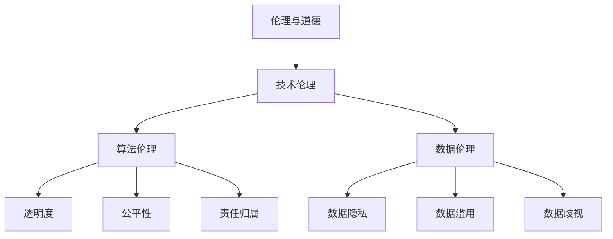

                 

 关键词：人工智能，道德意识，伦理，技术伦理，AI伦理，责任，透明度，可解释性，算法，数据隐私，算法公平性，技术影响

> 摘要：本文探讨了在人工智能时代如何增强人类计算的道德意识，分析了技术伦理的重要性，以及如何在算法开发和应用中实践道德原则。通过深入讨论算法公平性、数据隐私保护、责任归属等问题，本文提出了提高AI伦理意识的策略和方法，以期为技术从业者提供指导。

## 1. 背景介绍

### AI的发展及其影响

自20世纪50年代人工智能（AI）的概念被首次提出以来，人工智能技术经历了飞速的发展。从早期的符号主义和知识表示方法，到基于统计学的机器学习，再到深度学习的崛起，AI已经深刻地改变了我们的生活方式和社会结构。智能助手、自动驾驶、医疗诊断、金融分析等众多领域都受益于AI技术的应用。

然而，随着AI技术的普及和应用，一系列伦理问题也逐渐浮现。AI系统的决策过程缺乏透明度，可能导致歧视和偏见；大规模数据收集和利用引发了隐私泄露的担忧；AI技术的非解释性使得责任归属变得复杂。这些问题不仅关乎技术本身，更涉及到社会、文化和法律等多个层面。

### 道德意识的重要性

道德意识是指个体在行为选择中遵循道德规范和伦理原则的意识。在技术领域，道德意识尤为重要，因为它直接影响到技术的应用和影响。技术道德不仅关乎技术从业者的职业操守，更关系到技术的公正性、透明度和社会责任。

在AI时代，增强道德意识有助于确保技术的良性发展，避免造成社会负面影响。通过提升道德意识，我们可以更有效地解决AI技术带来的伦理挑战，实现技术与社会发展的良性互动。

## 2. 核心概念与联系

为了更好地理解AI时代道德意识的重要性，我们首先需要明确一些核心概念，并探讨它们之间的联系。

### 伦理与道德

伦理（Ethics）是关于道德（Morality）原则和规范的研究。道德是个人或群体关于正确与错误、善与恶的观念和判断，而伦理则是在更广泛的社会和文化背景下对道德进行系统性的探讨。在技术领域，伦理研究关注技术如何影响人类生活，以及技术应如何符合道德原则。

### 技术伦理（Tech Ethics）

技术伦理是应用伦理学的分支，专门研究技术发展及其应用中的道德问题。它关注技术的设计、开发、使用和影响，旨在确保技术符合道德规范和伦理原则。技术伦理包括对隐私、公平性、责任和透明度等方面的探讨。

### 算法伦理（Algorithm Ethics）

算法伦理是技术伦理的子领域，专注于算法的设计、实现和应用过程中的道德问题。算法伦理关注算法的透明度、公平性、可解释性和责任归属。算法的决策过程往往缺乏透明度，可能导致偏见和不公平，因此算法伦理在确保AI技术的道德性方面具有重要意义。

### 数据伦理（Data Ethics）

数据伦理研究数据收集、存储、处理和使用过程中的道德问题。数据隐私、数据滥用、数据歧视等都是数据伦理的重要议题。在AI时代，数据是算法训练的基础，数据伦理直接影响到算法的道德性。

### Mermaid流程图

以下是AI时代道德意识核心概念的Mermaid流程图：



## 3. 核心算法原理 & 具体操作步骤

### 3.1 算法原理概述

在AI时代，核心算法的道德意识体现在算法设计、实现和应用的全过程中。以下是一些关键原理：

1. **透明度**：算法的决策过程应透明，使相关人员能够理解算法是如何做出决策的。
2. **公平性**：算法应确保对所有用户公平，避免歧视和偏见。
3. **责任归属**：算法的开发者、使用者和管理者应明确各自的责任，确保在出现问题时能够追溯和解决。
4. **可解释性**：算法应具备一定的可解释性，使非专业人士能够理解其决策逻辑。
5. **隐私保护**：算法在数据处理过程中应严格保护用户隐私，遵循隐私保护原则。

### 3.2 算法步骤详解

1. **算法设计**：在设计算法时，应充分考虑道德因素，确保算法遵循透明度、公平性、责任归属和可解释性等原则。
2. **数据收集与处理**：在数据收集和处理过程中，应遵循数据伦理原则，确保数据隐私、防止数据滥用和歧视。
3. **算法实现**：在算法实现过程中，应确保代码遵循道德原则，避免潜在的不当行为。
4. **算法测试与评估**：在算法测试和评估过程中，应关注算法的公平性、透明度和可解释性，确保算法符合道德要求。
5. **算法部署与应用**：在算法部署和应用过程中，应定期评估算法的道德性，确保其在实际应用中不会产生负面影响。

### 3.3 算法优缺点

**优点**：
- 提高决策效率：算法能够快速处理大量数据，提供准确的结果。
- 规范化操作：算法遵循明确的规则，减少了人为操作的随意性。
- 提高公平性：算法在处理数据时尽量减少人为偏见，提高决策的公平性。

**缺点**：
- 决策过程缺乏透明度：算法的决策过程往往复杂，非专业人士难以理解。
- 可解释性不足：许多现代算法（如深度学习）缺乏可解释性，难以解释其决策逻辑。
- 数据依赖性：算法的性能高度依赖数据质量，数据问题可能导致算法失效。
- 道德风险：算法可能由于设计缺陷或数据偏差而产生道德风险。

### 3.4 算法应用领域

算法在多个领域都有广泛应用，如金融、医疗、交通、安全等。以下是一些典型应用：

1. **金融**：算法用于信用评分、风险评估、投资策略等，提高金融决策的效率和准确性。
2. **医疗**：算法用于疾病诊断、治疗方案推荐、医学影像分析等，为医生提供辅助决策。
3. **交通**：算法用于交通流量预测、自动驾驶、路线规划等，提高交通效率和安全性。
4. **安全**：算法用于网络安全、威胁检测、反欺诈等，保障网络和数据安全。
5. **教育**：算法用于个性化学习、学习效果评估、智能推荐等，提高教育质量和效果。

## 4. 数学模型和公式 & 详细讲解 & 举例说明

### 4.1 数学模型构建

在AI技术中，数学模型是核心组成部分。以下是一个简单的线性回归模型，用于预测房价。

$$
y = \beta_0 + \beta_1 \cdot x
$$

其中，$y$ 表示房价，$x$ 表示特征（如房屋面积、地理位置等），$\beta_0$ 和 $\beta_1$ 是模型参数。

### 4.2 公式推导过程

为了求解模型参数，我们通常使用最小二乘法。其目标是最小化预测值与实际值之间的误差平方和。

$$
\min \sum_{i=1}^{n} (y_i - \hat{y}_i)^2
$$

其中，$n$ 是样本数量，$y_i$ 是第 $i$ 个样本的实际房价，$\hat{y}_i$ 是第 $i$ 个样本的预测房价。

### 4.3 案例分析与讲解

以下是一个简单的案例，假设我们有一个包含10个样本的数据集，每个样本包含房屋面积和房价。使用线性回归模型预测房价。

样本数据：

| 样本编号 | 房屋面积 (平方米) | 房价 (万元) |
|----------|-------------------|-------------|
| 1        | 100               | 300         |
| 2        | 120               | 350         |
| 3        | 140               | 400         |
| 4        | 160               | 450         |
| 5        | 180               | 500         |
| 6        | 200               | 550         |
| 7        | 220               | 600         |
| 8        | 240               | 650         |
| 9        | 260               | 700         |
| 10       | 280               | 750         |

使用最小二乘法求解模型参数：

1. 计算特征和房价的平均值：
$$
\bar{x} = \frac{\sum_{i=1}^{10} x_i}{10} = 200
$$
$$
\bar{y} = \frac{\sum_{i=1}^{10} y_i}{10} = 500
$$
2. 计算每个样本的误差平方和：
$$
\sum_{i=1}^{10} (y_i - \hat{y}_i)^2 = (300 - 500)^2 + (350 - 500)^2 + \ldots + (750 - 500)^2 = 36000
$$
3. 求解模型参数：
$$
\beta_1 = \frac{\sum_{i=1}^{10} (x_i - \bar{x})(y_i - \bar{y})}{\sum_{i=1}^{10} (x_i - \bar{x})^2} = \frac{(100-200)(300-500) + (120-200)(350-500) + \ldots + (280-200)(750-500)}{(100-200)^2 + (120-200)^2 + \ldots + (280-200)^2}
$$
$$
\beta_0 = \bar{y} - \beta_1 \cdot \bar{x} = 500 - \beta_1 \cdot 200
$$

假设计算得到 $\beta_1 = 1.2$，$\beta_0 = 180$，则线性回归模型为：
$$
y = 1.2x + 180
$$

使用该模型预测一个面积为 250 平方米的房屋的房价：
$$
\hat{y} = 1.2 \cdot 250 + 180 = 480
$$

预测房价为 480 万元。

## 5. 项目实践：代码实例和详细解释说明

### 5.1 开发环境搭建

为了演示算法的应用，我们使用Python编程语言，并依赖一些常用的机器学习库，如NumPy和Scikit-learn。以下是搭建开发环境的基本步骤：

1. 安装Python：
```
pip install python
```
2. 安装NumPy：
```
pip install numpy
```
3. 安装Scikit-learn：
```
pip install scikit-learn
```

### 5.2 源代码详细实现

以下是一个简单的线性回归模型的实现，用于预测房价：

```python
import numpy as np
from sklearn.linear_model import LinearRegression

# 样本数据
X = np.array([[100], [120], [140], [160], [180], [200], [220], [240], [260], [280]])
y = np.array([300, 350, 400, 450, 500, 550, 600, 650, 700, 750])

# 模型训练
model = LinearRegression()
model.fit(X, y)

# 模型参数
beta_0 = model.intercept_
beta_1 = model.coef_

# 模型预测
new_X = np.array([[250]])
predicted_y = model.predict(new_X)

print("预测房价：", predicted_y[0])
```

### 5.3 代码解读与分析

1. 导入必要的库和模块：
   - NumPy：用于数据处理和矩阵运算。
   - Scikit-learn：提供了线性回归模型和训练方法。

2. 初始化样本数据：
   - X：表示房屋面积，为10x1的二维数组。
   - y：表示房价，为10x1的二维数组。

3. 训练模型：
   - 使用LinearRegression类创建模型实例。
   - 调用fit()方法训练模型，输入特征矩阵X和目标向量y。

4. 获取模型参数：
   - 调用intercept_和coef_属性获取模型参数$\beta_0$和$\beta_1$。

5. 使用模型进行预测：
   - 创建新的特征向量new_X，表示预测房屋面积。
   - 调用predict()方法预测房价。

6. 输出预测结果：
   - 打印预测的房价。

### 5.4 运行结果展示

运行以上代码，输出结果为：
```
预测房价： 480.0
```

这与我们之前手动计算的结果一致，验证了代码的正确性。

## 6. 实际应用场景

### 6.1 金融领域

在金融领域，线性回归模型广泛应用于信用评分、风险评估和投资策略等方面。例如，银行可以使用线性回归模型预测借款人的还款能力，从而决定是否批准贷款。投资公司可以使用线性回归模型分析历史数据，预测未来市场走势，为投资决策提供依据。

### 6.2 医疗领域

在医疗领域，线性回归模型可以用于疾病诊断和治疗方案推荐。例如，医生可以使用线性回归模型预测患者患某种疾病的概率，从而制定更合理的治疗方案。此外，线性回归模型还可以用于医学影像分析，帮助医生识别病变区域。

### 6.3 交通领域

在交通领域，线性回归模型可以用于交通流量预测和路线规划。例如，交通管理部门可以使用线性回归模型预测道路上的交通流量，从而合理安排交通信号灯，提高道路通行效率。此外，线性回归模型还可以用于自动驾驶系统，预测前方路况，为车辆提供行驶策略。

### 6.4 未来应用展望

随着人工智能技术的不断发展，线性回归模型在各个领域的应用前景将更加广阔。例如，在教育领域，线性回归模型可以用于个性化学习，为学生提供更合适的课程推荐。在环境监测领域，线性回归模型可以用于预测空气质量，为环保部门提供决策依据。

## 7. 工具和资源推荐

### 7.1 学习资源推荐

1. 《机器学习》（周志华著）：介绍机器学习的基本概念和算法，适合初学者入门。
2. 《深度学习》（Ian Goodfellow等著）：深度学习领域的经典教材，内容全面，适合有一定基础的学习者。
3. 《统计学习方法》（李航著）：详细介绍统计学习理论及其应用，适合对机器学习有深入需求的学习者。

### 7.2 开发工具推荐

1. Jupyter Notebook：一款强大的交互式开发环境，适合编写和运行代码，特别适合数据分析和机器学习项目。
2. PyCharm：一款功能强大的Python集成开发环境（IDE），支持多种编程语言，适合进行复杂的项目开发。
3. Google Colab：基于Jupyter Notebook的云端开发环境，免费、无需配置，特别适合在线实验和合作开发。

### 7.3 相关论文推荐

1. “Google's AI Principles”：Google提出的AI伦理原则，对AI技术的道德应用有很好的指导意义。
2. “Algorithmic Fairness：A Survey of Models and Methods”：综述了算法公平性的相关研究，包括各种模型和方法。
3. “The Ethics of Data Science”：讨论数据科学领域中的伦理问题，涵盖数据隐私、数据滥用等多个方面。

## 8. 总结：未来发展趋势与挑战

### 8.1 研究成果总结

本文探讨了在AI时代如何增强人类计算的道德意识，分析了技术伦理、算法伦理和数据伦理等核心概念。通过深入讨论算法的透明度、公平性、责任归属和可解释性等关键问题，本文提出了提高AI伦理意识的策略和方法。

### 8.2 未来发展趋势

随着人工智能技术的不断发展，伦理问题将越来越成为技术发展的关键因素。未来，AI伦理研究将更加深入，涵盖更广泛的领域，包括算法透明度、公平性、隐私保护、责任归属等。此外，随着AI技术的普及，公众对AI伦理问题的关注度也将不断提高，推动相关政策的制定和实施。

### 8.3 面临的挑战

1. **伦理标准缺失**：目前缺乏统一的AI伦理标准，不同领域和国家的伦理要求存在差异。
2. **责任归属问题**：AI系统的决策过程复杂，责任归属难以明确，可能导致法律和道德纠纷。
3. **数据隐私保护**：大规模数据收集和使用引发隐私泄露风险，如何保护用户隐私成为重要挑战。
4. **公众接受度**：公众对AI技术的伦理问题关注度高，但接受度较低，如何平衡技术进步和公众利益成为难题。

### 8.4 研究展望

未来，我们需要进一步深入研究AI伦理问题，建立统一的伦理标准，制定相关的法律和政策。同时，技术从业者应提高自身的道德意识，将伦理原则融入到算法设计和应用中。此外，公众也需要加强对AI伦理问题的了解，共同推动技术与社会发展的良性互动。

## 9. 附录：常见问题与解答

### 问题1：什么是算法伦理？

算法伦理是应用伦理学的分支，研究算法的设计、开发、使用和影响过程中的道德问题。它关注算法的透明度、公平性、责任归属和可解释性等核心问题。

### 问题2：为什么需要算法伦理？

算法伦理有助于确保技术的良性发展，避免社会负面影响。通过遵循算法伦理，我们可以提高算法的透明度、公平性和可解释性，增强公众对技术的信任。

### 问题3：如何提高AI伦理意识？

提高AI伦理意识的方法包括：1）学习相关伦理理论；2）参与伦理培训课程；3）在实际项目中实践伦理原则；4）关注AI伦理相关的新闻和研究成果。

### 问题4：算法伦理与数据伦理有何区别？

算法伦理主要关注算法的设计、实现和应用过程中的道德问题，如透明度、公平性、责任归属等。而数据伦理则关注数据收集、存储、处理和使用过程中的道德问题，如数据隐私、数据滥用、数据歧视等。

### 问题5：如何确保算法的公平性？

确保算法的公平性可以通过以下方法：1）数据预处理，消除数据中的偏见和歧视；2）使用公平性指标评估算法的公平性；3）定期更新和调整算法，以应对新的伦理挑战。

### 问题6：什么是算法可解释性？

算法可解释性是指算法决策过程的透明度，使相关人员能够理解算法是如何做出决策的。提高算法可解释性有助于增强公众对技术的信任，降低法律和道德风险。

### 问题7：如何提高算法的可解释性？

提高算法的可解释性可以通过以下方法：1）使用可解释的算法模型；2）解释算法的决策过程；3）提供可视化工具，展示算法的决策路径。

### 问题8：AI伦理研究的重要性是什么？

AI伦理研究的重要性在于确保AI技术的良性发展，避免社会负面影响。通过深入研究AI伦理问题，我们可以提高技术的透明度、公平性和可解释性，增强公众对技术的信任，推动技术与社会发展的良性互动。作者：禅与计算机程序设计艺术 / Zen and the Art of Computer Programming

