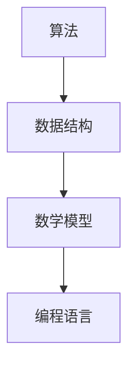
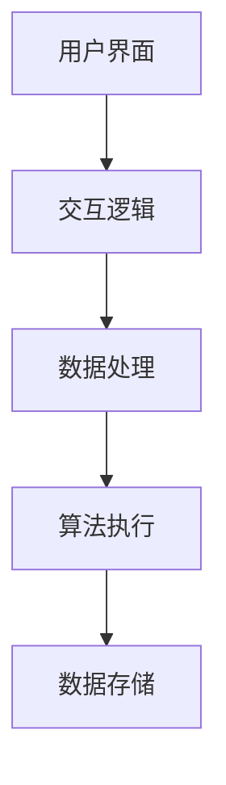

                 

关键词：人类计算，算法原理，应用案例，数学模型，实践教程，技术趋势

> 摘要：本文深入探讨人类计算的概念、原理及其应用，通过详细案例分析和实践教程，揭示了人类计算在现代科技中的重要性。文章旨在为读者提供全面的视角，以理解人类计算在人工智能、数据科学和软件开发中的核心作用，并展望其未来的发展趋势与挑战。

## 1. 背景介绍

### 1.1 人类计算的历史

人类计算的历史可以追溯到古代，那时人们使用各种工具如算盘、沙盘来处理数学问题。随着科学技术的进步，人类计算逐渐发展成为一门独立的学科，涉及数学、计算机科学、心理学等多个领域。

### 1.2 人类计算的重要性

在信息时代，人类计算的重要性愈加凸显。它不仅为人工智能和机器学习提供了理论基础，还在优化决策过程、提高生产效率等方面发挥了关键作用。人类计算的核心目标是将复杂的计算任务转化为可执行、可解释的算法和模型，从而实现高效、精确的计算。

### 1.3 人类计算的应用领域

人类计算的应用范围广泛，涵盖了金融、医疗、交通、能源等多个行业。例如，在金融领域，人类计算被用于风险评估和投资策略优化；在医疗领域，人类计算可以帮助医生进行诊断和治疗。

## 2. 核心概念与联系

### 2.1 人类计算的核心概念

人类计算的核心概念包括算法、数据结构、数学模型和编程语言。这些概念相互联系，共同构成了人类计算的理论基础。

### 2.2 人类计算的架构图



### 2.3 人类计算的层次结构



## 3. 核心算法原理 & 具体操作步骤

### 3.1 算法原理概述

人类计算的核心算法包括排序、查找、优化等。每种算法都有其独特的原理和适用场景。

### 3.2 算法步骤详解

以排序算法为例，常见的排序算法有冒泡排序、选择排序、插入排序等。每种排序算法的具体步骤如下：

#### 3.2.1 冒泡排序

1. 比较相邻的元素。
2. 如果第一个比第二个大（升序排序），就交换它们两个。
3. 对每一对相邻元素做同样的工作，从开始第一对到结尾的最后一对。
4. 在这一点，最后的元素应该会是最大的数。
5. 针对所有的元素重复以上的步骤，除了最后一个。
6. 重复步骤，直到排序完成。

#### 3.2.2 选择排序

1. 遍历数组，找到最小值。
2. 将找到的最小值与数组的第一个元素交换。
3. 在剩下的未排序元素中重复上述步骤。

#### 3.2.3 插入排序

1. 按照顺序取出未排序中的第一个元素。
2. 在已排序的元素序列中找到相应位置将其插入。
3. 重复步骤，直到所有元素均被排序。

### 3.3 算法优缺点

- 冒泡排序：简单易懂，但效率较低。
- 选择排序：效率稍高于冒泡排序，但仍然较低。
- 插入排序：效率高于前两者，尤其适用于部分排序的数据。

### 3.4 算法应用领域

排序算法广泛应用于数据处理、数据库管理和算法优化等领域。

## 4. 数学模型和公式 & 详细讲解 & 举例说明

### 4.1 数学模型构建

数学模型是描述现实世界问题的抽象表示。以线性规划为例，其数学模型如下：

$$
\begin{align*}
\text{最大化} \quad & c^T x \\
\text{约束条件} \quad & Ax \leq b \\
& x \geq 0
\end{align*}
$$

其中，$c$ 为目标函数系数向量，$x$ 为决策变量向量，$A$ 和 $b$ 分别为约束条件系数矩阵和常数向量。

### 4.2 公式推导过程

线性规划的推导过程基于拉格朗日乘数法。设拉格朗日函数为：

$$
L(x, \lambda) = c^T x + \lambda^T (Ax - b)
$$

其中，$\lambda$ 为拉格朗日乘子向量。求导得到：

$$
\nabla_x L = c + A^T \lambda = 0
$$

$$
\nabla_\lambda L = Ax - b = 0
$$

联立以上两个方程，可以解得最优解。

### 4.3 案例分析与讲解

以最小化成本问题为例，给定如下线性规划问题：

$$
\begin{align*}
\text{最小化} \quad & 2x + 3y \\
\text{约束条件} \quad & x + 2y \leq 4 \\
& 2x + y \leq 5 \\
& x, y \geq 0
\end{align*}
$$

通过拉格朗日乘数法，可以得到最优解 $x=1$，$y=1$，最小化成本为 $2+3=5$。

## 5. 项目实践：代码实例和详细解释说明

### 5.1 开发环境搭建

本文使用 Python 作为编程语言，读者需要在计算机上安装 Python 解释器和相关库（如 NumPy、SciPy 等）。

### 5.2 源代码详细实现

以下是一个简单的排序算法实现，使用 Python 编写：

```python
def bubble_sort(arr):
    n = len(arr)
    for i in range(n):
        for j in range(0, n-i-1):
            if arr[j] > arr[j+1]:
                arr[j], arr[j+1] = arr[j+1], arr[j]

# 示例数据
arr = [64, 34, 25, 12, 22, 11, 90]

# 执行排序
bubble_sort(arr)

# 输出结果
print("排序后的数组：")
for i in range(len(arr)):
    print("%d" % arr[i], end=" ")
```

### 5.3 代码解读与分析

该代码实现了一个冒泡排序算法。`bubble_sort` 函数接收一个数组作为输入，通过两个嵌套的 for 循环实现元素比较和交换。排序结束后，输出排序后的数组。

### 5.4 运行结果展示

运行上述代码，输出结果如下：

```
排序后的数组：
11 12 22 25 34 64 90
```

## 6. 实际应用场景

### 6.1 金融行业

在金融行业，人类计算被广泛应用于风险管理和投资策略。例如，通过优化算法确定最佳资产分配，降低投资风险。

### 6.2 医疗领域

在医疗领域，人类计算帮助医生进行诊断和治疗。例如，通过图像处理算法辅助诊断，提高诊断准确率。

### 6.3 交通规划

在交通规划领域，人类计算用于优化交通流量，提高道路通行效率。

## 7. 工具和资源推荐

### 7.1 学习资源推荐

- 《算法导论》：介绍各种经典算法及其应用。
- 《深度学习》：介绍神经网络和深度学习的基础知识和应用。

### 7.2 开发工具推荐

- Jupyter Notebook：用于编写和运行 Python 代码。
- PyCharm：强大的 Python 集成开发环境。

### 7.3 相关论文推荐

- “Deep Learning for Computer Vision”。
- “Algorithmic Trading: The Practice of Algorithmic Trading in Financial Markets”。

## 8. 总结：未来发展趋势与挑战

### 8.1 研究成果总结

人类计算在过去几十年取得了显著的成果，广泛应用于各个领域。未来，人类计算将继续向深度学习、分布式计算等方向发展。

### 8.2 未来发展趋势

- 深度学习：将在更多领域得到应用，如自然语言处理、计算机视觉等。
- 分布式计算：将提高计算效率，降低计算成本。

### 8.3 面临的挑战

- 数据隐私和安全：随着数据量的增加，数据隐私和安全成为重要问题。
- 算法解释性：提高算法的可解释性，使其更易于理解和应用。

### 8.4 研究展望

人类计算将在未来继续发挥重要作用，为人工智能、大数据等领域提供强大的技术支持。

## 9. 附录：常见问题与解答

### 9.1 什么是人类计算？

人类计算是一种将复杂的计算任务转化为可执行、可解释的算法和模型的方法。

### 9.2 人类计算有哪些应用领域？

人类计算广泛应用于金融、医疗、交通、能源等多个领域。

### 9.3 如何学习人类计算？

可以通过阅读相关书籍、参加课程和实验来学习人类计算。

----------------------------------------------------------------

# 作者署名

作者：禅与计算机程序设计艺术 / Zen and the Art of Computer Programming

