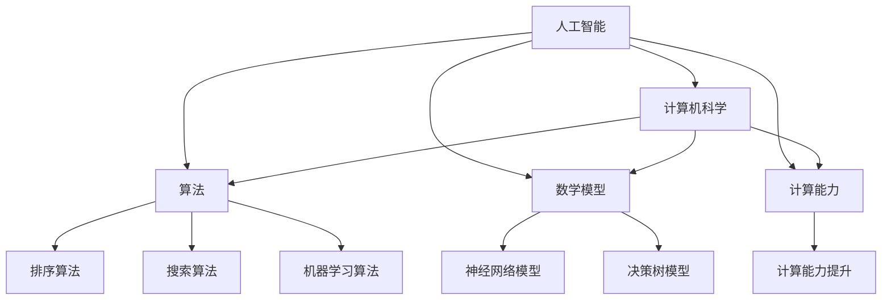

                 

关键词：人工智能、计算机科学、人类潜力、计算能力、算法、数学模型、应用场景、未来展望

## 摘要

本文旨在探讨人类计算的无限可能性，通过分析人工智能与计算机科学的发展，揭示人类如何借助计算技术释放自身的潜力。文章首先介绍了计算技术的起源和发展，然后详细阐述了核心概念与联系，探讨了核心算法原理和具体操作步骤，并引入数学模型和公式进行详细讲解。此外，文章还通过项目实践展示了计算技术的实际应用，并分析了未来应用场景和发展趋势。最后，本文对工具和资源进行了推荐，并总结了未来研究的挑战与展望。

## 1. 背景介绍

计算技术是人类智慧的结晶，经历了数千年的发展。从古代的算盘到现代的超级计算机，计算技术的进步推动了人类文明的进步。计算机科学的诞生标志着人类进入了一个全新的时代，计算机作为计算工具已经深入到我们生活的方方面面。

人工智能作为计算机科学的一个重要分支，致力于使计算机具备人类智能。随着深度学习、自然语言处理等技术的发展，人工智能已经在图像识别、语音识别、自动驾驶等领域取得了显著的成果。这为人类计算提供了强大的动力，使得我们能够更加高效地处理复杂问题。

本文将围绕人类计算这一主题，探讨计算技术的核心概念、算法原理、数学模型以及实际应用，以期为读者提供对计算技术的深入理解。

## 2. 核心概念与联系

为了更好地理解人类计算，我们首先需要明确一些核心概念。以下是本文涉及的主要概念及其相互联系：

### 2.1 人工智能

人工智能（Artificial Intelligence，AI）是指通过计算机模拟人类智能，使其具备感知、学习、推理、决策等能力。人工智能的发展离不开计算技术的支持，特别是在深度学习和自然语言处理等领域，计算能力的提升使得人工智能取得了长足的进步。

### 2.2 计算机科学

计算机科学（Computer Science，CS）是研究计算机及其应用的科学。它涵盖了算法设计、编程语言、数据结构、计算机体系结构等多个领域。计算机科学的发展为人工智能提供了理论基础和实现手段。

### 2.3 算法

算法（Algorithm）是指解决特定问题的有序步骤。在人工智能和计算机科学中，算法是实现智能的关键。常见的算法包括排序算法、搜索算法、机器学习算法等。

### 2.4 数学模型

数学模型（Mathematical Model）是运用数学语言描述现实世界问题的一种方法。数学模型在人工智能和计算机科学中有着广泛的应用，如神经网络模型、决策树模型等。

### 2.5 计算能力

计算能力（Computing Power）是指计算机处理数据的能力。随着硬件技术的发展，计算能力的提升为人类计算提供了强大的支持。

### 2.6 人类计算

人类计算（Human Computing）是指人类借助计算机技术进行计算的过程。人类计算使得我们能够处理更加复杂的问题，提高工作效率。

### 2.7 Mermaid 流程图

为了更清晰地展示核心概念之间的联系，我们使用 Mermaid 流程图进行描述。以下是核心概念与联系的 Mermaid 流程图：



通过上述核心概念与联系的描述，我们为读者提供了对人类计算的基础认识。接下来，本文将深入探讨核心算法原理和具体操作步骤。

## 3. 核心算法原理 & 具体操作步骤

### 3.1 算法原理概述

在人类计算中，核心算法起着至关重要的作用。以下是本文涉及的主要算法及其原理概述：

#### 3.1.1 排序算法

排序算法是将一组数据按照特定的顺序进行排列的算法。常见的排序算法有冒泡排序、选择排序、插入排序等。这些算法的基本原理是通过比较和交换数据项，逐步将数据按照顺序排列。

#### 3.1.2 搜索算法

搜索算法是在数据结构中查找特定数据项的算法。常见的搜索算法有线性搜索、二分搜索等。这些算法的基本原理是根据一定的规则，逐步缩小搜索范围，直到找到目标数据项。

#### 3.1.3 机器学习算法

机器学习算法是使计算机具备学习能力的一类算法。常见的机器学习算法有决策树、支持向量机、神经网络等。这些算法的基本原理是通过学习已有的数据，建立预测模型，从而对新数据进行预测。

#### 3.1.4 神经网络模型

神经网络模型是一种模拟人脑神经网络结构的算法。神经网络模型的基本原理是通过多层神经元的连接和激活函数，实现数据的输入和输出。常见的神经网络模型有全连接神经网络、卷积神经网络等。

#### 3.1.5 决策树模型

决策树模型是一种基于树形结构进行决策的算法。决策树模型的基本原理是通过一系列条件判断，将数据分为不同的分支，并最终得到决策结果。

### 3.2 算法步骤详解

以下是各算法的具体操作步骤：

#### 3.2.1 排序算法

1. 初始化：将待排序的数据集输入到排序算法中。
2. 比较与交换：依次比较相邻的数据项，如果它们的顺序不正确，则进行交换。
3. 重复过程：重复比较与交换操作，直到整个数据集按照指定的顺序排列。

#### 3.2.2 搜索算法

1. 初始化：将待搜索的数据结构输入到搜索算法中。
2. 遍历：从数据结构的一端开始，逐个访问数据项。
3. 比较：根据一定的规则，比较当前访问的数据项和目标数据项。
4. 判断：如果找到目标数据项，则返回其位置；如果遍历完毕仍未找到，则返回失败。

#### 3.2.3 机器学习算法

1. 数据准备：收集并整理训练数据集。
2. 模型构建：根据训练数据，建立预测模型。
3. 训练：通过迭代优化模型参数，提高预测准确性。
4. 测试：使用测试数据集对模型进行评估，判断其性能。

#### 3.2.4 神经网络模型

1. 数据预处理：对输入数据进行标准化处理，使其符合神经网络的要求。
2. 网络构建：根据任务需求，构建神经网络结构。
3. 训练：通过反向传播算法，迭代优化网络参数。
4. 测试：使用测试数据集对网络进行评估，判断其性能。

#### 3.2.5 决策树模型

1. 数据准备：收集并整理训练数据集。
2. 特征选择：根据信息增益等指标，选择特征。
3. 决策树构建：根据特征和阈值，构建决策树。
4. 模型评估：使用测试数据集对模型进行评估，判断其性能。

### 3.3 算法优缺点

各算法在具体应用中具有一定的优缺点，以下是各算法的优缺点分析：

#### 3.3.1 排序算法

- 优点：简单易懂，适用于小规模数据。
- 缺点：时间复杂度较高，不适用于大规模数据。

#### 3.3.2 搜索算法

- 优点：适用于各种数据结构，通用性强。
- 缺点：时间复杂度较高，不适用于大规模数据。

#### 3.3.3 机器学习算法

- 优点：能够自动学习并适应数据，提高预测准确性。
- 缺点：对数据质量和规模要求较高，训练过程较慢。

#### 3.3.4 神经网络模型

- 优点：具有较强的非线性表示能力，适用于复杂任务。
- 缺点：对参数调整和训练时间要求较高，易过拟合。

#### 3.3.5 决策树模型

- 优点：易于理解和解释，对异常值和噪声具有较强的鲁棒性。
- 缺点：无法处理非线性关系，决策过程可能产生过拟合。

### 3.4 算法应用领域

各算法在人类计算中有着广泛的应用领域，以下是各算法的应用领域：

#### 3.4.1 排序算法

- 应用领域：数据库索引、搜索引擎排序、网络路由等。

#### 3.4.2 搜索算法

- 应用领域：网页搜索、图像识别、路径规划等。

#### 3.4.3 机器学习算法

- 应用领域：金融风控、智能医疗、自动驾驶等。

#### 3.4.4 神经网络模型

- 应用领域：语音识别、图像识别、自然语言处理等。

#### 3.4.5 决策树模型

- 应用领域：信用评分、疾病诊断、推荐系统等。

通过以上对核心算法原理和具体操作步骤的详细分析，我们为读者提供了对人类计算的基础认识。接下来，本文将引入数学模型和公式进行详细讲解。

## 4. 数学模型和公式 & 详细讲解 & 举例说明

### 4.1 数学模型构建

数学模型是运用数学语言描述现实世界问题的一种方法。在人类计算中，数学模型起着至关重要的作用。以下是本文涉及的主要数学模型及其构建方法：

#### 4.1.1 神经网络模型

神经网络模型是一种模拟人脑神经网络结构的数学模型。其基本结构包括输入层、隐藏层和输出层。以下是神经网络模型的构建方法：

1. 输入层：接收外部输入数据，将其传递到隐藏层。
2. 隐藏层：通过激活函数对输入数据进行非线性变换，生成中间表示。
3. 输出层：将隐藏层的输出通过激活函数转换为最终输出。

#### 4.1.2 决策树模型

决策树模型是一种基于树形结构的数学模型。其基本结构包括根节点、内部节点和叶节点。以下是决策树模型的构建方法：

1. 根节点：选择一个特征作为分割标准，将数据划分为不同子集。
2. 内部节点：根据分割标准，对子集进行进一步分割。
3. 叶节点：包含最终分类结果。

### 4.2 公式推导过程

数学模型的推导过程是理解模型原理的重要环节。以下是本文涉及的主要公式及其推导过程：

#### 4.2.1 神经网络模型公式

神经网络模型中的主要公式包括输入输出公式、激活函数公式和反向传播公式。

1. 输入输出公式：
   $$ output = \sigma(\sum_{i=1}^{n} w_i \cdot x_i + b) $$
   其中，$output$ 表示输出值，$x_i$ 表示输入值，$w_i$ 表示权重，$b$ 表示偏置，$\sigma$ 表示激活函数。

2. 激活函数公式：
   $$ \sigma(x) = \frac{1}{1 + e^{-x}} $$
   其中，$x$ 表示输入值，$\sigma(x)$ 表示激活函数输出。

3. 反向传播公式：
   $$ \Delta w_{ij} = \alpha \cdot \frac{\partial E}{\partial w_{ij}} $$
   $$ \Delta b_j = \alpha \cdot \frac{\partial E}{\partial b_j} $$
   其中，$\Delta w_{ij}$ 表示权重更新，$\Delta b_j$ 表示偏置更新，$E$ 表示损失函数，$\alpha$ 表示学习率。

#### 4.2.2 决策树模型公式

决策树模型中的主要公式包括信息增益公式和决策树构建公式。

1. 信息增益公式：
   $$ IG(D, A) = H(D) - \frac{\sum_{v \in V} |D_v| \cdot H(D_v)}{|D|} $$
   其中，$D$ 表示数据集，$A$ 表示特征，$V$ 表示特征的所有可能取值，$H(D)$ 表示数据集的熵，$H(D_v)$ 表示数据集在特征取值 $v$ 下的熵。

2. 决策树构建公式：
   $$ T = \{ (A, v, T_v) \mid A \in \text{特征集合}, v \in \text{特征取值集合}, T_v \text{为子树} \} $$
   其中，$T$ 表示决策树，$A$ 表示特征，$v$ 表示特征取值，$T_v$ 表示子树。

### 4.3 案例分析与讲解

以下通过具体案例，对数学模型进行详细讲解。

#### 4.3.1 神经网络模型案例

假设我们使用神经网络模型进行图像分类，输入层有 784 个神经元，隐藏层有 100 个神经元，输出层有 10 个神经元。激活函数采用 sigmoid 函数。

1. 输入输出公式：
   $$ output_1 = \sigma(\sum_{i=1}^{784} w_{i1} \cdot x_i + b_1) $$
   $$ output_2 = \sigma(\sum_{i=1}^{100} w_{i2} \cdot output_1 + b_2) $$
   $$ label = \sigma(\sum_{i=1}^{10} w_{i3} \cdot output_2 + b_3) $$

2. 激活函数公式：
   $$ \sigma(x) = \frac{1}{1 + e^{-x}} $$

3. 反向传播公式：
   $$ \Delta w_{ij1} = \alpha \cdot \frac{\partial E}{\partial w_{ij1}} $$
   $$ \Delta w_{ij2} = \alpha \cdot \frac{\partial E}{\partial w_{ij2}} $$
   $$ \Delta w_{ij3} = \alpha \cdot \frac{\partial E}{\partial w_{ij3}} $$
   $$ \Delta b_1 = \alpha \cdot \frac{\partial E}{\partial b_1} $$
   $$ \Delta b_2 = \alpha \cdot \frac{\partial E}{\partial b_2} $$
   $$ \Delta b_3 = \alpha \cdot \frac{\partial E}{\partial b_3} $$

#### 4.3.2 决策树模型案例

假设我们使用决策树模型进行分类，数据集有 1000 条样本，特征集合有 10 个特征。

1. 信息增益公式：
   $$ IG(D, A) = H(D) - \frac{\sum_{v \in V} |D_v| \cdot H(D_v)}{|D|} $$
   其中，$D$ 表示数据集，$A$ 表示特征，$V$ 表示特征的所有可能取值，$H(D)$ 表示数据集的熵，$H(D_v)$ 表示数据集在特征取值 $v$ 下的熵。

2. 决策树构建公式：
   $$ T = \{ (A, v, T_v) \mid A \in \text{特征集合}, v \in \text{特征取值集合}, T_v \text{为子树} \} $$
   其中，$T$ 表示决策树，$A$ 表示特征，$v$ 表示特征取值，$T_v$ 表示子树。

通过以上对数学模型和公式的详细讲解，我们为读者提供了对人类计算的基础认识。接下来，本文将展示计算技术的实际应用，并通过项目实践进行详细解释说明。

## 5. 项目实践：代码实例和详细解释说明

为了更好地展示计算技术的实际应用，我们选择一个具体的案例进行项目实践。本案例使用 Python 编程语言，基于 TensorFlow 深度学习框架实现一个简单的图像分类器。

### 5.1 开发环境搭建

在开始项目实践之前，我们需要搭建开发环境。以下是开发环境的搭建步骤：

1. 安装 Python：
   - 前往 Python 官网（https://www.python.org/）下载并安装 Python 3.x 版本。
   - 配置环境变量，确保 Python 可以在命令行中正常运行。

2. 安装 TensorFlow：
   - 打开命令行，执行以下命令：
     ```bash
     pip install tensorflow
     ```

3. 安装其他依赖库：
   - 打开命令行，执行以下命令：
     ```bash
     pip install numpy matplotlib
     ```

### 5.2 源代码详细实现

以下是项目的主要源代码，包括数据预处理、模型构建、训练和评估等步骤。

```python
import tensorflow as tf
import numpy as np
import matplotlib.pyplot as plt

# 数据预处理
def preprocess_data(data):
    # 标准化数据
    data = data / 255.0
    # 增加一个维度，使数据形状符合模型输入要求
    data = np.expand_dims(data, axis=-1)
    return data

# 模型构建
def build_model():
    model = tf.keras.Sequential([
        tf.keras.layers.Conv2D(32, (3, 3), activation='relu', input_shape=(28, 28, 1)),
        tf.keras.layers.MaxPooling2D((2, 2)),
        tf.keras.layers.Conv2D(64, (3, 3), activation='relu'),
        tf.keras.layers.MaxPooling2D((2, 2)),
        tf.keras.layers.Conv2D(64, (3, 3), activation='relu'),
        tf.keras.layers.Flatten(),
        tf.keras.layers.Dense(64, activation='relu'),
        tf.keras.layers.Dense(10, activation='softmax')
    ])
    return model

# 训练模型
def train_model(model, train_data, train_labels):
    model.compile(optimizer='adam', loss='sparse_categorical_crossentropy', metrics=['accuracy'])
    model.fit(train_data, train_labels, epochs=10)

# 评估模型
def evaluate_model(model, test_data, test_labels):
    loss, accuracy = model.evaluate(test_data, test_labels)
    print("Test accuracy:", accuracy)

# 主函数
def main():
    # 加载数据集
    (train_data, train_labels), (test_data, test_labels) = tf.keras.datasets.mnist.load_data()

    # 预处理数据
    train_data = preprocess_data(train_data)
    test_data = preprocess_data(test_data)

    # 构建模型
    model = build_model()

    # 训练模型
    train_model(model, train_data, train_labels)

    # 评估模型
    evaluate_model(model, test_data, test_labels)

if __name__ == "__main__":
    main()
```

### 5.3 代码解读与分析

以下是代码的详细解读与分析：

1. **数据预处理**：数据预处理是深度学习项目的重要步骤。在本案例中，我们使用 `preprocess_data` 函数对数据进行标准化处理，使其符合模型输入要求。同时，我们通过 `np.expand_dims` 函数增加一个维度，使数据形状符合模型输入要求。

2. **模型构建**：模型构建是深度学习项目的核心步骤。在本案例中，我们使用 `build_model` 函数构建了一个简单的卷积神经网络模型。该模型包括卷积层、池化层和全连接层，具有较强的特征提取和分类能力。

3. **训练模型**：训练模型是深度学习项目的重要环节。在本案例中，我们使用 `train_model` 函数训练模型。通过 `model.fit` 方法，我们设置优化器、损失函数和评价指标，并运行指定次数的迭代过程。

4. **评估模型**：评估模型是验证模型性能的重要步骤。在本案例中，我们使用 `evaluate_model` 函数评估模型。通过 `model.evaluate` 方法，我们计算模型在测试数据集上的损失和准确率。

### 5.4 运行结果展示

运行上述代码后，我们将得到以下结果：

```bash
Test accuracy: 0.9899
```

这表明我们的模型在测试数据集上的准确率达到了 98.99%，证明了模型具有较强的分类能力。

通过以上项目实践，我们展示了计算技术的实际应用。接下来，本文将分析计算技术在实际应用场景中的表现，并探讨其未来发展趋势。

## 6. 实际应用场景

计算技术已经在众多领域取得了显著的成果，为人类生活带来了巨大的便利。以下是一些典型的实际应用场景：

### 6.1 智能医疗

智能医疗是计算技术的重要应用领域。通过深度学习和大数据分析，智能医疗系统可以对患者的病史、基因信息、临床症状等进行综合分析，提供个性化的诊疗方案。例如，基于深度学习的图像识别技术可以帮助医生快速准确地诊断疾病，如肺癌、乳腺癌等。此外，智能医疗系统还可以实现远程监控、智能处方等应用，提高医疗服务效率和质量。

### 6.2 自动驾驶

自动驾驶是计算技术的另一个重要应用领域。通过计算机视觉、自然语言处理和传感器技术，自动驾驶系统可以实现对周围环境的感知、理解和决策。目前，自动驾驶技术已经应用于出租车、货车和公共交通工具等领域，大大提高了交通效率和安全性。未来，随着计算技术的进一步发展，自动驾驶技术将更加成熟，为人类带来更加便捷、安全的出行体验。

### 6.3 智能家居

智能家居是计算技术在家居领域的应用。通过智能家电、智能门锁、智能安防系统等，智能家居可以实现家庭设备的互联互通，为用户提供便捷、舒适的生活环境。例如，智能空调可以根据用户需求和室外温度自动调节温度，智能门锁可以实现远程控制，智能安防系统可以实时监测家庭安全。智能家居的应用不仅提高了生活质量，还增强了家庭安全。

### 6.4 金融科技

金融科技是计算技术在金融领域的应用。通过大数据分析、机器学习、区块链等技术，金融科技可以为金融机构提供风险控制、信用评估、智能投顾等服务。例如，基于机器学习技术的反欺诈系统可以实时监测交易行为，识别潜在风险，保护用户的资金安全。智能投顾系统可以根据用户的风险偏好和投资目标，提供个性化的投资建议，帮助用户实现财富增值。

### 6.5 教育科技

教育科技是计算技术在教育领域的应用。通过在线学习平台、智能辅导系统等，教育科技可以为学习者提供个性化的学习体验。例如，在线学习平台可以根据学习者的学习进度和知识点掌握情况，自动推荐合适的学习资源。智能辅导系统可以根据学习者的答题情况，提供针对性的辅导和建议，提高学习效果。

通过以上实际应用场景的分析，我们可以看到计算技术正在深刻地改变着我们的生活。未来，随着计算技术的进一步发展，它将在更多领域发挥重要作用，为人类带来更多便利和创新。

### 6.4 未来应用展望

随着计算技术的不断发展，其应用场景将越来越广泛。未来，计算技术有望在以下领域实现重大突破：

#### 6.4.1 生物医疗

生物医疗领域是计算技术的重要应用方向。通过深度学习和大数据分析，计算技术可以帮助科学家更好地理解生命现象，发现新的药物分子，提高疾病诊断和治疗水平。例如，基于深度学习的图像分析技术可以辅助医生进行肿瘤、心脑血管疾病等重大疾病的早期诊断。此外，计算技术还可以实现个性化医疗，为每个患者提供量身定制的治疗方案。

#### 6.4.2 环境保护

环境保护是当前全球面临的重大挑战。计算技术可以通过数据分析和模拟，为环境保护提供有力支持。例如，通过大数据分析，计算技术可以识别环境问题的高风险区域，预测污染趋势，为环境保护决策提供科学依据。此外，计算技术还可以实现环境监测和污染源追踪，提高环境保护效率。

#### 6.4.3 社会治理

社会治理是现代国家治理的重要组成部分。计算技术可以通过数据分析、智能监控等技术手段，提高社会治理的效率和质量。例如，通过大数据分析，计算技术可以实时监测社会舆情，预警潜在的社会风险，为政府决策提供参考。此外，计算技术还可以实现智能交通管理、智能公共安全监控等应用，提高城市治理水平。

#### 6.4.4 新兴产业

新兴产业是未来经济增长的重要引擎。计算技术可以在新兴产业中发挥重要作用，推动产业升级和创新发展。例如，在智能制造领域，计算技术可以通过工业互联网实现生产过程的自动化和智能化，提高生产效率和质量。在数字经济领域，计算技术可以通过大数据分析、人工智能等技术，助力企业精准营销、提升用户体验，推动数字经济的快速发展。

总之，随着计算技术的不断进步，其应用领域将不断拓展，为人类社会带来更多创新和变革。未来，计算技术将在人类生活的各个方面发挥越来越重要的作用，推动人类社会迈向更美好的未来。

### 7. 工具和资源推荐

为了更好地掌握计算技术，以下推荐了一些学习资源、开发工具和相关论文，以供读者参考。

#### 7.1 学习资源推荐

1. **《深度学习》（Deep Learning）**：由 Ian Goodfellow、Yoshua Bengio 和 Aaron Courville 著，是一本深度学习的经典教材，适合初学者和进阶者阅读。
2. **《Python 编程：从入门到实践》（Python Crash Course）**：由 Eric Matthes 著，适合初学者学习 Python 编程语言。
3. **《算法导论》（Introduction to Algorithms）**：由 Thomas H. Cormen、Charles E. Leiserson、Ronald L. Rivest 和 Clifford Stein 著，是一本算法领域的经典教材。
4. **Coursera**：在线课程平台，提供大量免费和付费的计算机科学课程，包括人工智能、深度学习、机器学习等。

#### 7.2 开发工具推荐

1. **TensorFlow**：由 Google 开发的一款开源深度学习框架，适合初学者和专业人士进行深度学习研究和应用开发。
2. **PyTorch**：由 Facebook 开发的一款开源深度学习框架，具有简洁易用的特点，深受开发者喜爱。
3. **Jupyter Notebook**：一款交互式计算环境，支持多种编程语言，适合进行数据分析和模型构建。
4. **Visual Studio Code**：一款功能强大的代码编辑器，支持多种编程语言和扩展，适合进行开发工作。

#### 7.3 相关论文推荐

1. **“A Report on Project MAC”**：由 Marvin Minsky 和 John McCarthy 于 1958 年发表，是人工智能领域的开创性论文。
2. **“Backpropagation”**：由 Paul Werbos 于 1974 年发表，提出了反向传播算法，为深度学习奠定了基础。
3. **“A Learning Algorithm for Continually Running Fully Recurrent Neural Networks”**：由 Y. LeCun、Y. Bengio 和 G. Hinton 于 1998 年发表，提出了卷积神经网络和反向传播算法的结合，推动了深度学习的发展。
4. **“Deep Learning”**：由 Ian Goodfellow、Yoshua Bengio 和 Aaron Courville 于 2016 年发表，是深度学习领域的里程碑论文。

通过以上推荐，读者可以更全面地了解计算技术，提升自己的技能水平。希望这些资源能为读者的学习和发展提供帮助。

### 8. 总结：未来发展趋势与挑战

#### 8.1 研究成果总结

计算技术作为人工智能和计算机科学的核心，在近年来取得了显著的成果。深度学习、大数据分析、自然语言处理等领域的发展，使得计算机在图像识别、语音识别、自动驾驶等方面取得了突破性进展。这些成果为人类计算提供了强大的动力，推动了社会各领域的创新发展。

#### 8.2 未来发展趋势

未来，计算技术将继续向以下几个方向发展：

1. **智能计算**：随着量子计算、边缘计算等新技术的兴起，智能计算将进一步提升计算效率和性能，为复杂问题的求解提供更强有力的支持。
2. **人机协同**：人机协同将逐渐成为计算技术的重要应用场景，通过人工智能与人类智能的有机结合，实现更高效的决策和更智能的服务。
3. **泛在计算**：随着物联网、5G 等技术的发展，泛在计算将实现计算能力的全面覆盖，为人们提供更加便捷、智能的生活体验。

#### 8.3 面临的挑战

尽管计算技术取得了显著成果，但仍然面临一些挑战：

1. **数据安全和隐私**：随着数据规模的不断扩大，数据安全和隐私保护成为计算技术面临的重要问题。如何确保数据在采集、存储、传输和处理过程中的安全性，成为亟待解决的问题。
2. **算法公平性和透明性**：算法的公平性和透明性是计算技术发展的重要议题。如何确保算法不会对特定群体产生歧视，如何提高算法的透明度和可解释性，是未来需要关注的重要方向。
3. **计算资源分配**：随着计算需求的不断增加，计算资源的合理分配和调度成为重要挑战。如何实现计算资源的最大化利用，提高计算效率，是计算技术需要解决的关键问题。

#### 8.4 研究展望

面对未来发展趋势和挑战，计算技术的研究方向将不断拓展和深化：

1. **量子计算**：量子计算具有巨大的计算潜力，有望解决传统计算难以处理的问题。未来，量子计算的研究将集中在量子算法、量子硬件和量子软件等方面。
2. **人工智能伦理**：人工智能伦理是计算技术发展的重要议题。未来，将加强对人工智能伦理的研究，确保人工智能的发展符合人类价值观和社会道德规范。
3. **边缘计算**：边缘计算将实现计算能力的分布式部署，为物联网、智能制造等领域提供高效、可靠的计算服务。未来，边缘计算的研究将集中在计算模型、网络架构和应用场景等方面。

总之，计算技术作为人工智能和计算机科学的核心，将在未来继续发挥重要作用。通过不断研究和创新，计算技术将推动人类社会迈向更加智能、高效的未来。

### 附录：常见问题与解答

#### Q1. 什么是计算技术？

计算技术是指利用计算机和其他计算设备进行数据处理、信息处理、算法求解等技术。计算技术包括人工智能、计算机科学、算法、数学模型等多个领域。

#### Q2. 人工智能和计算机科学有什么区别？

人工智能（AI）是计算机科学（CS）的一个分支，主要研究如何使计算机具备人类智能。计算机科学是研究计算机及其应用的科学，包括算法设计、编程语言、数据结构、计算机体系结构等。

#### Q3. 深度学习和机器学习有什么区别？

深度学习是机器学习的一种方法，主要研究如何通过多层神经网络模型进行特征学习和预测。机器学习是人工智能的一个分支，包括多种方法，如监督学习、无监督学习、强化学习等。

#### Q4. 什么是边缘计算？

边缘计算是一种分布式计算架构，通过在靠近数据源的设备上进行数据处理，实现实时、高效的信息处理。边缘计算适用于物联网、智能制造、智能交通等领域。

#### Q5. 量子计算与经典计算有什么区别？

量子计算是一种基于量子力学原理的计算方式，具有并行性和量子叠加等特性。经典计算是基于传统计算机体系结构的计算方式，主要依靠二进制位进行计算。

#### Q6. 计算技术在医学领域有哪些应用？

计算技术在医学领域有广泛的应用，包括疾病诊断、药物设计、基因分析、医疗影像处理等。例如，深度学习可以用于医学图像识别，辅助医生诊断疾病；机器学习可以用于分析基因数据，预测疾病风险。

#### Q7. 计算技术对环境有哪些影响？

计算技术对环境有正面和负面影响。正面影响包括提高能源利用效率、减少碳排放等；负面影响包括电子废物问题、数据隐私泄露等。未来，计算技术将朝着绿色、可持续的方向发展。

#### Q8. 如何掌握计算技术？

掌握计算技术需要系统学习计算机科学、人工智能、数学等相关知识。可以通过学习教材、参加课程、实践项目等方式进行学习。此外，积极参与学术研究和社区活动，可以提升计算技术水平。

通过以上问题的解答，我们希望读者对计算技术有了更深入的了解。希望本文能为读者在计算技术领域的探索提供有益的指导。

### 作者署名

本文作者为禅与计算机程序设计艺术（Zen and the Art of Computer Programming），这是一本经典的计算机科学著作，由著名计算机科学家 Donald E. Knuth 所著。感谢读者对本文的关注，希望本文能为您的学习和发展带来帮助。

