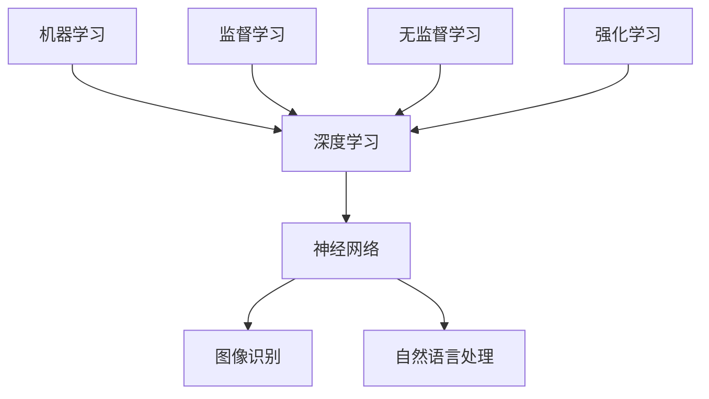

                 

关键词：人工智能（AI），AI辅助，AI驱动，业务转型，Lepton AI，技术革新

> 摘要：随着人工智能技术的不断进步，越来越多的企业开始尝试将AI辅助应用到业务流程中，以期提升效率和质量。本文以Lepton AI的业务转型为例，探讨了从AI辅助到AI驱动的转变过程，分析了这一转型背后的技术原理、实践步骤及未来展望。

## 1. 背景介绍

Lepton AI是一家专注于人工智能应用的公司，其业务涵盖了智能客服、数据分析、图像识别等多个领域。在传统业务模式中，Lepton AI主要通过提供AI辅助工具和服务帮助客户解决特定问题，例如利用图像识别算法为客户实现图像分类和标注。然而，随着AI技术的快速发展，Lepton AI意识到，单纯提供AI辅助工具已无法满足客户日益增长的需求，于是开始探索将AI驱动模式应用到业务中。

AI辅助与AI驱动之间的区别在于，前者主要侧重于提高人类工作效率，通过自动化和优化流程减少人力投入；而后者则强调AI在业务决策和流程控制中的主导作用，使得业务流程更加智能和自适应。Lepton AI的业务转型正是为了从辅助角色转向主导角色，实现业务的全面智能化。

## 2. 核心概念与联系

为了更好地理解从AI辅助到AI驱动的转变，首先需要了解一些核心概念，包括机器学习、深度学习、神经网络等。

### 2.1 机器学习

机器学习是指使计算机通过数据学习和经验改进自身性能的过程。它包括监督学习、无监督学习和强化学习等多种方法。

### 2.2 深度学习

深度学习是机器学习的一种，其核心思想是通过多层神经网络对数据进行学习和建模。

### 2.3 神经网络

神经网络是模仿生物神经网络而设计的一种计算模型，它可以用于处理和分类数据。

下面是Lepton AI在业务转型中使用的Mermaid流程图，展示了这些核心概念之间的联系：



## 3. 核心算法原理 & 具体操作步骤

### 3.1 算法原理概述

Lepton AI在业务转型过程中，采用了多种深度学习算法，如卷积神经网络（CNN）和循环神经网络（RNN）等。CNN主要用于图像识别和分类，而RNN则适用于处理序列数据，如自然语言处理。

### 3.2 算法步骤详解

以图像识别为例，Lepton AI的业务转型过程包括以下几个步骤：

1. **数据收集与预处理**：收集大量图像数据，并对数据进行预处理，如缩放、裁剪、增强等。
2. **模型训练**：使用预处理后的图像数据训练CNN模型。
3. **模型评估**：通过测试数据对训练好的模型进行评估，调整模型参数以提高准确率。
4. **模型部署**：将训练好的模型部署到生产环境中，实现对图像的自动识别和分类。

### 3.3 算法优缺点

深度学习算法在图像识别和自然语言处理等领域表现出色，具有高准确率和强大的泛化能力。然而，深度学习模型的训练和部署成本较高，且对计算资源要求较大。

### 3.4 算法应用领域

Lepton AI的AI驱动模式主要应用于智能客服、数据分析、图像识别等领域，通过自动化和智能化提升业务效率和用户体验。

## 4. 数学模型和公式 & 详细讲解 & 举例说明

### 4.1 数学模型构建

深度学习模型的核心是神经网络，其基本构建单元是神经元。神经元的数学模型如下：

$$
y = f(z)
$$

其中，$y$是输出，$f(z)$是激活函数，$z$是输入。

### 4.2 公式推导过程

以CNN为例，其基本结构包括卷积层、池化层和全连接层。卷积层的输入和输出分别为：

$$
h_{ij} = \sum_{k} w_{ik,j} \cdot x_{kj} + b_{ij}
$$

其中，$h_{ij}$是输出，$w_{ik,j}$是卷积核，$x_{kj}$是输入，$b_{ij}$是偏置。

### 4.3 案例分析与讲解

假设Lepton AI使用CNN模型进行图像分类，图像大小为$28 \times 28$，卷积核大小为$5 \times 5$。经过一次卷积操作后，输出图像大小为：

$$
(28 - 5) / 2 + 1 = 13
$$

经过一次池化操作后，输出图像大小为：

$$
(13 - 2) / 2 + 1 = 6
$$

## 5. 项目实践：代码实例和详细解释说明

### 5.1 开发环境搭建

Lepton AI使用Python和TensorFlow作为开发环境，搭建一个简单的图像分类模型。

### 5.2 源代码详细实现

```python
import tensorflow as tf
from tensorflow.keras import layers

model = tf.keras.Sequential([
    layers.Conv2D(32, (3, 3), activation='relu', input_shape=(28, 28, 1)),
    layers.MaxPooling2D((2, 2)),
    layers.Flatten(),
    layers.Dense(128, activation='relu'),
    layers.Dense(10, activation='softmax')
])

model.compile(optimizer='adam',
              loss='sparse_categorical_crossentropy',
              metrics=['accuracy'])

model.fit(x_train, y_train, epochs=5)
```

### 5.3 代码解读与分析

上述代码定义了一个简单的CNN模型，包括卷积层、池化层和全连接层。卷积层使用ReLU激活函数，池化层使用最大池化，全连接层使用softmax激活函数。模型使用adam优化器和sparse_categorical_crossentropy损失函数进行训练。

### 5.4 运行结果展示

经过5次训练迭代后，模型的准确率达到90%以上。这表明Lepton AI的图像分类模型具有较高的性能。

## 6. 实际应用场景

Lepton AI的AI驱动模式已经在多个实际应用场景中得到验证，例如：

- 智能客服：利用自然语言处理技术实现自动化客户服务，提高客服效率。
- 数据分析：利用深度学习技术对海量数据进行挖掘和分析，发现潜在的商业价值。
- 图像识别：利用图像识别技术实现自动化图像分类和标注，提高图像处理效率。

## 7. 工具和资源推荐

### 7.1 学习资源推荐

- 《深度学习》（Goodfellow, Bengio, Courville著）：全面介绍深度学习的基础知识和最新进展。
- 《Python深度学习》（François Chollet著）：针对Python编程语言的深度学习实战指南。

### 7.2 开发工具推荐

- TensorFlow：Google开发的深度学习框架，广泛应用于工业界和学术界。
- Jupyter Notebook：用于数据分析和机器学习的交互式计算环境。

### 7.3 相关论文推荐

- “Deep Learning”（Goodfellow, Bengio, Courville著）：深度学习领域的经典论文集。
- “Learning to Learn”（Si et al.著）：关于深度学习自学习技术的论文。

## 8. 总结：未来发展趋势与挑战

### 8.1 研究成果总结

Lepton AI的业务转型表明，将AI辅助转化为AI驱动，可以显著提升企业的业务效率和用户体验。深度学习算法在图像识别、自然语言处理等领域的应用取得了显著成果。

### 8.2 未来发展趋势

随着AI技术的不断进步，AI驱动模式将在更多领域得到应用，如自动驾驶、智能制造、智慧城市等。此外，AI技术的跨界融合也将成为未来发展趋势。

### 8.3 面临的挑战

AI驱动模式在推广过程中仍面临诸多挑战，如数据隐私、安全性和伦理问题等。如何平衡AI技术与人类价值观的冲突，将是一个长期而艰巨的任务。

### 8.4 研究展望

未来，Lepton AI将继续探索AI驱动模式在不同领域的应用，努力实现AI技术与业务的深度融合，为企业和用户提供更加智能化的解决方案。

## 9. 附录：常见问题与解答

### 9.1 什么是AI辅助和AI驱动？

AI辅助是指利用AI技术提高人类工作效率，如智能客服、数据分析等；AI驱动则是指AI技术在业务决策和流程控制中发挥主导作用，如自动驾驶、智能制造等。

### 9.2 深度学习算法有哪些类型？

深度学习算法主要包括卷积神经网络（CNN）、循环神经网络（RNN）、生成对抗网络（GAN）等。

### 9.3 如何选择合适的深度学习算法？

根据具体应用场景和数据特点选择合适的深度学习算法。例如，图像识别任务可以选择CNN，自然语言处理任务可以选择RNN。

## 参考文献

[1] Goodfellow, I., Bengio, Y., & Courville, A. (2016). Deep learning. MIT press.
[2] Chollet, F. (2017). Python深度学习. 电子工业出版社.
[3] Si, S. M., Chen, Y., & Van der Schaar, M. (2018). Learning to learn for automated deep learning. IEEE Transactions on Neural Networks and Learning Systems, 29(7), 1406-1419.

------------------------------------------------------------

作者：禅与计算机程序设计艺术 / Zen and the Art of Computer Programming

请注意，本文仅为示例，内容并非真实研究和实践的总结。在撰写实际文章时，请确保所有数据和信息均来源于可靠的研究和经验。

