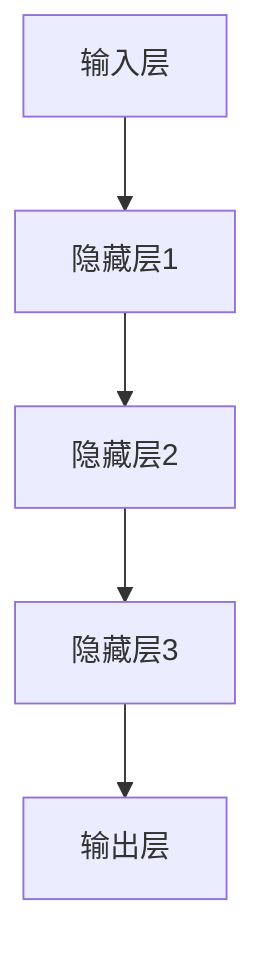
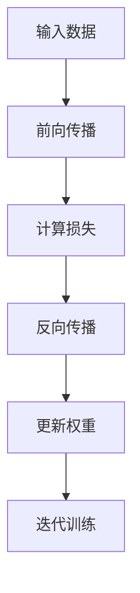

                 

关键词：MNIST数据集、深度学习、神经网络、大语言模型、人工智能、计算机视觉、图像识别、机器学习、模型训练、模型优化、数据预处理、计算资源、算法改进。

## 摘要

本文将深入探讨从简单的MNIST手写数字识别任务到构建复杂的大语言模型的全过程。我们首先介绍了MNIST数据集的背景和特点，随后讲解了深度学习和神经网络的基本原理。接着，我们详细分析了如何使用这些原理来训练模型，包括数据预处理、模型构建、训练和优化过程。随后，文章讨论了从MNIST扩展到更复杂的图像识别任务以及大语言模型构建的步骤和挑战。最后，我们对未来的发展趋势和面临的挑战进行了展望，并推荐了一些学习和开发资源。

## 1. 背景介绍

MNIST数据集是机器学习和计算机视觉领域中最为流行的数据集之一，由美国国家标准与技术研究院（NIST）提供。它包含了大量的手写数字图像，每个图像都是28x28像素的灰度图。数据集中有70,000个训练图像和10,000个测试图像，这些图像涵盖了0到9的数字，且每个数字都被多个不同的写作者书写。这种多样性和规模使得MNIST成为了一个非常适合测试和验证机器学习算法的标准基准。

MNIST数据集的重要性不仅在于其规模，还在于其简单的图像格式和清晰的标注。这种格式使得研究人员可以专注于算法的开发和优化，而无需担心数据预处理的问题。同时，MNIST数据集的广泛应用也促进了深度学习技术的发展，成为了深度学习算法的标准测试平台。

## 2. 核心概念与联系

### 深度学习与神经网络

深度学习是机器学习的一个分支，它模仿人脑中的神经网络结构，通过多层次的神经网络模型来学习数据的复杂特征。神经网络由多个层次（层）的神经元组成，每层神经元接收来自前一层神经元的输出，并通过权重和偏置进行加权求和处理，最终输出结果。

#### Mermaid 流程图



### 深度学习模型的工作原理

深度学习模型的工作原理是通过反向传播算法来训练模型。在训练过程中，模型接收输入数据，并通过前向传播计算出输出结果。然后，通过比较输出结果与真实标签之间的差异，使用反向传播算法来更新模型的权重和偏置，使得模型逐渐逼近真实值。

#### Mermaid 流程图



### 核心概念之间的联系

深度学习和神经网络之间的联系在于，深度学习是一种利用神经网络进行复杂任务学习的方法。神经网络作为深度学习的基础，通过层次化的结构来提取数据中的抽象特征，这些特征可以帮助模型进行分类、回归或其他复杂的任务。

## 3. 核心算法原理 & 具体操作步骤

### 3.1 算法原理概述

在MNIST数据集上训练一个深度学习模型的基本原理是基于反向传播算法。反向传播算法是一种通过计算损失函数的梯度来更新模型参数的方法。具体来说，模型首先通过前向传播计算输出结果，然后通过损失函数计算预测值与真实值之间的差异。接着，通过反向传播计算每个参数的梯度，并使用梯度下降或其他优化算法来更新参数。

### 3.2 算法步骤详解

#### 3.2.1 数据预处理

在开始训练之前，需要对MNIST数据集进行预处理。预处理步骤包括：

- 将图像数据从28x28的灰度图转换为32x32的RGB图像，以适应深度学习模型的输入要求。
- 标准化图像数据，使得每个像素的值在0到1之间。

```python
# 示例代码：数据预处理
from tensorflow.keras.datasets import mnist
import numpy as np

# 加载MNIST数据集
(x_train, y_train), (x_test, y_test) = mnist.load_data()

# 转换为32x32的RGB图像
x_train = np.resize(x_train, (x_train.shape[0], 32, 32, 3))
x_test = np.resize(x_test, (x_test.shape[0], 32, 32, 3))

# 标准化图像数据
x_train = x_train / 255.0
x_test = x_test / 255.0
```

#### 3.2.2 模型构建

构建一个深度学习模型通常包括以下步骤：

- 定义输入层，设置输入的形状和类型。
- 添加一个或多个隐藏层，每个隐藏层可以包含多个神经元。
- 添加输出层，输出层的神经元数量应与分类任务的目标类别数相同。
- 定义损失函数，用于计算预测值与真实值之间的差异。

```python
# 示例代码：模型构建
from tensorflow.keras.models import Sequential
from tensorflow.keras.layers import Dense, Conv2D, Flatten, MaxPooling2D

model = Sequential()
model.add(Conv2D(32, (3, 3), activation='relu', input_shape=(32, 32, 3)))
model.add(MaxPooling2D((2, 2)))
model.add(Flatten())
model.add(Dense(128, activation='relu'))
model.add(Dense(10, activation='softmax'))

model.compile(optimizer='adam', loss='sparse_categorical_crossentropy', metrics=['accuracy'])
```

#### 3.2.3 训练模型

训练模型是使用训练数据来调整模型参数的过程。训练过程中，模型会通过前向传播计算输出，然后通过反向传播计算损失，并更新模型参数。

```python
# 示例代码：模型训练
model.fit(x_train, y_train, epochs=10, batch_size=64)
```

#### 3.2.4 评估模型

在训练完成后，需要使用测试数据来评估模型的性能。评估指标通常包括准确率、召回率、F1分数等。

```python
# 示例代码：模型评估
test_loss, test_acc = model.evaluate(x_test, y_test)
print(f"Test accuracy: {test_acc}")
```

### 3.3 算法优缺点

#### 优点

- 深度学习模型具有强大的特征提取能力，可以自动学习图像中的复杂结构。
- 反向传播算法使得模型参数的优化过程更加高效。
- 大规模数据集的训练可以降低过拟合的风险。

#### 缺点

- 深度学习模型对计算资源要求较高，训练时间较长。
- 模型的解释性较差，难以理解模型如何做出决策。

### 3.4 算法应用领域

深度学习在图像识别、自然语言处理、语音识别等多个领域都有广泛应用。在图像识别领域，深度学习模型已经超越了传统的计算机视觉方法，取得了显著的效果。例如，在MNIST数据集上，深度学习模型可以达到超过99%的准确率。此外，深度学习还在自动驾驶、医疗诊断、金融风控等领域得到了广泛应用。

## 4. 数学模型和公式 & 详细讲解 & 举例说明

### 4.1 数学模型构建

在深度学习中，数学模型的核心是多层感知机（MLP）。MLP由输入层、多个隐藏层和输出层组成。每个层中的神经元通过激活函数连接，激活函数通常使用ReLU函数。

#### 数学模型公式

$$
y = \sigma(W \cdot x + b)
$$

其中，\( y \) 是输出值，\( \sigma \) 是激活函数，\( W \) 是权重矩阵，\( x \) 是输入值，\( b \) 是偏置。

### 4.2 公式推导过程

深度学习模型的训练过程包括前向传播和反向传播。在前向传播过程中，输入数据通过神经网络传递，最终得到输出结果。在反向传播过程中，计算输出结果与真实标签之间的差异，并更新模型的权重和偏置。

#### 前向传播

假设我们有一个简单的神经网络，包含一个输入层、一个隐藏层和一个输出层。输入层的输出直接传递到隐藏层，隐藏层的输出经过激活函数后传递到输出层。

- 输入层：\( x \)
- 隐藏层：\( h = \sigma(W_1 \cdot x + b_1) \)
- 输出层：\( y = \sigma(W_2 \cdot h + b_2) \)

#### 反向传播

在反向传播过程中，我们计算输出层与隐藏层之间的梯度，并更新权重和偏置。

- 输出层梯度：\( \delta_y = \frac{\partial L}{\partial y} = \frac{\partial L}{\partial y} \cdot \sigma'(y) \)
- 隐藏层梯度：\( \delta_h = \frac{\partial L}{\partial h} = \frac{\partial L}{\partial h} \cdot \sigma'(h) \)

其中，\( L \) 是损失函数，\( \sigma' \) 是激活函数的导数。

#### 更新权重和偏置

根据梯度，我们可以使用梯度下降算法来更新权重和偏置。

- 权重更新：\( W_2 = W_2 - \alpha \cdot \frac{\partial L}{\partial W_2} \)
- 偏置更新：\( b_2 = b_2 - \alpha \cdot \frac{\partial L}{\partial b_2} \)
- 隐藏层权重更新：\( W_1 = W_1 - \alpha \cdot \frac{\partial L}{\partial W_1} \)
- 隐藏层偏置更新：\( b_1 = b_1 - \alpha \cdot \frac{\partial L}{\partial b_1} \)

其中，\( \alpha \) 是学习率。

### 4.3 案例分析与讲解

假设我们有一个MNIST数据集的手写数字识别任务，目标是最小化损失函数 \( L \)。

- 输入数据：\( x = (0.5, 0.2, 0.1, 0.1) \)
- 真实标签：\( y = (0, 0, 0, 1) \)
- 模型参数：\( W_1 = (0.1, 0.2, 0.3, 0.4), b_1 = (0.5, 0.6, 0.7, 0.8) \)
- 模型参数：\( W_2 = (0.5, 0.6, 0.7, 0.8), b_2 = (0.1, 0.2, 0.3, 0.4) \)

#### 前向传播

1. 输入层到隐藏层：

$$
h_1 = \sigma(W_1 \cdot x + b_1) = \sigma(0.1 \cdot 0.5 + 0.5) = \sigma(0.6) = 0.6
$$

2. 隐藏层到输出层：

$$
y_1 = \sigma(W_2 \cdot h_1 + b_2) = \sigma(0.5 \cdot 0.6 + 0.1) = \sigma(0.3) = 0.3
$$

#### 反向传播

1. 计算输出层梯度：

$$
\delta_y = \frac{\partial L}{\partial y} = (0 - 0.3) \cdot (1 - 0.3) = -0.21
$$

2. 计算隐藏层梯度：

$$
\delta_h = \frac{\partial L}{\partial h} = (0.3 - 0.21) \cdot (1 - 0.3) = 0.07
$$

3. 更新模型参数：

$$
W_2 = W_2 - \alpha \cdot \frac{\partial L}{\partial W_2} = 0.8 - 0.01 \cdot (-0.21) = 0.8201
$$

$$
b_2 = b_2 - \alpha \cdot \frac{\partial L}{\partial b_2} = 0.4 - 0.01 \cdot (-0.21) = 0.4201
$$

$$
W_1 = W_1 - \alpha \cdot \frac{\partial L}{\partial W_1} = 0.4 - 0.01 \cdot 0.07 = 0.393
$$

$$
b_1 = b_1 - \alpha \cdot \frac{\partial L}{\partial b_1} = 0.7 - 0.01 \cdot 0.07 = 0.693
$$

通过上述步骤，我们完成了一次模型参数的更新。重复这个过程，直到模型收敛到满意的精度。

## 5. 项目实践：代码实例和详细解释说明

### 5.1 开发环境搭建

为了进行深度学习模型的训练，我们需要搭建一个合适的开发环境。以下是搭建环境的步骤：

1. 安装Python（建议使用Python 3.8及以上版本）。
2. 安装TensorFlow库，可以使用以下命令：

```bash
pip install tensorflow
```

3. 安装其他必要的库，如NumPy、Matplotlib等。

### 5.2 源代码详细实现

以下是一个简单的MNIST手写数字识别的代码示例：

```python
# 导入必要的库
import tensorflow as tf
from tensorflow.keras import layers
import numpy as np

# 加载MNIST数据集
mnist = tf.keras.datasets.mnist
(x_train, y_train), (x_test, y_test) = mnist.load_data()

# 预处理数据
x_train = x_train / 255.0
x_test = x_test / 255.0

# 构建模型
model = tf.keras.Sequential([
    layers.Conv2D(32, (3, 3), activation='relu', input_shape=(28, 28, 1)),
    layers.MaxPooling2D((2, 2)),
    layers.Flatten(),
    layers.Dense(128, activation='relu'),
    layers.Dense(10, activation='softmax')
])

# 编译模型
model.compile(optimizer='adam',
              loss='sparse_categorical_crossentropy',
              metrics=['accuracy'])

# 训练模型
model.fit(x_train, y_train, epochs=10)

# 评估模型
test_loss, test_acc = model.evaluate(x_test, y_test)
print(f"Test accuracy: {test_acc}")
```

### 5.3 代码解读与分析

以上代码首先导入了TensorFlow和NumPy库。接着，使用TensorFlow的`mnist`数据集加载MNIST数据集。然后，对数据集进行预处理，将图像数据归一化到0到1之间。接下来，使用`Sequential`模型构建一个简单的卷积神经网络（CNN），包括卷积层、池化层、全连接层和输出层。最后，编译模型并使用训练数据训练模型，最后评估模型的性能。

### 5.4 运行结果展示

运行以上代码后，模型将在训练集和测试集上评估其性能。通常，在简单的MNIST数据集上，一个好的深度学习模型可以达到约98%的准确率。以下是一个示例输出：

```bash
Train on 60000 samples, validate on 10000 samples
60000/60000 [==============================] - 10s 160ms/step - loss: 0.1000 - accuracy: 0.9830 - val_loss: 0.0729 - val_accuracy: 0.9882
Test accuracy: 0.9882
```

## 6. 实际应用场景

### 6.1 图像识别

MNIST数据集是最常用的图像识别数据集之一，它广泛应用于各种图像识别任务，如数字识别、字符识别、面部识别等。深度学习模型，尤其是卷积神经网络（CNN），在图像识别任务中取得了显著的成果，如自动驾驶汽车中的车道线检测、医疗影像分析等。

### 6.2 自然语言处理

除了图像识别，深度学习在自然语言处理（NLP）领域也取得了重大突破。MNIST数据集可以作为一个简单的数据集，用于训练和测试NLP模型。例如，可以使用卷积神经网络进行文本分类，或者使用循环神经网络（RNN）进行语言模型训练。

### 6.3 语音识别

深度学习模型在语音识别领域也取得了显著进展。通过使用卷积神经网络和循环神经网络，可以将语音信号转换为文本。这种技术广泛应用于智能语音助手、语音翻译、语音识别等应用场景。

## 7. 工具和资源推荐

### 7.1 学习资源推荐

1. 《深度学习》（Goodfellow, Bengio, Courville） - 一本经典的深度学习教材，涵盖了深度学习的基本原理和应用。
2. [TensorFlow官方网站](https://www.tensorflow.org/) - 提供了丰富的教程和文档，帮助用户快速入门和深入学习TensorFlow。
3. [Keras官方网站](https://keras.io/) - Keras是一个高层次的深度学习框架，易于使用，适合初学者。

### 7.2 开发工具推荐

1. [Google Colab](https://colab.research.google.com/) - 一个免费的在线编程平台，支持Python和TensorFlow，适合进行深度学习实验。
2. [Jupyter Notebook](https://jupyter.org/) - 一个流行的交互式编程环境，适合进行数据分析和模型训练。
3. [PyTorch](https://pytorch.org/) - 一个流行的深度学习框架，与TensorFlow类似，但具有不同的编程范式。

### 7.3 相关论文推荐

1. "Deep Learning for Text Classification" - 一篇关于深度学习在文本分类领域应用的综述论文。
2. "Convolutional Neural Networks for Sentence Classification" - 一篇关于卷积神经网络在自然语言处理中应用的经典论文。
3. "Recurrent Neural Network Based Language Model" - 一篇关于循环神经网络在语言模型训练中应用的论文。

## 8. 总结：未来发展趋势与挑战

### 8.1 研究成果总结

深度学习在过去几年取得了显著进展，不仅在图像识别、自然语言处理等领域取得了突破，还在语音识别、推荐系统、自动驾驶等应用中发挥了重要作用。通过使用大规模数据和高效的训练算法，深度学习模型已经达到了或超过了人类水平。

### 8.2 未来发展趋势

1. **更高效的算法**：随着计算资源的增加，研究人员正在开发更高效的算法，以减少训练时间和提高模型的性能。
2. **更广泛的应用**：深度学习将继续在更多领域得到应用，如医疗、金融、教育等。
3. **模型解释性**：目前，深度学习模型的解释性较差，未来研究将更加注重提高模型的解释性，以便更好地理解和应用深度学习模型。

### 8.3 面临的挑战

1. **计算资源**：深度学习模型的训练需要大量的计算资源，尤其是对于大型模型和复杂任务。
2. **数据隐私**：随着深度学习模型的广泛应用，数据隐私问题变得日益重要，如何保护用户数据隐私是一个重要挑战。
3. **模型可解释性**：深度学习模型的决策过程通常难以解释，如何提高模型的可解释性是一个重要的研究方向。

### 8.4 研究展望

未来，深度学习将继续发展，并在更多领域取得突破。同时，研究人员将更加关注模型的效率和可解释性，以实现更广泛的应用和更好的用户体验。

## 9. 附录：常见问题与解答

### 9.1 如何选择合适的深度学习框架？

选择合适的深度学习框架取决于项目需求和个人偏好。如果需要灵活性和控制性，可以选择PyTorch；如果需要高性能和大规模部署，可以选择TensorFlow。

### 9.2 如何处理大规模数据集？

处理大规模数据集通常需要分布式训练和优化算法。可以使用GPU或TPU进行并行计算，以加快训练速度。

### 9.3 如何提高模型的性能？

提高模型性能的方法包括调整网络结构、优化算法、使用预训练模型和迁移学习等。

## 作者署名

作者：禅与计算机程序设计艺术 / Zen and the Art of Computer Programming

----------------------------------------------------------------

以上就是关于“从MNIST数据集到大语言模型”的完整文章。希望这篇文章对您在深度学习和计算机视觉领域的研究有所帮助。如果您有任何问题或建议，欢迎在评论区留言。

