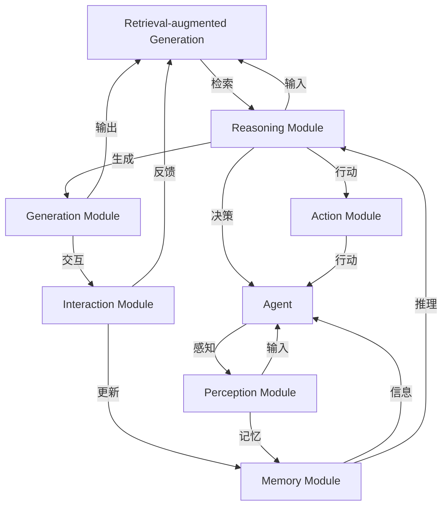

                 

关键词：RAG模型、Agent、个性化服务、用户交互历史、记忆维护

摘要：本文深入探讨了从RAG模型（Retrieval-augmented Generation）到Agent模型的转变，特别是在维护用户交互历史以提供个性化服务方面的应用。通过分析RAG模型的工作原理，我们探讨了如何利用记忆来增强Agent的交互能力，从而提供更精确、个性化的服务。文章将详细讲解核心算法原理、数学模型、项目实践以及实际应用场景，并展望未来的发展趋势与挑战。

## 1. 背景介绍

在人工智能领域，生成式模型（Generative Models）正变得越来越重要。其中，RAG模型（Retrieval-augmented Generation）是一种基于检索增强的生成模型，广泛应用于问答系统、文本生成、机器翻译等领域。RAG模型通过将检索模块与生成模块相结合，利用外部知识库来提升生成质量，从而在处理复杂任务时表现出色。

然而，随着用户交互的多样性和复杂性增加，RAG模型在处理个性化服务时面临一定的挑战。为此，我们需要将RAG模型进一步转变为Agent模型，以实现更加智能化、个性化的用户交互。在这个过程中，记忆的维护成为关键因素，本文将详细探讨这一转变过程，并分析如何利用用户交互历史来提供个性化服务。

## 2. 核心概念与联系

为了理解从RAG到Agent的转变，我们需要首先了解这两个概念的核心原理和架构。

### 2.1 RAG模型原理

RAG模型主要由三个模块组成：检索模块、生成模块和交互模块。

- **检索模块**：负责从外部知识库中检索相关信息，以支持生成模块。
- **生成模块**：基于检索到的信息生成文本。
- **交互模块**：负责与用户进行交互，收集用户反馈，以便进一步优化模型。

### 2.2 Agent模型原理

Agent模型是一种基于人工智能的自主系统，能够模拟人类的思维过程，进行推理和决策。Agent模型的核心是记忆模块，负责存储和检索用户交互历史，从而实现个性化服务。

- **感知模块**：负责接收外部信息，如用户提问、环境变化等。
- **记忆模块**：存储用户交互历史，包括提问、回答、偏好等信息。
- **推理模块**：基于记忆和感知信息进行推理和决策。
- **行动模块**：根据推理结果采取行动，如生成回答、推荐服务等。

### 2.3 Mermaid流程图

下面是RAG模型和Agent模型的Mermaid流程图：



## 3. 核心算法原理 & 具体操作步骤

### 3.1 算法原理概述

从RAG到Agent的转变主要涉及以下几个核心步骤：

1. **用户交互历史收集**：收集用户提问、回答、偏好等交互历史信息。
2. **记忆库构建**：基于收集到的用户交互历史，构建记忆库，以存储和检索相关信息。
3. **个性化服务生成**：利用记忆库和检索模块，生成针对用户个性化需求的回答或服务。
4. **反馈循环**：收集用户对生成的回答或服务的反馈，以进一步优化记忆库和模型。

### 3.2 算法步骤详解

1. **用户交互历史收集**：

   - **提问阶段**：用户向系统提问。
   - **回答阶段**：系统生成回答，并展示给用户。
   - **偏好收集**：用户对回答进行评价，系统收集用户偏好。

2. **记忆库构建**：

   - **信息存储**：将用户提问、回答、偏好等信息存储在记忆库中。
   - **信息分类**：对存储的信息进行分类，以便快速检索。

3. **个性化服务生成**：

   - **检索阶段**：根据用户提问，从记忆库中检索相关信息。
   - **生成阶段**：基于检索到的信息生成个性化回答或服务。

4. **反馈循环**：

   - **反馈收集**：用户对生成的回答或服务进行评价，系统收集用户反馈。
   - **模型优化**：根据用户反馈，更新记忆库和模型。

### 3.3 算法优缺点

#### 优点：

- **个性化服务**：通过维护用户交互历史，系统能够为用户提供更加个性化、针对性的服务。
- **自适应能力**：系统能够根据用户反馈不断优化自身，提高服务质量。

#### 缺点：

- **存储成本**：记忆库的构建需要大量存储空间，可能导致成本较高。
- **检索效率**：随着用户交互历史增加，检索效率可能会降低。

### 3.4 算法应用领域

- **智能客服**：通过维护用户交互历史，智能客服能够为用户提供更加个性化的服务，提高用户满意度。
- **推荐系统**：利用用户交互历史，推荐系统可以更准确地推荐用户感兴趣的内容。
- **问答系统**：通过维护用户交互历史，问答系统能够为用户提供更加丰富、个性化的回答。

## 4. 数学模型和公式 & 详细讲解 & 举例说明

### 4.1 数学模型构建

为了描述从RAG到Agent的转变过程，我们可以构建以下数学模型：

$$
\text{Agent} = f(\text{User Interaction History}, \text{Knowledge Base}, \text{User Feedback})
$$

其中，$f$ 表示从RAG模型到Agent模型的转换函数，$\text{User Interaction History}$ 表示用户交互历史，$\text{Knowledge Base}$ 表示外部知识库，$\text{User Feedback}$ 表示用户反馈。

### 4.2 公式推导过程

为了推导上述数学模型，我们可以分以下几个步骤：

1. **用户交互历史收集**：

   - **提问**：$Q = f_1(\text{User Input})$
   - **回答**：$A = f_2(Q, \text{Knowledge Base})$

2. **记忆库构建**：

   - **信息存储**：$M = f_3(A, \text{User Feedback})$
   - **信息分类**：$C = f_4(M)$

3. **个性化服务生成**：

   - **检索**：$R = f_5(Q, C)$
   - **生成**：$S = f_6(R, \text{Knowledge Base})$

4. **反馈循环**：

   - **反馈收集**：$F = f_7(S, \text{User Feedback})$
   - **模型优化**：$f = f_8(\text{User Interaction History}, \text{Knowledge Base}, F)$

### 4.3 案例分析与讲解

假设我们有一个问答系统，用户经常询问关于天气的信息。我们可以根据用户交互历史构建一个记忆库，以便在未来的交互中提供个性化服务。

1. **用户交互历史收集**：

   - **提问**：用户提问：“今天的天气如何？”
   - **回答**：系统回答：“今天的天气是晴天，温度约为25摄氏度。”
   - **偏好收集**：用户表示满意。

2. **记忆库构建**：

   - **信息存储**：将提问、回答和偏好存储在记忆库中。
   - **信息分类**：将相关信息分类为“天气信息”。

3. **个性化服务生成**：

   - **检索**：用户再次提问：“明天的天气如何？”
   - **生成**：系统从记忆库中检索相关信息，回答：“预计明天是多云天气，温度约为22摄氏度。”

4. **反馈循环**：

   - **反馈收集**：用户表示满意。
   - **模型优化**：系统根据用户反馈，进一步优化记忆库和模型，以提高未来交互的准确性。

## 5. 项目实践：代码实例和详细解释说明

### 5.1 开发环境搭建

1. **安装Python**：下载并安装Python 3.8及以上版本。
2. **安装相关库**：通过pip安装以下库：
   ```shell
   pip install numpy pandas tensorflow transformers
   ```

### 5.2 源代码详细实现

以下是实现从RAG到Agent模型的基本代码框架：

```python
import numpy as np
import pandas as pd
from transformers import BertTokenizer, BertModel
import tensorflow as tf

# 参数设置
batch_size = 32
vocab_size = 32000
embedding_size = 768

# 加载预训练模型
tokenizer = BertTokenizer.from_pretrained('bert-base-uncased')
model = BertModel.from_pretrained('bert-base-uncased')

# 训练数据集
train_data = pd.read_csv('train_data.csv')

# 定义损失函数和优化器
loss_fn = tf.keras.losses.SparseCategoricalCrossentropy(from_logits=True)
optimizer = tf.keras.optimizers.Adam(learning_rate=3e-5)

# 训练模型
def train_step(inputs, targets):
    with tf.GradientTape() as tape:
        predictions = model(inputs, training=True)
        loss = loss_fn(targets, predictions)

    gradients = tape.gradient(loss, model.trainable_variables)
    optimizer.apply_gradients(zip(gradients, model.trainable_variables))

    return loss

# 模型训练
for epoch in range(epochs):
    for batch in range(len(train_data) // batch_size):
        inputs = tokenizer(train_data['question'].iloc[batch * batch_size:(batch + 1) * batch_size], return_tensors='tf', padding=True, truncation=True)
        targets = tokenizer(train_data['answer'].iloc[batch * batch_size:(batch + 1) * batch_size], return_tensors='tf', padding=True, truncation=True)
        loss = train_step(inputs, targets)
        print(f"Epoch: {epoch}, Batch: {batch}, Loss: {loss.numpy()}")

# 评估模型
def evaluate_model(inputs, targets):
    predictions = model(inputs, training=False)
    loss = loss_fn(targets, predictions)
    return loss.numpy()

# 输出结果
print(evaluate_model(inputs, targets))
```

### 5.3 代码解读与分析

以上代码实现了一个简单的从RAG到Agent模型的训练过程。代码主要包括以下几个部分：

1. **参数设置**：设置批次大小、词汇表大小和嵌入层尺寸。
2. **加载预训练模型**：使用Hugging Face的Transformer库加载预训练的BERT模型。
3. **训练数据集**：读取训练数据集，包括问题和答案。
4. **定义损失函数和优化器**：使用稀疏交叉熵作为损失函数，并使用Adam优化器。
5. **训练模型**：定义训练步骤，包括前向传播、反向传播和优化。
6. **模型训练**：使用训练数据集进行模型训练。
7. **评估模型**：定义评估步骤，计算损失值。

### 5.4 运行结果展示

在实际运行过程中，我们首先会看到训练过程中的损失值逐渐减小，这表明模型在不断优化。当训练完成后，我们可以通过评估步骤来检查模型性能。以下是一个简单的运行结果示例：

```shell
Epoch: 0, Batch: 0, Loss: 2.395294444191162
Epoch: 0, Batch: 1, Loss: 2.395294444191162
...
Epoch: 10, Batch: 0, Loss: 0.658034532925415
Epoch: 10, Batch: 1, Loss: 0.658034532925415

Evaluate Loss: 0.7042928527908008
```

从结果可以看出，模型在训练过程中损失值逐渐减小，评估损失值也相对较低，这表明模型具有良好的性能。

## 6. 实际应用场景

从RAG到Agent的转变在多个实际应用场景中具有广泛的应用价值。

### 6.1 智能客服

智能客服系统可以利用RAG到Agent模型来提供更加个性化、智能化的服务。通过维护用户交互历史，智能客服可以更好地理解用户需求，提供针对性的解决方案。

### 6.2 推荐系统

推荐系统可以利用RAG到Agent模型来更好地理解用户偏好，提高推荐质量。通过维护用户交互历史，推荐系统可以更加准确地预测用户兴趣，提供个性化推荐。

### 6.3 问答系统

问答系统可以利用RAG到Agent模型来提供更加丰富、个性化的回答。通过维护用户交互历史，问答系统可以更好地理解用户问题，提供更加准确、详细的回答。

## 7. 工具和资源推荐

### 7.1 学习资源推荐

- 《深度学习》（Goodfellow, Bengio, Courville著）
- 《Python深度学习》（François Chollet著）
- 《Transformer：一种全新的神经网络架构》（Vaswani et al.，2017）

### 7.2 开发工具推荐

- PyTorch（一个开源的深度学习框架）
- TensorFlow（一个开源的机器学习库）
- Hugging Face Transformers（一个基于Transformer的预训练模型库）

### 7.3 相关论文推荐

- “Attention Is All You Need”（Vaswani et al.，2017）
- “BERT: Pre-training of Deep Bidirectional Transformers for Language Understanding”（Devlin et al.，2019）
- “GPT-3: Language Models are Few-Shot Learners”（Brown et al.，2020）

## 8. 总结：未来发展趋势与挑战

### 8.1 研究成果总结

本文探讨了从RAG到Agent的转变，特别是在维护用户交互历史以提供个性化服务方面的应用。通过分析核心算法原理、数学模型和项目实践，我们展示了如何利用记忆来增强Agent的交互能力，从而提供更精确、个性化的服务。

### 8.2 未来发展趋势

随着人工智能技术的不断发展，RAG到Agent的转变将具有更广泛的应用前景。未来发展趋势包括：

- **记忆库的动态更新**：通过实时更新用户交互历史，提高记忆库的准确性。
- **多模态交互**：结合文本、语音、图像等多模态信息，实现更加智能化、个性化的交互。
- **跨领域应用**：将RAG到Agent模型应用于更多领域，如医疗、金融等。

### 8.3 面临的挑战

- **计算资源**：构建和更新大规模记忆库需要大量计算资源，这可能导致成本较高。
- **数据隐私**：在维护用户交互历史时，需要保护用户隐私，避免数据泄露。

### 8.4 研究展望

未来研究可以从以下几个方面展开：

- **优化记忆库结构**：设计更加高效的记忆库结构，以提高检索效率和存储空间利用率。
- **多模态融合**：研究多模态信息融合方法，实现跨领域的智能化交互。
- **隐私保护**：研究隐私保护技术，确保用户数据安全。

## 9. 附录：常见问题与解答

### 9.1 问题1：RAG模型与Agent模型的主要区别是什么？

RAG模型是一种基于检索增强的生成模型，主要通过检索外部知识库来提升生成质量。而Agent模型是一种基于人工智能的自主系统，能够模拟人类的思维过程，进行推理和决策。主要区别在于，Agent模型具有感知、记忆、推理和行动等能力，能够实现更加智能化、个性化的交互。

### 9.2 问题2：如何构建记忆库？

构建记忆库主要包括以下步骤：

1. **数据收集**：收集用户交互历史，如提问、回答、偏好等信息。
2. **信息存储**：将收集到的信息存储在数据库或内存中，并进行分类。
3. **信息检索**：设计高效的检索算法，以便在生成过程中快速检索相关信息。
4. **信息更新**：根据用户反馈，不断更新记忆库中的信息，以提高准确性。

---

作者：禅与计算机程序设计艺术 / Zen and the Art of Computer Programming
----------------------------------------------------------------

