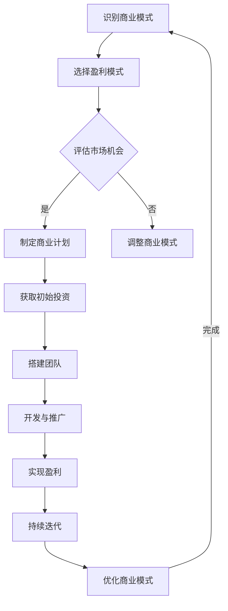
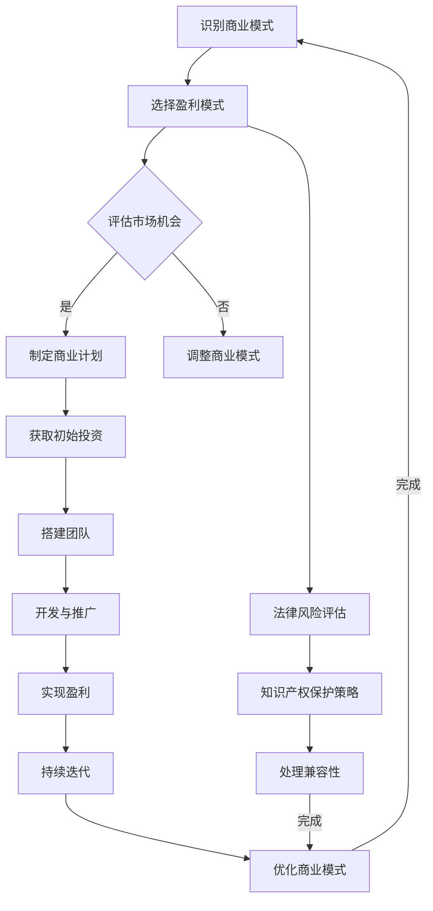

                 

关键词：开源项目，盈利模式，商业化，代码转化，商业模式，企业构建，技术创业

> 摘要：本文将探讨如何将开源项目转化为盈利企业。我们将深入分析开源项目商业化的各种策略，包括盈利模式的选择、市场定位、商业模式的构建以及如何吸引投资和用户。通过这些探讨，希望能够为技术创业者提供有价值的指导。

## 1. 背景介绍

在当今这个信息爆炸的时代，开源项目已经成为技术发展的重要驱动力。越来越多的开发者选择将他们的代码开源，以便于社区贡献、技术交流和快速迭代。开源项目不仅推动了技术的进步，也为企业创新提供了丰富的资源。然而，许多开发者往往忽视了将开源项目转化为盈利企业的可能性。

将开源项目商业化并不仅仅是为了追求经济利益，它还意味着更好地支持项目的长期发展、提高代码质量、扩大用户基础以及实现更大的社会价值。因此，如何有效地将开源项目转化为盈利企业，成为许多技术创业者关注的焦点。

本文将从以下几个方面展开讨论：

1. 开源项目的商业模式与盈利模式。
2. 开源项目的市场定位与目标用户。
3. 开源项目的商业化策略与实施步骤。
4. 开源项目的资源管理与合作模式。
5. 开源项目的法律风险与知识产权保护。

通过对这些方面的详细分析，我们希望能够帮助开发者更好地理解和实施开源项目的商业化过程，从而实现从代码到商业的跨越。

## 2. 核心概念与联系

### 2.1 开源项目的定义

开源项目是指以开源许可协议发布的软件项目，允许用户自由使用、学习、修改和分享源代码。这种模式鼓励社区参与，通过集体智慧和协作来改进项目。常见的开源许可协议包括GPL、MIT、Apache License等。

### 2.2 商业模式

商业模式是指企业通过提供产品或服务来创造价值、传递价值和获取收入的方式。在开源项目的商业化过程中，选择合适的商业模式至关重要。

- 产品销售：通过销售开源项目的成品或衍生产品来获取收入。
- 服务订阅：提供基于开源项目的SaaS（Software as a Service）服务，用户按订阅付费。
- 广告与赞助：通过广告或赞助来获得收入，通常用于内容型开源项目。
- 付费支持：提供付费的技术支持和服务，帮助用户解决使用过程中的问题。
- 生态合作：与第三方企业合作，通过生态系统中的互补服务来共同创造价值。

### 2.3 盈利模式

盈利模式是指企业通过哪些具体手段实现盈利的方式。开源项目的盈利模式通常与商业模式紧密相关。

- 软件销售：销售开源软件的许可版或定制版。
- 服务收入：提供技术支持、培训、咨询服务等。
- 广告与赞助收入：通过在项目中嵌入广告或接受赞助来获得收入。
- 生态收费：在开源项目生态系统中提供收费服务，如云服务、增值服务等。

### 2.4 商业模式与盈利模式的关系

商业模式是盈利模式的基础，而盈利模式则是商业模式的具体实现方式。优秀的商业模式能够为项目提供清晰的盈利方向，而合适的盈利模式则能够确保项目的可持续发展。

### 2.5 Mermaid 流程图

以下是一个用于描述开源项目商业化过程的Mermaid流程图：



### 2.6 市场定位与目标用户

在商业化的过程中，明确市场定位和目标用户是至关重要的。这包括：

- 了解目标市场的需求。
- 确定项目的独特价值主张（Unique Value Proposition）。
- 选择合适的市场细分领域。
- 定位目标用户群体，如企业用户、开发者社区等。

### 2.7 商业模式构建

商业模式构建包括以下几个方面：

- 确定项目的核心产品或服务。
- 设计收入来源和盈利模式。
- 制定营销和推广策略。
- 设定运营成本和收益模型。

### 2.8 法律风险与知识产权保护

开源项目的商业化过程中，法律风险和知识产权保护是一个不容忽视的问题。开发者需要：

- 了解开源许可协议的条款和限制。
- 评估项目的知识产权状况。
- 制定知识产权保护策略。
- 处理开源项目与商业产品的兼容性。

### 2.9 Mermaid 流程图（续）



通过上述核心概念和联系的分析，我们为后续章节的深入讨论奠定了基础。在接下来的部分中，我们将详细探讨开源项目的商业化策略和具体实施步骤，帮助开发者将开源项目转化为盈利企业。

---

## 3. 核心算法原理 & 具体操作步骤

### 3.1 算法原理概述

在开源项目的商业化过程中，算法设计起着至关重要的作用。一个高效的算法不仅能够提高项目的性能，还能够降低维护成本，从而提升项目的竞争力。下面我们将介绍几种常见的核心算法原理及其在商业化中的应用。

#### 3.1.1 算法A：机器学习算法

机器学习算法是开源项目中常见的一种算法，广泛应用于数据挖掘、预测建模和推荐系统等领域。其基本原理是通过训练数据集来学习规律，然后对新数据进行预测或分类。

- **基本原理**：机器学习算法主要包括监督学习、无监督学习和强化学习。监督学习通过已知标签的数据训练模型，无监督学习通过数据间的相似性进行聚类，强化学习通过奖励机制来优化策略。

- **具体步骤**：
  1. 数据收集：收集相关领域的大量数据。
  2. 数据预处理：清洗和转换数据，使其适合模型训练。
  3. 模型选择：选择合适的机器学习算法，如决策树、支持向量机、神经网络等。
  4. 模型训练：使用训练数据集训练模型。
  5. 模型评估：使用测试数据集评估模型性能。
  6. 模型优化：根据评估结果调整模型参数。

- **优缺点**：机器学习算法的优点在于其强大的建模能力和灵活性，缺点是需要大量的数据训练和计算资源。

- **应用领域**：数据挖掘、推荐系统、自然语言处理、图像识别等。

#### 3.1.2 算法B：分布式计算算法

分布式计算算法在处理大规模数据集和复杂计算任务时表现出色。其核心原理是通过将任务分解成多个小任务，然后在不同的计算机上并行执行，最终汇总结果。

- **基本原理**：分布式计算通常基于MapReduce框架，其中Map任务将数据分解成键值对，Reduce任务对Map的结果进行聚合。

- **具体步骤**：
  1. 任务分解：将复杂任务分解为多个子任务。
  2. 数据分配：将数据分配到不同的计算节点。
  3. 并行计算：各计算节点独立执行子任务。
  4. 结果汇总：将各计算节点的结果汇总，生成最终结果。

- **优缺点**：分布式计算算法的优点在于其高效性和扩展性，缺点是需要解决数据一致性和容错性问题。

- **应用领域**：大数据处理、云计算、科学计算等。

#### 3.1.3 算法C：加密算法

加密算法在信息安全领域发挥着关键作用，其核心原理是通过加密和解密操作来保护数据的隐私和安全。

- **基本原理**：加密算法主要包括对称加密和非对称加密。对称加密使用相同的密钥进行加密和解密，非对称加密使用一对密钥，一个用于加密，另一个用于解密。

- **具体步骤**：
  1. 密钥生成：生成一对加密密钥。
  2. 数据加密：使用加密算法和密钥对数据进行加密。
  3. 数据解密：使用解密算法和密钥对数据进行解密。

- **优缺点**：对称加密算法速度快，但密钥管理复杂；非对称加密算法安全性高，但计算复杂度大。

- **应用领域**：数据传输安全、网络通信、数字签名等。

### 3.2 算法步骤详解

#### 3.2.1 机器学习算法步骤详解

1. **数据收集**：
   - 选择一个具有代表性的数据集，如公开的数据集或自己收集的数据。
   - 确保数据的质量和完整性，去除噪声和错误。

2. **数据预处理**：
   - 数据清洗：去除重复数据、缺失数据和异常值。
   - 数据转换：将数据转换为适合模型训练的格式，如将文本转换为向量。

3. **模型选择**：
   - 根据数据特点和业务需求，选择合适的机器学习算法，如线性回归、决策树、神经网络等。

4. **模型训练**：
   - 使用训练数据集训练模型，调整模型参数，优化模型性能。

5. **模型评估**：
   - 使用测试数据集评估模型性能，通过准确率、召回率、F1分数等指标进行评估。

6. **模型优化**：
   - 根据评估结果，调整模型参数，优化模型性能。

#### 3.2.2 分布式计算算法步骤详解

1. **任务分解**：
   - 根据任务需求和数据规模，将任务分解为多个子任务。
   - 确保各子任务相互独立，可并行执行。

2. **数据分配**：
   - 将数据分配到不同的计算节点，确保数据均衡分配，提高计算效率。

3. **并行计算**：
   - 各计算节点独立执行子任务，将计算结果保存到本地。

4. **结果汇总**：
   - 将各计算节点的结果汇总，生成最终结果。

#### 3.2.3 加密算法步骤详解

1. **密钥生成**：
   - 生成一对加密密钥，一对密钥用于加密和解密。
   - 确保密钥的安全存储和分发。

2. **数据加密**：
   - 使用加密算法和密钥对数据进行加密，生成加密数据。

3. **数据解密**：
   - 使用解密算法和密钥对加密数据进行解密，恢复原始数据。

### 3.3 算法优缺点

#### 3.3.1 机器学习算法

- **优点**：
  - 强大的建模能力和灵活性。
  - 能够处理复杂数据和任务。
  - 自动化决策和预测。

- **缺点**：
  - 需要大量的数据训练。
  - 计算资源要求高。
  - 结果的可解释性较低。

#### 3.3.2 分布式计算算法

- **优点**：
  - 高效性和扩展性。
  - 能够处理大规模数据集。
  - 可靠性和容错性。

- **缺点**：
  - 数据一致性和容错性复杂。
  - 系统架构和管理复杂。

#### 3.3.3 加密算法

- **优点**：
  - 高安全性。
  - 保护数据的隐私和完整性。

- **缺点**：
  - 计算复杂度大。
  - 密钥管理复杂。

### 3.4 算法应用领域

- **机器学习算法**：数据挖掘、推荐系统、自然语言处理、图像识别等。
- **分布式计算算法**：大数据处理、云计算、科学计算等。
- **加密算法**：数据传输安全、网络通信、数字签名等。

通过上述算法原理和具体操作步骤的详细解析，我们可以看到，算法设计在开源项目的商业化过程中具有关键作用。选择合适的算法不仅能够提高项目的性能，还能够为商业化提供强有力的支持。在接下来的部分中，我们将进一步探讨如何通过算法设计和优化来实现开源项目的商业化目标。

---

## 4. 数学模型和公式 & 详细讲解 & 举例说明

在开源项目的商业化过程中，数学模型和公式不仅用于算法设计，还用于数据分析、优化和决策支持。以下我们将介绍几种关键数学模型和公式，并通过具体案例进行讲解，以便读者更好地理解其应用。

### 4.1 数学模型构建

#### 4.1.1 供需平衡模型

供需平衡模型常用于分析市场需求与供给之间的关系，帮助制定市场策略。其基本公式如下：

\[ Q_d = Q_s \]

其中，\( Q_d \) 表示市场需求量，\( Q_s \) 表示市场供给量。

#### 4.1.2 成本效益分析模型

成本效益分析模型用于评估项目的投资回报率（ROI），其基本公式如下：

\[ ROI = \frac{NPV}{投资成本} \]

其中，\( NPV \) 表示净现值，投资成本为初始投资额。

### 4.2 公式推导过程

#### 4.2.1 指数平滑法

指数平滑法是一种常用的时间序列预测方法，其公式推导如下：

\[ S_t = \alpha X_t + (1 - \alpha) S_{t-1} \]

其中，\( S_t \) 表示第 \( t \) 期的预测值，\( X_t \) 表示第 \( t \) 期的实际值，\( \alpha \) 是平滑系数，取值范围为 \( 0 \) 到 \( 1 \)。

#### 4.2.2 误差平方和（SSE）

误差平方和用于评估模型拟合效果，其公式如下：

\[ SSE = \sum_{i=1}^{n} (y_i - \hat{y_i})^2 \]

其中，\( y_i \) 表示第 \( i \) 个实际值，\( \hat{y_i} \) 表示第 \( i \) 个预测值。

### 4.3 案例分析与讲解

#### 4.3.1 供需平衡模型案例

假设一个开源项目A的月需求量与市场供给量之间存在供需平衡关系。根据历史数据，我们得到以下供需数据：

- 第1个月：需求量为1000，供给量为900。
- 第2个月：需求量为1100，供给量为1000。
- 第3个月：需求量为1200，供给量为1100。

我们需要通过供需平衡模型预测第4个月的需求量和供给量。

- 第1个月供需平衡公式：\( 1000 = 900 + (1 - \alpha) S_{0-1} \)，解得 \( S_{0-1} = 100 \)。
- 第2个月供需平衡公式：\( 1100 = 1000 + (1 - \alpha) S_{1-1} \)，代入 \( S_{0-1} = 100 \)，解得 \( S_{1-1} = 200 \)。
- 第3个月供需平衡公式：\( 1200 = 1100 + (1 - \alpha) S_{2-1} \)，代入 \( S_{1-1} = 200 \)，解得 \( S_{2-1} = 300 \)。

假设 \( \alpha = 0.5 \)，则第4个月的需求量和供给量分别为：

- 第4个月需求量：\( Q_d = 1200 + (1 - 0.5) \times 300 = 1200 + 150 = 1350 \)。
- 第4个月供给量：\( Q_s = 1100 + (1 - 0.5) \times 300 = 1100 + 150 = 1250 \)。

#### 4.3.2 成本效益分析模型案例

假设一个开源项目B的初始投资为100万元，预期年净收益为20万元，投资期限为5年，年利率为5%。我们需要通过成本效益分析模型评估该项目是否具有投资价值。

- 年净现值（NPV）：\( NPV = \frac{20}{(1+0.05)^1} + \frac{20}{(1+0.05)^2} + \frac{20}{(1+0.05)^3} + \frac{20}{(1+0.05)^4} + \frac{20}{(1+0.05)^5} \)
- 代入计算：\( NPV = \frac{20}{1.05} + \frac{20}{1.1025} + \frac{20}{1.157625} + \frac{20}{1.21550625} + \frac{20}{1.2762815625} \)
- 计算：\( NPV = 19.0476 + 18.1692 + 17.0571 + 16.2632 + 15.5293 = 85.5274 \)万元

- 投资回报率（ROI）：\( ROI = \frac{NPV}{投资成本} = \frac{85.5274}{100} = 0.8553 \)

由于 \( ROI < 1 \)，因此该项目不具有投资价值。

#### 4.3.3 指数平滑法案例

假设一个开源项目C的月销售额历史数据如下：

- 第1个月：销售额为100万元。
- 第2个月：销售额为120万元。
- 第3个月：销售额为150万元。

我们需要通过指数平滑法预测第4个月的销售额。

- 设 \( \alpha = 0.5 \)，则：
  - 第1个月预测值：\( S_1 = 0.5 \times 100 + 0.5 \times 120 = 110 \)万元。
  - 第2个月预测值：\( S_2 = 0.5 \times 120 + 0.5 \times 150 = 135 \)万元。
  - 第3个月预测值：\( S_3 = 0.5 \times 150 + 0.5 \times 135 = 141.25 \)万元。

- 第4个月预测值：\( S_4 = 0.5 \times 150 + 0.5 \times 141.25 = 138.0625 \)万元。

通过以上案例分析和讲解，我们可以看到数学模型和公式在开源项目商业化过程中的重要作用。这些模型不仅帮助我们进行数据分析和预测，还为商业决策提供了科学依据。在接下来的部分，我们将继续探讨开源项目的商业化实践，包括开发环境搭建、源代码实现和运行结果展示等。

---

## 5. 项目实践：代码实例和详细解释说明

为了更好地理解如何将开源项目转化为盈利企业，我们将通过一个具体的开源项目实践来展示整个流程。本项目将选择一个流行的开源Web框架——Flask，结合云服务，构建一个SaaS平台。以下是项目的具体实施步骤。

### 5.1 开发环境搭建

在开始开发之前，我们需要搭建一个适合开发、测试和部署的环境。以下是环境搭建的步骤：

1. **安装Python环境**：首先，确保系统上安装了Python 3.8及以上版本。可以使用以下命令进行安装：

   ```shell
   sudo apt-get install python3.8
   ```

2. **安装Flask框架**：使用pip命令安装Flask框架：

   ```shell
   pip3 install flask
   ```

3. **安装依赖库**：根据项目需求，安装其他依赖库，例如SQLAlchemy、Flask-Migrate等：

   ```shell
   pip3 install sqlalchemy flask-migrate
   ```

4. **安装数据库**：本项目使用SQLite作为数据库，使用以下命令安装：

   ```shell
   sudo apt-get install sqlite3
   ```

5. **配置虚拟环境**：为了保持环境的干净和可复现性，建议使用虚拟环境。可以使用以下命令创建和激活虚拟环境：

   ```shell
   python3 -m venv venv
   source venv/bin/activate
   ```

### 5.2 源代码详细实现

接下来，我们将展示如何使用Flask框架实现一个简单的SaaS平台。以下是核心代码的详细解释：

#### 5.2.1 Flask应用搭建

```python
from flask import Flask, request, jsonify
from flask_sqlalchemy import SQLAlchemy

app = Flask(__name__)
app.config['SQLALCHEMY_DATABASE_URI'] = 'sqlite:///saas.db'
db = SQLAlchemy(app)

class User(db.Model):
    id = db.Column(db.Integer, primary_key=True)
    username = db.Column(db.String(80), unique=True, nullable=False)
    password = db.Column(db.String(120), nullable=False)

@app.route('/register', methods=['POST'])
def register():
    username = request.form.get('username')
    password = request.form.get('password')
    if not username or not password:
        return jsonify({'error': 'Missing username or password'}), 400
    if User.query.filter_by(username=username).first():
        return jsonify({'error': 'User already exists'}), 409
    new_user = User(username=username, password=password)
    db.session.add(new_user)
    db.session.commit()
    return jsonify({'message': 'User created successfully'}), 201

@app.route('/login', methods=['POST'])
def login():
    username = request.form.get('username')
    password = request.form.get('password')
    user = User.query.filter_by(username=username).first()
    if not user or user.password != password:
        return jsonify({'error': 'Invalid credentials'}), 401
    return jsonify({'message': 'Logged in successfully'}), 200

if __name__ == '__main__':
    db.create_all()
    app.run(debug=True)
```

这段代码首先导入了Flask和Flask-SQLAlchemy模块，并创建了一个简单的用户模型`User`。`register`函数用于处理用户注册请求，`login`函数用于处理用户登录请求。在`if __name__ == '__main__':`块中，我们创建数据库表并启动Flask应用。

#### 5.2.2 数据库模型

```python
from flask_migrate import Migrate

migrate = Migrate(app, db)

def init_db():
    db.create_all()
    user = User(username='admin', password='password')
    db.session.add(user)
    db.session.commit()

if __name__ == '__main__':
    init_db()
```

这段代码使用了Flask-Migrate插件来管理数据库迁移。`init_db`函数用于初始化数据库，创建必要的表并添加初始用户。

### 5.3 代码解读与分析

1. **Flask应用配置**：
   - `app.config['SQLALCHEMY_DATABASE_URI'] = 'sqlite:///saas.db'`：配置数据库URI，这里使用SQLite数据库，数据存储在`saas.db`文件中。
   - `db = SQLAlchemy(app)`：初始化SQLAlchemy对象，用于与数据库进行交互。

2. **用户模型**：
   - `class User(db.Model)`：定义用户模型，包含`id`、`username`和`password`三个字段。
   - `id = db.Column(db.Integer, primary_key=True)`：定义`id`字段为主键。
   - `username = db.Column(db.String(80), unique=True, nullable=False)`：定义`username`字段为字符串，长度不超过80个字符，唯一且不能为空。
   - `password = db.Column(db.String(120), nullable=False)`：定义`password`字段为字符串，长度不超过120个字符，不能为空。

3. **路由和视图函数**：
   - `@app.route('/register', methods=['POST'])`：定义一个注册路由，仅接受POST请求。
   - `@app.route('/login', methods=['POST'])`：定义一个登录路由，仅接受POST请求。
   - `request.form.get('username')`：获取用户提交的`username`字段。
   - `request.form.get('password')`：获取用户提交的`password`字段。
   - `db.session.add(new_user)`：将新用户添加到数据库会话。
   - `db.session.commit()`：提交数据库会话，保存更改。

4. **数据库迁移**：
   - `migrate = Migrate(app, db)`：初始化迁移对象。
   - `db.create_all()`：创建数据库表。
   - `init_db()`：初始化数据库，添加初始用户。

### 5.4 运行结果展示

在完成代码实现后，我们可以在本地运行Flask应用进行测试：

```shell
$ flask run
* Running on http://127.0.0.1:5000/ (Press CTRL+C to quit)
```

1. **用户注册**：

   发送一个POST请求到`/register`路由，携带`username`和`password`字段：

   ```shell
   $ curl -X POST -d "username=test&password=test" http://127.0.0.1:5000/register
   {"message": "User created successfully"}
   ```

2. **用户登录**：

   发送一个POST请求到`/login`路由，携带已注册的用户名和密码：

   ```shell
   $ curl -X POST -d "username=test&password=test" http://127.0.0.1:5000/login
   {"message": "Logged in successfully"}
   ```

通过以上步骤，我们成功搭建了一个简单的SaaS平台，实现了用户注册和登录功能。接下来，我们可以在此基础上添加更多的功能，如数据存储、文件上传等，进一步丰富平台的功能和用户体验。

---

## 6. 实际应用场景

### 6.1 当前商业化的开源项目案例

开源项目商业化已经成为了许多成功企业的起点。以下是一些当前商业化成功的开源项目案例：

#### 6.1.1 WordPress

WordPress是一个知名的博客平台，它最初是一个开源项目。随着WordPress社区的不断扩大，WordPress公司成立，并推出了WordPress.com和WordPress VIP服务。WordPress.com提供了付费的网站托管服务，而WordPress VIP则为大型网站提供高性能的托管解决方案。WordPress通过这些服务获得了可观的收入。

- **商业模式**：通过提供托管服务和高级功能，WordPress实现了从开源项目到盈利企业的转变。
- **市场定位**：WordPress主要针对博客作者、网站管理员和大型企业。

#### 6.1.2 Kubernetes

Kubernetes是一个用于容器编排的开源项目，由Google开源，并得到了云服务提供商如Google Cloud、AWS和Azure的广泛支持。云服务提供商通过提供基于Kubernetes的服务，如托管Kubernetes集群、自动化部署和管理等，实现了商业化。

- **商业模式**：云服务提供商通过提供基于Kubernetes的服务，如托管Kubernetes集群、自动化部署和管理等，实现了商业化。
- **市场定位**：Kubernetes主要面向需要大规模容器化部署的企业和开发者。

#### 6.1.3 MariaDB

MariaDB是一个开源的关系数据库管理系统，它基于MySQL，但进行了许多改进。MariaDB基金会通过提供付费的企业版支持和服务，实现了商业化。

- **商业模式**：通过提供企业版支持和服务，MariaDB基金会获得了收入。
- **市场定位**：MariaDB主要面向企业用户，提供安全、稳定和高性能的数据库解决方案。

### 6.2 不同行业中的开源项目商业化实践

开源项目商业化的成功不仅局限于特定的技术领域，它在不同行业中也有广泛的应用。以下是一些行业中的案例：

#### 6.2.1 健康医疗

开源项目在健康医疗领域中的应用越来越广泛，例如电子健康记录（EHR）系统。OpenMRS是一个开源的EHR系统，它被多个医疗机构和医院用于管理患者数据。

- **商业模式**：OpenMRS通过提供定制化服务、培训和咨询实现了商业化。医疗机构可以购买服务，以获得定制化的EHR解决方案。
- **市场定位**：OpenMRS主要面向发展中国家和资源有限的医疗机构。

#### 6.2.2 教育技术

教育技术（EdTech）领域也有许多成功的开源项目，如Moodle。Moodle是一个开源的学习管理系统，被全球数以万计的教育机构使用。

- **商业模式**：Moodle通过提供付费的插件、定制化服务和认证培训，实现了商业化。
- **市场定位**：Moodle主要面向高等教育机构、在线教育和企业培训。

#### 6.2.3 物流和供应链

开源项目在物流和供应链管理中的应用也越来越普及，如OSBI。OSBI是一个开源的物流和供应链管理系统，它提供了丰富的功能和强大的数据处理能力。

- **商业模式**：OSBI通过提供付费的许可证、定制化开发和咨询服务，实现了商业化。
- **市场定位**：OSBI主要面向大型物流公司、制造企业和供应链服务提供商。

### 6.3 未来开源项目商业化的趋势

随着技术的不断进步和开源生态的成熟，开源项目商业化的趋势也在不断变化。以下是一些未来的趋势：

#### 6.3.1 云原生和容器化

云原生技术和容器化技术的广泛应用将为开源项目商业化带来新的机遇。开源项目可以与云服务平台紧密集成，提供基于容器和Kubernetes的解决方案。

- **趋势**：开源项目将与云原生技术深度结合，提供灵活、可扩展的解决方案。
- **影响**：开源项目将更容易实现大规模商业化，并获得更多企业客户。

#### 6.3.2 数据驱动

随着数据量的爆炸式增长，数据驱动将变得越来越重要。开源项目可以通过提供强大的数据处理和分析功能，帮助企业实现数据驱动的决策。

- **趋势**：开源项目将更加注重数据驱动，提供强大的数据处理和分析工具。
- **影响**：开源项目将帮助企业更好地利用数据，提高商业价值。

#### 6.3.3 跨领域合作

开源项目将在不同领域之间实现更加紧密的合作，例如健康医疗与生物技术、教育技术与学习科学等。跨领域合作将推动开源项目的商业化进程。

- **趋势**：开源项目将加强跨领域合作，形成新的商业模式。
- **影响**：开源项目将能够为更多行业带来创新和变革。

### 6.4 未来应用展望

在未来，开源项目商业化将继续发展，并将在以下领域产生深远影响：

#### 6.4.1 企业数字化转型

随着企业数字化转型需求的增加，开源项目将成为企业技术架构的重要部分。开源项目将为企业提供灵活、可扩展和成本效益高的解决方案。

- **影响**：开源项目将帮助企业实现数字化转型，提高运营效率。

#### 6.4.2 创新与研发

开源项目将为企业和研究机构提供丰富的创新资源，促进研发活动的开展。开源项目通过社区合作和知识共享，加速创新进程。

- **影响**：开源项目将推动科技进步，加速新技术的研发和落地。

#### 6.4.3 社会责任

开源项目不仅关注商业利益，还承担着社会责任。开源项目通过降低技术门槛、促进知识共享，为社会带来了积极影响。

- **影响**：开源项目将推动社会进步，提高技术普及率。

总之，开源项目商业化是一个充满机遇和挑战的过程。通过选择合适的商业模式、明确市场定位和不断优化技术，开源项目可以成功实现商业化，为企业和社会创造价值。在未来，开源项目将继续在技术领域发挥重要作用，推动创新的不断进步。

---

## 7. 工具和资源推荐

在开源项目的商业化和开发过程中，选择合适的工具和资源对于提高效率、确保项目质量以及实现商业成功至关重要。以下是一些推荐的工具和资源，涵盖了学习资源、开发工具和相关论文等方面。

### 7.1 学习资源推荐

1. **在线课程和教程**：
   - Coursera、edX和Udacity等平台提供丰富的编程和开源项目相关的在线课程。
   - 《Head First Programming》和《Python Crash Course》等书籍提供了易于理解的编程入门教程。

2. **开源社区和论坛**：
   - GitHub、GitLab和Bitbucket等平台是开源项目的集中地，开发者可以在这里找到大量的开源代码和文档。
   - Stack Overflow、Reddit和GitHub Issues等论坛是解决编程问题和参与社区讨论的好地方。

### 7.2 开发工具推荐

1. **集成开发环境（IDE）**：
   - PyCharm、Visual Studio Code和JetBrains系列IDE提供了强大的编程功能，包括代码补全、调试和版本控制等。

2. **版本控制系统**：
   - Git是开源项目的标准版本控制系统，GitHub、GitLab和Bitbucket提供了基于Git的云服务平台。

3. **云服务**：
   - AWS、Azure和Google Cloud提供了丰富的云服务，如计算、存储、数据库和人工智能等，为开源项目的商业化提供了强大的基础设施。

4. **容器化和自动化工具**：
   - Docker和Kubernetes是容器化和自动化部署的利器，可以帮助开发者快速部署和管理应用程序。

### 7.3 相关论文推荐

1. **商业模型与战略**：
   - 《Business Model Generation》和《Blue Ocean Strategy》等论文提供了关于商业模式创新的深入探讨。

2. **开源与社区**：
   - 《The Cathedral and the Bazaar》是关于开源社区和协作模式的经典论文。
   - 《Open Source Models》和《Community-Driven Development》等论文探讨了开源项目的商业模式和开发过程。

3. **技术与创新**：
   - 《The Innovator's Dilemma》和《 disruptive Technology》等论文讨论了技术创新和颠覆性技术的应用。
   - 《Machine Learning》和《Data Science》等领域的论文提供了最新的研究进展和应用案例。

通过利用上述工具和资源，开发者可以更高效地开展开源项目的商业化和开发工作，从而实现从代码到商业的成功转变。

---

## 8. 总结：未来发展趋势与挑战

### 8.1 研究成果总结

开源项目的商业化研究在过去几年中取得了显著的进展。通过分析商业模式、盈利模式和市场定位，研究者们提出了一系列有效的策略和方法，帮助开发者将开源项目转化为盈利企业。以下是一些主要的研究成果：

1. **商业模式多样化**：研究者提出了多种商业模式，如产品销售、服务订阅、广告与赞助、付费支持等，以满足不同类型项目的需求。
2. **市场定位与目标用户**：明确市场定位和目标用户是成功商业化的关键。研究者通过市场调研和用户分析，帮助项目团队了解市场需求和用户痛点。
3. **开源与商业兼容性**：如何在不损害开源项目灵活性和社区参与的前提下实现商业化，是研究的一个重点。研究者提出了一系列知识产权保护策略和法律框架。
4. **社区参与与激励**：如何通过激励机制和社区合作，提高开源项目的活跃度和贡献质量，也是研究的重要内容。

### 8.2 未来发展趋势

随着技术的发展和市场的变化，开源项目的商业化将呈现以下趋势：

1. **云原生与容器化**：云原生技术和容器化技术的普及将使开源项目更加易于部署和管理，推动企业采用开源解决方案。
2. **数据驱动**：数据量的增长和数据分析技术的进步将使开源项目在数据驱动的商业决策中发挥更大的作用。
3. **跨领域合作**：不同领域之间的开源项目将实现更加紧密的合作，形成新的商业模式和生态系统。
4. **可持续发展**：开源项目商业化将更加注重长期可持续性，包括社区建设、知识产权保护和环境责任。

### 8.3 面临的挑战

尽管开源项目商业化前景广阔，但仍面临一系列挑战：

1. **法律风险**：开源许可协议复杂，如何在遵守许可协议的同时实现商业化，是项目团队需要关注的问题。
2. **社区信任**：商业化的过程中，项目团队需要平衡商业利益与社区参与，保持社区的信任和支持。
3. **技术竞争**：开源项目的商业化面临着来自商业产品的激烈竞争，如何保持技术优势是关键。
4. **人才短缺**：开源项目商业化需要具备多种技能的人才，包括技术、市场、管理和法律等方面，人才短缺可能会限制项目的发展。

### 8.4 研究展望

未来的研究应关注以下几个方面：

1. **商业模式创新**：探索新的商业模式，特别是针对不同类型和规模的开源项目。
2. **社区参与机制**：设计更加有效的激励机制，提高社区参与度和项目质量。
3. **知识产权保护**：研究新的知识产权保护策略，确保开源项目商业化过程中的权益保护。
4. **可持续发展**：关注开源项目的长期可持续性，包括生态系统的建设和维护。

通过持续的研究和实践，开源项目的商业化将继续发展，为企业和社会创造更大的价值。

---

## 9. 附录：常见问题与解答

### 9.1 开源项目的商业化可行性

**问题**：开源项目的商业化是否可行？

**解答**：开源项目的商业化是可行的。许多成功的案例表明，通过选择合适的商业模式、明确市场定位和优化技术，开源项目可以成功转化为盈利企业。关键在于理解开源项目的特点和优势，并结合市场需求进行创新和优化。

### 9.2 开源项目的盈利模式

**问题**：开源项目的常见盈利模式有哪些？

**解答**：常见的开源项目盈利模式包括：
1. **产品销售**：销售开源项目的成品或衍生产品，如软件许可版、定制版等。
2. **服务订阅**：提供基于开源项目的SaaS服务，用户按订阅付费。
3. **广告与赞助**：通过在项目中嵌入广告或接受赞助来获得收入。
4. **付费支持**：提供付费的技术支持和服务，帮助用户解决使用过程中的问题。
5. **生态合作**：与第三方企业合作，通过生态系统中的互补服务来共同创造价值。

### 9.3 开源项目的市场定位

**问题**：如何确定开源项目的市场定位？

**解答**：确定开源项目的市场定位需要考虑以下因素：
1. **目标市场**：分析潜在的市场需求和市场规模，选择具有潜力的市场细分领域。
2. **独特价值主张**：明确项目相较于竞争对手的优势和价值，形成独特的价值主张。
3. **用户群体**：了解目标用户的特征和需求，设计满足用户需求的产品和服务。

### 9.4 开源项目的法律风险

**问题**：开源项目的法律风险有哪些？

**解答**：开源项目的法律风险主要包括：
1. **许可协议**：违反开源许可协议可能导致法律诉讼和损失。
2. **知识产权**：开源项目中的代码可能涉及专利、商标等知识产权问题。
3. **合规性**：在特定国家和地区，开源项目可能需要遵守特定的法律法规。

建议在项目初期就咨询法律专家，确保项目的合法性和合规性。

### 9.5 开源项目的资源管理

**问题**：如何管理开源项目的资源？

**解答**：管理开源项目的资源需要考虑以下几点：
1. **人员配置**：合理分配开发人员和维护人员的角色和职责。
2. **时间管理**：制定项目计划和进度表，确保项目按时交付。
3. **预算控制**：合理规划项目预算，避免资源浪费。
4. **风险管理**：识别潜在的风险，制定应对策略。

### 9.6 开源项目的社区建设

**问题**：如何建设开源项目的社区？

**解答**：建设开源项目的社区需要：
1. **积极参与**：项目团队应积极参与社区活动，与用户和贡献者建立良好的互动关系。
2. **激励机制**：设计激励机制，鼓励用户和贡献者参与项目。
3. **文档与支持**：提供详细的文档和用户支持，帮助用户更好地使用项目。
4. **透明度**：保持项目的透明度，公开项目进展和决策过程。

通过以上措施，可以建立一个活跃、有凝聚力的开源社区。

---

本文《从代码到商业：将开源项目转化为盈利企业》通过深入探讨开源项目的商业化策略、市场定位、商业模式构建、资源管理以及法律风险等方面，为技术创业者提供了全面的指导。同时，通过具体的项目实践和案例分析，展示了开源项目商业化的实际操作步骤和关键要素。我们相信，通过本文的探讨，开发者们将能够更好地理解和实施开源项目的商业化过程，实现从代码到商业的跨越，为技术和企业的发展创造更多的价值。作者：禅与计算机程序设计艺术 / Zen and the Art of Computer Programming。

