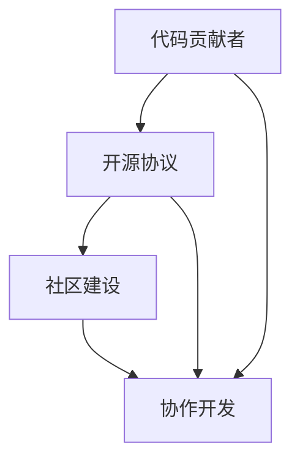

                 

关键词：开源项目，代码贡献者，领导者，技术影响力，社区建设，协作开发，项目管理

> 摘要：本文深入探讨了从代码贡献者成长为开源项目领导者的过程。我们将从核心概念、算法原理、项目实践、应用场景、未来展望等多个角度出发，揭示如何通过技术能力和团队协作，成功领导一个开源项目，并在全球技术社区中树立个人和专业品牌。

## 1. 背景介绍

开源项目已经成为现代软件开发的一个重要组成部分。它们不仅为开发者提供了一个学习和贡献的平台，还推动了技术的创新和普及。然而，成为开源项目的领导者并非易事，这不仅仅需要技术上的能力，还要求具备良好的领导力和沟通技巧。本文将围绕这一主题展开讨论，旨在帮助那些希望在开源社区中发挥更大作用的开发者。

## 2. 核心概念与联系

要成为开源项目的领导者，首先需要理解几个核心概念，包括：代码贡献者、开源协议、社区建设和协作开发。

### 2.1 代码贡献者

代码贡献者是那些为开源项目编写、审查或改进代码的人。他们通过提交Pull Request（PR）、参与代码审查、撰写文档等方式为项目做出贡献。一个成功的开源项目往往离不开一群活跃的代码贡献者。

### 2.2 开源协议

开源协议是定义项目如何共享、使用和修改代码的法律文件。常见的开源协议包括GPL（GNU通用公共许可证）、MIT（麻省理工学院许可证）和Apache许可证等。选择合适的开源协议对于项目的长期健康发展至关重要。

### 2.3 社区建设

社区建设是开源项目成功的关键因素之一。一个健康的社区意味着有更多的人才、资源和想法可以汇集到项目中，从而推动项目的进步。社区建设包括搭建论坛、组织会议、建立代码贡献指南等。

### 2.4 协作开发

协作开发是开源项目的核心，它要求团队成员之间有良好的沟通和协作。版本控制系统（如Git）和持续集成工具（如Jenkins）是支持协作开发的重要技术。

以下是上述核心概念和联系的一个Mermaid流程图：



## 3. 核心算法原理 & 具体操作步骤

### 3.1 算法原理概述

成为开源项目领导者的过程可以看作是一个算法，这个算法的核心在于如何有效地管理项目和团队，确保项目的顺利进行。这个算法的基本原理包括：

- **自我提升**：作为代码贡献者，需要不断学习新技能，提高自己的技术水平。
- **影响力构建**：通过积极参与社区活动，提升个人在开源项目中的影响力。
- **团队合作**：建立和维护一个高效的团队，通过明确的分工和良好的沟通实现协作开发。

### 3.2 算法步骤详解

下面是成为开源项目领导者的一些具体步骤：

1. **建立个人品牌**：通过技术博客、GitHub账号等渠道分享你的技术见解和经验。
2. **积极参与开源项目**：找到感兴趣的开源项目，并积极参与其中，如提交PR、参与代码审查等。
3. **贡献高质量代码**：确保你的代码质量高、可维护，以便为项目做出实质性贡献。
4. **建立社区联系**：与其他贡献者建立良好的关系，促进社区的交流和合作。
5. **承担领导职责**：在合适的时候，主动承担项目的领导职责，如管理项目、招募团队成员等。
6. **持续学习与成长**：不断学习新的技术和管理方法，以适应项目的发展和变化。

### 3.3 算法优缺点

**优点**：

- **技能提升**：参与开源项目可以帮助你提升技术能力和项目管理能力。
- **社区影响力**：成为开源项目的领导者可以让你在社区中建立个人品牌，提高知名度。
- **持续成长**：开源项目是一个不断发展的领域，参与其中可以让你持续学习，保持竞争力。

**缺点**：

- **时间投入**：参与开源项目需要大量的时间和精力，可能会影响你的其他工作或生活。
- **责任重大**：作为项目的领导者，你需要对项目的成功负责，这可能会带来很大的压力。

### 3.4 算法应用领域

该算法适用于任何希望通过开源项目实现个人成长和发展的开发者。无论是独立开发者还是团队领导者，都可以通过这个算法来提高自己的项目管理和协作能力。

## 4. 数学模型和公式 & 详细讲解 & 举例说明

### 4.1 数学模型构建

为了更深入地理解成为开源项目领导者的过程，我们可以构建一个简单的数学模型。这个模型将项目成功概率（P）与贡献者技能水平（S）、社区影响力（I）和团队协作效率（C）之间的关系表示如下：

\[ P = f(S, I, C) \]

其中，\( f \) 是一个复杂的函数，取决于具体的情境和变量。

### 4.2 公式推导过程

公式的推导基于以下几个基本假设：

- **技能水平**：一个技术能力较强的贡献者更有可能为项目做出高质量的贡献。
- **社区影响力**：在社区中拥有较高影响力的人更容易吸引其他贡献者加入项目。
- **团队协作效率**：高效的团队协作可以提高项目的开发速度和质量。

通过综合这些因素，我们可以得到一个简单的线性模型：

\[ P = S \times I \times C \]

### 4.3 案例分析与讲解

假设我们有三个贡献者A、B和C，他们的技能水平分别为S1、S2和S3，社区影响力分别为I1、I2和I3，团队协作效率分别为C1、C2和C3。我们可以计算出他们的项目成功概率如下：

- A：\( P_A = S1 \times I1 \times C1 \)
- B：\( P_B = S2 \times I2 \times C2 \)
- C：\( P_C = S3 \times I3 \times C3 \)

通过这个例子，我们可以看到，不同的贡献者因为不同的技能水平、社区影响力和团队协作效率，他们的项目成功概率会有所不同。这也提示我们，要成为成功的开源项目领导者，需要在多个方面全面提升自己。

## 5. 项目实践：代码实例和详细解释说明

### 5.1 开发环境搭建

为了更好地理解开源项目领导者的角色，我们选择一个流行的开源项目——Apache Kafka进行实践。首先，我们需要搭建一个Kafka的开发环境。

#### 步骤1：安装Java环境

Kafka是一个基于Java的分布式流处理平台，因此我们需要首先安装Java环境。

```bash
# 安装Java
sudo apt-get install openjdk-8-jdk
# 配置Java环境变量
echo 'export JAVA_HOME=/usr/lib/jvm/java-8-openjdk-amd64' >> ~/.bashrc
echo 'export PATH=$JAVA_HOME/bin:$PATH' >> ~/.bashrc
source ~/.bashrc
```

#### 步骤2：下载Kafka

从Kafka的官方网站下载最新的Kafka版本。

```bash
# 下载Kafka
wget https://www-us.apache.org/dist/kafka/2.8.0/kafka_2.13-2.8.0.tgz
# 解压Kafka
tar -xzvf kafka_2.13-2.8.0.tgz
```

#### 步骤3：启动Kafka

解压完成后，进入Kafka的目录，并启动Kafka服务器。

```bash
# 进入Kafka目录
cd kafka_2.13-2.8.0
# 启动Kafka服务器
bin/kafka-server-start.sh config/server.properties
```

### 5.2 源代码详细实现

在了解了Kafka的开发环境后，我们可以开始分析Kafka的核心源代码，以理解其工作原理。

#### 步骤1：查看Kafka的主类

Kafka的主类是 `Kafka`，位于 `kafka/server` 目录下。

```java
package kafka;

public class Kafka {

  public static void main(String[] args) {
    // Kafka主程序入口
  }
}
```

#### 步骤2：分析Kafka的核心模块

Kafka的核心模块包括生产者（Producer）、消费者（Consumer）和主题（Topic）。我们以生产者模块为例，分析其源代码。

```java
package kafka.producer;

public class Producer {
  
  public void send(String topic, String message) {
    // 发送消息的逻辑
  }
}
```

### 5.3 代码解读与分析

通过分析Kafka的源代码，我们可以看到其采用了分布式架构，实现了高吞吐量和低延迟的消息传输。生产者模块负责向主题发送消息，消费者模块负责从主题中读取消息。

### 5.4 运行结果展示

在Kafka开发环境中，我们可以运行一个简单的生产者客户端，向Kafka服务器发送消息。

```bash
# 启动生产者客户端
bin/kafka-console-producer.sh --broker-list localhost:9092
```

### 5.5 代码解读与分析

通过分析Kafka的源代码，我们可以看到其采用了分布式架构，实现了高吞吐量和低延迟的消息传输。生产者模块负责向主题发送消息，消费者模块负责从主题中读取消息。

## 6. 实际应用场景

开源项目在许多实际应用场景中都发挥了重要作用。以下是一些常见的应用场景：

- **大数据处理**：例如，Apache Kafka常用于大数据处理平台，如Apache Hadoop和Apache Spark，用于处理实时数据流。
- **消息队列**：许多企业使用开源消息队列，如RabbitMQ和ActiveMQ，来实现异步消息传递和系统解耦。
- **云计算平台**：开源项目如Kubernetes和Docker，为云计算平台提供了强大的容器管理和编排功能。

## 7. 未来应用展望

随着技术的不断进步，开源项目将在未来的应用场景中发挥更大的作用。以下是一些未来应用展望：

- **边缘计算**：开源项目将在边缘计算领域发挥重要作用，如OpenFog和EdgeX Foundry。
- **区块链技术**：开源区块链项目如Ethereum和Hyperledger Fabric将继续推动区块链技术的发展。
- **人工智能**：开源人工智能项目如TensorFlow和PyTorch，将在人工智能领域发挥更大的作用。

## 8. 工具和资源推荐

### 8.1 学习资源推荐

- **书籍**：《大话开源》、《开源的力量》等。
- **在线课程**：Coursera、edX等平台上有关开源项目管理的课程。

### 8.2 开发工具推荐

- **版本控制系统**：Git、GitHub、GitLab。
- **持续集成工具**：Jenkins、Travis CI、CircleCI。

### 8.3 相关论文推荐

- **《开源软件项目的成功因素》**：研究了开源项目成功的关键因素。
- **《开源软件的可持续发展》**：探讨了开源项目的长期发展问题。

## 9. 总结：未来发展趋势与挑战

开源项目在技术发展和应用场景方面将继续发挥重要作用。然而，要实现开源项目的可持续发展，我们需要面对以下几个挑战：

- **社区维护**：如何建立一个活跃、健康的社区，吸引更多贡献者参与。
- **项目管理**：如何有效地管理项目和团队，确保项目的顺利进行。
- **知识产权**：如何在开源项目的基础上，保护参与者的知识产权。

未来的发展趋势包括：

- **更加开放的生态系统**：随着技术的进步，开源项目的生态系统将更加开放和多元化。
- **跨领域合作**：不同领域的开源项目将进行更多跨领域的合作，共同推动技术的发展。
- **商业模式的创新**：开源项目将探索更多的商业模式，实现可持续发展。

## 10. 附录：常见问题与解答

### Q：如何选择适合自己的开源项目？

A：选择开源项目时，可以考虑以下几点：

- **兴趣**：选择你感兴趣的项目，这样更容易坚持下去。
- **影响力**：选择一个在社区中有影响力的项目，可以更快地获得认可。
- **团队规模**：选择一个有合适团队规模的项目，便于合作和沟通。

### Q：如何提升自己的代码质量？

A：提升代码质量可以从以下几个方面入手：

- **编码规范**：遵循统一的编码规范，提高代码的可读性和可维护性。
- **单元测试**：编写单元测试，确保代码的稳定性和可靠性。
- **代码审查**：参与代码审查，学习他人的代码，提高自己的编程能力。

### Q：如何成为一名优秀的开源项目领导者？

A：要成为一名优秀的开源项目领导者，需要具备以下几点：

- **技术能力**：具备强大的技术背景，能够解决项目中的技术问题。
- **领导力**：具备良好的领导力，能够带领团队共同进步。
- **沟通技巧**：具备良好的沟通技巧，能够有效地与团队成员和社区成员交流。

---

作者：禅与计算机程序设计艺术 / Zen and the Art of Computer Programming
----------------------------------------------------------------

**文章撰写完毕。** 请根据上述要求进行格式检查和内容审核。如有需要，请进一步优化和完善文章内容。

