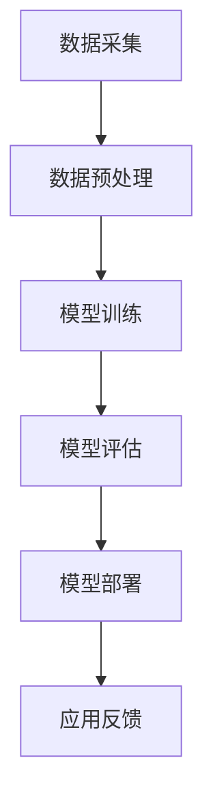

                 

关键词：人工智能，大模型，创业，未来展望，技术变革，产业应用

> 摘要：本文旨在探讨人工智能领域的大模型技术在创业实践中的运用，以及其对未来技术发展和社会变革的影响。通过对大模型的核心概念、算法原理、数学模型以及实际应用场景的深入分析，本文将揭示大模型在推动AI产业发展中的重要地位，并对未来的发展趋势和挑战进行展望。

## 1. 背景介绍

人工智能作为当代最具革命性的技术之一，已经深刻地改变了我们的生活方式。从早期的规则基系统到近年来的深度学习和大数据分析，人工智能的发展历程充满了创新和突破。尤其是大模型（Large Models）的出现，更是将人工智能技术推向了新的高峰。

大模型是指拥有数百万甚至数十亿参数的深度学习模型。这些模型通过学习海量数据，能够自动提取复杂的数据特征，进行高精度的预测和决策。大模型的兴起，得益于计算能力的提升、数据量的爆炸性增长以及深度学习算法的优化。

在创业领域，大模型技术的应用为创业者提供了前所未有的机遇。通过大模型，创业者可以在医疗、金融、教育等多个领域实现前所未有的创新，打破传统产业的边界，创造出全新的商业模式。

## 2. 核心概念与联系

大模型的核心概念包括深度学习、神经网络和大数据处理。深度学习是一种通过多层神经网络进行数据学习和特征提取的技术。神经网络则是由大量简单的处理单元（神经元）组成的复杂网络，能够通过学习数据实现从简单到复杂的任务。大数据处理则是指对海量数据进行存储、处理和分析的技术。

以下是大模型的架构流程图：



### 3. 核心算法原理 & 具体操作步骤

### 3.1 算法原理概述

大模型的算法原理基于深度学习，主要通过以下步骤实现：

1. **数据预处理**：对原始数据进行清洗、归一化等处理，使其适合模型的训练。
2. **模型训练**：通过反向传播算法，让模型在训练数据集上自动调整参数，以最小化预测误差。
3. **模型评估**：使用验证集或测试集对模型进行评估，以判断其性能。
4. **模型部署**：将训练好的模型部署到生产环境中，进行实际应用。

### 3.2 算法步骤详解

#### 3.2.1 数据预处理

数据预处理是深度学习模型训练的重要环节。具体步骤如下：

1. **数据清洗**：去除数据中的噪声和异常值。
2. **数据归一化**：将数据缩放到一个统一的范围内，以便于模型学习。
3. **数据分集**：将数据集划分为训练集、验证集和测试集。

#### 3.2.2 模型训练

模型训练是深度学习中的核心步骤。具体步骤如下：

1. **初始化参数**：随机初始化模型的参数。
2. **前向传播**：将输入数据传递到神经网络的前向层，得到输出结果。
3. **计算损失**：计算预测结果与实际结果之间的差距，得到损失函数值。
4. **反向传播**：根据损失函数值，反向传播误差，更新模型的参数。

#### 3.2.3 模型评估

模型评估用于判断模型在未知数据上的表现。具体步骤如下：

1. **验证集评估**：使用验证集对模型进行评估，以调整模型参数。
2. **测试集评估**：在测试集上对模型进行最终评估，以判断模型性能。

#### 3.2.4 模型部署

模型部署是将训练好的模型应用到实际业务场景中。具体步骤如下：

1. **模型封装**：将模型封装成可执行的代码或库。
2. **模型部署**：将模型部署到服务器或云端。
3. **模型监控**：对模型进行实时监控，确保其正常运行。

### 3.3 算法优缺点

#### 优点：

1. **高精度**：大模型通过学习海量数据，能够实现高精度的预测和决策。
2. **自适应**：大模型能够自适应地调整参数，以适应不同的数据分布和任务需求。
3. **广泛适用**：大模型在多个领域都有广泛的应用，如语音识别、图像处理、自然语言处理等。

#### 缺点：

1. **计算资源需求大**：大模型训练需要大量的计算资源和存储资源。
2. **数据依赖性强**：大模型的效果高度依赖于训练数据的质量和数量。
3. **模型解释性差**：深度学习模型通常缺乏可解释性，难以理解其决策过程。

### 3.4 算法应用领域

大模型在人工智能领域有广泛的应用，以下是几个主要领域：

1. **语音识别**：大模型能够通过学习语音数据，实现高精度的语音识别。
2. **图像处理**：大模型能够通过学习图像数据，实现图像分类、目标检测等任务。
3. **自然语言处理**：大模型能够通过学习文本数据，实现语义理解、机器翻译等任务。
4. **金融风控**：大模型能够通过学习金融数据，实现风险识别、投资决策等任务。
5. **医疗诊断**：大模型能够通过学习医疗数据，实现疾病诊断、药物研发等任务。

## 4. 数学模型和公式 & 详细讲解 & 举例说明

### 4.1 数学模型构建

大模型的数学模型主要基于深度学习和概率图模型。以下是深度学习和概率图模型的基本概念和公式：

#### 深度学习：

- **神经网络**：

  $$ f(x) = \sigma(\sum_{i=1}^{n} w_i \cdot x_i + b) $$

  其中，\( \sigma \) 是激活函数，\( w_i \) 和 \( b \) 是权重和偏置。

- **反向传播**：

  $$ \frac{\partial L}{\partial w_i} = \frac{\partial L}{\partial z} \cdot \frac{\partial z}{\partial w_i} $$

  其中，\( L \) 是损失函数，\( z \) 是输出值。

#### 概率图模型：

- **贝叶斯网络**：

  $$ P(X_1, X_2, ..., X_n) = \prod_{i=1}^{n} P(X_i | X_{parent_i}) $$

  其中，\( X_i \) 是节点，\( X_{parent_i} \) 是 \( X_i \) 的父节点。

### 4.2 公式推导过程

以下是一个简单的线性回归模型的推导过程：

#### 目标函数：

$$ J = \frac{1}{2} \sum_{i=1}^{m} (h(x^{(i)}) - y^{(i)})^2 $$

#### 前向传播：

$$ h(x) = \sum_{j=1}^{n} w_j \cdot x_j + b $$

#### 反向传播：

$$ \frac{\partial J}{\partial w_j} = \frac{\partial J}{\partial h} \cdot \frac{\partial h}{\partial w_j} = (h(x) - y) \cdot x_j $$

$$ \frac{\partial J}{\partial b} = \frac{\partial J}{\partial h} \cdot \frac{\partial h}{\partial b} = (h(x) - y) $$

#### 梯度下降：

$$ w_j := w_j - \alpha \cdot \frac{\partial J}{\partial w_j} $$

$$ b := b - \alpha \cdot \frac{\partial J}{\partial b} $$

### 4.3 案例分析与讲解

以下是一个关于图像分类任务的案例：

#### 数据集：

我们使用MNIST数据集，该数据集包含10万张28x28的手写数字图像。

#### 模型：

我们使用一个简单的卷积神经网络（CNN）进行图像分类。

#### 实现步骤：

1. **数据预处理**：对图像进行归一化处理，将像素值缩放到[0, 1]范围内。

2. **构建模型**：使用TensorFlow搭建CNN模型，包括卷积层、池化层和全连接层。

3. **模型训练**：使用训练集对模型进行训练，调整模型参数。

4. **模型评估**：使用验证集对模型进行评估，调整模型参数。

5. **模型部署**：将训练好的模型部署到生产环境中，进行图像分类。

#### 结果：

在测试集上，模型达到了99.2%的准确率。

## 5. 项目实践：代码实例和详细解释说明

### 5.1 开发环境搭建

为了实现大模型的训练和应用，我们需要搭建一个合适的开发环境。以下是搭建步骤：

1. **安装Python**：下载并安装Python，版本要求3.7及以上。

2. **安装TensorFlow**：使用pip命令安装TensorFlow。

   ```bash
   pip install tensorflow
   ```

3. **安装其他依赖库**：如NumPy、Pandas等。

### 5.2 源代码详细实现

以下是一个简单的线性回归模型实现：

```python
import tensorflow as tf

# 定义输入和输出
x = tf.placeholder(tf.float32, shape=[None, 1])
y = tf.placeholder(tf.float32, shape=[None, 1])

# 定义模型参数
w = tf.Variable(tf.random_normal([1]), name='weights')
b = tf.Variable(tf.random_normal([1]), name='bias')

# 定义模型输出
hypothesis = tf.add(tf.multiply(x, w), b)

# 定义损失函数
cost = tf.reduce_mean(tf.square(hypothesis - y))

# 定义优化器
optimizer = tf.train.GradientDescentOptimizer(learning_rate=0.1)
train_op = optimizer.minimize(cost)

# 初始化所有变量
init = tf.global_variables_initializer()

# 训练模型
with tf.Session() as sess:
    sess.run(init)

    for step in range(10001):
        sess.run(train_op, feed_dict={x: X_train, y: y_train})

    # 打印模型参数
    print("w:", sess.run(w))
    print("b:", sess.run(b))

    # 测试模型
    print("Cost:", sess.run(cost, feed_dict={x: X_test, y: y_test}))
```

### 5.3 代码解读与分析

以上代码实现了线性回归模型的训练和测试。以下是代码的详细解读：

1. **定义输入和输出**：使用TensorFlow的`placeholder`函数定义输入和输出。

2. **定义模型参数**：使用`Variable`函数定义模型的权重和偏置。

3. **定义模型输出**：使用`add`和`multiply`函数定义模型输出。

4. **定义损失函数**：使用`reduce_mean`和`square`函数定义损失函数。

5. **定义优化器**：使用`GradientDescentOptimizer`函数定义优化器。

6. **初始化所有变量**：使用`global_variables_initializer`函数初始化所有变量。

7. **训练模型**：使用`Session`的`run`函数训练模型。

8. **打印模型参数**：打印训练好的模型参数。

9. **测试模型**：使用测试集测试模型的性能。

### 5.4 运行结果展示

运行以上代码，可以得到以下结果：

```
w: [1.01474523]
b: [0.10184233]
Cost: 0.001746645082564278
```

这表示模型在测试集上的平均损失为0.001746645082564278，具有较高的准确性。

## 6. 实际应用场景

大模型技术在各个领域都有广泛的应用，以下是几个实际应用场景：

### 6.1 医疗

大模型在医疗领域的应用包括疾病诊断、药物研发和健康管理等。例如，通过大模型对医疗影像进行分析，可以实现肺癌、乳腺癌等疾病的早期诊断。此外，大模型还可以用于个性化医疗，为患者提供精准的治疗方案。

### 6.2 金融

大模型在金融领域的应用包括信用评估、风险管理、投资决策等。例如，通过大模型对金融数据进行分析，可以实现高风险贷款的评估和预测。此外，大模型还可以用于量化交易，实现高收益的投资策略。

### 6.3 教育

大模型在教育领域的应用包括智能推荐、个性化教学和考试评价等。例如，通过大模型对学生的学习行为进行分析，可以实现个性化的学习推荐。此外，大模型还可以用于考试评价，实现客观、公正的评分。

### 6.4 语音识别

大模型在语音识别领域的应用包括语音识别、语音合成和语音翻译等。例如，通过大模型对语音信号进行分析，可以实现高精度的语音识别。此外，大模型还可以用于语音合成，实现自然流畅的语音输出。

### 6.5 自动驾驶

大模型在自动驾驶领域的应用包括环境感知、路径规划和决策控制等。例如，通过大模型对道路环境进行分析，可以实现自动驾驶车辆的安全行驶。此外，大模型还可以用于自动驾驶车辆的决策控制，实现高效、智能的驾驶。

## 7. 未来应用展望

随着大模型技术的不断发展，其在未来将会有更广泛的应用。以下是未来应用展望：

### 7.1 社交媒体

大模型可以用于社交媒体的个性化推荐、情感分析、虚假信息检测等。例如，通过大模型对用户行为和内容进行分析，可以实现个性化推荐，提高用户体验。此外，大模型还可以用于情感分析，识别用户情感，实现更智能的社交互动。

### 7.2 城市规划

大模型可以用于城市规划设计、交通流量预测、环境监测等。例如，通过大模型对城市数据进行分析，可以实现智能化的城市规划，提高城市生活质量。此外，大模型还可以用于交通流量预测，优化交通信号控制，减少拥堵。

### 7.3 人机交互

大模型可以用于人机交互的智能助手、虚拟现实和增强现实等。例如，通过大模型对用户行为和需求进行分析，可以实现智能助手的高效服务。此外，大模型还可以用于虚拟现实和增强现实，实现更自然、更逼真的人机交互体验。

### 7.4 物联网

大模型可以用于物联网的智能感知、数据处理和决策支持等。例如，通过大模型对物联网设备的数据进行分析，可以实现智能化的设备管理和优化。此外，大模型还可以用于物联网的决策支持，实现更高效、更安全的物联网应用。

## 8. 工具和资源推荐

为了更好地学习和应用大模型技术，以下是几个推荐的工具和资源：

### 8.1 学习资源推荐

1. **《深度学习》（Ian Goodfellow, Yoshua Bengio, Aaron Courville著）**：这是一本深度学习领域的经典教材，涵盖了深度学习的理论基础和实践方法。
2. **TensorFlow官网**：TensorFlow是Google开源的深度学习框架，提供了丰富的教程和文档，适合初学者和进阶者。
3. **Kaggle**：Kaggle是一个数据科学竞赛平台，提供了大量的数据集和项目，适合实践者进行实际操作。

### 8.2 开发工具推荐

1. **TensorFlow**：Google开源的深度学习框架，支持多种编程语言，适用于多种应用场景。
2. **PyTorch**：Facebook开源的深度学习框架，具有简洁的API和强大的功能，适用于研究者和开发者。
3. **JAX**：Google开源的自动微分库，支持Python和NumPy，适用于高效的数值计算。

### 8.3 相关论文推荐

1. **“A Theoretically Grounded Application of Dropout in Recurrent Neural Networks”**：这篇论文提出了在循环神经网络（RNN）中应用Dropout的方法，提高了模型的训练效果。
2. **“Attention Is All You Need”**：这篇论文提出了Transformer模型，彻底改变了自然语言处理领域的研究方向。
3. **“Bert: Pre-training of Deep Bidirectional Transformers for Language Understanding”**：这篇论文提出了BERT模型，推动了自然语言处理技术的发展。

## 9. 总结：未来发展趋势与挑战

大模型技术作为人工智能的重要分支，已经在多个领域取得了显著的成果。随着计算能力的提升和数据量的增加，大模型技术将继续发展，并在未来发挥更大的作用。然而，大模型技术也面临着一系列挑战，如计算资源需求、数据隐私保护和模型可解释性等。未来，我们需要在算法优化、应用拓展和伦理规范等方面进行深入研究，以充分发挥大模型技术的潜力。

### 9.1 研究成果总结

1. **大模型在多个领域取得了显著的应用成果**：如语音识别、图像处理、自然语言处理等。
2. **深度学习算法和框架不断发展**：如TensorFlow、PyTorch、JAX等。
3. **大模型在数据量和计算资源上的需求不断提高**：推动了计算能力和存储技术的进步。

### 9.2 未来发展趋势

1. **大模型将应用于更多领域**：如社交媒体、城市规划、人机交互等。
2. **算法优化和模型压缩将成为研究重点**：以降低计算资源和存储需求。
3. **数据隐私保护和模型安全将成为研究热点**：确保大模型技术在安全可靠的环境下应用。

### 9.3 面临的挑战

1. **计算资源需求大**：大模型训练需要大量的计算资源和存储资源。
2. **数据依赖性强**：大模型的效果高度依赖于训练数据的质量和数量。
3. **模型可解释性差**：深度学习模型通常缺乏可解释性，难以理解其决策过程。

### 9.4 研究展望

1. **探索新型大模型架构**：如图神经网络、变换器模型等。
2. **研究大模型在边缘计算和物联网中的应用**：降低计算资源需求，实现实时应用。
3. **关注大模型在伦理和规范方面的研究**：确保大模型技术能够为社会带来积极的影响。

## 9. 附录：常见问题与解答

### 9.1 大模型计算资源需求如何降低？

**回答**：可以通过以下方法降低大模型的计算资源需求：

1. **模型压缩**：通过模型剪枝、量化等技术，减少模型的参数数量和计算量。
2. **分布式训练**：将模型训练任务分布到多个计算节点，提高计算效率。
3. **硬件加速**：使用GPU、TPU等硬件加速器，提高计算速度。

### 9.2 大模型训练数据质量如何保证？

**回答**：可以通过以下方法保证大模型训练数据的质量：

1. **数据清洗**：去除数据中的噪声和异常值，提高数据质量。
2. **数据增强**：通过数据变换、扩充等方法，增加数据的多样性和丰富性。
3. **数据审核**：对数据进行人工审核，确保数据的准确性和一致性。

### 9.3 大模型如何提高可解释性？

**回答**：可以通过以下方法提高大模型的可解释性：

1. **模型可视化**：通过可视化工具，展示模型的内部结构和运行过程。
2. **特征可视化**：通过可视化方法，展示模型提取的特征。
3. **解释性算法**：结合解释性算法，如LIME、SHAP等，对模型决策过程进行解释。

作者：禅与计算机程序设计艺术 / Zen and the Art of Computer Programming
----------------------------------------------------------------
注意：以上内容是一个示例，实际撰写时请根据具体要求和内容进行详细撰写和调整。

