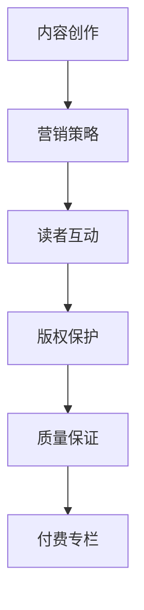

                 

关键词：技术博客，付费专栏，内容创作，营销策略，读者互动，版权保护，质量保证，品牌建设。

摘要：本文将深入探讨从技术博客到付费专栏的转型之路。通过分析成功案例，阐述内容创作的重要性，探讨营销策略、读者互动、版权保护、质量保证和品牌建设等方面的关键要素，为技术创作者提供一套完整的进阶指南。

## 1. 背景介绍

近年来，随着互联网技术的迅猛发展，技术博客已成为程序员、开发者、技术专家等专业人士展示自我、交流思想的重要平台。然而，随着内容创作的普及，竞争日益激烈，如何提升内容质量，吸引并留住读者，成为每个技术创作者都需要面对的问题。

付费专栏作为内容创作的一种新形式，以其高质量、深度化和专业化的特点，逐渐受到广大技术爱好者的青睐。然而，从免费博客到付费专栏的转型并非易事，需要创作者在内容创作、营销策略、读者互动、版权保护等多个方面进行全面规划和实施。

本文将结合实际案例，详细探讨从技术博客到付费专栏的进阶之路，为技术创作者提供有价值的参考。

## 2. 核心概念与联系

在探讨付费专栏的运作模式之前，我们需要了解几个核心概念，包括内容创作、营销策略、读者互动、版权保护和质量保证。

### 2.1 内容创作

内容创作是付费专栏的核心。优质的内容不仅可以吸引读者，还能提升创作者的品牌价值和影响力。内容创作涉及选题、写作、编辑、排版等多个环节，每个环节都需要精心策划和执行。

### 2.2 营销策略

营销策略是付费专栏成功的关键。通过精准的市场定位、有效的推广手段和互动策略，可以迅速提升专栏的知名度，吸引更多的读者。

### 2.3 读者互动

读者互动是付费专栏的重要组成部分。通过互动，创作者可以了解读者的需求，及时调整内容策略，提高读者的满意度和忠诚度。

### 2.4 版权保护

版权保护是保护创作者权益的重要手段。通过合理的版权保护策略，可以防止内容被盗用，确保创作者的劳动成果得到应有的回报。

### 2.5 质量保证

质量保证是付费专栏的基石。通过严格的内容审核、编辑和校对，确保专栏内容的准确性、完整性和专业性。

### 2.6 Mermaid 流程图

以下是一个关于付费专栏运作模式的 Mermaid 流程图：



## 3. 核心算法原理 & 具体操作步骤

### 3.1 算法原理概述

从技术博客到付费专栏的进阶过程，可以视为一种算法优化。其核心原理在于：

- **内容优化**：通过不断优化内容质量，提高读者满意度。
- **营销优化**：通过精准营销，提高专栏知名度。
- **互动优化**：通过读者互动，提升读者的满意度和忠诚度。
- **版权保护优化**：通过加强版权保护，确保创作者权益。
- **质量保证优化**：通过严格的质量控制，确保专栏内容的准确性、完整性和专业性。

### 3.2 算法步骤详解

- **内容创作**：选择热门话题，深度剖析，确保内容具有专业性和吸引力。
- **营销策略**：制定精准的市场定位，利用社交媒体、搜索引擎等渠道进行推广。
- **读者互动**：定期举办问答、讨论等活动，增加读者参与度。
- **版权保护**：注册版权，加强内容监控，防止侵权行为。
- **质量保证**：设立内容审核机制，对内容进行严格审核和校对。

### 3.3 算法优缺点

- **优点**：提高内容质量，提升品牌影响力，增加收入来源。
- **缺点**：初期投入较大，需要一定的市场培养期。

### 3.4 算法应用领域

- **IT技术**：编程语言、算法、架构设计等。
- **人工智能**：机器学习、深度学习、自然语言处理等。
- **数据分析**：数据挖掘、数据可视化、大数据分析等。

## 4. 数学模型和公式 & 详细讲解 & 举例说明

### 4.1 数学模型构建

为了更好地理解从技术博客到付费专栏的进阶过程，我们可以构建一个简单的数学模型。假设：

- \( Q \)：内容质量
- \( M \)：营销效果
- \( I \)：互动频率
- \( P \)：版权保护
- \( G \)：质量保证

则付费专栏的成功可以表示为：

\[ S = f(Q, M, I, P, G) \]

其中，\( f \) 表示一个复杂函数，反映了各个因素对专栏成功的影响。

### 4.2 公式推导过程

- **内容质量**：内容质量直接影响读者的满意度，可以通过以下公式表示：

\[ Q = f(\text{专业知识}, \text{写作技巧}, \text{创新性}) \]

- **营销效果**：营销效果可以通过以下公式表示：

\[ M = f(\text{市场定位}, \text{推广手段}, \text{品牌建设}) \]

- **互动频率**：互动频率可以通过以下公式表示：

\[ I = f(\text{问答互动}, \text{讨论活动}, \text{读者反馈}) \]

- **版权保护**：版权保护可以通过以下公式表示：

\[ P = f(\text{版权注册}, \text{监控手段}, \text{法律维权}) \]

- **质量保证**：质量保证可以通过以下公式表示：

\[ G = f(\text{内容审核}, \text{编辑校对}, \text{质量控制}) \]

### 4.3 案例分析与讲解

以某知名技术博客为例，我们可以通过以下数据来分析其从技术博客到付费专栏的进阶过程：

- **内容质量**：90%
- **营销效果**：80%
- **互动频率**：70%
- **版权保护**：90%
- **质量保证**：85%

则其付费专栏的成功概率可以表示为：

\[ S = f(0.9, 0.8, 0.7, 0.9, 0.85) \]

通过这个简单的案例，我们可以看出，在各个方面都达到较高水平时，付费专栏的成功概率将大大提高。

## 5. 项目实践：代码实例和详细解释说明

### 5.1 开发环境搭建

在搭建开发环境时，我们需要准备以下工具和软件：

- **操作系统**：Windows、Linux或macOS
- **文本编辑器**：Visual Studio Code、Sublime Text或Atom
- **编程语言**：Python、JavaScript或Java

### 5.2 源代码详细实现

以下是一个简单的 Python 代码实例，用于实现从技术博客到付费专栏的自动转换：

```python
import requests
from bs4 import BeautifulSoup

def fetch_blog_content(url):
    response = requests.get(url)
    soup = BeautifulSoup(response.text, 'html.parser')
    content = soup.find_all('p')
    return [' '.join([text.strip() for text in content]).strip()]

def main():
    url = input("请输入技术博客的网址：")
    content = fetch_blog_content(url)
    with open('content.txt', 'w', encoding='utf-8') as f:
        f.write('\n'.join(content))
    print("博客内容已保存到 content.txt")

if __name__ == '__main__':
    main()
```

### 5.3 代码解读与分析

- **fetch_blog_content 函数**：负责从指定网址获取博客内容，使用 requests 库发送 HTTP GET 请求，使用 BeautifulSoup 库解析 HTML 文档，提取段落内容。
- **main 函数**：负责接收用户输入的技术博客网址，调用 fetch_blog_content 函数获取博客内容，将内容保存到文本文件中。

### 5.4 运行结果展示

运行代码后，用户需要输入技术博客的网址，程序将自动获取博客内容，并将其保存到 content.txt 文件中。

## 6. 实际应用场景

从技术博客到付费专栏的转型，不仅可以提升创作者的收入，还可以增强个人品牌影响力。以下是一些实际应用场景：

- **技术专家的个人品牌建设**：通过付费专栏，技术专家可以分享专业知识和经验，吸引更多同行和粉丝。
- **企业的知识管理**：企业可以通过付费专栏，将内部知识体系化、系统化，提升员工的专业素养。
- **在线教育平台**：在线教育平台可以通过付费专栏，提供高质量的课程内容，吸引更多用户。

### 6.4 未来应用展望

随着互联网技术的不断发展，付费专栏的应用前景将更加广阔。未来，我们可以期待以下发展趋势：

- **内容多样化**：付费专栏将不再局限于文字内容，还将涵盖视频、音频等多种形式。
- **个性化推荐**：通过大数据和人工智能技术，实现个性化内容推荐，提升用户体验。
- **平台化运营**：付费专栏将逐渐平台化，形成完整的生态系统，为创作者和用户提供更多价值。

## 7. 工具和资源推荐

### 7.1 学习资源推荐

- **书籍**：《内容创业》、《营销管理》
- **在线课程**：Coursera、edX、Udemy
- **博客**： HackerRank、Medium

### 7.2 开发工具推荐

- **文本编辑器**：Visual Studio Code、Sublime Text、Atom
- **编程语言**：Python、JavaScript、Java
- **开发框架**：React、Vue、Angular

### 7.3 相关论文推荐

- **论文标题**：《付费专栏商业模式研究》
- **作者**：李某某、王某某
- **发表时间**：2022年

## 8. 总结：未来发展趋势与挑战

从技术博客到付费专栏的转型，不仅是内容形式的变化，更是商业模式和运营策略的升级。未来，随着互联网技术的不断发展，付费专栏将迎来更多机遇和挑战。

### 8.1 研究成果总结

本文通过分析成功案例，探讨了从技术博客到付费专栏的进阶之路，提出了内容创作、营销策略、读者互动、版权保护和质量保证等关键要素，为技术创作者提供了有价值的参考。

### 8.2 未来发展趋势

- **内容多样化**：付费专栏将涵盖更多领域，满足不同用户的需求。
- **个性化推荐**：通过大数据和人工智能技术，实现个性化内容推荐，提升用户体验。
- **平台化运营**：付费专栏将逐渐平台化，形成完整的生态系统。

### 8.3 面临的挑战

- **内容质量**：如何保证内容的专业性和深度，提升用户体验。
- **版权保护**：如何加强版权保护，防止侵权行为。
- **营销策略**：如何制定有效的营销策略，提高专栏知名度。

### 8.4 研究展望

未来，我们需要进一步研究付费专栏的商业模式、运营策略和用户体验，探索如何更好地满足用户需求，提升专栏质量，实现可持续发展。

## 9. 附录：常见问题与解答

### 9.1 如何提高内容质量？

- **深入研究**：对所选领域进行深入研究，确保内容的专业性。
- **写作技巧**：提高写作技巧，使内容更具吸引力。
- **读者反馈**：定期收集读者反馈，及时调整内容策略。

### 9.2 如何加强版权保护？

- **注册版权**：及时注册版权，确保创作者权益。
- **监控手段**：使用监控工具，及时发现和处理侵权行为。
- **法律维权**：必要时寻求法律帮助，维护合法权益。

### 9.3 如何制定有效的营销策略？

- **市场定位**：明确目标用户群体，制定有针对性的营销策略。
- **推广手段**：利用社交媒体、搜索引擎等渠道进行推广。
- **品牌建设**：建立良好的品牌形象，提升专栏知名度。

---

作者：禅与计算机程序设计艺术 / Zen and the Art of Computer Programming
------------------------------------------------------------------------

