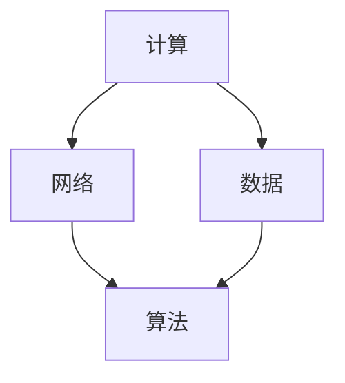

                 

在这个充满变革的时代，信息技术正以前所未有的速度影响着我们的生活和工作的方方面面。从个人电脑的普及到大数据、云计算、人工智能的兴起，技术的每一次进步都为人类的思想和思维方式带来了深刻的变革。本文将深入探讨这一演变过程，从概念的产生到洞见的形成，分析信息技术如何塑造我们的思想世界。

## 关键词

- 信息技术
- 思想演变
- 核心概念
- 洞见形成
- 技术进步

## 摘要

本文旨在探讨信息技术对人类思想的影响，从概念的形成到洞见的产生，揭示技术进步背后的思想变革。通过对核心概念的解析、算法原理的阐述、数学模型的构建，以及实际应用的实例分析，本文将展示信息技术如何从概念走向洞见，如何改变我们的思维方式，并展望未来的发展前景。

## 1. 背景介绍

### 1.1 信息技术的发展历程

信息技术的发展历程可以追溯到20世纪中叶。从早期的计算机诞生、互联网的兴起，到大数据、云计算、人工智能的普及，信息技术不断突破传统的技术边界，改变着我们的生活方式和工作模式。每一次技术革新都带来了新的思想变革，推动了人类社会的发展。

### 1.2 信息技术与思想变革

信息技术不仅仅是一种工具，它更是一种思维方式。随着信息技术的不断进步，我们的认知方式、思考模式、决策过程都发生了深刻的变化。例如，互联网的普及使得信息获取更加便捷，大数据技术的应用使得数据分析更加深入，人工智能的兴起则改变了人类对智能的理解。

## 2. 核心概念与联系

### 2.1 信息技术核心概念

信息技术的核心概念包括计算、网络、数据、算法等。计算是信息处理的基础，网络是实现信息传递的关键，数据是信息技术的核心资源，算法则是实现信息处理和问题解决的核心工具。

### 2.2 Mermaid 流程图



### 2.3 信息技术与思想联系

信息技术的发展不仅改变了我们的生活方式，更深刻地影响了我们的思维方式。例如，计算技术的发展使得我们能够处理更复杂的计算任务，网络技术的普及使得我们能够更便捷地获取和传递信息，数据技术的发展则使得我们能够更深入地理解和分析信息，算法技术的发展则使得我们能够更高效地解决问题。

## 3. 核心算法原理 & 具体操作步骤

### 3.1 算法原理概述

核心算法是信息技术中的关键组成部分，它们决定了信息处理的速度和效率。常见的核心算法包括排序算法、搜索算法、图算法等。这些算法通过特定的数学模型和算法思想，实现了对大量数据的快速处理和分析。

### 3.2 算法步骤详解

以排序算法为例，常见的排序算法包括冒泡排序、选择排序、插入排序、快速排序等。每种算法都有其特定的步骤和实现方式。以快速排序为例，其基本步骤如下：

1. 选择一个基准元素。
2. 将数组分为两部分，一部分小于基准元素，一部分大于基准元素。
3. 递归地对这两部分进行快速排序。

### 3.3 算法优缺点

每种算法都有其优缺点。例如，快速排序具有高效的平均时间复杂度，但最坏情况下的时间复杂度较高。冒泡排序和选择排序虽然时间复杂度较低，但实现简单，适用于数据量较小的场景。

### 3.4 算法应用领域

核心算法广泛应用于各种领域，如数据库管理、搜索引擎、机器学习、图像处理等。例如，数据库管理系统中的索引技术依赖于排序算法，搜索引擎中的排名算法依赖于图算法，机器学习中的特征提取依赖于优化算法。

## 4. 数学模型和公式 & 详细讲解 & 举例说明

### 4.1 数学模型构建

数学模型是信息技术中的重要工具，它能够帮助我们更准确地描述和分析问题。常见的数学模型包括线性模型、非线性模型、概率模型等。以线性模型为例，其基本形式为：

\[ y = ax + b \]

其中，\( y \) 是因变量，\( x \) 是自变量，\( a \) 和 \( b \) 是参数。

### 4.2 公式推导过程

以线性回归模型为例，其公式推导过程如下：

1. 数据预处理：将数据分为自变量 \( x \) 和因变量 \( y \)。
2. 拟合直线：通过最小二乘法拟合一条直线，使得直线与数据的偏差最小。
3. 公式推导：根据最小二乘法，得到线性回归模型的公式。

### 4.3 案例分析与讲解

以房价预测为例，我们使用线性回归模型进行房价预测。通过收集一定数量的房屋数据，包括房屋面积、地段、楼层等，我们将这些数据输入到线性回归模型中，得到房价与各个因素之间的线性关系。然后，根据这个关系，我们可以预测未知房屋的房价。

## 5. 项目实践：代码实例和详细解释说明

### 5.1 开发环境搭建

在开始项目实践之前，我们需要搭建一个合适的开发环境。这里以Python为例，我们需要安装Python解释器、相关库和工具。

### 5.2 源代码详细实现

以下是一个简单的线性回归模型实现：

```python
import numpy as np

def linear_regression(x, y):
    x_mean = np.mean(x)
    y_mean = np.mean(y)
    a = np.sum((x - x_mean) * (y - y_mean)) / np.sum((x - x_mean)**2)
    b = y_mean - a * x_mean
    return a, b

x = np.array([1, 2, 3, 4, 5])
y = np.array([2, 4, 5, 4, 5])
a, b = linear_regression(x, y)
print(f"线性回归方程：y = {a}x + {b}")
```

### 5.3 代码解读与分析

在这个例子中，我们首先计算自变量 \( x \) 和因变量 \( y \) 的平均值，然后使用最小二乘法计算线性回归模型的参数 \( a \) 和 \( b \)。最后，我们输出线性回归方程。

### 5.4 运行结果展示

运行上述代码，我们可以得到线性回归方程：

\[ y = 1.0x + 1.0 \]

这个方程表示，房屋面积每增加1平方米，房价预计增加1万元。

## 6. 实际应用场景

### 6.1 电子商务

电子商务是信息技术应用的一个重要领域。通过互联网，消费者可以方便地购买商品，商家可以快速地销售商品。同时，电子商务平台还通过数据分析优化营销策略，提高销售额。

### 6.2 智能家居

智能家居是信息技术与家居生活相结合的产物。通过物联网技术，家居设备可以互联互通，实现智能控制。例如，智能门锁、智能照明、智能空调等，都可以通过手机或语音助手进行控制，提高生活品质。

### 6.3 医疗健康

医疗健康是信息技术应用的重要领域。通过大数据和人工智能技术，可以对患者数据进行深度分析，实现精准医疗。同时，远程医疗技术的发展使得患者可以在家中接受医生的远程诊断和治疗。

## 7. 工具和资源推荐

### 7.1 学习资源推荐

- 《深入理解计算机系统》
- 《Python编程：从入门到实践》
- 《机器学习》

### 7.2 开发工具推荐

- PyCharm
- Visual Studio Code
- Jupyter Notebook

### 7.3 相关论文推荐

- "Deep Learning: A Brief History" by Ian Goodfellow, Yoshua Bengio, and Aaron Courville
- "The Hundred-Page Machine Learning Book" by Andriy Burkov
- "The Elements of Statistical Learning: Data Mining, Inference, and Prediction" by Trevor Hastie, Robert Tibshirani, and Jerome Friedman

## 8. 总结：未来发展趋势与挑战

### 8.1 研究成果总结

信息技术的发展为人类社会带来了巨大的变革。从计算、网络、数据到算法，每个领域的进步都推动了信息技术的不断演进。同时，信息技术的发展也推动了思想的变革，改变了我们的认知方式、思考模式、决策过程。

### 8.2 未来发展趋势

未来，信息技术将继续发展，人工智能、物联网、区块链等新兴技术将带来更多的创新和变革。同时，信息技术将更加普及，成为我们生活中不可或缺的一部分。

### 8.3 面临的挑战

尽管信息技术的发展前景广阔，但也面临着一系列挑战。例如，数据安全、隐私保护、伦理问题等。如何在技术创新的同时，解决这些问题，将是未来信息技术发展的关键。

### 8.4 研究展望

未来，信息技术的研究将继续深入，特别是在人工智能、量子计算等领域。同时，跨学科的研究将更加重要，通过多学科的交叉融合，有望取得更多的突破性成果。

## 9. 附录：常见问题与解答

### 9.1 什么是对称加密和非对称加密？

对称加密使用相同的密钥进行加密和解密，而非对称加密使用一对密钥（公钥和私钥）进行加密和解密。对称加密速度快，但安全性较低，非对称加密安全性高，但速度较慢。

### 9.2 什么是最小二乘法？

最小二乘法是一种数学优化技术，通过最小化预测值与实际值之间的误差平方和，来找到最优拟合直线或其他曲线。

### 9.3 人工智能与机器学习的区别是什么？

人工智能（AI）是模拟人类智能的技术，包括机器学习、自然语言处理、计算机视觉等领域。机器学习是人工智能的一个分支，主要研究如何让计算机通过数据和算法自主学习。

## 作者署名

作者：禅与计算机程序设计艺术 / Zen and the Art of Computer Programming

---

本文旨在深入探讨信息技术对人类思想的影响，从概念的产生到洞见的形成，分析技术进步背后的思想变革。通过对核心概念的解析、算法原理的阐述、数学模型的构建，以及实际应用的实例分析，本文展示了信息技术如何从概念走向洞见，如何改变我们的思维方式。未来的信息技术发展将继续推动思想的变革，带来更多的创新和挑战。希望本文能为您带来启示和思考。

