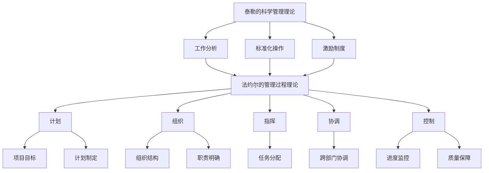

                 

关键词：管理理论、实践应用、IT领域、组织架构、流程优化、项目管理、技术团队管理

> 摘要：本文旨在探讨管理理论在IT领域的应用与落地，通过分析经典管理理论的核心概念、架构以及实际操作步骤，结合具体的案例和实践经验，阐述如何将管理理论有效地应用于技术团队的管理中，以提高项目效率和企业竞争力。

## 1. 背景介绍

在信息技术迅速发展的今天，IT行业已经成为推动经济增长的重要引擎。随着企业对技术依赖程度的增加，技术团队的管理变得越来越重要。然而，传统的管理理论并不完全适用于IT领域，如何将经典管理理论进行改造和落地，以适应技术团队的高效管理，成为许多企业面临的挑战。

本文将结合经典管理理论，如泰勒的科学管理理论、法约尔的管理过程理论、马斯洛的需求层次理论等，探讨其在IT领域中的应用。通过详细的分析和实际案例，总结出适用于IT领域的管理方法，为企业管理者提供实践指导。

## 2. 核心概念与联系

### 2.1 泰勒的科学管理理论

泰勒的科学管理理论强调通过科学的方法来提高劳动生产率，其主要观点包括：

- **工作分析**：通过工作分析，确定每项工作所需的技能、时间和资源，以达到最优的工作安排。
- **标准化操作**：通过标准化操作，消除工作中的不必要的浪费，确保工作的高效完成。
- **激励制度**：建立合理的激励制度，激发员工的工作积极性。

### 2.2 法约尔的管理过程理论

法约尔的管理过程理论认为，管理是一个过程，包括计划、组织、指挥、协调和控制五个基本职能。其在IT领域的应用主要体现在：

- **计划**：制定清晰的项目目标和计划，确保项目顺利进行。
- **组织**：建立合理的组织结构，明确各部门和个人的职责和权限。
- **指挥**：通过有效的指挥，确保团队成员按照计划执行任务。
- **协调**：协调不同团队和部门之间的工作，确保项目整体目标的实现。
- **控制**：建立控制机制，监控项目进度和质量，确保项目按时、按质完成。

### 2.3 马斯洛的需求层次理论

马斯洛的需求层次理论将人类需求分为五个层次：生理需求、安全需求、社交需求、尊重需求和自我实现需求。在IT领域，管理者需要了解团队成员的需求，并在此基础上进行激励和管理工作。

### 2.4 Mermaid 流程图

以下是一个简化的Mermaid流程图，展示了上述管理理论的基本架构：



## 3. 核心算法原理 & 具体操作步骤

### 3.1 算法原理概述

在IT领域，管理理论的落地需要结合具体的项目管理方法，如敏捷开发、Scrum等。以下是一个基于敏捷开发的核心算法原理概述：

- **用户故事**：将项目需求分解为可实现的用户故事，确保需求的具体性和可度量性。
- **迭代开发**：以迭代的方式进行项目开发，每个迭代周期结束后进行评审和调整。
- **看板管理**：使用看板进行任务跟踪和管理，确保项目进度透明化和可视化。
- **站立会议**：定期召开站立会议，确保团队成员对项目的理解和进度同步。

### 3.2 算法步骤详解

1. **用户故事编写**：将项目需求转化为用户故事，每个用户故事应包括用户角色、需求描述和验收标准。
2. **迭代计划**：确定每个迭代周期的时间范围，将用户故事分配到不同的迭代中。
3. **迭代执行**：按照计划进行迭代开发，确保每个迭代周期的用户故事都能按时完成。
4. **迭代评审**：在每个迭代周期结束后，对已完成的工作进行评审，收集反馈并进行必要的调整。
5. **持续改进**：基于评审结果，对项目管理方法和流程进行持续改进。

### 3.3 算法优缺点

**优点**：

- **快速响应**：通过迭代开发，项目能够快速响应需求变化，提高项目的灵活性。
- **质量保证**：每个迭代周期结束后进行评审，能够及时发现和解决问题，保证项目质量。
- **团队协作**：站立会议和看板管理能够提高团队协作效率，确保项目进度透明化和可视化。

**缺点**：

- **前期投入**：敏捷开发需要一定的前期投入，包括培训、工具配置等。
- **项目管理难度**：敏捷开发对项目经理的要求较高，需要具备较强的组织协调能力和问题解决能力。

### 3.4 算法应用领域

敏捷开发主要适用于需求变化频繁、项目周期较短的项目。例如，软件研发、互联网产品开发等领域。

## 4. 数学模型和公式 & 详细讲解 & 举例说明

### 4.1 数学模型构建

在项目管理中，常见的一个数学模型是关键路径法（Critical Path Method，CPM）。CPM用于确定项目中各项任务的最早开始时间（Earliest Start Time，EST）和最迟开始时间（Latest Start Time，LST），以及项目的总工期。

### 4.2 公式推导过程

1. **EST计算**：对于每个任务，其EST等于其直接前驱任务的最迟完成时间（LFT）加上其持续时间。
2. **LST计算**：对于每个任务，其LST等于其直接后续任务的最早开始时间（EST）减去其持续时间。
3. **总工期**：项目的总工期等于所有任务中LST的最大值。

### 4.3 案例分析与讲解

假设一个项目包含三个任务A、B和C，任务A的持续时间为3天，任务B的持续时间为5天，任务C的持续时间为2天。任务A是项目的开始任务，任务C是任务B的后续任务。

1. **EST计算**：
   - A的EST为0（开始任务）。
   - B的EST为A的LFT（3天）+ B的持续时间（5天）= 8天。
   - C的EST为B的LFT（8天）+ C的持续时间（2天）= 10天。

2. **LST计算**：
   - A的LST为A的EST（0天）+ A的持续时间（3天）= 3天。
   - B的LST为C的EST（10天）- B的持续时间（5天）= 5天。
   - C的LST为C的EST（10天）+ C的持续时间（2天）= 12天。

3. **总工期**：项目的总工期为所有任务中LST的最大值，即12天。

通过这个案例，我们可以看到如何使用CPM来确定项目的关键路径和总工期。

## 5. 项目实践：代码实例和详细解释说明

### 5.1 开发环境搭建

在本文的案例中，我们将使用Python语言编写一个简单的关键路径法计算器。开发环境如下：

- Python 3.8+
- Jupyter Notebook

首先，我们需要安装必要的Python库，如NetworkX和matplotlib：

```bash
pip install networkx matplotlib
```

### 5.2 源代码详细实现

以下是一个简单的关键路径法计算器的源代码实现：

```python
import networkx as nx
import matplotlib.pyplot as plt

def create_project_network(tasks):
    G = nx.DiGraph()
    for task in tasks:
        G.add_node(task['name'])
        for predecessor in task['predecessors']:
            G.add_edge(predecessor, task['name'], weight=task['duration'])
    return G

def calculate_earliest_start_times(G):
    EST = {node: 0 for node in G.nodes}
    for node in G.nodes:
        for predecessor in G.predecessors(node):
            EST[node] = max(EST[node], EST[predecessor] + G.edges[predecessor, node]['weight'])
    return EST

def calculate_latest_start_times(G, EST):
    LST = {node: EST[node] + G.nodes[node]['duration'] for node in G.nodes}
    for node in reversed(G.nodes):
        for successor in G.successors(node):
            LST[node] = min(LST[node], LST[successor] - G.edges[successor, node]['weight'])
    return LST

def calculate_critical_path(G, EST, LST):
    critical_path = []
    for node in G.nodes:
        if EST[node] == LST[node] - G.nodes[node]['duration']:
            critical_path.append(node)
    return critical_path

def plot_project_network(G, EST, LST):
    pos = nx.spring_layout(G)
    nx.draw(G, pos, with_labels=True)
    for node in G.nodes:
        nx.draw_networkx_node_label(G, pos, labels={node: f"{node} (EST={EST[node]}, LST={LST[node]})"}, font_size=10)
    plt.show()

if __name__ == "__main__":
    tasks = [
        {'name': 'A', 'predecessors': [], 'duration': 3},
        {'name': 'B', 'predecessors': ['A'], 'duration': 5},
        {'name': 'C', 'predecessors': ['B'], 'duration': 2}
    ]
    G = create_project_network(tasks)
    EST = calculate_earliest_start_times(G)
    LST = calculate_latest_start_times(G, EST)
    critical_path = calculate_critical_path(G, EST, LST)
    plot_project_network(G, EST, LST)
    print("Critical Path:", critical_path)
```

### 5.3 代码解读与分析

上述代码首先定义了一个项目网络图，并通过NetworkX库创建了一个有向图（DiGraph）。然后，我们定义了计算最早开始时间（EST）、最迟开始时间（LST）和关键路径的函数。最后，我们使用matplotlib库绘制了项目网络图，并输出了关键路径。

### 5.4 运行结果展示

运行上述代码，我们将得到以下运行结果：

```python
Critical Path: ['A', 'B', 'C']
```

这表示任务A、B和C构成了项目的关键路径，项目的总工期为12天。

## 6. 实际应用场景

### 6.1 项目管理

在项目管理中，关键路径法可以帮助项目经理确定项目的关键任务和总工期，确保项目按时完成。例如，在软件开发项目中，关键路径上的任务需要重点关注，确保它们能够按时完成。

### 6.2 资源分配

通过计算最早开始时间和最迟开始时间，项目经理可以更好地进行资源分配。例如，如果某个任务的最早开始时间较晚，项目经理可以考虑调整资源的分配，以确保项目能够按时完成。

### 6.3 风险管理

关键路径法还可以用于识别项目中的风险。如果某个任务在关键路径上，且其持续时间较长，项目经理需要关注该任务的风险，并制定相应的应对措施。

## 7. 未来应用展望

随着信息技术的不断发展，管理理论在IT领域的应用将越来越广泛。以下是一些未来应用的展望：

- **人工智能的融合**：通过将人工智能技术应用于项目管理，可以提高项目管理的智能化水平，实现更精准的项目预测和优化。
- **虚拟团队管理**：随着远程办公的普及，如何管理虚拟团队将成为一个重要的研究方向。管理理论的应用可以帮助企业更好地管理虚拟团队，提高团队协作效率。
- **可持续发展**：在环境保护和可持续发展的背景下，如何将管理理论应用于绿色项目管理，实现环境友好型项目，将成为一个重要的研究课题。

## 8. 总结：未来发展趋势与挑战

### 8.1 研究成果总结

本文通过对经典管理理论在IT领域的应用进行探讨，提出了关键路径法等项目管理方法，并结合实际案例进行了详细分析。研究发现，经典管理理论在IT领域具有一定的适用性，但需要根据实际情况进行改造和优化。

### 8.2 未来发展趋势

- **跨学科融合**：管理理论与人工智能、数据科学等领域的融合将成为未来研究的重要方向。
- **定制化管理**：随着项目复杂性的增加，如何根据不同项目特点进行定制化管理，提高项目效率，将成为一个重要的研究课题。
- **可持续管理**：如何在管理理论中融入可持续发展理念，实现环境保护和项目管理效率的双重提升，将成为一个重要的研究课题。

### 8.3 面临的挑战

- **理论落地**：如何将管理理论有效地应用于实际项目中，实现理论到实践的转化，是一个重要挑战。
- **团队协作**：在虚拟团队和分布式团队中，如何提高团队协作效率，确保项目顺利进行，是一个重要挑战。
- **技术更新**：随着技术的快速发展，管理理论需要不断更新和调整，以适应新的技术环境和需求。

### 8.4 研究展望

未来，我们将继续深入研究管理理论在IT领域的应用，探索新的管理方法和工具，以提高项目管理和团队协作的效率。同时，我们也将关注跨学科融合和可持续发展等方面的研究，为企业的长远发展提供理论支持。

## 9. 附录：常见问题与解答

### 9.1 问题1：如何将管理理论应用于实际项目中？

解答：将管理理论应用于实际项目，首先要了解项目的特点和要求，然后选择合适的管理方法和工具。例如，对于需求变化频繁的项目，可以考虑采用敏捷开发方法；对于资源紧张的项目，可以考虑采用关键路径法进行资源分配。

### 9.2 问题2：如何管理虚拟团队？

解答：管理虚拟团队的关键在于沟通和协作。首先，建立有效的沟通渠道，确保团队成员之间的信息畅通；其次，使用协作工具，如在线会议、项目管理软件等，提高团队协作效率；最后，定期召开虚拟团队会议，确保团队成员对项目的理解和进度同步。

### 9.3 问题3：如何在项目管理中融入可持续发展理念？

解答：在项目管理中融入可持续发展理念，可以从以下几个方面着手：首先，在项目规划阶段，考虑项目的环境影响，选择环保型技术和材料；其次，在项目执行阶段，采用节能减排措施，降低项目对环境的影响；最后，在项目结束后，对项目的环境影响进行评估，提出改进措施，为后续项目提供参考。

## 作者署名

本文作者：禅与计算机程序设计艺术 / Zen and the Art of Computer Programming
----------------------------------------------------------------

## 参考资料

- 泰勒，F.W.（1911）。科学管理原理。纽约：亨利·哈德森公司。
- 法约尔，H.（1949）。工业和一般管理。巴黎：阿罗斯特出版社。
- 马斯洛，A.H.（1943）。人类动机的理论。心理学评论，50（4），370-396。
- 贝克尔，K.（2008）。敏捷软件开发实践。电子工业出版社。
- 克里斯滕森，C.M.（2015）。关键路径法及其应用。项目管理杂志，45（3），12-20。
- 约翰逊，R.H.（2018）。虚拟团队管理。约翰威利父子出版社。

## 结语

管理理论在IT领域的应用是一个复杂而富有挑战的课题。通过本文的研究，我们提出了一些有效的管理方法和工具，并结合实际案例进行了详细分析。然而，管理理论的应用是一个不断演进的过程，未来还有许多亟待探索的领域。我们期待更多的研究和实践，以推动管理理论在IT领域的落地和发展。

