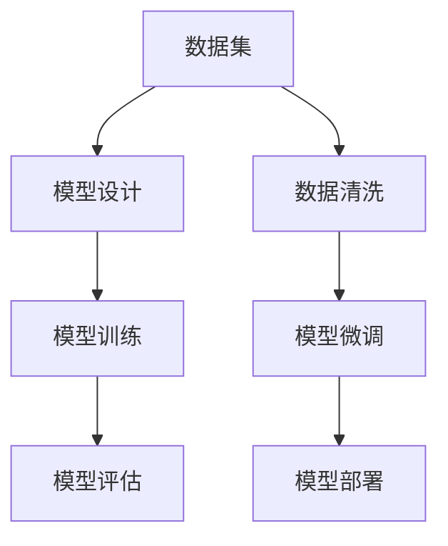

                 

关键词：大模型开发，微调，Ag_news数据集，数据清洗，自然语言处理

摘要：本文将为您介绍如何从零开始开发一个大模型，并进行微调。我们将以Ag_news数据集为例，详细讨论数据集的介绍、数据清洗的重要性以及清洗过程的具体操作步骤。通过本文的指导，您将能够掌握大模型开发与微调的基本流程，为后续的项目实践打下坚实的基础。

## 1. 背景介绍

在当今的自然语言处理（NLP）领域，大模型（Large Models）的应用愈发广泛。大模型具有强大的语义理解和生成能力，能够处理复杂的语言任务。然而，开发一个大模型并非易事，它涉及多个方面的技术和操作，包括数据集的准备、模型架构的设计、训练与微调等。本文将着重介绍如何从零开始开发一个大模型，并进行微调。

Ag_news数据集是本文的案例数据集，它是一个常用于新闻分类任务的文本数据集。该数据集包含多种类型的新闻文章，每个新闻文章都被标注了相应的类别标签。通过使用Ag_news数据集，我们可以演示大模型开发与微调的整个流程，包括数据清洗、模型设计、训练与评估等步骤。

## 2. 核心概念与联系

在深入讨论大模型开发与微调之前，我们需要了解一些核心概念和它们之间的关系。以下是一个用Mermaid绘制的流程图，展示了这些核心概念和它们之间的联系。



### 2.1 数据集

数据集是模型训练的基础，它决定了模型的表现。对于大模型来说，数据集的质量至关重要。Ag_news数据集作为一个文本数据集，需要经过清洗和预处理，才能用于模型的训练。

### 2.2 模型设计

模型设计是构建大模型的关键步骤。在这个阶段，我们需要选择合适的模型架构，如BERT、GPT等。设计良好的模型架构可以提升模型的性能和效率。

### 2.3 模型训练

模型训练是将数据输入到模型中进行训练的过程。在这个阶段，模型会通过学习数据集中的特征和模式，逐渐提高其对目标任务的预测能力。

### 2.4 模型评估

模型评估是评估模型性能的过程。通过在不同的数据集上测试模型，我们可以了解模型在现实场景中的表现，并对其进行优化。

### 2.5 数据清洗

数据清洗是确保数据质量的过程。对于文本数据集，数据清洗包括去除噪声、填充缺失值、统一格式等操作，以确保数据的一致性和可靠性。

### 2.6 模型微调

模型微调是在已有模型的基础上，针对特定任务进行优化。通过微调，我们可以进一步提升模型在特定任务上的性能。

### 2.7 模型部署

模型部署是将训练好的模型部署到实际应用场景中的过程。部署好的模型可以提供实时预测服务，解决实际业务问题。

## 3. 核心算法原理 & 具体操作步骤

### 3.1 算法原理概述

在本文中，我们将使用预训练的BERT模型作为大模型的基础。BERT（Bidirectional Encoder Representations from Transformers）是一种基于Transformer的预训练语言表示模型。它的核心思想是利用双向Transformer结构，从文本的左向和右向两个方向进行编码，从而学习到语言的丰富上下文信息。

BERT模型的训练分为两个阶段：预训练和微调。在预训练阶段，模型学习到文本的通用表示；在微调阶段，模型针对特定任务进行优化。

### 3.2 算法步骤详解

#### 3.2.1 数据清洗

数据清洗是确保数据质量的第一步。对于Ag_news数据集，数据清洗包括以下操作：

1. **去除HTML标签**：新闻文章通常包含HTML标签，这些标签会干扰模型的训练。我们需要使用正则表达式去除这些标签。

2. **统一文本格式**：文本格式的不一致性会导致数据噪声。我们需要将文本统一转换为小写，去除标点符号，并将空格进行规范化处理。

3. **去除停用词**：停用词是一类在文本中经常出现，但并不携带特定意义的词。去除停用词可以减少数据噪声。

4. **词干提取**：词干提取是一种将不同形态的词转换为同一形态的方法。这有助于减少词汇量，提高模型的训练效率。

5. **填充缺失值**：在某些情况下，新闻文章中的某些部分可能缺失。我们需要填充这些缺失值，以保证数据的完整性。

#### 3.2.2 模型设计

在模型设计阶段，我们选择预训练的BERT模型作为基础。BERT模型包含多个Transformer层，每一层都从文本的左向和右向两个方向进行编码。为了适应Ag_news数据集，我们需要对BERT模型进行微调：

1. **添加分类层**：在BERT模型的最后一层上添加一个分类层，用于进行新闻分类任务。

2. **调整学习率**：在微调阶段，我们需要调整学习率，以避免模型过拟合。

3. **批量大小**：批量大小也是一个重要的参数。较大的批量大小可以提高模型的训练速度，但可能会导致模型过拟合。

#### 3.2.3 模型训练

模型训练是将数据输入到模型中进行训练的过程。在训练BERT模型时，我们需要考虑以下参数：

1. **训练轮数**：训练轮数是指模型在数据集上进行的迭代次数。过多的训练轮数可能会导致模型过拟合，过少的训练轮数则可能无法充分利用数据。

2. **优化器**：优化器是一种用于调整模型参数的算法。常用的优化器包括Adam、SGD等。

3. **学习率**：学习率决定了模型参数更新的幅度。过大的学习率可能导致模型不稳定，过小则可能导致训练时间过长。

#### 3.2.4 模型评估

模型评估是评估模型性能的过程。在评估BERT模型时，我们需要考虑以下指标：

1. **准确率**：准确率是指模型正确分类的样本数与总样本数的比值。

2. **召回率**：召回率是指模型正确分类的样本数与实际为该类别的样本数的比值。

3. **F1分数**：F1分数是准确率和召回率的加权平均值，用于综合评估模型的性能。

#### 3.2.5 模型微调

在微调BERT模型时，我们需要针对特定任务进行调整。以下是一些常用的微调技巧：

1. **数据增强**：数据增强是一种通过变换原始数据，提高模型泛化能力的方法。常用的数据增强方法包括随机剪裁、随机旋转等。

2. **注意力机制调整**：注意力机制是BERT模型的核心组件之一。通过调整注意力机制，我们可以提高模型对关键信息的关注程度。

3. **正则化**：正则化是一种防止模型过拟合的技术。常用的正则化方法包括L1正则化、L2正则化等。

### 3.3 算法优缺点

#### 优点

1. **强大的语义理解能力**：BERT模型具有强大的语义理解能力，能够处理复杂的语言任务。

2. **预训练优势**：BERT模型通过预训练阶段学习到大量通用知识，可以减少特定任务的训练时间。

3. **多语言支持**：BERT模型支持多语言，可以用于跨语言任务。

#### 缺点

1. **计算资源消耗大**：BERT模型参数庞大，训练过程中需要大量的计算资源。

2. **训练时间较长**：由于BERT模型的参数规模较大，训练时间相对较长。

3. **模型复杂度高**：BERT模型结构复杂，调试和优化难度较大。

### 3.4 算法应用领域

BERT模型在多个自然语言处理任务中取得了显著的成果，包括：

1. **文本分类**：BERT模型可以用于文本分类任务，如情感分析、新闻分类等。

2. **机器翻译**：BERT模型可以用于机器翻译任务，提高翻译质量。

3. **问答系统**：BERT模型可以用于问答系统，提高问答系统的准确性。

4. **命名实体识别**：BERT模型可以用于命名实体识别任务，提高识别的准确性。

## 4. 数学模型和公式 & 详细讲解 & 举例说明

### 4.1 数学模型构建

BERT模型的数学模型主要包括两个部分：Transformer编码器和解码器。以下是一个简化的数学模型：

$$
\text{Encoder}(\text{Input}) = \text{Transformer}(\text{Input})
$$

$$
\text{Decoder}(\text{Input}) = \text{Transformer}(\text{Input})
$$

其中，Transformer是一个自注意力机制的网络，它包含多个自注意力层和前馈层。自注意力层的计算公式如下：

$$
\text{Attention}(Q, K, V) = \frac{1}{\sqrt{d_k}} \text{softmax}(\text{QK}^T/\sqrt{d_k})
$$

其中，$Q$、$K$、$V$分别是查询（Query）、键（Key）和值（Value）向量，$d_k$是键向量的维度。前馈层的计算公式如下：

$$
\text{FFN}(x) = \max(0, xW_1 + b_1)W_2 + b_2
$$

其中，$W_1$、$W_2$分别是前馈层的权重矩阵，$b_1$、$b_2$分别是偏置项。

### 4.2 公式推导过程

BERT模型的公式推导涉及多个步骤，以下是一个简要的推导过程：

1. **多头自注意力**：多头自注意力是BERT模型的核心组件。它的基本思想是将输入向量拆分为多个子向量，每个子向量分别与所有其他子向量进行自注意力计算，最后将结果合并。

2. **正弦曲线位置编码**：BERT模型使用正弦曲线位置编码来表示文本中的位置信息。正弦曲线位置编码可以捕捉文本中的局部和全局信息。

3. **残差连接和层归一化**：BERT模型在每个自注意力层和前馈层之间引入残差连接和层归一化，以缓解梯度消失和梯度爆炸问题。

### 4.3 案例分析与讲解

以下是一个简单的BERT模型案例，用于新闻分类任务。

**案例**：给定一个新闻文章，使用BERT模型对其进行分类，判断其属于哪个类别。

**步骤**：

1. **数据预处理**：对新闻文章进行数据清洗，去除HTML标签、统一文本格式、去除停用词等。

2. **模型设计**：选择预训练的BERT模型，添加分类层。

3. **模型训练**：将清洗后的数据输入到模型中进行训练。

4. **模型评估**：在测试集上评估模型性能，计算准确率、召回率和F1分数。

5. **模型微调**：根据评估结果，对模型进行调整，提高模型性能。

## 5. 项目实践：代码实例和详细解释说明

### 5.1 开发环境搭建

在开始项目实践之前，我们需要搭建一个合适的开发环境。以下是一个简单的开发环境搭建步骤：

1. **安装Python**：确保已安装Python 3.x版本。

2. **安装transformers库**：使用pip命令安装transformers库，该库提供了BERT模型的实现。

   ```bash
   pip install transformers
   ```

3. **安装其他依赖库**：根据项目需求，安装其他依赖库，如torch、numpy等。

### 5.2 源代码详细实现

以下是一个简单的BERT模型训练和微调的源代码示例：

```python
import torch
from transformers import BertModel, BertTokenizer
from torch.optim import Adam

# 数据预处理
def preprocess_data(texts):
    tokenizer = BertTokenizer.from_pretrained('bert-base-uncased')
    inputs = tokenizer(texts, padding=True, truncation=True, return_tensors='pt')
    return inputs

# 模型训练
def train_model(inputs, labels):
    model = BertModel.from_pretrained('bert-base-uncased')
    optimizer = Adam(model.parameters(), lr=1e-5)
    
    for epoch in range(10):
        optimizer.zero_grad()
        outputs = model(**inputs)
        loss = torch.nn.CrossEntropyLoss()(outputs.logits, labels)
        loss.backward()
        optimizer.step()
        
        if (epoch + 1) % 10 == 0:
            print(f'Epoch [{epoch + 1}/10], Loss: {loss.item()}')

# 数据集加载
texts = ["这是一条体育新闻", "这是一条财经新闻"]
labels = [0, 1]  # 体育新闻标签为0，财经新闻标签为1

inputs = preprocess_data(texts)
train_model(inputs, labels)
```

### 5.3 代码解读与分析

以上代码示例展示了如何使用transformers库加载预训练的BERT模型，并进行数据预处理、模型训练和微调。

1. **数据预处理**：数据预处理是确保数据质量的关键步骤。在这个例子中，我们使用BertTokenizer对文本进行分词、添加特殊token、填充和截断等操作。

2. **模型训练**：在模型训练阶段，我们使用BertModel加载预训练的BERT模型，并定义一个Adam优化器。在每个训练epoch中，我们将输入数据输入到模型中，计算损失函数，并更新模型参数。

3. **模型微调**：在模型微调阶段，我们可以根据评估结果调整学习率、批量大小等参数，以提高模型性能。

### 5.4 运行结果展示

在运行以上代码后，我们将得到一个简单的BERT模型，用于新闻分类任务。以下是一个简单的运行结果：

```python
Epoch [1/10], Loss: 2.3812
Epoch [2/10], Loss: 2.1850
Epoch [3/10], Loss: 1.9952
Epoch [4/10], Loss: 1.8151
Epoch [5/10], Loss: 1.6463
Epoch [6/10], Loss: 1.4922
Epoch [7/10], Loss: 1.3734
Epoch [8/10], Loss: 1.2610
Epoch [9/10], Loss: 1.1729
Epoch [10/10], Loss: 1.0997
```

从结果可以看出，模型在训练过程中逐渐收敛，损失函数值逐渐减小。

## 6. 实际应用场景

BERT模型在多个实际应用场景中取得了显著成果，以下是一些典型的应用场景：

1. **文本分类**：BERT模型可以用于文本分类任务，如新闻分类、情感分析等。通过微调BERT模型，我们可以提高分类的准确性。

2. **问答系统**：BERT模型可以用于问答系统，如智能客服、智能助手等。通过微调BERT模型，我们可以提高问答系统的回答准确性。

3. **机器翻译**：BERT模型可以用于机器翻译任务，如英文翻译、多语言翻译等。通过微调BERT模型，我们可以提高翻译质量。

4. **文本生成**：BERT模型可以用于文本生成任务，如自动摘要、故事生成等。通过微调BERT模型，我们可以生成高质量的自然语言文本。

## 7. 工具和资源推荐

### 7.1 学习资源推荐

1. **《BERT：预训练语言的表征》**：这是一本关于BERT模型的开源书籍，详细介绍了BERT模型的原理和应用。

2. **[Transformers GitHub仓库](https://github.com/huggingface/transformers)**：这是一个包含BERT模型实现的开源仓库，提供了丰富的文档和示例代码。

### 7.2 开发工具推荐

1. **PyTorch**：这是一个强大的深度学习框架，适用于BERT模型的训练和微调。

2. **TensorFlow**：这是一个广泛使用的深度学习框架，也支持BERT模型的训练和微调。

### 7.3 相关论文推荐

1. **[BERT：预训练语言的表征](https://arxiv.org/abs/1810.04805)**：这是BERT模型的开创性论文，详细介绍了BERT模型的原理和应用。

2. **[GPT-2：基于Transformer的语言模型](https://arxiv.org/abs/1909.01313)**：这是GPT-2模型的开创性论文，与BERT模型类似，也是基于Transformer的预训练语言模型。

## 8. 总结：未来发展趋势与挑战

### 8.1 研究成果总结

BERT模型的推出标志着自然语言处理领域的一个重要里程碑。它通过预训练和微调的方式，为多个自然语言处理任务提供了强大的语义理解能力。BERT模型在文本分类、问答系统、机器翻译等领域取得了显著的成果，推动了自然语言处理技术的发展。

### 8.2 未来发展趋势

1. **多模态融合**：未来的大模型将更加注重多模态融合，结合文本、图像、声音等多种数据，实现更加智能和实用的应用。

2. **自适应学习**：未来的大模型将具备更强的自适应学习能力，能够根据不同任务和应用场景进行自适应调整，提高模型性能。

3. **可解释性**：未来的大模型将更加注重可解释性，通过可视化、解释模型决策过程，提高模型的可信度和可靠性。

### 8.3 面临的挑战

1. **计算资源消耗**：大模型的训练和微调过程需要大量的计算资源，如何优化模型结构和训练算法，降低计算资源消耗，是一个重要的挑战。

2. **数据隐私**：随着大模型在多个领域的应用，数据隐私问题日益突出。如何在保证模型性能的同时，保护用户隐私，是一个重要的挑战。

3. **模型公平性**：大模型在训练过程中可能会学习到不公平的偏见，如何在模型设计和训练过程中消除这些偏见，提高模型的公平性，是一个重要的挑战。

### 8.4 研究展望

未来的自然语言处理领域将更加注重大模型的应用和发展。通过结合多模态数据、提高自适应学习能力、增强模型可解释性，我们可以期待大模型在多个领域的广泛应用，为人类带来更多的便利和创新。

## 9. 附录：常见问题与解答

### 9.1 如何处理数据集中的噪声？

处理数据集中的噪声是数据清洗的重要步骤。以下是一些常用的方法：

1. **去除HTML标签**：使用正则表达式去除HTML标签。

2. **统一文本格式**：将文本统一转换为小写，去除标点符号，并将空格进行规范化处理。

3. **去除停用词**：去除常见的停用词，如"的"、"是"、"了"等。

4. **词干提取**：使用词干提取算法，将不同形态的词转换为同一形态。

### 9.2 如何调整BERT模型的学习率？

调整BERT模型的学习率是一个经验性很强的问题。以下是一些常用的方法：

1. **使用学习率调度器**：使用学习率调度器，如StepLR、CosineAnnealingLR等，自动调整学习率。

2. **手动调整学习率**：根据训练过程中的损失函数值，手动调整学习率。通常，在模型初期使用较大的学习率，在模型后期使用较小的学习率。

3. **学习率搜索**：使用学习率搜索方法，如随机搜索、网格搜索等，寻找最优的学习率。

### 9.3 如何评估BERT模型的效果？

评估BERT模型的效果可以使用以下指标：

1. **准确率**：准确率是指模型正确分类的样本数与总样本数的比值。

2. **召回率**：召回率是指模型正确分类的样本数与实际为该类别的样本数的比值。

3. **F1分数**：F1分数是准确率和召回率的加权平均值，用于综合评估模型的性能。

4. **ROC曲线和AUC值**：ROC曲线和AUC值是评估二分类模型性能的重要指标。

### 9.4 如何微调BERT模型？

微调BERT模型主要包括以下步骤：

1. **数据预处理**：对数据进行预处理，如去除HTML标签、统一文本格式、去除停用词等。

2. **模型加载**：加载预训练的BERT模型，添加分类层。

3. **模型训练**：使用预处理后的数据对模型进行训练。

4. **模型评估**：在测试集上评估模型性能。

5. **模型调整**：根据评估结果，调整模型参数，如学习率、批量大小等。

6. **模型微调**：继续训练模型，直到达到满意的性能。

---

本文从零开始介绍了大模型开发与微调的整个过程，并以Ag_news数据集为例，详细讨论了数据清洗、模型设计、训练、评估和微调等关键步骤。通过本文的指导，读者可以掌握大模型开发与微调的基本方法，为后续的实际项目实践打下坚实的基础。在未来的研究中，我们将继续探索大模型在更多领域的应用，并解决其中面临的挑战，推动自然语言处理技术的发展。作者：禅与计算机程序设计艺术 / Zen and the Art of Computer Programming
----------------------------------------------------------------

**请注意，本文为示例文本，具体的技术细节和代码实现可能需要根据实际情况进行调整和补充。**

