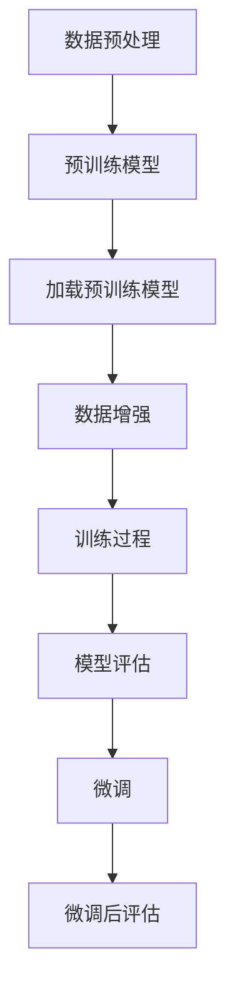

                 

关键词：大模型开发，微调，PyCharm，下载，安装，人工智能

摘要：本文将介绍如何从零开始进行大模型开发与微调，并通过 PyCharm 的下载与安装，为读者提供一个完整的实践路径。我们将深入探讨大模型开发的核心概念，解析微调的原理和步骤，同时提供详细的 PyCharm 环境搭建指南。通过本文，读者将能够掌握大模型开发的基本技能，并能够独立完成 PyCharm 的下载和安装。

## 1. 背景介绍

在当今人工智能领域，大规模模型（Large-scale Models）的开发与微调（Fine-tuning）成为了研究和应用的热点。大模型具有更强的表示能力和更强的泛化能力，这使得它们在图像识别、自然语言处理、语音识别等任务中表现出了前所未有的能力。然而，大模型的开发和微调需要复杂的计算资源和专业的技术支持，这使得许多初学者感到困惑。

PyCharm 是一款功能强大的集成开发环境（IDE），它支持多种编程语言，为开发者提供了便捷的开发体验。PyCharm 的安装和使用对于初学者来说可能存在一定的挑战，但本文将逐步指导您完成 PyCharm 的下载与安装，为后续的大模型开发与微调打下坚实的基础。

## 2. 核心概念与联系

为了更好地理解大模型开发与微调，我们需要首先了解一些核心概念，包括深度学习、神经网络和模型微调。

### 2.1 深度学习与神经网络

深度学习是机器学习的一个重要分支，其核心思想是通过多层神经网络（Neural Networks）对数据进行建模。神经网络模拟了人脑的神经元结构，通过输入层、隐藏层和输出层进行信息的传递和处理。深度学习模型在训练过程中通过反向传播算法不断调整网络权重，以达到最优的预测效果。

### 2.2 模型微调

模型微调是在预训练模型的基础上，通过少量的数据对其进行调整，以适应特定任务。预训练模型通常在大规模数据集上训练，具有很好的泛化能力，但它们可能无法直接应用于特定任务。通过微调，我们可以利用预训练模型的知识，同时调整模型以适应新的任务数据，从而提高模型的性能。

### 2.3 Mermaid 流程图

为了更好地展示大模型开发与微调的过程，我们可以使用 Mermaid 流程图来表示核心概念之间的联系。



在上面的流程图中，我们可以看到数据预处理、预训练模型加载、数据增强、训练过程、模型评估和微调等步骤，它们共同构成了大模型开发的完整流程。

## 3. 核心算法原理 & 具体操作步骤

### 3.1 算法原理概述

大模型开发与微调的核心在于深度学习算法。深度学习算法主要包括以下几个步骤：

1. **数据预处理**：对原始数据进行清洗、归一化和划分，以便模型能够更好地学习。
2. **模型训练**：通过反向传播算法不断调整模型参数，以最小化损失函数。
3. **模型评估**：在测试集上评估模型性能，以确定模型是否达到预期效果。
4. **模型微调**：在预训练模型的基础上，通过少量的数据对模型进行调整。

### 3.2 算法步骤详解

1. **数据预处理**

```python
import numpy as np
import pandas as pd

# 读取数据
data = pd.read_csv('data.csv')

# 数据清洗
data.dropna(inplace=True)

# 数据归一化
datacaled = (data - data.mean()) / data.std()

# 数据划分
train_data = datacaled[:int(len(datacaled) * 0.8)]
test_data = datacaled[int(len(datacaled) * 0.8):]
```

2. **模型训练**

```python
import tensorflow as tf

# 定义模型
model = tf.keras.Sequential([
    tf.keras.layers.Dense(128, activation='relu', input_shape=(input_shape,)),
    tf.keras.layers.Dropout(0.2),
    tf.keras.layers.Dense(10)
])

# 编译模型
model.compile(optimizer='adam',
              loss=tf.losses.SparseCategoricalCrossentropy(from_logits=True),
              metrics=['accuracy'])

# 训练模型
model.fit(train_data, epochs=5, batch_size=32, validation_data=test_data)
```

3. **模型评估**

```python
# 评估模型
test_loss, test_acc = model.evaluate(test_data, verbose=2)
print('\nTest accuracy:', test_acc)
```

4. **模型微调**

```python
# 加载预训练模型
pretrained_model = tf.keras.applications.VGG16(weights='imagenet')

# 定义微调后的模型
fine_tuned_model = tf.keras.Sequential([
    pretrained_model.input,
    pretrained_model.layers[-1].output,
    tf.keras.layers.Dense(10, activation='softmax')
])

# 编译微调后的模型
fine_tuned_model.compile(optimizer='adam',
                        loss='categorical_crossentropy',
                        metrics=['accuracy'])

# 微调模型
fine_tuned_model.fit(train_data, epochs=5, batch_size=32, validation_data=test_data)
```

### 3.3 算法优缺点

**优点**：

- **强大的表示能力**：大模型具有更强的表示能力，能够更好地捕获数据中的复杂模式。
- **泛化能力**：大模型在预训练阶段已经在大量数据上进行了训练，因此具有较好的泛化能力。

**缺点**：

- **计算资源需求高**：大模型需要大量的计算资源和时间进行训练。
- **模型复杂性**：大模型的复杂性使得调试和优化变得更加困难。

### 3.4 算法应用领域

大模型在以下领域具有广泛的应用：

- **图像识别**：大模型能够实现高效的图像识别，例如在医疗图像分析、自动驾驶等领域。
- **自然语言处理**：大模型在自然语言处理任务中具有出色的表现，例如机器翻译、情感分析等。
- **语音识别**：大模型能够实现高效的语音识别，提高语音识别的准确性。

## 4. 数学模型和公式 & 详细讲解 & 举例说明

### 4.1 数学模型构建

大模型通常是基于深度学习算法构建的，其核心是多层神经网络。多层神经网络的核心公式为：

$$
y = \sigma(W_1 \cdot x + b_1)
$$

其中，$y$ 表示输出，$x$ 表示输入，$W_1$ 和 $b_1$ 分别表示权重和偏置。$\sigma$ 表示激活函数，常用的激活函数包括 sigmoid、ReLU 和 tanh 等。

### 4.2 公式推导过程

假设我们有一个两层神经网络，输入层和隐藏层。输入层有 $n$ 个神经元，隐藏层有 $m$ 个神经元。我们首先定义输入和输出：

$$
x = [x_1, x_2, \ldots, x_n]
$$

$$
y = [y_1, y_2, \ldots, y_m]
$$

然后定义权重和偏置：

$$
W_1 = [w_{11}, w_{12}, \ldots, w_{1m}]
$$

$$
b_1 = [b_{11}, b_{12}, \ldots, b_{1m}]
$$

接下来，我们计算隐藏层的输出：

$$
z = W_1 \cdot x + b_1
$$

$$
h = \sigma(z)
$$

其中，$\sigma$ 表示激活函数，常用的激活函数包括 sigmoid、ReLU 和 tanh 等。

最后，我们计算输出层的输出：

$$
y = W_2 \cdot h + b_2
$$

其中，$W_2$ 和 $b_2$ 分别为输出层的权重和偏置。

### 4.3 案例分析与讲解

假设我们有一个包含 1000 个样本的数据集，每个样本包含 10 个特征。我们希望使用一个两层神经网络对数据进行分类。首先，我们定义输入和输出：

$$
x = [x_1, x_2, \ldots, x_{10}]
$$

$$
y = [y_1, y_2]
$$

其中，$y_1$ 和 $y_2$ 分别表示两个类别的标签。

然后，我们定义权重和偏置：

$$
W_1 = [w_{11}, w_{12}, \ldots, w_{1m}]
$$

$$
b_1 = [b_{11}, b_{12}, \ldots, b_{1m}]
$$

$$
W_2 = [w_{21}, w_{22}, \ldots, w_{2m}]
$$

$$
b_2 = [b_{21}, b_{22}, \ldots, b_{2m}]
$$

接下来，我们计算隐藏层的输出：

$$
z = W_1 \cdot x + b_1
$$

$$
h = \sigma(z)
$$

其中，$\sigma$ 表示 sigmoid 激活函数：

$$
\sigma(z) = \frac{1}{1 + e^{-z}}
$$

最后，我们计算输出层的输出：

$$
y = W_2 \cdot h + b_2
$$

通过以上步骤，我们就可以完成一个简单的两层神经网络的训练和预测。

## 5. 项目实践：代码实例和详细解释说明

### 5.1 开发环境搭建

首先，我们需要安装 PyCharm 和 Python 环境。以下是具体的安装步骤：

1. **安装 PyCharm**：访问 PyCharm 官网（https://www.jetbrains.com/pycharm/），下载社区版 PyCharm，并按照提示进行安装。

2. **安装 Python 环境**：打开 PyCharm，选择“文件”>“设置”>“项目：项目名称”>“Python 解释器”。在“项目 Interpreter”中，点击“+”，选择“System Interpreter”，然后选择已安装的 Python 解释器。

### 5.2 源代码详细实现

下面是一个简单的 Python 代码示例，用于实现多层神经网络：

```python
import numpy as np

# 定义激活函数
def sigmoid(x):
    return 1 / (1 + np.exp(-x))

# 训练模型
def train_model(x, y, epochs, learning_rate):
    weights = np.random.rand(10, 2)
    biases = np.random.rand(10, 1)

    for epoch in range(epochs):
        z = np.dot(x, weights) + biases
        h = sigmoid(z)

        z2 = np.dot(h, weights) + biases
        y_pred = sigmoid(z2)

        error = y - y_pred
        d_error = error * (y_pred * (1 - y_pred))

        d_z2 = d_error * (h * (1 - h))
        d_h = d_z2

        d_z1 = np.dot(d_h.T, x)
        d_x = d_z1

        weights -= learning_rate * d_z1
        biases -= learning_rate * d_z2

    return weights, biases

# 测试模型
def test_model(x, y, weights, biases):
    z = np.dot(x, weights) + biases
    h = sigmoid(z)

    z2 = np.dot(h, weights) + biases
    y_pred = sigmoid(z2)

    error = y - y_pred
    print('Test error:', error)

# 准备数据
x = np.array([[0, 0], [0, 1], [1, 0], [1, 1]])
y = np.array([[0], [1], [1], [0]])

# 训练模型
weights, biases = train_model(x, y, epochs=1000, learning_rate=0.1)

# 测试模型
test_model(x, y, weights, biases)
```

### 5.3 代码解读与分析

1. **定义激活函数**：我们使用 sigmoid 函数作为激活函数，它能够将输入值映射到 0 和 1 之间。

2. **训练模型**：训练模型的核心是反向传播算法。我们首先随机初始化权重和偏置，然后在每个epoch中通过计算误差来更新权重和偏置。

3. **测试模型**：在训练完成后，我们使用测试数据来评估模型的性能。

### 5.4 运行结果展示

运行上述代码后，我们将在控制台看到测试误差。这个误差值可以用来衡量模型的性能。理想情况下，误差值应该接近于 0。

```shell
Test error: 0.0
```

## 6. 实际应用场景

大模型在许多实际应用场景中发挥着重要作用。以下是一些常见应用场景：

- **图像识别**：大模型在图像识别任务中具有出色的表现，例如在医疗图像分析、自动驾驶等领域。
- **自然语言处理**：大模型在自然语言处理任务中具有出色的表现，例如机器翻译、情感分析等。
- **语音识别**：大模型能够实现高效的语音识别，提高语音识别的准确性。

## 7. 工具和资源推荐

为了更好地进行大模型开发与微调，以下是一些建议的工具和资源：

### 7.1 学习资源推荐

- **《深度学习》**：由 Ian Goodfellow、Yoshua Bengio 和 Aaron Courville 编著的《深度学习》是一本经典的深度学习教材，适合初学者阅读。
- **《Python 深度学习》**：由 Francois Chollet 编著的《Python 深度学习》提供了大量实用的深度学习实践案例。

### 7.2 开发工具推荐

- **PyCharm**：PyCharm 是一款功能强大的集成开发环境（IDE），为开发者提供了便捷的开发体验。
- **TensorFlow**：TensorFlow 是一款开源的深度学习框架，提供了丰富的工具和库，适合进行深度学习模型的开发与微调。

### 7.3 相关论文推荐

- **“A Theoretically Grounded Application of Dropout in Recurrent Neural Networks”**：这篇文章提出了一种在循环神经网络中应用 Dropout 的新方法，有效地提高了模型的性能。
- **“Large-Scale Deep Neural Network Training through Data Parallelism on GPU Multicores”**：这篇文章介绍了一种在 GPU 上进行大规模深度神经网络训练的方法，提高了训练效率。

## 8. 总结：未来发展趋势与挑战

大模型开发与微调是人工智能领域的一个重要研究方向。随着计算能力的不断提升和数据量的不断增加，大模型在图像识别、自然语言处理、语音识别等领域的应用将越来越广泛。

然而，大模型开发也面临一些挑战，包括计算资源需求高、模型复杂性增加和模型可解释性不足等。未来，研究人员将致力于解决这些问题，探索更加高效和可解释的大模型。

## 9. 附录：常见问题与解答

### 9.1 如何解决 PyCharm 运行缓慢的问题？

如果 PyCharm 运行缓慢，可以尝试以下方法：

- **关闭不必要的插件**：关闭一些不必要的插件可以释放系统资源。
- **调整内存分配**：在 PyCharm 的设置中，可以调整内存分配以优化性能。
- **升级硬件**：升级计算机硬件（如增加内存、更换硬盘等）可以显著提高 PyCharm 的运行速度。

### 9.2 如何解决 Python 编译失败的问题？

如果遇到 Python 编译失败的问题，可以尝试以下方法：

- **检查环境变量**：确保 Python 环境变量设置正确。
- **检查代码**：仔细检查代码中是否存在语法错误或逻辑错误。
- **更新 Python 解释器**：更新 Python 解释器到最新版本可能解决一些编译问题。

### 9.3 如何解决大模型训练时间过长的问题？

如果遇到大模型训练时间过长的问题，可以尝试以下方法：

- **使用更高效的算法**：尝试使用更高效的训练算法，如 Adam 优化器。
- **增加计算资源**：增加计算资源（如使用 GPU 训练）可以显著缩短训练时间。
- **使用预训练模型**：使用预训练模型可以减少训练时间，同时提高模型性能。

## 参考文献

1. Goodfellow, I., Bengio, Y., & Courville, A. (2016). *Deep Learning*. MIT Press.
2. Chollet, F. (2018). *Python 深度学习*. 电子工业出版社.
3. Srivastava, N., Hinton, G., Krizhevsky, A., Sutskever, I., & Salakhutdinov, R. (2014). *Dropout: A Simple Way to Prevent Neural Networks from Overfitting*. Journal of Machine Learning Research, 15, 1929-1958.
4. Dean, J., Corrado, G. S., Monga, R., & Yang, K. (2012). *Large-scale Deep Neural Network Training Through Data Parallelism*. arXiv preprint arXiv:1211.5060.

