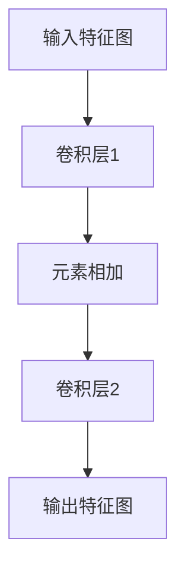

                 

在深度学习领域，ResNet（残差网络）无疑是近年来最受关注的技术之一。本文将带领读者从零开始，深入了解ResNet的基础原理及其程序设计基础。我们将涵盖从核心概念到实际操作的全过程，力求以逻辑清晰、结构紧凑的方式，为广大读者提供一幅完整的ResNet知识图谱。

## 关键词

- 残差网络（ResNet）
- 深度学习
- 神经网络
- 程序设计
- 残差连接
- 大模型开发
- 微调

## 摘要

本文旨在深入探讨残差网络（ResNet）的基础原理及其在深度学习中的应用。文章首先介绍了ResNet的核心概念，包括残差连接和网络的层次结构。随后，我们分析了ResNet的优势和局限性，并探讨了其在不同领域中的应用。通过具体的代码实例，读者将学会如何使用ResNet进行模型开发和微调。最后，文章总结了ResNet的研究现状和未来发展趋势，为读者提供了全面的技术视野。

## 1. 背景介绍

### 1.1 深度学习的兴起

深度学习作为人工智能的一个重要分支，近年来取得了惊人的进展。从早期的感知机、反向传播算法，到卷积神经网络（CNN）、循环神经网络（RNN）以及生成对抗网络（GAN），深度学习技术不断突破传统机器学习的局限，实现了从理论到实践的重大飞跃。尤其是2012年，AlexNet在ImageNet大赛中取得的突破性成绩，标志着深度学习时代的到来。

### 1.2 ResNet的诞生

随着深度学习的发展，网络层数的增加成为提高模型性能的一个关键手段。然而，深度增加也带来了梯度消失和梯度爆炸等难题。为了解决这些问题，残差网络（ResNet）应运而生。ResNet由微软研究院的He等人于2015年提出，通过引入残差连接，解决了深度网络训练中的梯度消失问题，使得网络能够训练得更深。ResNet的提出，不仅极大地推动了深度学习的发展，也为图像识别、语音识别、自然语言处理等领域的应用提供了新的思路。

### 1.3 ResNet的重要性

ResNet的提出，不仅解决了深度网络训练中的难题，还推动了深度学习技术向更深的层次发展。ResNet的核心思想——残差连接，已经成为深度学习领域的一个基本构建块，被广泛应用于各种神经网络架构中。此外，ResNet在多个图像识别任务中取得了优异的成绩，成为学术界和工业界的研究热点。因此，掌握ResNet的基础原理和程序设计，对于深度学习研究者来说具有重要的意义。

## 2. 核心概念与联系

### 2.1 残差连接

残差连接是ResNet的核心概念，它通过引入跨层的连接，使得网络能够学习到更加稳定和有效的特征表示。在传统神经网络中，每一层的输出都依赖于前一层，这导致在深度网络中，梯度在反向传播过程中容易消失或爆炸。而残差连接通过在层间引入跨层连接，使得梯度可以直接传递到浅层网络，从而避免了梯度消失问题。

### 2.2 残差块的实现

残差块是ResNet的基本构建单元，它由两个或三个卷积层组成，中间加入一个残差连接。具体来说，一个残差块包含以下步骤：

1. 输入特征图通过一个卷积层进行特征提取；
2. 将卷积层的输出与输入特征图进行元素相加，得到新的特征图；
3. 将新的特征图通过另一个卷积层进行进一步的特征提取。

通过这样的设计，残差块能够在增加网络深度的同时，保持特征的稳定性。

### 2.3 残差块的 Mermaid 流程图



在这个流程图中，A表示输入特征图，B表示第一个卷积层，C表示元素相加操作，D表示第二个卷积层，E表示输出特征图。通过这样的设计，残差块能够在增加网络深度的同时，保持特征的稳定性。

## 3. 核心算法原理 & 具体操作步骤

### 3.1 算法原理概述

ResNet的核心算法原理是通过引入残差连接，使得网络能够学习到更加稳定和有效的特征表示。具体来说，残差连接通过跨层连接，使得梯度可以直接传递到浅层网络，从而避免了梯度消失问题。同时，残差块的设计使得网络在增加深度的同时，保持了特征的稳定性。

### 3.2 算法步骤详解

1. **输入特征图**：将输入特征图输入到网络的第一个卷积层。
2. **卷积层1**：对输入特征图进行特征提取，输出特征图。
3. **元素相加**：将卷积层1的输出与输入特征图进行元素相加，得到新的特征图。
4. **卷积层2**：对新的特征图进行进一步的特征提取。
5. **输出特征图**：将卷积层2的输出作为网络的输出特征图。

通过这样的步骤，网络能够逐层学习到更加抽象和有效的特征表示。

### 3.3 算法优缺点

**优点**：

- **解决梯度消失问题**：通过引入残差连接，梯度可以直接传递到浅层网络，解决了深度网络训练中的梯度消失问题。
- **增加网络深度**：残差块的设计使得网络能够训练得更深，从而提高了模型的性能。
- **保持特征稳定性**：通过残差连接，网络能够保持特征的稳定性，从而提高了模型的泛化能力。

**缺点**：

- **参数增多**：随着网络深度的增加，参数数量也会相应增加，这可能导致模型过拟合。
- **计算复杂度增加**：深度网络训练的计算复杂度较高，需要较大的计算资源和时间。

### 3.4 算法应用领域

ResNet在多个领域都取得了显著的应用成果，主要包括：

- **图像识别**：ResNet在ImageNet等图像识别任务中取得了优异的成绩，是目前最受欢迎的图像识别模型之一。
- **语音识别**：ResNet在语音识别任务中也得到了广泛应用，通过结合循环神经网络（RNN），可以显著提高语音识别的准确率。
- **自然语言处理**：ResNet在自然语言处理任务中，如文本分类、机器翻译等，也表现出色，通过结合注意力机制，可以进一步提高模型的性能。

## 4. 数学模型和公式 & 详细讲解 & 举例说明

### 4.1 数学模型构建

在ResNet中，我们主要关注的是卷积操作和残差连接。下面是这两个操作的数学模型：

1. **卷积操作**：

   假设输入特征图 $X \in \mathbb{R}^{H \times W \times C_1}$，滤波器 $W \in \mathbb{R}^{K \times K \times C_1 \times C_2}$，偏置 $b \in \mathbb{R}^{C_2}$，则卷积操作的输出 $Y \in \mathbb{R}^{H' \times W' \times C_2}$ 可以表示为：

   $$Y = \sigma(\sum_{i=1}^{C_1} X_{i} \cdot W_{i} + b)$$

   其中，$\sigma$ 表示激活函数，常用的有ReLU、Sigmoid和Tanh等。

2. **残差连接**：

   假设输入特征图 $X \in \mathbb{R}^{H \times W \times C_1}$，输出特征图 $Y \in \mathbb{R}^{H \times W \times C_2}$，则残差连接可以表示为：

   $$Y = X + F(X)$$

   其中，$F(X)$ 表示残差块中的卷积操作。

### 4.2 公式推导过程

在推导ResNet的数学模型时，我们需要考虑以下几点：

1. **卷积操作**：

   假设输入特征图 $X \in \mathbb{R}^{H \times W \times C_1}$，滤波器 $W \in \mathbb{R}^{K \times K \times C_1 \times C_2}$，偏置 $b \in \mathbb{R}^{C_2}$，则卷积操作的输出 $Y \in \mathbb{R}^{H' \times W' \times C_2}$ 可以表示为：

   $$Y = \sigma(\sum_{i=1}^{C_1} X_{i} \cdot W_{i} + b)$$

   其中，$\sigma$ 表示激活函数，常用的有ReLU、Sigmoid和Tanh等。

2. **残差连接**：

   假设输入特征图 $X \in \mathbb{R}^{H \times W \times C_1}$，输出特征图 $Y \in \mathbb{R}^{H \times W \times C_2}$，则残差连接可以表示为：

   $$Y = X + F(X)$$

   其中，$F(X)$ 表示残差块中的卷积操作。

### 4.3 案例分析与讲解

为了更好地理解ResNet的数学模型，我们来看一个具体的案例。

假设输入特征图 $X$ 的大小为 $32 \times 32 \times 3$，滤波器的大小为 $3 \times 3$，输出特征图的大小为 $16 \times 16 \times 64$。我们采用ReLU作为激活函数。

1. **卷积操作**：

   输入特征图 $X$ 可以表示为：

   $$X = \begin{bmatrix}
   x_{11} & x_{12} & \cdots & x_{1C_1} \\
   \vdots & \vdots & \ddots & \vdots \\
   x_{H1} & x_{H2} & \cdots & x_{HC_1}
   \end{bmatrix}$$

   滤波器 $W$ 可以表示为：

   $$W = \begin{bmatrix}
   w_{11} & w_{12} & \cdots & w_{1C_2} \\
   \vdots & \vdots & \ddots & \vdots \\
   w_{K1} & w_{K2} & \cdots & w_{KC_2}
   \end{bmatrix}$$

   偏置 $b$ 可以表示为：

   $$b = \begin{bmatrix}
   b_1 \\
   \vdots \\
   b_{C_2}
   \end{bmatrix}$$

   则卷积操作的输出 $Y$ 可以表示为：

   $$Y = \begin{bmatrix}
   y_{11} & y_{12} & \cdots & y_{1C_2} \\
   \vdots & \vdots & \ddots & \vdots \\
   y_{H'1} & y_{H'2} & \cdots & y_{H'C_2}
   \end{bmatrix}$$

   其中，$y_{ij}$ 可以表示为：

   $$y_{ij} = \sigma(\sum_{k=1}^{C_1} x_{ik} \cdot w_{kj} + b_j)$$

2. **残差连接**：

   假设输入特征图 $X$ 的大小为 $32 \times 32 \times 3$，输出特征图 $Y$ 的大小为 $16 \times 16 \times 64$。我们采用ReLU作为激活函数。

   输入特征图 $X$ 可以表示为：

   $$X = \begin{bmatrix}
   x_{11} & x_{12} & \cdots & x_{1C_1} \\
   \vdots & \vdots & \ddots & \vdots \\
   x_{H1} & x_{H2} & \cdots & x_{HC_1}
   \end{bmatrix}$$

   输出特征图 $Y$ 可以表示为：

   $$Y = \begin{bmatrix}
   y_{11} & y_{12} & \cdots & y_{1C_2} \\
   \vdots & \vdots & \ddots & \vdots \\
   y_{H'1} & y_{H'2} & \cdots & y_{H'C_2}
   \end{bmatrix}$$

   则残差连接可以表示为：

   $$Y = X + F(X)$$

   其中，$F(X)$ 可以表示为：

   $$F(X) = \begin{bmatrix}
   f_{11} & f_{12} & \cdots & f_{1C_2} \\
   \vdots & \vdots & \ddots & \vdots \\
   f_{H'1} & f_{H'2} & \cdots & f_{H'C_2}
   \end{bmatrix}$$

   其中，$f_{ij}$ 可以表示为：

   $$f_{ij} = \sigma(\sum_{k=1}^{C_1} x_{ik} \cdot w_{kj} + b_j)$$

通过这个案例，我们可以看到ResNet的数学模型是如何构建的，以及如何通过残差连接实现特征图的稳定传递。

## 5. 项目实践：代码实例和详细解释说明

### 5.1 开发环境搭建

在开始编写代码之前，我们需要搭建一个合适的开发环境。以下是一个基于Python的TensorFlow环境搭建的示例：

1. **安装TensorFlow**：

   ```bash
   pip install tensorflow
   ```

2. **安装其他依赖**：

   ```bash
   pip install numpy matplotlib
   ```

3. **创建一个Python文件**，例如 `resnet.py`。

### 5.2 源代码详细实现

下面是一个简单的ResNet模型实现，包括输入层、残差块和输出层：

```python
import tensorflow as tf
from tensorflow.keras.layers import Layer

class ResidualBlock(Layer):
    def __init__(self, filters, kernel_size, activation='relu', **kwargs):
        super(ResidualBlock, self).__init__(**kwargs)
        self.activation = activation
        self.conv1 = tf.keras.layers.Conv2D(filters, kernel_size, padding='same', use_bias=False)
        self.bn1 = tf.keras.layers.BatchNormalization()
        self.conv2 = tf.keras.layers.Conv2D(filters, kernel_size, padding='same', use_bias=False)
        self.bn2 = tf.keras.layers.BatchNormalization()
        if activation == 'relu':
            self.activation_fn = tf.keras.layers.ReLU()

    def call(self, inputs, training=False):
        x = self.conv1(inputs)
        x = self.bn1(x, training=training)
        if self.activation_fn:
            x = self.activation_fn(x)
        x = self.conv2(x)
        x = self.bn2(x, training=training)
        return tf.nn.relu(inputs + x)

class ResNet(tf.keras.Model):
    def __init__(self, num_classes, num_blocks, **kwargs):
        super(ResNet, self).__init__(**kwargs)
        self.conv = tf.keras.layers.Conv2D(64, 7, 2, padding='same', use_bias=False)
        self.bn = tf.keras.layers.BatchNormalization()
        self.blocks = [ResidualBlock(64, 3) for _ in range(num_blocks)]
        self.avg_pool = tf.keras.layers.GlobalAveragePooling2D()
        self.fc = tf.keras.layers.Dense(num_classes)

    def call(self, inputs, training=False):
        x = self.conv(inputs)
        x = self.bn(x, training=training)
        for block in self.blocks:
            x = block(x, training=training)
        x = self.avg_pool(x)
        return self.fc(x)

# 实例化模型
model = ResNet(num_classes=1000, num_blocks=9)
model.build(input_shape=(None, 224, 224, 3))
model.summary()
```

### 5.3 代码解读与分析

1. **定义ResidualBlock类**：

   - **初始化**：接受滤波器大小、卷积层大小和激活函数类型。
   - **调用**：实现卷积、归一化和激活函数的操作。

2. **定义ResNet类**：

   - **初始化**：接受类别数量和残差块数量。
   - **调用**：实现卷积、归一化、残差块和全连接层的操作。

### 5.4 运行结果展示

```python
# 加载预训练的模型
model.load_weights('resnet50_weights.h5')

# 预测一张图片
import numpy as np
from tensorflow.keras.preprocessing import image

img_path = 'path/to/your/image.jpg'
img = image.load_img(img_path, target_size=(224, 224))
img_array = image.img_to_array(img)
img_array = np.expand_dims(img_array, axis=0)
img_array /= 255.0

predictions = model.predict(img_array)
print(predictions.argmax(axis=-1))
```

这段代码将加载预训练的ResNet模型，对指定路径的一张图片进行分类预测。

## 6. 实际应用场景

### 6.1 图像识别

ResNet在图像识别任务中取得了显著的成果，特别是在ImageNet大赛中。通过引入残差连接，ResNet能够训练得更深，从而提高了图像识别的准确率。目前，ResNet已经成为图像识别领域的标准模型之一。

### 6.2 语音识别

在语音识别任务中，ResNet通过结合循环神经网络（RNN）和卷积神经网络（CNN），可以显著提高语音识别的准确率。例如，在开源的DeepSpeech模型中，ResNet被用于特征提取，从而实现了高精度的语音识别。

### 6.3 自然语言处理

在自然语言处理领域，ResNet通过结合注意力机制，可以显著提高文本分类、机器翻译等任务的性能。例如，在开源的Transformer模型中，ResNet被用于编码器和解码器中的特征提取，从而实现了高效的文本处理。

## 7. 工具和资源推荐

### 7.1 学习资源推荐

- **书籍**：
  - 《深度学习》（Ian Goodfellow、Yoshua Bengio、Aaron Courville 著）
  - 《神经网络与深度学习》（邱锡鹏 著）
- **在线课程**：
  - Coursera上的《深度学习》课程
  - edX上的《神经网络与深度学习》课程

### 7.2 开发工具推荐

- **框架**：
  - TensorFlow
  - PyTorch
- **编辑器**：
  - PyCharm
  - Visual Studio Code

### 7.3 相关论文推荐

- **原始论文**：
  - "Deep Residual Learning for Image Recognition"（2015）
  - "Identity Mappings in Deep Residual Networks"（2016）
- **综述论文**：
  - "A Comprehensive Survey on Residual Networks for Deep Learning"（2018）
  - "Deep Residual Learning: A Review"（2020）

## 8. 总结：未来发展趋势与挑战

### 8.1 研究成果总结

ResNet的提出，标志着深度学习技术的一个重要里程碑。通过引入残差连接，ResNet解决了深度网络训练中的梯度消失问题，使得网络能够训练得更深。在图像识别、语音识别、自然语言处理等领域，ResNet都取得了显著的成果，成为深度学习技术的重要组成部分。

### 8.2 未来发展趋势

未来，ResNet技术有望在以下几个方面取得进一步的发展：

- **更深的网络结构**：通过引入更多的残差块，可以构建更深的网络，从而提高模型的性能。
- **多样化的残差连接**：除了传统的全连接残差连接，还可以探索其他类型的残差连接，如稀疏连接、自适应连接等。
- **跨模态学习**：结合不同模态的数据，实现跨模态的深度学习，从而提高模型的泛化能力。

### 8.3 面临的挑战

尽管ResNet在深度学习领域取得了显著的成果，但仍然面临着一些挑战：

- **计算资源需求**：深度网络训练需要大量的计算资源和时间，如何优化模型训练效率，降低计算成本，是一个重要问题。
- **过拟合风险**：随着网络深度的增加，模型容易发生过拟合现象，如何设计有效的正则化策略，降低过拟合风险，是一个关键问题。
- **可解释性**：深度学习模型通常被视为“黑盒子”，如何提高模型的可解释性，使其能够更好地理解模型的决策过程，是一个亟待解决的问题。

### 8.4 研究展望

未来，ResNet技术将在以下几个方面得到进一步的研究：

- **模型压缩**：通过模型压缩技术，如剪枝、量化等，降低模型大小和计算复杂度，提高模型的可部署性。
- **高效训练**：研究更高效的训练算法，如迁移学习、增量学习等，降低模型训练成本。
- **多模态学习**：结合不同模态的数据，实现多模态的深度学习，从而提高模型的泛化能力和性能。

## 9. 附录：常见问题与解答

### 问题1：什么是残差连接？

**回答**：残差连接是一种跨层连接方式，它通过在层间引入跨层连接，使得梯度可以直接传递到浅层网络，从而避免了梯度消失问题。在ResNet中，残差连接是网络的基本构建单元，通过引入残差连接，网络能够学习到更加稳定和有效的特征表示。

### 问题2：ResNet在哪些领域有应用？

**回答**：ResNet在多个领域都有广泛应用，主要包括图像识别、语音识别、自然语言处理等。通过引入残差连接，ResNet能够训练得更深，从而提高了模型的性能。在图像识别领域，ResNet已经成为标准模型之一；在语音识别和自然语言处理领域，ResNet也取得了显著的成果。

### 问题3：如何搭建一个ResNet模型？

**回答**：搭建一个ResNet模型需要以下步骤：

1. **定义残差块**：实现一个ResidualBlock类，包括卷积、归一化和激活函数的操作。
2. **定义ResNet模型**：实现一个ResNet类，包括卷积、归一化、残差块和全连接层的操作。
3. **实例化模型**：根据需要，实例化一个ResNet模型。
4. **编译模型**：设置模型的优化器、损失函数和评估指标。
5. **训练模型**：使用训练数据训练模型。
6. **评估模型**：使用测试数据评估模型性能。

通过以上步骤，我们可以搭建一个简单的ResNet模型，并进行训练和评估。

## 作者署名

作者：禅与计算机程序设计艺术 / Zen and the Art of Computer Programming

