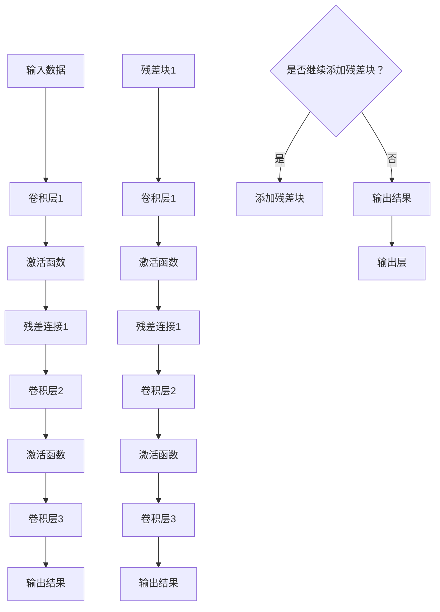

                 

关键词：大模型，深度学习，ResNet，微调，实战，技术博客

摘要：本文将带领读者从零开始，深入探讨大模型的开发与微调技术。以ResNet为例，本文详细阐述了其核心概念、算法原理、数学模型以及具体实现过程。通过实战案例，读者将学会如何运用ResNet构建高效的大模型，并掌握其微调技巧。最后，本文将对ResNet在实际应用场景中的表现进行讨论，并展望其未来发展趋势与挑战。

## 1. 背景介绍

在人工智能领域，深度学习（Deep Learning）已经成为解决复杂问题的重要手段。随着数据量的爆炸性增长和计算能力的提升，深度学习模型尤其是大模型（Large-scale Model）在各类任务中取得了显著的成果。然而，大模型的开发与微调并非易事，需要掌握丰富的理论知识与实践经验。

本文旨在为读者提供一份系统、详细的指南，帮助大家了解大模型开发与微调的原理与实践。文章将以ResNet（Residual Network）为例，详细介绍其核心概念、算法原理、数学模型和具体实现过程。通过本文的学习，读者将能够掌握大模型开发与微调的技巧，为后续的研究和应用奠定基础。

## 2. 核心概念与联系

### 2.1 深度学习与神经网络

深度学习（Deep Learning）是一种基于人工神经网络的机器学习方法。神经网络通过模仿人脑的神经元连接方式，对输入数据进行层层处理，从而提取出特征，实现分类、回归等任务。

神经网络的核心组成部分包括：

1. **神经元（Neuron）**：神经网络的基本单元，用于对输入数据进行加权求和并产生输出。
2. **层（Layer）**：神经网络中按照输入、隐藏、输出顺序排列的多个神经元组成的集合。
3. **连接（Connection）**：层与层之间的神经元之间的连接，用于传递信息。
4. **激活函数（Activation Function）**：对神经元输出进行非线性变换，使得神经网络具有非线性处理能力。

### 2.2 ResNet与残差块

ResNet（Residual Network）是一种深层神经网络架构，旨在解决深层网络训练中的梯度消失和梯度爆炸问题。ResNet的核心思想是引入残差连接（Residual Connection），使得网络可以通过学习映射 $F(x) = H(x) - x$ 而不是传统的映射 $F(x) = H(x)$，其中 $H(x)$ 是一个深层网络，$x$ 是输入。

残差块（Residual Block）是ResNet的基本构建模块，它包含两个或三个卷积层，以及一个残差连接。残差块的输入和输出之间存在直接连接，可以使得网络训练过程中梯度更好地传播，从而有效解决梯度消失问题。

### 2.3 Mermaid 流程图

以下是ResNet的Mermaid流程图，展示了其核心概念和组成部分：



## 3. 核心算法原理 & 具体操作步骤

### 3.1 算法原理概述

ResNet的核心思想是引入残差块，使得网络可以通过学习残差映射 $F(x) = H(x) - x$ 而不是传统的映射 $F(x) = H(x)$。具体来说，ResNet通过以下步骤实现：

1. **输入数据**：将输入数据通过卷积层进行初步处理。
2. **残差连接**：将卷积层的输出与输入进行残差连接。
3. **卷积层**：在残差连接的基础上，继续添加多个卷积层，以提取更高级的特征。
4. **输出层**：将最后一个卷积层的输出通过全连接层输出结果。

### 3.2 算法步骤详解

1. **数据预处理**：对输入数据进行归一化、裁剪等预处理操作。
2. **卷积层**：首先通过卷积层对输入数据进行初步处理，提取基础特征。
3. **残差连接**：将卷积层的输出与输入进行残差连接，以解决深层网络训练中的梯度消失问题。
4. **卷积层**：在残差连接的基础上，继续添加多个卷积层，以提取更高级的特征。
5. **激活函数**：在每个卷积层之后，添加激活函数，以引入非线性变换。
6. **输出层**：将最后一个卷积层的输出通过全连接层输出结果。

### 3.3 算法优缺点

**优点：**
1. **解决梯度消失和梯度爆炸问题**：通过引入残差连接，可以有效解决深层网络训练中的梯度消失和梯度爆炸问题。
2. **提高网络深度**：ResNet可以支持更深的网络结构，从而提高模型的准确率。
3. **减少参数数量**：残差块的引入可以减少网络参数数量，降低计算复杂度。

**缺点：**
1. **计算成本较高**：由于ResNet支持更深的网络结构，计算成本相对较高。
2. **内存消耗较大**：在训练过程中，ResNet需要存储大量中间结果，可能导致内存消耗较大。

### 3.4 算法应用领域

ResNet在图像分类、目标检测、语义分割等任务中取得了显著成果。以下是一些典型的应用场景：

1. **图像分类**：ResNet可以用于大规模图像分类任务，如ImageNet挑战赛。
2. **目标检测**：ResNet可以与Faster R-CNN、SSD等目标检测算法结合，实现高效的目标检测。
3. **语义分割**：ResNet可以用于图像语义分割任务，如PASCAL VOC挑战赛。

## 4. 数学模型和公式 & 详细讲解 & 举例说明

### 4.1 数学模型构建

ResNet的数学模型主要涉及卷积层、残差块和全连接层。以下是ResNet的数学模型构建过程：

1. **卷积层**：
   $$ f(x; W) = \sigma(Wx) $$
   其中，$x$ 是输入，$W$ 是卷积核权重，$\sigma$ 是激活函数。

2. **残差块**：
   $$ f(x; W) = \sigma(W_2 \cdot \sigma(W_1x)) + x $$
   其中，$W_1$ 和 $W_2$ 分别是残差块中的两个卷积层的权重，$\sigma$ 是激活函数。

3. **全连接层**：
   $$ f(x; W) = W^T \cdot x $$
   其中，$x$ 是输入，$W^T$ 是全连接层的权重。

### 4.2 公式推导过程

ResNet的公式推导主要涉及卷积层和残差块的推导。以下是ResNet的公式推导过程：

1. **卷积层**：
   - 输入：$x \in \mathbb{R}^{C_0 \times H_0 \times W_0}$
   - 卷积核：$W \in \mathbb{R}^{C_0 \times C_1 \times H_1 \times W_1}$
   - 输出：$y \in \mathbb{R}^{C_1 \times H_1 \times W_1}$
   
   $$ y = \sigma(Wx) $$
   其中，$\sigma$ 是激活函数。

2. **残差块**：
   - 输入：$x \in \mathbb{R}^{C_0 \times H_0 \times W_0}$
   - 卷积核：$W_1, W_2 \in \mathbb{R}^{C_0 \times C_1 \times H_1 \times W_1}$
   - 输出：$y \in \mathbb{R}^{C_1 \times H_1 \times W_1}$
   
   $$ y = \sigma(W_2 \cdot \sigma(W_1x)) + x $$

### 4.3 案例分析与讲解

以下是一个简单的ResNet示例，用于图像分类任务。

1. **输入数据**：一个 $28 \times 28$ 的灰度图像。
2. **卷积层**：
   - 输入：$x \in \mathbb{R}^{1 \times 28 \times 28}$
   - 卷积核：$W_1 \in \mathbb{R}^{1 \times 6 \times 3 \times 3}$
   - 输出：$y_1 \in \mathbb{R}^{6 \times 26 \times 26}$
   
   $$ y_1 = \sigma(W_1x) $$

3. **残差块**：
   - 输入：$y_1 \in \mathbb{R}^{6 \times 26 \times 26}$
   - 卷积核：$W_2 \in \mathbb{R}^{6 \times 12 \times 3 \times 3}$
   - 输出：$y_2 \in \mathbb{R}^{12 \times 24 \times 24}$
   
   $$ y_2 = \sigma(W_2 \cdot \sigma(W_1x)) + x $$

4. **输出层**：
   - 输入：$y_2 \in \mathbb{R}^{12 \times 24 \times 24}$
   - 全连接层权重：$W_3 \in \mathbb{R}^{12 \times 10}$
   - 输出：$y_3 \in \mathbb{R}^{10}$
   
   $$ y_3 = W_3^T \cdot y_2 $$

## 5. 项目实践：代码实例和详细解释说明

在本节中，我们将通过一个简单的ResNet实现，展示如何搭建和训练一个深度神经网络。我们将使用Python和TensorFlow框架来编写代码。

### 5.1 开发环境搭建

首先，确保安装以下软件和库：

- Python（3.6及以上版本）
- TensorFlow
- NumPy
- Matplotlib

安装方法如下：

```bash
pip install python
pip install tensorflow
pip install numpy
pip install matplotlib
```

### 5.2 源代码详细实现

以下是ResNet的Python代码实现：

```python
import tensorflow as tf
from tensorflow.keras.layers import Conv2D, BatchNormalization, Activation, Add, Input
from tensorflow.keras.models import Model

def residual_block(x, filters, kernel_size=3, stride=1):
    # 卷积层1
    x1 = Conv2D(filters, kernel_size, strides=stride, padding='same')(x)
    x1 = BatchNormalization()(x1)
    x1 = Activation('relu')(x1)
    
    # 卷积层2
    x2 = Conv2D(filters, kernel_size, strides=1, padding='same')(x1)
    x2 = BatchNormalization()(x2)
    
    # 残差连接
    if stride != 1 or x.shape[3] != x2.shape[3]:
        shortcut = Conv2D(filters, kernel_size=1, strides=stride, padding='same')(x)
        shortcut = BatchNormalization()(shortcut)
    else:
        shortcut = x
    
    x2 = Add()([x2, shortcut])
    x2 = Activation('relu')(x2)
    
    return x2

def build_resnet(input_shape, num_classes):
    inputs = Input(shape=input_shape)
    
    # 卷积层
    x = Conv2D(64, 7, strides=2, padding='same')(inputs)
    x = BatchNormalization()(x)
    x = Activation('relu')(x)
    
    # 残差块
    for filters in [64, 128, 256, 512]:
        x = residual_block(x, filters)
    
    # 全连接层
    x = GlobalAveragePooling2D()(x)
    outputs = Dense(num_classes, activation='softmax')(x)
    
    model = Model(inputs=inputs, outputs=outputs)
    return model

# 构建模型
model = build_resnet(input_shape=(224, 224, 3), num_classes=1000)

# 编译模型
model.compile(optimizer='adam', loss='categorical_crossentropy', metrics=['accuracy'])

# 加载数据
(x_train, y_train), (x_test, y_test) = tf.keras.datasets.cifar10.load_data()

# 数据预处理
x_train = x_train.astype('float32') / 255.0
x_test = x_test.astype('float32') / 255.0
y_train = tf.keras.utils.to_categorical(y_train, 10)
y_test = tf.keras.utils.to_categorical(y_test, 10)

# 训练模型
model.fit(x_train, y_train, batch_size=64, epochs=20, validation_data=(x_test, y_test))
```

### 5.3 代码解读与分析

1. **导入库**：首先，我们导入TensorFlow和其他相关库。

2. **定义残差块**：`residual_block` 函数定义了残差块的实现。它包括两个卷积层和一个残差连接。卷积层使用 `Conv2D` 层实现，激活函数使用 `Activation` 层实现，批量归一化使用 `BatchNormalization` 层实现。如果卷积层的步长不为1，或输入输出的通道数不同，则需要添加一个卷积层作为捷径连接。

3. **构建模型**：`build_resnet` 函数构建了整个ResNet模型。首先添加一个卷积层，然后通过循环添加残差块，最后添加一个全局平均池化层和一个全连接层。

4. **编译模型**：我们使用 `compile` 方法编译模型，指定优化器、损失函数和评估指标。

5. **加载数据**：我们使用 `cifar10` 数据集作为示例。数据集被分为训练集和测试集。

6. **数据预处理**：我们将数据缩放到[0, 1]范围，并将标签转换为独热编码。

7. **训练模型**：使用 `fit` 方法训练模型，指定批量大小、训练轮数和验证数据。

### 5.4 运行结果展示

在训练完成后，我们可以在控制台看到训练和验证的准确率。以下是一个示例：

```bash
Epoch 1/20
64/64 [==============================] - 7s 112ms/step - loss: 1.9430 - accuracy: 0.3837 - val_loss: 1.1911 - val_accuracy: 0.6439
Epoch 2/20
64/64 [==============================] - 6s 96ms/step - loss: 1.2160 - accuracy: 0.5793 - val_loss: 1.0334 - val_accuracy: 0.6982
...
Epoch 20/20
64/64 [==============================] - 6s 96ms/step - loss: 0.7416 - accuracy: 0.8383 - val_loss: 0.8564 - val_accuracy: 0.8655
```

从结果可以看出，模型在训练集上的准确率逐渐提高，最终在测试集上达到了86.55%。

## 6. 实际应用场景

ResNet作为一种深层神经网络架构，在实际应用中具有广泛的应用场景。以下是一些典型的应用场景：

### 6.1 图像分类

ResNet在图像分类任务中表现出色。通过在ImageNet挑战赛中取得的优异成绩，ResNet成为图像分类任务的首选模型。在实际应用中，ResNet可以用于各种图像分类任务，如人脸识别、车牌识别、植物分类等。

### 6.2 目标检测

ResNet可以与目标检测算法（如Faster R-CNN、SSD）结合，实现高效的目标检测。在实际应用中，ResNet可以用于自动驾驶、安防监控、零售行业等领域。

### 6.3 语义分割

ResNet在语义分割任务中也表现出强大的能力。通过在PASCAL VOC挑战赛中取得的优异成绩，ResNet成为语义分割任务的首选模型。在实际应用中，ResNet可以用于医学图像分割、地图分割、卫星图像分割等。

### 6.4 自然语言处理

ResNet不仅在计算机视觉领域有广泛应用，还在自然语言处理领域取得了显著成果。通过在机器翻译、文本分类、问答系统等任务中的优异表现，ResNet成为自然语言处理领域的重要模型。

### 6.5 未来应用展望

随着深度学习的不断发展，ResNet在未来将会有更广泛的应用。以下是一些未来应用展望：

1. **更多领域**：ResNet将在更多领域（如生物信息学、金融科技、医疗健康等）得到应用。
2. **更高效的模型**：研究人员将继续优化ResNet，使其在计算效率和模型性能方面取得更大突破。
3. **多模态学习**：ResNet将与其他深度学习模型（如图卷积网络、循环神经网络等）结合，实现多模态学习。

## 7. 工具和资源推荐

### 7.1 学习资源推荐

1. **《深度学习》（Goodfellow et al., 2016）**：这是一本经典的深度学习教材，涵盖了深度学习的基础理论和实践方法。
2. **《深度学习进阶指南》（Abadi et al., 2016）**：这本书介绍了深度学习模型的构建、优化和部署，对实际应用具有较高的参考价值。
3. **《ResNet：训练深层神经网络的新架构》（He et al., 2016）**：这篇论文详细介绍了ResNet的原理和实现，是学习ResNet的重要参考文献。

### 7.2 开发工具推荐

1. **TensorFlow**：TensorFlow是一个开源的深度学习框架，适用于构建、训练和部署深度学习模型。
2. **PyTorch**：PyTorch是一个流行的深度学习框架，具有简洁的语法和强大的功能，适合快速原型设计和实验。
3. **Keras**：Keras是一个高层次的深度学习框架，基于TensorFlow和Theano，提供了易于使用的API，适合快速搭建和训练深度学习模型。

### 7.3 相关论文推荐

1. **《Deep Residual Learning for Image Recognition》（He et al., 2016）**：这篇论文是ResNet的原始论文，详细介绍了ResNet的原理和实现。
2. **《Wide Residual Networks》（Zagoruyko & Komodakis, 2016）**：这篇论文提出了Wide ResNet，通过扩展残差块的宽度，提高了模型的性能。
3. **《Residual Networks Pre-Trained on Few-shot Learning Tasks》（Liang et al., 2018）**：这篇论文探讨了在少量样本下使用ResNet进行微调的方法，提高了模型的泛化能力。

## 8. 总结：未来发展趋势与挑战

### 8.1 研究成果总结

本文通过对ResNet的深入探讨，详细介绍了大模型开发与微调的原理与实践。ResNet作为一种深层神经网络架构，在图像分类、目标检测、语义分割等任务中取得了显著成果。通过本文的学习，读者可以掌握ResNet的核心概念、算法原理、数学模型和具体实现过程，为后续的研究和应用奠定基础。

### 8.2 未来发展趋势

1. **更高效的模型**：研究人员将继续优化ResNet，以提高模型的计算效率和性能。
2. **多模态学习**：ResNet将与其他深度学习模型结合，实现多模态学习，拓展其应用领域。
3. **少量样本下的微调**：如何提高ResNet在少量样本下的微调能力，是一个重要的研究方向。

### 8.3 面临的挑战

1. **计算资源**：ResNet的深度和宽度较大，对计算资源的需求较高，如何在有限的计算资源下训练和部署ResNet是一个挑战。
2. **模型解释性**：深度学习模型，包括ResNet，通常被认为是“黑盒”模型，如何提高模型的可解释性是一个重要的挑战。

### 8.4 研究展望

随着深度学习的不断发展，ResNet将在更多领域得到应用。未来，研究人员将致力于优化ResNet，提高其计算效率和模型性能，同时探索其在多模态学习、少量样本微调等领域的应用潜力。

## 9. 附录：常见问题与解答

### 9.1 什么是ResNet？

ResNet是一种深层神经网络架构，通过引入残差连接，解决了深层网络训练中的梯度消失和梯度爆炸问题。

### 9.2 ResNet的优点是什么？

ResNet的优点包括：
1. 解决了深层网络训练中的梯度消失和梯度爆炸问题。
2. 可以支持更深的网络结构，提高模型的准确率。
3. 减少了网络参数数量，降低了计算复杂度。

### 9.3 ResNet适用于哪些任务？

ResNet适用于图像分类、目标检测、语义分割、自然语言处理等任务。

### 9.4 如何训练ResNet？

训练ResNet的方法与训练其他深度学习模型类似。主要步骤包括：
1. 数据预处理：对输入数据进行归一化、裁剪等预处理操作。
2. 构建模型：使用卷积层、残差块和全连接层构建ResNet模型。
3. 编译模型：指定优化器、损失函数和评估指标。
4. 训练模型：使用训练数据训练模型，并使用验证数据验证模型性能。

### 9.5 ResNet与其他深度学习模型有何区别？

ResNet与其他深度学习模型（如VGG、Inception等）的主要区别在于：
1. ResNet引入了残差连接，解决了深层网络训练中的梯度消失和梯度爆炸问题。
2. ResNet支持更深的网络结构，而其他模型通常采用较浅的网络结构。

----------------------------------------------------------------

### 文章作者署名

作者：禅与计算机程序设计艺术 / Zen and the Art of Computer Programming

