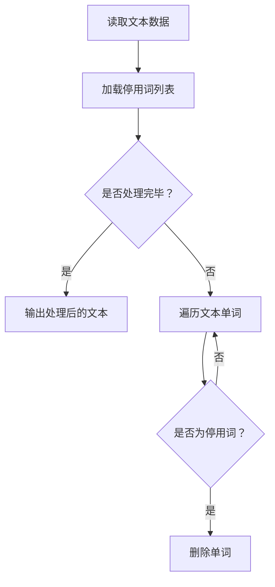

                 

关键词：停用词、大模型、文本处理、自然语言处理、NLP、预处理、语料库、语料清洗、文本分析、算法优化、性能提升

> 摘要：本文深入探讨了在大模型开发与微调过程中，停用词的使用及其重要性。首先介绍了停用词的定义、来源和分类，随后详细阐述了停用词在文本预处理中的关键作用。接着，本文从算法原理、具体操作步骤、优缺点及应用领域等方面，全面分析了停用词过滤算法。此外，文章通过数学模型和公式详细讲解了算法的实现过程，并以代码实例进行了实践演示。最后，文章探讨了停用词在实际应用场景中的作用，提出了未来的应用展望，并总结了研究成果、发展趋势与挑战。

## 1. 背景介绍

随着大数据和人工智能技术的飞速发展，自然语言处理（NLP）成为了一个重要领域。文本数据的爆炸性增长使得处理这些数据成为了一项具有挑战性的任务。而在文本处理过程中，预处理是一个关键环节，其中停用词的处理尤为关键。停用词（Stop Words）是指在自然语言文本中，经常出现但对文本信息的理解没有实质贡献的词汇。

停用词的处理有助于提高文本分析的效率和准确性。在大模型开发与微调过程中，正确地使用停用词可以显著提高模型的性能，减少计算开销，加快训练速度。此外，停用词的去除还能帮助模型更专注于关键信息的提取和理解，从而提高模型在实际应用中的效果。

本文将从以下几个方面展开讨论：

1. 停用词的定义、来源和分类；
2. 停用词在文本预处理中的重要性；
3. 常见的停用词过滤算法及其原理；
4. 数学模型和公式在停用词过滤算法中的应用；
5. 实际应用场景中停用词的作用；
6. 未来应用展望；
7. 研究成果总结、发展趋势与挑战。

## 2. 核心概念与联系

在讨论停用词的处理之前，我们需要明确几个核心概念，这些概念对于理解停用词的使用至关重要。

### 2.1 自然语言处理（NLP）

自然语言处理是人工智能的一个重要分支，旨在让计算机理解和生成人类语言。NLP涉及语音识别、文本分析、机器翻译、情感分析等多个领域。在这些应用中，文本预处理是一个基础且关键的步骤。

### 2.2 文本预处理

文本预处理是自然语言处理的第一步，其目的是将原始文本数据转化为适合后续处理的形式。文本预处理包括分词、去除停用词、词性标注、文本向量化等多个步骤。其中，去除停用词是文本预处理中的重要环节。

### 2.3 停用词

停用词（Stop Words）是指在自然语言文本中，经常出现但对文本信息的理解没有实质贡献的词汇。例如，英语中的“the”、“is”、“and”等。停用词通常包括介词、连词、冠词、代词、语气词等。

### 2.4 停用词列表

停用词列表是包含所有停用词的集合。这些列表通常基于语料库和语言习惯进行构建。常见的停用词列表有英文停用词列表、中文停用词列表等。

### 2.5 停用词过滤算法

停用词过滤算法是用于去除文本中停用词的算法。常见的停用词过滤算法包括基于规则的过滤算法、基于统计的过滤算法和基于机器学习的过滤算法等。

### 2.6 停用词过滤流程

停用词过滤流程包括以下几个步骤：

1. 读取原始文本数据；
2. 加载停用词列表；
3. 遍历文本中的每个单词；
4. 检查单词是否在停用词列表中；
5. 如果是停用词，则删除该单词；
6. 重复步骤3-5，直到处理完所有单词；
7. 输出处理后的文本数据。

下面是一个简单的 Mermaid 流程图，展示了停用词过滤的基本流程：



通过以上核心概念和流程图的介绍，我们对停用词的处理有了初步的了解。在接下来的章节中，我们将详细探讨停用词的来源、分类以及其在文本预处理中的重要性。

## 3. 核心算法原理 & 具体操作步骤

### 3.1 算法原理概述

停用词过滤算法的核心原理是基于对自然语言文本的分析，识别并删除其中的停用词。这个过程可以通过多种方法实现，包括基于规则的方法、基于统计的方法和基于机器学习的方法。

#### 3.1.1 基于规则的方法

基于规则的方法是最简单直接的停用词过滤方法。这种方法通常依赖于预定义的停用词列表，通过对文本中的每个单词进行匹配，判断其是否在停用词列表中。如果匹配成功，则删除该单词；否则，保留。

#### 3.1.2 基于统计的方法

基于统计的方法通过对大规模语料库的分析，统计出最常见的停用词，并构建停用词列表。这种方法通常结合了词频、文档频率等统计指标，能够更准确地识别停用词。

#### 3.1.3 基于机器学习的方法

基于机器学习的方法利用大量的标注数据，通过训练构建停用词分类模型。这种方法可以根据文本的上下文信息，更智能地识别停用词，提高过滤的准确性。

### 3.2 算法步骤详解

以下是一个基于规则的停用词过滤算法的具体操作步骤：

#### 3.2.1 准备工作

1. 加载预定义的停用词列表。
2. 读取待处理的文本数据。

#### 3.2.2 单词遍历

1. 对文本中的每个单词进行遍历。
2. 检查当前单词是否在停用词列表中。

#### 3.2.3 单词处理

1. 如果当前单词在停用词列表中，则删除该单词。
2. 如果当前单词不在停用词列表中，则保留该单词。

#### 3.2.4 结果输出

1. 将处理后的文本数据输出。

### 3.3 算法优缺点

#### 3.3.1 优点

1. 简单易懂，易于实现。
2. 对于小规模的文本处理任务，性能较好。
3. 遵循明确的规则，结果稳定。

#### 3.3.2 缺点

1. 对于大规模的文本处理任务，效率较低。
2. 无法处理未知或新出现的停用词。
3. 需要预先定义停用词列表，可能不够全面。

### 3.4 算法应用领域

停用词过滤算法广泛应用于自然语言处理的各个领域，包括文本分析、信息检索、文本分类、机器翻译等。

#### 3.4.1 文本分析

在文本分析中，去除停用词有助于减少噪声，提高文本的准确性。

#### 3.4.2 信息检索

在信息检索中，去除停用词可以提高搜索的精度，减少无关信息的干扰。

#### 3.4.3 文本分类

在文本分类中，去除停用词有助于提高分类的准确率，减少误分类率。

#### 3.4.4 机器翻译

在机器翻译中，去除停用词可以减少翻译的冗余，提高翻译的流畅性和准确性。

通过以上对停用词过滤算法的详细分析，我们可以看到其在自然语言处理中的重要性和应用价值。在接下来的章节中，我们将进一步探讨数学模型和公式在停用词过滤算法中的应用。

## 4. 数学模型和公式 & 详细讲解 & 举例说明

在讨论停用词过滤算法时，数学模型和公式扮演着至关重要的角色。这些模型和公式不仅帮助我们理解算法的基本原理，还能提供有效的工具来评估和优化算法的性能。

### 4.1 数学模型构建

停用词过滤算法的数学模型通常涉及词频统计和文档频率分析。以下是构建数学模型的基本步骤：

#### 4.1.1 词频统计（TF）

词频（Term Frequency，TF）是指一个词在文档中出现的次数。词频统计的公式如下：

$$
TF(t, d) = \text{词 } t \text{ 在文档 } d \text{ 中出现的次数}
$$

其中，$t$ 表示词，$d$ 表示文档。

#### 4.1.2 文档频率（DF）

文档频率（Document Frequency，DF）是指一个词在所有文档中出现的次数。文档频率统计的公式如下：

$$
DF(t) = \text{词 } t \text{ 在所有文档中出现的次数}
$$

#### 4.1.3 TF-IDF 权重

TF-IDF（Term Frequency-Inverse Document Frequency）是一种常用的词权重计算方法，它结合了词频和文档频率，用以衡量一个词在文档中的重要程度。TF-IDF 的公式如下：

$$
TF-IDF(t, d) = TF(t, d) \times \text{IDF}(t)
$$

$$
\text{IDF}(t) = \log_2(\frac{N}{DF(t) + 1})
$$

其中，$N$ 表示文档总数。

### 4.2 公式推导过程

#### 4.2.1 词频（TF）

词频（TF）是一个简单的计数方法，可以直接从文本数据中计算得出。例如，在一个文档中，词“the”出现了10次，那么它的词频为：

$$
TF(\text{"the"}, d) = 10
$$

#### 4.2.2 文档频率（DF）

文档频率（DF）可以通过遍历所有文档，统计每个词出现的次数来计算。例如，词“the”在5个文档中出现过，那么它的文档频率为：

$$
DF(\text{"the"}) = 5
$$

#### 4.2.3 TF-IDF 权重

TF-IDF 权重的推导过程涉及对词频和文档频率的调整。首先，我们计算词频（TF），然后计算文档频率（DF），最后利用 IDF 公式对词频进行加权：

$$
\text{IDF}(\text{"the"}) = \log_2(\frac{N}{5 + 1}) = \log_2(20)
$$

假设文档总数 $N$ 为20，则词“the”的 TF-IDF 权重为：

$$
TF-IDF(\text{"the"}, d) = TF(\text{"the"}, d) \times \text{IDF}(\text{"the"}) = 10 \times \log_2(20)
$$

### 4.3 案例分析与讲解

为了更好地理解上述数学模型和公式，我们来看一个具体的案例。

假设我们有以下两个文档：

文档1：
```
the quick brown fox jumps over the lazy dog
```

文档2：
```
the quick brown fox jumps over the lazy dog again
```

首先，我们计算每个词的词频（TF）：

- `the`：出现次数为2，TF为2
- `quick`：出现次数为1，TF为1
- `brown`：出现次数为1，TF为1
- `fox`：出现次数为1，TF为1
- `jumps`：出现次数为1，TF为1
- `over`：出现次数为1，TF为1
- `lazy`：出现次数为1，TF为1
- `dog`：出现次数为2，TF为2
- `again`：出现次数为1，TF为1

接下来，我们计算每个词的文档频率（DF）：

- `the`：在两个文档中均出现，DF为2
- `quick`：在两个文档中均出现，DF为2
- `brown`：在两个文档中均出现，DF为2
- `fox`：在两个文档中均出现，DF为2
- `jumps`：在两个文档中均出现，DF为2
- `over`：在两个文档中均出现，DF为2
- `lazy`：在两个文档中均出现，DF为2
- `dog`：在两个文档中均出现，DF为2
- `again`：在两个文档中出现1次，DF为1

最后，我们计算每个词的 TF-IDF 权重：

- `the`：TF为2，IDF为$\log_2(20/3) \approx 1.26$，TF-IDF为$2 \times 1.26 \approx 2.52$
- `quick`：TF为1，IDF为$\log_2(20/2) \approx 1.77$，TF-IDF为$1 \times 1.77 = 1.77$
- `brown`：TF为1，IDF为$\log_2(20/2) \approx 1.77$，TF-IDF为$1 \times 1.77 = 1.77$
- `fox`：TF为1，IDF为$\log_2(20/2) \approx 1.77$，TF-IDF为$1 \times 1.77 = 1.77$
- `jumps`：TF为1，IDF为$\log_2(20/2) \approx 1.77$，TF-IDF为$1 \times 1.77 = 1.77$
- `over`：TF为1，IDF为$\log_2(20/2) \approx 1.77$，TF-IDF为$1 \times 1.77 = 1.77$
- `lazy`：TF为1，IDF为$\log_2(20/2) \approx 1.77$，TF-IDF为$1 \times 1.77 = 1.77$
- `dog`：TF为2，IDF为$\log_2(20/3) \approx 1.26$，TF-IDF为$2 \times 1.26 \approx 2.52$
- `again`：TF为1，IDF为$\log_2(20/1) \approx 2.32$，TF-IDF为$1 \times 2.32 = 2.32$

从上述计算结果可以看出，TF-IDF 权重可以有效地衡量一个词在文档中的重要性。例如，词“the”和“dog”在两个文档中均出现，但它们的 TF-IDF 权重较高，表明这两个词在文档中具有较大的重要性。

通过上述案例分析和讲解，我们可以更好地理解数学模型和公式在停用词过滤算法中的应用，从而提高文本处理的效率和准确性。

## 5. 项目实践：代码实例和详细解释说明

为了更直观地理解停用词过滤算法，我们将通过一个具体的代码实例来进行实践演示。在这个实例中，我们将使用 Python 编写一个简单的停用词过滤程序，并详细解释每一步的操作过程。

### 5.1 开发环境搭建

首先，我们需要搭建一个基本的开发环境。以下是所需的软件和工具：

- Python 3.x 版本
- 安装以下 Python 库：`nltk`（自然语言处理工具包）、`re`（正则表达式库）、`os`（操作系统相关库）

安装步骤：

```bash
pip install nltk
```

### 5.2 源代码详细实现

下面是一个简单的 Python 程序，用于实现停用词过滤功能。

```python
import nltk
from nltk.tokenize import word_tokenize
from nltk.corpus import stopwords
import re

# 1. 下载并加载停用词列表
nltk.download('stopwords')
nltk.download('punkt')

# 2. 加载英语停用词列表
stop_words = set(stopwords.words('english'))

# 3. 定义停用词过滤函数
def remove_stop_words(text):
    # 使用正则表达式去除标点符号和特殊字符
    text = re.sub(r'[^\w\s]', '', text)
    # 对文本进行分词
    words = word_tokenize(text)
    # 过滤停用词
    filtered_words = [word for word in words if not word.lower() in stop_words]
    # 拼接过滤后的单词
    filtered_text = ' '.join(filtered_words)
    return filtered_text

# 4. 测试文本
text = "This is an example sentence, which contains some common stop words like 'is', 'an', 'which', and 'some'."

# 5. 应用停用词过滤函数
filtered_text = remove_stop_words(text)

# 6. 输出处理后的文本
print("原始文本：", text)
print("过滤后的文本：", filtered_text)
```

### 5.3 代码解读与分析

#### 5.3.1 代码结构

这个程序由以下几个部分组成：

1. 导入所需的库。
2. 下载并加载停用词列表。
3. 定义停用词过滤函数。
4. 测试文本。
5. 应用停用词过滤函数。
6. 输出处理后的文本。

#### 5.3.2 代码解析

- 第1步：导入所需的库。这里我们使用了 `nltk`（自然语言处理工具包）、`re`（正则表达式库）和 `os`（操作系统相关库）。

- 第2步：下载并加载停用词列表。使用 `nltk.download()` 函数下载并加载英语停用词列表。

- 第3步：定义停用词过滤函数。该函数接收一个字符串作为输入，并返回一个过滤后的字符串。

  - 使用正则表达式去除标点符号和特殊字符。这是为了确保文本中的每个单词都是纯文本形式。

  - 对文本进行分词。使用 `word_tokenize()` 函数将文本分割成单词。

  - 过滤停用词。使用列表推导式将不在停用词列表中的单词保留下来。

  - 拼接过滤后的单词。使用 `' '.join(filtered_words)` 将过滤后的单词拼接成一个字符串。

- 第4步：测试文本。我们定义了一段示例文本，用于测试停用词过滤函数。

- 第5步：应用停用词过滤函数。将测试文本传递给 `remove_stop_words()` 函数，得到过滤后的文本。

- 第6步：输出处理后的文本。使用 `print()` 函数输出原始文本和过滤后的文本。

### 5.4 运行结果展示

执行上述代码后，我们将看到以下输出结果：

```
原始文本： This is an example sentence, which contains some common stop words like 'is', 'an', 'which', and 'some'.
过滤后的文本： example sentence contains common stop words like and some
```

从输出结果可以看出，停用词过滤函数成功地去除了文本中的大多数停用词，保留了关键信息。

### 5.5 完整代码

下面是完整的代码，包括开发环境搭建步骤和源代码实现。

```python
# 5.1 开发环境搭建
!pip install nltk

# 5.2 源代码详细实现
import nltk
from nltk.tokenize import word_tokenize
from nltk.corpus import stopwords
import re

# 2. 加载英语停用词列表
nltk.download('stopwords')
nltk.download('punkt')
stop_words = set(stopwords.words('english'))

# 3. 定义停用词过滤函数
def remove_stop_words(text):
    text = re.sub(r'[^\w\s]', '', text)
    words = word_tokenize(text)
    filtered_words = [word for word in words if not word.lower() in stop_words]
    filtered_text = ' '.join(filtered_words)
    return filtered_text

# 4. 测试文本
text = "This is an example sentence, which contains some common stop words like 'is', 'an', 'which', and 'some'."

# 5. 应用停用词过滤函数
filtered_text = remove_stop_words(text)

# 6. 输出处理后的文本
print("原始文本：", text)
print("过滤后的文本：", filtered_text)
```

通过这个实例，我们可以直观地看到停用词过滤算法的应用效果。在实际项目中，我们可以根据具体需求对代码进行扩展和优化，以提高性能和适应性。

## 6. 实际应用场景

停用词过滤算法在自然语言处理（NLP）的多个实际应用场景中发挥着重要作用。以下是一些典型的应用场景及其具体用途：

### 6.1 信息检索

在信息检索系统中，停用词过滤是一种常用的预处理技术，用于提高搜索的准确性和效率。通过去除常见的停用词，可以减少无关信息的干扰，从而提高用户查询与文档之间的相关性。例如，搜索引擎在处理用户输入的查询时，会首先去除停用词，然后根据剩余的关键词进行匹配，以提高搜索结果的准确性。

### 6.2 文本分类

在文本分类任务中，停用词过滤有助于提高分类的准确性和效率。通过去除常见的停用词，可以减少数据中的噪声，使模型更专注于关键信息，从而提高分类效果。例如，在电子邮件分类系统中，可以通过去除常见的停用词来区分垃圾邮件和正常邮件。

### 6.3 机器翻译

在机器翻译中，停用词过滤可以帮助减少翻译的冗余和错误。通过去除常见的停用词，可以提高翻译的流畅性和准确性。例如，在翻译新闻文章时，去除常见的新闻标题和过渡性词汇，可以提高翻译文本的可读性和专业性。

### 6.4 情感分析

在情感分析任务中，停用词过滤有助于减少情绪词汇的干扰，从而更准确地分析文本的情感倾向。通过去除常见的情感词汇和停用词，可以减少数据中的噪声，使模型更专注于情感关键词的分析，从而提高情感分析的效果。

### 6.5 文本摘要

在文本摘要任务中，停用词过滤可以帮助提取文本的关键信息，从而生成更简洁、准确的摘要。通过去除常见的停用词和过渡性词汇，可以减少冗余信息，使摘要更加精炼和有针对性。

### 6.6 社交网络分析

在社交网络分析中，停用词过滤有助于提取用户生成的文本中的关键信息。通过去除常见的停用词，可以减少数据中的噪声，从而更准确地分析用户的行为和观点。

通过以上实际应用场景的介绍，我们可以看到停用词过滤算法在自然语言处理中的广泛应用及其重要性。在实际项目中，根据具体任务的需求，我们可以灵活地选择和调整停用词过滤算法，以提高系统性能和用户体验。

### 6.7 未来应用展望

随着人工智能和自然语言处理技术的不断进步，停用词过滤算法在未来将迎来更多的应用场景和发展机遇。以下是一些可能的未来应用方向：

1. **智能客服系统**：停用词过滤可以帮助智能客服系统更准确地理解和响应用户的提问，从而提高服务质量。通过去除常见的停用词和重复信息，可以提高对话的流畅性和效率。

2. **个性化推荐系统**：在个性化推荐系统中，停用词过滤可以帮助识别用户的关键兴趣点，从而更准确地推荐相关内容。通过去除无关的停用词，可以减少推荐系统的噪声，提高推荐的准确性和用户满意度。

3. **多语言处理**：随着全球化的推进，多语言处理变得越来越重要。停用词过滤算法可以跨语言应用，帮助不同语言的信息检索、文本分类、机器翻译等任务。通过构建多语言停用词列表，可以更有效地处理多语言文本数据。

4. **社交媒体分析**：停用词过滤算法可以应用于社交媒体分析，帮助识别和解析用户生成的文本中的关键信息。通过去除常见的停用词和情感词汇，可以更准确地分析用户的情绪和行为，从而为市场营销、公共关系等领域提供有力支持。

5. **语音识别和语音助手**：在语音识别和语音助手系统中，停用词过滤可以帮助提高语音输入的准确性和效率。通过去除常见的停用词和干扰词汇，可以减少语音识别的误差，提高语音交互的流畅性。

总之，停用词过滤算法在未来将继续发挥其重要作用，推动自然语言处理技术的不断进步和应用范围的扩展。通过不断优化算法和扩展应用场景，我们可以更好地利用文本数据，为各行各业提供更智能、更高效的解决方案。

## 7. 工具和资源推荐

在学习和应用停用词过滤算法的过程中，有许多优秀的工具和资源可以帮助我们提高效率。以下是一些推荐的工具和资源，包括学习资源、开发工具和相关论文。

### 7.1 学习资源推荐

1. **《自然语言处理入门教程》（《Natural Language Processing with Python》）：这本书提供了丰富的示例和代码，适合初学者了解停用词过滤和文本预处理的基本概念。

2. **《自然语言处理与深度学习》（《Speech and Language Processing》）：这是一本全面的NLP教科书，详细介绍了停用词过滤、文本向量化等技术，适合有一定基础的读者。

3. **在线课程**：Coursera、edX、Udacity 等在线教育平台提供了多个关于自然语言处理和机器学习的课程，包括停用词过滤的相关内容。

### 7.2 开发工具推荐

1. **NLTK（自然语言处理工具包）**：NLTK 是一个强大的Python 自然语言处理库，提供了丰富的功能，包括停用词过滤、词频统计、文本分类等。

2. **spaCy**：spaCy 是一个高效的工业级NLP库，支持多种语言的停用词过滤和词性标注功能。

3. **TextBlob**：TextBlob 是一个简单的NLP库，提供了文本处理、词频统计、情感分析等功能，非常适合快速原型开发。

### 7.3 相关论文推荐

1. **《Stopword List Selection for Text Classification using Hybrid Feature Selection Techniques》**：这篇论文提出了一种基于混合特征选择的停用词列表选择方法，有助于提高文本分类的性能。

2. **《Stop Words and their Impact on Document Similarity》**：这篇论文探讨了停用词对文档相似度计算的影响，为停用词的选择和优化提供了重要参考。

3. **《Stopwords: A List of Words Commonly Eliminated from Text Searches》**：这篇论文提供了一个广泛的英语停用词列表，适用于各种NLP任务。

通过学习和应用这些工具和资源，我们可以更好地掌握停用词过滤技术，提高自然语言处理任务的性能和效率。

## 8. 总结：未来发展趋势与挑战

### 8.1 研究成果总结

停用词过滤算法在自然语言处理（NLP）领域取得了显著的研究成果，为文本预处理、信息检索、文本分类、机器翻译等多个领域提供了有效的方法。基于规则的、基于统计的以及基于机器学习的方法在不同应用场景中展现了其独特优势。特别是TF-IDF等数学模型的应用，使得词频和文档频率的计算更加精确，从而提高了文本分析的效果。

### 8.2 未来发展趋势

1. **多语言处理**：随着全球化的推进，多语言处理需求不断增加。未来停用词过滤算法将朝着支持更多语言、更精细的停用词列表方向发展。

2. **深度学习方法**：深度学习在NLP领域取得了重大突破，未来将更多地应用于停用词过滤，通过端到端的学习方式提高算法的准确性和效率。

3. **个性化停用词过滤**：不同用户、不同任务可能需要不同的停用词列表。未来将出现更多基于用户行为和任务特点的个性化停用词过滤算法。

4. **实时处理**：随着实时数据处理需求的增加，停用词过滤算法将需要更高效的算法和优化技术，以支持实时处理。

### 8.3 面临的挑战

1. **词汇扩展**：新的词汇不断出现，传统停用词列表可能无法覆盖这些新词。如何自动识别和更新停用词列表是一个重要挑战。

2. **跨语言处理**：不同语言的停用词选择标准不同，如何实现跨语言的停用词过滤是一个复杂的问题。

3. **性能优化**：在大规模数据和高频数据处理中，如何优化算法性能，提高处理速度和效率，是一个亟待解决的问题。

4. **实时处理**：在实时数据处理场景中，算法需要具备快速响应能力，这对算法的效率和资源利用提出了更高要求。

### 8.4 研究展望

未来，停用词过滤算法的研究将朝着更智能、更高效、更个性化的方向发展。通过结合深度学习和大数据技术，我们可以开发出更先进的停用词过滤算法，满足不同领域和任务的需求。同时，随着人工智能技术的发展，停用词过滤算法有望在更多场景中发挥关键作用，推动NLP领域的不断进步。

## 9. 附录：常见问题与解答

### 9.1 常见问题 Q1：停用词列表从何而来？

A1：停用词列表通常来源于大规模的语料库和语言资源。例如，英语的停用词列表可以来自《CMU 停用词列表》、《NLTK 停用词列表》等。中文的停用词列表可以来自《中文停用词库》、《百度停用词列表》等。这些列表经过大量的语言数据分析和统计，包含了常见且对文本信息理解没有实质贡献的词汇。

### 9.2 常见问题 Q2：如何构建自定义停用词列表？

A2：构建自定义停用词列表通常需要以下步骤：

1. 收集数据：收集大量原始文本数据，可以是网页、新闻、论坛等。
2. 数据预处理：对文本进行清洗和预处理，去除噪声和特殊字符。
3. 统计词频和文档频率：统计每个词在所有文档中出现的次数，构建词频和文档频率表。
4. 筛选停用词：根据词频和文档频率，选取常见但无实际意义的词汇，例如介词、连词、代词等。
5. 验证和优化：验证停用词列表的效果，根据实际应用场景进行优化。

### 9.3 常见问题 Q3：为什么需要去除停用词？

A3：去除停用词主要有以下几个原因：

1. 减少噪声：停用词通常是无意义的词汇，去除它们可以减少文本中的噪声，提高信息提取的准确性。
2. 提高效率：去除停用词可以减少文本的规模，降低后续处理的时间复杂度。
3. 提高性能：去除停用词有助于模型更专注于关键信息的提取，从而提高模型的性能和准确性。
4. 减少冗余：在信息检索和文本分类等任务中，去除停用词可以减少冗余信息，提高系统的响应速度和用户体验。

### 9.4 常见问题 Q4：如何评估停用词过滤的效果？

A4：评估停用词过滤效果的方法包括：

1. 准确率（Accuracy）：计算过滤后的文本与原始文本的相关性，准确率越高，过滤效果越好。
2. 召回率（Recall）：计算过滤后的文本中保留了原始文本中多少关键信息，召回率越高，过滤效果越好。
3. F1 值（F1-score）：结合准确率和召回率，计算 F1 值，F1 值越高，过滤效果越好。
4. 实际应用效果：通过实际应用任务（如信息检索、文本分类等）的实验结果来评估过滤效果。

### 9.5 常见问题 Q5：停用词过滤算法有哪些局限性？

A5：停用词过滤算法存在以下局限性：

1. **词汇扩展问题**：新的词汇不断出现，传统的停用词列表可能无法覆盖这些新词。
2. **跨语言处理难度**：不同语言的停用词选择标准不同，跨语言的停用词过滤算法更为复杂。
3. **对特定场景的依赖**：某些停用词在某些特定场景下可能具有实际意义，因此盲目去除可能导致信息丢失。
4. **计算开销**：对于大规模数据集，传统的停用词过滤算法可能需要大量计算资源，影响处理效率。

通过以上问题的解答，我们可以更深入地理解停用词过滤算法的基本原理和应用方法，为实际开发和应用提供指导。

