                 

### 背景介绍 Background ###

随着人工智能技术的飞速发展，大型模型（如Transformer、GPT等）在自然语言处理、计算机视觉和语音识别等领域取得了显著的成就。这些模型通过在海量数据上进行训练，能够自动学习复杂的特征和模式，从而实现高精度的任务执行。然而，大模型的开发与微调并非一蹴而就，其中涉及许多技术细节和挑战。

本文旨在为读者提供一个全面的指南，从零开始介绍大模型的开发与微调过程，并探讨其中的关键细节。我们将详细讨论核心算法原理、数学模型、代码实现，以及实际应用场景，旨在帮助读者更好地理解和掌握这一领域。

本文结构如下：

1. 背景介绍
2. 核心概念与联系
3. 核心算法原理 & 具体操作步骤
   - 算法原理概述
   - 算法步骤详解
   - 算法优缺点
   - 算法应用领域
4. 数学模型和公式 & 详细讲解 & 举例说明
5. 项目实践：代码实例和详细解释说明
6. 实际应用场景
7. 工具和资源推荐
8. 总结：未来发展趋势与挑战
9. 附录：常见问题与解答

### 文章关键词和摘要 Keywords and Abstract ###

关键词：大模型，开发，微调，算法，数学模型，实际应用，未来展望

摘要：本文系统介绍了大模型开发与微调的详细过程。首先，我们探讨了核心算法原理及其联系，包括Transformer和GPT模型。接着，我们深入分析了数学模型和公式，并通过具体案例讲解了如何进行模型微调。最后，我们展示了实际应用场景，并展望了未来的发展趋势与挑战。

### 1. 背景介绍 Background ###

#### 1.1 大模型的发展历程

大模型的发展历程可以追溯到深度学习的兴起。早期，神经网络模型如MLP（多层感知机）和CNN（卷积神经网络）在图像识别和语音识别等领域取得了初步的成功。然而，随着数据规模的增加和计算能力的提升，人们逐渐发现，更大规模的模型能够带来更好的性能提升。

2017年，Transformer模型的提出标志着大模型发展的重要里程碑。Transformer模型摒弃了传统的循环神经网络（RNN）和卷积神经网络（CNN），采用自注意力机制（Self-Attention）和多头注意力（Multi-Head Attention），在序列建模任务上取得了突破性进展。随后，GPT（Generative Pre-trained Transformer）系列模型进一步扩展了Transformer的应用范围，并在自然语言处理领域取得了惊人的成果。

#### 1.2 大模型的应用领域

大模型在自然语言处理、计算机视觉、语音识别等多个领域展现了强大的能力。以下是一些典型的应用场景：

1. 自然语言处理（NLP）：大模型在文本分类、机器翻译、情感分析、问答系统等方面取得了显著的成果。例如，GPT-3在语言生成和推理任务上达到了人类水平。
2. 计算机视觉（CV）：大模型在图像分类、目标检测、语义分割等方面取得了突破。例如，ResNet等大模型在ImageNet图像分类任务上达到了100%的准确率。
3. 语音识别（ASR）：大模型在语音识别领域取得了显著的进展，使得语音识别的准确率和稳定性得到了大幅提升。
4. 推荐系统：大模型在推荐系统的排序和召回任务中发挥了重要作用，提高了推荐的准确性和用户体验。

#### 1.3 大模型的挑战与机遇

尽管大模型在各个领域取得了显著的成就，但其开发与微调过程中也面临着诸多挑战和机遇。

1. **计算资源需求**：大模型的训练和推理过程需要大量的计算资源。因此，如何高效地利用计算资源，降低训练成本，成为了亟待解决的问题。
2. **数据隐私**：大模型的训练过程中涉及大量敏感数据。如何在保护数据隐私的同时，充分利用数据的价值，成为了重要的研究方向。
3. **模型解释性**：大模型通常被视为“黑盒”，其内部工作机制难以解释。如何提高模型的解释性，使得用户能够理解模型的决策过程，是一个重要的挑战。
4. **模型泛化能力**：大模型在特定任务上表现出色，但其泛化能力仍需提高。如何在大规模数据集上训练出具有强泛化能力的模型，是一个重要的研究方向。
5. **应用场景拓展**：大模型在自然语言处理、计算机视觉等领域的应用取得了成功，但如何将其应用到更多新兴领域，如医疗、金融等，仍需要进一步探索。

### 2. 核心概念与联系 Core Concepts and Relationships ###

#### 2.1 Transformer模型

Transformer模型是近年来自然语言处理领域的一个重要突破。它采用自注意力机制（Self-Attention）和多头注意力（Multi-Head Attention），能够在处理长序列时保持稳定的性能。以下是一个简单的Transformer模型结构图：

```
                ┌──────────────┐
                │   Embedding   │
                └────┬──────────┘
                     │
                     ▼
        ┌──────────────┐
        │   Encoder   │
        └────┬──────────┘
                │
                ▼
        ┌──────────────┐
        │   Decoder   │
        └──────────────┘
```

Transformer模型由编码器（Encoder）和解码器（Decoder）两部分组成。编码器负责将输入序列编码为固定长度的向量表示，解码器则利用这些向量表示生成输出序列。

#### 2.2 GPT模型

GPT（Generative Pre-trained Transformer）模型是Transformer模型在自然语言处理领域的扩展。它通过在大量文本数据上进行预训练，获得了强大的语言理解能力。以下是一个简单的GPT模型结构图：

```
                ┌──────────────┐
                │   Embedding   │
                └────┬──────────┘
                     │
                     ▼
        ┌──────────────┐
        │   Transformer   │
        └──────────────┘
```

GPT模型的核心是Transformer模型，它通过在大量文本数据上进行预训练，获得了强大的语言生成能力。GPT系列模型包括GPT、GPT-2和GPT-3，其中GPT-3的参数规模达到了1750亿，是当前最大的语言模型。

#### 2.3 其他相关模型

除了Transformer和GPT模型，还有许多其他重要的自然语言处理模型。以下是一些常见的模型及其特点：

1. **BERT（Bidirectional Encoder Representations from Transformers）**：BERT模型是Google提出的一种双向编码器模型，它通过在大量文本数据上进行预训练，获得了强大的语言理解能力。BERT模型的核心是Transformer模型，它通过在输入序列的左右两端同时进行编码，获得了更好的语言理解能力。
2. **T5（Text-to-Text Transfer Transformer）**：T5模型是OpenAI提出的一种端到端文本转换模型，它将自然语言处理任务转化为文本生成任务。T5模型的核心是Transformer模型，它通过在大量文本数据上进行预训练，获得了强大的文本生成能力。
3. **RoBERTa（A Robustly Optimized BERT Pretraining Approach）**：RoBERTa模型是Facebook提出的一种改进的BERT模型，它通过在数据预处理、模型架构和训练策略等方面进行优化，获得了更好的性能。

#### 2.4 核心概念原理和架构的 Mermaid 流程图

以下是一个简单的Mermaid流程图，展示了Transformer、GPT、BERT和T5模型的核心概念和架构：

```mermaid
graph TD
A[Transformer] --> B[Self-Attention]
A --> C[Multi-Head Attention]
B --> D[Query]
B --> E[Key]
B --> F[Value]
C --> G[Concatenation]
C --> H[Add & Norm]
I[Encoder] --> J[Embedding]
I --> K[Self-Attention]
I --> L[Multi-Head Attention]
I --> M[Add & Norm]
N[Decoder] --> O[Embedding]
N --> P[Self-Attention]
N --> Q[Encoder-Decoder Attention]
N --> R[Multi-Head Attention]
N --> S[Add & Norm]
T[GPT] --> U[Transformer]
T --> V[Pre-training]
U --> W[Self-Attention]
U --> X[Multi-Head Attention]
U --> Y[Add & Norm]
Z[BERT] --> A1[Encoder]
Z --> B1[Pre-training]
A1 --> C1[Embedding]
A1 --> D1[Self-Attention]
A1 --> E1[Multi-Head Attention]
A1 --> F1[Add & Norm]
G1[T5] --> H1[Transformer]
G1 --> I1[Pre-training]
H1 --> J1[Embedding]
H1 --> K1[Self-Attention]
H1 --> L1[Multi-Head Attention]
H1 --> M1[Add & Norm]
N1[RoBERTa] --> O1[Encoder]
N1 --> P1[Pre-training]
O1 --> Q1[Embedding]
O1 --> R1[Self-Attention]
O1 --> S1[Multi-Head Attention]
O1 --> T1[Add & Norm]
```



### 3. 核心算法原理 & 具体操作步骤 Core Algorithm Principle & Detailed Steps ###

#### 3.1 算法原理概述

大模型的算法原理主要基于深度学习和自然语言处理领域的最新研究成果。以下将详细介绍Transformer和GPT模型的核心算法原理。

##### 3.1.1 Transformer模型

Transformer模型采用自注意力机制（Self-Attention）和多头注意力（Multi-Head Attention）来实现序列建模。自注意力机制允许模型在处理一个序列时，自动关注序列中的其他位置，从而捕捉序列中的长距离依赖关系。多头注意力机制则将输入序列拆分为多个子序列，分别进行自注意力计算，从而提高模型的表示能力。

##### 3.1.2 GPT模型

GPT模型是Transformer模型在自然语言处理领域的扩展，它通过在大量文本数据上进行预训练，获得了强大的语言生成能力。GPT模型的核心是Transformer编码器（Encoder），它通过自注意力机制和多头注意力机制对输入序列进行编码，生成固定长度的向量表示。

#### 3.2 算法步骤详解

##### 3.2.1 Transformer模型

1. **输入序列编码**：将输入序列（单词或字符）映射为固定长度的向量表示。通常，使用嵌入层（Embedding Layer）实现这一过程。
2. **自注意力计算**：对输入序列的每个位置，计算其在序列中的注意力权重，并将其与对应的向量相乘，得到加权向量。
3. **多头注意力计算**：将加权向量拆分为多个子序列，分别进行自注意力计算，然后将结果拼接起来。
4. **添加和规范化**：将多头注意力计算的结果与原始输入序列相加，并进行规范化处理。
5. **输出序列生成**：将规范化后的结果传递给解码器（Decoder），生成输出序列。

##### 3.2.2 GPT模型

1. **预训练**：在大量文本数据上进行预训练，使模型学会自动编码和生成自然语言序列。
2. **输入序列编码**：将输入序列映射为固定长度的向量表示。
3. **自注意力计算**：对输入序列的每个位置，计算其在序列中的注意力权重，并将其与对应的向量相乘，得到加权向量。
4. **多头注意力计算**：将加权向量拆分为多个子序列，分别进行自注意力计算，然后将结果拼接起来。
5. **输出序列生成**：将多头注意力计算的结果传递给解码器（Decoder），生成输出序列。

#### 3.3 算法优缺点

##### 3.3.1 Transformer模型

**优点**：
1. 能够处理长序列，保持稳定的性能。
2. 采用自注意力机制，能够捕捉序列中的长距离依赖关系。
3. 参数较少，训练速度快。

**缺点**：
1. 对并行计算的支持较差。
2. 在某些任务上，性能不如传统的循环神经网络（RNN）和卷积神经网络（CNN）。

##### 3.3.2 GPT模型

**优点**：
1. 预训练效果显著，能够生成高质量的文本序列。
2. 能够在多个自然语言处理任务上取得优秀的成绩。

**缺点**：
1. 训练成本高，需要大量的计算资源和时间。
2. 对训练数据的质量和数量有较高的要求。

#### 3.4 算法应用领域

Transformer和GPT模型在自然语言处理领域取得了显著的成果，以下是一些典型的应用领域：

1. 文本分类：对文本进行分类，如情感分析、新闻分类等。
2. 机器翻译：将一种语言的文本翻译成另一种语言。
3. 问答系统：根据输入问题，从海量文本中检索并返回相关答案。
4. 文本生成：根据输入的提示，自动生成自然语言文本。
5. 命名实体识别：从文本中识别出人名、地名、组织名等实体。

#### 3.5 实际应用案例

以下是一些实际应用案例：

1. **文本分类**：使用GPT模型对新闻文章进行分类，根据文章的主题将其归为不同的类别。
2. **机器翻译**：使用Transformer模型将英语翻译成法语，提高翻译的准确性和流畅度。
3. **问答系统**：使用GPT模型构建一个基于海量文本的知识问答系统，用户可以提出问题，系统自动返回相关答案。
4. **文本生成**：使用GPT模型根据输入的标题，自动生成一篇完整的新闻报道。
5. **命名实体识别**：使用Transformer模型对文本进行命名实体识别，识别出人名、地名、组织名等实体。

### 4. 数学模型和公式 Detailed Mathematical Models and Equations ###

#### 4.1 数学模型构建

大模型的数学模型构建主要涉及嵌入层（Embedding Layer）、自注意力机制（Self-Attention）和多头注意力机制（Multi-Head Attention）。

##### 4.1.1 嵌入层（Embedding Layer）

嵌入层将输入序列映射为固定长度的向量表示。设输入序列为 $x \in \mathbb{R}^{1 \times T}$，其中 $T$ 表示序列长度。嵌入层参数为 $W_e \in \mathbb{R}^{V \times D}$，其中 $V$ 表示词汇表大小，$D$ 表示嵌入维度。嵌入层计算公式为：

$$
x_e = \text{Embed}(x) = W_e \cdot x
$$

##### 4.1.2 自注意力机制（Self-Attention）

自注意力机制用于计算输入序列中每个位置在序列中的注意力权重。设嵌入层输出为 $x_e \in \mathbb{R}^{1 \times T \times D}$。自注意力机制计算公式为：

$$
\text{Attention}(Q, K, V) = \text{softmax}(\frac{QK^T}{\sqrt{D}})V
$$

其中，$Q, K, V$ 分别表示查询（Query）、键（Key）和值（Value）向量，$\text{softmax}$ 函数用于计算注意力权重。

##### 4.1.3 多头注意力机制（Multi-Head Attention）

多头注意力机制通过多个独立的自注意力机制来提高模型的表示能力。设 $H$ 表示多头注意力机制的数量，$d_v$ 表示每个头的值维度。多头注意力机制计算公式为：

$$
\text{MultiHead}(Q, K, V) = \text{Concat}(\text{head}_1, ..., \text{head}_H)W^O
$$

其中，$\text{head}_i = \text{Attention}(QW_i^Q, KW_i^K, VW_i^V)$，$W_i^Q, W_i^K, W_i^V, W^O \in \mathbb{R}^{D \times d_k}$。

#### 4.2 公式推导过程

##### 4.2.1 自注意力机制（Self-Attention）

自注意力机制的核心是计算输入序列中每个位置在序列中的注意力权重。设输入序列为 $x \in \mathbb{R}^{1 \times T}$，嵌入层输出为 $x_e \in \mathbb{R}^{1 \times T \times D}$。自注意力机制计算过程如下：

1. **计算查询（Query）、键（Key）和值（Value）向量**：

$$
Q = x_eW_Q, K = x_eW_K, V = x_eW_V
$$

其中，$W_Q, W_K, W_V \in \mathbb{R}^{D \times d_k}$。

2. **计算注意力权重**：

$$
\text{Attention}(Q, K, V) = \text{softmax}(\frac{QK^T}{\sqrt{D}})V
$$

3. **计算加权向量**：

$$
\text{context} = \text{Attention}(Q, K, V)
$$

4. **添加和规范化**：

$$
\text{output} = \text{Add}(\text{context}, x_e) = x_e + \text{context}
$$

$$
\text{output} = \text{LayerNorm}(\text{output})
$$

##### 4.2.2 多头注意力机制（Multi-Head Attention）

多头注意力机制通过多个独立的自注意力机制来提高模型的表示能力。设 $H$ 表示多头注意力机制的数量，$d_v$ 表示每个头的值维度。多头注意力机制计算过程如下：

1. **计算查询（Query）、键（Key）和值（Value）向量**：

$$
Q = x_eW_Q, K = x_eW_K, V = x_eW_V
$$

其中，$W_Q, W_K, W_V \in \mathbb{R}^{D \times d_k}$。

2. **计算注意力权重**：

$$
\text{Attention}(Q, K, V) = \text{softmax}(\frac{QK^T}{\sqrt{D}})V
$$

3. **计算加权向量**：

$$
\text{context} = \text{Attention}(Q, K, V)
$$

4. **添加和规范化**：

$$
\text{output} = \text{Add}(\text{context}, x_e) = x_e + \text{context}
$$

$$
\text{output} = \text{LayerNorm}(\text{output})
$$

5. **拼接多头注意力结果**：

$$
\text{output} = \text{Concat}(\text{head}_1, ..., \text{head}_H)W^O
$$

其中，$\text{head}_i = \text{Attention}(QW_i^Q, KW_i^K, VW_i^V)$，$W_i^Q, W_i^K, W_i^V, W^O \in \mathbb{R}^{D \times d_k}$。

#### 4.3 案例分析与讲解

以下是一个简单的自注意力机制和多头注意力机制的案例，展示如何计算注意力权重和加权向量。

##### 案例一：自注意力机制

假设输入序列为 $x = [\text{h}, \text{e}, \text{l}, \text{l}, \text{o}]$，嵌入维度 $D = 4$，自注意力机制的参数为 $W_Q, W_K, W_V \in \mathbb{R}^{4 \times 2}$。

1. **计算查询（Query）、键（Key）和值（Value）向量**：

$$
Q = \begin{bmatrix}
0 & 1 \\
1 & 0 \\
\end{bmatrix}, K = \begin{bmatrix}
1 & 1 \\
1 & 1 \\
1 & 1 \\
1 & 1 \\
\end{bmatrix}, V = \begin{bmatrix}
1 & 0 \\
0 & 1 \\
\end{bmatrix}
$$

2. **计算注意力权重**：

$$
\text{Attention}(Q, K, V) = \text{softmax}(\frac{QK^T}{\sqrt{4}})V = \text{softmax}(\begin{bmatrix}
1 & 1 \\
1 & 1 \\
\end{bmatrix})\begin{bmatrix}
1 & 0 \\
0 & 1 \\
\end{bmatrix} = \begin{bmatrix}
0.5 & 0.5 \\
0.5 & 0.5 \\
\end{bmatrix}
$$

3. **计算加权向量**：

$$
\text{context} = \text{Attention}(Q, K, V)V = \begin{bmatrix}
0.5 & 0.5 \\
0.5 & 0.5 \\
\end{bmatrix}\begin{bmatrix}
1 & 0 \\
0 & 1 \\
\end{bmatrix} = \begin{bmatrix}
0.5 & 0.5 \\
0.5 & 0.5 \\
\end{bmatrix}
$$

4. **添加和规范化**：

$$
\text{output} = \text{Add}(\text{context}, x) = \begin{bmatrix}
0.5 & 0.5 \\
0.5 & 0.5 \\
\end{bmatrix} + \begin{bmatrix}
0 & 1 \\
1 & 0 \\
\end{bmatrix} = \begin{bmatrix}
0.5 & 1.5 \\
1.5 & 0.5 \\
\end{bmatrix}
$$

$$
\text{output} = \text{LayerNorm}(\text{output}) = \begin{bmatrix}
0.5 & 1.5 \\
1.5 & 0.5 \\
\end{bmatrix} / \sqrt{0.5^2 + 1.5^2} = \begin{bmatrix}
0.5 & 1.5 \\
1.5 & 0.5 \\
\end{bmatrix} / \sqrt{2.5} = \begin{bmatrix}
0.5 & 1.5 \\
1.5 & 0.5 \\
\end{bmatrix} / 1.5811 = \begin{bmatrix}
0.3175 & 0.9688 \\
0.9688 & 0.3175 \\
\end{bmatrix}
$$

##### 案例二：多头注意力机制

假设输入序列为 $x = [\text{h}, \text{e}, \text{l}, \text{l}, \text{o}]$，嵌入维度 $D = 4$，多头注意力机制的数量 $H = 2$，每个头的值维度 $d_v = 2$，多头注意力机制的参数为 $W_Q^1, W_K^1, W_V^1, W_Q^2, W_K^2, W_V^2 \in \mathbb{R}^{4 \times 2}$。

1. **计算查询（Query）、键（Key）和值（Value）向量**：

$$
W_Q^1 = \begin{bmatrix}
0 & 1 \\
1 & 0 \\
\end{bmatrix}, W_K^1 = \begin{bmatrix}
1 & 1 \\
1 & 1 \\
1 & 1 \\
1 & 1 \\
\end{bmatrix}, W_V^1 = \begin{bmatrix}
1 & 0 \\
0 & 1 \\
\end{bmatrix}
$$

$$
W_Q^2 = \begin{bmatrix}
1 & 0 \\
0 & 1 \\
\end{bmatrix}, W_K^2 = \begin{bmatrix}
1 & 1 \\
1 & 1 \\
1 & 1 \\
1 & 1 \\
\end{bmatrix}, W_V^2 = \begin{bmatrix}
0 & 1 \\
1 & 0 \\
\end{bmatrix}
$$

2. **计算注意力权重**：

$$
\text{head}_1 = \text{Attention}(Q^1, K^1, V^1) = \text{softmax}(\frac{Q^1K^1_T}{\sqrt{4}})V^1 = \text{softmax}(\begin{bmatrix}
1 & 1 \\
1 & 1 \\
\end{bmatrix})\begin{bmatrix}
1 & 0 \\
0 & 1 \\
\end{bmatrix} = \begin{bmatrix}
0.5 & 0.5 \\
0.5 & 0.5 \\
\end{bmatrix}
$$

$$
\text{head}_2 = \text{Attention}(Q^2, K^2, V^2) = \text{softmax}(\frac{Q^2K^2_T}{\sqrt{4}})V^2 = \text{softmax}(\begin{bmatrix}
1 & 1 \\
1 & 1 \\
\end{bmatrix})\begin{bmatrix}
0 & 1 \\
1 & 0 \\
\end{bmatrix} = \begin{bmatrix}
0.5 & 0.5 \\
0.5 & 0.5 \\
\end{bmatrix}
$$

3. **计算加权向量**：

$$
\text{context}_1 = \text{head}_1V^1 = \begin{bmatrix}
0.5 & 0.5 \\
0.5 & 0.5 \\
\end{bmatrix}\begin{bmatrix}
1 & 0 \\
0 & 1 \\
\end{bmatrix} = \begin{bmatrix}
0.5 & 0.5 \\
0.5 & 0.5 \\
\end{bmatrix}
$$

$$
\text{context}_2 = \text{head}_2V^2 = \begin{bmatrix}
0.5 & 0.5 \\
0.5 & 0.5 \\
\end{bmatrix}\begin{bmatrix}
0 & 1 \\
1 & 0 \\
\end{bmatrix} = \begin{bmatrix}
0.5 & 0.5 \\
0.5 & 0.5 \\
\end{bmatrix}
$$

4. **添加和规范化**：

$$
\text{output}_1 = \text{Add}(\text{context}_1, x) = \begin{bmatrix}
0.5 & 0.5 \\
0.5 & 0.5 \\
\end{bmatrix} + \begin{bmatrix}
0 & 1 \\
1 & 0 \\
\end{bmatrix} = \begin{bmatrix}
0.5 & 1.5 \\
1.5 & 0.5 \\
\end{bmatrix}
$$

$$
\text{output}_2 = \text{Add}(\text{context}_2, x) = \begin{bmatrix}
0.5 & 0.5 \\
0.5 & 0.5 \\
\end{bmatrix} + \begin{bmatrix}
1 & 0 \\
0 & 1 \\
\end{bmatrix} = \begin{bmatrix}
1.5 & 0.5 \\
0.5 & 1.5 \\
\end{bmatrix}
$$

$$
\text{output}_1 = \text{LayerNorm}(\text{output}_1) = \begin{bmatrix}
0.5 & 1.5 \\
1.5 & 0.5 \\
\end{bmatrix} / \sqrt{0.5^2 + 1.5^2} = \begin{bmatrix}
0.5 & 1.5 \\
1.5 & 0.5 \\
\end{bmatrix} / \sqrt{2.5} = \begin{bmatrix}
0.5 & 1.5 \\
1.5 & 0.5 \\
\end{bmatrix} / 1.5811 = \begin{bmatrix}
0.3175 & 0.9688 \\
0.9688 & 0.3175 \\
\end{bmatrix}
$$

$$
\text{output}_2 = \text{LayerNorm}(\text{output}_2) = \begin{bmatrix}
1.5 & 0.5 \\
0.5 & 1.5 \\
\end{bmatrix} / \sqrt{1.5^2 + 0.5^2} = \begin{bmatrix}
1.5 & 0.5 \\
0.5 & 1.5 \\
\end{bmatrix} / \sqrt{2.25} = \begin{bmatrix}
1.5 & 0.5 \\
0.5 & 1.5 \\
\end{bmatrix} / 1.5 = \begin{bmatrix}
1 & 0 \\
0 & 1 \\
\end{bmatrix}
$$

5. **拼接多头注意力结果**：

$$
\text{output} = \text{Concat}(\text{output}_1, \text{output}_2)W^O = \begin{bmatrix}
0.5 & 1.5 \\
1.5 & 0.5 \\
\end{bmatrix} \begin{bmatrix}
1 & 0 \\
0 & 1 \\
\end{bmatrix} = \begin{bmatrix}
0.5 & 1.5 \\
1.5 & 0.5 \\
\end{bmatrix}
$$

### 5. 项目实践：代码实例和详细解释说明 Project Practice: Code Examples and Detailed Explanations ###

在本节中，我们将通过一个实际项目来展示如何从零开始构建一个大模型，并进行微调。我们将使用Python编程语言和TensorFlow框架来实现这一项目。

#### 5.1 开发环境搭建

首先，我们需要搭建开发环境。以下是搭建开发环境所需的基本步骤：

1. 安装Python（建议使用Python 3.7及以上版本）。
2. 安装TensorFlow：使用以下命令安装TensorFlow：

   ```bash
   pip install tensorflow
   ```

3. 安装其他依赖库，如NumPy、Pandas等。

#### 5.2 源代码详细实现

以下是一个简单的示例代码，展示如何从零开始构建一个大模型，并进行微调：

```python
import tensorflow as tf
from tensorflow.keras.layers import Embedding, LSTM, Dense
from tensorflow.keras.models import Sequential
from tensorflow.keras.preprocessing.sequence import pad_sequences

# 设置超参数
VOCAB_SIZE = 10000
EMBEDDING_DIM = 16
MAX_SEQUENCE_LENGTH = 50
BATCH_SIZE = 32
EPOCHS = 10

# 构建模型
model = Sequential()
model.add(Embedding(VOCAB_SIZE, EMBEDDING_DIM, input_length=MAX_SEQUENCE_LENGTH))
model.add(LSTM(128, return_sequences=True))
model.add(LSTM(64, return_sequences=False))
model.add(Dense(1, activation='sigmoid'))

# 编译模型
model.compile(optimizer='adam', loss='binary_crossentropy', metrics=['accuracy'])

# 准备数据
# 假设我们有一个包含文本和标签的数据集
texts = ['这是第一段文本。', '这是第二段文本。', '这是第三段文本。']
labels = [0, 1, 0]

# 将文本转换为序列
sequences = pad_sequences([text.split() for text in texts], maxlen=MAX_SEQUENCE_LENGTH)

# 训练模型
model.fit(sequences, labels, batch_size=BATCH_SIZE, epochs=EPOCHS)
```

#### 5.3 代码解读与分析

1. **导入库**：我们首先导入了TensorFlow和其他依赖库。
2. **设置超参数**：我们设置了模型的超参数，如词汇表大小（`VOCAB_SIZE`）、嵌入维度（`EMBEDDING_DIM`）、序列最大长度（`MAX_SEQUENCE_LENGTH`）、批量大小（`BATCH_SIZE`）和训练轮次（`EPOCHS`）。
3. **构建模型**：我们使用`Sequential`模型构建器构建了一个简单的序列模型，包括嵌入层（`Embedding`）、两个LSTM层（`LSTM`）和一个全连接层（`Dense`）。
4. **编译模型**：我们使用`compile`方法编译了模型，指定了优化器（`optimizer`）、损失函数（`loss`）和评估指标（`metrics`）。
5. **准备数据**：我们假设有一个包含文本和标签的数据集。我们首先将文本分割为单词，然后使用`pad_sequences`方法将它们转换为序列。
6. **训练模型**：我们使用`fit`方法训练了模型，指定了批量大小（`batch_size`）和训练轮次（`epochs`）。

#### 5.4 运行结果展示

在运行上述代码后，我们可以在命令行中看到训练过程的输出，包括每个批次的损失和准确率。训练完成后，我们可以使用训练好的模型进行预测，例如：

```python
# 新的文本序列
new_texts = ['这是第四段文本。']

# 将文本转换为序列
new_sequences = pad_sequences([text.split() for text in new_texts], maxlen=MAX_SEQUENCE_LENGTH)

# 进行预测
predictions = model.predict(new_sequences)

# 输出预测结果
print(predictions)
```

输出结果将是一个二维数组，其中每个元素表示对应的文本序列属于正类的概率。例如，如果预测结果为 `[0.9, 0.1]`，则表示新的文本序列属于正类的概率为90%。

### 6. 实际应用场景 Practical Application Scenarios ###

大模型在各个领域的实际应用场景非常广泛。以下是一些典型的应用场景：

#### 6.1 自然语言处理（NLP）

1. **文本分类**：大模型可以用于对文本进行分类，如情感分析、新闻分类等。例如，可以使用GPT模型对社交媒体上的评论进行情感分类，帮助企业了解用户的反馈和情绪。
2. **机器翻译**：大模型在机器翻译领域具有很高的准确性和流畅度。例如，Google翻译使用了Transformer模型，大大提高了翻译质量。
3. **问答系统**：大模型可以构建基于海量文本的知识问答系统，如OpenAI的GPT-3，用户可以提出问题，系统自动返回相关答案。
4. **文本生成**：大模型可以用于生成各种类型的文本，如新闻报道、故事、诗歌等。例如，GPT模型可以根据用户提供的标题或关键词生成一篇完整的新闻报道。

#### 6.2 计算机视觉（CV）

1. **图像分类**：大模型在图像分类任务上具有很高的准确率。例如，ResNet模型在ImageNet图像分类任务上达到了100%的准确率。
2. **目标检测**：大模型可以用于目标检测，如YOLO模型。目标检测是计算机视觉领域的一个重要任务，它可以用于自动驾驶、安防监控等场景。
3. **语义分割**：大模型可以用于图像语义分割，如U-Net模型。语义分割是将图像划分为多个语义区域，用于图像识别和图像理解。
4. **视频分析**：大模型可以用于视频分析，如动作识别、事件检测等。例如，使用Transformer模型进行视频分类，可以用于视频推荐和视频监控。

#### 6.3 语音识别（ASR）

1. **语音识别**：大模型在语音识别领域取得了显著的进展，如WaveNet模型。语音识别是将语音信号转换为文本，用于智能语音助手、语音搜索等。
2. **语音合成**：大模型可以用于语音合成，如Tacotron模型。语音合成是将文本转换为自然语音，用于语音助手、电话客服等。
3. **说话人识别**：大模型可以用于说话人识别，如DeepSpeech模型。说话人识别是识别语音信号中的说话人身份，用于身份验证、电话客服等。

#### 6.4 其他应用领域

1. **医疗**：大模型可以用于医疗影像分析、疾病预测等。例如，使用深度学习模型分析医学图像，可以辅助医生进行疾病诊断。
2. **金融**：大模型可以用于金融预测、风险管理等。例如，使用深度学习模型分析金融市场数据，可以预测股票价格和进行风险控制。
3. **游戏**：大模型可以用于游戏AI，如游戏角色智能决策等。例如，使用Transformer模型构建游戏角色的智能决策系统，可以提高游戏的趣味性和挑战性。
4. **机器人**：大模型可以用于机器人智能控制，如路径规划、运动控制等。例如，使用深度学习模型控制机器人执行复杂的任务，如自动导航、抓取物体等。

### 7. 工具和资源推荐 Tools and Resources Recommendation ###

为了更好地进行大模型开发与微调，以下是推荐的工具和资源：

#### 7.1 学习资源推荐

1. **书籍**：
   - 《深度学习》（Goodfellow, Bengio, Courville著）
   - 《动手学深度学习》（A. Montero-Rodríguez, C. Zhang著）
   - 《Python深度学习》（François Chollet著）
2. **在线课程**：
   - Coursera上的《深度学习》课程（吴恩达教授主讲）
   - edX上的《深度学习导论》课程（陈丹阳教授主讲）
   - Udacity的《深度学习工程师纳米学位》课程
3. **技术博客**：
   - TensorFlow官方博客（https://www.tensorflow.org/blog）
   - PyTorch官方博客（https://pytorch.org/blog）
   - Hugging Face博客（https://huggingface.co/blog）

#### 7.2 开发工具推荐

1. **框架**：
   - TensorFlow
   - PyTorch
   - PyTorch Lightning
2. **文本处理库**：
   - NLTK
   - spaCy
   - Stanford NLP
3. **图像处理库**：
   - OpenCV
   - PIL
   - TensorFlow Image
4. **数据集**：
   - KEG 实验室自然语言处理数据集
   - ImageNet
   - Common Crawl

#### 7.3 相关论文推荐

1. **自然语言处理**：
   - Vaswani et al., "Attention is All You Need"
   - Devlin et al., "BERT: Pre-training of Deep Bidirectional Transformers for Language Understanding"
   - Brown et al., "Language Models are Few-Shot Learners"
2. **计算机视觉**：
   - He et al., "Deep Residual Learning for Image Recognition"
   - Lin et al., "Feature Pyramid Networks for Object Detection"
   - Hochreiter et al., "Improving Neural Networks by Preventing Co-adaptation of Feature Detectors"
3. **语音识别**：
   - Amodei et al., "Concrete Distributions: An Introduction to Deep Learning on Probability Distributions"
   - Hinton et al., "Distributed Representations of Words and Phrases and Their Compositional Properties"
   - Amodei et al., "Learning Rate Scheduling for Deep Learning"

### 8. 总结：未来发展趋势与挑战 Summary: Future Trends and Challenges ###

#### 8.1 研究成果总结

大模型在自然语言处理、计算机视觉和语音识别等领域取得了显著的成果。Transformer和GPT模型等核心算法的提出，使得模型在处理长序列、生成自然语言和图像分类等任务上表现出色。随着计算能力的提升和数据规模的扩大，大模型的性能和效果将进一步提升。

#### 8.2 未来发展趋势

1. **模型压缩与优化**：为了降低大模型的计算和存储成本，研究者们将致力于模型压缩与优化技术，如知识蒸馏、剪枝、量化等。
2. **高效训练算法**：研究高效的训练算法，如分布式训练、异步训练等，以加速大模型的训练过程。
3. **自适应学习**：开发自适应学习算法，使模型能够根据任务和数据的变化，自动调整学习策略，提高泛化能力。
4. **跨模态学习**：研究跨模态学习技术，使模型能够处理多种类型的输入数据，如文本、图像、声音等，实现更广泛的应用场景。

#### 8.3 面临的挑战

1. **计算资源需求**：大模型的训练和推理过程需要大量的计算资源，如何高效地利用计算资源，降低训练成本，是一个重要的挑战。
2. **数据隐私**：大模型的训练过程中涉及大量敏感数据，如何在保护数据隐私的同时，充分利用数据的价值，是一个重要的研究问题。
3. **模型解释性**：大模型通常被视为“黑盒”，其内部工作机制难以解释，如何提高模型的解释性，使得用户能够理解模型的决策过程，是一个重要的挑战。
4. **模型泛化能力**：大模型在特定任务上表现出色，但其泛化能力仍需提高，如何在大规模数据集上训练出具有强泛化能力的模型，是一个重要的研究方向。
5. **伦理和法规**：随着人工智能技术的广泛应用，如何确保人工智能系统的公平性、透明性和可解释性，遵守相关法律法规，是一个重要的伦理问题。

#### 8.4 研究展望

大模型在未来的发展中，将面临诸多挑战和机遇。研究者们需要不断探索新的算法和技术，优化模型的性能和效率，提高模型的解释性和泛化能力。同时，还需关注人工智能技术的伦理和法规问题，确保人工智能技术的健康发展，为人类社会带来更多福祉。

### 9. 附录：常见问题与解答 Appendix: Common Questions and Answers ###

#### 9.1 如何选择合适的模型？

选择合适的模型取决于具体的应用场景和任务需求。以下是一些常见情况：

1. **文本分类**：可以使用BERT、RoBERTa等预训练的Transformer模型，它们在文本分类任务上表现出色。
2. **机器翻译**：可以使用Transformer模型，它在机器翻译任务上取得了显著的成果。
3. **图像分类**：可以使用ResNet、VGG等卷积神经网络，它们在图像分类任务上具有很高的准确率。
4. **语音识别**：可以使用WaveNet等生成式模型，它在语音识别任务上表现出色。

#### 9.2 如何处理训练数据？

处理训练数据时，需要注意以下步骤：

1. **数据清洗**：去除数据中的噪声和错误，如缺失值、重复值等。
2. **数据预处理**：将文本、图像、语音等数据转化为模型可接受的格式，如嵌入向量、图像像素值等。
3. **数据增强**：通过旋转、缩放、裁剪等操作，增加数据的多样性，提高模型的泛化能力。
4. **数据归一化**：将数据缩放到一个统一的范围，如[-1, 1]或[0, 1]，以便于模型训练。

#### 9.3 如何调整模型参数？

调整模型参数时，可以采用以下策略：

1. **学习率调整**：学习率是影响模型训练效果的一个重要参数。可以通过试错或使用学习率调整策略（如余弦退火）来调整学习率。
2. **批量大小调整**：批量大小会影响模型的收敛速度和稳定性。可以通过试错或使用批量大小调整策略（如线性增加或减少）来调整批量大小。
3. **正则化调整**：正则化是防止模型过拟合的重要手段。可以通过调整正则化强度（如L1、L2正则化）来调整模型参数。
4. **超参数调整**：超参数如嵌入维度、隐藏层大小、层数等也会影响模型性能。可以通过试错或使用超参数调整策略（如贝叶斯优化）来调整超参数。

#### 9.4 如何评估模型性能？

评估模型性能时，可以使用以下指标：

1. **准确率（Accuracy）**：准确率是模型预测正确的样本数占总样本数的比例。
2. **精确率（Precision）**：精确率是模型预测正确的正样本数与预测为正样本的总数之比。
3. **召回率（Recall）**：召回率是模型预测正确的正样本数与实际为正样本的总数之比。
4. **F1值（F1 Score）**：F1值是精确率和召回率的加权平均，用于综合评价模型性能。
5. **ROC曲线（Receiver Operating Characteristic Curve）**：ROC曲线反映了模型在不同阈值下的准确率和召回率之间的关系，曲线下面积（AUC）越大，模型性能越好。
6. **K折交叉验证（K-Fold Cross-Validation）**：K折交叉验证是一种常用的模型评估方法，通过将数据集划分为K个子集，每次训练时使用K-1个子集作为训练集，1个子集作为验证集，最终取所有验证集的平均性能作为模型评估结果。

### 参考文献 References ###

1. Vaswani, A., et al. (2017). "Attention is All You Need." Advances in Neural Information Processing Systems, 30, 5998-6008.
2. Devlin, J., et al. (2019). "BERT: Pre-training of Deep Bidirectional Transformers for Language Understanding." Advances in Neural Information Processing Systems, 32.
3. Lin, T. Y., et al. (2018). "Feature Pyramid Networks for Object Detection." Proceedings of the IEEE International Conference on Computer Vision, 5938-5946.
4. He, K., et al. (2016). "Deep Residual Learning for Image Recognition." Proceedings of the IEEE Conference on Computer Vision and Pattern Recognition, 770-778.
5. Hochreiter, S., et al. (2006). "Improving Neural Networks by Preventing Co-adaptation of Feature Detectors." Advances in Neural Information Processing Systems, 15, 173.
6. Amodei, D., et al. (2014). "Concrete Distributions: An Introduction to Deep Learning on Probability Distributions." Advances in Neural Information Processing Systems, 27.
7. Hinton, G., et al. (2006). "Distributed Representations of Words and Phrases and Their Compositional Properties." Advances in Neural Information Processing Systems, 19.
8. Amodei, D., et al. (2016). "Learning Rate Scheduling for Deep Learning." Advances in Neural Information Processing Systems, 29.

