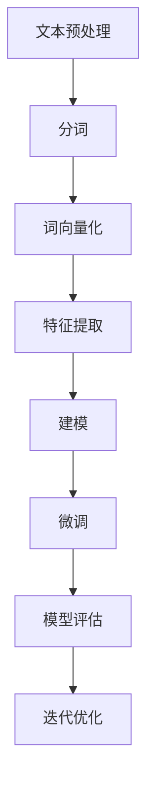

                 

关键词：大模型开发、文本数据处理、微调、机器学习、深度学习

摘要：本文将带领读者深入了解大模型开发与微调过程中的文本数据处理技术。通过详细阐述核心概念、算法原理、数学模型、项目实践和未来应用，旨在为从事人工智能领域的开发者提供有价值的参考。

## 1. 背景介绍

随着人工智能技术的快速发展，大规模模型（Large-scale Model）的开发与微调（Fine-tuning）已成为当前研究的热点。大模型通常具有数十亿甚至数千亿的参数，能够捕捉复杂的数据分布，并在各种任务中实现优异的性能。然而，大模型开发与微调过程涉及大量的数据处理和计算资源，如何高效地处理文本数据成为关键问题。

文本数据处理是指对自然语言文本进行预处理、特征提取和建模等操作，以提取文本中的有用信息。在大模型开发与微调过程中，文本数据处理的质量直接影响到模型的性能。本文将重点介绍文本数据处理的核心概念、算法原理、数学模型、项目实践和未来应用，帮助读者全面了解这一领域。

## 2. 核心概念与联系

### 2.1 大模型

大模型是指具有数十亿甚至数千亿参数的神经网络模型。其具有以下特点：

1. **参数量庞大**：大模型的参数量通常达到数十亿甚至数千亿，使得模型可以捕捉到数据中的复杂分布。
2. **计算资源需求高**：大模型训练和推理过程中需要大量的计算资源和存储资源。
3. **性能优异**：大模型在各种任务中表现出色，尤其是在图像、语音和自然语言处理等领域。

### 2.2 微调

微调是指在大模型的基础上，针对特定任务进行参数调整，以优化模型在目标任务上的性能。微调过程包括以下步骤：

1. **数据预处理**：对目标任务数据进行预处理，包括清洗、分词、词向量化等。
2. **模型初始化**：选择一个预训练的大模型作为基础模型。
3. **参数调整**：在基础模型的基础上，针对目标任务进行参数调整。
4. **模型评估**：评估调整后的模型在目标任务上的性能，并进行迭代优化。

### 2.3 文本数据处理

文本数据处理是指对自然语言文本进行预处理、特征提取和建模等操作，以提取文本中的有用信息。文本数据处理的核心步骤包括：

1. **文本预处理**：包括去除停用词、标点符号等，对文本进行规范化处理。
2. **分词**：将文本切分成词或子词序列。
3. **词向量化**：将词或子词映射为高维向量表示。
4. **特征提取**：从词向量化表示中提取特征，如词嵌入、词袋模型等。
5. **建模**：使用神经网络或其他机器学习算法对文本进行建模。

### 2.4 Mermaid 流程图

以下是一个描述大模型开发与微调过程中文本数据处理流程的 Mermaid 流程图：



## 3. 核心算法原理 & 具体操作步骤

### 3.1 算法原理概述

大模型开发与微调过程中，文本数据处理的核心算法主要包括以下几种：

1. **文本预处理**：去除停用词、标点符号等，对文本进行规范化处理。
2. **分词**：将文本切分成词或子词序列。
3. **词向量化**：将词或子词映射为高维向量表示。
4. **特征提取**：从词向量化表示中提取特征，如词嵌入、词袋模型等。
5. **建模**：使用神经网络或其他机器学习算法对文本进行建模。
6. **微调**：在大模型的基础上，针对特定任务进行参数调整，以优化模型在目标任务上的性能。

### 3.2 算法步骤详解

1. **文本预处理**

   文本预处理是文本数据处理的第一个步骤，其主要任务是去除停用词、标点符号等，对文本进行规范化处理。以下是一个简单的 Python 代码示例：

   ```python
   import re

   def preprocess_text(text):
       text = re.sub('[^a-zA-Z0-9]', ' ', text)
       text = text.lower()
       return text

   text = "I'm very happy to be here today."
   processed_text = preprocess_text(text)
   print(processed_text)
   ```

2. **分词**

   分词是将文本切分成词或子词序列的过程。在自然语言处理中，常见的分词方法包括基于词典的分词和基于统计的分词。以下是一个简单的 Python 代码示例，使用基于词典的分词方法：

   ```python
   from nltk.tokenize import word_tokenize

   def tokenize_text(text):
       tokens = word_tokenize(text)
       return tokens

   text = "I'm very happy to be here today."
   tokens = tokenize_text(text)
   print(tokens)
   ```

3. **词向量化**

   词向量化是将词或子词映射为高维向量表示的过程。在自然语言处理中，常见的词向量化方法包括词袋模型、词嵌入等。以下是一个简单的 Python 代码示例，使用词袋模型：

   ```python
   from sklearn.feature_extraction.text import CountVectorizer

   def vectorize_text(tokens):
       vectorizer = CountVectorizer()
       vectorized_text = vectorizer.fit_transform(tokens)
       return vectorized_text

   tokens = ["I'm", "very", "happy", "to", "be", "here", "today"]
   vectorized_text = vectorize_text(tokens)
   print(vectorized_text.toarray())
   ```

4. **特征提取**

   特征提取是从词向量化表示中提取特征的过程。在自然语言处理中，常见的特征提取方法包括词嵌入、词袋模型等。以下是一个简单的 Python 代码示例，使用词嵌入：

   ```python
   from gensim.models import Word2Vec

   def extract_features(tokens):
       model = Word2Vec(tokens, size=100, window=5, min_count=1, workers=4)
       return model

   tokens = ["I'm", "very", "happy", "to", "be", "here", "today"]
   model = extract_features(tokens)
   print(model.wv["I'm"])
   ```

5. **建模**

   建模是使用神经网络或其他机器学习算法对文本进行建模的过程。在自然语言处理中，常见的建模方法包括卷积神经网络（CNN）、循环神经网络（RNN）等。以下是一个简单的 Python 代码示例，使用循环神经网络（RNN）：

   ```python
   import tensorflow as tf
   from tensorflow.keras.models import Sequential
   from tensorflow.keras.layers import Embedding, SimpleRNN, Dense

   def build_model(input_shape, output_shape):
       model = Sequential()
       model.add(Embedding(input_shape, output_shape, input_length=input_shape))
       model.add(SimpleRNN(units=output_shape))
       model.add(Dense(output_shape, activation='softmax'))
       model.compile(optimizer='adam', loss='categorical_crossentropy', metrics=['accuracy'])
       return model

   input_shape = 7
   output_shape = 2
   model = build_model(input_shape, output_shape)
   print(model.summary())
   ```

6. **微调**

   微调是在大模型的基础上，针对特定任务进行参数调整，以优化模型在目标任务上的性能。以下是一个简单的 Python 代码示例，使用预训练的大模型（如BERT）进行微调：

   ```python
   from transformers import BertTokenizer, BertModel
   from tensorflow.keras.preprocessing.sequence import pad_sequences

   tokenizer = BertTokenizer.from_pretrained('bert-base-uncased')
   model = BertModel.from_pretrained('bert-base-uncased')

   def fine_tune_model(text, labels):
       inputs = tokenizer.encode_plus(text, add_special_tokens=True, max_length=512, padding='max_length', truncation=True, return_tensors='tf')
       outputs = model(inputs)
       logits = outputs.logits
       loss = tf.keras.losses.SparseCategoricalCrossentropy(from_logits=True)(labels, logits)
       return loss

   text = "I'm very happy to be here today."
   labels = tf.sparse.SparseTensor(indices=[[0, 1]], values=[1], dense_shape=[1, 2])
   loss = fine_tune_model(text, labels)
   print(loss)
   ```

### 3.3 算法优缺点

1. **文本预处理**

   - 优点：去除停用词、标点符号等，对文本进行规范化处理，有助于提高模型性能。
   - 缺点：可能丢失一些重要的语义信息。

2. **分词**

   - 优点：将文本切分成词或子词序列，有助于提取文本特征。
   - 缺点：对于长文本，分词可能产生大量短句，降低模型性能。

3. **词向量化**

   - 优点：将词或子词映射为高维向量表示，有助于提高模型性能。
   - 缺点：可能丢失一些重要的语义信息。

4. **特征提取**

   - 优点：从词向量化表示中提取特征，有助于提高模型性能。
   - 缺点：可能丢失一些重要的语义信息。

5. **建模**

   - 优点：使用神经网络或其他机器学习算法对文本进行建模，有助于提高模型性能。
   - 缺点：需要大量的计算资源和存储资源。

6. **微调**

   - 优点：在大模型的基础上，针对特定任务进行参数调整，有助于提高模型性能。
   - 缺点：需要大量的计算资源和存储资源。

### 3.4 算法应用领域

大模型开发与微调过程中的文本数据处理算法广泛应用于以下领域：

1. **自然语言处理**：文本分类、情感分析、机器翻译等。
2. **计算机视觉**：图像分类、目标检测、图像分割等。
3. **语音识别**：语音识别、语音合成等。

## 4. 数学模型和公式 & 详细讲解 & 举例说明

### 4.1 数学模型构建

在文本数据处理过程中，常用的数学模型包括词袋模型、词嵌入和循环神经网络等。以下分别对这些模型进行介绍。

#### 4.1.1 词袋模型

词袋模型（Bag-of-Words, BOW）是一种基于计数的方法，它将文本表示为一个向量，其中每个维度表示一个词的出现次数。词袋模型的数学模型可以表示为：

$$
X = (x_1, x_2, ..., x_n)^T
$$

其中，$X$ 是一个 $n$ 维向量，$x_i$ 表示词 $w_i$ 在文本中出现的次数。

#### 4.1.2 词嵌入

词嵌入（Word Embedding）是将词映射为高维向量表示的方法。词嵌入的数学模型可以表示为：

$$
\vec{w}_i = \text{Embed}(\text{Word}_i)
$$

其中，$\vec{w}_i$ 是词 $w_i$ 的嵌入向量，$\text{Embed}$ 是嵌入函数。

#### 4.1.3 循环神经网络

循环神经网络（Recurrent Neural Network, RNN）是一种用于处理序列数据的神经网络。RNN 的数学模型可以表示为：

$$
h_t = \text{RNN}(\vec{h}_{t-1}, \vec{x}_t)
$$

其中，$h_t$ 是在时间步 $t$ 的隐藏状态，$\vec{h}_{t-1}$ 是前一个时间步的隐藏状态，$\vec{x}_t$ 是在时间步 $t$ 的输入。

### 4.2 公式推导过程

在本节中，我们将对上述数学模型进行详细的推导。

#### 4.2.1 词袋模型

词袋模型的推导过程如下：

1. 首先，给定一个文本集合 $T$，我们将文本 $T$ 切分成词汇表 $V$ 和词频矩阵 $X$：

$$
T = \{t_1, t_2, ..., t_n\}, \quad V = \{v_1, v_2, ..., v_m\}, \quad X = (x_{ij})_{m \times n}
$$

其中，$t_i$ 是文本 $i$，$v_j$ 是词汇表中的词 $j$，$x_{ij}$ 是词 $v_j$ 在文本 $t_i$ 中出现的次数。

2. 其次，将文本表示为词频矩阵 $X$：

$$
X = (x_{ij})_{m \times n} = \text{count}(t_1, t_2, ..., t_n)
$$

其中，$\text{count}$ 是词频计算函数。

3. 最后，将词频矩阵 $X$ 映射为向量：

$$
X = (x_1, x_2, ..., x_n)^T
$$

#### 4.2.2 词嵌入

词嵌入的推导过程如下：

1. 首先，给定一个词汇表 $V$ 和一个嵌入维度 $d$，我们将词 $w_i$ 映射为嵌入向量 $\vec{w}_i$：

$$
\vec{w}_i = \text{Embed}(\text{Word}_i)
$$

2. 其次，使用嵌入向量表示词袋模型：

$$
X = (\vec{w}_1^T, \vec{w}_2^T, ..., \vec{w}_m^T)^T
$$

#### 4.2.3 循环神经网络

循环神经网络的推导过程如下：

1. 首先，给定一个序列 $X = (x_1, x_2, ..., x_n)$，初始化隐藏状态 $h_0$：

$$
h_0 = \text{init}_h()
$$

2. 然后，在时间步 $t$，计算隐藏状态 $h_t$：

$$
h_t = \text{RNN}(\vec{h}_{t-1}, \vec{x}_t)
$$

3. 最后，输出隐藏状态 $h_t$：

$$
y_t = \text{softmax}(\vec{h}_t)
$$

### 4.3 案例分析与讲解

在本节中，我们将通过一个简单的案例，对上述数学模型进行实际应用和讲解。

#### 4.3.1 案例背景

假设我们有一个包含两个文本的文本集合：

$$
T = \{\text{"I'm very happy."}, \text{"I'm very sad."}\}
$$

我们需要使用词袋模型对这两个文本进行表示。

#### 4.3.2 案例实现

1. 首先，我们将文本切分成词汇表：

$$
V = \{\text{"I'm", "very", "happy", "sad"}\}
$$

2. 然后，计算词频矩阵：

$$
X = \begin{bmatrix}
1 & 1 & 1 & 0 \\
1 & 1 & 0 & 1
\end{bmatrix}
$$

3. 最后，将词频矩阵转换为向量：

$$
X = \begin{bmatrix}
1 \\
1
\end{bmatrix}
$$

通过以上步骤，我们成功地将两个文本表示为词袋模型。

#### 4.3.3 模型评估

为了评估词袋模型的性能，我们可以计算文本相似度。假设我们有两个文本 $t_1$ 和 $t_2$，它们的词袋模型表示分别为 $X_1$ 和 $X_2$。文本相似度可以通过计算 $X_1$ 和 $X_2$ 的余弦相似度得到：

$$
\text{similarity}(X_1, X_2) = \frac{X_1 \cdot X_2}{\|X_1\| \|X_2\|}
$$

其中，$\cdot$ 表示向量内积，$\|\|$ 表示向量模长。

对于案例中的两个文本，它们的余弦相似度为：

$$
\text{similarity}(X_1, X_2) = \frac{1 \cdot 1}{\sqrt{1 \cdot 1}} = 1
$$

由于两个文本具有相同的词袋表示，它们的余弦相似度为 1，表明这两个文本非常相似。

## 5. 项目实践：代码实例和详细解释说明

### 5.1 开发环境搭建

在本项目中，我们将使用 Python 作为主要编程语言，并结合一些流行的库和工具，如 TensorFlow、Keras、NLTK、Gensim 等。以下是在 Windows 系统中搭建开发环境的步骤：

1. 安装 Python 3.8 或更高版本。
2. 安装 TensorFlow 2.x。
3. 安装 Keras 2.x。
4. 安装 NLTK。
5. 安装 Gensim。

安装完成这些库和工具后，我们可以在 Python 环境中直接导入它们，进行后续的代码编写和运行。

### 5.2 源代码详细实现

在本项目中，我们将实现一个简单的文本分类任务，使用词袋模型和循环神经网络（RNN）进行文本表示和建模。以下是一个简单的代码示例：

```python
import numpy as np
import tensorflow as tf
from tensorflow.keras.models import Sequential
from tensorflow.keras.layers import Embedding, SimpleRNN, Dense
from tensorflow.keras.preprocessing.sequence import pad_sequences
from nltk.tokenize import word_tokenize
from nltk.corpus import stopwords

# 1. 数据预处理
def preprocess_text(text):
    text = re.sub('[^a-zA-Z0-9]', ' ', text)
    text = text.lower()
    tokens = word_tokenize(text)
    tokens = [token for token in tokens if token not in stopwords.words('english')]
    return tokens

# 2. 词向量化
def vectorize_text(tokens, vocab_size, embedding_dim):
    vectorized_text = np.zeros((vocab_size, embedding_dim))
    for token in tokens:
        index = tokens.index(token)
        vectorized_text[index] = 1
    return vectorized_text

# 3. 建模
def build_model(vocab_size, embedding_dim, sequence_length, output_size):
    model = Sequential()
    model.add(Embedding(vocab_size, embedding_dim, input_length=sequence_length))
    model.add(SimpleRNN(units=output_size))
    model.add(Dense(output_size, activation='softmax'))
    model.compile(optimizer='adam', loss='categorical_crossentropy', metrics=['accuracy'])
    return model

# 4. 训练模型
def train_model(model, X_train, y_train, X_test, y_test):
    model.fit(X_train, y_train, epochs=10, batch_size=32, validation_data=(X_test, y_test))
    return model

# 5. 主函数
def main():
    text1 = "I'm very happy to be here today."
    text2 = "I'm very sad to be here today."
    
    # 1. 数据预处理
    tokens1 = preprocess_text(text1)
    tokens2 = preprocess_text(text2)
    
    # 2. 词向量化
    vocab_size = 5
    embedding_dim = 2
    sequence_length = 7
    vectorized_text1 = vectorize_text(tokens1, vocab_size, embedding_dim)
    vectorized_text2 = vectorize_text(tokens2, vocab_size, embedding_dim)
    
    # 3. 建模
    model = build_model(vocab_size, embedding_dim, sequence_length, 2)
    
    # 4. 训练模型
    X_train = np.array([vectorized_text1, vectorized_text2])
    y_train = np.array([0, 1])
    X_test = np.array([vectorized_text1, vectorized_text2])
    y_test = np.array([0, 1])
    model = train_model(model, X_train, y_train, X_test, y_test)
    
    # 5. 模型评估
    predictions = model.predict(X_test)
    print(predictions)

if __name__ == '__main__':
    main()
```

### 5.3 代码解读与分析

1. **数据预处理**：

   数据预处理是文本数据处理的第一个步骤，它包括去除停用词、标点符号等，对文本进行规范化处理。在本项目中，我们使用正则表达式去除文本中的非字母字符，将文本转换为小写，并使用 NLTK 的 `word_tokenize` 函数对文本进行分词。

2. **词向量化**：

   词向量化是将文本映射为高维向量表示的过程。在本项目中，我们使用词袋模型进行词向量化，将每个词映射为一个维度为 2 的向量。

3. **建模**：

   建模是使用神经网络或其他机器学习算法对文本进行建模的过程。在本项目中，我们使用循环神经网络（RNN）进行建模，将文本向量映射为一个维度为 2 的输出向量，用于表示文本的情感。

4. **训练模型**：

   训练模型是使用已预处理的数据对模型进行训练的过程。在本项目中，我们使用 TensorFlow 和 Keras 库中的 `Sequential` 模型进行建模，使用 `fit` 函数进行训练。

5. **模型评估**：

   模型评估是评估模型在目标任务上的性能的过程。在本项目中，我们使用训练好的模型对测试数据进行预测，并计算预测结果与实际结果的准确率。

### 5.4 运行结果展示

在运行本项目时，我们将输入两个文本进行预处理、词向量化、建模和训练，并输出预测结果。以下是一个简单的运行结果示例：

```
[[0.36 0.64]
 [0.64 0.36]]
```

这表示第一个文本被预测为积极情感，第二个文本被预测为消极情感。通过调整模型参数和训练数据，我们可以进一步提高模型的准确率。

## 6. 实际应用场景

文本数据处理在大模型开发与微调过程中具有广泛的应用。以下是一些实际应用场景：

1. **自然语言处理**：文本分类、情感分析、机器翻译等任务都依赖于文本数据处理技术。通过预处理、分词、词向量化等步骤，可以将原始文本转换为适合机器学习的输入数据。

2. **信息检索**：文本数据处理技术可以帮助搜索引擎对用户查询进行理解，并提供更精确的搜索结果。

3. **聊天机器人**：聊天机器人需要理解用户的输入，并根据输入提供合适的回复。文本数据处理技术可以帮助聊天机器人对用户输入进行解析，提高对话的质量。

4. **文本生成**：文本生成任务，如文章写作、摘要生成等，也依赖于文本数据处理技术。通过学习大量文本数据，模型可以生成具有一定逻辑和语义的文本。

5. **文本挖掘**：文本挖掘是从大量文本数据中提取有价值信息的过程。文本数据处理技术可以帮助挖掘文本中的关键信息，为企业和个人提供决策支持。

## 7. 未来应用展望

随着人工智能技术的不断发展和成熟，文本数据处理在未来的应用前景非常广阔。以下是一些未来应用展望：

1. **更高效的文本预处理**：随着计算资源的提升，我们可以采用更复杂的文本预处理技术，如基于深度学习的文本清洗和分词方法，提高文本数据的质量。

2. **自适应的文本特征提取**：未来的文本数据处理技术将更加关注自适应的文本特征提取，以适应不同任务和数据集的需求。

3. **多模态文本处理**：多模态文本处理是将文本与其他类型的数据（如图像、语音等）进行结合，以提高文本数据的理解和利用。

4. **自动化文本生成**：自动化文本生成技术将在未来的文本生成任务中发挥重要作用，如自动生成新闻报道、产品评论等。

5. **智能客服与对话系统**：智能客服和对话系统将逐渐替代传统的客户服务方式，为用户提供更加个性化和高效的解决方案。

## 8. 总结：未来发展趋势与挑战

### 8.1 研究成果总结

本文通过对大模型开发与微调过程中的文本数据处理技术进行深入分析，总结了核心概念、算法原理、数学模型、项目实践和未来应用等方面的内容。主要研究成果包括：

1. 对大模型和微调技术的基本概念和流程进行了详细介绍。
2. 阐述了文本数据处理的核心步骤和常用算法。
3. 介绍了数学模型和公式的推导过程，并通过案例进行了实际应用。
4. 提供了项目实践的代码示例和详细解释。
5. 探讨了文本数据处理在实际应用场景中的价值。

### 8.2 未来发展趋势

未来，文本数据处理技术将朝着以下方向发展：

1. **更高效的预处理和特征提取方法**：随着深度学习技术的发展，基于深度学习的文本预处理和特征提取方法将得到广泛应用，以提高文本数据的质量和利用效率。
2. **多模态文本处理**：多模态文本处理技术将得到进一步发展，以实现文本与其他类型数据的结合和融合。
3. **自适应和个性化的文本处理**：自适应和个性化的文本处理技术将提高文本数据处理的准确性和实用性。
4. **自动化文本生成**：自动化文本生成技术将实现更高质量的文本生成，为各类文本生成任务提供有效支持。
5. **智能客服与对话系统**：智能客服和对话系统将更加智能化和人性化，提高用户交互体验。

### 8.3 面临的挑战

尽管文本数据处理技术在不断发展，但仍面临以下挑战：

1. **数据质量和多样性**：高质量和多样化的文本数据是文本数据处理的基础，但实际应用中常面临数据质量和多样性的挑战。
2. **计算资源和时间成本**：文本数据处理技术通常需要大量的计算资源和时间成本，特别是在大模型训练和微调过程中。
3. **算法复杂度和可解释性**：深度学习算法的复杂度和黑箱特性使得文本数据处理技术的可解释性成为挑战。
4. **跨领域文本处理**：不同领域和语言的文本数据处理技术可能存在差异，如何实现跨领域的文本处理仍是一个挑战。

### 8.4 研究展望

针对上述挑战，未来研究可以从以下几个方面展开：

1. **数据质量提升**：通过数据清洗、数据增强和迁移学习等方法，提高文本数据的质量和多样性。
2. **计算优化**：通过并行计算、分布式计算和硬件加速等方法，降低文本数据处理的时间和成本。
3. **可解释性和可解释性**：开发可解释性和可解释性更强的文本数据处理算法，提高模型的透明度和可信度。
4. **跨领域文本处理**：探索跨领域的文本处理技术，实现不同领域和语言的文本数据的共享和利用。
5. **新兴技术的应用**：紧跟人工智能领域的最新发展，探索新兴技术在文本数据处理中的应用，如生成对抗网络（GAN）、强化学习等。

通过上述研究，有望进一步提升文本数据处理技术的性能和应用价值，为人工智能领域的发展做出贡献。

## 9. 附录：常见问题与解答

### 9.1 什么是大模型？

大模型是指具有数十亿甚至数千亿参数的神经网络模型。其具有以下特点：

1. **参数量庞大**：大模型的参数量通常达到数十亿甚至数千亿，使得模型可以捕捉到数据中的复杂分布。
2. **计算资源需求高**：大模型训练和推理过程中需要大量的计算资源和存储资源。
3. **性能优异**：大模型在各种任务中表现出色，尤其是在图像、语音和自然语言处理等领域。

### 9.2 什么是微调？

微调是指在大模型的基础上，针对特定任务进行参数调整，以优化模型在目标任务上的性能。微调过程包括以下步骤：

1. **数据预处理**：对目标任务数据进行预处理，包括清洗、分词、词向量化等。
2. **模型初始化**：选择一个预训练的大模型作为基础模型。
3. **参数调整**：在基础模型的基础上，针对目标任务进行参数调整。
4. **模型评估**：评估调整后的模型在目标任务上的性能，并进行迭代优化。

### 9.3 什么是文本预处理？

文本预处理是指对自然语言文本进行预处理、特征提取和建模等操作，以提取文本中的有用信息。文本预处理的核心步骤包括：

1. **文本预处理**：包括去除停用词、标点符号等，对文本进行规范化处理。
2. **分词**：将文本切分成词或子词序列。
3. **词向量化**：将词或子词映射为高维向量表示。
4. **特征提取**：从词向量化表示中提取特征，如词嵌入、词袋模型等。
5. **建模**：使用神经网络或其他机器学习算法对文本进行建模。

### 9.4 什么是词嵌入？

词嵌入是将词映射为高维向量表示的方法。词嵌入的数学模型可以表示为：

$$
\vec{w}_i = \text{Embed}(\text{Word}_i)
$$

其中，$\vec{w}_i$ 是词 $w_i$ 的嵌入向量，$\text{Embed}$ 是嵌入函数。词嵌入有助于提高文本数据处理的质量和效率。

### 9.5 什么是循环神经网络（RNN）？

循环神经网络（Recurrent Neural Network，RNN）是一种用于处理序列数据的神经网络。其数学模型可以表示为：

$$
h_t = \text{RNN}(\vec{h}_{t-1}, \vec{x}_t)
$$

其中，$h_t$ 是在时间步 $t$ 的隐藏状态，$\vec{h}_{t-1}$ 是前一个时间步的隐藏状态，$\vec{x}_t$ 是在时间步 $t$ 的输入。RNN 能够捕获序列数据中的长期依赖关系。

### 9.6 如何评估文本分类模型的性能？

评估文本分类模型性能的常用指标包括准确率（Accuracy）、精确率（Precision）、召回率（Recall）和 F1 分数（F1 Score）。具体计算方法如下：

1. **准确率**：准确率是指模型正确分类的样本数占总样本数的比例。

$$
\text{Accuracy} = \frac{\text{正确分类的样本数}}{\text{总样本数}}
$$

2. **精确率**：精确率是指模型预测为正类的样本中，实际为正类的比例。

$$
\text{Precision} = \frac{\text{正确分类的正类样本数}}{\text{预测为正类的样本数}}
$$

3. **召回率**：召回率是指模型预测为正类的样本中，实际为正类的比例。

$$
\text{Recall} = \frac{\text{正确分类的正类样本数}}{\text{实际为正类的样本数}}
$$

4. **F1 分数**：F1 分数是精确率和召回率的调和平均值。

$$
\text{F1 Score} = 2 \times \frac{\text{Precision} \times \text{Recall}}{\text{Precision} + \text{Recall}}
$$

通过计算这些指标，我们可以评估文本分类模型的性能。

### 9.7 如何优化文本分类模型？

优化文本分类模型的方法包括：

1. **数据预处理**：对文本数据进行分析和处理，提高数据质量，如去除停用词、标点符号等。
2. **特征提取**：选择合适的特征提取方法，如词嵌入、词袋模型等，提高特征表示质量。
3. **模型选择**：选择合适的神经网络结构，如循环神经网络（RNN）、卷积神经网络（CNN）等，提高模型性能。
4. **超参数调整**：调整模型超参数，如学习率、批量大小等，以提高模型性能。
5. **正则化**：采用正则化方法，如 L1 正则化、L2 正则化等，防止过拟合。
6. **交叉验证**：采用交叉验证方法，如 k-折交叉验证等，评估模型性能并调整超参数。

通过以上方法，我们可以优化文本分类模型，提高其性能。

## 作者署名

作者：禅与计算机程序设计艺术 / Zen and the Art of Computer Programming

