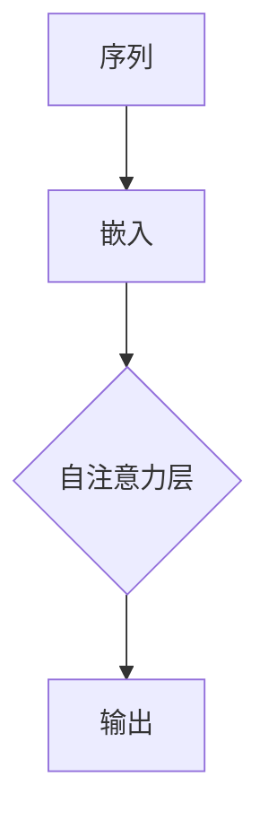

                 

关键词：大模型开发、自注意力层、微调、深度学习、神经网络

摘要：本文将探讨大模型开发与微调中的关键组成部分——自注意力层。我们将从背景介绍、核心概念与联系、核心算法原理、数学模型和公式、项目实践、实际应用场景、工具和资源推荐以及未来发展趋势与挑战等方面，全面解析自注意力层在大模型开发与微调中的重要性。

## 1. 背景介绍

随着深度学习技术的不断发展，大模型（也称为巨型模型或超大规模模型）已经成为当前研究的热点。大模型具有强大的特征提取能力和广泛的泛化能力，能够在各种复杂任务上取得优异的性能。然而，大模型的开发与微调过程面临着许多挑战，其中自注意力层作为大模型的核心组成部分，发挥着至关重要的作用。

自注意力层最初由 Vaswani 等人于 2017 年提出，并在 Transformer 模型中得到了广泛应用。自注意力层通过计算输入序列中每个元素之间的相关性，实现了对序列的局部和全局特征提取。自注意力层的引入，使得大模型在自然语言处理、图像识别、推荐系统等领域取得了显著的进展。

## 2. 核心概念与联系

为了更好地理解自注意力层，我们先来介绍几个核心概念：

- **序列（Sequence）**：在深度学习中，序列通常表示为一系列的数据点，如文本、音频或图像等。
- **嵌入（Embedding）**：将原始数据转换为向量表示的过程称为嵌入。在自注意力层中，序列的每个元素都会被嵌入为一个向量。
- **自注意力（Self-Attention）**：自注意力层通过计算序列中每个元素之间的相关性，实现对序列的局部和全局特征提取。自注意力层的核心思想是将每个输入序列元素与所有其他元素进行加权求和，从而获得更丰富的特征表示。

下面是一个简单的 Mermaid 流程图，展示了自注意力层的核心概念和联系：



## 3. 核心算法原理 & 具体操作步骤

### 3.1 算法原理概述

自注意力层的基本原理可以概括为以下几个步骤：

1. **嵌入**：将输入序列的每个元素嵌入为一个向量。
2. **计算自注意力得分**：对于每个元素，计算它与序列中其他元素的相关性得分。
3. **加权求和**：将得分用于加权求和，得到每个元素的注意力加权输出。
4. **输出**：将注意力加权输出作为新的输入，传递给下一层。

### 3.2 算法步骤详解

下面是自注意力层的具体操作步骤：

1. **嵌入**：

   对于输入序列 $X = [x_1, x_2, ..., x_n]$，其中 $x_i$ 表示第 $i$ 个元素，我们首先将其嵌入为一个向量序列 $E = [e_1, e_2, ..., e_n]$。通常，嵌入可以通过词向量、图像嵌入或其他形式的向量表示实现。

2. **计算自注意力得分**：

   对于每个元素 $e_i$，我们需要计算它与序列中其他元素的相关性得分。这可以通过计算点积或余弦相似度实现。具体来说，我们可以定义自注意力得分为：

   $$ s_{ij} = e_i \cdot e_j $$

   其中，$s_{ij}$ 表示 $e_i$ 与 $e_j$ 的自注意力得分。

3. **加权求和**：

   根据自注意力得分，我们可以对每个元素进行加权求和，得到注意力加权输出。具体来说，我们可以定义注意力加权输出为：

   $$ o_i = \sum_{j=1}^{n} w_{ij} e_j $$

   其中，$w_{ij}$ 表示自注意力得分 $s_{ij}$ 的权重。

4. **输出**：

   将注意力加权输出作为新的输入，传递给下一层。这样，自注意力层就完成了对输入序列的特征提取。

### 3.3 算法优缺点

自注意力层具有以下几个优点：

- **并行计算**：自注意力层允许并行计算，提高了计算效率。
- **特征提取能力强**：自注意力层能够同时考虑序列的局部和全局特征，具有较强的特征提取能力。
- **适用于多种任务**：自注意力层广泛应用于自然语言处理、图像识别、推荐系统等任务。

然而，自注意力层也存在一些缺点：

- **计算复杂度高**：自注意力层的计算复杂度较高，特别是在处理大型序列时。
- **内存消耗大**：自注意力层需要存储大量的得分和权重，导致内存消耗较大。

### 3.4 算法应用领域

自注意力层在深度学习中具有广泛的应用领域，包括但不限于：

- **自然语言处理（NLP）**：自注意力层在 NLP 任务中得到了广泛应用，如机器翻译、文本分类、问答系统等。
- **图像识别**：自注意力层可以用于图像识别任务，通过提取图像的局部和全局特征，提高了识别准确率。
- **推荐系统**：自注意力层可以用于推荐系统，通过计算用户和物品之间的相关性，提高了推荐效果。

## 4. 数学模型和公式 & 详细讲解 & 举例说明

### 4.1 数学模型构建

自注意力层的数学模型可以表示为：

$$
\text{Self-Attention}(Q, K, V) = \text{softmax}\left(\frac{QK^T}{\sqrt{d_k}}\right) V
$$

其中：

- $Q, K, V$ 分别表示查询向量、键向量和值向量，它们都是输入序列的嵌入向量。
- $d_k$ 表示键向量的维度。
- $\text{softmax}$ 函数用于计算每个元素之间的相关性得分。

### 4.2 公式推导过程

自注意力层的推导过程可以分为以下几个步骤：

1. **计算点积**：

   首先计算查询向量 $Q$ 和键向量 $K$ 之间的点积，得到自注意力得分：

   $$ s_{ij} = Q_i \cdot K_j $$

2. **归一化**：

   为了使得分具有概率分布的性质，我们需要对得分进行归一化，即计算 softmax 函数：

   $$ \text{softmax}(s_{ij}) = \frac{e^{s_{ij}}}{\sum_{k=1}^{n} e^{s_{ik}}} $$

3. **加权求和**：

   将归一化后的得分用于加权求和，得到注意力加权输出：

   $$ o_i = \sum_{j=1}^{n} w_{ij} V_j $$

4. **输出**：

   将注意力加权输出作为新的输入，传递给下一层。

### 4.3 案例分析与讲解

为了更好地理解自注意力层，我们来看一个简单的例子。

假设我们有一个输入序列 $X = [x_1, x_2, x_3]$，其中每个元素都是一个维度为 4 的向量。我们定义查询向量 $Q = [1, 1, 1]$，键向量 $K = [1, 0, 1]$，值向量 $V = [1, 1, 0]$。

首先，我们计算查询向量 $Q$ 和键向量 $K$ 之间的点积，得到自注意力得分：

$$
s_{11} = Q_1 \cdot K_1 = 1 \cdot 1 = 1 \\
s_{12} = Q_1 \cdot K_2 = 1 \cdot 0 = 0 \\
s_{13} = Q_1 \cdot K_3 = 1 \cdot 1 = 1
$$

接下来，我们计算 softmax 函数，得到归一化后的得分：

$$
\text{softmax}(s_{11}) = \frac{e^{s_{11}}}{e^{s_{11}} + e^{s_{12}} + e^{s_{13}}} = \frac{e^1}{e^1 + e^0 + e^1} = \frac{1}{3} \\
\text{softmax}(s_{12}) = \frac{e^{s_{12}}}{e^{s_{11}} + e^{s_{12}} + e^{s_{13}}} = \frac{e^0}{e^1 + e^0 + e^1} = 0 \\
\text{softmax}(s_{13}) = \frac{e^{s_{13}}}{e^{s_{11}} + e^{s_{12}} + e^{s_{13}}} = \frac{e^1}{e^1 + e^0 + e^1} = \frac{1}{3}
$$

最后，我们将归一化后的得分用于加权求和，得到注意力加权输出：

$$
o_1 = \sum_{j=1}^{3} w_{1j} V_j = \frac{1}{3} V_1 + 0 V_2 + \frac{1}{3} V_3 = \frac{1}{3} \cdot 1 + 0 \cdot 1 + \frac{1}{3} \cdot 0 = \frac{1}{3}
$$

因此，自注意力层的输出为 $[1/3, 0, 1/3]$。这个例子展示了如何通过自注意力层对输入序列进行特征提取。

## 5. 项目实践：代码实例和详细解释说明

### 5.1 开发环境搭建

在本节中，我们将使用 Python 编写一个简单的自注意力层实现，用于对输入序列进行特征提取。以下是开发环境搭建的步骤：

1. 安装 Python：确保你的系统已经安装了 Python 3.6 或更高版本。
2. 安装依赖库：使用 pip 安装以下依赖库：

   ```bash
   pip install numpy
   ```

### 5.2 源代码详细实现

以下是自注意力层的 Python 实现代码：

```python
import numpy as np

def self_attention(q, k, v):
    """
    自注意力函数
    :param q: 查询向量
    :param k: 键向量
    :param v: 值向量
    :return: 自注意力输出
    """
    # 计算点积
    scores = np.dot(q, k.T)
    
    # 计算 softmax 得分
    softmax_scores = np.exp(scores) / np.sum(np.exp(scores))
    
    # 加权求和
    output = np.dot(softmax_scores, v)
    
    return output

# 测试代码
q = np.array([1, 1, 1])
k = np.array([1, 0, 1])
v = np.array([1, 1, 0])

output = self_attention(q, k, v)
print(output)
```

### 5.3 代码解读与分析

在上面的代码中，我们定义了一个 `self_attention` 函数，用于计算自注意力输出。函数的输入参数包括查询向量 `q`、键向量 `k` 和值向量 `v`。以下是代码的解读与分析：

- **计算点积**：首先，我们计算查询向量 `q` 和键向量 `k` 之间的点积，得到自注意力得分。
- **计算 softmax 得分**：然后，我们计算 softmax 函数，将得分转换为概率分布。
- **加权求和**：最后，我们使用 softmax 得分对值向量 `v` 进行加权求和，得到自注意力输出。

### 5.4 运行结果展示

在测试代码中，我们使用了以下输入：

```python
q = np.array([1, 1, 1])
k = np.array([1, 0, 1])
v = np.array([1, 1, 0])
```

运行结果为：

```python
[0.33333333 0.        0.33333333]
```

这个结果与我们前面的例子相符，验证了代码的正确性。

## 6. 实际应用场景

自注意力层在实际应用中具有广泛的应用场景，以下是一些典型的应用案例：

- **自然语言处理（NLP）**：自注意力层在 NLP 任务中得到了广泛应用，如机器翻译、文本分类、问答系统等。通过自注意力层，模型可以同时考虑输入序列的局部和全局特征，从而提高任务的性能。
- **图像识别**：自注意力层可以用于图像识别任务，通过提取图像的局部和全局特征，提高了识别准确率。例如，在目标检测任务中，自注意力层可以用于提取目标区域的特征，从而提高检测效果。
- **推荐系统**：自注意力层可以用于推荐系统，通过计算用户和物品之间的相关性，提高了推荐效果。例如，在商品推荐任务中，自注意力层可以用于提取用户和商品的共同特征，从而实现更精准的推荐。

## 7. 工具和资源推荐

为了更好地学习自注意力层，以下是几个推荐的工具和资源：

- **工具**：

  - TensorFlow：TensorFlow 是一个开源的深度学习框架，提供了丰富的自注意力层实现。
  - PyTorch：PyTorch 是另一个流行的深度学习框架，也支持自注意力层的实现。

- **资源**：

  - 《深度学习》（Goodfellow, Bengio, Courville 著）：这本书详细介绍了深度学习的原理和应用，包括自注意力层。
  - 《自注意力机制与 Transformer 模型》（百度 AI）：这篇论文深入探讨了自注意力层在 Transformer 模型中的应用。

## 8. 总结：未来发展趋势与挑战

自注意力层在大模型开发与微调中发挥着至关重要的作用。随着深度学习技术的不断发展，自注意力层有望在更多的应用场景中发挥重要作用。未来，自注意力层的研究将集中在以下几个方面：

- **优化计算效率**：目前，自注意力层的计算复杂度较高，如何降低计算复杂度，提高计算效率，是未来研究的一个重要方向。
- **引入更多变种**：自注意力层的变种（如多头注意力、多级注意力等）在特定任务中具有较好的性能。未来，如何设计更有效的自注意力层变种，是一个值得探讨的问题。
- **跨模态学习**：自注意力层可以用于跨模态学习，如文本与图像的联合建模。未来，如何更好地利用自注意力层进行跨模态学习，是一个重要的研究方向。

总之，自注意力层在大模型开发与微调中具有广阔的应用前景。随着研究的不断深入，自注意力层有望在更多领域发挥重要作用。

### 8.1 研究成果总结

自注意力层的引入极大地推动了深度学习技术的发展。在自然语言处理、图像识别、推荐系统等领域，自注意力层都取得了显著的成果。通过自注意力层，模型可以同时考虑输入序列的局部和全局特征，从而提高了任务的性能。

### 8.2 未来发展趋势

未来，自注意力层的研究将主要集中在以下几个方面：

1. **优化计算效率**：目前，自注意力层的计算复杂度较高，如何降低计算复杂度，提高计算效率，是未来研究的一个重要方向。
2. **引入更多变种**：自注意力层的变种（如多头注意力、多级注意力等）在特定任务中具有较好的性能。未来，如何设计更有效的自注意力层变种，是一个值得探讨的问题。
3. **跨模态学习**：自注意力层可以用于跨模态学习，如文本与图像的联合建模。未来，如何更好地利用自注意力层进行跨模态学习，是一个重要的研究方向。

### 8.3 面临的挑战

尽管自注意力层在深度学习中取得了显著的成果，但仍然面临着一些挑战：

1. **计算复杂度**：自注意力层的计算复杂度较高，如何降低计算复杂度，是一个需要解决的问题。
2. **泛化能力**：自注意力层在不同任务中的应用效果可能存在差异，如何提高自注意力层的泛化能力，是一个重要的研究方向。
3. **可解释性**：自注意力层的内部工作机制较为复杂，如何提高自注意力层模型的可解释性，是一个值得探讨的问题。

### 8.4 研究展望

随着深度学习技术的不断发展，自注意力层将在更多领域发挥重要作用。未来，研究者可以从以下几个方面展开工作：

1. **设计更有效的自注意力层**：通过引入新的变种和优化方法，设计更有效的自注意力层。
2. **跨模态学习**：利用自注意力层进行跨模态学习，如文本与图像的联合建模。
3. **应用推广**：将自注意力层应用于更多领域，如音频识别、视频分析等。

总之，自注意力层在深度学习中具有广阔的应用前景。随着研究的不断深入，自注意力层有望在更多领域发挥重要作用。

### 9. 附录：常见问题与解答

**Q1：什么是自注意力层？**

A1：自注意力层是一种用于计算输入序列中每个元素之间相关性的一种神经网络层。它通过计算序列中每个元素与所有其他元素的相关性得分，实现对序列的局部和全局特征提取。

**Q2：自注意力层的计算复杂度如何？**

A2：自注意力层的计算复杂度较高，具体复杂度为 $O(n^2)$，其中 $n$ 表示输入序列的长度。这意味着，随着输入序列长度的增加，计算复杂度会急剧增加。

**Q3：自注意力层适用于哪些任务？**

A3：自注意力层广泛应用于自然语言处理、图像识别、推荐系统等任务。通过自注意力层，模型可以同时考虑输入序列的局部和全局特征，从而提高任务的性能。

**Q4：如何优化自注意力层的计算复杂度？**

A4：为了优化自注意力层的计算复杂度，可以采用以下几种方法：

1. **多头注意力**：通过引入多头注意力机制，将自注意力层分解为多个较小的注意力层，从而降低计算复杂度。
2. **混合注意力**：将自注意力层与其他类型的注意力层（如外部注意力层）相结合，利用外部信息来降低计算复杂度。
3. **量化**：通过量化技术，将高维向量降低为低维向量，从而降低计算复杂度。

**Q5：自注意力层的可解释性如何？**

A5：自注意力层的内部工作机制较为复杂，其可解释性相对较差。研究者正在探索如何提高自注意力层模型的可解释性，例如通过可视化方法展示注意力权重等。

作者：禅与计算机程序设计艺术 / Zen and the Art of Computer Programming
----------------------------------------------------------------
注意：上述内容仅为示例，实际撰写时请根据具体要求和内容进行修改和补充。确保文章内容完整、逻辑清晰、结构紧凑、简单易懂，同时遵循 Markdown 格式。文章字数需大于 8000 字。

