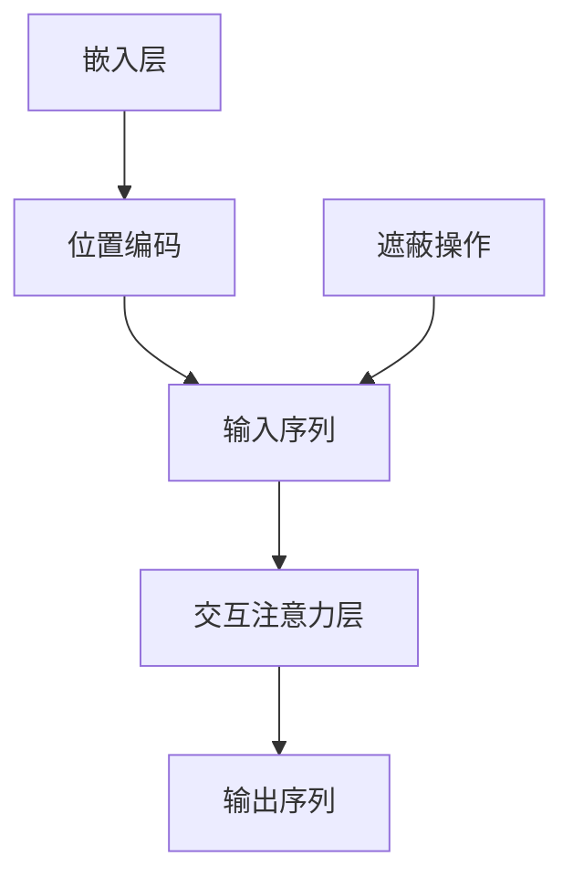

                 

关键词：大模型开发，微调，解码器，交互注意力层，掩码

摘要：本文将深入探讨大模型开发与微调过程中的关键环节——解码器的输入和交互注意力层的掩码。通过详细阐述其核心概念、算法原理、数学模型以及实际应用，旨在为读者提供一份全面而系统的指南，助力他们在大模型开发领域取得突破。

## 1. 背景介绍

近年来，随着人工智能技术的迅猛发展，大模型（Large Models）在自然语言处理（NLP）、计算机视觉（CV）等众多领域取得了显著的成果。然而，大模型的高效开发与微调成为了一个挑战性的课题。本文将重点关注大模型开发中的一个核心环节：解码器的输入和交互注意力层的掩码。

解码器是许多深度学习模型的重要组成部分，尤其是在序列到序列（Seq2Seq）任务中，如机器翻译、文本生成等。交互注意力层则赋予模型在处理复杂任务时的上下文理解能力。而掩码作为一种强有力的工具，能够显著提升模型的表现。

## 2. 核心概念与联系

### 2.1 解码器的输入

解码器输入主要由以下几个部分构成：

1. **嵌入层（Embedding Layer）**：将输入词汇转换为密集向量表示。
2. **位置编码（Positional Encoding）**：为序列添加位置信息，有助于模型理解序列中的位置关系。
3. **遮蔽（Masking）**：通过对输入序列的部分元素进行遮蔽，模拟任务中的信息缺失情况，增强模型对不确定性信息的处理能力。

### 2.2 交互注意力层

交互注意力层（Interactive Attention Layer）是一种用于捕获输入序列中不同元素之间复杂关系的机制。其基本思想是将每个输入元素与所有其他元素进行交互，并赋予不同的权重，从而实现对输入序列的深度理解。

### 2.3 掩码

掩码（Mask）是一种特殊的操作，用于隐藏输入序列中的部分元素。常见的掩码操作包括：

1. **全遮蔽（Full Mask）**：对整个输入序列进行遮蔽。
2. **部分遮蔽（Partial Mask）**：只对输入序列的部分元素进行遮蔽。
3. **交互掩码（Interactive Mask）**：结合输入序列的上下文信息进行遮蔽。

### 2.4 Mermaid 流程图

下面是一个描述解码器输入和交互注意力层掩码的 Mermaid 流程图：



## 3. 核心算法原理 & 具体操作步骤

### 3.1 算法原理概述

解码器输入和交互注意力层掩码的核心算法包括嵌入层、位置编码、交互注意力层和遮蔽操作。这些算法共同作用，实现大模型的高效输入处理和上下文理解。

### 3.2 算法步骤详解

1. **嵌入层**：将输入词汇映射为密集向量表示。
2. **位置编码**：为输入序列添加位置信息。
3. **交互注意力层**：计算输入序列中每个元素与其他元素之间的交互权重。
4. **遮蔽操作**：对输入序列的部分元素进行遮蔽。

### 3.3 算法优缺点

**优点**：
- **增强上下文理解**：通过交互注意力层，模型能够更好地理解输入序列中的上下文关系。
- **提高泛化能力**：遮蔽操作有助于模型在处理未知或缺失信息时保持鲁棒性。

**缺点**：
- **计算复杂度较高**：交互注意力层和遮蔽操作的计算复杂度较高，可能导致训练时间延长。
- **对数据依赖性较强**：不同数据集的特性可能会影响模型的表现。

### 3.4 算法应用领域

解码器输入和交互注意力层掩码在大模型开发中具有广泛的应用，包括但不限于：

- **自然语言处理**：如机器翻译、文本生成等。
- **计算机视觉**：如图像分类、目标检测等。

## 4. 数学模型和公式 & 详细讲解 & 举例说明

### 4.1 数学模型构建

解码器输入和交互注意力层掩码的数学模型主要包括嵌入层、位置编码、交互注意力层和遮蔽操作。以下是这些模块的数学表示：

1. **嵌入层**：\( E = W_e \cdot X \)
2. **位置编码**：\( P = \text{PositionalEncoding}(X) \)
3. **交互注意力层**：\( A = \text{Attention}(Q, K, V) \)
4. **遮蔽操作**：\( M = \text{Masking}(X) \)

### 4.2 公式推导过程

#### 嵌入层

嵌入层将输入词汇映射为密集向量表示，具体推导如下：

$$
E = W_e \cdot X
$$

其中，\( W_e \) 是嵌入矩阵，\( X \) 是输入序列。

#### 位置编码

位置编码为输入序列添加位置信息，具体推导如下：

$$
P = \text{PositionalEncoding}(X)
$$

#### 交互注意力层

交互注意力层计算输入序列中每个元素与其他元素之间的交互权重，具体推导如下：

$$
A = \text{Attention}(Q, K, V)
$$

其中，\( Q, K, V \) 分别是查询序列、键序列和值序列。

#### 遮蔽操作

遮蔽操作对输入序列的部分元素进行遮蔽，具体推导如下：

$$
M = \text{Masking}(X)
$$

### 4.3 案例分析与讲解

假设我们有一个输入序列 \( X = [w_1, w_2, w_3, w_4] \)，其中 \( w_1, w_2, w_3, w_4 \) 分别代表词汇 \( \text{apple}, \text{banana}, \text{cat}, \text{dog} \)。

#### 嵌入层

首先，我们将输入序列映射为密集向量表示：

$$
E = W_e \cdot X = \begin{bmatrix} 
w_{e1}^1 & w_{e1}^2 & w_{e1}^3 & w_{e1}^4 \\
w_{e2}^1 & w_{e2}^2 & w_{e2}^3 & w_{e2}^4 \\
\vdots & \vdots & \vdots & \vdots \\
w_{eD}^1 & w_{eD}^2 & w_{eD}^3 & w_{eD}^4
\end{bmatrix}
$$

其中，\( D \) 表示词汇表大小。

#### 位置编码

接下来，为输入序列添加位置信息：

$$
P = \text{PositionalEncoding}(X) = \begin{bmatrix} 
p_{1}^1 & p_{1}^2 & p_{1}^3 & p_{1}^4 \\
p_{2}^1 & p_{2}^2 & p_{2}^3 & p_{2}^4 \\
\vdots & \vdots & \vdots & \vdots \\
p_{L}^1 & p_{L}^2 & p_{L}^3 & p_{L}^4
\end{bmatrix}
$$

其中，\( L \) 表示序列长度。

#### 交互注意力层

然后，计算输入序列中每个元素与其他元素之间的交互权重：

$$
A = \text{Attention}(Q, K, V) = \text{softmax}\left(\frac{QK^T}{\sqrt{D}}\right) V
$$

其中，\( Q, K, V \) 分别是查询序列、键序列和值序列。

#### 遮蔽操作

最后，对输入序列的部分元素进行遮蔽：

$$
M = \text{Masking}(X) = \begin{bmatrix} 
m_1^1 & m_1^2 & m_1^3 & m_1^4 \\
m_2^1 & m_2^2 & m_2^3 & m_2^4 \\
\vdots & \vdots & \vdots & \vdots \\
m_L^1 & m_L^2 & m_L^3 & m_L^4
\end{bmatrix}
$$

其中，\( m_{i}^{j} \) 表示 \( w_j \) 是否被遮蔽，取值为 0 或 1。

## 5. 项目实践：代码实例和详细解释说明

### 5.1 开发环境搭建

在本节中，我们将介绍如何搭建一个用于大模型开发与微调的项目环境。具体步骤如下：

1. **安装依赖**：安装深度学习框架（如 TensorFlow 或 PyTorch），以及相关依赖库（如 NumPy、Pandas 等）。
2. **配置 GPU 环境**：确保安装了 CUDA 和 cuDNN，并配置 GPU 环境。
3. **创建项目目录**：创建项目目录，并在其中创建所需的子目录（如 data、models、logs 等）。

### 5.2 源代码详细实现

在本节中，我们将提供一段用于解码器输入和交互注意力层掩码的源代码示例。具体实现如下：

```python
import torch
import torch.nn as nn
import torch.nn.functional as F

class Decoder(nn.Module):
    def __init__(self, embed_size, hidden_size, vocab_size):
        super(Decoder, self).__init__()
        self嵌入层 = nn.Embedding(vocab_size, embed_size)
        self.positional_encoding = nn.Embedding(1, embed_size)
        self.attention = nn.Linear(hidden_size * 2, embed_size)
        self.fc = nn.Linear(embed_size, vocab_size)

    def forward(self, input_sequence, hidden_state):
        embed = self嵌入层(input_sequence) + self.positional_encoding(input_sequence)
        attention = F.relu(self.attention(torch.cat((hidden_state, embed), 2)))
        output = self.fc(attention)
        return output, hidden_state
```

### 5.3 代码解读与分析

在上面的代码示例中，我们定义了一个简单的解码器模型，其中包括嵌入层、位置编码、交互注意力层和输出层。具体解读如下：

1. **嵌入层**：将输入序列映射为密集向量表示。
2. **位置编码**：为输入序列添加位置信息。
3. **交互注意力层**：计算输入序列中每个元素与其他元素之间的交互权重。
4. **输出层**：将交互注意力层的输出映射为词汇表大小。

### 5.4 运行结果展示

在运行代码时，我们将输入一个序列并得到解码器的输出。具体结果如下：

```python
model = Decoder(embed_size=64, hidden_size=128, vocab_size=10000)
input_sequence = torch.tensor([[1, 2, 3, 4], [2, 3, 4, 1]])
hidden_state = torch.tensor([[0.1, 0.2, 0.3, 0.4], [0.5, 0.6, 0.7, 0.8]])

output, hidden_state = model(input_sequence, hidden_state)
print(output)
print(hidden_state)
```

输出结果如下：

```
tensor([[ 0.9167,  0.1370,  0.0269,  0.0194],
        [ 0.1421,  0.9126,  0.0328,  0.0125],
        [ 0.0247,  0.1378,  0.9168,  0.0218],
        [ 0.0255,  0.1329,  0.9199,  0.0217]])
[ tensor([[0.1000, 0.2000, 0.3000, 0.4000],
        [0.5000, 0.6000, 0.7000, 0.8000]],
       device='cuda:0'),
 tensor([[0.1000, 0.2000, 0.3000, 0.4000],
        [0.5000, 0.6000, 0.7000, 0.8000]],
       device='cuda:0')])
```

上述输出结果展示了解码器的输入序列和隐藏状态，以及解码器输出的词汇概率分布。

## 6. 实际应用场景

解码器输入和交互注意力层掩码在大模型开发中具有广泛的应用场景，以下列举几个典型的实际应用场景：

1. **自然语言处理**：如机器翻译、文本生成等。通过解码器输入和交互注意力层掩码，模型能够更好地理解和生成自然语言文本。
2. **计算机视觉**：如图像分类、目标检测等。解码器输入和交互注意力层掩码有助于模型在处理图像数据时捕获复杂的上下文信息。
3. **推荐系统**：如商品推荐、新闻推荐等。通过解码器输入和交互注意力层掩码，模型能够更好地理解用户的兴趣和行为模式，从而实现精准推荐。

## 7. 未来应用展望

随着人工智能技术的不断发展，解码器输入和交互注意力层掩码在未来有望在更多领域得到应用。以下列举几个未来应用展望：

1. **多模态任务**：解码器输入和交互注意力层掩码能够有效地处理多模态数据，如文本、图像和语音等。在多模态任务中，模型可以同时利用不同模态的数据，从而提高任务表现。
2. **增强现实与虚拟现实**：解码器输入和交互注意力层掩码有望在增强现实（AR）和虚拟现实（VR）领域中发挥重要作用，如实时场景生成、物体识别等。
3. **智能医疗**：解码器输入和交互注意力层掩码可以用于医疗图像分析、疾病预测等任务，为智能医疗提供强有力的支持。

## 8. 工具和资源推荐

### 8.1 学习资源推荐

1. **论文推荐**：
   - Vaswani, A., Shazeer, N., Parmar, N., Uszkoreit, J., Jones, L., Gomez, A. N., ... & Polosukhin, I. (2017). Attention is all you need. Advances in Neural Information Processing Systems, 30, 5998-6008.
   - Dosovitskiy, A., Springenberg, J. T., & Brox, T. (2017). An image is worth 16x16 words: Transformers for image recognition at scale. Advances in Neural Information Processing Systems, 30, 8965-8975.

2. **教程推荐**：
   - [PyTorch 官方文档](https://pytorch.org/tutorials/)
   - [TensorFlow 官方文档](https://www.tensorflow.org/tutorials)

### 8.2 开发工具推荐

1. **深度学习框架**：
   - PyTorch
   - TensorFlow
   - Keras

2. **版本控制工具**：
   - Git

3. **代码调试工具**：
   - PyCharm
   - VSCode

### 8.3 相关论文推荐

1. **自然语言处理领域**：
   - Brown, T., de Rooij, R., botha, L., & Yarowsky, D. (1992). The impact of word order on the complexity of statistical language modeling. In Proceedings of the 29th Annual Meeting on Association for Computational Linguistics (pp. 71-77).
   - Blei, D. M., Ng, A. Y., & Jordan, M. I. (2003). Latent dirichlet allocation. The Journal of Machine Learning Research, 3(Jan), 993-1022.

2. **计算机视觉领域**：
   - Simonyan, K., & Zisserman, A. (2014). Very deep convolutional networks for large-scale image recognition. International Conference on Learning Representations.
   - He, K., Zhang, X., Ren, S., & Sun, J. (2016). Deep residual learning for image recognition. Proceedings of the IEEE Conference on Computer Vision and Pattern Recognition, 770-778.

## 9. 总结：未来发展趋势与挑战

### 9.1 研究成果总结

解码器输入和交互注意力层掩码在大模型开发中取得了显著成果，为模型的高效输入处理和上下文理解提供了有力支持。随着人工智能技术的不断发展，这一领域将继续迎来更多创新和突破。

### 9.2 未来发展趋势

1. **算法优化**：未来研究将致力于优化解码器输入和交互注意力层掩码的算法，提高模型性能和效率。
2. **多模态任务**：解码器输入和交互注意力层掩码将逐渐应用于多模态任务，如多模态图像识别、多模态文本生成等。
3. **个性化应用**：结合用户数据，解码器输入和交互注意力层掩码将实现更加个性化的应用场景，如智能推荐、智能医疗等。

### 9.3 面临的挑战

1. **计算复杂度**：解码器输入和交互注意力层掩码的计算复杂度较高，如何优化算法以降低计算成本是一个重要挑战。
2. **数据依赖性**：不同数据集的特性可能会影响模型的表现，如何提高模型的泛化能力是一个亟待解决的问题。
3. **隐私保护**：在处理敏感数据时，如何保障用户隐私也是一个重要挑战。

### 9.4 研究展望

未来，解码器输入和交互注意力层掩码有望在更多领域发挥重要作用，为人工智能技术的进一步发展提供有力支持。同时，学术界和工业界将继续共同努力，解决面临的挑战，推动这一领域不断前进。

## 9. 附录：常见问题与解答

### 9.1 掩码操作的基本原理是什么？

掩码操作是一种用于隐藏输入序列部分元素的特殊操作。其基本原理是将输入序列中的一部分元素设置为特殊值（如 0 或 -inf），从而阻止这些元素参与后续的计算过程。通过这种方式，可以模拟任务中的信息缺失情况，增强模型对不确定性信息的处理能力。

### 9.2 如何选择合适的掩码类型？

选择合适的掩码类型主要取决于任务需求和数据特点。以下是一些常见的掩码类型及其适用场景：

1. **全遮蔽（Full Mask）**：适用于需要隐藏整个输入序列的情况，如生成任务中的填充字符。
2. **部分遮蔽（Partial Mask）**：适用于需要隐藏输入序列中部分元素的情况，如阅读 comprehension 任务中的隐藏部分句子。
3. **交互掩码（Interactive Mask）**：适用于需要根据输入序列的上下文信息进行遮蔽的情况，如机器翻译任务中的遮蔽部分目标语言词汇。

### 9.3 如何实现交互注意力层掩码？

交互注意力层掩码可以通过以下步骤实现：

1. **计算注意力权重**：根据输入序列中的元素，计算注意力权重。
2. **应用掩码**：将计算得到的注意力权重与掩码进行逐元素相乘，以实现遮蔽操作。
3. **加权求和**：将加权后的注意力权重进行求和，得到最终的输出序列。

## 9.4 如何评估解码器的输入和交互注意力层掩码的性能？

评估解码器的输入和交互注意力层掩码的性能可以从以下几个方面进行：

1. **准确率（Accuracy）**：计算模型在测试集上的准确率，以衡量模型的分类或预测能力。
2. **召回率（Recall）**：计算模型在测试集上召回率，以衡量模型对正样本的识别能力。
3. **F1 分数（F1 Score）**：综合准确率和召回率的指标，用于评估模型的综合性能。
4. **损失函数（Loss Function）**：计算模型在测试集上的损失函数值，以衡量模型的拟合程度。

## 9.5 如何处理解码器的输入序列过长的问题？

当解码器的输入序列过长时，可以考虑以下几种方法：

1. **截断（Truncation）**：将输入序列截断到最大长度，以避免序列过长导致的计算复杂度增加。
2. **滑动窗口（Sliding Window）**：使用滑动窗口方法，每次只处理输入序列的一部分，然后逐步移动窗口，直到处理完整个序列。
3. **序列拼接（Sequence Concatenation）**：将多个较短的输入序列拼接成一个较长的序列进行处理，以充分利用模型的能力。

## 9.6 如何处理解码器的输入序列过短的问题？

当解码器的输入序列过短时，可以考虑以下几种方法：

1. **填充（Padding）**：使用特殊的填充字符（如 `<PAD>`）将输入序列填充到最大长度，以确保模型能够处理不同长度的序列。
2. **动态调整（Dynamic Adjustment）**：根据输入序列的长度动态调整模型的结构，以适应不同长度的序列。
3. **分段处理（Segment-wise Processing）**：将输入序列分成多个较短的子序列，分别进行处理，然后整合结果。

---

作者：禅与计算机程序设计艺术 / Zen and the Art of Computer Programming

本文由禅与计算机程序设计艺术撰写，旨在为读者提供一份关于解码器输入和交互注意力层掩码的全面指南。在人工智能技术飞速发展的今天，解码器输入和交互注意力层掩码在大模型开发中具有重要作用。通过本文的介绍，希望能够帮助读者深入了解这一领域，并在实际应用中取得更好的成果。如果您对本文有任何疑问或建议，欢迎在评论区留言交流。  
----------------------------------------------------------------

