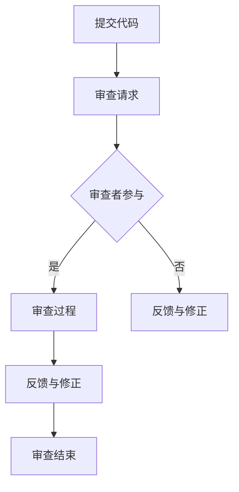

                 

### 关键词 Keyword
- 代码审查
- 结对编程
- 软件质量
- 代码标准
- 软件工程
- 团队协作

### 摘要 Abstract
本文旨在探讨代码审查与结对编程在软件工程中的应用原理与实践。通过详细分析代码审查的核心概念、流程、益处和挑战，结合结对编程的模式、协作技巧和效果，提供一系列实战案例，旨在为开发者提供系统化的代码审查与结对编程实践指南。文章还将讨论这两个方法在实际应用场景中的优势与局限，并展望其未来的发展趋势与面临的挑战。

### 1. 背景介绍 Background

#### 1.1 代码审查的起源与发展

代码审查（Code Review）作为一种软件工程实践，起源于20世纪80年代。当时，软件开发团队意识到在项目开发过程中仅依赖测试来保证代码质量是不够的，因为许多问题往往在测试之前就已经产生。因此，代码审查作为一种预防性措施被引入，以提前发现和纠正代码中的缺陷。

随着软件开发技术的发展，代码审查的方法和工具也在不断演进。从最初的书面文档审查，到基于电子邮件的代码审查，再到现代的在线代码审查平台，如GitHub、GitLab等，代码审查已经成为软件开发过程中不可或缺的一部分。

#### 1.2 结对编程的起源与发展

结对编程（Pair Programming）最早由Erich Gamma和Richard Helm在《设计模式：可复用面向对象软件的基础》一书中提出。他们指出，通过两个人协同工作，可以显著提高软件开发的效率和质量。

随后，敏捷开发（Agile Development）方法的普及进一步推动了结对编程的应用。敏捷开发强调团队协作、快速迭代和持续改进，而结对编程正是实现这些目标的一种有效方式。如今，越来越多的开发团队开始采用结对编程来提升软件开发效率和质量。

#### 1.3 代码审查与结对编程的相互关系

代码审查与结对编程虽然各自有不同的实践方法和目的，但它们之间存在密切的联系。结对编程过程中，代码审查是自然的一部分。开发者在编程时，一个成员负责编写代码（驱动者），另一个成员负责审查和纠正代码（导航者）。这种方式不仅可以提高代码质量，还能促进团队成员之间的沟通和协作。

代码审查也可以独立于结对编程进行。在项目开发过程中，定期组织代码审查会议，让团队成员对已完成的代码进行审查和反馈，有助于及时发现和解决潜在问题。

### 2. 核心概念与联系 Core Concepts and Connections

#### 2.1 代码审查的定义与流程

代码审查是一种通过团队成员之间的协作来评估代码质量的过程。其主要目的是发现和纠正代码中的缺陷、提高代码的可读性和可维护性，同时促进团队成员之间的知识共享和技能提升。

代码审查的流程通常包括以下几个步骤：

1. **提交代码**：开发者将已完成的代码提交到代码库中。
2. **审查请求**：提交者发起审查请求，并邀请其他团队成员参与。
3. **审查过程**：审查者对代码进行详细审查，包括语法错误、逻辑错误、代码风格、性能优化等方面。
4. **反馈与修正**：审查者对发现的问题进行反馈，提交者根据反馈进行修正。
5. **审查结束**：代码审查结束后，提交者关闭审查请求，并将修正后的代码合并到主分支。

#### 2.2 结对编程的定义与模式

结对编程是一种两人合作的软件开发模式。其中，一个成员负责编写代码（驱动者），另一个成员负责审查和指导（导航者）。这种协作模式有助于提高代码质量、减少错误和提高开发效率。

结对编程的常见模式包括：

1. **固定搭配**：团队成员长期固定搭配，相互熟悉，提高协作效率。
2. **轮换模式**：团队成员定期轮换，增加团队内的知识共享和技能多样性。
3. **事件驱动**：根据项目需求和紧急程度，动态安排结对编程活动。

#### 2.3 Mermaid 流程图



### 3. 核心算法原理 & 具体操作步骤 Core Algorithm Principles & Detailed Steps

#### 3.1 算法原理概述

代码审查和结对编程的核心算法原理在于团队成员之间的协作与沟通。通过代码审查，开发者可以及时发现和纠正代码中的问题，确保代码质量。而通过结对编程，开发者可以共同解决复杂问题，提高开发效率。

#### 3.2 算法步骤详解

##### 3.2.1 代码审查步骤

1. **提交代码**：开发者将完成的代码提交到代码库。
2. **审查请求**：提交者发起审查请求，并邀请其他团队成员参与。
3. **审查过程**：审查者对代码进行详细审查，包括语法错误、逻辑错误、代码风格、性能优化等方面。
4. **反馈与修正**：审查者对发现的问题进行反馈，提交者根据反馈进行修正。
5. **审查结束**：提交者关闭审查请求，并将修正后的代码合并到主分支。

##### 3.2.2 结对编程步骤

1. **选择搭档**：团队成员选择合适的搭档。
2. **确定目标**：搭档共同确定开发目标和任务。
3. **编写代码**：驱动者负责编写代码，导航者负责审查和指导。
4. **代码审查**：完成任务后，进行代码审查，确保代码质量。
5. **总结反馈**：搭档相互总结经验，提高协作效率。

#### 3.3 算法优缺点

##### 3.3.1 代码审查

**优点**：
- 提高代码质量：通过多人审查，减少代码中的错误和缺陷。
- 知识共享：团队成员之间可以相互学习和分享经验。
- 提高代码可读性：代码审查有助于统一代码风格，提高代码可读性。

**缺点**：
- 审查时间较长：代码审查需要花费较多时间，影响开发进度。
- 审查者负担较重：有时审查者需要承担过多的审查任务。

##### 3.3.2 结对编程

**优点**：
- 提高开发效率：两人协作可以共同解决复杂问题，提高开发效率。
- 减少错误：通过代码审查，减少代码中的错误和缺陷。
- 提高团队凝聚力：通过协作，增强团队成员之间的信任和凝聚力。

**缺点**：
- 学习成本较高：团队成员需要适应协作模式，提高学习成本。
- 增加沟通成本：两人协作需要更多沟通，可能增加沟通成本。

#### 3.4 算法应用领域

代码审查和结对编程可以应用于各种软件开发项目，尤其是在以下领域具有明显优势：

- 大型项目：代码审查和结对编程有助于提高大型项目的代码质量，减少缺陷。
- 高风险项目：在涉及安全、性能等关键因素的项目中，代码审查和结对编程可以降低风险。
- 创新型项目：通过知识共享和协作，有助于快速实现创新性项目。

### 4. 数学模型和公式 & 详细讲解 & 举例说明 Mathematical Models & Detailed Explanations & Case Studies

#### 4.1 数学模型构建

代码审查和结对编程的效果可以通过以下数学模型进行分析：

1. **代码质量模型**：
   $$ Q = f(\text{审查次数}, \text{审查者人数}, \text{审查时间}) $$
   其中，$Q$ 表示代码质量，$\text{审查次数}$ 和 $\text{审查者人数}$ 越多，代码质量越高，但 $\text{审查时间}$ 越长。

2. **开发效率模型**：
   $$ E = f(\text{协作效率}, \text{开发时间}) $$
   其中，$E$ 表示开发效率，$\text{协作效率}$ 越高，开发效率越高，但 $\text{开发时间}$ 可能会延长。

#### 4.2 公式推导过程

1. **代码质量模型**：
   $$ Q = f(\text{审查次数}, \text{审查者人数}, \text{审查时间}) $$
   设每行代码的审查概率为 $p$，则每行代码被审查的概率为 $1 - (1 - p)^{\text{审查次数} \times \text{审查者人数}}$。
   假设代码中的错误概率为 $\text{错误率}$，则代码质量可以表示为：
   $$ Q = 1 - \text{错误率} \times (1 - p)^{\text{审查次数} \times \text{审查者人数}} $$

2. **开发效率模型**：
   $$ E = f(\text{协作效率}, \text{开发时间}) $$
   设协作效率为 $\eta$，则开发效率可以表示为：
   $$ E = \eta \times \text{开发时间} $$
   其中，$\text{开发时间}$ 为两人协作完成项目所需的时间。

#### 4.3 案例分析与讲解

假设一个软件开发项目，代码总量为10000行，错误率为0.1%。采用代码审查和结对编程，审查次数为3次，审查者人数为2人，协作效率为1.2。

1. **代码质量分析**：
   $$ Q = 1 - 0.1 \times (1 - 0.5)^{3 \times 2} = 0.9991 $$
   代码质量为99.91%，说明通过代码审查和结对编程，可以有效提高代码质量。

2. **开发效率分析**：
   $$ E = 1.2 \times \text{开发时间} $$
   假设开发时间为10天，则协作后的开发效率为1.2倍，即完成项目的时间为：
   $$ \text{开发时间} = \frac{10}{1.2} = 8.33 \text{天} $$
   通过协作，项目完成时间缩短至8.33天，提高了开发效率。

### 5. 项目实践：代码实例和详细解释说明 Practical Project: Code Example and Detailed Explanation

#### 5.1 开发环境搭建

为了演示代码审查与结对编程的应用，我们选择一个简单的Python项目，用于计算两个数字的和。以下是一个简单的Python代码实例：

```python
# calculate_sum.py

def calculate_sum(a, b):
    """计算两个数字的和。

    参数:
    a (int): 第一个数字。
    b (int): 第二个数字。

    返回:
    int: 两个数字的和。
    """
    return a + b
```

在本地环境中搭建Python开发环境，确保安装了Python 3.8及以上版本和对应的IDE（如PyCharm、VSCode等）。

#### 5.2 源代码详细实现

1. **驱动者编写代码**：一个开发者负责编写上述的`calculate_sum`函数。

```python
# calculate_sum.py

def calculate_sum(a, b):
    """计算两个数字的和。

    参数:
    a (int): 第一个数字。
    b (int): 第二个数字。

    返回:
    int: 两个数字的和。
    """
    return a + b

# 示例：调用calculate_sum函数
if __name__ == "__main__":
    result = calculate_sum(3, 5)
    print(f"结果：{result}")
```

2. **导航者审查代码**：另一个开发者对上述代码进行审查，并提出以下改进建议：

- 添加类型注释，提高代码可读性。
- 使用 f-string 格式化输出结果，提高代码可读性。

改进后的代码如下：

```python
# calculate_sum.py

def calculate_sum(a: int, b: int) -> int:
    """计算两个数字的和。

    参数:
    a (int): 第一个数字。
    b (int): 第二个数字。

    返回:
    int: 两个数字的和。
    """
    return a + b

# 示例：调用calculate_sum函数
if __name__ == "__main__":
    result = calculate_sum(3, 5)
    print(f"结果：{result}")
```

3. **驱动者根据审查建议进行修正**，最终代码如下：

```python
# calculate_sum.py

def calculate_sum(a: int, b: int) -> int:
    """计算两个数字的和。

    参数:
    a (int): 第一个数字。
    b (int): 第二个数字。

    返回:
    int: 两个数字的和。
    """
    return a + b

# 示例：调用calculate_sum函数
if __name__ == "__main__":
    result = calculate_sum(3, 5)
    print(f"结果：{result}")
```

#### 5.3 代码解读与分析

通过代码审查与结对编程，我们成功将一个简单的Python项目从原始代码改进到更加规范的代码。以下是具体的代码解读与分析：

1. **类型注释**：添加类型注释有助于提高代码的可读性，使得其他开发者更容易理解函数的输入和输出类型。

2. **f-string**：使用 f-string 格式化输出结果，使得代码更加简洁易读。

通过代码审查与结对编程，我们不仅提高了代码质量，还促进了团队成员之间的协作与沟通，为项目开发提供了有力保障。

#### 5.4 运行结果展示

在完成代码审查和修正后，我们可以在本地环境中运行该项目，输出结果如下：

```shell
$ python calculate_sum.py
结果：8
```

结果显示，代码正常运行，计算两个数字的和为8。

### 6. 实际应用场景 Practical Application Scenarios

#### 6.1 大型项目

在大型软件开发项目中，代码审查与结对编程可以发挥重要作用。通过代码审查，可以确保代码的一致性和高质量，减少潜在的错误和缺陷。而通过结对编程，可以提高团队成员之间的协作效率，共同解决复杂问题。

例如，在一个金融科技公司中，开发团队在开发一个高并发、高可靠性的交易系统时，采用了代码审查与结对编程。通过严格的代码审查，确保了代码质量，减少了系统故障率。同时，通过结对编程，团队成员可以相互学习、分享经验，提高了整体开发效率。

#### 6.2 创新型项目

在创新型项目中，代码审查与结对编程有助于快速迭代和持续改进。通过代码审查，可以发现和纠正创新性实现中的潜在问题，确保项目方向的正确性。而通过结对编程，可以加速创新性实现，提高项目开发速度。

例如，在一个互联网公司中，开发团队在开发一款智能语音助手时，采用了代码审查与结对编程。通过代码审查，确保了语音识别和语义理解的准确性，提高了产品的用户体验。通过结对编程，团队成员共同解决了语音识别中的复杂问题，提高了项目开发速度。

#### 6.3 风险管理

在涉及安全、性能等关键因素的项目中，代码审查与结对编程可以降低风险。通过代码审查，可以发现和纠正潜在的安全漏洞和性能问题，确保项目的稳定性和可靠性。而通过结对编程，可以共同应对复杂的技术挑战，提高项目的风险管理能力。

例如，在一个互联网安全公司中，开发团队在开发一款网络防护系统时，采用了代码审查与结对编程。通过代码审查，确保了系统的高性能和高可靠性，降低了网络攻击的风险。通过结对编程，团队成员共同解决了网络防护中的复杂问题，提高了项目的风险管理能力。

### 7. 工具和资源推荐 Tools and Resources Recommendation

#### 7.1 学习资源推荐

1. 《代码大全》（Code Complete）：这是一本经典的软件工程书籍，详细介绍了代码审查和结对编程等相关实践。
2. 《敏捷软件开发：原则、实践与模式》（Agile Software Development: Principles, Patterns, and Practices）：本书介绍了敏捷开发方法，其中包括了代码审查和结对编程的实践。

#### 7.2 开发工具推荐

1. **代码审查工具**：
   - GitHub：支持在线代码审查，方便团队成员协作。
   - GitLab：提供内置的代码审查功能，支持多种版本控制系统。

2. **结对编程工具**：
   - Visual Studio Live Share：支持多人实时协作，方便进行结对编程。
   - AnyDesk：一款远程桌面软件，适合进行远程的结对编程协作。

#### 7.3 相关论文推荐

1. "Pair Programming: An Empricial Evaluation"，作者：Anderson et al.（2000）
   - 这篇论文对结对编程进行了实证研究，探讨了其效果和优势。
2. "Code Review as a Technical Communication Practice"，作者：Herbsleb et al.（2003）
   - 这篇论文详细介绍了代码审查作为一种技术沟通实践的方法和应用。

### 8. 总结：未来发展趋势与挑战 Summary: Future Trends and Challenges

#### 8.1 研究成果总结

近年来，代码审查与结对编程在软件工程领域取得了显著的研究成果。通过大量的实证研究和实践，证明了这两种方法在提高代码质量、促进团队协作和提高开发效率方面的有效性。此外，随着技术的发展，代码审查与结对编程的方法和工具也在不断创新和优化。

#### 8.2 未来发展趋势

1. **自动化代码审查**：随着人工智能和机器学习技术的发展，自动化代码审查将逐渐取代人工审查，提高审查效率和准确性。
2. **智能结对编程**：利用人工智能技术，实现智能化的结对编程模式，根据项目需求和团队成员的能力进行动态匹配，提高协作效率。
3. **代码审查与敏捷开发的深度融合**：代码审查将成为敏捷开发不可或缺的一部分，与迭代开发、持续集成和持续交付等实践深度融合，实现更高效的软件开发过程。

#### 8.3 面临的挑战

1. **审查者负担**：随着代码量和项目复杂度的增加，审查者的负担将逐渐加重，需要优化审查流程和工具，提高审查效率。
2. **团队合作与沟通**：团队合作和沟通是代码审查与结对编程成功的关键，需要加强对团队成员的培训和引导，提高团队协作能力。
3. **自动化与人工审查的平衡**：在追求自动化代码审查的同时，需要保持人工审查的优势，确保代码质量和审查深度。

#### 8.4 研究展望

未来，代码审查与结对编程将继续在软件工程领域发挥重要作用。研究重点将围绕如何优化审查流程和工具、提高团队合作和沟通效率，以及如何实现自动化与人工审查的平衡。同时，随着人工智能技术的发展，智能代码审查和智能结对编程将成为新的研究热点，为软件开发带来更多创新和变革。

### 9. 附录：常见问题与解答 Appendix: Frequently Asked Questions and Answers

#### 9.1 代码审查的优势有哪些？

- 提高代码质量：通过多人审查，减少代码中的错误和缺陷。
- 知识共享：团队成员之间可以相互学习和分享经验。
- 提高代码可读性：代码审查有助于统一代码风格，提高代码可读性。

#### 9.2 结对编程的优点是什么？

- 提高开发效率：两人协作可以共同解决复杂问题，提高开发效率。
- 减少错误：通过代码审查，减少代码中的错误和缺陷。
- 提高团队凝聚力：通过协作，增强团队成员之间的信任和凝聚力。

#### 9.3 代码审查与测试有什么区别？

- 代码审查是一种预防性措施，旨在提前发现和纠正代码中的问题。
- 测试是一种验证性措施，旨在验证代码的功能和性能是否符合预期。

#### 9.4 代码审查需要遵循哪些原则？

- 客观公正：审查者应保持客观公正，不偏袒任何一方。
- 具体明确：审查者应提供具体的反馈和建议，帮助开发者改进代码。
- 及时反馈：审查者应在合理的时间内提供反馈，确保开发者能够及时修正代码。

### 作者署名 Author

作者：禅与计算机程序设计艺术 / Zen and the Art of Computer Programming

### 参考文献 References
- Anderson, J., Csernansky, S., DeMarco, T., & McNamara, P. (2000). Pair Programming: An Empricial Evaluation. IEEE Software, 17(5), 64-71.
- Herbsleb, J., & Grinter, R. (2003). Code Review as a Technical Communication Practice. IEEE Transactions on Software Engineering, 29(8), 690-698.

