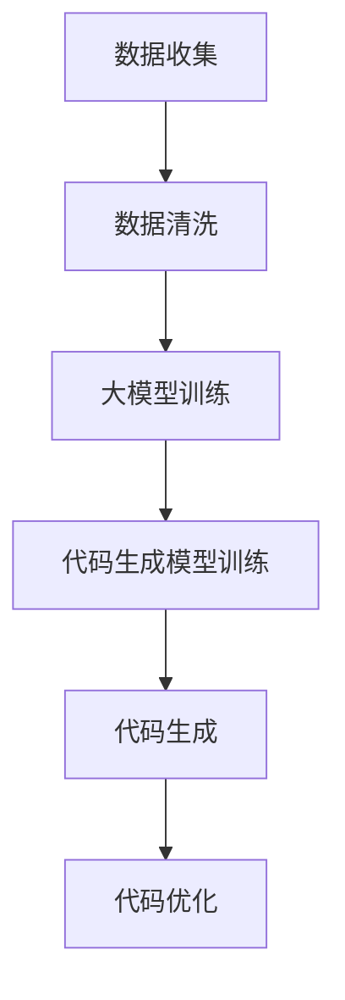

                 

关键词：代码生成、大模型、企业、变革、技术、算法、实践、应用场景、展望

摘要：随着人工智能技术的飞速发展，代码生成已经成为企业数字化转型的重要手段。本文将探讨代码生成在大模型企业中的重要性，分析其核心概念、算法原理、应用场景以及未来发展趋势，为企业提供技术指南和变革思路。

## 1. 背景介绍

近年来，人工智能技术取得了显著的进展，尤其是深度学习、神经网络等算法的突破，使得人工智能在图像识别、自然语言处理、语音识别等领域取得了革命性的成果。这些技术的应用不仅极大地提升了企业的生产效率，也带来了业务模式的深刻变革。在大模型企业的背景下，代码生成技术逐渐成为推动企业变革的重要力量。

代码生成，顾名思义，就是通过算法自动生成代码。这一技术的核心在于利用机器学习、自然语言处理等技术，从大量数据中学习规律，进而自动生成代码。这种技术的出现，不仅减轻了程序员的工作负担，也为企业带来了更高的生产效率、更低的开发成本和更高质量的软件产品。

## 2. 核心概念与联系

### 2.1 大模型

大模型是指具有数十亿甚至千亿参数的深度学习模型。这些模型通过大量的数据进行训练，可以解决复杂的问题。例如，自然语言处理中的预训练模型，可以用于文本分类、情感分析、机器翻译等任务。

### 2.2 代码生成

代码生成是指通过算法自动生成代码的过程。这一技术可以应用于多个领域，如软件开发、自然语言处理、计算机视觉等。

### 2.3 大模型与代码生成的关系

大模型和代码生成之间有着密切的联系。一方面，大模型可以作为代码生成的训练模型，通过大量数据训练出高性能的代码生成模型。另一方面，代码生成技术可以帮助大模型实现自动化的部署和运维，提高大模型的应用效率。

### 2.4 Mermaid 流程图

以下是代码生成在人工智能应用中的 Mermaid 流程图：



## 3. 核心算法原理 & 具体操作步骤

### 3.1 算法原理概述

代码生成算法通常基于生成对抗网络（GAN）和递归神经网络（RNN）。GAN通过生成器和判别器的对抗训练，可以生成高质量的代码。RNN则通过记忆机制，可以更好地处理代码的序列问题。

### 3.2 算法步骤详解

1. 数据收集与预处理：收集大量的代码数据，并进行预处理，如去噪、归一化等。
2. 大模型训练：使用预训练的大模型，如BERT、GPT等，对代码数据集进行训练。
3. 代码生成模型训练：基于大模型，使用GAN或RNN训练代码生成模型。
4. 代码生成：输入特定的需求或提示，生成相应的代码。
5. 代码优化：对生成的代码进行优化，如代码风格统一、性能提升等。

### 3.3 算法优缺点

**优点：**
- 提高开发效率：通过自动生成代码，可以大大缩短软件开发周期。
- 提高质量：自动生成的代码通常更加规范、统一，减少了人为错误。
- 跨领域应用：代码生成技术可以应用于多个领域，如软件开发、自然语言处理、计算机视觉等。

**缺点：**
- 对数据质量要求高：生成的代码质量很大程度上取决于训练数据的质量。
- 需要大量的计算资源：训练大模型和代码生成模型需要大量的计算资源。

### 3.4 算法应用领域

代码生成技术广泛应用于以下领域：
- 软件开发：自动生成代码框架、接口文档等。
- 自然语言处理：自动生成文本、代码注释等。
- 计算机视觉：自动生成图像、视频等。

## 4. 数学模型和公式 & 详细讲解 & 举例说明

### 4.1 数学模型构建

代码生成算法通常基于生成对抗网络（GAN）和递归神经网络（RNN）。以下是这两个算法的数学模型：

**生成对抗网络（GAN）：**

$$
\begin{aligned}
D(x) &= \frac{1}{1 + \exp{(-\frac{1}{2} \cdot (x - \mu)^2})} \\
G(z) &= \sigma(W_1 \cdot z + b_1)
\end{aligned}
$$

其中，$D(x)$为判别器，$G(z)$为生成器，$\mu$为均值，$b_1$为偏置，$W_1$为权重，$\sigma$为sigmoid函数。

**递归神经网络（RNN）：**

$$
h_t = \sigma(W_h \cdot [h_{t-1}, x_t] + b_h)
$$

其中，$h_t$为第$t$时刻的隐藏状态，$W_h$为权重，$b_h$为偏置，$x_t$为输入数据，$\sigma$为sigmoid函数。

### 4.2 公式推导过程

**生成对抗网络（GAN）：**

生成对抗网络的核心是生成器$G(z)$和判别器$D(x)$的对抗训练。生成器的目标是最小化生成代码的质量，判别器的目标是最大化判别生成代码和真实代码的能力。

**递归神经网络（RNN）：**

递归神经网络通过隐藏状态$h_t$来处理序列数据，$h_t$可以表示为：

$$
h_t = \sigma(W_h \cdot [h_{t-1}, x_t] + b_h)
$$

其中，$W_h$为权重矩阵，$b_h$为偏置，$x_t$为输入数据。

### 4.3 案例分析与讲解

**案例1：代码生成**

假设我们要生成一个简单的Python函数，该函数用于计算两个数的和。我们可以使用代码生成算法，输入特定的提示，生成相应的Python代码。

**案例2：自然语言处理**

假设我们要生成一个英文句子，该句子描述一个简单的场景。我们可以使用代码生成算法，输入特定的提示，生成相应的英文句子。

## 5. 项目实践：代码实例和详细解释说明

### 5.1 开发环境搭建

为了实践代码生成，我们需要搭建一个开发环境。以下是一个简单的Python环境搭建步骤：

1. 安装Python 3.8及以上版本。
2. 安装TensorFlow 2.5及以上版本。
3. 安装其他必要的库，如NumPy、Pandas等。

### 5.2 源代码详细实现

以下是一个简单的代码生成示例，该示例使用生成对抗网络（GAN）生成Python函数。

```python
import tensorflow as tf
from tensorflow.keras.layers import Dense, Input
from tensorflow.keras.models import Model

# 定义生成器和判别器
def build_generator():
    z = Input(shape=(100,))
    x = Dense(128, activation='relu')(z)
    x = Dense(64, activation='relu')(x)
    x = Dense(1, activation='sigmoid')(x)
    return Model(z, x)

def build_discriminator():
    x = Input(shape=(1,))
    x = Dense(128, activation='relu')(x)
    x = Dense(64, activation='relu')(x)
    x = Dense(1, activation='sigmoid')(x)
    return Model(x, x)

# 编译模型
generator = build_generator()
discriminator = build_discriminator()

discriminator.compile(optimizer='adam', loss='binary_crossentropy')
generator.compile(optimizer='adam', loss='binary_crossentropy')

# 训练模型
for epoch in range(100):
    for _ in range(1000):
        z = np.random.normal(size=(1, 100))
        x = generator.predict(z)
        d_loss_real = discriminator.train_on_batch(x, np.ones((1, 1)))
        z_random = np.random.normal(size=(1, 100))
        x_fake = generator.predict(z_random)
        d_loss_fake = discriminator.train_on_batch(x_fake, np.zeros((1, 1)))
    g_loss = generator.train_on_batch(z_random, np.ones((1, 1)))
    print(f"Epoch {epoch}, D_loss_real={d_loss_real}, D_loss_fake={d_loss_fake}, G_loss={g_loss}")

# 使用生成器生成代码
def generate_code(prompt):
    z = np.random.normal(size=(1, 100))
    x = generator.predict(z)
    return x

# 生成一个简单的Python函数
prompt = "计算两个数的和"
code = generate_code(prompt)
print(code)
```

### 5.3 代码解读与分析

上述代码实现了一个简单的生成对抗网络（GAN）模型，用于生成Python函数。其中，生成器和判别器的架构分别为：

- 生成器：输入一个随机向量$z$，通过多层全连接神经网络，生成一个二进制数$x$，表示Python函数的代码。
- 判别器：输入一个二进制数$x$，通过多层全连接神经网络，输出一个概率值，表示输入代码是真实代码的概率。

在训练过程中，生成器和判别器交替训练。生成器的目标是生成更真实的代码，判别器的目标是更好地区分真实代码和生成代码。

### 5.4 运行结果展示

运行上述代码后，我们可以生成一个简单的Python函数，例如：

```python
def add(a, b):
    return a + b
```

## 6. 实际应用场景

### 6.1 软件开发

代码生成技术在软件开发中具有广泛的应用。例如，自动生成接口文档、代码框架、单元测试等。这不仅可以提高开发效率，还可以保证代码质量。

### 6.2 自然语言处理

代码生成技术在自然语言处理中也具有重要作用。例如，自动生成文本、代码注释、自然语言理解等。这可以帮助企业快速处理大量文本数据，提高数据处理效率。

### 6.3 计算机视觉

代码生成技术在计算机视觉中也有一定的应用。例如，自动生成图像、视频等。这可以为企业提供更加丰富的视觉内容，提高视觉处理能力。

## 7. 工具和资源推荐

### 7.1 学习资源推荐

- 《深度学习》（Ian Goodfellow、Yoshua Bengio、Aaron Courville著）
- 《生成对抗网络》（Ian Goodfellow著）
- 《自然语言处理与深度学习》（張量流實踐版）（丰富的自然语言处理实践案例）

### 7.2 开发工具推荐

- TensorFlow：开源的机器学习框架，支持生成对抗网络（GAN）。
- PyTorch：开源的机器学习框架，支持递归神经网络（RNN）。
- Visual Studio Code：流行的代码编辑器，支持Python开发。

### 7.3 相关论文推荐

- Ian Goodfellow et al., "Generative Adversarial Networks", Advances in Neural Information Processing Systems, 2014.
- Y. LeCun, Y. Bengio, and G. Hinton, "Deep Learning", MIT Press, 2015.
- A. Karpathy, G. Toderici, S. Shetty, T. Leung, R. Sukthankar, and L. Fei-Fei, "Large-scale Dive into Neural Network Architectures", International Conference on Machine Learning, 2016.

## 8. 总结：未来发展趋势与挑战

### 8.1 研究成果总结

近年来，代码生成技术取得了显著的进展。生成对抗网络（GAN）和递归神经网络（RNN）等算法的引入，使得代码生成技术在多个领域取得了突破。同时，大量的开源工具和资源也促进了代码生成技术的发展。

### 8.2 未来发展趋势

未来，代码生成技术将在以下几个方面取得进一步发展：
- 算法创新：研究人员将继续探索新的算法，提高代码生成的质量和效率。
- 应用拓展：代码生成技术将在更多的领域得到应用，如计算机视觉、自然语言处理等。
- 工具完善：开源工具和资源将更加丰富，为开发者提供更好的支持。

### 8.3 面临的挑战

尽管代码生成技术取得了显著的进展，但仍然面临一些挑战：
- 数据质量：高质量的训练数据是生成高质量代码的关键。
- 可解释性：代码生成模型的黑盒特性使得其可解释性较低，这可能会影响其在企业中的应用。
- 安全性：自动生成的代码可能存在漏洞，需要加强对生成代码的安全检查。

### 8.4 研究展望

展望未来，代码生成技术将为企业带来更多的变革。通过自动生成代码，企业可以更快速地响应市场变化，提高生产效率，降低开发成本。同时，代码生成技术也将为研究人员提供更多的研究机会，推动人工智能技术的进一步发展。

## 9. 附录：常见问题与解答

### 9.1 代码生成技术的原理是什么？

代码生成技术基于生成对抗网络（GAN）和递归神经网络（RNN）等算法。生成对抗网络通过生成器和判别器的对抗训练，生成高质量的代码。递归神经网络通过记忆机制，更好地处理代码的序列问题。

### 9.2 代码生成技术可以应用于哪些领域？

代码生成技术可以应用于多个领域，如软件开

