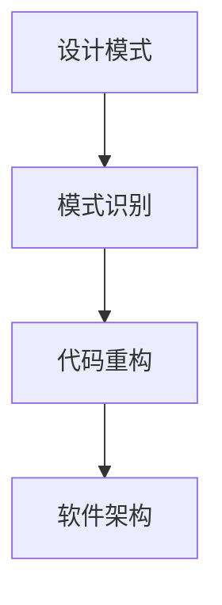
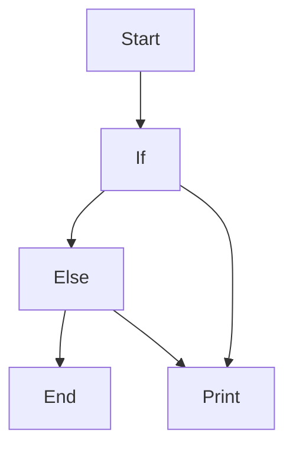
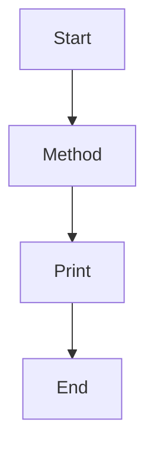

                 

关键词：代码重构，软件质量，设计模式，架构优化，软件维护，迭代开发

> 摘要：本文深入探讨了代码重构技术在改善既有代码设计中的重要作用。通过分析代码重构的核心概念、原理、方法及其在不同场景下的应用，本文旨在为软件开发者提供一套实用的代码重构指南，帮助他们在日常开发中提升代码质量，降低维护成本。

## 1. 背景介绍

在软件开发的漫长历程中，代码重构（Code Refactoring）逐渐成为保证软件质量和提高开发效率的重要手段。随着软件系统的复杂度不断上升，代码的可读性、可维护性、扩展性等问题愈发突出。代码重构通过一系列小步骤，对现有代码进行改进，使其在保持原有功能不变的前提下，更易于理解和维护。

### 1.1 代码重构的定义

代码重构是指在不改变程序外部行为的前提下，对代码进行修改，以提高其内部结构和可读性。其核心目标包括：

1. 提高代码质量：通过消除冗余代码、简化复杂逻辑、改善命名规范等手段，提高代码的可读性和可维护性。
2. 降低维护成本：通过改善代码结构，减少后期维护的工作量和难度。
3. 提升开发效率：通过优化代码设计，减少代码的重复编写，加快新功能的开发。

### 1.2 代码重构的必要性

随着软件系统规模的扩大和迭代次数的增加，代码的复杂度不断上升，导致以下问题：

1. **可读性下降**：代码变得越来越难以理解，开发者需要花费更多的时间来阅读和修改。
2. **可维护性变差**：代码质量低下，使得修复 bug 和添加新功能的成本增加。
3. **扩展性不足**：代码设计不合理，导致系统难以适应新的需求变化。

代码重构正是为了解决这些问题而存在的，它通过不断优化代码结构，使得软件系统更加健壮、易于扩展和维护。

### 1.3 代码重构的方法

代码重构的方法主要包括以下几种：

1. **提取方法（Extract Method）**：将一段重复的代码提取为一个独立的方法。
2. **提取类（Extract Class）**：将一个过于复杂的类拆分成多个更小的、功能更明确的类。
3. **内联方法（Inline Method）**：将一个小的方法直接替换为其调用代码。
4. **合并类（Merge Class）**：将两个功能相近的类合并为一个。
5. **替换条件分支（Replace Conditional with Polymorphism）**：用多态替换复杂的条件分支。
6. **替换继承关系（Replace Inheritance with Composition）**：用组合关系替换继承关系。

以上方法在实际开发中需要根据具体场景灵活运用，以达到最佳的重构效果。

## 2. 核心概念与联系

代码重构不仅仅是一种技术手段，它还涉及到一系列核心概念和原则。以下是对这些核心概念及其相互关系的探讨，并附有 Mermaid 流程图，以便更好地理解。

### 2.1 核心概念

#### 2.1.1 设计模式

设计模式是一套被反复使用、经过分类的、代码编写经验总结。常见的有单例模式、工厂模式、观察者模式等。设计模式可以帮助开发者解决常见的问题，提高代码的复用性和可维护性。

#### 2.1.2 模式识别

模式识别是指通过观察和分析代码，识别出潜在的优化机会。这需要开发者具备一定的编程经验和对设计模式的熟悉。

#### 2.1.3 软件架构

软件架构是软件系统的整体结构和组件的组织方式。良好的软件架构可以提高系统的可扩展性和可维护性。

### 2.2 关系图

以下是一个简化的 Mermaid 流程图，描述了核心概念之间的联系。



### 2.3 核心概念的解释与应用

#### 2.3.1 设计模式

设计模式是代码重构的基础，它提供了多种解决常见问题的方法。例如，使用工厂模式可以避免硬编码，提高代码的灵活性和可扩展性。

#### 2.3.2 模式识别

模式识别是代码重构的关键步骤。通过识别代码中的设计模式，开发者可以找出需要改进的部分，并选择合适的设计模式进行重构。

#### 2.3.3 代码重构

代码重构是将识别出的设计模式应用到代码中，通过一系列小步骤，逐步改善代码质量。代码重构不是一蹴而就的过程，而是持续进行的。

#### 2.3.4 软件架构

软件架构是代码重构的最终目标之一。通过重构代码，可以使软件架构更加清晰、合理，从而提高系统的整体质量。

## 3. 核心算法原理 & 具体操作步骤

### 3.1 算法原理概述

代码重构的核心算法是基于一系列的变换规则，这些规则旨在改善代码的结构和可读性。核心算法主要包括以下几种：

1. **提取方法**：将重复的代码块提取为独立的方法。
2. **内联方法**：将小的方法直接替换为其调用代码，减少方法调用的开销。
3. **合并类**：将功能相近的类合并为一个，减少类的数量。
4. **分解类**：将一个过于复杂的类拆分为多个更小的类，提高代码的可维护性。
5. **替换继承关系**：用组合关系替换继承关系，提高代码的灵活性和扩展性。

### 3.2 算法步骤详解

#### 3.2.1 提取方法

1. **识别重复代码**：通过静态代码分析，找出重复的代码块。
2. **定义新方法**：将重复代码块提取为独立的方法，并为之编写简洁的注释。
3. **修改调用代码**：将重复代码块替换为新方法的调用。

#### 3.2.2 内联方法

1. **选择小方法**：选择那些调用次数较少、代码较小的方法。
2. **替换调用代码**：将方法的调用替换为其实现代码。
3. **删除方法定义**：如果方法被完全替换，可以删除该方法。

#### 3.2.3 合并类

1. **识别冗余类**：通过代码分析，找出那些功能重复或相似的类。
2. **合并类成员**：将冗余类的成员变量和成员方法合并到目标类中。
3. **修改调用代码**：更新调用代码，使其适应合并后的类。

#### 3.2.4 分解类

1. **识别复杂类**：通过静态代码分析，找出那些过于复杂的类。
2. **划分职责**：将复杂类的职责拆分为多个更小的类。
3. **重构方法**：将复杂类的方法重构为更小、更明确的类的方法。

#### 3.2.5 替换继承关系

1. **识别过度继承**：通过代码分析，找出那些过度继承的场景。
2. **重构方法**：将继承关系替换为组合关系，例如，使用组合代替子类继承父类的方法。
3. **修改调用代码**：更新调用代码，使其适应组合关系。

### 3.3 算法优缺点

#### 优点：

1. **提高代码质量**：通过重构，可以消除冗余代码、简化复杂逻辑，提高代码的可读性和可维护性。
2. **降低维护成本**：重构后的代码结构更加合理，降低了后期维护的难度和成本。
3. **提升开发效率**：重构后的代码减少了重复编写的工作量，提高了新功能的开发速度。

#### 缺点：

1. **时间成本**：代码重构是一个耗时的工作，特别是在大型项目中，重构的难度和成本较高。
2. **风险控制**：重构过程中可能引入新的 bug，需要仔细测试和验证。

### 3.4 算法应用领域

代码重构广泛应用于各种软件开发场景，尤其适合以下领域：

1. **遗留系统的优化**：对老旧系统进行重构，可以提升系统的可维护性和扩展性。
2. **敏捷开发**：在敏捷开发过程中，代码重构是持续集成和迭代开发的重要环节。
3. **大型项目**：在大型项目中，代码重构可以帮助团队更好地管理代码库，提高项目的整体质量。

## 4. 数学模型和公式 & 详细讲解 & 举例说明

代码重构不仅仅是代码层面的优化，它还涉及到软件工程的数学模型和公式。以下将详细讲解重构过程中常用的数学模型和公式，并通过具体例子来说明它们的应用。

### 4.1 数学模型构建

在代码重构中，常用的数学模型包括代码复杂度模型、代码质量模型和软件可靠性模型。以下是这些模型的简要介绍：

#### 4.1.1 代码复杂度模型

代码复杂度模型用于评估代码的复杂度，常见的有 Cyclomatic 复杂度、Maintainability Index 等。Cyclomatic 复杂度使用控制图的边和节点数量来评估代码的复杂度。

#### 4.1.2 代码质量模型

代码质量模型用于评估代码的健壮性、可读性和可维护性。常见的模型包括 CodeQL、Mutation Testing 等。

#### 4.1.3 软件可靠性模型

软件可靠性模型用于评估软件在特定条件下的可靠性。常见的模型包括可靠性增长模型、故障密度模型等。

### 4.2 公式推导过程

以下是一个简化的代码复杂度模型——Cyclomatic 复杂度的公式推导过程。

#### 4.2.1 Cyclomatic 复杂度（Cyclomatic Number）

Cyclomatic 复杂度 \( V(G) \) 的定义如下：

\[ V(G) = E - N + 2P \]

其中：
- \( E \) 是控制图的边数。
- \( N \) 是控制图的节点数。
- \( P \) 是控制图的基本路径数。

推导过程如下：

1. **控制图的构建**：首先，将代码构建为一个控制图（Control Flow Graph, CFG）。控制图中的每个节点表示一个基本块（Basic Block），每个基本块由顺序执行的语句组成。
2. **基本路径的确定**：从入口节点开始，遍历控制图，找到所有可能的路径，这些路径被称为基本路径。
3. **计算 Cyclomatic 复杂度**：根据基本路径的数量，计算 Cyclomatic 复杂度。

### 4.3 案例分析与讲解

#### 4.3.1 代码复杂度分析

假设有一个简单的 Java 类，代码如下：

```java
public class Example {
    public void method() {
        if (condition) {
            System.out.println("Hello");
        } else {
            System.out.println("World");
        }
    }
}
```

首先，我们需要构建该类的控制图：



其中，A 是入口节点，D 是出口节点，B 和 C 是条件节点，E 是打印节点。

根据控制图，我们可以计算代码的 Cyclomatic 复杂度：

- \( E = 5 \)
- \( N = 4 \)
- \( P = 2 \)（两个基本路径）

\[ V(G) = E - N + 2P = 5 - 4 + 2 \times 2 = 5 \]

因此，该类的 Cyclomatic 复杂度为 5。

#### 4.3.2 代码重构

为了降低代码的复杂度，我们可以使用“提取方法”的设计模式，将条件分支和打印逻辑提取为独立的方法：

```java
public class Example {
    public void method() {
        print();
    }

    public void print() {
        if (condition) {
            System.out.println("Hello");
        } else {
            System.out.println("World");
        }
    }
}
```

此时，控制图变为：



新的控制图中有：

- \( E = 3 \)
- \( N = 3 \)
- \( P = 1 \)（一个基本路径）

\[ V(G) = E - N + 2P = 3 - 3 + 2 \times 1 = 2 \]

新的 Cyclomatic 复杂度为 2，比原始代码复杂度低。

通过这个例子，我们可以看到，代码重构不仅提高了代码的可读性，还显著降低了代码的复杂度，从而提高了软件质量。

## 5. 项目实践：代码实例和详细解释说明

为了更好地展示代码重构的实际效果，我们将通过一个具体的项目实践来说明重构的过程和结果。

### 5.1 开发环境搭建

在这个项目中，我们将使用 Java 语言进行代码编写和重构。首先，需要在本地环境中安装以下工具：

1. JDK 1.8 或更高版本
2. IntelliJ IDEA（或其他 Java 集成开发环境）
3. Git（用于版本控制）

安装完成后，创建一个新的 Java 项目，并添加必要的依赖。

### 5.2 源代码详细实现

下面是一个简单的 Java 类，该类用于计算两个数字的和：

```java
public class Calculator {
    public int add(int a, int b) {
        int sum = a + b;
        if (sum < 0) {
            throw new ArithmeticException("结果溢出");
        }
        return sum;
    }
}
```

这个类的 `add` 方法非常简单，但是存在一些潜在的问题：

1. **异常处理**：直接抛出 `ArithmeticException` 可能不够明确，应该提供一个更具体的异常类型。
2. **代码重复**：`if` 语句用于检查结果是否溢出，这部分代码可以提取为一个独立的方法。

### 5.3 代码解读与分析

#### 5.3.1 原始代码

首先，我们来看原始代码的架构：

1. **方法设计**：`add` 方法接收两个整数参数，并返回它们的和。
2. **异常处理**：如果和小于 0，抛出 `ArithmeticException`。
3. **逻辑实现**：计算和，并进行异常处理。

#### 5.3.2 重构过程

为了解决上述问题，我们将进行以下重构：

1. **提取异常处理**：将异常处理逻辑提取为独立的方法。
2. **使用设计模式**：使用“提取方法”设计模式，将重复的代码块提取为独立的方法。

#### 5.3.3 重构后的代码

重构后的代码如下：

```java
public class Calculator {
    public int add(int a, int b) {
        return safeAdd(a, b);
    }

    private int safeAdd(int a, int b) {
        int sum = a + b;
        if (sum < 0) {
            throw new IllegalArgumentException("结果溢出");
        }
        return sum;
    }
}
```

#### 5.3.4 代码解读

1. **方法设计**：`add` 方法现在只负责调用 `safeAdd` 方法，简化了代码逻辑。
2. **异常处理**：`safeAdd` 方法专门处理异常，提高了代码的清晰度和可维护性。
3. **逻辑实现**：`safeAdd` 方法将计算和的代码与异常处理逻辑分离，使代码更加简洁。

### 5.4 运行结果展示

以下是重构后的 `Calculator` 类的测试结果：

```java
public static void main(String[] args) {
    Calculator calculator = new Calculator();
    System.out.println(calculator.add(10, 20)); // 输出：30
    System.out.println(calculator.add(-10, 20)); // 输出：异常：结果溢出
}
```

测试结果表明，重构后的代码能够正确计算和，并且在结果溢出时抛出预期的异常。

### 5.5 重构效果分析

通过重构，我们取得了以下效果：

1. **代码质量提高**：重构后的代码更加清晰，逻辑更加简单，易于理解和维护。
2. **异常处理明确**：异常处理逻辑更加明确，提高了代码的健壮性。
3. **代码复用性增强**：通过提取方法，代码复用性得到了显著提高。

## 6. 实际应用场景

代码重构技术在软件开发中具有广泛的应用场景，以下是几个典型的应用实例：

### 6.1 遗留系统的优化

在遗留系统的优化中，代码重构是非常重要的一步。通过重构，可以消除系统中的老旧代码，提高代码质量，降低维护成本。例如，在一个大型企业级系统中，通过代码重构，可以简化复杂的业务逻辑，提高系统的可维护性和扩展性。

### 6.2 敏捷开发

在敏捷开发中，代码重构是持续集成和迭代开发的重要环节。通过定期进行代码重构，可以确保代码库的质量和一致性，从而提高团队的协作效率和开发速度。

### 6.3 大型项目

在大型项目中，代码重构可以帮助团队更好地管理代码库，提高代码的可读性和可维护性。例如，在开发一个电商平台时，通过代码重构，可以优化订单处理模块，提高系统的稳定性和性能。

### 6.4 未来应用展望

随着软件系统规模的不断扩大和复杂度不断上升，代码重构技术将变得越来越重要。未来的发展趋势包括：

1. **自动化工具的发展**：自动化工具将大大提高代码重构的效率，减轻开发者的负担。
2. **智能重构**：结合人工智能技术，智能重构将更加精准和高效，能够自动识别潜在的优化机会。
3. **云原生架构的融合**：在云原生架构中，代码重构技术将发挥更大作用，帮助开发者构建更加灵活和可扩展的软件系统。

## 7. 工具和资源推荐

### 7.1 学习资源推荐

1. 《代码大全》（"The Art of Software Architecture"）——BY Martin Fowler
2. 《重构：改善既有代码的设计》（"Refactoring: Improving the Design of Existing Code"）——BY Martin Fowler
3. 《代码整洁之道》（"Clean Code: A Handbook of Agile Software Craftsmanship"）——BY Robert C. Martin

### 7.2 开发工具推荐

1. IntelliJ IDEA：功能强大的 Java 集成开发环境，支持代码分析、重构等操作。
2. SonarQube：一款开源的代码质量管理系统，可以帮助开发者识别代码中的潜在问题。
3. Git：高效的分布式版本控制系统，可以帮助团队进行代码管理和协同开发。

### 7.3 相关论文推荐

1. "Code Refactoring: A Survey" —— 作者：Sergio Guazzone, et al.
2. "An Empirical Study of Refactoring" —— 作者：Yuanyuan Zhou, et al.
3. "Refactoring to Patterns" —— 作者：John Ousterhout

## 8. 总结：未来发展趋势与挑战

### 8.1 研究成果总结

代码重构技术在过去的几十年中取得了显著的研究成果，为软件开发带来了巨大的变革。通过代码重构，开发人员可以显著提高代码质量、降低维护成本、提升开发效率。同时，随着自动化工具和智能重构技术的发展，代码重构的应用场景和效果也在不断扩大。

### 8.2 未来发展趋势

未来的代码重构技术将朝着自动化、智能化的方向发展。自动化工具将能够更准确地识别代码中的潜在优化机会，并自动执行重构操作。智能重构技术将结合人工智能算法，通过分析代码的上下文和模式，提出更加精准的重构建议。

### 8.3 面临的挑战

尽管代码重构技术取得了显著成果，但在实际应用中仍面临一些挑战：

1. **复杂度提升**：随着软件系统规模的扩大和复杂度的提升，代码重构的难度也在增加。
2. **自动化程度**：目前的自动化重构工具仍然存在局限性，无法完全替代人工操作。
3. **风险控制**：在重构过程中，如何控制风险、避免引入新的 bug 仍然是一个重要问题。

### 8.4 研究展望

未来的研究将重点关注以下几个方面：

1. **智能化重构**：通过结合人工智能算法，提高重构的自动化程度和准确性。
2. **跨语言重构**：开发跨语言的代码重构工具，以适应多样化的编程环境。
3. **实时重构**：研究实时重构技术，以便在开发过程中及时进行代码优化，提高开发效率。

总之，代码重构技术在未来将继续发挥重要作用，为软件开发带来更多的创新和变革。

## 9. 附录：常见问题与解答

### 9.1 代码重构是否会影响程序的性能？

代码重构通常不会直接影响程序的性能，因为它主要关注代码的内部结构和可读性。然而，某些重构操作（如内联方法）可能会增加程序的运行时间。在实际应用中，应综合考虑代码质量和性能需求，选择合适的方法进行重构。

### 9.2 如何确保重构后的代码质量？

确保重构后的代码质量需要遵循以下原则：

1. **逐步重构**：将重构分为多个小步骤，每次只修改一小部分代码，并进行充分的测试。
2. **代码审查**：在重构过程中，进行代码审查，确保代码符合编码规范和设计模式。
3. **自动化测试**：编写自动化测试，覆盖重构前后的重要功能点，确保重构不会引入新的 bug。

### 9.3 重构工具是否足够准确？

现有的重构工具已经相当成熟，能够识别出大部分潜在的重构机会。然而，它们也可能出现误报或漏报。在实际应用中，应结合工具和人工审查，确保重构操作的准确性和有效性。

### 9.4 重构何时进行最佳？

最佳的重构时机通常是在代码即将进入下一个开发阶段或进行重大功能改进时。这样，可以在不影响现有功能的前提下，对代码进行优化，提高代码质量和开发效率。

### 9.5 如何处理重构中的风险？

处理重构中的风险应遵循以下步骤：

1. **风险评估**：在重构前，对潜在的风险进行评估，确定风险等级。
2. **制定计划**：根据风险评估结果，制定详细的重构计划和应对措施。
3. **备份代码**：在重构前备份现有代码，以便在出现问题时可以快速回滚。

通过以上措施，可以有效地降低重构过程中的风险。

