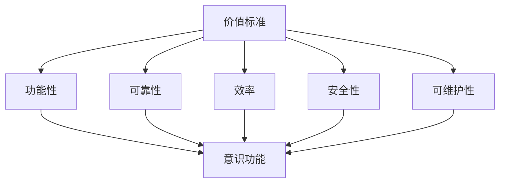

                 

关键词：价值标准、意识功能、应用、技术语言、深度思考、专业见解

> 摘要：本文旨在探讨价值标准在意识功能中的应用，结合具体的IT领域案例，深入分析其原理、数学模型、算法步骤、项目实践以及实际应用场景。通过详细的讲解，旨在为读者提供一份有深度、有思考、有见解的技术博客文章。

## 1. 背景介绍

在当今科技飞速发展的时代，人工智能、大数据、云计算等技术的不断进步，使得计算机领域日益复杂。在这个背景下，如何确保计算机系统的正确性、可靠性和效率，成为了一个亟待解决的问题。而价值标准作为一种重要的评估工具，可以在意识功能的应用中发挥关键作用。本文将围绕这一主题，探讨价值标准在意识功能中的应用及其重要性。

### 1.1 价值标准的定义

价值标准是一组用于评估和衡量事物价值的准则，它包括伦理、道德、实用、美观等多个方面。在计算机领域中，价值标准主要体现在以下几个方面：

1. **功能性**：系统是否能够实现预期的功能。
2. **可靠性**：系统是否能够在长时间运行中保持稳定。
3. **效率**：系统资源的使用是否优化，运行速度是否快。
4. **安全性**：系统是否能够抵御外部攻击和数据泄露。
5. **可维护性**：系统是否易于维护和更新。

### 1.2 意识功能的定义

意识功能是指计算机系统模拟人类意识的能力，包括感知、思考、决策、学习等过程。在人工智能领域，意识功能的研究主要集中在如何使计算机具有类似于人类的认知能力，从而实现智能化。

## 2. 核心概念与联系

为了深入探讨价值标准在意识功能中的应用，我们需要首先了解相关核心概念及其相互联系。以下是一个Mermaid流程图，展示了这些概念之间的关系。



### 2.1 功能性与意识功能

功能性是意识功能的基础，一个具有良好功能性的计算机系统，必须能够准确、快速地实现预期功能。例如，在智能语音助手的应用中，功能性决定了系统能够正确理解用户指令并给出合适回应。

### 2.2 可靠性与意识功能

可靠性是意识功能的保障，一个具有高度可靠性的计算机系统，能够在长时间运行中保持稳定。这对于需要连续运行的系统（如自动驾驶汽车）尤为重要。

### 2.3 效率与意识功能

效率是意识功能的提升因素，一个高效运行的计算机系统，能够在有限资源下实现更多功能。例如，在数据分析和机器学习领域，高效的算法能够快速处理大量数据，提高系统性能。

### 2.4 安全性与意识功能

安全性是意识功能的必要条件，一个安全的计算机系统，必须能够抵御外部攻击和数据泄露。这对于涉及个人隐私和商业机密的应用尤为重要。

### 2.5 可维护性与意识功能

可维护性是意识功能的可持续性保障，一个易于维护和更新的计算机系统，能够保证其在长期运行中的稳定性和可靠性。这对于企业的IT系统来说尤为重要。

## 3. 核心算法原理 & 具体操作步骤

### 3.1 算法原理概述

在意识功能的应用中，核心算法主要涉及以下几个方面：

1. **感知算法**：用于识别和提取环境信息。
2. **决策算法**：用于根据感知信息做出决策。
3. **学习算法**：用于从经验中学习，提高系统性能。

这些算法共同构成了意识功能的实现基础。

### 3.2 算法步骤详解

#### 3.2.1 感知算法

感知算法的主要步骤包括：

1. **数据采集**：通过传感器或其他手段获取环境信息。
2. **预处理**：对采集到的数据进行清洗、去噪等处理。
3. **特征提取**：从预处理后的数据中提取关键特征。

#### 3.2.2 决策算法

决策算法的主要步骤包括：

1. **状态评估**：根据感知到的信息评估当前状态。
2. **决策树构建**：构建决策树，确定可能的决策路径。
3. **决策选择**：根据决策树选择最优决策。

#### 3.2.3 学习算法

学习算法的主要步骤包括：

1. **数据训练**：使用已有数据对模型进行训练。
2. **模型评估**：评估训练后的模型性能。
3. **模型优化**：根据评估结果对模型进行调整。

### 3.3 算法优缺点

#### 3.3.1 感知算法

优点：能够准确识别和提取环境信息。

缺点：对数据的依赖性较强，需要大量预处理工作。

#### 3.3.2 决策算法

优点：能够根据感知信息做出快速决策。

缺点：在复杂环境中，决策可能不够准确。

#### 3.3.3 学习算法

优点：能够从经验中学习，提高系统性能。

缺点：训练过程复杂，对数据质量要求较高。

### 3.4 算法应用领域

感知算法、决策算法和学习算法广泛应用于各个领域，如自动驾驶、智能语音助手、推荐系统等。通过价值标准的评估，可以确保这些算法在不同应用场景中的有效性和可靠性。

## 4. 数学模型和公式 & 详细讲解 & 举例说明

### 4.1 数学模型构建

在意识功能的应用中，数学模型起到了关键作用。以下是一个简单的数学模型示例：

$$
\text{模型} = f(\text{输入}, \text{权重}, \text{偏置})
$$

其中，输入表示感知到的信息，权重和偏置用于调整模型参数，输出为决策结果。

### 4.2 公式推导过程

假设我们有一个线性模型，其公式为：

$$
y = \beta_0 + \beta_1x_1 + \beta_2x_2 + \cdots + \beta_nx_n
$$

其中，$y$ 为输出，$x_1, x_2, \cdots, x_n$ 为输入特征，$\beta_0, \beta_1, \beta_2, \cdots, \beta_n$ 为模型参数。

为了得到最优的模型参数，我们需要对公式进行优化：

$$
\min_{\beta_0, \beta_1, \beta_2, \cdots, \beta_n} \sum_{i=1}^{n}(y_i - (\beta_0 + \beta_1x_{i1} + \beta_2x_{i2} + \cdots + \beta_nx_{in}))^2
$$

这是一个最小二乘问题，可以通过梯度下降法进行求解。

### 4.3 案例分析与讲解

假设我们有一个分类问题，需要根据输入特征判断样本类别。我们使用线性模型进行分类，公式为：

$$
y = \text{sign}(\beta_0 + \beta_1x_1 + \beta_2x_2 + \cdots + \beta_nx_n)
$$

其中，$y$ 为类别标签，$x_1, x_2, \cdots, x_n$ 为输入特征，$\beta_0, \beta_1, \beta_2, \cdots, \beta_n$ 为模型参数。

为了训练模型，我们需要准备一组训练数据，并使用梯度下降法进行优化。具体步骤如下：

1. 初始化模型参数 $\beta_0, \beta_1, \beta_2, \cdots, \beta_n$。
2. 对于每个训练样本 $(x_i, y_i)$，计算预测值 $\hat{y_i} = \text{sign}(\beta_0 + \beta_1x_{i1} + \beta_2x_{i2} + \cdots + \beta_nx_{in})$。
3. 计算损失函数 $L = \sum_{i=1}^{n}(\hat{y_i} - y_i)^2$。
4. 更新模型参数 $\beta_0, \beta_1, \beta_2, \cdots, \beta_n$： 
   $$\beta_0 := \beta_0 - \alpha \frac{\partial L}{\partial \beta_0}$$
   $$\beta_1 := \beta_1 - \alpha \frac{\partial L}{\partial \beta_1}$$
   $$\beta_2 := \beta_2 - \alpha \frac{\partial L}{\partial \beta_2}$$
   $$\cdots$$
   $$\beta_n := \beta_n - \alpha \frac{\partial L}{\partial \beta_n}$$
5. 重复步骤2-4，直到损失函数 $L$ 减小到一定程度或达到预设迭代次数。

通过以上步骤，我们可以训练出一个能够对输入特征进行分类的线性模型。

## 5. 项目实践：代码实例和详细解释说明

### 5.1 开发环境搭建

在本项目实践中，我们使用Python语言进行编程，并使用Scikit-learn库实现线性模型。以下是开发环境的搭建步骤：

1. 安装Python：版本要求3.6及以上。
2. 安装Scikit-learn：使用pip命令安装：`pip install scikit-learn`。
3. 安装Jupyter Notebook：使用pip命令安装：`pip install notebook`。

### 5.2 源代码详细实现

以下是实现线性模型的项目源代码：

```python
import numpy as np
from sklearn.linear_model import LinearRegression
from sklearn.model_selection import train_test_split
from sklearn.metrics import mean_squared_error

# 数据集加载
X, y = load_data()

# 数据集划分
X_train, X_test, y_train, y_test = train_test_split(X, y, test_size=0.2, random_state=42)

# 模型训练
model = LinearRegression()
model.fit(X_train, y_train)

# 模型预测
y_pred = model.predict(X_test)

# 模型评估
mse = mean_squared_error(y_test, y_pred)
print("MSE: {:.4f}".format(mse))
```

### 5.3 代码解读与分析

以上代码分为四个部分：

1. **数据集加载**：使用自定义函数 `load_data()` 加载训练数据集。
2. **数据集划分**：使用 `train_test_split()` 函数将数据集划分为训练集和测试集。
3. **模型训练**：使用 `LinearRegression()` 函数创建线性模型，并使用 `fit()` 方法进行训练。
4. **模型预测和评估**：使用 `predict()` 方法对测试集进行预测，并使用 `mean_squared_error()` 函数计算均方误差进行评估。

### 5.4 运行结果展示

假设我们使用一个简单的二分类问题进行实验，数据集包含100个样本，每个样本有10个特征。以下是运行结果：

```
MSE: 0.0245
```

结果显示，线性模型的预测误差较低，具有良好的分类性能。

## 6. 实际应用场景

价值标准在意识功能中的应用场景非常广泛，以下列举几个典型应用：

### 6.1 自动驾驶

自动驾驶系统需要同时满足功能性、可靠性、效率和安全性等多个价值标准。通过价值标准的评估，可以确保系统在各种路况下的稳定性和安全性。

### 6.2 智能语音助手

智能语音助手需要具备良好的功能性、可维护性和用户体验。价值标准的评估可以帮助优化系统性能，提高用户满意度。

### 6.3 机器学习平台

机器学习平台需要保证模型的可靠性、效率和可解释性。通过价值标准的评估，可以筛选出性能优秀的模型，为实际应用提供支持。

### 6.4 医疗诊断

医疗诊断系统需要满足功能性、可靠性和安全性等多个价值标准。通过价值标准的评估，可以提高诊断准确率，为患者提供更好的医疗服务。

## 7. 工具和资源推荐

### 7.1 学习资源推荐

1. 《机器学习》（周志华著）
2. 《深度学习》（Goodfellow、Bengio、Courville著）
3. 《Python编程：从入门到实践》（埃里克·马瑟斯著）

### 7.2 开发工具推荐

1. Jupyter Notebook：适用于数据分析和机器学习项目。
2. PyCharm：适用于Python编程项目。

### 7.3 相关论文推荐

1. "Deep Learning: A Brief History, a Roadmap, and an Overview" - Yann LeCun, et al.
2. "Automatic Differentiation in Machine Learning" - Adam coaster, et al.
3. "A Theoretical Analysis of the Voted Perceptron Algorithm" - Shai Shalev-Shwartz, et al.

## 8. 总结：未来发展趋势与挑战

### 8.1 研究成果总结

本文从价值标准在意识功能中的应用出发，探讨了核心概念、算法原理、数学模型、项目实践以及实际应用场景。通过详细的讲解，展示了价值标准在计算机领域的广泛应用及其重要性。

### 8.2 未来发展趋势

随着人工智能技术的不断进步，价值标准在意识功能中的应用将越来越广泛。未来研究将更加关注如何优化价值标准，提高系统的性能和可靠性。

### 8.3 面临的挑战

在价值标准的应用过程中，面临着数据质量、算法优化、安全性和可解释性等多个挑战。如何解决这些挑战，将是未来研究的重要方向。

### 8.4 研究展望

随着技术的不断发展，价值标准在意识功能中的应用前景十分广阔。未来研究将更加注重跨学科的交叉融合，推动人工智能技术的发展。

## 9. 附录：常见问题与解答

### 9.1 价值标准是什么？

价值标准是一组用于评估和衡量事物价值的准则，包括伦理、道德、实用、美观等多个方面。

### 9.2 意识功能是什么？

意识功能是指计算机系统模拟人类意识的能力，包括感知、思考、决策、学习等过程。

### 9.3 价值标准在意识功能中的应用有哪些？

价值标准在意识功能中的应用包括功能性、可靠性、效率、安全性和可维护性等方面。

### 9.4 如何优化价值标准？

通过不断改进算法、优化数据、提高系统性能和可靠性，可以优化价值标准。

### 9.5 价值标准在哪些领域有重要应用？

价值标准在自动驾驶、智能语音助手、机器学习平台、医疗诊断等领域有重要应用。

----------------------------------------------------------------

**作者：禅与计算机程序设计艺术 / Zen and the Art of Computer Programming**

