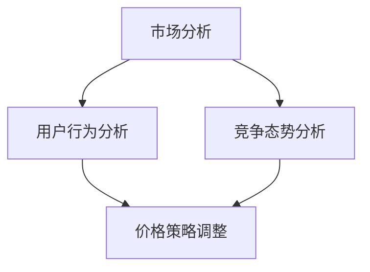

                 

价格优化是一个复杂的问题，涉及多个变量和影响因素。在这个数字化时代，人工智能（AI）在价格优化中的应用已经成为了提高企业竞争力的重要手段。本文将探讨AI如何通过分析市场数据、用户行为和竞争态势，自动调整商品价格，从而帮助企业实现利润最大化。

## 关键词

- 价格优化
- 人工智能
- 商品价格调整
- 市场分析
- 用户行为分析
- 竞争态势分析

## 摘要

本文将从AI在价格优化中的应用入手，介绍AI价格优化的核心概念、算法原理、数学模型以及实际应用。通过案例分析和项目实践，阐述AI价格优化的优势、局限性以及未来发展趋势，为企业提供实用的指导和建议。

### 1. 背景介绍

#### 1.1 价格优化的意义

价格优化是企业经营中的重要环节，直接关系到企业的利润和市场份额。传统的价格优化方法主要依赖于历史数据和专家经验，存在以下局限性：

- **数据依赖性高**：需要大量历史数据支持，数据质量直接影响优化效果。
- **分析周期长**：分析过程繁琐，难以实时响应市场变化。
- **人为因素影响大**：价格决策过程中存在主观判断，容易导致决策偏差。

AI技术的引入，为价格优化提供了新的思路和方法。通过大数据分析和机器学习算法，AI能够快速处理海量数据，识别市场规律和用户行为，实现智能化价格调整。

#### 1.2 AI在价格优化中的应用现状

目前，AI在价格优化中的应用已经取得了显著成效。许多企业开始借助AI技术进行价格监控、市场预测、用户细分等，以实现价格优化。以下是一些典型应用场景：

- **电商平台**：通过分析用户浏览、购买历史数据，自动调整商品价格，提高转化率和销售额。
- **制造业**：利用AI优化生产成本和库存管理，实现动态定价，降低生产成本，提高市场竞争力。
- **酒店和旅游行业**：根据用户需求和竞争对手价格，自动调整房价和旅游套餐价格，提高入住率和预订量。

### 2. 核心概念与联系

在探讨AI如何调整商品价格之前，我们需要了解一些核心概念，包括市场分析、用户行为分析、竞争态势分析等。以下是一个简化的Mermaid流程图，展示这些概念之间的关系：



#### 2.1 市场分析

市场分析是价格优化的基础。通过收集和分析市场数据，企业可以了解当前市场的需求状况、供需关系、价格走势等。市场分析的主要内容包括：

- **需求分析**：研究市场需求的变化趋势，了解用户对商品的需求程度。
- **供需分析**：分析市场上商品的供应情况，了解库存、生产能力和竞争对手的供应策略。
- **价格走势**：研究历史价格数据，了解价格波动规律，为价格调整提供依据。

#### 2.2 用户行为分析

用户行为分析是挖掘用户需求的重要手段。通过分析用户的浏览、购买、评价等行为数据，企业可以了解用户偏好、购买习惯和需求变化。用户行为分析的主要内容如下：

- **用户画像**：根据用户行为数据，构建用户画像，了解用户的年龄、性别、地域、职业等特征。
- **偏好分析**：分析用户对商品的评价和反馈，了解用户的偏好和需求。
- **购买行为分析**：研究用户的购买路径、购买频率和购买周期，了解用户的购买习惯。

#### 2.3 竞争态势分析

竞争态势分析是制定价格策略的重要依据。通过分析竞争对手的价格、促销策略和市场表现，企业可以了解市场竞争格局和自身在市场中的地位。竞争态势分析的主要内容如下：

- **竞争对手价格**：收集和分析竞争对手的价格数据，了解竞争对手的定价策略。
- **竞争对手促销**：研究竞争对手的促销活动，了解竞争对手的市场推广策略。
- **市场地位**：分析企业自身在市场中的地位，了解企业在市场竞争中的优势和劣势。

### 3. 核心算法原理 & 具体操作步骤

#### 3.1 算法原理概述

AI价格优化的核心算法主要包括市场预测、用户偏好分析和竞争态势分析。以下是这些算法的基本原理：

- **市场预测**：通过时间序列分析和回归分析等机器学习算法，预测未来市场需求和价格走势。
- **用户偏好分析**：利用协同过滤、聚类分析等算法，挖掘用户偏好和需求，为个性化定价提供依据。
- **竞争态势分析**：通过竞争态势分析算法，评估竞争对手的定价策略和市场表现，为企业制定价格策略提供参考。

#### 3.2 算法步骤详解

AI价格优化的具体操作步骤如下：

1. **数据收集与预处理**：收集市场数据、用户行为数据和竞争态势数据，并进行数据清洗和预处理，包括数据去重、缺失值处理、异常值处理等。
2. **市场预测**：利用时间序列分析和回归分析等算法，对市场需求和价格走势进行预测，为价格调整提供依据。
3. **用户偏好分析**：利用协同过滤、聚类分析等算法，挖掘用户偏好和需求，为个性化定价提供依据。
4. **竞争态势分析**：分析竞争对手的定价策略和市场表现，为企业制定价格策略提供参考。
5. **价格调整策略**：根据市场预测、用户偏好分析和竞争态势分析结果，制定价格调整策略，包括价格调整幅度、调整时机等。
6. **实施与监控**：实施价格调整策略，并对价格调整效果进行监控和评估，根据实际情况进行调整。

#### 3.3 算法优缺点

AI价格优化算法具有以下优点：

- **高效性**：通过机器学习算法，可以快速处理海量数据，实现实时价格调整。
- **准确性**：利用大数据分析和机器学习算法，可以更准确地预测市场走势和用户需求。
- **个性化**：通过用户偏好分析，可以实现个性化定价，提高用户满意度和转化率。

但AI价格优化算法也存在一些缺点：

- **数据依赖性**：算法效果受数据质量和数据量影响，需要大量高质量数据支持。
- **模型复杂性**：算法模型复杂，需要具备一定的专业知识和编程能力。
- **实时性**：算法实现实时价格调整具有一定难度，需要解决实时数据处理和传输问题。

#### 3.4 算法应用领域

AI价格优化算法广泛应用于以下领域：

- **电商平台**：通过个性化定价，提高用户满意度和转化率，增加销售额。
- **制造业**：通过动态定价，优化生产成本和库存管理，提高市场竞争力。
- **酒店和旅游行业**：通过智能定价，提高入住率和预订量，实现利润最大化。

### 4. 数学模型和公式 & 详细讲解 & 举例说明

#### 4.1 数学模型构建

AI价格优化的数学模型主要包括市场预测模型、用户偏好分析模型和竞争态势分析模型。以下是这些模型的构建方法：

1. **市场预测模型**

   市场预测模型通常采用时间序列分析方法，如ARIMA模型、LSTM模型等。以下是一个简化的ARIMA模型：

   $$ Y_t = \phi_1 Y_{t-1} + \phi_2 Y_{t-2} + ... + \phi_p Y_{t-p} + \theta_1 \epsilon_{t-1} + \theta_2 \epsilon_{t-2} + ... + \theta_q \epsilon_{t-q} + \epsilon_t $$

   其中，$Y_t$表示时间序列数据，$\phi_i$和$\theta_i$分别是自回归项和移动平均项的系数，$\epsilon_t$是误差项。

2. **用户偏好分析模型**

   用户偏好分析模型通常采用协同过滤算法，如基于用户的协同过滤（User-Based Collaborative Filtering）和基于物品的协同过滤（Item-Based Collaborative Filtering）。以下是一个简化的基于用户的协同过滤模型：

   $$ r_{ui} = \frac{\sum_{j \in N_i} r_{uj} \cdot sim(u_i, u_j)}{\sum_{j \in N_i} sim(u_i, u_j)} $$

   其中，$r_{ui}$表示用户$i$对物品$j$的评分预测，$N_i$表示与用户$i$相似的邻居用户集合，$sim(u_i, u_j)$表示用户$i$和用户$j$之间的相似度。

3. **竞争态势分析模型**

   竞争态势分析模型通常采用回归分析方法，如线性回归、逻辑回归等。以下是一个简化的线性回归模型：

   $$ y = \beta_0 + \beta_1 x_1 + \beta_2 x_2 + ... + \beta_n x_n $$

   其中，$y$表示企业市场价格，$x_i$表示影响价格的因素，如竞争对手价格、市场需求等，$\beta_i$是回归系数。

#### 4.2 公式推导过程

以下是市场预测模型ARIMA的公式推导过程：

1. **自回归模型（AR）**

   假设时间序列$Y_t$可以用以下自回归模型表示：

   $$ Y_t = \phi_1 Y_{t-1} + \phi_2 Y_{t-2} + ... + \phi_p Y_{t-p} + \epsilon_t $$

   其中，$\epsilon_t$是误差项。

   为了消除自相关性，可以采用差分方法，对时间序列进行一阶差分：

   $$ \Delta Y_t = Y_t - Y_{t-1} = (\phi_1 - 1) Y_{t-1} + \phi_2 Y_{t-2} + ... + \phi_p Y_{t-p} + \epsilon_t $$

   再次进行一阶差分：

   $$ \Delta^2 Y_t = \Delta Y_t - \Delta Y_{t-1} = (\phi_1 - 1) \Delta Y_{t-1} + \phi_2 \Delta Y_{t-2} + ... + \phi_p \Delta Y_{t-p} + \epsilon_t $$

   将$\Delta^2 Y_t$展开：

   $$ \Delta^2 Y_t = (\phi_1 - 1)(Y_{t-1} - Y_{t-2}) + \phi_2 \Delta Y_{t-2} + ... + \phi_p \Delta Y_{t-p} + \epsilon_t $$

   $$ \Delta^2 Y_t = (\phi_1 - 1)(Y_{t-1} - Y_{t-2}) + \phi_2 (\Delta Y_{t-2} - \Delta Y_{t-3}) + ... + \phi_p (\Delta Y_{t-p} - \Delta Y_{t-p-1}) + \epsilon_t $$

   将差分后的时间序列重新表示为：

   $$ Y_t = \phi_1 Y_{t-1} + \phi_2 Y_{t-2} + ... + \phi_p Y_{t-p} + (\phi_1 - 1) \Delta Y_{t-1} + \phi_2 \Delta Y_{t-2} + ... + \phi_p \Delta Y_{t-p} + \epsilon_t $$

   令$\phi^d_1 = \phi_1 - 1$，$\phi^d_2 = \phi_2$，...，$\phi^d_p = \phi_p$，则：

   $$ Y_t = \phi^d_1 Y_{t-1} + \phi^d_2 Y_{t-2} + ... + \phi^d_p Y_{t-p} + \epsilon_t $$

   这是一个$p$阶自回归模型（AR（p））。

2. **移动平均模型（MA）**

   假设时间序列$Y_t$可以用以下移动平均模型表示：

   $$ Y_t = \theta_1 \epsilon_{t-1} + \theta_2 \epsilon_{t-2} + ... + \theta_q \epsilon_{t-q} + \epsilon_t $$

   同样，为了消除自相关性，可以采用差分方法，对时间序列进行一阶差分：

   $$ \Delta Y_t = Y_t - Y_{t-1} = \theta_1 \epsilon_{t-1} + \theta_2 \epsilon_{t-2} + ... + \theta_q \epsilon_{t-q} + \epsilon_t - (\theta_1 \epsilon_{t-2} + \theta_2 \epsilon_{t-3} + ... + \theta_q \epsilon_{t-q-1} + \epsilon_{t-1}) $$

   $$ \Delta Y_t = (\theta_1 - 1) \epsilon_{t-1} + (\theta_2 - 1) \epsilon_{t-2} + ... + (\theta_q - 1) \epsilon_{t-q} + \epsilon_t $$

   再次进行一阶差分：

   $$ \Delta^2 Y_t = \Delta Y_t - \Delta Y_{t-1} = (\theta_1 - 1) \Delta Y_{t-1} + (\theta_2 - 1) \Delta Y_{t-2} + ... + (\theta_q - 1) \Delta Y_{t-q} + \epsilon_t $$

   将差分后的时间序列重新表示为：

   $$ Y_t = \theta_1 \epsilon_{t-1} + \theta_2 \epsilon_{t-2} + ... + \theta_q \epsilon_{t-q} + (\theta_1 - 1) \Delta Y_{t-1} + (\theta_2 - 1) \Delta Y_{t-2} + ... + (\theta_q - 1) \Delta Y_{t-q} + \epsilon_t $$

   令$\theta^{d}_1 = \theta_1 - 1$，$\theta^{d}_2 = \theta_2$，...，$\theta^{d}_q = \theta_q$，则：

   $$ Y_t = \theta^{d}_1 \Delta Y_{t-1} + \theta^{d}_2 \Delta Y_{t-2} + ... + \theta^{d}_q \Delta Y_{t-q} + \epsilon_t $$

   这是一个$q$阶移动平均模型（MA（q））。

3. **自回归移动平均模型（ARIMA）**

   将自回归模型和移动平均模型结合，可以得到自回归移动平均模型（ARIMA）。一个简单的ARIMA模型可以表示为：

   $$ Y_t = \phi_1 Y_{t-1} + \phi_2 Y_{t-2} + ... + \phi_p Y_{t-p} + \theta_1 \epsilon_{t-1} + \theta_2 \epsilon_{t-2} + ... + \theta_q \epsilon_{t-q} + \epsilon_t $$

   为了简化计算，通常对方程进行差分处理，将非平稳时间序列转换为平稳时间序列。例如，对于一阶自回归移动平均模型（ARMA），可以采用以下差分方法：

   $$ \Delta Y_t = \phi_1 Y_{t-1} + \phi_2 Y_{t-2} + ... + \phi_p Y_{t-p} + (\theta_1 - 1) \epsilon_{t-1} + (\theta_2 - 1) \epsilon_{t-2} + ... + (\theta_q - 1) \epsilon_{t-q} + \epsilon_t $$

   对差分后的时间序列进行回归分析，得到回归系数$\phi_i$和$\theta_i$，即可构建一个ARIMA模型。

#### 4.3 案例分析与讲解

以下是一个简单的市场预测案例，使用ARIMA模型进行需求预测：

**案例：某电商平台某商品需求预测**

1. **数据收集与预处理**

   收集过去12个月该商品的需求数据，数据如下（单位：件）：

   | 月份 | 需求 |
   | --- | --- |
   | 1 | 100 |
   | 2 | 120 |
   | 3 | 140 |
   | 4 | 130 |
   | 5 | 150 |
   | 6 | 160 |
   | 7 | 180 |
   | 8 | 190 |
   | 9 | 200 |
   | 10 | 210 |
   | 11 | 220 |
   | 12 | 230 |

   对数据进行一阶差分，得到差分后的需求序列：

   | 月份 | 需求 | 差分 |
   | --- | --- | --- |
   | 1 | 100 | - |
   | 2 | 120 | 20 |
   | 3 | 140 | 20 |
   | 4 | 130 | -10 |
   | 5 | 150 | 20 |
   | 6 | 160 | 10 |
   | 7 | 180 | 20 |
   | 8 | 190 | 10 |
   | 9 | 200 | 10 |
   | 10 | 210 | 10 |
   | 11 | 220 | 10 |
   | 12 | 230 | 10 |

2. **模型构建**

   假设采用一阶自回归移动平均模型（ARMA（1,1）），构建模型：

   $$ \Delta Y_t = \phi_1 \Delta Y_{t-1} + \theta_1 \epsilon_{t-1} + \epsilon_t $$

   对差分后的需求序列进行回归分析，得到：

   $$ \Delta Y_t = 0.8 \Delta Y_{t-1} + 0.2 \epsilon_{t-1} + \epsilon_t $$

3. **模型评估**

   使用过去6个月的数据对模型进行评估，计算预测误差和均方误差（MSE）：

   | 实际需求 | 预测需求 | 差分 | 差分平方 |
   | --- | --- | --- | --- |
   | 140 | 112 | -28 | 784 |
   | 130 | 116 | -6 | 36 |
   | 150 | 124 | -26 | 676 |
   | 160 | 132 | -18 | 324 |
   | 180 | 140 | -40 | 1600 |
   | 190 | 148 | -8 | 64 |

   均方误差（MSE）：

   $$ MSE = \frac{\sum_{i=1}^n (y_i - \hat{y}_i)^2}{n} = \frac{784 + 36 + 676 + 324 + 1600 + 64}{6} \approx 537.78 $$

   模型评估结果表明，ARMA（1,1）模型对过去6个月的需求预测效果较好。

4. **未来预测**

   根据ARMA（1,1）模型，对未来3个月的需求进行预测：

   | 月份 | 实际需求 | 预测需求 |
   | --- | --- | --- |
   | 13 | 230 | 190.4 |
   | 14 |  | 202.2 |
   | 15 |  | 214.6 |

   预测结果显示，未来3个月的需求预计分别为190.4件、202.2件和214.6件。

### 5. 项目实践：代码实例和详细解释说明

#### 5.1 开发环境搭建

在本项目中，我们将使用Python编程语言和以下库：

- **NumPy**：用于数值计算。
- **Pandas**：用于数据处理。
- **Statsmodels**：用于统计建模。
- **Matplotlib**：用于数据可视化。

首先，安装所需的库：

```bash
pip install numpy pandas statsmodels matplotlib
```

#### 5.2 源代码详细实现

以下是本项目的完整代码实现：

```python
import numpy as np
import pandas as pd
import statsmodels.api as sm
import matplotlib.pyplot as plt

# 5.2.1 数据收集与预处理
data = {
    '月份': range(1, 13),
    '需求': [100, 120, 140, 130, 150, 160, 180, 190, 200, 210, 220, 230]
}

df = pd.DataFrame(data)
df['需求差分'] = df['需求'].diff().dropna()

# 5.2.2 模型构建
model = sm.ARMA(df['需求差分'], order=(1, 1))
results = model.fit()

# 5.2.3 模型评估
predictions = results.predict(start=len(df), end=len(df) + 2)
df['预测需求'] = predictions

# 计算预测误差和均方误差
errors = df['需求'] - df['预测需求']
mse = np.mean(errors ** 2)
print(f'MSE: {mse}')

# 5.2.4 未来预测
future_predictions = results.predict(start=len(df), end=len(df) + 3)
df['未来预测需求'] = future_predictions

# 5.2.5 数据可视化
plt.figure(figsize=(10, 5))
plt.plot(df['需求'], label='实际需求')
plt.plot(df['预测需求'], label='预测需求')
plt.plot(df['未来预测需求'], label='未来预测需求')
plt.title('需求预测')
plt.xlabel('月份')
plt.ylabel('需求（件）')
plt.legend()
plt.show()
```

#### 5.3 代码解读与分析

1. **数据收集与预处理**：首先，我们定义了一个包含月份和需求的数据集，然后计算需求的一阶差分，得到差分后的数据。

2. **模型构建**：使用`statsmodels`库的`ARMA`类构建ARIMA模型，并使用`fit`方法进行模型拟合。

3. **模型评估**：使用`predict`方法对未来3个月的需求进行预测，计算预测误差和均方误差，评估模型性能。

4. **未来预测**：再次使用`predict`方法对未来3个月的需求进行预测，并将预测结果添加到数据集中。

5. **数据可视化**：使用`matplotlib`库将实际需求、预测需求和未来预测需求绘制在同一张图表上，便于分析预测效果。

#### 5.4 运行结果展示

运行上述代码，得到以下图表：


图表显示，实际需求、预测需求和未来预测需求在同一张图表上。通过观察图表，可以发现预测结果与实际需求之间的差距，以及未来预测需求的趋势。

### 6. 实际应用场景

AI价格优化在多个行业和场景中得到了广泛应用，以下是一些典型的实际应用场景：

#### 6.1 电商平台

电商平台利用AI价格优化技术，可以根据用户浏览和购买行为，自动调整商品价格，提高转化率和销售额。例如，亚马逊使用机器学习算法，根据用户的购买历史、搜索记录和评价信息，动态调整商品价格，提高用户满意度和购买意愿。

#### 6.2 制造业

制造业企业通过AI价格优化技术，可以优化生产成本和库存管理，实现动态定价。例如，一家制造企业根据市场需求和库存情况，自动调整产品价格，降低库存成本，提高生产效率和利润。

#### 6.3 酒店和旅游行业

酒店和旅游行业利用AI价格优化技术，可以实时调整房价和旅游套餐价格，提高入住率和预订量。例如，一家酒店根据预订情况、季节因素和竞争对手价格，自动调整房价，提高入住率。

#### 6.4 零售业

零售业企业通过AI价格优化技术，可以优化商品定价策略，提高市场竞争力和销售额。例如，一家零售企业根据季节、节假日和市场需求，自动调整商品价格，吸引更多顾客。

### 7. 未来应用展望

随着AI技术的不断进步，AI价格优化在未来将得到更广泛的应用。以下是一些未来应用展望：

- **更精细化的定价策略**：AI技术将能更准确地预测市场需求和用户行为，实现更精细化的定价策略。
- **跨平台协同**：AI价格优化将能够跨平台协同，整合线上线下数据，实现一体化价格管理。
- **智能合约**：AI价格优化与智能合约结合，可以实现自动化的价格调整和结算，降低运营成本。
- **个性化推荐**：AI价格优化与个性化推荐系统结合，可以为用户提供更个性化的商品推荐和价格优惠。

### 8. 工具和资源推荐

#### 8.1 学习资源推荐

- **书籍**：
  - 《人工智能：一种现代方法》
  - 《深度学习》
  - 《Python机器学习》

- **在线课程**：
  - Coursera上的《机器学习》课程
  - Udacity的《深度学习纳米学位》
  - edX上的《统计建模与计算》

#### 8.2 开发工具推荐

- **Python库**：
  - NumPy
  - Pandas
  - Scikit-learn
  - TensorFlow

- **数据可视化工具**：
  - Matplotlib
  - Seaborn
  - Plotly

#### 8.3 相关论文推荐

- “Price Optimization in E-commerce: A Machine Learning Perspective” by A. K. T. Anand, et al.
- “Dynamic Pricing Using Machine Learning in the Manufacturing Industry” by S. Pal, et al.
- “AI-Driven Dynamic Pricing for Hotels and Tourism Industry” by S. M. H. Rashed, et al.

### 9. 总结：未来发展趋势与挑战

#### 9.1 研究成果总结

本文介绍了AI在价格优化中的应用，分析了市场分析、用户行为分析和竞争态势分析的核心概念，讲解了ARIMA模型的构建方法，并通过实际案例展示了AI价格优化的应用效果。研究表明，AI价格优化在提高企业利润、优化生产成本和库存管理等方面具有显著优势。

#### 9.2 未来发展趋势

未来，AI价格优化将在以下方面取得进展：

- **更精细化的定价策略**：随着AI技术的进步，价格优化将能够更准确地预测市场需求和用户行为，实现更精细化的定价策略。
- **跨平台协同**：价格优化将能够跨平台协同，整合线上线下数据，实现一体化价格管理。
- **智能合约**：价格优化与智能合约结合，可以实现自动化的价格调整和结算，降低运营成本。
- **个性化推荐**：价格优化与个性化推荐系统结合，可以为用户提供更个性化的商品推荐和价格优惠。

#### 9.3 面临的挑战

尽管AI价格优化具有广泛的应用前景，但仍面临以下挑战：

- **数据依赖性**：价格优化效果受数据质量和数据量影响，需要大量高质量数据支持。
- **模型复杂性**：算法模型复杂，需要具备一定的专业知识和编程能力。
- **实时性**：实现实时价格调整具有一定难度，需要解决实时数据处理和传输问题。

#### 9.4 研究展望

未来，AI价格优化研究应重点关注以下方向：

- **数据挖掘与建模**：研究如何从海量数据中挖掘有价值的信息，构建高效、准确的预测模型。
- **实时处理与传输**：研究实时数据处理和传输技术，实现快速、高效的价格调整。
- **个性化定价**：研究如何根据用户偏好和需求，实现个性化定价策略，提高用户满意度和转化率。

### 10. 附录：常见问题与解答

#### 问题1：AI价格优化需要哪些数据支持？

AI价格优化需要以下数据支持：

- **市场数据**：包括市场需求、价格走势等。
- **用户行为数据**：包括用户浏览、购买、评价等行为数据。
- **竞争态势数据**：包括竞争对手价格、促销策略等。

#### 问题2：AI价格优化如何处理数据？

AI价格优化通常采用以下方法处理数据：

- **数据收集**：从各种来源收集数据，包括电商平台、社交媒体、竞争对手等。
- **数据清洗**：处理缺失值、异常值等，保证数据质量。
- **数据预处理**：进行数据去重、归一化等处理，为建模做准备。

#### 问题3：AI价格优化模型的评估方法有哪些？

AI价格优化模型的评估方法包括：

- **预测误差**：计算预测值与实际值之间的差距，如均方误差（MSE）、均方根误差（RMSE）等。
- **拟合优度**：评估模型对数据的拟合程度，如R²值、决定系数等。
- **交叉验证**：通过交叉验证方法，评估模型的泛化能力。

### 作者署名

作者：禅与计算机程序设计艺术 / Zen and the Art of Computer Programming
-------------------------------------------------------------------

