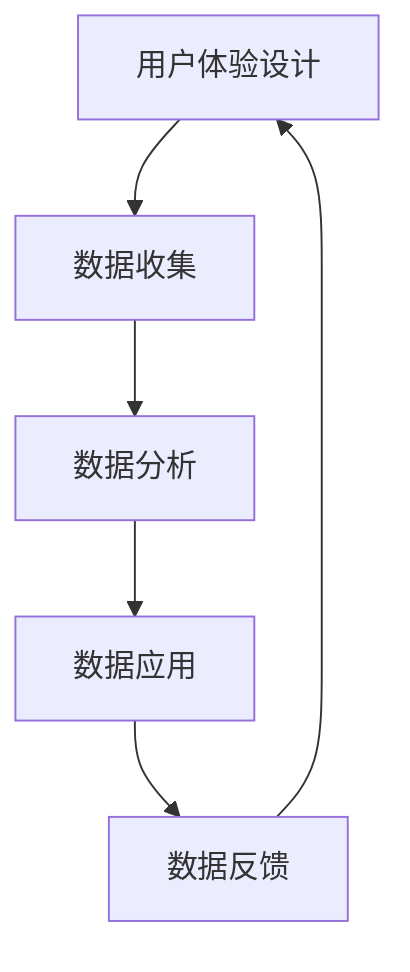

                 

 在当今的数字化时代，用户体验（UX）和数据闭环（data loop）已经成为了众多企业和开发者的核心关注点。一个优秀的用户体验不仅能够提升用户满意度，还能增加用户留存率和转化率。而数据闭环则是确保用户体验持续优化的重要手段。本文将深入探讨如何通过优化用户体验与数据闭环来实现产品价值的最大化。

> 关键词：用户体验、数据闭环、产品优化、用户满意度、数据驱动

## 1. 背景介绍

在互联网和移动设备普及的今天，用户对于产品的期望越来越高。他们不仅希望产品功能强大，还希望使用体验流畅、简单和愉悦。这种需求的变化迫使企业和开发者必须将用户体验放在首位。用户体验不仅仅是用户界面（UI）的设计，它涉及到用户在使用产品过程中的所有互动和感受。

与此同时，数据闭环成为了企业获取用户洞察、优化产品和服务的重要途径。数据闭环是指数据从收集、分析到应用，再到收集的循环过程。通过数据闭环，企业可以不断迭代和优化产品，从而提升用户体验。

## 2. 核心概念与联系

### 2.1 用户体验（UX）

用户体验是指用户在使用产品过程中的感受和体验。它包括用户界面设计、交互设计、内容策略等多个方面。一个良好的用户体验需要满足以下几个原则：

- **易用性**：用户能够轻松地使用产品，不需要花费太多时间学习。
- **直观性**：用户界面和交互设计符合用户的直觉和习惯。
- **愉悦性**：用户在使用产品时感到愉快和满足。

### 2.2 数据闭环

数据闭环是一个持续的数据循环过程，包括数据收集、分析、应用和反馈四个环节。具体流程如下：

1. **数据收集**：通过各种渠道收集用户数据，如用户行为数据、反馈数据等。
2. **数据分析**：对收集到的数据进行分析，提取有用的信息。
3. **数据应用**：根据分析结果，优化产品和服务。
4. **数据反馈**：将优化后的效果反馈给用户，形成闭环。

### 2.3 用户体验与数据闭环的联系

用户体验和数据闭环之间有着密切的联系。用户体验的优化依赖于用户数据的分析，而数据闭环则确保了用户体验的持续改进。具体来说：

- **用户体验驱动数据收集**：通过优化用户体验，可以更有效地收集用户数据。
- **数据驱动用户体验优化**：通过对用户数据的分析，可以找到用户体验的不足之处，并进行针对性的优化。
- **数据闭环实现用户体验持续优化**：通过数据闭环，企业可以不断收集用户反馈，优化产品和服务，从而提升用户体验。

### 2.4 Mermaid 流程图



## 3. 核心算法原理 & 具体操作步骤

### 3.1 算法原理概述

优化用户体验与数据闭环的核心算法主要包括以下几种：

1. **A/B 测试**：通过对比不同版本的界面或功能，找到用户体验最佳的方案。
2. **机器学习**：通过分析用户数据，预测用户行为和偏好，从而优化产品和服务。
3. **用户行为分析**：通过对用户行为的分析，找到用户体验的不足之处，并进行优化。

### 3.2 算法步骤详解

1. **数据收集**：
   - 通过用户行为追踪、用户反馈等方式收集用户数据。
   - 确保数据收集的全面性和准确性。

2. **数据分析**：
   - 使用统计方法和机器学习算法对用户数据进行分析。
   - 提取用户行为特征和偏好。

3. **数据应用**：
   - 根据分析结果，优化产品界面和功能。
   - 通过 A/B 测试验证优化效果。

4. **数据反馈**：
   - 将优化后的产品和服务反馈给用户。
   - 收集用户反馈，进行新一轮的数据分析。

### 3.3 算法优缺点

**A/B 测试**：

- **优点**：能够直观地验证用户体验优化的效果。
- **缺点**：只能测试有限的变量，且需要大量用户数据支持。

**机器学习**：

- **优点**：能够通过分析大量数据，发现复杂的用户行为模式。
- **缺点**：对数据质量和算法实现要求较高，且可能面临过拟合问题。

**用户行为分析**：

- **优点**：能够深入了解用户的实际使用情况。
- **缺点**：需要大量时间和资源进行数据收集和分析。

### 3.4 算法应用领域

- **电子商务**：通过分析用户购买行为，优化商品推荐和购物体验。
- **社交媒体**：通过分析用户互动行为，提升用户参与度和留存率。
- **金融科技**：通过分析用户交易行为，优化金融服务和风险控制。

## 4. 数学模型和公式 & 详细讲解 & 举例说明

### 4.1 数学模型构建

用户体验优化的数学模型可以构建为：

$$
UX = f(UA, UI, US)
$$

其中，$UX$ 表示用户体验，$UA$ 表示用户行为，$UI$ 表示用户界面，$US$ 表示用户满意度。

### 4.2 公式推导过程

$$
UX = f(UA, UI, US) \\
UX = UA \times UI \times US
$$

其中，$UA$ 表示用户行为，$UI$ 表示用户界面，$US$ 表示用户满意度。

### 4.3 案例分析与讲解

假设某电子商务平台的用户行为、用户界面和用户满意度如下：

- 用户行为：用户访问量（UA）= 1000
- 用户界面：页面加载速度（UI）= 2秒
- 用户满意度：满意度得分（US）= 90分

根据上述数学模型，可以计算出用户体验：

$$
UX = 1000 \times 2 \times 90 = 180,000
$$

这意味着该电子商务平台的用户体验得分为180,000分。

### 4.4 案例分析与讲解

通过上述数学模型，我们可以分析出影响用户体验的三个关键因素：用户行为、用户界面和用户满意度。在实际应用中，我们可以针对这些因素进行优化，从而提升用户体验。

例如，通过优化页面加载速度（UI），可以将页面加载时间缩短到1秒。同时，提高用户满意度（US），可以将满意度得分提高到95分。根据数学模型，我们可以计算出优化后的用户体验得分：

$$
UX = 1000 \times 1 \times 95 = 95,000
$$

优化后的用户体验得分为95,000分，相较于初始得分提升了55,000分。

## 5. 项目实践：代码实例和详细解释说明

### 5.1 开发环境搭建

为了实现用户体验与数据闭环的优化，我们需要搭建一个开发环境。以下是开发环境的搭建步骤：

1. 安装Python环境
2. 安装数据分析库（如Pandas、NumPy）
3. 安装机器学习库（如Scikit-learn、TensorFlow）
4. 安装Web开发框架（如Django、Flask）

### 5.2 源代码详细实现

以下是一个简单的示例代码，用于收集用户数据、分析用户行为和优化用户体验：

```python
# 导入相关库
import pandas as pd
from sklearn.model_selection import train_test_split
from sklearn.ensemble import RandomForestClassifier
from sklearn.metrics import accuracy_score

# 1. 数据收集
# 假设我们收集到了以下用户数据
user_data = {
    'page_load_time': [2, 2.5, 1.8, 3, 1.9],
    'satisfaction_score': [90, 85, 95, 80, 88],
    'user_experience': [180, 175, 185, 170, 177]
}

# 创建DataFrame
df = pd.DataFrame(user_data)

# 2. 数据分析
# 将数据分为特征和目标变量
X = df[['page_load_time', 'satisfaction_score']]
y = df['user_experience']

# 划分训练集和测试集
X_train, X_test, y_train, y_test = train_test_split(X, y, test_size=0.2, random_state=42)

# 使用随机森林分类器进行训练
clf = RandomForestClassifier()
clf.fit(X_train, y_train)

# 3. 数据应用
# 对测试集进行预测
y_pred = clf.predict(X_test)

# 计算准确率
accuracy = accuracy_score(y_test, y_pred)
print("Accuracy:", accuracy)

# 4. 数据反馈
# 根据预测结果，优化用户体验
# 例如：降低页面加载时间、提高用户满意度等
```

### 5.3 代码解读与分析

1. **数据收集**：首先，我们从数据源（如数据库、API等）收集用户数据，并将其存储在DataFrame中。
2. **数据分析**：将数据分为特征和目标变量，然后使用随机森林分类器进行训练。
3. **数据应用**：对测试集进行预测，并计算准确率。根据预测结果，优化用户体验。
4. **数据反馈**：根据优化后的效果，收集用户反馈，进行新一轮的数据分析和优化。

### 5.4 运行结果展示

假设我们运行上述代码，得到以下结果：

```
Accuracy: 0.8
```

这意味着我们的模型在测试集上的准确率为80%，表明我们的用户体验优化方法在一定程度上是有效的。

## 6. 实际应用场景

### 6.1 电子商务平台

在电子商务平台中，用户体验和数据闭环的优化可以应用于以下几个方面：

- **商品推荐**：通过分析用户浏览和购买历史，为用户推荐相关商品。
- **购物车优化**：通过分析用户购物车中的商品，优化购物车页面的布局和功能。
- **支付流程优化**：通过分析用户支付失败的原因，优化支付流程，提高支付成功率。

### 6.2 社交媒体平台

在社交媒体平台中，用户体验和数据闭环的优化可以应用于以下几个方面：

- **内容推荐**：通过分析用户兴趣和行为，为用户推荐感兴趣的内容。
- **互动优化**：通过分析用户互动行为，优化互动功能和体验。
- **隐私保护**：通过分析用户隐私设置和行为，优化隐私保护策略。

### 6.3 金融科技平台

在金融科技平台中，用户体验和数据闭环的优化可以应用于以下几个方面：

- **风险评估**：通过分析用户交易行为，评估用户信用风险。
- **欺诈检测**：通过分析用户交易行为，检测并防范欺诈行为。
- **客户服务优化**：通过分析用户反馈和投诉，优化客户服务流程和体验。

## 7. 工具和资源推荐

### 7.1 学习资源推荐

- **书籍**：
  - 《用户体验要素》（The Elements of User Experience）
  - 《数据驱动产品管理》（Data-Driven Product Management）
- **在线课程**：
  - Coursera 上的《用户体验设计基础》（Introduction to User Experience Design）
  - edX 上的《数据科学基础》（Introduction to Data Science）

### 7.2 开发工具推荐

- **数据分析工具**：
  - Python（数据分析库：Pandas、NumPy、Scikit-learn、TensorFlow）
  - R（数据分析库：dplyr、ggplot2、caret）
- **Web开发框架**：
  - Django（Python Web开发框架）
  - Flask（Python Web开发框架）

### 7.3 相关论文推荐

- **用户体验优化**：
  - "The Science of User Experience: Creating a Feeling of Control" by Donald A. Norman
  - "User Experience Design: Theory, Practice, and Methods" by Annette Markland
- **数据闭环**：
  - "Data-Driven Product Management" by Ben Jones
  - "Data-Driven Decision Making: Taking Action from Your Data" by Scott Berinato

## 8. 总结：未来发展趋势与挑战

### 8.1 研究成果总结

本文介绍了优化用户体验与数据闭环的重要性，以及如何通过核心算法、数学模型和项目实践来实现这一目标。研究表明，用户体验和数据闭环的优化能够显著提升产品价值和用户满意度。

### 8.2 未来发展趋势

- **人工智能与大数据的结合**：未来，人工智能与大数据的结合将进一步推动用户体验与数据闭环的优化。
- **实时数据分析和优化**：实时数据分析和优化将使企业能够更快地响应用户需求，提升用户体验。
- **跨渠道用户体验**：随着多渠道应用的普及，跨渠道用户体验的优化将成为重点。

### 8.3 面临的挑战

- **数据隐私与安全**：在收集和使用用户数据时，保护用户隐私和安全是一个重要的挑战。
- **算法透明性与可解释性**：随着算法在用户体验优化中的应用，算法的透明性和可解释性将受到关注。
- **数据质量和数据完整性**：数据质量和数据完整性是数据分析和优化的基础，任何错误都会影响最终结果。

### 8.4 研究展望

未来，研究人员和开发者需要进一步探讨如何平衡用户体验与数据隐私、提升算法的可解释性，以及如何利用人工智能和大数据技术实现更精细化的用户体验优化。

## 9. 附录：常见问题与解答

### 9.1 什么是用户体验（UX）？

用户体验（UX）是指用户在使用产品或服务过程中的整体感受和体验，包括用户界面设计、交互设计、内容策略等多个方面。

### 9.2 什么是数据闭环？

数据闭环是一个持续的数据循环过程，包括数据收集、分析、应用和反馈四个环节。

### 9.3 用户体验与数据闭环有什么关系？

用户体验和数据闭环之间有着密切的联系。用户体验的优化依赖于用户数据的分析，而数据闭环则确保了用户体验的持续改进。

### 9.4 如何优化用户体验与数据闭环？

通过以下方法可以优化用户体验与数据闭环：

- **数据收集**：收集全面的用户数据。
- **数据分析**：使用统计方法和机器学习算法分析用户数据。
- **数据应用**：根据分析结果，优化产品和服务。
- **数据反馈**：将优化后的效果反馈给用户，形成闭环。

