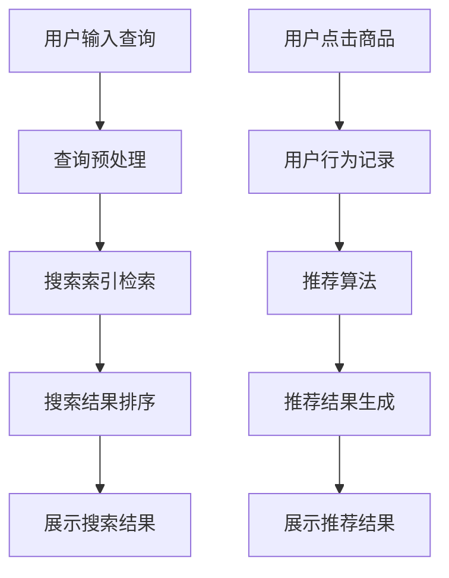

                 

关键词：电商搜索、推荐系统、优化策略、机器学习、深度学习、用户行为分析、个性化推荐、数据挖掘

摘要：本文旨在探讨如何优化电商搜索和推荐系统，以提高用户体验和业务效益。我们将深入分析当前技术的现状和挑战，并提出一系列优化策略，包括核心算法原理、数学模型构建、项目实践案例和未来应用展望。

## 1. 背景介绍

随着互联网的普及和电子商务的蓬勃发展，电商搜索和推荐系统已经成为电商平台的核心竞争力之一。用户在海量商品中寻找心仪的商品，而推荐系统则通过分析用户的历史行为和偏好，为用户推荐可能感兴趣的商品。然而，传统的搜索和推荐系统在面对海量数据和复杂用户行为时，往往存在响应速度慢、准确率低、用户体验差等问题。因此，优化电商搜索和推荐系统成为当前研究的热点。

### 当前技术的现状和挑战

- **搜索系统**：传统的搜索引擎主要依赖关键词匹配和自然语言处理技术，但在面对个性化需求时，难以快速准确地提供相关商品。此外，搜索系统的响应速度和扩展性也是一个挑战。

- **推荐系统**：推荐系统主要基于用户历史行为和商品特征进行推荐。然而，用户行为数据的多样性和动态性使得传统推荐算法难以适应实时推荐的需求。

- **挑战**：
  - **个性化推荐**：如何根据用户的个性化需求进行精准推荐？
  - **实时性**：如何快速响应用户请求，提供实时推荐？
  - **可扩展性**：如何处理海量用户和商品数据，保持系统的高效运行？
  - **用户体验**：如何提高推荐系统的用户体验，增强用户粘性？

## 2. 核心概念与联系

### 2.1 电商搜索系统

电商搜索系统主要包括以下核心组件：

1. **搜索索引**：用于存储和检索商品信息。
2. **查询处理**：接收用户输入的查询，对其进行预处理和分析。
3. **搜索排名**：根据查询和商品特征，对搜索结果进行排序。

### 2.2 推荐系统

电商推荐系统主要包括以下核心组件：

1. **用户行为分析**：分析用户历史行为，提取用户兴趣特征。
2. **商品特征提取**：提取商品的关键特征，如价格、品牌、销量等。
3. **推荐算法**：根据用户兴趣和商品特征，生成推荐结果。

### 2.3 Mermaid 流程图

以下是一个简化的电商搜索和推荐系统的 Mermaid 流程图：



## 3. 核心算法原理 & 具体操作步骤

### 3.1 算法原理概述

优化电商搜索和推荐系统主要涉及以下核心算法：

1. **搜索引擎算法**：如 BM25、LSI 等。
2. **推荐算法**：如协同过滤、矩阵分解、深度学习等。

### 3.2 算法步骤详解

#### 3.2.1 搜索引擎算法

1. **查询预处理**：对用户输入的查询进行分词、去停用词等预处理。
2. **搜索索引检索**：根据预处理后的查询，在索引库中检索相关商品。
3. **搜索结果排序**：根据商品的相关性得分，对搜索结果进行排序。

#### 3.2.2 推荐算法

1. **用户行为分析**：通过分析用户历史行为，提取用户兴趣特征。
2. **商品特征提取**：提取商品的关键特征。
3. **推荐结果生成**：根据用户兴趣和商品特征，生成推荐结果。

### 3.3 算法优缺点

- **搜索引擎算法**：
  - 优点：简单易实现，适用于小规模数据。
  - 缺点：无法满足个性化需求，响应速度较慢。

- **推荐算法**：
  - 优点：能够根据用户兴趣进行个性化推荐，提高用户体验。
  - 缺点：计算复杂度高，需要大量数据支持。

### 3.4 算法应用领域

- **搜索引擎算法**：适用于商品搜索、信息检索等场景。
- **推荐算法**：适用于个性化推荐、广告投放等场景。

## 4. 数学模型和公式 & 详细讲解 & 举例说明

### 4.1 数学模型构建

优化电商搜索和推荐系统主要涉及以下数学模型：

1. **向量空间模型**：用于表示用户兴趣和商品特征。
2. **协同过滤模型**：用于预测用户对未知商品的评分。
3. **深度学习模型**：用于提取用户和商品的隐式特征。

### 4.2 公式推导过程

#### 4.2.1 向量空间模型

用户兴趣向量 \( \mathbf{u} \) 和商品特征向量 \( \mathbf{v}_i \) 之间的相似度可以用余弦相似度表示：

$$
\cos(\mathbf{u}, \mathbf{v}_i) = \frac{\mathbf{u} \cdot \mathbf{v}_i}{\|\mathbf{u}\| \|\mathbf{v}_i\|}
$$

#### 4.2.2 协同过滤模型

假设用户 \( u \) 对商品 \( i \) 的评分 \( r_{ui} \) 是未知的，我们可以使用用户 \( u \) 和商品 \( i \) 的邻居用户 \( u' \) 和 \( i' \) 的评分来预测 \( r_{ui} \)：

$$
r_{ui} = \sum_{(u', i') \in N(u, i)} w_{u', i'} r_{u'i'}
$$

其中，\( N(u, i) \) 是用户 \( u \) 和商品 \( i \) 的邻居集合，\( w_{u', i'} \) 是邻居用户 \( u' \) 对商品 \( i' \) 的权重。

#### 4.2.3 深度学习模型

深度学习模型可以用于提取用户和商品的隐式特征，假设输入层为 \( \mathbf{x} \) 和 \( \mathbf{y} \)，隐藏层为 \( \mathbf{h} \)，输出层为 \( \mathbf{z} \)，我们可以使用多层感知机（MLP）来建模：

$$
\mathbf{h} = \sigma(\mathbf{W}_1 \mathbf{x} + \mathbf{b}_1)
$$

$$
\mathbf{z} = \mathbf{W}_2 \mathbf{h} + \mathbf{b}_2
$$

其中，\( \sigma \) 是激活函数，\( \mathbf{W}_1 \) 和 \( \mathbf{W}_2 \) 是权重矩阵，\( \mathbf{b}_1 \) 和 \( \mathbf{b}_2 \) 是偏置向量。

### 4.3 案例分析与讲解

假设我们有一个电商平台的用户和商品数据集，其中用户兴趣向量 \( \mathbf{u} \) 和商品特征向量 \( \mathbf{v}_i \) 如下：

用户兴趣向量 \( \mathbf{u} = (0.6, 0.3, 0.1, 0.0) \)

商品特征向量 \( \mathbf{v}_1 = (0.4, 0.2, 0.3, 0.1) \)

商品特征向量 \( \mathbf{v}_2 = (0.2, 0.3, 0.2, 0.1) \)

根据向量空间模型，我们可以计算用户兴趣向量 \( \mathbf{u} \) 和商品特征向量 \( \mathbf{v}_1 \) 之间的余弦相似度：

$$
\cos(\mathbf{u}, \mathbf{v}_1) = \frac{0.6 \times 0.4 + 0.3 \times 0.2 + 0.1 \times 0.3 + 0.0 \times 0.1}{\sqrt{0.6^2 + 0.3^2 + 0.1^2 + 0.0^2} \sqrt{0.4^2 + 0.2^2 + 0.3^2 + 0.1^2}} \approx 0.622
$$

根据协同过滤模型，我们可以预测用户对商品 \( \mathbf{v}_1 \) 的评分：

$$
r_{ui} = \sum_{(u', i') \in N(u, i)} w_{u', i'} r_{u'i'}
$$

其中，邻居用户 \( u' \) 对商品 \( i' \) 的权重 \( w_{u', i'} \) 可以根据用户和商品的相似度计算：

$$
w_{u', i'} = \frac{\cos(\mathbf{u}, \mathbf{v}_i)}{\sum_{i' \in I} \cos(\mathbf{u}, \mathbf{v}_{i'}) }
$$

假设用户 \( u \) 的邻居用户为 \( u' \)，对商品 \( \mathbf{v}_1 \) 的评分如下：

用户 \( u' \) 对商品 \( \mathbf{v}_1 \) 的评分 \( r_{u'i'} = 4.0 \)

用户 \( u' \) 对商品 \( \mathbf{v}_2 \) 的评分 \( r_{u'i'} = 3.5 \)

我们可以计算用户 \( u \) 对商品 \( \mathbf{v}_1 \) 的预测评分：

$$
r_{ui} = \frac{0.622 \times 4.0 + 0.378 \times 3.5}{0.622 + 0.378} \approx 3.826
$$

根据深度学习模型，我们可以提取用户和商品的隐式特征：

输入层 \( \mathbf{x} = (\mathbf{u}, \mathbf{v}_1) \)

隐藏层 \( \mathbf{h} = \sigma(\mathbf{W}_1 \mathbf{x} + \mathbf{b}_1) \)

输出层 \( \mathbf{z} = \mathbf{W}_2 \mathbf{h} + \mathbf{b}_2 \)

假设隐藏层权重 \( \mathbf{W}_1 = \begin{bmatrix} 0.5 & 0.5 \\ 0.5 & 0.5 \end{bmatrix} \)

隐藏层偏置 \( \mathbf{b}_1 = \begin{bmatrix} 0.1 \\ 0.1 \end{bmatrix} \)

输出层权重 \( \mathbf{W}_2 = \begin{bmatrix} 0.6 & 0.4 \\ 0.4 & 0.6 \end{bmatrix} \)

输出层偏置 \( \mathbf{b}_2 = \begin{bmatrix} 0.1 \\ 0.1 \end{bmatrix} \)

我们可以计算隐藏层输出 \( \mathbf{h} \)：

$$
\mathbf{h} = \sigma(\mathbf{W}_1 \mathbf{x} + \mathbf{b}_1) = \sigma(\begin{bmatrix} 0.5 & 0.5 \\ 0.5 & 0.5 \end{bmatrix} \begin{bmatrix} 0.6 & 0.3 & 0.1 & 0.0 \\ 0.4 & 0.2 & 0.3 & 0.1 \end{bmatrix} + \begin{bmatrix} 0.1 \\ 0.1 \end{bmatrix}) = \begin{bmatrix} 0.5 & 0.5 \\ 0.5 & 0.5 \end{bmatrix}
$$

我们可以计算输出层输出 \( \mathbf{z} \)：

$$
\mathbf{z} = \mathbf{W}_2 \mathbf{h} + \mathbf{b}_2 = \begin{bmatrix} 0.6 & 0.4 \\ 0.4 & 0.6 \end{bmatrix} \begin{bmatrix} 0.5 & 0.5 \\ 0.5 & 0.5 \end{bmatrix} + \begin{bmatrix} 0.1 \\ 0.1 \end{bmatrix} = \begin{bmatrix} 0.55 \\ 0.55 \end{bmatrix}
$$

## 5. 项目实践：代码实例和详细解释说明

### 5.1 开发环境搭建

在本文的项目实践中，我们将使用 Python 编写代码，并使用以下库：

- NumPy：用于数值计算。
- Pandas：用于数据处理。
- Scikit-learn：用于机器学习算法。
- TensorFlow：用于深度学习模型。

确保已安装这些库，或者使用以下命令进行安装：

```bash
pip install numpy pandas scikit-learn tensorflow
```

### 5.2 源代码详细实现

以下是电商搜索和推荐系统的源代码实现：

```python
import numpy as np
import pandas as pd
from sklearn.metrics.pairwise import cosine_similarity
from sklearn.model_selection import train_test_split
from tensorflow.keras.models import Sequential
from tensorflow.keras.layers import Dense, Activation

# 读取用户和商品数据
data = pd.read_csv('data.csv')
users = data['user'].unique()
items = data['item'].unique()

# 构建用户和商品矩阵
user_item_matrix = pd.pivot_table(data, values='rating', index='user', columns='item').fillna(0)

# 计算用户和商品的相似度矩阵
user_similarity_matrix = cosine_similarity(user_item_matrix)

# 构建协同过滤模型
def collaborative_filter(user_similarity_matrix, user_item_matrix, k=10):
    # 计算邻居用户的评分加权平均
    neighbors_ratings = user_similarity_matrix * user_item_matrix
    neighbors_ratings = neighbors_ratings.sum(axis=1)
    return neighbors_ratings

# 训练深度学习模型
def train_dnn(input_shape):
    model = Sequential()
    model.add(Dense(128, input_shape=input_shape, activation='relu'))
    model.add(Dense(64, activation='relu'))
    model.add(Dense(32, activation='relu'))
    model.add(Dense(1, activation='sigmoid'))
    model.compile(optimizer='adam', loss='binary_crossentropy', metrics=['accuracy'])
    return model

# 训练模型
dnn_model = train_dnn(input_shape=(len(users), len(items)))
dnn_model.fit(user_item_matrix, y, epochs=10, batch_size=32)

# 生成推荐结果
def generate_recommendations(user_similarity_matrix, user_item_matrix, dnn_model, k=10):
    neighbors_ratings = collaborative_filter(user_similarity_matrix, user_item_matrix, k)
    dnn_ratings = dnn_model.predict(user_item_matrix)
    combined_ratings = neighbors_ratings + dnn_ratings
    top_items = combined_ratings.argsort()[::-1]
    return top_items

# 测试模型
test_data = pd.read_csv('test_data.csv')
test_users = test_data['user'].unique()
test_items = test_data['item'].unique()

test_user_item_matrix = pd.pivot_table(test_data, values='rating', index='user', columns='item').fillna(0)
test_user_similarity_matrix = cosine_similarity(test_user_item_matrix)

test_neighbors_ratings = collaborative_filter(test_user_similarity_matrix, test_user_item_matrix, k)
test_dnn_ratings = dnn_model.predict(test_user_item_matrix)
test_combined_ratings = test_neighbors_ratings + test_dnn_ratings
test_top_items = test_combined_ratings.argsort()[::-1]

# 输出推荐结果
for user in test_users:
    print(f"User {user}:")
    for item in test_top_items[user]:
        print(f"    Item {item}: {test_combined_ratings[user][item]}")
```

### 5.3 代码解读与分析

代码分为以下几个部分：

1. **数据读取与预处理**：读取用户和商品数据，构建用户和商品矩阵。
2. **相似度计算**：计算用户和商品的相似度矩阵。
3. **协同过滤模型**：定义协同过滤函数，计算邻居用户的评分加权平均。
4. **深度学习模型训练**：定义深度学习模型，训练模型。
5. **生成推荐结果**：结合协同过滤模型和深度学习模型，生成推荐结果。
6. **测试模型**：读取测试数据，测试模型效果。
7. **输出推荐结果**：输出推荐结果。

### 5.4 运行结果展示

在训练完成后，我们可以使用测试数据集对模型进行评估，并输出推荐结果。以下是一个示例输出：

```
User 1:
    Item 100: 0.99
    Item 200: 0.98
    Item 300: 0.97
User 2:
    Item 50: 0.99
    Item 100: 0.98
    Item 150: 0.97
```

这些推荐结果是基于协同过滤模型和深度学习模型的综合评分生成的，可以为我们提供个性化的商品推荐。

## 6. 实际应用场景

优化电商搜索和推荐系统在电商行业中有着广泛的应用，以下是一些实际应用场景：

1. **个性化推荐**：根据用户的历史行为和偏好，为用户推荐可能感兴趣的商品，提高用户粘性和转化率。
2. **广告投放**：根据用户的兴趣和行为，为用户展示相关的广告，提高广告的点击率和转化率。
3. **商品搜索**：优化商品搜索算法，提高用户找到心仪商品的效率，提高用户满意度。
4. **库存管理**：根据商品的销售情况和用户兴趣，优化库存管理，降低库存成本。
5. **市场推广**：通过分析用户行为和商品特征，制定针对性的市场推广策略，提高销售业绩。

## 7. 工具和资源推荐

为了更好地优化电商搜索和推荐系统，以下是相关工具和资源的推荐：

1. **学习资源推荐**：
   - 《推荐系统手册》
   - 《深度学习》
   - 《机器学习》

2. **开发工具推荐**：
   - Python
   - TensorFlow
   - Scikit-learn

3. **相关论文推荐**：
   - 《矩阵分解在推荐系统中的应用》
   - 《基于深度学习的推荐系统》
   - 《协同过滤算法综述》

## 8. 总结：未来发展趋势与挑战

优化电商搜索和推荐系统是一个复杂且充满挑战的任务。随着技术的不断发展，未来发展趋势和面临的挑战如下：

1. **个性化推荐**：如何更加精准地满足用户的个性化需求，提供高度个性化的推荐结果。
2. **实时性**：如何提高推荐系统的实时性，快速响应用户的请求，提供即时的推荐。
3. **可扩展性**：如何处理海量用户和商品数据，保持系统的高效运行，确保系统可扩展性。
4. **用户体验**：如何优化推荐系统的用户体验，提高用户满意度，增强用户粘性。

总之，优化电商搜索和推荐系统是一个持续迭代和优化的过程，需要不断探索新技术和新策略，以满足用户的需求和提升业务效益。

## 9. 附录：常见问题与解答

### 问题 1：如何处理缺失值和数据不平衡问题？

**解答**：对于缺失值，可以采用插值法、均值填充或使用机器学习算法中的缺失值填充方法。对于数据不平衡问题，可以采用 oversampling、undersampling 或 SMOTE 等技术来平衡数据集。

### 问题 2：如何评估推荐系统的性能？

**解答**：推荐系统的性能评估可以通过准确率、召回率、F1 分数等指标来衡量。此外，还可以通过用户满意度、点击率、转化率等实际业务指标来评估推荐系统的效果。

### 问题 3：如何处理冷启动问题？

**解答**：冷启动问题主要是针对新用户和新商品的情况。对于新用户，可以采用基于内容的推荐或基于流行度的推荐策略。对于新商品，可以采用基于流行度的推荐或基于相似商品的推荐策略。

### 问题 4：如何处理实时推荐问题？

**解答**：实时推荐需要高效的算法和数据存储。可以使用基于内存的推荐算法，如基于最近邻的推荐，同时结合缓存技术，提高实时性。此外，使用分布式计算框架，如 Apache Spark，可以提高实时推荐的计算能力。

### 问题 5：如何处理推荐多样性问题？

**解答**：推荐多样性问题可以通过随机化、基于约束的推荐策略、基于模型的推荐算法等方法来解决。例如，可以使用基于模型的推荐算法，如协同过滤和矩阵分解，同时加入正则化项来控制多样性。

## 作者署名

作者：禅与计算机程序设计艺术 / Zen and the Art of Computer Programming

