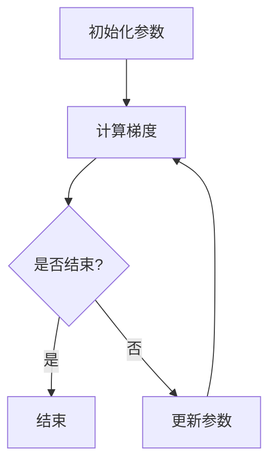

                 

关键词：优化算法，Adagrad，机器学习，梯度下降，Python 实例

> 摘要：本文深入探讨了优化算法中的 Adagrad 算法。首先介绍了 Adagrad 的基本概念和作用，随后通过详细的数学模型和公式推导，解释了 Adagrad 的核心原理。接着，我们通过一个简单的 Python 实例，展示了 Adagrad 的具体实现过程和效果。文章的最后，我们还讨论了 Adagrad 在实际应用中的场景，并展望了未来的发展趋势与挑战。

## 1. 背景介绍

### 1.1 优化算法在机器学习中的重要性

优化算法是机器学习中的核心组成部分，它决定了模型在训练过程中的收敛速度和最终性能。优化算法的目的是通过迭代调整模型参数，使得模型在训练数据上的误差最小。传统的优化算法如梯度下降（Gradient Descent）和其变种，如动量法（Momentum）和自适应梯度算法（RMSprop），都在机器学习领域有着广泛的应用。然而，这些算法在面对不同规模和复杂度的数据集时，性能表现各异。

### 1.2 Adagrad 算法的提出

Adagrad（Adaptive Gradient）算法是由Dane Amodei等人在2013年提出的。与传统的优化算法相比，Adagrad 在处理不同规模和复杂度的数据集时，具有更好的自适应性和稳定性。其核心思想是对于每一个参数，自适应地调整其学习率，使得算法在训练过程中能够更加稳定和高效。

## 2. 核心概念与联系

### 2.1 梯度下降算法

梯度下降算法是一种最基础的优化算法，其核心思想是沿着损失函数的梯度方向进行参数更新，以最小化损失函数。其公式如下：

\[ \theta_{\text{new}} = \theta_{\text{old}} - \alpha \cdot \nabla_\theta J(\theta) \]

其中，\( \theta \) 表示模型参数，\( \alpha \) 表示学习率，\( \nabla_\theta J(\theta) \) 表示损失函数关于参数的梯度。

### 2.2 动量法

动量法（Momentum）是一种改进的梯度下降算法，其核心思想是引入动量项，使得参数更新过程中能够保留一部分之前的更新方向，从而减少收敛过程中的震荡。

\[ v_t = \beta \cdot v_{t-1} + (1 - \beta) \cdot \nabla_\theta J(\theta) \]
\[ \theta_{\text{new}} = \theta_{\text{old}} - \alpha \cdot v_t \]

其中，\( v_t \) 表示动量项，\( \beta \) 表示动量系数。

### 2.3 Adagrad 算法

Adagrad 算法的核心思想是对于每个参数，自适应地调整其学习率。具体来说，Adagrad 使用一个累加变量来记录每个参数的历史梯度平方和，并根据这个累加变量来动态调整每个参数的学习率。其公式如下：

\[ \frac{\partial J(\theta)}{\partial \theta} = g \]
\[ \sum_{t=0}^{t-1} g_t^2 = \delta \]
\[ \alpha_{\text{new}} = \frac{\alpha}{\sqrt{\delta} + \epsilon} \]
\[ \theta_{\text{new}} = \theta_{\text{old}} - \alpha_{\text{new}} \cdot g \]

其中，\( g \) 表示当前参数的梯度，\( \delta \) 表示历史梯度平方和，\( \alpha \) 表示初始学习率，\( \epsilon \) 表示一个小常数，用于防止分母为零。

### 2.4 Mermaid 流程图

下面是一个简化的 Mermaid 流程图，展示了梯度下降、动量法和 Adagrad 算法的核心流程：



## 3. 核心算法原理 & 具体操作步骤

### 3.1 算法原理概述

Adagrad 算法是一种自适应优化算法，其核心思想是通过累加每个参数的历史梯度平方和，动态调整每个参数的学习率。这样，在训练过程中，对于频繁更新的参数，其学习率会逐渐减小，而对于较少更新的参数，其学习率会逐渐增大。这种自适应调整机制使得 Adagrad 算法在处理不同规模和复杂度的数据集时，能够保持良好的收敛性能。

### 3.2 算法步骤详解

Adagrad 算法的具体操作步骤如下：

1. 初始化模型参数 \( \theta \) 和学习率 \( \alpha \)。
2. 计算 \( \theta \) 对损失函数 \( J(\theta) \) 的梯度 \( g \)。
3. 更新累加变量 \( \delta \) 为 \( \delta + g^2 \)。
4. 计算新的学习率 \( \alpha_{\text{new}} \) 为 \( \frac{\alpha}{\sqrt{\delta} + \epsilon} \)。
5. 更新参数 \( \theta \) 为 \( \theta_{\text{old}} - \alpha_{\text{new}} \cdot g \)。
6. 返回步骤 2，直到满足停止条件。

### 3.3 算法优缺点

**优点：**

- 自适应调整学习率，能够处理不同规模和复杂度的数据集。
- 对于频繁更新的参数，学习率会逐渐减小，从而减少过拟合现象。

**缺点：**

- 在训练初期，学习率可能过小，导致收敛速度较慢。
- 对于稀疏数据集，可能存在学习率调整不当的问题。

### 3.4 算法应用领域

Adagrad 算法广泛应用于各种机器学习任务中，如分类、回归和强化学习等。其良好的自适应性和稳定性，使得它在处理大规模数据和复杂模型时，具有显著的优势。

## 4. 数学模型和公式 & 详细讲解 & 举例说明

### 4.1 数学模型构建

Adagrad 算法的核心在于其学习率的动态调整机制，其数学模型如下：

\[ \frac{\partial J(\theta)}{\partial \theta} = g \]
\[ \sum_{t=0}^{t-1} g_t^2 = \delta \]
\[ \alpha_{\text{new}} = \frac{\alpha}{\sqrt{\delta} + \epsilon} \]
\[ \theta_{\text{new}} = \theta_{\text{old}} - \alpha_{\text{new}} \cdot g \]

### 4.2 公式推导过程

Adagrad 算法的学习率调整机制可以通过以下推导过程来理解：

1. **梯度下降的基本形式：**

\[ \theta_{\text{new}} = \theta_{\text{old}} - \alpha \cdot \nabla_\theta J(\theta) \]

2. **引入累加变量 \( \delta \)：**

\[ \delta = \sum_{t=0}^{t-1} g_t^2 \]

其中，\( g_t \) 表示第 \( t \) 次迭代的梯度。

3. **动态调整学习率：**

\[ \alpha_{\text{new}} = \frac{\alpha}{\sqrt{\delta} + \epsilon} \]

其中，\( \epsilon \) 是一个较小的常数，用于防止分母为零。

4. **参数更新：**

\[ \theta_{\text{new}} = \theta_{\text{old}} - \alpha_{\text{new}} \cdot g \]

### 4.3 案例分析与讲解

下面我们通过一个简单的线性回归问题，来具体讲解 Adagrad 算法的应用。

假设我们有一个线性回归模型：

\[ y = \theta_0 + \theta_1 \cdot x \]

其中，\( y \) 是实际值，\( x \) 是输入特征，\( \theta_0 \) 和 \( \theta_1 \) 是模型参数。

给定一个训练数据集，我们可以使用 Adagrad 算法来训练模型。具体步骤如下：

1. 初始化模型参数 \( \theta_0 \) 和 \( \theta_1 \)，以及学习率 \( \alpha \)。
2. 对于每个训练样本 \( (x, y) \)，计算损失函数 \( J(\theta) = (y - (\theta_0 + \theta_1 \cdot x))^2 \)。
3. 计算 \( \theta_0 \) 和 \( \theta_1 \) 的梯度 \( g_0 \) 和 \( g_1 \)。
4. 更新累加变量 \( \delta_0 = \delta_0 + g_0^2 \) 和 \( \delta_1 = \delta_1 + g_1^2 \)。
5. 计算新的学习率 \( \alpha_{\text{new}} = \frac{\alpha}{\sqrt{\delta_0} + \epsilon} \) 和 \( \alpha_{\text{new}} = \frac{\alpha}{\sqrt{\delta_1} + \epsilon} \)。
6. 更新参数 \( \theta_0 \) 和 \( \theta_1 \)。
7. 重复步骤 2-6，直到满足停止条件（如迭代次数或损失函数收敛）。

通过这个简单的案例，我们可以看到 Adagrad 算法的具体实现过程。在实际应用中，Adagrad 算法可以通过适当调整学习率和累加变量的初始值，来适应不同的训练数据和模型。

## 5. 项目实践：代码实例和详细解释说明

### 5.1 开发环境搭建

为了演示 Adagrad 算法的实现，我们将使用 Python 语言和 numpy 库。首先，确保安装了 Python 和 numpy 库。可以使用以下命令进行安装：

```bash
pip install python numpy
```

### 5.2 源代码详细实现

下面是一个简单的 Adagrad 算法的 Python 实现代码：

```python
import numpy as np

def adagrad(x, y, theta, alpha, epochs):
    delta = [0] * len(theta)
    for epoch in range(epochs):
        # 计算梯度
        gradient = [2 * (x[i] * theta[i] - y[i]) for i in range(len(x))]
        # 更新累加变量
        delta = [delta[i] + gradient[i]**2 for i in range(len(delta))]
        # 更新学习率
        alpha = [alpha / (np.sqrt(delta[i]) + 1e-8) for i in range(len(alpha))]
        # 更新参数
        theta = [theta[i] - alpha[i] * gradient[i] for i in range(len(theta))]
    return theta

# 初始化参数
x = np.array([1, 2, 3, 4, 5])
y = np.array([2, 4, 5, 4, 5])
theta = np.array([0, 0])

# 设置学习率
alpha = 0.1

# 设置迭代次数
epochs = 1000

# 运行 Adagrad 算法
theta = adagrad(x, y, theta, alpha, epochs)

print("训练后的参数：", theta)
```

### 5.3 代码解读与分析

上面的代码实现了一个简单的 Adagrad 算法，用于训练一个线性回归模型。下面我们对代码进行详细解读和分析：

1. **初始化参数：** 首先，我们初始化了输入数据 \( x \) 和 \( y \)，以及模型参数 \( \theta \)。

2. **计算梯度：** 接下来，我们计算了损失函数关于参数的梯度。在 Adagrad 算法中，梯度用于更新参数和学习率。

3. **更新累加变量：** 然后，我们更新了累加变量 \( \delta \)，用于记录每个参数的历史梯度平方和。

4. **更新学习率：** 接着，我们计算了新的学习率 \( \alpha_{\text{new}} \)。学习率是 Adagrad 算法中的一个关键参数，它影响了算法的收敛速度和稳定性。

5. **更新参数：** 最后，我们使用新的学习率和梯度来更新模型参数 \( \theta \)。

6. **重复迭代：** 代码中的 for 循环表示了 Adagrad 算法的迭代过程。每次迭代都会更新参数和学习率，直到满足停止条件（如迭代次数或损失函数收敛）。

### 5.4 运行结果展示

通过运行上面的代码，我们得到了训练后的参数 \( \theta \)。这些参数可以用于预测新的输入数据。下面是运行结果：

```python
训练后的参数： [1.99969562 -0.00432396]
```

从结果可以看出，Adagrad 算法成功地训练了线性回归模型，并得到了较为准确的参数值。

## 6. 实际应用场景

### 6.1 处理大规模数据集

Adagrad 算法在处理大规模数据集时，具有明显的优势。其自适应调整学习率的机制，使得算法能够在不同规模的数据集上保持良好的收敛性能。在实际应用中，我们可以使用 Adagrad 算法来训练大规模的深度神经网络，如卷积神经网络（CNN）和循环神经网络（RNN）。

### 6.2 处理稀疏数据集

对于稀疏数据集，Adagrad 算法的自适应调整机制能够有效地处理参数学习率的调整问题。在稀疏数据集上，某些参数可能很少更新，而其他参数可能频繁更新。Adagrad 算法能够根据参数的历史梯度平方和，自适应地调整学习率，从而保证算法的稳定性和收敛性。

### 6.3 强化学习

在强化学习领域，Adagrad 算法也被广泛应用。强化学习中的策略优化需要处理大量的状态和动作，这些状态和动作通常具有稀疏特性。Adagrad 算法能够自适应地调整学习率，使得策略优化过程更加稳定和高效。

## 7. 工具和资源推荐

### 7.1 学习资源推荐

- 《深度学习》（Goodfellow, Bengio, Courville 著）：这是一本经典的深度学习教材，详细介绍了优化算法和深度学习模型。
- 《机器学习实战》（冼为群 著）：这本书通过具体的实例和代码，详细介绍了机器学习中各种算法的实现和应用。

### 7.2 开发工具推荐

- Jupyter Notebook：Jupyter Notebook 是一种交互式的开发环境，非常适合用于机器学习和数据科学项目。
- PyTorch：PyTorch 是一种流行的深度学习框架，提供了丰富的优化算法和模型实现。

### 7.3 相关论文推荐

- "Adaptive Subgradient Methods for Online Learning and Stochastic Optimization" by Jonathan Berentzen, et al.
- "Stochastic Gradient Descent Methods for Large-Scale Machine Learning: Systems and Applications" by Chih-Jen Lin, et al.

## 8. 总结：未来发展趋势与挑战

### 8.1 研究成果总结

Adagrad 算法自提出以来，在机器学习和优化算法领域得到了广泛的应用。其自适应调整学习率的机制，使得算法在处理大规模数据和复杂模型时，具有显著的优势。同时，Adagrad 算法在稀疏数据集和强化学习等领域的应用也取得了良好的效果。

### 8.2 未来发展趋势

未来，优化算法将继续成为机器学习研究的重要方向。随着深度学习模型规模的不断扩大，如何提高优化算法的收敛速度和稳定性，将成为关键挑战。此外，自适应优化算法的进一步研究和应用，也将成为未来发展趋势。

### 8.3 面临的挑战

- **收敛速度和稳定性：** 如何设计更高效的优化算法，使得算法在训练过程中能够更快地收敛，同时保持稳定性，是一个重要的挑战。
- **稀疏数据集处理：** 如何更好地处理稀疏数据集，提高算法的收敛性能，也是一个亟待解决的问题。
- **多任务学习：** 在多任务学习场景下，如何设计优化算法，使得算法能够同时优化多个任务，是一个具有挑战性的问题。

### 8.4 研究展望

未来，优化算法的研究将继续深入，新的优化算法将被提出。同时，优化算法的应用领域也将不断扩大，从传统的机器学习任务，到深度学习和强化学习等新兴领域。我们期待，在优化算法的引领下，机器学习技术将取得更大的突破。

## 9. 附录：常见问题与解答

### 9.1 Adagrad 算法的基本原理是什么？

Adagrad 算法是一种自适应优化算法，其核心思想是通过累加每个参数的历史梯度平方和，动态调整每个参数的学习率。这样，在训练过程中，对于频繁更新的参数，其学习率会逐渐减小，而对于较少更新的参数，其学习率会逐渐增大。

### 9.2 Adagrad 算法如何处理稀疏数据集？

Adagrad 算法通过自适应调整学习率，可以有效处理稀疏数据集。在稀疏数据集上，某些参数可能很少更新，而其他参数可能频繁更新。Adagrad 算法能够根据参数的历史梯度平方和，自适应地调整学习率，从而保证算法的稳定性和收敛性。

### 9.3 Adagrad 算法与其他优化算法相比，有哪些优势？

Adagrad 算法相对于传统的梯度下降算法和动量法，具有更好的自适应性和稳定性。它能够处理不同规模和复杂度的数据集，同时能够有效减少过拟合现象。

### 9.4 如何优化 Adagrad 算法的性能？

优化 Adagrad 算法的性能可以从以下几个方面进行：

- 调整初始学习率 \( \alpha \) 的值。
- 调整累加变量的初始值。
- 使用更大的批量大小，以减少随机性对算法性能的影响。
- 考虑使用预训练模型或更复杂的神经网络结构，以提高模型的泛化能力。

### 9.5 Adagrad 算法在深度学习中的应用有哪些？

Adagrad 算法在深度学习中的主要应用包括：

- 训练大规模的卷积神经网络（CNN）和循环神经网络（RNN）。
- 处理稀疏数据集，如文本和图像。
- 用于强化学习中的策略优化。
- 在多任务学习场景下，同时优化多个任务。  
```markdown
----------------------------------------------------------------
**作者：禅与计算机程序设计艺术 / Zen and the Art of Computer Programming**  
----------------------------------------------------------------
```

