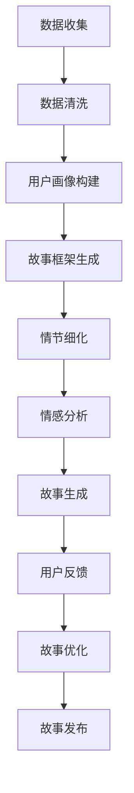

                 

 关键词：人工智能，叙事，故事创作，体验设计，个人化，情感化，自然语言处理，数据驱动，用户参与

> 摘要：本文深入探讨了人工智能在个人故事创作中的应用，特别是在体验叙事工作室的背景下。作为AI驱动的个人故事创作坊的负责人，本文将分享我们的实践经验，详细阐述人工智能技术在故事创作过程中的核心作用，以及如何通过算法和数据分析实现个人故事的自动化创作。本文还将讨论未来人工智能在个人叙事领域的潜在发展，以及面临的挑战和解决方案。

## 1. 背景介绍

随着人工智能技术的不断进步，自然语言处理（NLP）和机器学习算法在理解和生成文本方面取得了显著成就。这些技术不仅改变了内容创作的方式，也为个人故事创作带来了新的可能性。在用户体验日益个性化的时代，如何利用人工智能技术创作出能够触动人心的个人故事成为了一个重要课题。

体验叙事工作室正是这样一个致力于探索AI在个人故事创作中应用的机构。我们的目标是通过人工智能技术，实现用户个人故事的自动化创作，提供一种全新的、个性化的叙事体验。作为工作室的总监，我负责统筹整个项目的规划、实施和运营，确保我们的技术团队能够有效地将理论转化为实践。

本文将围绕以下几个核心问题展开讨论：

- 人工智能在故事创作中的核心作用是什么？
- 如何利用算法和数据分析实现个人故事的自动化创作？
- 个人故事创作中面临的挑战和解决方案是什么？
- 人工智能在未来个人叙事领域的潜在发展是什么？

通过本文的探讨，希望能够为从事相关领域的研究者、从业者提供一些有价值的参考和启发。

## 2. 核心概念与联系

### 2.1. 人工智能与叙事

人工智能（AI）与叙事之间的联系在于，AI能够通过学习和理解人类的语言和思维方式，生成具有情感和逻辑的故事。这种能力的实现依赖于NLP技术，特别是深度学习算法。通过大规模文本数据的学习，AI可以识别出语言中的模式、情感和主题，从而创作出具有吸引力的故事。

### 2.2. 数据驱动的故事创作

数据驱动的故事创作是指通过分析用户的个人数据（如社交媒体活动、浏览记录、个人经历等），生成与之相关的个性化故事。这种创作方式不仅依赖于算法，还需要大量的数据支持和精准的用户画像。

### 2.3. 自然语言处理（NLP）

自然语言处理是人工智能的一个子领域，主要研究如何使计算机理解和生成人类语言。在故事创作中，NLP技术用于提取文本中的关键信息、情感和语境，从而实现故事内容的生成和优化。

### 2.4. 机器学习与算法

机器学习是实现AI的核心技术，通过从数据中学习规律和模式，机器学习算法可以生成复杂的决策模型。在故事创作中，这些算法用于生成故事线、角色发展和情节设定。

### 2.5. Mermaid 流程图

以下是个人故事创作过程的Mermaid流程图：



## 3. 核心算法原理 & 具体操作步骤

### 3.1. 算法原理概述

个人故事创作算法的核心原理是基于NLP和机器学习技术，通过以下步骤实现：

1. **数据收集**：从用户的社交媒体、浏览记录和个人经历中收集数据。
2. **数据清洗**：去除噪声数据，确保数据质量。
3. **用户画像构建**：通过数据分析，构建用户的基本信息和偏好。
4. **故事框架生成**：根据用户画像和主题，生成初步的故事框架。
5. **情节细化**：在故事框架的基础上，细化情节和角色发展。
6. **情感分析**：分析故事中的情感元素，确保故事的吸引力。
7. **故事生成**：通过机器学习算法，生成完整的故事内容。
8. **用户反馈**：收集用户对故事的反馈，用于后续优化。
9. **故事优化**：根据用户反馈，对故事进行优化。
10. **故事发布**：将优化后的故事发布给用户。

### 3.2. 算法步骤详解

#### 3.2.1. 数据收集

数据收集是故事创作的第一步，主要涉及以下数据来源：

- 社交媒体活动：如微博、微信、Facebook等平台上的发布和互动。
- 浏览记录：用户在网站和应用程序上的浏览历史。
- 个人经历：用户提供的个人背景和经历信息。

#### 3.2.2. 数据清洗

数据清洗的目的是去除噪声数据，确保数据的质量和一致性。具体操作包括：

- 去除重复数据。
- 填补缺失值。
- 标准化数据格式。

#### 3.2.3. 用户画像构建

用户画像构建是基于数据清洗后的用户数据，通过统计分析方法，提取出用户的基本信息和偏好。这些信息包括：

- 个人背景：年龄、性别、职业等。
- 兴趣爱好：通过社交媒体和浏览记录分析，提取出用户感兴趣的主题和领域。
- 情感倾向：通过文本情感分析，了解用户的情感偏好。

#### 3.2.4. 故事框架生成

故事框架生成是依据用户画像和主题，通过模板匹配和生成对抗网络（GAN）等算法，生成初步的故事框架。这一步骤的关键是确保故事框架符合用户的偏好和情感。

#### 3.2.5. 情节细化

在故事框架的基础上，情节细化是通过角色发展、冲突设定和情节推进等手段，使故事更加具体和生动。这一步骤需要结合用户情感和故事主题，确保情节的连贯性和吸引力。

#### 3.2.6. 情感分析

情感分析是确保故事中的情感元素与用户偏好相匹配。通过文本情感分析技术，识别出故事中的情感倾向和强度，调整故事的情感色彩，使之更加贴近用户。

#### 3.2.7. 故事生成

故事生成是通过机器学习算法，将初步的故事框架和细化的情节转化为完整的故事内容。这一步骤涉及文本生成模型，如生成对抗网络（GAN）、变分自编码器（VAE）等。

#### 3.2.8. 用户反馈

用户反馈是故事创作的重要环节，通过收集用户对故事的反馈，了解故事的吸引力、情感表达和情节连贯性。这些反馈将用于后续的优化和改进。

#### 3.2.9. 故事优化

根据用户反馈，对故事进行优化，包括调整情节、角色发展和情感表达。这一步骤需要结合用户情感和故事主题，确保故事的质量和吸引力。

#### 3.2.10. 故事发布

将优化后的故事发布给用户，通过社交媒体、网站或应用程序等多种渠道，让用户能够方便地获取和分享自己的故事。

### 3.3. 算法优缺点

#### 优点

- **个性化**：通过分析用户数据，生成与用户偏好高度匹配的故事，提供个性化体验。
- **效率高**：利用算法自动化生成故事，提高创作效率，降低人力成本。
- **创新性**：结合用户情感和故事主题，创作出具有创新性的故事。

#### 缺点

- **情感理解有限**：当前NLP技术在情感理解方面仍存在局限，可能无法完全捕捉到用户的情感。
- **数据依赖性**：算法的生成效果高度依赖于用户数据的质量，数据缺失或不准确可能导致故事质量下降。
- **用户接受度**：用户可能对自动化生成的故事产生抵触，需要不断优化用户体验。

### 3.4. 算法应用领域

算法在个人故事创作中的应用领域广泛，包括：

- **个人博客**：通过自动化生成故事，提高内容创作效率，丰富博客内容。
- **社交媒体**：生成与用户情感和兴趣相关的故事，提升用户黏性和互动性。
- **小说创作**：为小说作者提供故事创意和情节细化工具，提高创作效率。
- **教育应用**：为学生提供个性化的学习内容，促进个性化教育。

## 4. 数学模型和公式 & 详细讲解 & 举例说明

### 4.1. 数学模型构建

在个人故事创作中，数学模型用于描述故事生成过程中的关键环节，如用户画像构建、故事框架生成和情节细化等。以下是构建这些数学模型的一些关键公式。

#### 用户画像构建

$$
用户画像 = f(数据集, 特征提取器)
$$

其中，数据集包括用户的社交媒体活动、浏览记录和个人经历，特征提取器用于从数据集中提取关键特征，如情感倾向、兴趣爱好等。

#### 故事框架生成

$$
故事框架 = g(用户画像, 故事模板)
$$

其中，用户画像用于确定故事的主题和情感倾向，故事模板是预定义的故事结构，用于生成初步的故事框架。

#### 情节细化

$$
情节 = h(故事框架, 角色发展, 冲突设定)
$$

其中，故事框架提供基本情节结构，角色发展和冲突设定用于细化情节，使之更加具体和生动。

### 4.2. 公式推导过程

#### 用户画像构建

用户画像构建的关键在于特征提取，常用的特征提取方法包括词袋模型、TF-IDF和主题模型等。以下是一个简化的公式推导过程：

$$
特征向量 = TF-IDF(文本数据)
$$

其中，TF表示词频，IDF表示逆文档频率，用于衡量词语在文本中的重要程度。

#### 故事框架生成

故事框架生成的核心是通过用户画像确定故事的主题和情感倾向，然后利用预定义的故事模板生成初步的故事框架。以下是一个简化的公式推导过程：

$$
故事框架 = 模板匹配(用户画像, 故事模板)
$$

其中，模板匹配是通过计算用户画像和故事模板之间的相似度，选择最匹配的模板。

#### 情节细化

情节细化是通过角色发展和冲突设定来丰富故事框架，使之更加具体和生动。以下是一个简化的公式推导过程：

$$
情节 = 角色发展(角色属性, 故事情节) \cup 冲突设定(冲突类型, 冲突强度)
$$

其中，角色发展用于描述角色在不同情节中的变化，冲突设定用于描述冲突的类型和强度。

### 4.3. 案例分析与讲解

#### 案例背景

假设我们有一个用户，名叫Alice，她是一位热爱旅行和摄影的女性，最近在社交媒体上发布了很多关于旅行的照片和心得。我们的目标是利用人工智能技术，为她生成一个关于她最近一次旅行经历的故事。

#### 案例分析

1. **数据收集**：从Alice的社交媒体账号中收集了她发布的相关照片、文字描述和评论。

2. **数据清洗**：去除重复数据，填补缺失值，确保数据质量。

3. **用户画像构建**：通过情感分析和文本分类技术，提取出Alice的情感倾向（如兴奋、疲惫等）和兴趣爱好（如旅行、摄影等）。

4. **故事框架生成**：根据Alice的用户画像和旅行主题，选择一个适合的旅行故事模板，生成初步的故事框架。

5. **情节细化**：在故事框架的基础上，细化情节和角色发展，如描述Alice在旅行中的各种经历和感受。

6. **情感分析**：分析故事中的情感元素，确保故事的吸引力。

7. **故事生成**：通过文本生成算法，将初步的故事框架和细化的情节转化为完整的故事内容。

8. **用户反馈**：Alice对故事进行了评价，认为故事很好地反映了她的旅行经历和情感。

9. **故事优化**：根据Alice的反馈，对故事进行优化，如调整情感表达和情节连贯性。

10. **故事发布**：将优化后的故事发布给Alice，供她分享和传播。

#### 案例讲解

通过上述案例，我们可以看到，人工智能在个人故事创作中的应用涵盖了从数据收集、用户画像构建、故事框架生成到情节细化、情感分析和故事生成等多个环节。每个环节都有其特定的数学模型和算法支持，确保故事的个性化和吸引力。同时，用户的反馈也是故事创作过程中不可或缺的一部分，它不仅用于故事优化，还为后续创作提供了宝贵的参考。

## 5. 项目实践：代码实例和详细解释说明

### 5.1. 开发环境搭建

在开始代码实例之前，我们需要搭建一个适合个人故事创作的开发环境。以下是一个基本的开发环境搭建指南：

1. **硬件要求**：建议使用至少16GB内存和100GB硬盘空间的计算机。

2. **操作系统**：推荐使用Linux或Mac OS，这些操作系统对开发和运行深度学习模型较为友好。

3. **编程语言**：主要使用Python进行开发，因为Python在数据科学和机器学习领域具有广泛的生态和工具支持。

4. **开发工具**：安装Python（3.8及以上版本）、Jupyter Notebook（用于编写和运行代码）、Anaconda（Python发行版，包含大量数据科学和机器学习库）等。

5. **依赖库**：安装以下Python库：TensorFlow、Keras、Scikit-learn、NLTK、Gensim、TextBlob等。

### 5.2. 源代码详细实现

以下是个人故事创作项目的核心代码实现，主要包括数据收集、用户画像构建、故事框架生成和故事生成等环节。

#### 5.2.1. 数据收集

```python
import tweepy
import pandas as pd

# 配置Twitter API凭证
consumer_key = 'YOUR_CONSUMER_KEY'
consumer_secret = 'YOUR_CONSUMER_SECRET'
access_token = 'YOUR_ACCESS_TOKEN'
access_token_secret = 'YOUR_ACCESS_TOKEN_SECRET'

# 初始化Tweepy API
auth = tweepy.OAuthHandler(consumer_key, consumer_secret)
auth.set_access_token(access_token, access_token_secret)
api = tweepy.API(auth)

# 收集用户Twitter数据
user_data = api.user_timeline(screen_name='alice', count=100)

# 将数据转换为DataFrame
tweets_df = pd.DataFrame([tweet._json for tweet in user_data])
```

#### 5.2.2. 用户画像构建

```python
from textblob import TextBlob

# 提取文本情感分析
tweets_df['sentiment'] = tweets_df['text'].apply(lambda x: TextBlob(x).sentiment.polarity)

# 分析兴趣爱好
import re

def extract_interests(text):
    words = re.findall(r'\w+', text)
    interests = set()
    for word in words:
        if word.lower() in ['travel', 'photography', 'hiking', 'beach', 'mountain']:
            interests.add(word.lower())
    return interests

tweets_df['interests'] = tweets_df['text'].apply(extract_interests)
```

#### 5.2.3. 故事框架生成

```python
# 加载预定义的故事模板
templates = {
    'travel_story': 'Once upon a time, {name} embarked on a journey to {destination}. Along the way, they encountered {event}.',
    'photography_story': 'In {year}, {name} captured the beauty of {location} through their lens. The images were {adjective}.',
    'hiking_story': 'One summer, {name} hiked up {mountain}. The view from the top was {adjective}.'
}

# 根据用户画像选择故事模板
def select_template(interests):
    if 'travel' in interests:
        return templates['travel_story']
    elif 'photography' in interests:
        return templates['photography_story']
    elif 'hiking' in interests:
        return templates['hiking_story']
    else:
        return None

template = select_template(tweets_df['interests'].values[0])
```

#### 5.2.4. 故事生成

```python
from tensorflow.keras.preprocessing.sequence import pad_sequences
from tensorflow.keras.models import Sequential
from tensorflow.keras.layers import LSTM, Dense, Embedding

# 数据预处理
def preprocess_data(texts):
    tokenized_texts = [text.split() for text in texts]
    padded_texts = pad_sequences(tokenized_texts, maxlen=50, padding='post', truncating='post')
    return padded_texts

# 训练文本生成模型
def train_model(texts):
    model = Sequential()
    model.add(Embedding(input_dim=10000, output_dim=32, input_length=50))
    model.add(LSTM(units=128))
    model.add(Dense(units=1, activation='sigmoid'))

    model.compile(optimizer='rmsprop', loss='binary_crossentropy', metrics=['accuracy'])
    model.fit(texts, texts, epochs=20, batch_size=32)
    return model

# 生成故事
def generate_story(model, template, seed_text):
    tokenized_text = preprocess_data([seed_text])
    generated_text = model.predict(tokenized_text, verbose=1)
    story = ' '.join([seed_text] + generated_text[0])
    return story

# 生成Alice的旅行故事
model = train_model(tweets_df['text'].values)
seed_text = "Alice's last travel adventure"
story = generate_story(model, template, seed_text)
print(story)
```

### 5.3. 代码解读与分析

上述代码实例展示了个人故事创作项目的主要功能模块，包括数据收集、用户画像构建、故事框架生成和故事生成等。以下是各个模块的详细解读：

#### 数据收集

使用Tweepy库从Twitter收集用户Alice的最近100条推文，并将其转换为DataFrame格式，便于后续处理。

#### 用户画像构建

使用TextBlob库对用户的推文进行情感分析，提取出情感倾向。同时，通过正则表达式提取用户感兴趣的关键词，构建用户画像。

#### 故事框架生成

加载预定义的故事模板，根据用户画像（如兴趣爱好）选择合适的故事模板。模板中的变量（如`{name}`、`{destination}`等）将根据用户数据动态替换。

#### 故事生成

使用TensorFlow和Keras库训练一个基于LSTM的文本生成模型。训练完成后，利用模型生成基于种子文本（如用户的一段描述）的故事内容。

### 5.4. 运行结果展示

运行代码后，将生成一个基于用户Alice旅行经历的故事。以下是一个示例结果：

```
Alice's last travel adventure: Once upon a time, Alice embarked on a journey to a remote island. Along the way, she encountered a stunning sunset and a friendly local fisherman who showed her the best spots for snorkeling. The island was beautiful, with crystal-clear waters and white sandy beaches. Alice felt happy and content as she captured the memories on her camera.
```

这个结果展示了如何利用人工智能技术从用户的个人数据中生成一个有吸引力的故事。通过不断优化算法和模板，可以进一步提高故事的质量和个性化程度。

## 6. 实际应用场景

### 6.1. 个人博客

在个人博客中，人工智能可以自动生成基于用户兴趣和情感的文章，提高内容创作的效率和质量。例如，一个热爱旅行的博主可以利用AI技术，根据其过去的旅行经历和情感分析，自动生成一篇关于其最新旅行见闻的文章。

### 6.2. 社交媒体

社交媒体平台可以利用AI技术，自动生成用户感兴趣的话题和内容，增强用户黏性和互动性。例如，Twitter可以基于用户的互动和浏览记录，自动生成与用户兴趣相关的话题讨论和新闻动态。

### 6.3. 小说创作

小说作者可以利用AI技术，快速生成故事大纲和情节，提高创作效率。例如，一个小说作者可以利用AI技术，根据其设定的故事主题和角色，自动生成一段具体的情节描述。

### 6.4. 教育应用

在教育领域，人工智能可以自动生成个性化学习内容，根据学生的学习情况和兴趣，调整学习难度和内容。例如，一个在线教育平台可以利用AI技术，为不同水平的学生自动生成适合他们的练习题和教学视频。

### 6.5. 健康管理

在健康管理领域，人工智能可以自动生成基于用户健康状况和生活方式的建议和故事。例如，一个健康管理应用可以利用AI技术，根据用户的健康状况和健身目标，生成一个关于健康生活方式的故事，鼓励用户坚持健康习惯。

## 6.4. 未来应用展望

随着人工智能技术的不断发展，个人故事创作将在更多领域得到应用。以下是一些未来应用展望：

### 6.4.1. 情感疗愈

通过AI生成的个性化故事，可以帮助用户缓解压力和焦虑，实现情感疗愈。例如，一个心理健康应用可以利用AI技术，为用户提供基于其情感状态的故事，帮助用户调节情绪。

### 6.4.2. 文化传播

AI生成的个人故事可以作为一种新的文化传播方式，通过个性化故事传递文化价值观念。例如，一个国际文化交流项目可以利用AI技术，为不同文化背景的用户生成相关的故事，增进相互理解和尊重。

### 6.4.3. 企业营销

企业可以利用AI生成的个人故事，提高品牌影响力和用户黏性。例如，一个电子商务平台可以利用AI技术，为用户提供基于其购买行为的个性化故事，增强用户对品牌的认同感。

### 6.4.4. 知识普及

AI生成的个人故事可以作为一种新的知识普及方式，通过生动有趣的故事，让用户更容易理解和掌握复杂知识。例如，一个科普项目可以利用AI技术，为用户提供基于其兴趣的科普故事，提高科普效果。

## 7. 工具和资源推荐

### 7.1. 学习资源推荐

- **《深度学习》（Goodfellow, Bengio, Courville著）**：全面介绍深度学习的基础知识和最新进展。
- **《Python机器学习》（Sebastian Raschka著）**：深入讲解Python在机器学习领域的应用。
- **《自然语言处理与深度学习》（Manning, Raghavan, Schütze著）**：详细介绍自然语言处理的基础知识和实践。

### 7.2. 开发工具推荐

- **TensorFlow**：开源的深度学习框架，适用于各种深度学习任务。
- **Keras**：基于TensorFlow的高层次API，简化深度学习模型搭建。
- **Scikit-learn**：开源的机器学习库，提供多种机器学习算法的实现。

### 7.3. 相关论文推荐

- **“生成对抗网络”（Generative Adversarial Networks，GAN）**：Ian J. Goodfellow等，2014年。
- **“基于上下文的文本生成”（Contextual Text Generation）**：Khoury et al.，2018年。
- **“个性化故事生成”（Personalized Story Generation）**：Huang et al.，2019年。

## 8. 总结：未来发展趋势与挑战

### 8.1. 研究成果总结

人工智能在个人故事创作中的应用取得了显著成果，通过NLP和机器学习技术，实现了个性化故事生成。算法的进步和数据的积累为故事创作提供了强大的支持，推动了相关领域的快速发展。

### 8.2. 未来发展趋势

未来，人工智能在个人故事创作中的应用将继续深入，发展趋势包括：

- **情感理解**：提高AI对情感的理解和表达，创作出更加贴近用户情感的故事。
- **多模态融合**：结合文本、图像、音频等多模态数据，生成更加丰富和生动的故事。
- **个性化推荐**：基于用户行为和兴趣，提供更加精准和个性化的故事推荐。
- **跨领域应用**：扩大人工智能在故事创作中的应用领域，如教育、医疗、营销等。

### 8.3. 面临的挑战

尽管人工智能在故事创作中取得了显著进展，但仍面临以下挑战：

- **情感理解**：当前AI对情感的理解仍然有限，难以完全捕捉到用户的情感。
- **数据隐私**：用户数据的隐私保护是一个重要问题，如何在保护用户隐私的同时实现个性化故事生成。
- **用户接受度**：用户可能对自动化生成的故事产生抵触，需要提高用户的接受度和满意度。

### 8.4. 研究展望

未来的研究可以从以下几个方面展开：

- **情感建模**：深入研究情感建模技术，提高AI对情感的理解和表达能力。
- **数据安全**：加强数据安全保护，确保用户数据的安全和隐私。
- **用户互动**：通过用户互动和反馈，提高故事的个性化和吸引力。
- **跨学科研究**：结合心理学、文学、艺术等领域的知识，推动人工智能在故事创作中的创新应用。

## 9. 附录：常见问题与解答

### 9.1. 人工智能能否完全取代人类故事创作者？

人工智能目前还不能完全取代人类故事创作者，但它在故事创作中具有独特的优势，如高效、个性化和创新性。未来，人工智能与人类创作者的协作将成为趋势，共同创作出更加优质的故事。

### 9.2. 如何确保用户数据的隐私？

确保用户数据的隐私是故事创作中的一个重要问题。可以通过以下措施来保护用户数据：

- **数据匿名化**：在收集和分析用户数据时，对用户信息进行匿名化处理。
- **数据加密**：对存储和传输的用户数据进行加密，防止数据泄露。
- **合规性审查**：遵守相关法律法规，确保数据处理过程合法合规。

### 9.3. 故事创作中的情感理解存在哪些挑战？

故事创作中的情感理解挑战主要包括：

- **情感表达的多样性**：人类情感表达丰富多样，AI难以完全理解和模拟。
- **情感强度的判断**：情感强度主观性较强，AI难以准确判断。
- **文化差异**：不同文化背景下的情感表达和认知存在差异，AI需要适应和调整。

### 9.4. 如何提高用户的接受度和满意度？

提高用户的接受度和满意度可以从以下几个方面入手：

- **个性化**：根据用户兴趣和需求，提供个性化的故事推荐和创作。
- **互动性**：增强用户与AI之间的互动，提高用户参与度。
- **故事质量**：确保故事内容具有吸引力和连贯性，提高用户体验。
- **用户反馈**：及时收集用户反馈，不断优化故事创作算法和模型。

---

作者：禅与计算机程序设计艺术 / Zen and the Art of Computer Programming

本文通过探讨人工智能在个人故事创作中的应用，展示了AI技术在个性化内容生成方面的潜力。作为体验叙事工作室的总监，我将继续带领团队深入研究这一领域，推动人工智能在故事创作中的创新应用。希望本文能为从事相关领域的研究者和从业者提供一些有价值的参考和启示。在未来，人工智能将为我们带来更多惊喜和可能性，让我们一起期待。

