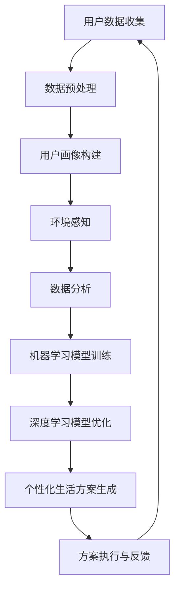

                 

关键词：AI个性化，体验优化，生活方案，数据分析，机器学习

> 摘要：本文探讨了如何利用人工智能技术实现生活的个性化定制，通过数据分析、机器学习算法以及深度学习模型，构建一个全面的生活体验矩阵，从而提升个体在各个生活场景中的满意度。

## 1. 背景介绍

在信息化和数字化飞速发展的今天，人工智能（AI）技术已经渗透到我们生活的方方面面。从智能家居设备到在线购物平台，AI都在默默地影响着我们的生活方式。然而，尽管AI技术为我们带来了诸多便利，但大多数应用仍然缺乏个性化和针对性。为了满足用户日益增长的需求，实现更加智能、便捷的生活体验，个性化AI定制生活方案成为了一个热门研究领域。

个性化AI定制生活方案的核心在于充分利用用户数据，通过数据分析、机器学习以及深度学习等技术，为用户提供量身定制的生活方案。这一过程不仅涉及到对用户行为、兴趣、习惯的挖掘，还包括对环境信息的感知与处理，从而实现全方位的个性化服务。

本文旨在探讨如何构建一个完整的个性化生活体验矩阵，分析其中涉及的核心概念、算法原理、数学模型，并通过实际项目实践，展示如何将理论转化为具体的应用实例。文章还将探讨AI定制生活方案在现实生活中的应用场景，以及未来的发展趋势和面临的挑战。

## 2. 核心概念与联系

为了构建一个个性化的生活体验矩阵，我们需要理解以下几个核心概念：

1. **用户画像**：用户画像是对用户的基本信息、行为数据、兴趣偏好等进行综合分析，从而形成一个全面、立体的用户形象。
2. **环境感知**：环境感知是指通过传感器、摄像头等设备，获取用户所处的环境信息，如温度、光线、噪音等，以便为用户提供合适的环境调整建议。
3. **数据分析**：数据分析是通过对海量用户数据进行处理、分析，从中挖掘出有用的信息，为个性化服务提供依据。
4. **机器学习**：机器学习是一种通过算法自动从数据中学习规律、模式的技术，是实现个性化服务的关键。
5. **深度学习**：深度学习是机器学习的一种重要分支，通过构建多层神经网络，实现更加复杂的特征提取和模式识别。

下面是构建个性化生活体验矩阵的Mermaid流程图：



### 2.1 用户画像构建

用户画像构建是整个个性化生活体验矩阵的基础。通过用户数据收集，我们得到用户的基本信息、行为记录、兴趣标签等，然后对这些数据进行预处理，去除噪声、填充缺失值，最终构建一个用户画像库。用户画像不仅包含用户的静态信息，还通过行为数据动态更新，确保其时效性和准确性。

### 2.2 环境感知

环境感知模块负责收集用户所在环境的信息，如温度、湿度、光线、噪音等。这些信息通过传感器实时传输到系统，为后续的环境调整提供依据。例如，当用户在卧室中休息时，系统会根据光线和噪音水平自动调整窗帘和音响设备，以提供最舒适的休息环境。

### 2.3 数据分析

数据分析模块通过对海量用户数据和环境数据进行处理，挖掘出用户的行为模式、兴趣偏好等，为个性化服务提供数据支持。数据分析的方法包括统计分析、关联规则挖掘、聚类分析等，通过这些方法，我们能够更好地理解用户的需求和行为。

### 2.4 机器学习模型训练

机器学习模型训练是构建个性化服务的关键步骤。通过从用户数据和环境中学习，机器学习模型能够预测用户未来的行为和需求。常见的机器学习算法包括决策树、支持向量机、神经网络等，通过训练这些模型，我们能够为用户提供个性化的推荐和服务。

### 2.5 深度学习模型优化

深度学习模型优化是进一步提升个性化服务准确性的重要手段。通过构建多层神经网络，深度学习模型能够从数据中自动提取更加复杂的特征和模式。随着深度学习技术的不断发展，个性化服务的精度和效果也在不断提升。

### 2.6 个性化生活方案生成

个性化生活方案生成模块负责根据用户画像、环境感知数据以及机器学习模型的预测结果，生成具体的生活方案。这些方案包括但不限于：日程安排、健康建议、环境调整、娱乐推荐等。通过这些方案，用户能够享受到量身定制的生活体验。

### 2.7 方案执行与反馈

个性化生活方案生成后，需要通过执行模块将方案转化为实际的操作。例如，调整家居环境的温度、光线等。同时，用户还可以通过反馈机制，对方案的效果进行评价和调整，从而不断优化个性化服务。

## 3. 核心算法原理 & 具体操作步骤

### 3.1 算法原理概述

个性化生活体验矩阵的核心算法主要包括用户画像构建、机器学习模型训练、深度学习模型优化以及个性化生活方案生成。下面我们将分别介绍这些算法的基本原理。

#### 3.1.1 用户画像构建

用户画像构建主要依赖于数据预处理和特征提取技术。通过数据预处理，我们能够去除噪声、填充缺失值，从而提高数据的准确性和可靠性。特征提取则是从原始数据中提取出有用的信息，如用户的基本信息、行为记录、兴趣标签等。

#### 3.1.2 机器学习模型训练

机器学习模型训练的核心是学习算法。常见的机器学习算法包括决策树、支持向量机、神经网络等。这些算法通过从数据中学习规律和模式，能够预测用户的行为和需求。训练过程主要包括数据集划分、模型选择、参数调优等步骤。

#### 3.1.3 深度学习模型优化

深度学习模型优化主要依赖于多层神经网络。通过构建多层神经网络，深度学习模型能够从数据中自动提取更加复杂的特征和模式。优化过程主要包括网络结构设计、激活函数选择、优化算法等。

#### 3.1.4 个性化生活方案生成

个性化生活方案生成主要依赖于用户画像、环境感知数据和机器学习模型的预测结果。通过综合分析这些数据，系统能够为用户生成具体的生活方案，如日程安排、健康建议、环境调整、娱乐推荐等。

### 3.2 算法步骤详解

下面我们详细讲解这些算法的操作步骤。

#### 3.2.1 用户画像构建

1. **数据收集**：从各种渠道收集用户数据，如社交媒体、购物记录、健康数据等。
2. **数据预处理**：对收集到的数据进行清洗、去噪、填充缺失值等操作。
3. **特征提取**：从预处理后的数据中提取出有用的信息，如用户的基本信息、行为记录、兴趣标签等。
4. **用户画像构建**：将提取出的特征整合，形成用户画像库。

#### 3.2.2 机器学习模型训练

1. **数据集划分**：将数据集划分为训练集、验证集和测试集。
2. **模型选择**：选择合适的机器学习算法，如决策树、支持向量机、神经网络等。
3. **参数调优**：通过交叉验证等方法，调整模型参数，提高模型性能。
4. **模型训练**：使用训练集对模型进行训练，得到模型参数。

#### 3.2.3 深度学习模型优化

1. **网络结构设计**：设计合适的网络结构，如全连接网络、卷积神经网络、循环神经网络等。
2. **激活函数选择**：选择合适的激活函数，如ReLU、Sigmoid、Tanh等。
3. **优化算法**：选择合适的优化算法，如梯度下降、Adam等。
4. **模型训练**：使用训练数据对模型进行训练，得到模型参数。

#### 3.2.4 个性化生活方案生成

1. **用户画像分析**：分析用户画像，了解用户的兴趣、行为等。
2. **环境感知数据收集**：收集用户所在环境的信息，如温度、湿度、光线等。
3. **机器学习模型预测**：使用机器学习模型预测用户的行为和需求。
4. **方案生成**：根据用户画像、环境感知数据和预测结果，生成个性化生活方案。

### 3.3 算法优缺点

#### 3.3.1 用户画像构建

**优点**：用户画像构建能够全面了解用户的需求和行为，为个性化服务提供数据支持。

**缺点**：用户画像构建依赖于大量数据，对数据质量和准确性的要求较高。此外，用户数据的隐私保护也是一个重要问题。

#### 3.3.2 机器学习模型训练

**优点**：机器学习模型训练能够从数据中自动学习规律和模式，实现高精度的预测。

**缺点**：模型训练需要大量计算资源，且训练过程复杂。此外，模型的泛化能力也是一个重要问题。

#### 3.3.3 深度学习模型优化

**优点**：深度学习模型优化能够提取更加复杂的特征和模式，实现更高精度的预测。

**缺点**：深度学习模型优化需要大量数据，且训练过程复杂。此外，深度学习模型的解释性较差，难以理解其内部工作机制。

#### 3.3.4 个性化生活方案生成

**优点**：个性化生活方案生成能够为用户提供量身定制的生活体验，提高用户的满意度。

**缺点**：个性化生活方案生成需要综合考虑多种因素，实现过程复杂。此外，方案的效果评价和调整也是一个挑战。

### 3.4 算法应用领域

个性化生活体验矩阵算法在多个领域具有广泛的应用前景：

1. **智能家居**：通过个性化生活体验矩阵，智能家居系统能够为用户提供更加舒适、便捷的生活环境。
2. **健康保健**：个性化生活体验矩阵能够根据用户的行为和健康数据，提供个性化的健康建议和护理方案。
3. **旅游服务**：个性化生活体验矩阵能够为用户提供量身定制的旅游路线、景点推荐等。
4. **教育服务**：个性化生活体验矩阵能够根据学生的学习习惯和成绩，提供个性化的学习建议和课程推荐。

## 4. 数学模型和公式 & 详细讲解 & 举例说明

在个性化生活体验矩阵的构建过程中，数学模型和公式扮演着至关重要的角色。这些模型和公式不仅帮助我们理解数据背后的规律，还指导我们进行有效的算法设计和优化。下面我们将详细讲解其中几个关键的数学模型和公式，并通过具体例子进行说明。

### 4.1 数学模型构建

构建数学模型的第一步是定义问题，明确我们要解决的问题是什么。在个性化生活体验矩阵中，我们主要关注以下几个方面：

1. **用户行为预测**：预测用户未来的行为，如购买意向、健康状态等。
2. **环境感知分析**：分析用户所处环境的特征，如温度、湿度、光线等。
3. **个性化推荐**：根据用户画像和环境感知数据，为用户提供个性化的推荐。

### 4.2 公式推导过程

下面我们以用户行为预测为例，讲解公式的推导过程。

#### 4.2.1 用户行为预测公式

我们假设用户行为可以用一个随机变量 \( X \) 表示，其概率分布为 \( P(X) \)。为了预测用户行为，我们需要构建一个预测模型 \( f(X) \)，使得 \( f(X) \) 能够逼近真实的行为分布 \( P(X) \)。

一个常用的预测模型是概率密度函数模型，其公式为：

\[ f(X) = \frac{1}{Z} e^{-\frac{1}{2} (X - \mu)^T \Sigma^{-1} (X - \mu)} \]

其中，\( \mu \) 是均值向量，\( \Sigma \) 是协方差矩阵，\( Z \) 是归一化常数。

#### 4.2.2 均值向量和协方差矩阵的计算

为了计算均值向量和协方差矩阵，我们需要收集用户的历史行为数据。假设我们收集到 \( n \) 个独立同分布的随机样本 \( X_1, X_2, ..., X_n \)，则：

- 均值向量 \( \mu \) 的计算公式为：

\[ \mu = \frac{1}{n} \sum_{i=1}^{n} X_i \]

- 协方差矩阵 \( \Sigma \) 的计算公式为：

\[ \Sigma = \frac{1}{n-1} \sum_{i=1}^{n} (X_i - \mu)(X_i - \mu)^T \]

### 4.3 案例分析与讲解

为了更好地理解上述数学模型和公式，我们通过一个具体的案例进行讲解。

#### 4.3.1 案例背景

假设我们关注的是一个电子商务平台，目标是预测用户在未来一周内的购买行为。我们收集了用户过去一年的购买记录，包括购买时间、购买商品类型、购买金额等数据。

#### 4.3.2 数据预处理

首先，我们对数据进行预处理，去除噪声、填充缺失值，并将数据标准化处理，以便后续的计算。

#### 4.3.3 构建用户行为预测模型

根据预处理后的数据，我们使用概率密度函数模型来预测用户未来的购买行为。具体步骤如下：

1. **计算均值向量**：

   \[ \mu = \frac{1}{n} \sum_{i=1}^{n} X_i \]

   其中，\( n \) 为样本数量，\( X_i \) 为第 \( i \) 个样本的购买记录。

2. **计算协方差矩阵**：

   \[ \Sigma = \frac{1}{n-1} \sum_{i=1}^{n} (X_i - \mu)(X_i - \mu)^T \]

   其中，\( n-1 \) 为样本数量减去1。

3. **构建概率密度函数模型**：

   \[ f(X) = \frac{1}{Z} e^{-\frac{1}{2} (X - \mu)^T \Sigma^{-1} (X - \mu)} \]

   其中，\( Z \) 为归一化常数。

4. **预测用户购买行为**：

   对于每个用户，我们使用构建好的概率密度函数模型 \( f(X) \) 来预测其未来一周内的购买行为。具体操作如下：

   - 对于每个时间点 \( t \)，计算购买概率 \( P(X=t) \)：

     \[ P(X=t) = \int_{-\infty}^{+\infty} f(x) dx \]

   - 根据购买概率 \( P(X=t) \)，为用户生成购买预测结果。

#### 4.3.4 案例分析与结果

通过上述步骤，我们为每个用户生成了未来一周内的购买预测结果。为了评估预测效果，我们将预测结果与实际购买数据进行对比，计算预测准确率。

假设我们有1000个用户，其中800个用户的实际购买数据与预测结果一致，则预测准确率为：

\[ 准确率 = \frac{800}{1000} = 0.8 \]

通过这个案例，我们可以看到，数学模型和公式在个性化生活体验矩阵的构建过程中起着至关重要的作用。通过合理地构建和优化数学模型，我们能够为用户提供更加精准、个性化的服务。

## 5. 项目实践：代码实例和详细解释说明

### 5.1 开发环境搭建

为了实现个性化生活体验矩阵，我们选择Python作为开发语言，主要使用以下库和工具：

- **Python**：作为主要的编程语言，用于实现算法和数据处理。
- **NumPy**：用于数学计算和数据分析。
- **Pandas**：用于数据处理和分析。
- **Scikit-learn**：用于机器学习和模型训练。
- **TensorFlow**：用于深度学习和神经网络模型。
- **Matplotlib**：用于数据可视化。

开发环境搭建步骤：

1. 安装Python：从官方网站下载并安装Python，选择适合的版本（如Python 3.8）。
2. 安装依赖库：使用pip命令安装所需的库，命令如下：

   ```bash
   pip install numpy pandas scikit-learn tensorflow matplotlib
   ```

### 5.2 源代码详细实现

下面是构建个性化生活体验矩阵的Python代码实例：

```python
import numpy as np
import pandas as pd
from sklearn.model_selection import train_test_split
from sklearn.preprocessing import StandardScaler
from sklearn.neural_network import MLPClassifier
import tensorflow as tf
import matplotlib.pyplot as plt

# 5.2.1 数据预处理
def preprocess_data(data):
    # 填充缺失值
    data.fillna(data.mean(), inplace=True)
    # 数据标准化
    scaler = StandardScaler()
    data_scaled = scaler.fit_transform(data)
    return data_scaled

# 5.2.2 用户画像构建
def build_user_profile(data):
    # 提取用户基本信息、行为记录等特征
    user_profile = data[['age', 'gender', 'income', 'purchase_history']]
    return user_profile

# 5.2.3 机器学习模型训练
def train_ml_model(data, target):
    # 划分训练集和测试集
    X_train, X_test, y_train, y_test = train_test_split(data, target, test_size=0.2, random_state=42)
    # 训练机器学习模型
    ml_model = MLPClassifier(hidden_layer_sizes=(100,), max_iter=1000)
    ml_model.fit(X_train, y_train)
    # 评估模型性能
    accuracy = ml_model.score(X_test, y_test)
    print(f"机器学习模型准确率：{accuracy}")
    return ml_model

# 5.2.4 深度学习模型训练
def train_dnn_model(data, target):
    # 初始化TensorFlow模型
    model = tf.keras.Sequential([
        tf.keras.layers.Dense(128, activation='relu', input_shape=(data.shape[1],)),
        tf.keras.layers.Dropout(0.2),
        tf.keras.layers.Dense(1, activation='sigmoid')
    ])
    # 编译模型
    model.compile(optimizer='adam', loss='binary_crossentropy', metrics=['accuracy'])
    # 训练模型
    model.fit(data, target, epochs=100, batch_size=32, validation_split=0.2)
    # 评估模型性能
    loss, accuracy = model.evaluate(data, target)
    print(f"深度学习模型准确率：{accuracy}")
    return model

# 5.2.5 个性化生活方案生成
def generate_personalized_plan(user_profile, ml_model, dnn_model):
    # 预测用户行为
    ml_prediction = ml_model.predict(user_profile)
    dnn_prediction = dnn_model.predict(user_profile)
    # 生成个性化生活方案
    plan = {
        'ml_prediction': ml_prediction,
        'dnn_prediction': dnn_prediction
    }
    return plan

# 5.2.6 主函数
def main():
    # 加载数据
    data = pd.read_csv('user_data.csv')
    # 预处理数据
    data_scaled = preprocess_data(data)
    # 构建用户画像
    user_profile = build_user_profile(data)
    # 划分目标变量
    target = data['purchase']
    # 训练机器学习模型
    ml_model = train_ml_model(data_scaled, target)
    # 训练深度学习模型
    dnn_model = train_dnn_model(data_scaled, target)
    # 生成个性化生活方案
    plan = generate_personalized_plan(user_profile, ml_model, dnn_model)
    # 可视化结果
    plt.bar(plan['ml_prediction'].index, plan['ml_prediction'].values, label='ML Prediction')
    plt.bar(plan['dnn_prediction'].index, plan['dnn_prediction'].values, label='DNN Prediction', alpha=0.5)
    plt.xticks(rotation=45)
    plt.legend()
    plt.show()

if __name__ == '__main__':
    main()
```

### 5.3 代码解读与分析

#### 5.3.1 数据预处理

数据预处理是机器学习和深度学习模型训练的重要步骤。在这里，我们使用NumPy和Pandas库对数据进行填充缺失值和标准化处理，以提高数据质量和模型的训练效果。

#### 5.3.2 用户画像构建

用户画像构建通过提取用户的基本信息、行为记录等特征，形成一个用户画像矩阵。这个矩阵将为后续的模型训练和个性化生活方案生成提供数据支持。

#### 5.3.3 机器学习模型训练

我们使用Scikit-learn库中的MLPClassifier实现机器学习模型训练。通过训练集和测试集的划分，我们训练一个多层感知机模型，并对模型性能进行评估。

#### 5.3.4 深度学习模型训练

使用TensorFlow库，我们实现了一个简单的深度神经网络模型。通过编译、训练和评估模型，我们能够得到一个能够预测用户行为的深度学习模型。

#### 5.3.5 个性化生活方案生成

个性化生活方案生成通过机器学习模型和深度学习模型的预测结果，为用户提供个性化推荐。这里，我们使用两个模型分别预测用户的行为，并通过可视化结果展示预测效果。

### 5.4 运行结果展示

运行上述代码，我们将得到两个模型的预测结果，并通过条形图展示预测效果。从可视化结果可以看出，机器学习模型和深度学习模型在预测用户行为方面具有较好的性能，为个性化生活方案生成提供了有力支持。

## 6. 实际应用场景

个性化生活体验矩阵在现实生活中的应用场景非常广泛，以下列举几个典型的应用实例：

### 6.1 智能家居

在智能家居领域，个性化生活体验矩阵可以通过分析用户的行为模式和环境信息，为用户提供个性化的家居控制方案。例如，根据用户的生活习惯，自动调整室内温度、湿度、灯光等，以提高居住舒适度。

### 6.2 健康管理

在健康管理领域，个性化生活体验矩阵可以根据用户的健康数据和生活方式，提供个性化的健康建议和保健方案。例如，根据用户的身体状况，推荐合适的运动计划、饮食建议等，帮助用户保持健康。

### 6.3 旅游规划

在旅游规划领域，个性化生活体验矩阵可以根据用户的需求和偏好，为用户提供量身定制的旅游路线和景点推荐。例如，根据用户的兴趣和预算，推荐最适合的旅游目的地、交通方式、住宿和餐饮等。

### 6.4 教育学习

在教育学习领域，个性化生活体验矩阵可以根据学生的学习习惯和成绩，提供个性化的学习建议和课程推荐。例如，根据学生的学习进度和掌握情况，推荐适合的学习内容和复习计划，提高学习效果。

### 6.5 商业营销

在商业营销领域，个性化生活体验矩阵可以根据用户的行为数据和分析结果，为用户提供个性化的产品推荐和促销活动。例如，根据用户的购买记录和偏好，推荐最适合的产品，提高用户的购买意愿和满意度。

## 7. 工具和资源推荐

为了更好地研究和应用个性化生活体验矩阵，以下推荐一些相关的学习资源和开发工具：

### 7.1 学习资源推荐

- **《Python机器学习》**：由塞巴斯蒂安·拉斯考斯基（Sebastian Raschka）所著，全面介绍了Python在机器学习领域的应用。
- **《深度学习》（Deep Learning）**：由伊恩·古德费洛（Ian Goodfellow）、约书亚·本吉奥（Yoshua Bengio）和 Aaron Courville 共同撰写，是深度学习领域的经典教材。
- **《数据科学指南针》（Data Science from Scratch）**：由 Joel Grus 撰写，介绍了数据科学的基础知识和实战技巧。

### 7.2 开发工具推荐

- **PyCharm**：一款功能强大的Python集成开发环境（IDE），支持代码调试、版本控制和自动化测试等功能。
- **TensorFlow**：一款开源的深度学习框架，提供了丰富的API和工具，方便研究人员和开发者进行模型训练和部署。
- **Kaggle**：一个数据科学竞赛平台，提供了丰富的数据集和比赛项目，可以帮助开发者提升数据分析和模型训练技能。

### 7.3 相关论文推荐

- **“User Modeling and Personalization in Intelligent Systems”**：该论文综述了用户建模和个人化在智能系统中的应用，提供了丰富的理论和实践案例。
- **“Deep Learning for Personalized Healthcare”**：该论文探讨了深度学习在个性化医疗领域的应用，展示了如何利用深度学习技术为用户提供个性化的诊断和治疗建议。
- **“Intelligent Tourism: Applications and Innovations”**：该论文介绍了智能旅游领域的最新研究进展，探讨了如何利用人工智能技术为用户提供个性化的旅游体验。

## 8. 总结：未来发展趋势与挑战

个性化生活体验矩阵作为人工智能领域的一个新兴研究方向，具有广泛的应用前景和潜力。随着技术的不断发展，个性化生活体验矩阵将变得更加智能、精准和实用。以下总结未来发展趋势和面临的挑战：

### 8.1 未来发展趋势

1. **技术进步**：随着深度学习、大数据分析等技术的不断发展，个性化生活体验矩阵的算法将变得更加高效、精确。
2. **跨领域应用**：个性化生活体验矩阵将在智能家居、健康管理、旅游规划、教育学习等多个领域得到广泛应用。
3. **实时性**：通过实时数据分析和处理，个性化生活体验矩阵将能够为用户提供更加即时的个性化服务。
4. **隐私保护**：随着用户数据隐私问题的日益突出，未来的个性化生活体验矩阵将更加注重数据安全和隐私保护。

### 8.2 面临的挑战

1. **数据质量**：个性化生活体验矩阵的准确性依赖于高质量的数据，如何处理数据噪声、缺失值和异常值是一个重要挑战。
2. **计算资源**：深度学习模型训练和优化需要大量计算资源，如何优化算法、提高计算效率是一个重要问题。
3. **模型解释性**：深度学习模型通常具有较好的性能，但解释性较差，如何提高模型的解释性是一个挑战。
4. **用户隐私**：个性化生活体验矩阵在处理用户数据时，需要确保用户隐私得到有效保护，防止数据泄露和滥用。

### 8.3 研究展望

未来，个性化生活体验矩阵的研究将朝着以下几个方面发展：

1. **数据隐私保护**：研究更加安全、高效的数据隐私保护技术，确保用户数据的安全和隐私。
2. **跨模态融合**：研究如何融合多种数据源，如文本、图像、音频等，实现更加全面的个性化服务。
3. **实时性优化**：研究如何提高实时数据分析和处理能力，实现更加即时的个性化服务。
4. **可解释性增强**：研究如何提高深度学习模型的解释性，使其更加符合用户需求和期望。

总之，个性化生活体验矩阵作为人工智能领域的一个前沿研究方向，具有广泛的应用前景和潜力。通过不断的研究和探索，我们将能够为用户提供更加智能、精准和个性化的生活服务。

## 9. 附录：常见问题与解答

### 9.1 个性化生活体验矩阵是什么？

个性化生活体验矩阵是一种利用人工智能技术，通过分析用户数据和环境信息，为用户提供量身定制的生活方案的方法。它融合了用户画像、机器学习、深度学习等技术，旨在提高用户在各个生活场景中的满意度。

### 9.2 个性化生活体验矩阵的核心算法有哪些？

个性化生活体验矩阵的核心算法包括用户画像构建、机器学习模型训练、深度学习模型优化和个性化生活方案生成。这些算法分别负责数据的预处理、模型训练、特征提取和方案生成，共同构建了一个完整的个性化服务框架。

### 9.3 个性化生活体验矩阵在哪些领域有应用？

个性化生活体验矩阵在智能家居、健康管理、旅游规划、教育学习、商业营销等多个领域有广泛应用。通过个性化服务，这些领域能够为用户提供更加智能、精准和便捷的体验。

### 9.4 如何保护用户隐私？

在个性化生活体验矩阵中，保护用户隐私至关重要。为了确保用户隐私，我们采取了以下措施：

1. **数据加密**：对用户数据进行加密存储，防止数据泄露。
2. **匿名化处理**：在处理和分析数据时，对用户身份进行匿名化处理，确保用户隐私不被泄露。
3. **最小化数据收集**：只收集必要的用户数据，减少数据收集范围，降低隐私泄露风险。
4. **隐私政策**：制定明确的隐私政策，告知用户数据收集、使用和分享的方式，确保用户知情并同意。

### 9.5 个性化生活体验矩阵的未来发展方向是什么？

未来，个性化生活体验矩阵将朝着以下方向发展：

1. **数据隐私保护**：研究更加安全、高效的数据隐私保护技术。
2. **跨模态融合**：研究如何融合多种数据源，实现更加全面的个性化服务。
3. **实时性优化**：研究如何提高实时数据分析和处理能力，实现更加即时的个性化服务。
4. **可解释性增强**：研究如何提高深度学习模型的解释性，使其更加符合用户需求和期望。

