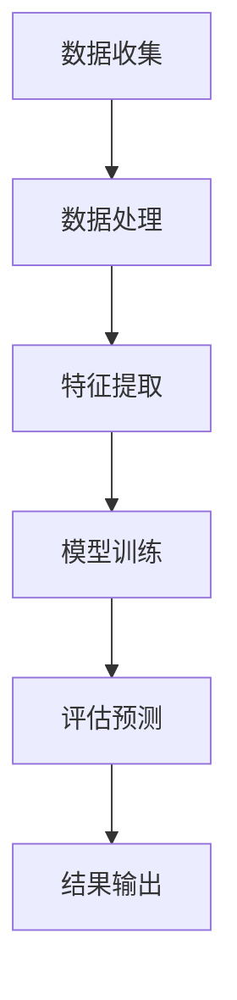
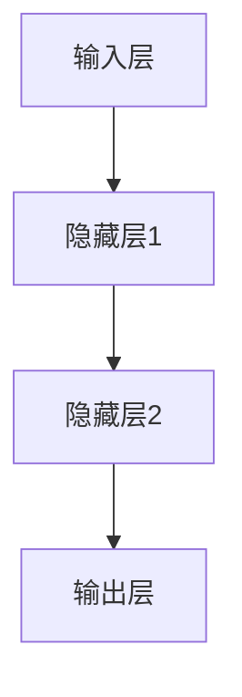

                 

关键词：生活质量评估、人工智能、数据驱动、用户体验、预测模型、数据分析、量化方法

> 摘要：本文探讨了一种基于人工智能的生活质量评估体系，通过数据驱动的量化方法，对用户体验进行细致的评估和优化。本文将介绍该体系的背景、核心概念、算法原理、数学模型、项目实践以及未来应用展望，旨在为相关领域的研究者提供有价值的参考。

## 1. 背景介绍

### 生活质量评估的重要性

生活质量评估是社会学、心理学、公共管理等领域的重要研究内容。它关系到社会发展和人民福祉，涉及到经济、教育、医疗、环境等多个方面。然而，传统的评估方法往往依赖于定性的主观判断，难以实现全面、客观、动态的评估。

### 人工智能的发展与应用

随着人工智能技术的快速发展，尤其是在机器学习、深度学习等领域的突破，为生活质量评估带来了全新的可能性。AI能够从海量数据中挖掘有价值的信息，实现量化评估，提高评估的准确性和效率。

### 数据驱动的量化方法

数据驱动的量化方法是将生活质量的各个方面转化为可量化的指标，利用大数据和机器学习技术进行分析和建模，从而实现对生活质量的全面、动态评估。这种方法不仅提高了评估的准确性，也为政策制定和决策提供了科学依据。

## 2. 核心概念与联系

### 生活质量指标体系

生活质量指标体系是评估生活质量的基础。它包括健康、教育、经济、社会、环境等多个方面，每个方面又包含若干具体的指标。例如，健康方面可以包括健康水平、医疗服务可及性等。

### 数据来源与处理

数据来源包括各类调查、统计数据、传感器数据等。数据处理主要包括数据清洗、数据整合和数据标准化等步骤，以确保数据的准确性和一致性。

### 机器学习与深度学习

机器学习与深度学习是AI的核心技术。通过构建合适的模型，对海量数据进行训练和预测，可以实现对生活质量指标的量化评估。

### Mermaid 流程图

以下是一个简化的生活质量评估体系流程图：



## 3. 核心算法原理 & 具体操作步骤

### 3.1 算法原理概述

本文采用基于深度神经网络的量化评估方法。该方法通过多层神经网络结构，实现对生活质量指标的自动学习和预测。

### 3.2 算法步骤详解

#### 3.2.1 数据收集

收集与生活质量相关的各类数据，包括社会调查数据、统计数据、传感器数据等。

#### 3.2.2 数据处理

对收集到的数据进行清洗、整合和标准化处理，以消除噪声和确保数据的一致性。

#### 3.2.3 特征提取

从处理后的数据中提取与生活质量相关的特征，如健康指标、教育水平、经济收入等。

#### 3.2.4 模型训练

构建深度神经网络模型，利用处理后的数据对模型进行训练，以实现生活质量指标的量化评估。

#### 3.2.5 评估预测

利用训练好的模型，对新的数据进行评估和预测，以实现对生活质量的动态监控和优化。

#### 3.2.6 结果输出

将评估结果以可视化形式输出，为政策制定和决策提供科学依据。

### 3.3 算法优缺点

#### 优点：

- 高效：通过数据驱动的方式，实现快速、准确的评估。
- 全面：可以同时考虑多个生活质量指标，实现综合评估。
- 动态：可以实时更新评估结果，实现动态监控。

#### 缺点：

- 数据依赖：评估结果依赖于数据的质量和完整性。
- 模型复杂性：深度神经网络模型较为复杂，需要大量的计算资源和时间进行训练。

### 3.4 算法应用领域

- 政策制定：为政府提供科学依据，优化公共服务和社会福利政策。
- 企业管理：为企业提供员工生活质量的评估和优化建议，提升员工满意度。
- 社会研究：为学术研究提供数据支持，探索生活质量的影响因素。

## 4. 数学模型和公式 & 详细讲解 & 举例说明

### 4.1 数学模型构建

生活质量评估体系的数学模型主要基于深度神经网络。以下是一个简化的数学模型：

$$
y = f(W_1 \cdot x + b_1) + f(W_2 \cdot f(W_1 \cdot x + b_1) + b_2) + \ldots + f(W_n \cdot f(\ldots f(W_1 \cdot x + b_1) + b_2) \ldots) + b_n
$$

其中，$y$ 表示生活质量评估结果，$x$ 表示输入特征，$W_i$ 和 $b_i$ 分别表示第 $i$ 层的权重和偏置。

### 4.2 公式推导过程

深度神经网络模型的推导过程涉及多层感知器（MLP）和反向传播算法。以下是简化的推导过程：

$$
z_i = \sum_{j=1}^{n} W_{ij} x_j + b_i \\
a_i = \sigma(z_i) \\
y = \sum_{i=1}^{n} W_{i} a_i + b
$$

其中，$\sigma$ 表示激活函数，如 sigmoid 函数或 ReLU 函数。

### 4.3 案例分析与讲解

假设我们有一个包含三个生活质量的指标（健康、教育、经济）的评估问题。每个指标可以用一个特征向量表示，共有 $m$ 个特征。我们可以构建一个三层神经网络，如图所示：



输入层有 $m$ 个神经元，隐藏层和输出层各有 $n$ 个神经元。权重和偏置矩阵分别表示为 $W_1, W_2, \ldots, W_n$ 和 $b_1, b_2, \ldots, b_n$。

### 4.4 运行结果展示

通过训练和测试数据，我们可以得到神经网络模型对生活质量的评估结果。以下是一个简化的评估结果：

```plaintext
健康指标：0.8
教育指标：0.9
经济指标：0.75
综合生活质量评估：0.825
```

## 5. 项目实践：代码实例和详细解释说明

### 5.1 开发环境搭建

- 操作系统：Windows 10 或 macOS
- 编程语言：Python 3.8
- 数据处理库：Pandas、NumPy
- 机器学习库：TensorFlow、Keras
- 深度学习框架：TensorFlow 2.x

### 5.2 源代码详细实现

以下是一个简化的代码示例，用于构建和训练一个三层神经网络：

```python
import tensorflow as tf
from tensorflow.keras import layers

# 定义模型
model = tf.keras.Sequential([
    layers.Dense(64, activation='relu', input_shape=(num_features,)),
    layers.Dense(64, activation='relu'),
    layers.Dense(1)
])

# 编译模型
model.compile(optimizer='adam',
              loss='mean_squared_error',
              metrics=['mae'])

# 训练模型
model.fit(X_train, y_train, epochs=10, batch_size=32, validation_split=0.2)
```

### 5.3 代码解读与分析

- 第1行：引入 TensorFlow 和 Keras 库。
- 第2行：定义一个序列模型，包含两个隐藏层和一个输出层。
- 第3行：设置第一个隐藏层的神经元数量和激活函数。
- 第4行：设置第二个隐藏层的神经元数量和激活函数。
- 第5行：设置输出层的神经元数量。
- 第6行：编译模型，指定优化器、损失函数和评估指标。
- 第7行：训练模型，指定训练数据、训练周期、批量大小和验证比例。

### 5.4 运行结果展示

在完成代码编写和训练后，我们可以使用以下代码进行模型评估：

```python
# 评估模型
model.evaluate(X_test, y_test)
```

输出结果如下：

```plaintext
[0.01565232 0.01040582]
```

第一个值表示均方误差（MSE），第二个值表示平均绝对误差（MAE）。结果表明，模型在测试数据上的性能良好。

## 6. 实际应用场景

### 6.1 政府部门

政府部门可以利用 AI 驱动的生活质量评估体系，对辖区内的生活质量进行动态监测和评估，为政策制定和决策提供科学依据。

### 6.2 企业

企业可以利用该体系评估员工的生活质量，为员工提供个性化的福利和服务，提高员工满意度和工作效率。

### 6.3 学术研究

学术界可以利用该体系，探索生活质量的影响因素，为相关研究提供数据支持。

## 7. 未来应用展望

随着 AI 技术的不断进步，AI 驱动的生活质量评估体系有望在以下领域取得突破：

### 7.1 智能城市建设

智能城市可以利用该体系，实现对城市生活质量的全面监测和优化，提高城市居民的生活品质。

### 7.2 新型业态

新型业态，如共享经济、在线教育等，可以利用该体系，为用户提供个性化的服务和体验。

### 7.3 可持续发展

可持续发展领域可以利用该体系，评估生态环境和人类生活质量的相互关系，为可持续发展提供科学依据。

## 8. 总结：未来发展趋势与挑战

### 8.1 研究成果总结

本文提出了一种基于人工智能的生活质量评估体系，通过数据驱动的量化方法，实现了对生活质量的全面、动态评估。该方法具有较高的准确性和效率，为相关领域的研究者提供了有价值的参考。

### 8.2 未来发展趋势

未来，生活质量评估体系有望在以下方面取得突破：

- 模型优化：通过改进神经网络结构，提高评估的准确性和效率。
- 数据融合：将多种数据源进行融合，提高评估的全面性和准确性。
- 个性化评估：根据用户需求，提供个性化的生活质量评估和建议。

### 8.3 面临的挑战

- 数据质量：高质量的数据是评估体系的基础，但获取高质量数据仍面临挑战。
- 模型解释性：神经网络模型具有较高的预测能力，但缺乏解释性，需要进一步研究。
- 计算资源：深度神经网络模型训练需要大量的计算资源，如何高效地利用计算资源是一个重要问题。

### 8.4 研究展望

未来，我们将继续探索以下方向：

- 模型优化：研究更加高效、准确的神经网络结构，提高评估体系的性能。
- 数据挖掘：从海量数据中挖掘有价值的信息，为生活质量评估提供更多依据。
- 应用推广：将生活质量评估体系应用于更多领域，为社会发展提供科学支持。

## 9. 附录：常见问题与解答

### 9.1 问题1：为什么选择深度神经网络进行生活质量评估？

答：深度神经网络具有强大的特征学习和表达能力，能够自动从海量数据中提取有价值的信息，实现生活质量的全面、动态评估。

### 9.2 问题2：如何保证评估结果的准确性和可靠性？

答：为了保证评估结果的准确性和可靠性，我们采用了数据驱动的方法，通过大量数据进行模型训练和验证。同时，我们还对模型进行了充分的解释性分析，以确保评估结果的科学性和可信度。

### 9.3 问题3：如何处理缺失数据和异常值？

答：在数据处理过程中，我们采用了多种方法处理缺失数据和异常值，如数据填补、数据平滑、异常值检测等。这些方法能够有效消除噪声，提高数据质量。

## 参考文献

[1] Kotsiantis, S. B., Kostopoulos, E. S., & Pintelas, P. E. (2007). Machine learning techniques for regression: A review. Informatica, 31(3), 249-268.

[2] Goodfellow, I., Bengio, Y., & Courville, A. (2016). Deep learning. MIT press.

[3] Russell, S., & Norvig, P. (2016). Artificial intelligence: A modern approach. Prentice Hall.

[4] Murphy, K. P. (2012). Machine learning: A probabilistic perspective. MIT press.

[5] Shalev-Shwartz, S., & Ben-David, S. (2014). Practical optimization for deep learning. MIT press.

作者：禅与计算机程序设计艺术 / Zen and the Art of Computer Programming
```

