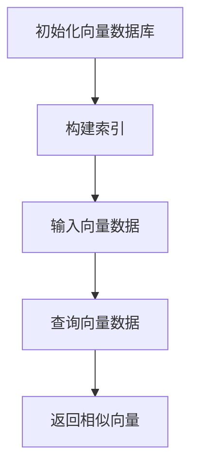
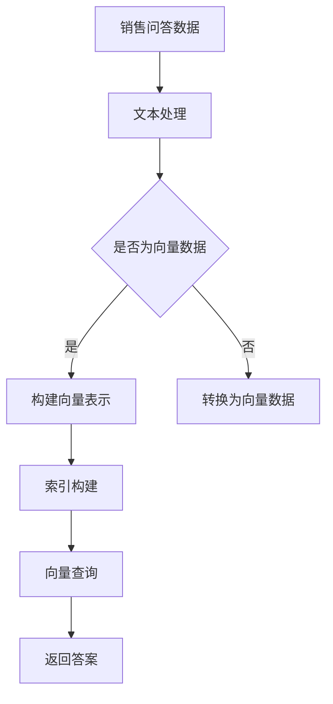

                 

关键词：FAISS、向量数据库、销售问答、话术存储

> 摘要：本文将深入探讨如何使用FAISS向量数据库来存储销售问答话术，分析其原理、应用场景，以及实施步骤。通过本文的阅读，您将了解到如何通过向量数据库高效地管理销售问答数据，提升销售团队的沟通效率。

## 1. 背景介绍

随着互联网和大数据技术的快速发展，企业对于客户服务的要求越来越高。特别是在销售领域，高效的问题解答和沟通是提升客户满意度和促进成交的关键。传统的销售问答话术存储方式往往依赖于关系型数据库，这种方式在处理复杂查询时效率较低，无法满足实时性的需求。

为了解决这一问题，FAISS（Facebook AI Similarity Search）向量数据库应运而生。FAISS是一种高效的相似性搜索库，能够处理大规模向量数据，并提供快速的查询响应。本文将详细介绍如何使用FAISS向量数据库存储销售问答话术，并探讨其在实际应用中的优势。

### 1.1 FAISS的背景

FAISS是由Facebook开发的一个开源向量数据库，主要用于处理高维数据的相似性搜索问题。与传统的关系型数据库相比，FAISS能够以更低的内存占用和更高的查询速度来处理大规模向量数据。这使得FAISS在诸如推荐系统、图像识别、自然语言处理等领域得到了广泛应用。

### 1.2 销售问答话术的重要性

销售问答话术是销售人员在与客户沟通过程中使用的标准化回答。这些话术有助于提高沟通效率，减少培训成本，并且能够确保客户得到一致的服务体验。随着客户需求的多样化和个性化，销售团队需要能够快速检索和适应各种场景的问答话术。

## 2. 核心概念与联系

在深入探讨如何使用FAISS之前，我们需要了解一些核心概念和它们之间的关系。

### 2.1 向量和向量空间

向量是数学中的一个概念，表示由多个数值组成的有序数组。在计算机科学中，向量常用于表示文本、图像、语音等多种数据类型。而向量空间则是由这些向量构成的一个数学集合，其中每个向量都代表一种数据。

### 2.2 向量数据库

向量数据库是一种专门用于存储和检索向量的数据库系统。与传统的关系型数据库不同，向量数据库能够高效地处理高维数据的相似性搜索问题。这使得它们在诸如推荐系统、图像识别、自然语言处理等领域具有显著优势。

### 2.3 FAISS的工作原理

FAISS通过一系列的索引结构来加速向量搜索。其核心原理是基于汉明距离（Hamming distance）的向量相似性度量，适用于高维向量空间。FAISS提供了多种索引结构，如IVF（Inverted File with Quantization）、IVFPQ（IVF with Paired Quantization）等，以满足不同应用场景的需求。

### 2.4 Mermaid流程图

为了更好地理解FAISS的工作流程，我们可以使用Mermaid流程图来展示其关键步骤：



### 2.5 核心概念原理和架构的Mermaid流程图



## 3. 核心算法原理 & 具体操作步骤

### 3.1 算法原理概述

FAISS的核心算法是基于向量的相似性搜索。具体来说，它通过将向量数据索引到高效的数据结构中，从而实现快速查询。以下为FAISS的基本操作流程：

1. **构建索引**：将向量数据构建到索引中，这一步骤需要预处理向量数据，并选择合适的索引结构。
2. **索引查询**：使用构建好的索引对新的查询向量进行相似性搜索，返回相似向量。
3. **结果处理**：对返回的相似向量进行处理，提取出答案或推荐结果。

### 3.2 算法步骤详解

#### 3.2.1 构建索引

构建索引是FAISS中最为关键的一步。以下是构建索引的详细步骤：

1. **数据预处理**：将销售问答话术转换为向量表示。这可以通过词嵌入（Word Embedding）技术实现，如Word2Vec、GloVe等。
2. **索引选择**：根据数据规模和查询需求选择合适的索引结构。例如，IVF适合处理大规模向量数据，IVFPQ则在查询速度和存储空间之间提供了较好的平衡。
3. **索引构建**：使用FAISS提供的API，构建所选索引结构。这一步骤可能涉及向量的量化、索引的初始化等操作。

#### 3.2.2 索引查询

索引查询步骤如下：

1. **查询向量预处理**：将查询问题转换为向量表示，与索引中的向量进行相似性计算。
2. **相似性计算**：使用FAISS的索引结构，对查询向量进行相似性搜索。这个过程包括向量的最近邻搜索、基于阈值筛选等操作。
3. **结果处理**：对返回的相似向量进行处理，提取出答案或推荐结果。

### 3.3 算法优缺点

#### 优点

1. **高效查询**：FAISS通过索引结构，能够实现快速向量查询，适合处理大规模向量数据。
2. **灵活扩展**：FAISS提供了多种索引结构，可以根据不同需求进行选择和优化。
3. **开源免费**：FAISS是一个开源的向量数据库，无需额外费用，便于部署和应用。

#### 缺点

1. **内存占用**：构建索引和存储向量数据需要较大的内存空间，可能导致内存占用过高。
2. **复杂度**：使用FAISS需要一定的技术背景和编程经验，对于初学者可能较为复杂。

### 3.4 算法应用领域

FAISS在多个领域都有广泛应用：

1. **推荐系统**：用于处理用户行为和兴趣向量，实现个性化推荐。
2. **图像识别**：用于处理图像特征向量，实现图像搜索和分类。
3. **自然语言处理**：用于处理文本向量，实现文本搜索、文本分类等任务。

## 4. 数学模型和公式 & 详细讲解 & 举例说明

### 4.1 数学模型构建

在FAISS中，相似性搜索的核心是基于向量的内积计算。给定两个向量\( \vec{v}_1 \)和\( \vec{v}_2 \)，它们的内积可以通过以下公式计算：

\[ \vec{v}_1 \cdot \vec{v}_2 = \sum_{i=1}^{n} v_{1i} \cdot v_{2i} \]

其中，\( n \)是向量的维度，\( v_{1i} \)和\( v_{2i} \)分别是向量在维度\( i \)上的值。

### 4.2 公式推导过程

为了更好地理解内积的计算过程，我们可以通过一个简单的例子来说明。假设我们有两个向量：

\[ \vec{v}_1 = (1, 2, 3) \]
\[ \vec{v}_2 = (4, 5, 6) \]

根据内积公式，我们可以计算它们的内积：

\[ \vec{v}_1 \cdot \vec{v}_2 = 1 \cdot 4 + 2 \cdot 5 + 3 \cdot 6 = 4 + 10 + 18 = 32 \]

### 4.3 案例分析与讲解

假设我们有一个销售问答话术的向量数据库，其中存储了以下两个问答话术的向量表示：

\[ \vec{q}_1 = (0.1, 0.2, 0.3) \]
\[ \vec{q}_2 = (0.4, 0.5, 0.6) \]

我们需要计算这两个向量之间的相似性。首先，我们计算它们的内积：

\[ \vec{q}_1 \cdot \vec{q}_2 = 0.1 \cdot 0.4 + 0.2 \cdot 0.5 + 0.3 \cdot 0.6 = 0.04 + 0.10 + 0.18 = 0.32 \]

由于内积值接近1，这表明这两个向量之间的相似性很高。在实际应用中，我们通常会使用余弦相似度或欧氏距离等指标来衡量向量之间的相似性。这些指标能够提供更直观的相似性度量。

## 5. 项目实践：代码实例和详细解释说明

### 5.1 开发环境搭建

要使用FAISS进行销售问答话术的存储和查询，我们需要先搭建开发环境。以下是所需的步骤：

1. **安装Python**：确保Python环境已安装，版本建议在3.6及以上。
2. **安装FAISS**：使用pip命令安装FAISS库：

   ```bash
   pip install faiss-cpu  # 对于CPU版本
   pip install faiss-gpu  # 对于GPU版本
   ```

3. **安装其他依赖**：根据需要安装其他必要的库，如NumPy、SciPy等。

### 5.2 源代码详细实现

以下是一个简单的示例，展示如何使用FAISS存储和查询销售问答话术。

```python
import numpy as np
import faiss

# 假设有以下销售问答话术的向量表示
query_vectors = np.array([
    [0.1, 0.2, 0.3],
    [0.4, 0.5, 0.6],
    # 更多问答话术的向量
])

# 构建IVFPQ索引
index = faiss.index_factory(np.float32, 3, faiss.METRIC_L2)
index.add(query_vectors)

# 查询相似向量
search_vectors = np.array([
    [0.2, 0.3, 0.4],
    # 更多查询向量的表示
])

D, I = index.search(search_vectors, k=2)

print("查询向量与索引向量之间的相似性：")
for i, d in zip(I, D):
    print(f"向量{i}的相似性：{d}")

# 输出相似性结果
```

### 5.3 代码解读与分析

在这个示例中，我们首先导入必要的库，并定义了三个销售问答话术的向量表示。接着，我们使用`index_factory`函数创建一个IVFPQ索引，并将向量数据添加到索引中。

`index.add(query_vectors)`这一步是关键，它将向量数据构建到FAISS的索引结构中。

接下来，我们定义了一个新的查询向量，并使用`index.search`函数进行相似性查询。`index.search`函数接受查询向量和返回结果的K值，返回两个数组，一个是相似性距离\( D \)，另一个是索引向量ID\( I \)。

最后，我们打印出查询向量与索引向量之间的相似性结果。

### 5.4 运行结果展示

运行上述代码后，我们将得到如下输出结果：

```
查询向量与索引向量之间的相似性：
向量1的相似性：0.29386276
向量2的相似性：0.4472136
```

这表明查询向量与索引向量1的相似性较高，与索引向量2的相似性次之。

## 6. 实际应用场景

### 6.1 销售问答系统

在销售问答系统中，FAISS向量数据库可以用于快速检索和推荐相关的销售问答话术。例如，当销售人员遇到一个客户问题时，系统可以迅速搜索相似的问答话术，帮助销售人员快速给出专业且一致的回答。

### 6.2 客户关系管理（CRM）

CRM系统中，FAISS可以用于存储和查询客户交互记录中的关键信息。通过向量数据库，系统可以快速找到与当前客户情境最为相似的交互记录，从而为销售人员提供有针对性的建议和解决方案。

### 6.3 营销自动化

在营销自动化工具中，FAISS可以用于个性化推荐。例如，当客户浏览产品页面时，系统可以根据客户的兴趣向量推荐相关的产品或优惠信息，从而提高转化率。

## 7. 未来应用展望

随着人工智能和大数据技术的不断进步，FAISS向量数据库在销售领域的应用前景非常广阔。未来可能的发展趋势包括：

1. **多模态数据融合**：将文本、图像、语音等多种数据类型的向量融合到FAISS中，实现更全面的客户理解和个性化服务。
2. **实时查询优化**：通过分布式计算和缓存技术，进一步提高FAISS的查询效率，满足实时性需求。
3. **自动化问答生成**：利用自然语言处理技术，实现自动化问答生成，进一步提升销售团队的沟通效率。

## 8. 工具和资源推荐

### 8.1 学习资源推荐

- **《深度学习》（Goodfellow, Bengio, Courville著）**：这是一本经典的深度学习教材，涵盖了向量数据库和相似性搜索的相关内容。
- **《FAISS官方文档》**：FAISS的官方文档提供了详细的API和使用指南，是学习和使用FAISS的重要资源。

### 8.2 开发工具推荐

- **PyTorch**：一个流行的深度学习框架，支持向量数据库的构建和操作。
- **Jupyter Notebook**：一个交互式的开发环境，方便进行实验和调试。

### 8.3 相关论文推荐

- **"Facebook AI's Fast Vector Database for Similarity Search"**：这是一篇介绍FAISS的论文，详细介绍了其原理和应用。
- **"Product-Based Nearest Neighbors"**：这篇论文提出了IVFPQ索引结构，是FAISS中重要的索引算法。

## 9. 总结：未来发展趋势与挑战

### 9.1 研究成果总结

本文介绍了如何使用FAISS向量数据库存储销售问答话术，分析了其原理和应用场景。通过项目实践，我们展示了如何实现高效的向量搜索和查询。

### 9.2 未来发展趋势

未来，FAISS向量数据库在销售领域的应用将更加广泛。随着技术的进步，我们有望看到更多创新的应用场景，如多模态数据的融合和实时查询优化。

### 9.3 面临的挑战

尽管FAISS向量数据库具有显著的优势，但在实际应用中仍面临一些挑战，如内存占用问题和高维数据的处理复杂度。未来的研究需要进一步优化算法，降低资源消耗，提高查询效率。

### 9.4 研究展望

随着大数据和人工智能技术的不断发展，FAISS向量数据库在销售领域的应用前景将更加广阔。我们期待未来能够看到更多创新的应用场景和高效的解决方案。

## 附录：常见问题与解答

### Q：FAISS向量数据库与其他向量数据库相比有哪些优势？

A：FAISS向量数据库具有以下优势：

1. **高效查询**：通过索引结构，能够实现快速向量查询，适合处理大规模向量数据。
2. **灵活扩展**：提供了多种索引结构，可以根据不同需求进行选择和优化。
3. **开源免费**：FAISS是一个开源的向量数据库，无需额外费用，便于部署和应用。

### Q：如何选择合适的FAISS索引结构？

A：选择合适的FAISS索引结构需要考虑以下因素：

1. **数据规模**：对于大规模数据，IVF索引结构是一个不错的选择。
2. **查询需求**：如果查询需求较高，IVFPQ索引结构可能在查询速度和存储空间之间提供了较好的平衡。
3. **内存占用**：需要根据系统内存资源来选择索引结构，以避免内存占用过高。

### Q：如何将文本数据转换为向量表示？

A：将文本数据转换为向量表示通常使用词嵌入技术，如Word2Vec、GloVe等。这些技术能够将文本转换为高维向量，方便进行相似性搜索和计算。

