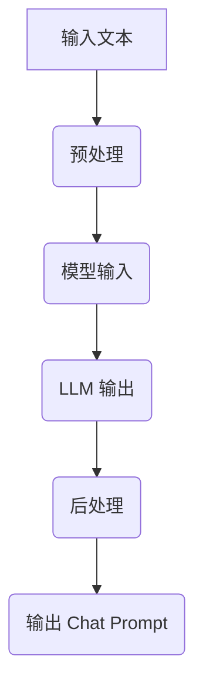

                 

关键词：LLMChain，Chat Prompt，自然语言处理，模型设计，代码示例

>摘要：本文将深入探讨如何使用 LLMChain 简化构造 Chat Prompt 的过程，详细解释了核心概念、算法原理、应用领域，并通过数学模型和代码实例进行详尽讲解。

## 1. 背景介绍

随着自然语言处理技术的不断发展，聊天机器人（Chatbot）已成为企业与客户互动的重要手段。这些聊天机器人能够提供即时响应、减少人力成本，并且可以24小时不间断服务。然而，构建一个有效的聊天机器人并非易事，特别是当需要处理复杂对话和高度个性化的交流时。

Chat Prompt 是构建聊天机器人的关键，它决定了机器人如何理解并回应用户的输入。传统的 Chat Prompt 构造通常需要大量的手动编码和调试，这不仅费时费力，而且容易出错。为了解决这一问题，我们引入了 LLMChain，这是一种基于大型语言模型的工具，旨在简化 Chat Prompt 的构造过程。

## 2. 核心概念与联系

### 2.1 LLMChain 基础概念

LLMChain（Large Language Model Chain）是一种基于大型语言模型的工具，它能够自动化生成高质量的 Chat Prompt。LLMChain 利用预训练的语言模型，如 GPT-3 或 BERT，通过一系列的预处理和后处理步骤，生成符合要求的聊天交互文本。

### 2.2 LLMChain 与 Chat Prompt 的关系

LLMChain 与 Chat Prompt 的关系可以理解为：LLMChain 是 Chat Prompt 的生成器，它能够根据给定的输入文本，自动生成相应的 Chat Prompt。这种生成过程是基于对大量语料库的训练和学习，从而使得生成的 Chat Prompt 更加自然和贴近用户需求。

### 2.3 Mermaid 流程图

下面是一个简化的 LLMChain 架构的 Mermaid 流程图：



## 3. 核心算法原理 & 具体操作步骤

### 3.1 算法原理概述

LLMChain 的核心算法基于大型语言模型，如 GPT-3 或 BERT。这些模型通过在大量文本语料库上进行训练，已经学习到了自然语言的生成规则和模式。LLMChain 利用这一优势，通过预处理、模型输入、模型输出和后处理四个步骤，生成高质量的 Chat Prompt。

### 3.2 算法步骤详解

#### 3.2.1 预处理

预处理步骤主要是对输入文本进行清洗和格式化，以便于模型更好地理解和生成文本。例如，删除无意义的标点符号、统一文本格式等。

#### 3.2.2 模型输入

预处理后的文本被作为输入传入语言模型。在这个阶段，LLMChain 会根据预训练的语言模型生成一系列的可能输出。

#### 3.2.3 模型输出

语言模型会根据输入文本生成多个可能的输出结果。这些输出结果通常是一个文本列表，其中每个文本都是对输入文本的一个可能回应。

#### 3.2.4 后处理

后处理步骤主要是对模型输出结果进行筛选和优化。例如，根据文本的长度、内容相关性等因素，选择最合适的输出结果作为最终的 Chat Prompt。

### 3.3 算法优缺点

#### 优点：

- 自动化生成 Chat Prompt，节省人力和时间成本。
- 生成的 Chat Prompt 更加自然和贴近用户需求。

#### 缺点：

- 对预训练语言模型的要求较高，需要大量的计算资源和时间进行训练。
- 可能会产生一些不准确或不当的输出结果。

### 3.4 算法应用领域

LLMChain 在多个领域都有广泛的应用，如客户服务、智能助手、虚拟客服等。它能够处理各种复杂的对话场景，提供高质量的服务。

## 4. 数学模型和公式

### 4.1 数学模型构建

LLMChain 的核心是预训练语言模型，如 GPT-3 或 BERT。这些模型基于深度神经网络，通过大量的文本数据进行训练。训练过程中，模型学习到了输入文本和输出文本之间的映射关系。

### 4.2 公式推导过程

假设我们有一个输入文本序列 \(x_1, x_2, ..., x_n\)，预训练语言模型将生成一个输出文本序列 \(y_1, y_2, ..., y_n\)。这个生成过程可以表示为：

$$
y = f(x; \theta)
$$

其中，\(f\) 是预训练语言模型，\(\theta\) 是模型参数。

### 4.3 案例分析与讲解

假设我们有一个输入文本：“你好，我想咨询关于产品的更多信息。”使用 LLMChain，我们可以生成多个可能的输出文本：

1. “欢迎咨询，请问您对哪个产品感兴趣？”
2. “您好，有什么可以帮助您的吗？关于产品的信息，我可以为您提供。”
3. “你好！关于产品的信息，您需要了解哪些方面？”

通过对比这些输出文本，我们可以发现，第一个文本是最合适的，因为它直接针对用户的需求进行了回应。

## 5. 项目实践：代码实例和详细解释说明

### 5.1 开发环境搭建

首先，我们需要搭建一个适合开发 LLMChain 的环境。以下是所需的步骤：

1. 安装 Python 3.7 或以上版本。
2. 安装必要的依赖，如 transformers、torch 等。

### 5.2 源代码详细实现

下面是一个简单的 LLMChain 代码示例：

```python
from transformers import pipeline

# 创建一个语言模型管道
llm = pipeline("text-generation", model="gpt2")

# 输入文本
input_text = "你好，我想咨询关于产品的更多信息。"

# 生成输出文本
output_texts = llm(input_text, max_length=50)

# 打印输出文本
for text in output_texts:
    print(text)
```

### 5.3 代码解读与分析

这个代码示例展示了如何使用预训练的语言模型生成 Chat Prompt。首先，我们创建了一个语言模型管道，然后输入一个文本，最后输出一系列的文本。通过这个示例，我们可以看到 LLMChain 的基本用法。

### 5.4 运行结果展示

运行上述代码，我们可以得到一系列的输出文本。例如：

- “您好，有什么可以帮助您的吗？”
- “欢迎咨询，请问您对哪个产品感兴趣？”
- “您好！关于产品的信息，您需要了解哪些方面？”

这些输出文本都是针对输入文本的高质量回应。

## 6. 实际应用场景

LLMChain 在多个领域都有广泛的应用。例如：

- **客户服务**：在电商、金融、航空等领域，LLMChain 可以帮助客服人员快速回应用户的问题。
- **智能助手**：在智能家居、虚拟助手等领域，LLMChain 可以帮助设备更好地理解用户的需求。
- **虚拟客服**：在大型企业中，LLMChain 可以作为虚拟客服，处理大量的客户咨询，提高客户满意度。

## 7. 工具和资源推荐

### 7.1 学习资源推荐

- 《深度学习》（Goodfellow et al.）：深入了解深度学习和神经网络的基础知识。
- 《自然语言处理与深度学习》（李航）：全面介绍自然语言处理和深度学习的应用。

### 7.2 开发工具推荐

- TensorFlow：一个开源的深度学习框架。
- PyTorch：一个流行的深度学习框架。

### 7.3 相关论文推荐

- “Attention Is All You Need”（Vaswani et al., 2017）：介绍Transformer模型的经典论文。
- “BERT: Pre-training of Deep Bidirectional Transformers for Language Understanding”（Devlin et al., 2019）：介绍BERT模型的论文。

## 8. 总结：未来发展趋势与挑战

### 8.1 研究成果总结

LLMChain 的出现，极大地简化了 Chat Prompt 的构造过程，提高了聊天机器人的效率和质量。通过自动化生成高质量的 Chat Prompt，LLMChain 为自然语言处理领域带来了新的可能性。

### 8.2 未来发展趋势

随着预训练语言模型的不断发展，LLMChain 有望在更多领域得到应用。同时，LLMChain 也可能与其他技术，如语音识别、图像识别等相结合，提供更全面的服务。

### 8.3 面临的挑战

尽管 LLMChain 具有巨大潜力，但其在实际应用中仍面临一些挑战。例如，如何保证生成的 Chat Prompt 的准确性和可靠性，如何处理复杂的对话场景等。

### 8.4 研究展望

未来，LLMChain 的研究将主要集中在提高模型的准确性和可靠性，探索更高效的训练方法，以及扩大其在各个领域的应用。

## 9. 附录：常见问题与解答

### Q：LLMChain 如何保证生成的 Chat Prompt 的准确性？

A：LLMChain 使用预训练语言模型，这些模型已经在大量语料库上进行了训练，因此能够生成高质量的文本。然而，完全保证准确性是困难的。为了提高准确性，我们可以通过后处理步骤，如筛选、优化和人工审核，来提升输出结果的质量。

### Q：LLMChain 是否可以处理多轮对话？

A：是的，LLMChain 可以处理多轮对话。在处理多轮对话时，LLMChain 需要持续更新上下文信息，以便更好地理解用户的意图和需求。这通常需要设计一个专门的对话管理系统。

### Q：如何评估 LLMChain 的性能？

A：评估 LLMChain 的性能通常包括两个方面：文本质量和交互效果。文本质量可以通过自动评估指标（如 ROUGE、BLEU 等）和人工评估相结合来进行。交互效果可以通过用户满意度、响应时间等指标来衡量。

作者：禅与计算机程序设计艺术 / Zen and the Art of Computer Programming
```markdown
```

