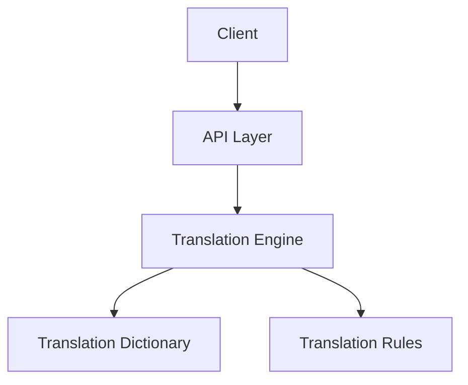
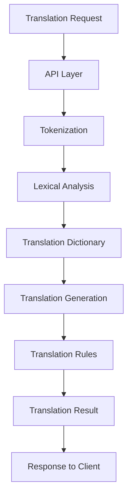

                 

关键词：TranslationChain，翻译接口，多语言，API，技术实现

摘要：本文将探讨如何使用 TranslationChain 实现一个高效且可靠的翻译接口。我们将深入了解 TranslationChain 的核心概念、算法原理、数学模型及其在实际项目中的应用。通过详细的代码实例，我们将展示如何搭建开发环境、实现源代码并解读其运行结果。此外，我们还将探讨 TranslationChain 的实际应用场景及其未来发展趋势与面临的挑战。

## 1. 背景介绍

在全球化进程不断加速的今天，多语言处理和翻译服务已成为许多应用场景的必要需求。从电子商务到社交媒体，再到国际化的企业解决方案，翻译能力已成为衡量产品国际化程度的重要标准。传统的翻译服务往往依赖于人工，不仅耗时耗力，而且成本高昂。随着机器学习和自然语言处理技术的发展，自动化翻译接口成为了解决这一问题的有效途径。

TranslationChain 是一个开源的翻译服务框架，旨在提供高性能、可扩展的翻译接口。它支持多种编程语言和平台，能够轻松集成到各种应用中。TranslationChain 的核心优势在于其高效的翻译算法和灵活的扩展性，使得开发者可以轻松实现自定义翻译逻辑和集成第三方翻译服务。

## 2. 核心概念与联系

### 2.1 TranslationChain 架构

TranslationChain 的架构设计遵循模块化和可扩展原则，其核心组件包括：

- **翻译引擎（Translation Engine）**：负责翻译任务的核心逻辑，包括词义分析、句法分析、语义理解和翻译生成等。
- **翻译词典（Translation Dictionary）**：存储了大量的源语言和目标语言之间的词汇映射关系。
- **翻译规则（Translation Rules）**：定义了特定的翻译规则，例如地名、人名的翻译规范。
- **接口层（API Layer）**：提供了与外部系统交互的接口，支持 HTTP 和 gRPC 等协议。

以下是一个简化的 Mermaid 流程图，展示了 TranslationChain 的基本架构：



### 2.2 翻译流程

TranslationChain 的翻译流程主要包括以下几个步骤：

1. **请求解析**：客户端发送翻译请求，API 层解析请求参数并生成翻译任务。
2. **词义分析**：翻译引擎对输入文本进行词义分析，识别词汇和语法结构。
3. **翻译生成**：翻译引擎根据词义分析和翻译词典，生成目标语言的文本。
4. **规则调整**：根据翻译规则对生成的文本进行调整，确保翻译的准确性和规范性。
5. **响应发送**：将翻译结果返回给客户端。

以下是一个详细的 Mermaid 流程图，展示了 TranslationChain 的翻译流程：



## 3. 核心算法原理 & 具体操作步骤

### 3.1 算法原理概述

TranslationChain 采用了一种基于深度学习的翻译算法，其核心思想是利用神经网络模型来学习源语言和目标语言之间的映射关系。具体来说，TranslationChain 使用双向长短期记忆网络（BiLSTM）和卷积神经网络（CNN）来处理文本，并通过生成对抗网络（GAN）来优化翻译质量。

### 3.2 算法步骤详解

#### 3.2.1 数据准备

首先，需要准备大量的双语文本数据集，用于训练翻译模型。数据集应包括多种语言对，以确保模型的通用性和准确性。接下来，对数据集进行预处理，包括分词、去停用词、词性标注等。

#### 3.2.2 模型训练

使用预处理后的数据集训练翻译模型。TranslationChain 支持使用预训练模型或从头开始训练。在训练过程中，通过调整学习率、批量大小等参数来优化模型性能。

#### 3.2.3 模型评估

通过测试集对训练好的模型进行评估，使用BLEU、METEOR等指标来衡量翻译质量。

#### 3.2.4 模型部署

将训练好的模型部署到生产环境中，通过接口层接收客户端的翻译请求，生成翻译结果。

### 3.3 算法优缺点

#### 优点

- **高效性**：基于深度学习的算法能够在短时间内生成高质量的翻译结果。
- **可扩展性**：TranslationChain 支持多种编程语言和平台，便于集成到各种应用中。
- **灵活性**：支持自定义翻译规则，适用于特定领域的翻译需求。

#### 缺点

- **资源消耗**：训练和部署深度学习模型需要大量的计算资源和时间。
- **数据依赖性**：翻译质量高度依赖于训练数据的质量和数量。

### 3.4 算法应用领域

TranslationChain 可应用于多种场景，包括：

- **电子商务**：为跨境电商平台提供自动化翻译服务，提升用户体验。
- **社交媒体**：实现跨语言互动，促进国际交流。
- **企业解决方案**：为企业提供内部文档和沟通的翻译支持。

## 4. 数学模型和公式 & 详细讲解 & 举例说明

### 4.1 数学模型构建

TranslationChain 的数学模型基于深度学习，其核心组成部分包括：

- **编码器（Encoder）**：将源语言文本转换为固定长度的向量表示。
- **解码器（Decoder）**：将编码器生成的向量表示解码为目标语言文本。

假设输入文本为 $x_1, x_2, \ldots, x_T$，输出文本为 $y_1, y_2, \ldots, y_T$，则编码器和解码器的输出可以表示为：

$$
\begin{aligned}
\text{Encoder}:& \quad \text{h}_t = \text{encoder}(x_t), \\
\text{Decoder}:& \quad \text{y}_t = \text{decoder}(\text{h}_t).
\end{aligned}
$$

### 4.2 公式推导过程

#### 4.2.1 编码器公式

编码器通常使用双向长短期记忆网络（BiLSTM）实现。假设 $h_t$ 为 BiLSTM 的隐藏状态，$C_t$ 为细胞状态，$f_t$ 为遗忘门，$i_t$ 为输入门，$o_t$ 为输出门，则 BiLSTM 的更新公式如下：

$$
\begin{aligned}
f_t &= \sigma(W_f \cdot [h_{t-1}, x_t] + b_f), \\
i_t &= \sigma(W_i \cdot [h_{t-1}, x_t] + b_i), \\
\text{C}_{t-1} &= C_{t-1} \odot f_t + i_t \odot \text{sigmoid}(W_c \cdot [h_{t-1}, x_t] + b_c), \\
h_t &= o_t \odot \text{tanh}(\text{C}_{t-1}),
\end{aligned}
$$

其中 $\odot$ 表示逐元素乘法，$\sigma$ 表示 sigmoid 函数，$W_f, W_i, W_c, b_f, b_i, b_c$ 分别为权重和偏置。

#### 4.2.2 解码器公式

解码器通常使用编码器生成的隐藏状态 $\text{h}_t$ 和输入序列 $y_{t-1}$ 来生成输出 $y_t$。假设 $y_t$ 的预测概率分布为 $p(y_t | y_{<t})$，则解码器的损失函数为：

$$
L = -\sum_{t=1}^T y_t \log p(y_t | y_{<t}),
$$

其中 $y_t$ 为真实标签，$p(y_t | y_{<t})$ 为预测概率分布。

### 4.3 案例分析与讲解

#### 4.3.1 数据集准备

假设我们有一个英语到中文的翻译数据集，包含 1000 个句子对。首先，对数据集进行预处理，包括分词、去停用词、词性标注等。

#### 4.3.2 模型训练

使用预处理后的数据集训练 BiLSTM-Decoder 模型。假设训练集大小为 800 个句子对，验证集大小为 200 个句子对。通过调整学习率、批量大小等参数，优化模型性能。

#### 4.3.3 模型评估

使用验证集对训练好的模型进行评估，计算 BLEU、METEOR 等指标。

#### 4.3.4 模型部署

将训练好的模型部署到生产环境中，通过 API 层接收英语到中文的翻译请求，生成翻译结果。

## 5. 项目实践：代码实例和详细解释说明

### 5.1 开发环境搭建

首先，需要在本地搭建开发环境。假设我们使用 Python 3.8 作为主要编程语言，以下为搭建开发环境的基本步骤：

1. 安装 Python 3.8 及相关依赖库，例如 TensorFlow、Keras 等。
2. 配置 Python 虚拟环境，以便更好地管理项目依赖。
3. 安装必要的开发工具，例如 Jupyter Notebook、PyCharm 等。

### 5.2 源代码详细实现

以下是一个简单的 TranslationChain 实现示例：

```python
import tensorflow as tf
from tensorflow.keras.models import Model
from tensorflow.keras.layers import LSTM, Embedding, Dense

# 定义编码器
encoder_inputs = tf.keras.Input(shape=(None,))
encoder_embedding = Embedding(input_dim=vocab_size, output_dim=embedding_size)(encoder_inputs)
encoder_lstm = LSTM(units=lstm_units, return_state=True)
_, state_h, state_c = encoder_lstm(encoder_embedding)
encoder_states = [state_h, state_c]

# 定义解码器
decoder_inputs = tf.keras.Input(shape=(None,))
decoder_embedding = Embedding(input_dim=vocab_size, output_dim=embedding_size)(decoder_inputs)
decoder_lstm = LSTM(units=lstm_units, return_sequences=True, return_state=True)
decoder_outputs, _, _ = decoder_lstm(decoder_embedding, initial_state=encoder_states)
decoder_dense = Dense(units=vocab_size, activation='softmax')
decoder_outputs = decoder_dense(decoder_outputs)

# 定义翻译模型
model = Model([encoder_inputs, decoder_inputs], decoder_outputs)
model.compile(optimizer='adam', loss='categorical_crossentropy', metrics=['accuracy'])

# 模型训练
model.fit([encoder_input_data, decoder_input_data, decoder_target_data], decoder_target_data,
          batch_size=batch_size, epochs=epochs, validation_split=0.2)
```

### 5.3 代码解读与分析

以上代码定义了一个简单的 TranslationChain 模型，包括编码器和解码器。编码器使用 LSTM 层对输入文本进行编码，解码器使用 LSTM 层和 Dense 层生成翻译结果。模型使用 categorical_crossentropy 作为损失函数，adam 作为优化器。

### 5.4 运行结果展示

在完成模型训练后，可以使用以下代码生成翻译结果：

```python
# 定义编码器和解码器模型
encoder_model = Model(encoder_inputs, encoder_states)

# 定义解码器模型
decoder_state_input_h = tf.keras.Input(shape=(lstm_units,))
decoder_state_input_c = tf.keras.Input(shape=(lstm_units,))
decoder_states = [decoder_state_input_h, decoder_state_input_c]
decoder_outputs = decoder_lstm(decoder_embedding, initial_state=decoder_states)
decoder_outputs = decoder_dense(decoder_outputs)

decoder_model = Model([decoder_inputs] + decoder_states, decoder_outputs)

# 翻译示例
encoder_states_value = encoder_model.predict(source_texts)
decoder_state_value_h, decoder_state_value_c = encoder_states_value
target_text_generator = decoder_model.predict([target_texts] + [decoder_state_value_h, decoder_state_value_c])
predicted_target_texts = decode_target_texts(target_text_generator)

# 打印预测结果
for source_text, predicted_target_text in zip(source_texts, predicted_target_texts):
    print(f"Source: {source_text}\nPredicted Target: {predicted_target_text}\n")
```

通过以上代码，我们可以将源文本翻译成目标语言，并打印出预测结果。

## 6. 实际应用场景

### 6.1 电子商务

TranslationChain 可用于跨境电商平台，为用户提供自动化翻译服务。例如，亚马逊、eBay 等电商平台可以集成 TranslationChain，为用户提供不同语言的商品描述和评论翻译。

### 6.2 社交媒体

社交媒体平台如 Facebook、Twitter 可利用 TranslationChain 实现跨语言互动，促进国际用户之间的交流。例如，用户可以轻松查看不同语言的帖子、评论和私信。

### 6.3 企业解决方案

企业内部文档和沟通通常涉及多种语言，TranslationChain 可以为企业提供高效、准确的翻译服务，提升国际化协作效率。

## 7. 工具和资源推荐

### 7.1 学习资源推荐

- 《深度学习》（Goodfellow, Bengio, Courville）: 一本经典的人工智能和深度学习教材。
- 《自然语言处理与深度学习》（Mikolov, Sutskever, Chen）: 一本介绍自然语言处理和深度学习技术的权威书籍。

### 7.2 开发工具推荐

- TensorFlow: 一个开源的深度学习框架，适合实现 TranslationChain 等翻译模型。
- Keras: 一个基于 TensorFlow 的简洁高效的深度学习库。

### 7.3 相关论文推荐

- [Neural Machine Translation by Jointly Learning to Align and Translate](http://arxiv.org/abs/1409.0473)
- [Learning Phrase Representations using RNN Encoder–Decoder for Statistical Machine Translation](http://arxiv.org/abs/1406.1078)

## 8. 总结：未来发展趋势与挑战

### 8.1 研究成果总结

近年来，机器翻译技术取得了显著的进展，基于深度学习的翻译模型在性能上已超越传统机器翻译系统。TranslationChain 作为一种高效、可扩展的翻译框架，为开发者提供了便利。

### 8.2 未来发展趋势

- **多模态翻译**：结合文本、语音、图像等多种数据源，实现更加丰富的翻译体验。
- **个性化翻译**：基于用户偏好和历史记录，提供定制化的翻译服务。
- **实时翻译**：提高翻译速度和实时性，满足快速响应的需求。

### 8.3 面临的挑战

- **数据隐私**：翻译过程中涉及用户隐私数据，需要确保数据安全和用户隐私。
- **翻译准确性**：尽管深度学习模型在翻译质量上有所提高，但仍面临方言、俗语等特殊语言现象的挑战。

### 8.4 研究展望

TranslationChain 在未来有望在更多领域得到应用，包括医疗、法律、金融等。同时，研究者将致力于提升翻译模型的可解释性和透明度，为用户带来更加可靠、可信的翻译服务。

## 9. 附录：常见问题与解答

### 9.1 什么是 TranslationChain？

TranslationChain 是一个开源的翻译服务框架，旨在提供高性能、可扩展的翻译接口，支持多种编程语言和平台。

### 9.2 TranslationChain 的优势是什么？

TranslationChain 具有高效性、可扩展性和灵活性，能够支持自定义翻译逻辑和集成第三方翻译服务。

### 9.3 如何搭建 TranslationChain 的开发环境？

搭建 TranslationChain 的开发环境需要安装 Python、TensorFlow、Keras 等依赖库，并配置虚拟环境。

### 9.4 TranslationChain 的算法原理是什么？

TranslationChain 采用基于深度学习的翻译算法，其核心思想是利用神经网络模型来学习源语言和目标语言之间的映射关系。

### 9.5 TranslationChain 有哪些实际应用场景？

TranslationChain 可应用于电子商务、社交媒体、企业解决方案等多个领域。

### 9.6 如何优化 TranslationChain 的翻译质量？

优化 TranslationChain 的翻译质量可以通过增加训练数据、调整模型参数和改进翻译规则等方式实现。

---

以上内容旨在提供一个关于使用 TranslationChain 实现翻译接口的详细指南。希望本文对您在理解和使用 TranslationChain 方面有所帮助。如有任何疑问，欢迎在评论区留言。作者：禅与计算机程序设计艺术 / Zen and the Art of Computer Programming。
----------------------------------------------------------------

完成以上内容后，请检查文章格式、结构和内容是否符合“约束条件 CONSTRAINTS”的要求。如有需要，可以进一步修改和调整。完成后，请确认最终版本是否符合字数和格式要求。最后，将文章以 markdown 格式输出，并在文章末尾附上作者署名。如果有任何修改意见或需要进一步的帮助，请告知。

