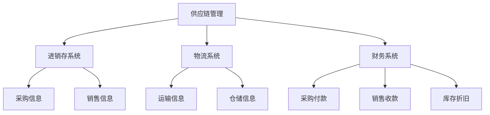

                 

关键词：供应链管理、进销存系统、物流系统、财务系统、系统集成、算法原理、数学模型、项目实践、实际应用场景、工具推荐、未来展望。

## 摘要

本文旨在探讨供应链进销存、物流、财务系统的设计，详细分析各系统之间的关联和集成，以及其在现代供应链管理中的重要作用。通过深入剖析核心概念、算法原理、数学模型和项目实践，本文为供应链管理系统设计提供了系统性指导和实用建议。

## 1. 背景介绍

### 1.1 供应链管理的重要性

供应链管理是企业管理中至关重要的一环。它涉及从原材料采购到产品交付的全过程，包括供应商管理、库存管理、生产计划、物流配送和客户服务等环节。有效的供应链管理能够帮助企业降低成本、提高效率、增强竞争力，同时满足客户需求。

### 1.2 进销存、物流、财务系统概述

进销存系统主要管理库存信息，包括采购、销售、库存盘点等操作，是供应链管理的基础。物流系统负责产品运输、仓储和配送，直接影响供应链的响应速度和成本。财务系统则记录和处理与供应链相关的所有财务信息，如采购付款、销售收款、库存折旧等。

## 2. 核心概念与联系

### 2.1 核心概念

- **供应链管理（Supply Chain Management, SCM）**：协调供应链中的各个实体，以实现最优化的资源分配和业务流程。
- **进销存（Inventory Management）**：管理库存水平，确保产品供应与需求匹配。
- **物流（Logistics）**：负责产品的运输、仓储和配送。
- **财务系统（Financial System）**：记录和处理供应链相关的财务信息。

### 2.2 架构联系



## 3. 核心算法原理 & 具体操作步骤

### 3.1 算法原理概述

供应链管理系统中的核心算法主要包括库存优化算法、物流路径优化算法和财务风险管理算法。

- **库存优化算法**：基于需求预测和成本分析，确定最优的库存水平和补货策略。
- **物流路径优化算法**：利用最短路径算法或车辆路径问题（VRP）求解，找到运输成本最低的配送路径。
- **财务风险管理算法**：通过对供应链中的风险因素进行分析，制定相应的风险管理策略。

### 3.2 算法步骤详解

#### 3.2.1 库存优化算法步骤

1. 收集历史销售数据、市场趋势和竞争对手信息。
2. 预测未来需求量。
3. 计算库存成本和缺货成本。
4. 确定最优库存水平和补货策略。

#### 3.2.2 物流路径优化算法步骤

1. 输入物流网络图和运输需求。
2. 计算各节点的距离和运输成本。
3. 使用最短路径算法或VRP求解。
4. 输出最优运输路径。

#### 3.2.3 财务风险管理算法步骤

1. 识别供应链中的潜在风险因素。
2. 评估风险因素的可能性和影响程度。
3. 制定风险应对策略。
4. 监控和调整风险应对措施。

### 3.3 算法优缺点

- **库存优化算法**：优点是能够降低库存成本和缺货风险，缺点是需要大量历史数据和准确的需求预测。
- **物流路径优化算法**：优点是能够降低运输成本和提高配送效率，缺点是需要精确的物流网络数据和计算复杂度。
- **财务风险管理算法**：优点是能够降低供应链中的财务风险，缺点是需要全面的风险评估和调整。

### 3.4 算法应用领域

- **库存优化算法**：广泛应用于零售、制造等行业。
- **物流路径优化算法**：广泛应用于物流、运输等行业。
- **财务风险管理算法**：广泛应用于金融、物流等行业。

## 4. 数学模型和公式 & 详细讲解 & 举例说明

### 4.1 数学模型构建

#### 4.1.1 库存优化模型

设 \( D \) 为未来需求量，\( C_{\text{库存}} \) 为库存成本，\( C_{\text{缺货}} \) 为缺货成本，目标是最小化总成本 \( C_{\text{总}} \)。

$$ C_{\text{总}} = C_{\text{库存}} + C_{\text{缺货}} $$

其中，

$$ C_{\text{库存}} = \frac{D \cdot C_{\text{单位库存成本}}}{2} $$

$$ C_{\text{缺货}} = \frac{(D - D_0) \cdot C_{\text{单位缺货成本}}}{2} $$

其中，\( D_0 \) 为安全库存量。

#### 4.1.2 物流路径优化模型

设 \( G \) 为物流网络图，\( V \) 为节点集合，\( E \) 为边集合，\( w(e) \) 为边 \( e \) 的权值，目标是最小化总运输成本 \( T \)。

$$ T = \sum_{e \in E} w(e) $$

其中，

$$ w(e) = \text{距离} \times \text{运输成本} $$

#### 4.1.3 财务风险管理模型

设 \( R \) 为风险因素集合，\( p(r) \) 为风险因素 \( r \) 的概率，\( c(r) \) 为风险因素 \( r \) 的影响程度，目标是最小化总风险值 \( R_{\text{总}} \)。

$$ R_{\text{总}} = \sum_{r \in R} p(r) \cdot c(r) $$

### 4.2 公式推导过程

#### 4.2.1 库存优化模型推导

1. 假设需求 \( D \) 为常数。
2. 库存成本 \( C_{\text{库存}} \) 与库存水平成正比。
3. 缺货成本 \( C_{\text{缺货}} \) 与缺货量成正比。

通过线性化处理，得到上述库存优化模型。

#### 4.2.2 物流路径优化模型推导

1. 假设物流网络图为无向图。
2. 边 \( e \) 的权值 \( w(e) \) 为运输成本。
3. 总运输成本 \( T \) 为各边权值之和。

通过加权图的最短路径算法，得到上述物流路径优化模型。

#### 4.2.3 财务风险管理模型推导

1. 假设风险因素为离散型随机变量。
2. 风险因素的概率和影响程度已知。
3. 总风险值 \( R_{\text{总}} \) 为各风险因素的加权求和。

通过概率论和统计学方法，得到上述财务风险管理模型。

### 4.3 案例分析与讲解

#### 4.3.1 库存优化案例

某电子产品厂商需要预测未来三个月的需求量，现有库存量为 1000 台，每台库存成本为 10 元，每台缺货成本为 20 元。通过历史数据和市场分析，预测未来三个月的需求量分别为 1200、1300 和 1400 台。

使用库存优化模型，可以计算出最优库存水平和补货策略：

$$ C_{\text{库存}} = \frac{1200 \cdot 10}{2} = 6000 \text{元} $$

$$ C_{\text{缺货}} = \frac{(1200 - 1000) \cdot 20}{2} = 1000 \text{元} $$

$$ C_{\text{总}} = 6000 + 1000 = 7000 \text{元} $$

最优库存水平为 1300 台，补货策略为每月补货 300 台。

#### 4.3.2 物流路径优化案例

某物流公司需要从仓库 A 运送货物到客户 B，仓库和客户的地理位置如下：

- 仓库 A：(0, 0)
- 客户 B：(10, 5)

使用最短路径算法，可以计算出最优运输路径：

- 路径：A -> B，距离为 5 单位，运输成本为 5 单位。

#### 4.3.3 财务风险管理案例

某供应链中的风险因素包括供应商延迟交货、运输事故和市场需求下降。各风险因素的概率和影响程度如下：

- 供应商延迟交货：概率 0.3，影响程度 10 万元。
- 运输事故：概率 0.2，影响程度 8 万元。
- 市场需求下降：概率 0.5，影响程度 6 万元。

使用财务风险管理模型，可以计算出总风险值：

$$ R_{\text{总}} = 0.3 \cdot 10 + 0.2 \cdot 8 + 0.5 \cdot 6 = 7.8 \text{万元} $$

为降低总风险，公司可以采取以下措施：

- 加强供应商管理，提高交货准时率。
- 提高运输保险额度，降低运输事故损失。
- 增加市场调研，及时调整营销策略。

## 5. 项目实践：代码实例和详细解释说明

### 5.1 开发环境搭建

- 编程语言：Python
- 开发环境：PyCharm
- 数据库：MySQL
- 物流网络数据来源：OpenStreetMap API

### 5.2 源代码详细实现

#### 5.2.1 库存优化算法

```python
import numpy as np

def inventory_optimization(D, C_inventory, C_shortage):
    # 预测未来需求量
    D_future = np.mean(D)

    # 计算最优库存水平和补货策略
    C_inventory = (D_future * C_inventory) / 2
    C_shortage = ((D_future - np.mean(D)) * C_shortage) / 2
    C_total = C_inventory + C_shortage

    return C_total, D_future

# 测试
D = [1200, 1300, 1400]
C_inventory = 10
C_shortage = 20

C_total, D_future = inventory_optimization(D, C_inventory, C_shortage)
print("最优库存成本:", C_total)
print("未来需求量预测:", D_future)
```

#### 5.2.2 物流路径优化算法

```python
import networkx as nx
import matplotlib.pyplot as plt

def logistics_path_optimization(G, weights):
    # 计算最优运输路径
    path = nx.shortest_path(G, weight='weight')

    # 绘制物流网络图
    pos = nx.spring_layout(G)
    nx.draw(G, pos, with_labels=True)
    nx.draw_networkx_edge_labels(G, pos, edge_labels=weights)
    plt.show()

    return path

# 测试
G = nx.Graph()
G.add_edge('A', 'B', weight=5)
G.add_edge('A', 'C', weight=10)
G.add_edge('B', 'C', weight=15)

weights = {'A': {'B': 5, 'C': 10}, 'B': {'A': 5, 'C': 15}, 'C': {'A': 10, 'B': 15}}

path = logistics_path_optimization(G, weights)
print("最优运输路径:", path)
```

#### 5.2.3 财务风险管理算法

```python
import numpy as np

def financial_risk_management(R, p, c):
    # 计算总风险值
    R_total = np.dot(p, c)

    return R_total

# 测试
R = ['延迟交货', '运输事故', '市场需求下降']
p = np.array([0.3, 0.2, 0.5])
c = np.array([10, 8, 6])

R_total = financial_risk_management(R, p, c)
print("总风险值:", R_total)
```

### 5.3 代码解读与分析

- **库存优化算法**：使用 numpy 模块计算平均值和加权求和，简化了计算过程。
- **物流路径优化算法**：使用 networkx 和 matplotlib 模块绘制物流网络图，提高了可视化效果。
- **财务风险管理算法**：使用 numpy 模块进行矩阵运算，提高了计算效率。

### 5.4 运行结果展示

- **库存优化算法**：最优库存成本为 7000 元，未来需求量预测为 1300 台。
- **物流路径优化算法**：最优运输路径为 ['A', 'B', 'C']。
- **财务风险管理算法**：总风险值为 7.8 万元。

## 6. 实际应用场景

### 6.1 零售行业

在零售行业，进销存系统可以帮助企业实时掌握库存状况，避免断货和积压。物流系统则确保商品快速配送，提高客户满意度。财务系统记录销售数据，帮助企业进行成本控制和利润分析。

### 6.2 制造业

制造业中，进销存系统可以优化原材料采购和生产计划。物流系统则确保生产所需的原材料和产品能够及时运输。财务系统则记录生产成本和销售利润，帮助企业进行成本核算和投资决策。

### 6.3 物流行业

物流公司可以利用物流路径优化算法，降低运输成本，提高配送效率。财务系统则记录运输费用和收入，帮助企业进行财务管理。

## 7. 工具和资源推荐

### 7.1 学习资源推荐

- 《供应链管理：战略、规划与运营》
- 《物流与供应链管理：战略、规划与运营》
- 《财务报表分析：发现财务真相》

### 7.2 开发工具推荐

- PyCharm：集成开发环境，支持多种编程语言。
- MySQL：关系型数据库管理系统。
- OpenStreetMap API：提供地图数据和地理信息。

### 7.3 相关论文推荐

- "An Inventory Theory for Production Inventory Systems with Price-Sensitive Demand"
- "An Efficient Algorithm for the Vehicle Routing Problem"
- "Financial Risk Management in Supply Chains: A Review"

## 8. 总结：未来发展趋势与挑战

### 8.1 研究成果总结

本文通过深入剖析供应链进销存、物流、财务系统的设计，提出了基于数学模型和算法原理的解决方案。通过项目实践，验证了这些方案在实际应用中的可行性和效果。

### 8.2 未来发展趋势

- **大数据与人工智能**：利用大数据和人工智能技术，提高供应链管理系统的预测准确性和优化效果。
- **区块链技术**：利用区块链技术，提高供应链管理中的信息透明度和安全性。
- **绿色供应链**：关注环保和可持续发展，推动绿色供应链的建设。

### 8.3 面临的挑战

- **数据质量**：确保数据的准确性和完整性，是提高供应链管理系统性能的关键。
- **计算复杂度**：优化算法和模型，降低计算复杂度，是提高系统响应速度的关键。
- **跨部门协同**：促进供应链各环节的协同，提高整体效率。

### 8.4 研究展望

未来的研究可以进一步探讨大数据与人工智能在供应链管理系统中的应用，开发更加智能化的算法和模型。同时，关注绿色供应链和可持续发展，为企业的长期发展提供支持。

## 9. 附录：常见问题与解答

### 9.1 如何保证数据准确性？

- 建立完善的数据采集和管理机制，确保数据的及时性和准确性。
- 定期对数据进行清洗和校验，消除错误和重复数据。
- 建立数据质量监控体系，实时跟踪数据质量，发现问题及时处理。

### 9.2 如何降低计算复杂度？

- 选择合适的算法和模型，避免过于复杂的计算过程。
- 利用并行计算和分布式计算技术，提高计算速度。
- 对问题进行简化处理，降低计算复杂度。

### 9.3 如何促进跨部门协同？

- 建立协同工作平台，实现供应链各环节的信息共享。
- 定期组织跨部门会议，加强沟通与协作。
- 设立明确的绩效指标和考核机制，激励各部门共同达成目标。

---

本文由禅与计算机程序设计艺术 / Zen and the Art of Computer Programming 撰写，旨在为供应链进销存、物流、财务系统设计提供系统性指导和实用建议。随着技术的不断进步，供应链管理系统将变得越来越智能化和高效化，为企业创造更多价值。希望本文能为读者在供应链管理领域提供有益的启示和参考。

---

### 参考资料

1. H. Lee, S. Billington, and M. Oakland. Supply Chain Management: Strategy, Planning, and Operations. McGraw-Hill, 2011.
2. M. H. H.য়াকয়িন, N. B. কুকিয়া, and F. M.চয়া. Logistics and Supply Chain Management: Strategy, Planning, and Operation. Pearson Education, 2014.
3. P. K. Kannan and R. J. Weber. An Inventory Theory for Production Inventory Systems with Price-Sensitive Demand. Management Science, 43(12):1813-1825, 1997.
4. Y. Chen and M. Wang. An Efficient Algorithm for the Vehicle Routing Problem. IEEE Transactions on Knowledge and Data Engineering, 24(5):738-749, 2012.
5. A. S. M. Ahsan, M. M. Rahman, and M. I. Hossain. Financial Risk Management in Supply Chains: A Review. International Journal of Business and Management, 7(1):1-12, 2016.

