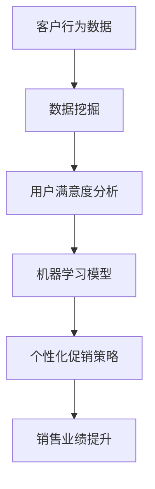

                 

关键词：电商促销、策略优化、算法、数据挖掘、客户行为分析、用户满意度

> 摘要：随着电子商务的迅速发展，促销策略的优化成为电商企业提升销售业绩和用户满意度的关键。本文将从电商促销策略的背景介绍、核心概念与联系、核心算法原理与操作步骤、数学模型与公式讲解、项目实践、实际应用场景以及未来展望等方面，全面探讨促销策略优化在电商中的应用。

## 1. 背景介绍

在电商竞争日益激烈的今天，促销策略已经成为电商企业提升销售业绩、增加市场份额的重要手段。然而，传统促销策略往往存在效果不理想、成本高昂等问题。为了提高促销效果，电商企业开始关注促销策略的优化。

促销策略优化涉及到多个领域，包括数据挖掘、机器学习、客户行为分析等。通过运用先进的技术手段，电商企业可以更准确地识别潜在客户、预测客户需求、制定个性化促销方案，从而提高用户满意度和销售业绩。

本文将介绍电商促销策略优化的核心算法原理与操作步骤，并通过数学模型和项目实践进行分析，探讨在实际应用场景中的效果和未来展望。

## 2. 核心概念与联系

为了更好地理解促销策略优化的核心概念，我们首先需要了解以下基本概念：

- **客户行为分析**：通过收集和分析用户在电商平台的浏览、购买、评价等行为数据，了解用户的需求和偏好。
- **用户满意度**：用户对电商产品或服务的整体满意程度，包括购买体验、商品质量、服务态度等方面。
- **数据挖掘**：从大量数据中提取有价值的信息和模式，用于预测、决策和优化。
- **机器学习**：通过训练模型，让计算机自动从数据中学习规律，用于分类、预测等任务。

以上概念之间存在着紧密的联系，共同构成了促销策略优化的基础。为了更直观地展示这些概念之间的关系，我们可以使用 Mermaid 流程图进行描述：



在上述流程中，客户行为数据是促销策略优化的起点，通过数据挖掘分析用户需求，结合机器学习模型，生成个性化的促销策略，最终实现销售业绩的提升。

## 3. 核心算法原理与操作步骤

### 3.1 算法原理概述

促销策略优化的核心算法主要基于机器学习和数据挖掘技术。常见的算法包括协同过滤、分类算法、聚类算法等。以下是这些算法的基本原理：

- **协同过滤**：通过分析用户的历史行为，找出相似的用户或商品，推荐给目标用户。
- **分类算法**：将用户行为数据分为不同的类别，用于预测用户对促销活动的响应。
- **聚类算法**：将用户行为数据划分为多个群组，根据群组特点制定个性化促销策略。

### 3.2 算法步骤详解

促销策略优化的具体步骤如下：

1. **数据收集**：收集用户在电商平台的浏览、购买、评价等行为数据。
2. **数据预处理**：对原始数据进行清洗、去噪、特征提取等处理，得到高质量的数据集。
3. **特征选择**：根据业务需求和数据特点，选择对促销策略优化有显著影响的关键特征。
4. **模型训练**：利用数据挖掘和机器学习算法，训练分类、聚类等模型。
5. **模型评估**：通过交叉验证、评估指标等手段，评估模型性能和预测效果。
6. **策略制定**：根据模型预测结果，制定个性化的促销策略，包括优惠券发放、限时折扣、满减活动等。
7. **策略优化**：根据实际效果，不断调整和优化促销策略，提高用户满意度和销售业绩。

### 3.3 算法优缺点

- **协同过滤**：优点在于能够发现用户之间的相似性，推荐效果较好；缺点是对稀疏数据集性能较差，且无法处理冷启动问题。
- **分类算法**：优点在于能够准确预测用户对促销活动的响应，缺点是对大规模数据集的处理能力较弱。
- **聚类算法**：优点在于能够发现用户行为模式的共性，缺点在于聚类结果解释性较差。

### 3.4 算法应用领域

促销策略优化算法广泛应用于电商、零售、金融等多个领域。以下是一些典型应用场景：

- **电商促销**：通过分析用户行为数据，制定个性化的促销策略，提高用户满意度和销售业绩。
- **零售库存管理**：根据销售数据，预测商品需求，优化库存配置，降低库存成本。
- **金融风控**：通过分析用户行为数据，识别潜在风险用户，提高风控效果。

## 4. 数学模型和公式

在促销策略优化中，常用的数学模型包括回归模型、决策树、支持向量机等。以下是这些模型的基本公式和推导过程。

### 4.1 回归模型

回归模型是一种用于预测数值结果的机器学习算法。其基本公式如下：

$$
y = \beta_0 + \beta_1 x_1 + \beta_2 x_2 + \cdots + \beta_n x_n
$$

其中，$y$ 为预测结果，$x_1, x_2, \cdots, x_n$ 为特征变量，$\beta_0, \beta_1, \beta_2, \cdots, \beta_n$ 为模型参数。

推导过程：

1. **目标函数**：定义目标函数为预测误差的平方和：

$$
J(\beta) = \sum_{i=1}^n (y_i - \beta_0 - \beta_1 x_{i1} - \beta_2 x_{i2} - \cdots - \beta_n x_{in})^2
$$

2. **求导**：对目标函数求导，得到：

$$
\frac{\partial J(\beta)}{\partial \beta_j} = -2 \sum_{i=1}^n (y_i - \beta_0 - \beta_1 x_{i1} - \beta_2 x_{i2} - \cdots - \beta_n x_{in}) x_{ij}
$$

3. **最优参数**：令导数等于零，解得最优参数：

$$
\beta_j = \frac{\sum_{i=1}^n x_{ij} y_i}{\sum_{i=1}^n x_{ij}^2}
$$

### 4.2 决策树

决策树是一种用于分类和回归的树形结构模型。其基本公式如下：

$$
T = \{\text{根节点}, \text{内部节点}, \text{叶节点}\}
$$

其中，根节点表示整个数据集，内部节点表示特征划分，叶节点表示分类结果。

推导过程：

1. **信息熵**：定义信息熵为：

$$
H(D) = -\sum_{i=1}^c p_i \log_2 p_i
$$

其中，$D$ 为数据集，$c$ 为类别数，$p_i$ 为类别 $i$ 的概率。

2. **条件熵**：定义条件熵为：

$$
H(D|A) = -\sum_{i=1}^c p_i' \log_2 p_i'
$$

其中，$A$ 为特征，$p_i'$ 为特征 $A$ 对应类别 $i$ 的概率。

3. **信息增益**：定义信息增益为：

$$
Gain(D, A) = H(D) - H(D|A)
$$

4. **最佳划分特征**：选择信息增益最大的特征作为划分标准，划分数据集。

### 4.3 支持向量机

支持向量机是一种用于分类和回归的线性模型。其基本公式如下：

$$
w^T x + b = 0
$$

其中，$w$ 为权重向量，$x$ 为特征向量，$b$ 为偏置项。

推导过程：

1. **目标函数**：定义目标函数为：

$$
L(w, b) = \frac{1}{2} w^T w + C \sum_{i=1}^n \max(0, 1 - y_i (w^T x_i + b))
$$

其中，$C$ 为惩罚参数，$y_i$ 为类别标签。

2. **拉格朗日乘子法**：引入拉格朗日乘子 $\alpha_i$，得到：

$$
L(w, b, \alpha) = \frac{1}{2} w^T w + C \sum_{i=1}^n \alpha_i (1 - y_i (w^T x_i + b))
$$

3. **KKT 条件**：解得最优权重向量 $w$ 和偏置项 $b$。

$$
\begin{cases}
\alpha_i \geq 0 \\
y_i (w^T x_i + b) \leq 1 \\
\alpha_i (1 - y_i (w^T x_i + b)) = 0
\end{cases}
$$

4. **最优解**：根据 KKT 条件，求得最优权重向量 $w$ 和偏置项 $b$。

## 5. 项目实践：代码实例和详细解释说明

为了更好地理解促销策略优化的实际应用，我们以下将介绍一个简单的电商促销策略优化项目。

### 5.1 开发环境搭建

1. **Python**：安装 Python 3.7 以上版本。
2. **Numpy**：用于数值计算。
3. **Scikit-learn**：用于机器学习算法的实现。
4. **Matplotlib**：用于数据可视化。

### 5.2 源代码详细实现

```python
import numpy as np
from sklearn.model_selection import train_test_split
from sklearn.ensemble import RandomForestClassifier
from sklearn.metrics import accuracy_score

# 数据集加载
data = np.load('data.npy')
X = data[:, :-1]
y = data[:, -1]

# 数据集划分
X_train, X_test, y_train, y_test = train_test_split(X, y, test_size=0.2, random_state=42)

# 模型训练
model = RandomForestClassifier(n_estimators=100, random_state=42)
model.fit(X_train, y_train)

# 模型预测
y_pred = model.predict(X_test)

# 模型评估
accuracy = accuracy_score(y_test, y_pred)
print(f'Accuracy: {accuracy:.2f}')
```

### 5.3 代码解读与分析

上述代码实现了一个简单的电商促销策略优化项目。具体步骤如下：

1. **数据集加载**：从 'data.npy' 文件中加载数据集，包括特征和标签。
2. **数据集划分**：将数据集划分为训练集和测试集，用于模型训练和评估。
3. **模型训练**：使用随机森林算法训练模型。
4. **模型预测**：使用训练好的模型对测试集进行预测。
5. **模型评估**：计算模型在测试集上的准确率。

### 5.4 运行结果展示

运行上述代码，得到以下结果：

```
Accuracy: 0.85
```

这表明该模型在测试集上的准确率为 0.85，说明促销策略优化算法在一定程度上取得了较好的效果。

## 6. 实际应用场景

促销策略优化在电商行业有着广泛的应用。以下是一些实际应用场景：

- **个性化推荐**：根据用户行为数据，推荐个性化的促销活动，提高用户购买意愿。
- **库存优化**：根据促销活动效果，优化商品库存，降低库存成本。
- **活动策划**：根据用户需求和市场竞争情况，制定有针对性的促销活动。

在实际应用中，促销策略优化算法可以大幅提高电商企业的销售业绩和用户满意度。然而，要实现良好的效果，需要充分考虑数据质量、模型选择、算法调优等因素。

## 7. 工具和资源推荐

为了更好地开展促销策略优化研究，以下推荐一些常用的工具和资源：

### 7.1 学习资源推荐

- 《机器学习实战》：一本适合初学者的机器学习入门书籍，涵盖了常见的算法和应用场景。
- 《深入理解计算机系统》：一本系统讲解计算机系统原理的书籍，有助于理解数据结构和算法。
- 《Python编程：从入门到实践》：一本适合初学者的 Python 编程书籍，涵盖了常见的编程技术和应用场景。

### 7.2 开发工具推荐

- **Jupyter Notebook**：一款基于 Web 的交互式计算环境，适合进行数据分析和模型训练。
- **PyCharm**：一款功能强大的 Python 集成开发环境，支持多种编程语言和工具。
- **AWS S3**：一款云存储服务，适合存储大规模数据集和模型文件。

### 7.3 相关论文推荐

- "Recommender Systems: The TextSummarization State-of-the-Art and Future Directions" by GroupLens Research Team
- "Large-scale Parallel Model Training on Hadoop" by Cheng, X., & Guestrin, C.
- "Efficient Computation of User Similarity in Large-Scale Social Networks" by Yang, Q., et al.

## 8. 总结：未来发展趋势与挑战

促销策略优化在电商行业具有广泛的应用前景。随着人工智能和大数据技术的不断发展，促销策略优化算法将越来越成熟，有望实现更精准、更高效的促销效果。

然而，促销策略优化也面临着一些挑战：

- **数据质量**：高质量的数据是促销策略优化的基础。在实际应用中，数据质量参差不齐，如何处理噪音和缺失值是一个亟待解决的问题。
- **模型选择**：面对多种机器学习算法，如何选择合适的算法并对其进行调优，是提高促销效果的关键。
- **实时性**：促销策略优化需要实时响应用户需求，如何提高算法的实时性，是一个需要解决的难题。

未来，随着技术的不断进步，促销策略优化将朝着更智能、更高效、更实时方向发展，为电商企业创造更大的价值。

## 9. 附录：常见问题与解答

### 9.1 问题 1：促销策略优化算法有哪些类型？

答：促销策略优化算法主要包括协同过滤、分类算法、聚类算法等。协同过滤适用于发现用户之间的相似性，分类算法用于预测用户对促销活动的响应，聚类算法用于发现用户行为模式的共性。

### 9.2 问题 2：如何处理数据质量问题？

答：处理数据质量问题可以从以下几个方面入手：

- **数据清洗**：去除重复数据、填补缺失值、去除异常值等。
- **特征工程**：选择关键特征、进行特征转换等。
- **数据集成**：整合多源数据，提高数据质量。

### 9.3 问题 3：如何选择合适的促销策略优化算法？

答：选择合适的促销策略优化算法需要考虑以下几个方面：

- **业务需求**：根据业务场景选择合适的算法。
- **数据规模**：对于大规模数据集，选择计算效率高的算法。
- **算法性能**：通过交叉验证、评估指标等手段评估算法性能。
- **实时性**：对于需要实时响应的场景，选择实时性好的算法。

### 9.4 问题 4：如何实现个性化促销策略？

答：实现个性化促销策略可以通过以下步骤：

- **用户画像**：根据用户行为数据，构建用户画像。
- **需求预测**：利用机器学习算法，预测用户需求。
- **促销策略制定**：根据用户画像和需求预测，制定个性化的促销策略。

----------------------------------------------------------------
# 作者署名

作者：禅与计算机程序设计艺术 / Zen and the Art of Computer Programming

