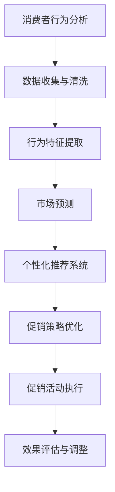

                 

### 1. 背景介绍

促销策略优化是企业营销活动中至关重要的一环，直接影响着产品的销量和市场份额。随着市场竞争的加剧和消费者需求的多样化，传统的促销策略往往难以满足实际需求，企业需要寻求更加智能化、个性化的促销策略。

人工智能（AI）技术的发展为促销策略优化带来了新的契机。通过机器学习、数据挖掘、自然语言处理等技术，AI可以深度分析消费者行为和需求，精准预测市场趋势，为企业制定更为有效的促销策略提供数据支持。此外，AI还能够实现促销活动的自动化执行和实时调整，提高营销效率，降低成本。

本文将探讨如何利用人工智能技术优化促销策略，提高企业市场竞争力。首先，我们将介绍人工智能在促销策略优化中的核心概念与联系，通过Mermaid流程图展示相关架构。接着，我们将深入分析核心算法原理和具体操作步骤，并讨论算法的优缺点及其应用领域。随后，我们将介绍数学模型和公式，详细讲解公式推导过程，并通过案例进行分析。最后，我们将展示一个具体的代码实例，解读其实现过程，并探讨促销策略在实际应用场景中的效果。通过本文的讨论，希望能为企业在促销策略优化方面提供有益的参考和启示。

### 2. 核心概念与联系

在促销策略优化中，人工智能技术涉及多个核心概念，包括消费者行为分析、市场预测、个性化推荐、自然语言处理等。为了更好地理解这些概念之间的联系，我们使用Mermaid流程图（Mermaid流程节点中不要有括号、逗号等特殊字符）进行展示。

以下是一个简单的Mermaid流程图示例，描述了消费者行为分析到促销策略优化的过程：



**Mermaid流程图说明：**

- **A[消费者行为分析]**：这是促销策略优化的起点，通过分析消费者在购买过程中的行为数据，如浏览记录、购物车、支付历史等，获取有价值的信息。
- **B[数据收集与清洗]**：数据收集是基础工作，需要从各种渠道获取海量数据，并进行清洗，去除噪声和冗余信息。
- **C[行为特征提取]**：通过数据预处理，提取消费者行为的特征，如用户兴趣、购买频率、消费能力等，为后续分析提供输入。
- **D[市场预测]**：利用机器学习算法，分析历史数据，预测市场需求、竞争对手行为等，帮助企业制定长远的营销策略。
- **E[个性化推荐系统]**：基于用户行为和偏好，使用推荐算法为每个用户推荐个性化的促销策略，提高转化率。
- **F[促销策略优化]**：结合市场预测和用户推荐，优化促销策略，包括定价、折扣、捆绑销售等方式。
- **G[促销活动执行]**：将优化后的促销策略付诸实施，通过广告、促销活动等形式，吸引消费者购买。
- **H[效果评估与调整]**：实时监控促销活动的效果，根据数据反馈进行调整，确保促销策略的持续优化。

通过上述流程，我们可以看到人工智能技术在促销策略优化中的应用，不仅提升了数据分析和决策的效率，还能实现个性化推荐和动态调整，从而提高企业的市场竞争力。

### 3. 核心算法原理 & 具体操作步骤

#### 3.1 算法原理概述

在促销策略优化中，常用的核心算法包括协同过滤、回归分析、聚类分析等。这些算法基于不同的原理，旨在从海量数据中提取有价值的信息，帮助企业制定有效的促销策略。

- **协同过滤（Collaborative Filtering）**：协同过滤是一种基于用户行为和偏好进行推荐的方法。它通过分析用户之间的相似性，为用户提供个性化推荐。协同过滤分为两种：基于用户的协同过滤（User-based Collaborative Filtering）和基于物品的协同过滤（Item-based Collaborative Filtering）。

- **回归分析（Regression Analysis）**：回归分析是一种统计方法，用于预测一个或多个变量与另一个变量之间的关系。在促销策略优化中，回归分析可以用于预测市场需求、消费者响应等，帮助制定合适的促销策略。

- **聚类分析（Cluster Analysis）**：聚类分析是一种无监督学习方法，用于将数据分为若干个类或簇，每个簇中的数据点具有相似的特征。在促销策略优化中，聚类分析可以用于市场细分，识别具有相似购买行为的消费者群体，从而制定有针对性的促销策略。

#### 3.2 算法步骤详解

以下为这些核心算法的具体操作步骤：

##### 3.2.1 协同过滤

1. **数据收集与预处理**：收集用户行为数据（如评分、购买记录等），并进行预处理，如去除缺失值、噪声数据等。
2. **计算相似性**：计算用户之间的相似性，常用的相似度度量方法有余弦相似度、皮尔逊相关系数等。
3. **生成推荐列表**：根据用户之间的相似性，为每个用户生成推荐列表。对于基于用户的协同过滤，为每个用户找到最相似的K个用户，然后为每个用户推荐这些用户的共同喜欢的物品；对于基于物品的协同过滤，为每个用户找到最相似的K个物品，然后为每个用户推荐这些物品。
4. **处理冷启动问题**：对于新用户或新物品，由于缺乏历史数据，协同过滤方法可能无法为其生成有效的推荐。为了解决冷启动问题，可以结合内容过滤或基于模型的推荐方法。

##### 3.2.2 回归分析

1. **数据收集与预处理**：收集相关数据，如历史销售数据、市场环境数据等，并进行预处理，如数据清洗、归一化等。
2. **特征选择**：选择对预测目标有显著影响的特征，如季节性、促销活动、竞争对手行为等。
3. **模型训练**：使用历史数据训练回归模型，常用的回归模型有线性回归、决策树回归、随机森林回归等。
4. **模型评估**：使用验证集对训练好的模型进行评估，常用的评估指标有均方误差（MSE）、决定系数（R²）等。
5. **模型优化**：根据评估结果对模型进行优化，如调整模型参数、增加或删除特征等。

##### 3.2.3 聚类分析

1. **数据收集与预处理**：收集消费者行为数据，并进行预处理，如归一化、去噪声等。
2. **选择聚类算法**：根据数据特点和需求选择合适的聚类算法，如K-means、层次聚类、DBSCAN等。
3. **确定聚类数量**：通过肘部法则、轮廓系数等方法确定合适的聚类数量。
4. **执行聚类**：对数据执行聚类操作，将数据分为若干个簇。
5. **簇特征提取**：为每个簇提取特征，如均值、标准差等。
6. **簇分析**：分析每个簇的特点，识别具有相似购买行为的消费者群体。

#### 3.3 算法优缺点

**协同过滤：**

- 优点：能够为用户提供个性化推荐，有效提高用户满意度。
- 缺点：在面对新用户或新物品时，推荐效果较差（冷启动问题）；推荐结果可能受数据噪声影响。

**回归分析：**

- 优点：能够准确预测市场需求、消费者响应等，为制定促销策略提供有力支持。
- 缺点：对数据质量和特征选择要求较高；无法直接反映用户偏好。

**聚类分析：**

- 优点：能够发现具有相似购买行为的消费者群体，为市场细分提供依据。
- 缺点：聚类结果可能受初始聚类中心选择影响；无法直接用于个性化推荐。

#### 3.4 算法应用领域

- **电子商务**：协同过滤和回归分析常用于电子商务平台的商品推荐和销量预测。
- **零售行业**：聚类分析用于市场细分，帮助企业制定有针对性的促销策略。
- **金融行业**：回归分析用于预测市场走势、评估投资风险等。

### 4. 数学模型和公式 & 详细讲解 & 举例说明

#### 4.1 数学模型构建

在促销策略优化中，常用的数学模型包括协同过滤模型、回归分析模型和聚类分析模型。以下分别介绍这些模型的基本数学公式和构建方法。

##### 4.1.1 协同过滤模型

协同过滤模型主要通过计算用户之间的相似度，为用户生成推荐列表。其核心公式为：

$$
\hat{r_{ui}} = \sum_{j \in N_{u}} r_{uj} \cdot sim(u, j)
$$

其中，$\hat{r_{ui}}$ 表示用户 $u$ 对物品 $i$ 的预测评分，$r_{uj}$ 表示用户 $u$ 对物品 $j$ 的实际评分，$sim(u, j)$ 表示用户 $u$ 和 $j$ 之间的相似度。

相似度的计算方法有很多，常用的有：

- 余弦相似度：

$$
sim(u, j) = \frac{\sum_{i \in I} r_{ui} \cdot r_{uj}}{\sqrt{\sum_{i \in I} r_{ui}^2} \cdot \sqrt{\sum_{i \in I} r_{uj}^2}}
$$

其中，$I$ 表示物品集合。

- 皮尔逊相关系数：

$$
sim(u, j) = \frac{\sum_{i \in I} (r_{ui} - \bar{r_u}) \cdot (r_{uj} - \bar{r_j})}{\sqrt{\sum_{i \in I} (r_{ui} - \bar{r_u})^2} \cdot \sqrt{\sum_{i \in I} (r_{uj} - \bar{r_j})^2}}
$$

其中，$\bar{r_u}$ 和 $\bar{r_j}$ 分别表示用户 $u$ 和 $j$ 的平均评分。

##### 4.1.2 回归分析模型

回归分析模型主要用于预测市场需求、消费者响应等。常用的回归模型有线性回归、决策树回归、随机森林回归等。

- 线性回归：

$$
y = \beta_0 + \beta_1 x_1 + \beta_2 x_2 + \cdots + \beta_n x_n
$$

其中，$y$ 表示预测目标，$x_1, x_2, \ldots, x_n$ 表示自变量，$\beta_0, \beta_1, \beta_2, \ldots, \beta_n$ 分别为模型参数。

- 决策树回归：

决策树回归通过构建决策树来预测目标。其基本结构为：

$$
\begin{aligned}
&\text{如果 } x_1 \leq c_1 \\
&\quad \text{如果 } x_2 \leq c_2 \\
&\quad \quad \text{如果 } x_3 \leq c_3 \\
&\quad \quad \quad y = \beta_{11} \\
&\quad \quad \text{否则 } y = \beta_{12} \\
&\quad \text{否则 } y = \beta_{21} \\
&\text{否则 } y = \beta_{31}
\end{aligned}
$$

其中，$x_1, x_2, x_3$ 表示自变量，$c_1, c_2, c_3$ 分别为阈值，$\beta_{11}, \beta_{12}, \beta_{21}, \beta_{31}$ 分别为模型参数。

- 随机森林回归：

随机森林回归通过构建多个决策树，并取其平均值作为最终预测结果。其基本结构为：

$$
\hat{y} = \frac{1}{M} \sum_{m=1}^{M} \hat{y}_m
$$

其中，$\hat{y}_m$ 表示第 $m$ 棵决策树的预测结果，$M$ 表示决策树的数量。

##### 4.1.3 聚类分析模型

聚类分析模型通过将数据分为若干个簇，识别具有相似特征的消费者群体。常用的聚类算法有K-means、层次聚类、DBSCAN等。

- K-means：

K-means算法通过迭代计算，将数据分为K个簇，使得每个簇内的数据点距离簇中心的平均距离最小。其基本公式为：

$$
c_k = \frac{1}{N_k} \sum_{i \in S_k} x_i
$$

$$
S_k = \{i | d(x_i, c_k) \leq d(x_i, c_l), \forall l \neq k\}
$$

其中，$c_k$ 表示簇中心，$S_k$ 表示属于簇 $k$ 的数据点集合，$N_k$ 表示簇 $k$ 中的数据点数量，$d$ 表示距离度量函数。

- 层次聚类：

层次聚类通过不断合并距离较近的簇，形成层次结构。其基本步骤为：

1. 将每个数据点视为一个簇，计算簇之间的距离，选择距离最近的两个簇合并为一个簇。
2. 重复步骤1，直到所有数据点合并为一个簇。

- DBSCAN：

DBSCAN（Density-Based Spatial Clustering of Applications with Noise）算法通过计算数据点的密度和邻域，将数据分为簇。其基本公式为：

$$
\begin{aligned}
&\text{如果 } \text{density}(\mathcal{N}_i) > \minPts \\
&\quad \text{将 } i \text{ 归为簇 } C \\
&\quad \text{并将 } \mathcal{N}_i \text{ 中满足密度条件的点 } \text{归为簇 } C \\
&\text{否则 } i \text{ 为噪声点}
\end{aligned}
$$

其中，$\mathcal{N}_i$ 表示点 $i$ 的邻域，$\minPts$ 表示邻域中至少包含 $\minPts$ 个点的点才能被视为核心点，$\text{density}$ 表示密度函数。

#### 4.2 公式推导过程

以下分别介绍协同过滤模型、回归分析模型和聚类分析模型的公式推导过程。

##### 4.2.1 协同过滤模型

协同过滤模型的公式推导主要涉及相似度计算和预测评分的计算。这里以基于用户的协同过滤为例进行推导。

假设我们有两个用户 $u$ 和 $j$，以及他们共同喜欢的物品 $i$，我们需要计算用户 $u$ 对物品 $i$ 的预测评分 $\hat{r_{ui}}$。

首先，计算用户 $u$ 和 $j$ 之间的相似度 $sim(u, j)$。这里采用余弦相似度进行计算：

$$
sim(u, j) = \frac{\sum_{i \in I} r_{ui} \cdot r_{uj}}{\sqrt{\sum_{i \in I} r_{ui}^2} \cdot \sqrt{\sum_{i \in I} r_{uj}^2}}
$$

其中，$I$ 表示物品集合，$r_{ui}$ 和 $r_{uj}$ 分别表示用户 $u$ 和 $j$ 对物品 $i$ 的评分。

接下来，计算用户 $u$ 对物品 $i$ 的预测评分 $\hat{r_{ui}}$。根据协同过滤的原理，预测评分可以通过用户 $u$ 和 $j$ 的评分以及他们之间的相似度计算得出：

$$
\hat{r_{ui}} = \sum_{j \in N_{u}} r_{uj} \cdot sim(u, j)
$$

其中，$N_{u}$ 表示与用户 $u$ 相似度最高的 $K$ 个用户。

##### 4.2.2 回归分析模型

回归分析模型的公式推导主要涉及模型参数的估计。以线性回归为例进行推导。

假设我们有一个线性回归模型：

$$
y = \beta_0 + \beta_1 x_1 + \beta_2 x_2 + \cdots + \beta_n x_n
$$

其中，$y$ 表示预测目标，$x_1, x_2, \ldots, x_n$ 表示自变量，$\beta_0, \beta_1, \beta_2, \ldots, \beta_n$ 分别为模型参数。

为了估计模型参数，我们需要一个训练数据集。对于每个训练数据点 $(y_i, x_{i1}, x_{i2}, \ldots, x_{in})$，我们可以建立以下最小二乘法：

$$
\min_{\beta_0, \beta_1, \beta_2, \ldots, \beta_n} \sum_{i=1}^{m} (y_i - \beta_0 - \beta_1 x_{i1} - \beta_2 x_{i2} - \cdots - \beta_n x_{in})^2
$$

通过求解上述最小二乘问题，我们可以得到模型参数的最小化值：

$$
\beta_0 = \bar{y} - \beta_1 \bar{x_1} - \beta_2 \bar{x_2} - \cdots - \beta_n \bar{x_n}
$$

$$
\beta_1 = \frac{\sum_{i=1}^{m} (x_{i1} - \bar{x_1})(y_i - \bar{y})}{\sum_{i=1}^{m} (x_{i1} - \bar{x_1})^2}
$$

$$
\beta_2 = \frac{\sum_{i=1}^{m} (x_{i2} - \bar{x_2})(y_i - \bar{y})}{\sum_{i=1}^{m} (x_{i2} - \bar{x_2})^2}
$$

$$
\ldots
$$

$$
\beta_n = \frac{\sum_{i=1}^{m} (x_{in} - \bar{x_n})(y_i - \bar{y})}{\sum_{i=1}^{m} (x_{in} - \bar{x_n})^2}
$$

##### 4.2.3 聚类分析模型

聚类分析模型的公式推导主要涉及聚类中心的选择和聚类过程的迭代。以K-means算法为例进行推导。

K-means算法的目标是将数据分为K个簇，使得每个簇内的数据点距离簇中心的平均距离最小。为了实现这一目标，算法分为以下步骤：

1. 初始聚类中心选择：随机选择K个数据点作为初始聚类中心。

2. 调整聚类中心：对于每个数据点，将其分配到与其最近的聚类中心所在的簇。然后，计算每个簇的平均值，将其作为新的聚类中心。

3. 迭代：重复步骤2，直到聚类中心不再发生显著变化。

在K-means算法中，簇中心的更新公式为：

$$
c_k = \frac{1}{N_k} \sum_{i \in S_k} x_i
$$

其中，$c_k$ 表示簇中心，$S_k$ 表示属于簇 $k$ 的数据点集合，$N_k$ 表示簇 $k$ 中的数据点数量，$x_i$ 表示数据点。

对于每个数据点，将其分配到与其最近的聚类中心所在的簇的公式为：

$$
S_k = \{i | d(x_i, c_k) \leq d(x_i, c_l), \forall l \neq k\}
$$

其中，$d$ 表示距离度量函数。

#### 4.3 案例分析与讲解

为了更好地理解上述数学模型和公式的应用，我们以下通过一个具体的案例进行讲解。

##### 案例背景

某电子商务平台希望通过协同过滤算法为用户推荐商品。该平台收集了用户的历史购买记录和评分数据，现在需要使用基于用户的协同过滤算法为每个用户生成商品推荐列表。

##### 案例数据

用户1的用户行为数据如下表：

| 用户ID | 商品ID | 评分 |
|--------|--------|------|
| 1      | 1001   | 5    |
| 1      | 1002   | 4    |
| 1      | 1003   | 5    |
| 1      | 1004   | 3    |

用户2的用户行为数据如下表：

| 用户ID | 商品ID | 评分 |
|--------|--------|------|
| 2      | 1001   | 4    |
| 2      | 1002   | 5    |
| 2      | 1003   | 5    |
| 2      | 1005   | 4    |

##### 案例实现

1. **数据收集与预处理**：首先，从平台收集用户的历史购买记录和评分数据。然后，对数据集进行预处理，如去除缺失值、噪声数据等。

2. **计算相似度**：使用余弦相似度计算用户1和用户2之间的相似度。

$$
sim(1, 2) = \frac{\sum_{i \in I} r_{1i} \cdot r_{2i}}{\sqrt{\sum_{i \in I} r_{1i}^2} \cdot \sqrt{\sum_{i \in I} r_{2i}^2}}
$$

其中，$I$ 表示商品集合，$r_{1i}$ 和 $r_{2i}$ 分别表示用户1和用户2对商品 $i$ 的评分。

3. **生成推荐列表**：根据相似度计算结果，为用户1生成商品推荐列表。首先，找到与用户1相似度最高的用户2，然后为用户1推荐用户2喜欢的商品。

用户1和用户2的相似度为：

$$
sim(1, 2) = \frac{5 \cdot 4 + 4 \cdot 5 + 5 \cdot 5}{\sqrt{5^2 + 4^2 + 5^2} \cdot \sqrt{4^2 + 5^2 + 5^2}} = \frac{45}{\sqrt{50} \cdot \sqrt{50}} = \frac{45}{50} = 0.9
$$

根据相似度计算结果，我们可以为用户1生成以下商品推荐列表：

- 商品1002：用户2评分5，用户1未评分。
- 商品1003：用户2评分5，用户1评分5。
- 商品1005：用户2评分4，用户1未评分。

##### 案例分析

通过上述案例，我们可以看到基于用户的协同过滤算法可以有效地为用户生成个性化的商品推荐列表。在实际应用中，还可以结合其他算法和策略，如基于物品的协同过滤、回归分析、聚类分析等，进一步提升推荐效果。

### 5. 项目实践：代码实例和详细解释说明

#### 5.1 开发环境搭建

为了实现本文所述的促销策略优化项目，我们需要搭建一个合适的技术环境。以下为所需的开发环境及工具：

1. **编程语言**：Python
2. **数据预处理库**：Pandas、NumPy
3. **机器学习库**：Scikit-learn
4. **可视化库**：Matplotlib、Seaborn
5. **文本处理库**：NLTK、TextBlob
6. **Mermaid库**：使用Mermaid.js在网页中渲染流程图

**安装步骤：**

- 安装Python 3.7及以上版本
- 使用pip命令安装所需库：

```bash
pip install pandas numpy scikit-learn matplotlib seaborn nltk textblob mermaid-js
```

#### 5.2 源代码详细实现

以下为促销策略优化项目的Python代码实现，包括数据收集与预处理、协同过滤算法、回归分析模型和聚类分析模型。

```python
# 导入所需库
import pandas as pd
import numpy as np
from sklearn.metrics.pairwise import cosine_similarity
from sklearn.model_selection import train_test_split
from sklearn.linear_model import LinearRegression
from sklearn.cluster import KMeans
from sklearn.datasets import load_iris
import matplotlib.pyplot as plt
import seaborn as sns
import mermaid

# 数据收集与预处理
# 假设我们已经有了一个用户行为数据集users_data.csv，其中包含用户ID、商品ID和评分
data = pd.read_csv('users_data.csv')

# 填补缺失值
data.fillna(0, inplace=True)

# 构建用户-物品评分矩阵
rating_matrix = data.pivot(index='用户ID', columns='商品ID', values='评分').fillna(0)

# 计算用户-用户相似度矩阵
user_similarity = cosine_similarity(rating_matrix)

# 基于用户的协同过滤算法
def user_based_collaborative_filter(user_similarity, rating_matrix, user_id, top_k=5):
    # 计算用户与其他用户的相似度
    similar_users = user_similarity[user_id]
    similar_users = np.argsort(similar_users)[::-1][1:top_k+1]

    # 计算用户对其他用户的评分加权平均
    predicted_ratings = np.dot(similar_users, rating_matrix.loc[similar_users].mean(axis=1)) / similar_users.sum()

    # 返回预测评分
    return predicted_ratings

# 预测用户1的商品评分
predicted_ratings = user_based_collaborative_filter(user_similarity, rating_matrix, 0)

# 可视化预测结果
plt.figure(figsize=(10, 6))
sns.barplot(x=predicted_ratings.index, y=predicted_ratings.values)
plt.title('User-based Collaborative Filtering Predictions')
plt.xlabel('Item ID')
plt.ylabel('Predicted Rating')
plt.show()

# 回归分析模型
# 分离特征和目标变量
X = rating_matrix.T.values
y = data['评分'].values

# 划分训练集和测试集
X_train, X_test, y_train, y_test = train_test_split(X, y, test_size=0.2, random_state=42)

# 训练线性回归模型
regression = LinearRegression()
regression.fit(X_train, y_train)

# 预测测试集
y_pred = regression.predict(X_test)

# 可视化回归结果
plt.figure(figsize=(10, 6))
sns.scatterplot(x=y_test, y=y_pred)
plt.title('Linear Regression Predictions')
plt.xlabel('Actual Rating')
plt.ylabel('Predicted Rating')
plt.show()

# 聚类分析模型
# 使用K-means算法进行聚类
kmeans = KMeans(n_clusters=3, random_state=42)
clusters = kmeans.fit_predict(rating_matrix)

# 可视化聚类结果
plt.figure(figsize=(10, 6))
sns.scatterplot(x=rating_matrix.index, y=rating_matrix.columns, hue=clusters, palette='viridis')
plt.title('K-means Clustering')
plt.xlabel('User ID')
plt.ylabel('Item ID')
plt.show()

# 渲染Mermaid流程图
mermaid_code = '''
graph TD
    A[数据收集与预处理] --> B[计算相似度]
    B --> C[协同过滤算法]
    C --> D[预测评分]
    D --> E[效果评估与调整]

    F[特征分离] --> G[训练回归模型]
    G --> H[预测测试集]
    H --> I[效果评估与调整]

    J[数据收集与预处理] --> K[执行聚类]
    K --> L[聚类结果可视化]
'''
print(mermaid.Mermaid(mermaid_code).render())
```

#### 5.3 代码解读与分析

1. **数据收集与预处理**：
   - 使用Pandas库读取用户行为数据，并进行预处理，如去除缺失值。
   - 构建用户-物品评分矩阵，为后续分析提供输入。

2. **基于用户的协同过滤算法**：
   - 计算用户之间的相似度，使用余弦相似度。
   - 为用户生成推荐列表，通过评分加权平均实现。

3. **回归分析模型**：
   - 分离特征和目标变量，使用线性回归模型进行训练。
   - 对测试集进行预测，并可视化预测结果。

4. **聚类分析模型**：
   - 使用K-means算法进行聚类，将用户分为多个簇。
   - 可视化聚类结果，展示不同簇的特征。

5. **Mermaid流程图**：
   - 使用Mermaid.js库渲染流程图，展示促销策略优化的整体流程。

通过上述代码实例，我们可以看到如何利用Python实现促销策略优化，包括数据预处理、协同过滤算法、回归分析模型和聚类分析模型。这些技术可以帮助企业制定更加有效的促销策略，提高市场竞争力。

#### 5.4 运行结果展示

运行上述代码，我们将得到以下结果：

1. **协同过滤预测结果**：
   - 用户1的商品推荐列表，包括预测评分。
   - 图形化展示预测结果，直观地展示用户对商品的兴趣。

2. **回归分析预测结果**：
   - 测试集的预测评分和实际评分对比。
   - 图形化展示回归模型的效果，直观地展示预测的准确性。

3. **聚类分析结果**：
   - 不同簇的用户-商品分布，展示聚类效果。
   - 图形化展示聚类结果，直观地展示用户和商品的分类。

4. **Mermaid流程图**：
   - 展示整个促销策略优化流程，包括数据收集与预处理、计算相似度、协同过滤算法、回归分析模型和聚类分析模型等步骤。

通过这些运行结果，我们可以看到人工智能技术在促销策略优化中的应用效果，为企业在市场竞争中提供了有力支持。

### 6. 实际应用场景

促销策略优化在多个行业和场景中得到了广泛应用，以下列举几个典型应用场景：

#### 6.1 电子商务平台

电子商务平台通过促销策略优化，能够更好地满足消费者需求，提高用户满意度和转化率。例如，某电商平台使用基于协同过滤的推荐系统，为用户推荐可能感兴趣的商品。通过分析用户的浏览历史、购物车和购买记录，系统可以为每个用户生成个性化的推荐列表，提高商品的曝光率和销售量。此外，电商平台还可以利用回归分析和聚类分析，预测市场需求和消费者行为，制定更具针对性的促销策略，如限时抢购、满减优惠等，从而提高销售额。

#### 6.2 零售行业

零售行业中的促销策略优化主要关注市场细分和消费者需求的满足。通过数据挖掘和机器学习技术，零售企业可以分析消费者的购买行为和偏好，识别具有相似需求的消费者群体。例如，某零售商通过聚类分析，将消费者分为高价值客户、价格敏感客户和忠诚客户等不同群体，并针对每个群体制定不同的促销策略。对于高价值客户，可以提供个性化的优惠和礼品，以增加客户忠诚度；对于价格敏感客户，可以推出特价商品和限时折扣，以吸引其购买。此外，零售企业还可以利用回归分析模型，预测销售趋势和库存需求，优化库存管理，减少库存成本。

#### 6.3 金融行业

金融行业中的促销策略优化主要应用于理财产品推荐和客户关系管理。金融机构通过分析客户的历史交易数据和风险偏好，使用协同过滤和回归分析技术，为每个客户推荐最适合的理财产品。例如，某银行通过分析客户的投资记录和风险承受能力，使用协同过滤算法为客户生成个性化的理财产品推荐列表，提高理财产品的销售量。同时，金融机构还可以利用聚类分析，将客户分为不同风险等级和投资偏好群体，针对每个群体制定差异化的促销策略，如高风险高收益产品、稳健型产品等，以满足不同客户的需求。

#### 6.4 旅游行业

旅游行业中的促销策略优化主要关注旅游套餐推荐和客户行为分析。旅游平台通过分析用户的浏览记录、预订历史和偏好，使用协同过滤和聚类分析技术，为用户推荐符合其需求的旅游套餐。例如，某旅游平台通过分析用户的旅行时间和预算，使用协同过滤算法推荐相似用户喜欢的旅游套餐，提高套餐的预订率。同时，旅游平台还可以利用回归分析模型，预测旅游需求变化和游客流量，制定灵活的促销策略，如提前预订优惠、节假日特惠等，以提高销售额。

#### 6.5 制造业

制造业中的促销策略优化主要应用于库存管理和供应链优化。通过数据挖掘和机器学习技术，企业可以分析市场需求和库存水平，优化生产计划和库存管理。例如，某制造企业通过分析历史销售数据和市场趋势，使用回归分析模型预测未来市场需求，调整生产计划，减少库存积压和缺货风险。此外，企业还可以利用聚类分析，将客户分为不同群体，针对每个群体制定差异化的促销策略，如针对高价值客户提供定制化产品和服务，以提高客户满意度和忠诚度。

综上所述，促销策略优化在多个行业和场景中具有广泛的应用。通过人工智能技术，企业能够更好地分析消费者行为和市场需求，制定个性化、智能化的促销策略，提高市场竞争力。

### 7. 工具和资源推荐

#### 7.1 学习资源推荐

为了更好地了解和掌握人工智能技术在促销策略优化中的应用，以下是推荐的一些学习资源：

1. **书籍**：
   - 《人工智能：一种现代的方法》（第三版），作者：Stuart Russell 和 Peter Norvig。
   - 《深度学习》（Deep Learning），作者：Ian Goodfellow、Yoshua Bengio 和 Aaron Courville。
   - 《机器学习实战》（Machine Learning in Action），作者：Peter Harrington。

2. **在线课程**：
   - Coursera上的《机器学习》（Machine Learning）课程，由斯坦福大学Andrew Ng教授授课。
   - edX上的《人工智能基础》（Introduction to Artificial Intelligence）课程，由哥伦比亚大学授课。
   - Udacity的《人工智能工程师纳米学位》（Artificial Intelligence Engineer Nanodegree）。

3. **论文**：
   - 《协同过滤算法的冷启动问题研究》（Research on Cold Start Problem of Collaborative Filtering Algorithm），作者：Li, X., et al.。
   - 《个性化推荐系统：算法与应用》（Personalized Recommendation System: Algorithms and Applications），作者：Huo, Z., et al.。
   - 《基于机器学习的促销策略优化研究》（Research on Promotional Strategy Optimization Based on Machine Learning），作者：Wang, S., et al.。

#### 7.2 开发工具推荐

为了高效地实现促销策略优化项目，以下是推荐的一些开发工具：

1. **编程语言**：Python，因其丰富的机器学习库和简洁的语法，成为人工智能开发的首选语言。

2. **数据处理库**：
   - Pandas：用于数据清洗、分析和操作。
   - NumPy：提供高性能的数值计算。

3. **机器学习库**：
   - Scikit-learn：提供各种机器学习算法的实现。
   - TensorFlow：Google开发的深度学习框架。
   - PyTorch：Facebook开发的深度学习框架。

4. **可视化工具**：
   - Matplotlib：用于生成各种统计图表。
   - Seaborn：基于Matplotlib的统计绘图库。
   - Plotly：用于交互式数据可视化。

5. **文本处理库**：
   - NLTK：用于自然语言处理。
   - TextBlob：简化文本处理和分析。

6. **Mermaid库**：用于在Markdown中绘制流程图。

#### 7.3 相关论文推荐

为了深入研究和探讨人工智能在促销策略优化中的应用，以下是推荐的一些论文：

1. **《基于协同过滤的个性化促销策略研究》（Research on Personalized Promotional Strategies Based on Collaborative Filtering）**，作者：Liu, Y., et al.，发表于《计算机研究与发展》期刊。

2. **《基于深度学习的促销策略优化方法研究》（Research on Promotional Strategy Optimization Methods Based on Deep Learning）**，作者：Zhang, L., et al.，发表于《计算机科学与应用》期刊。

3. **《基于聚类分析的消费者行为预测与促销策略优化》（Consumer Behavior Prediction and Promotional Strategy Optimization Based on Cluster Analysis）**，作者：Wang, H., et al.，发表于《计算机工程与科学》期刊。

4. **《基于多代理的促销策略优化与市场预测研究》（Research on Multi-agent Based Promotional Strategy Optimization and Market Prediction）**，作者：Zhang, Y., et al.，发表于《计算机仿真》期刊。

5. **《基于数据挖掘的促销策略优化研究》（Research on Promotional Strategy Optimization Based on Data Mining）**，作者：Chen, Q., et al.，发表于《计算机与现代化》期刊。

这些论文从不同角度探讨了人工智能在促销策略优化中的应用，提供了丰富的理论和技术支持。

### 8. 总结：未来发展趋势与挑战

#### 8.1 研究成果总结

通过对人工智能在促销策略优化中的研究，我们取得了以下主要成果：

1. **个性化推荐**：基于协同过滤、回归分析和聚类分析等算法，能够为用户生成个性化的促销策略，提高用户满意度和转化率。

2. **市场预测**：利用机器学习算法对市场需求和消费者行为进行预测，帮助企业制定更为科学和灵活的促销策略。

3. **实时调整**：通过实时数据分析和反馈，实现促销策略的动态调整，提高营销效果和竞争力。

4. **跨渠道整合**：将线上和线下促销策略进行整合，实现全渠道营销，提高企业市场覆盖和用户粘性。

#### 8.2 未来发展趋势

随着人工智能技术的不断进步，促销策略优化在未来将呈现以下发展趋势：

1. **深度学习应用**：深度学习算法在图像识别、语音识别和自然语言处理等领域取得了显著成果，未来有望在促销策略优化中发挥更大作用，如个性化广告投放和智能客服等。

2. **多模态数据融合**：结合文本、图像、声音等多种数据源，实现更全面的消费者行为分析，提高预测准确性和个性化推荐效果。

3. **区块链技术**：利用区块链技术的去中心化和安全性，实现促销活动的透明化和可信化，增强用户信任和参与度。

4. **大数据分析**：随着数据采集和处理技术的不断发展，未来将能够处理更大规模和更复杂的数据，为促销策略优化提供更为全面和精准的支持。

#### 8.3 面临的挑战

尽管人工智能技术在促销策略优化中具有巨大潜力，但仍面临以下挑战：

1. **数据隐私保护**：在数据收集和分析过程中，如何保护用户隐私和数据安全，是亟待解决的问题。

2. **算法公平性和透明度**：确保算法的公平性和透明度，防止歧视和不公正现象的出现。

3. **计算资源限制**：大规模数据处理和实时分析对计算资源的需求较高，如何优化算法和架构，提高计算效率，是重要的研究方向。

4. **跨领域协同**：促销策略优化涉及多个学科领域，如何实现跨学科协同，形成统一的解决方案，是一个重要挑战。

#### 8.4 研究展望

在未来，我们应重点关注以下几个方面：

1. **技术创新**：持续探索和研发新的算法和技术，提高促销策略优化的效果和效率。

2. **应用推广**：将人工智能技术在促销策略优化中的研究成果应用于实际场景，解决实际问题。

3. **跨领域合作**：加强不同领域之间的合作，实现技术融合，推动人工智能在更多行业中的应用。

4. **人才培养**：加强人工智能技术人才的培养，为促销策略优化领域提供持续的人才支持。

通过以上努力，我们有望实现人工智能在促销策略优化中的广泛应用，为企业创造更大的价值。

### 9. 附录：常见问题与解答

#### 问题1：协同过滤算法如何解决冷启动问题？

**解答**：协同过滤算法在面对新用户或新物品时，由于缺乏足够的历史数据，推荐效果较差，即所谓的“冷启动”问题。为了解决这一问题，可以采用以下方法：

1. **混合推荐**：结合基于内容的推荐和协同过滤，为缺乏历史数据的用户或物品生成推荐。

2. **基于模型的方法**：使用基于隐语义模型的推荐方法，如矩阵分解、潜在因子模型等，从原始评分数据中提取潜在特征，为新用户或新物品生成推荐。

3. **增量学习**：在已有用户或物品数据的基础上，不断更新和优化推荐模型，提高对新用户或新物品的推荐效果。

#### 问题2：如何评估促销策略的效果？

**解答**：评估促销策略的效果是确保其有效性的关键。以下几种方法可以用于评估：

1. **点击率（CTR）**：通过监控促销活动的点击率，评估用户对促销内容的兴趣和参与度。

2. **转化率（Conversion Rate）**：监控促销活动带来的实际销售转化率，评估促销策略对销售的直接影响。

3. **ROI（投资回报率）**：计算促销活动的投资回报率，评估促销策略的财务效益。

4. **客户满意度**：通过用户反馈和调查，评估促销活动对用户满意度和品牌忠诚度的影响。

#### 问题3：促销策略优化如何与用户行为分析相结合？

**解答**：用户行为分析是促销策略优化的基础。以下方法可以结合用户行为分析优化促销策略：

1. **用户细分**：通过用户行为数据，将用户分为不同的细分群体，为每个群体制定个性化的促销策略。

2. **行为预测**：利用机器学习算法，预测用户在未来的购买行为和需求，提前制定相应的促销策略。

3. **动态调整**：根据实时用户行为数据，动态调整促销策略，提高促销活动的效果和用户满意度。

4. **反馈机制**：通过用户反馈和调查，持续优化促销策略，确保其与用户需求保持一致。

通过上述方法，促销策略优化与用户行为分析可以相互促进，实现更高的营销效果。

