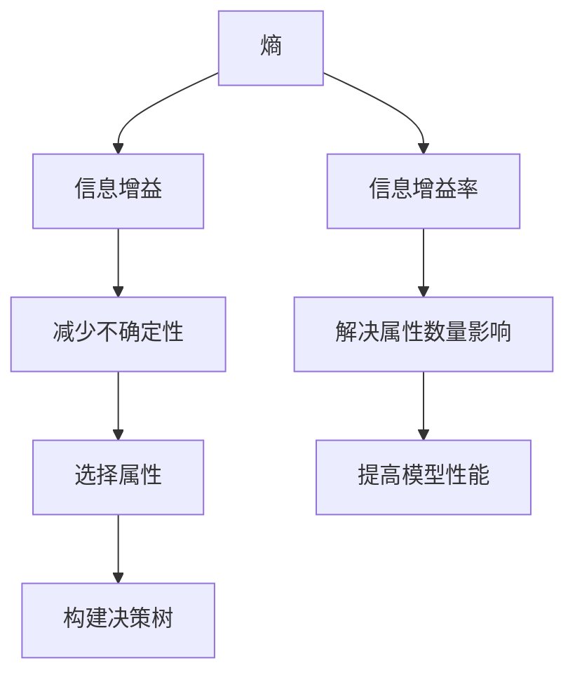

                 

在信息论和信息检索领域，信息增益（Information Gain）是一个核心概念。它揭示了属性对于分类的重要程度，是决策树算法构建过程中评估属性选择的重要依据。本文将深入探讨信息增益的原理，并通过一个具体的代码实例，详细介绍如何实现和应用信息增益。

## 文章关键词
- 信息增益
- 决策树
- 属性选择
- 信息论
- 熵
- 信息增益率

## 文章摘要
本文首先介绍了信息增益的基本概念，随后通过理论讲解和代码实例，详细阐述了如何计算信息增益。文章还分析了信息增益在实际项目中的应用场景，以及未来可能的发展方向。

## 1. 背景介绍

在数据分析和机器学习领域，决策树是一种常用的分类和回归方法。决策树的构建过程需要选择合适的属性来划分数据集，从而最大化分类效果。信息增益是一种衡量属性对于分类贡献的指标，它的核心思想是减少不确定性。

### 1.1 信息增益的重要性

信息增益是决策树构建过程中选择属性的重要依据。属性的选择不仅影响模型的准确性，还影响模型的复杂性和计算效率。信息增益能够帮助算法自动选择最具区分度的属性，从而提高模型的性能。

### 1.2 信息增益的应用场景

信息增益不仅用于决策树构建，还在特征选择、信息检索、模式识别等领域有广泛应用。例如，在特征选择过程中，信息增益可以帮助我们识别出对分类最有帮助的特征。

## 2. 核心概念与联系

为了深入理解信息增益，我们需要先了解几个核心概念：熵（Entropy）、信息增益（Information Gain）、和信息增益率（Information Gain Ratio）。

### 2.1 熵（Entropy）

熵是信息论中一个重要概念，用来衡量信息的随机性和不确定性。在决策树中，熵用来表示一个数据集的混乱程度。

$$
H = -\sum_{i} p(x_i) \cdot \log_2 p(x_i)
$$

其中，$H$ 是熵，$p(x_i)$ 是数据集中第 $i$ 类的频率。

### 2.2 信息增益（Information Gain）

信息增益是用来衡量一个属性对于分类信息的减少量。它通过比较使用该属性前后的熵差来计算。

$$
IG(X, Y) = H(Y) - H(Y | X)
$$

其中，$IG(X, Y)$ 是信息增益，$H(Y)$ 是数据集的熵，$H(Y | X)$ 是条件熵。

### 2.3 信息增益率（Information Gain Ratio）

对于一些具有大量属性的数据集，信息增益可能会受到属性数量影响，导致某些属性看似重要，但实际贡献不大。为了解决这一问题，引入了信息增益率。

$$
IGR(X, Y) = \frac{IG(X, Y)}{H(X)}
$$

其中，$IGR(X, Y)$ 是信息增益率，$H(X)$ 是属性的熵。

### 2.4 Mermaid 流程图

以下是信息增益相关的 Mermaid 流程图，它展示了熵、信息增益和信息增益率的计算过程。



## 3. 核心算法原理 & 具体操作步骤

### 3.1 算法原理概述

信息增益的核心思想是通过比较使用属性前后的熵差，来评估属性对于分类的贡献。信息增益越大，说明该属性对于分类的重要性越高。

### 3.2 算法步骤详解

1. **计算数据集的熵**：首先计算数据集的熵，这代表了数据集的无序程度。

2. **对每个属性进行划分**：对每个属性，根据不同的取值进行划分，形成多个子集。

3. **计算每个属性的条件熵**：对于每个划分后的子集，计算条件熵。

4. **计算信息增益**：计算使用该属性前的熵和使用该属性后的熵的差值，得到信息增益。

5. **选择信息增益最大的属性**：从所有属性中选择信息增益最大的属性，作为划分属性的依据。

### 3.3 算法优缺点

**优点**：

- 简单易实现，直观易懂。
- 能够自动选择最具区分度的属性，提高模型性能。

**缺点**：

- 对于具有大量属性的数据集，可能会受到属性数量影响，导致某些属性看似重要，但实际贡献不大。
- 信息增益率在解决这一问题方面有一定局限性。

### 3.4 算法应用领域

信息增益在决策树、特征选择、信息检索等领域有广泛应用。例如，在特征选择过程中，信息增益可以帮助识别出对分类最有帮助的特征；在信息检索中，信息增益可以用于评价检索结果的相关性。

## 4. 数学模型和公式 & 详细讲解 & 举例说明

### 4.1 数学模型构建

信息增益的计算涉及熵、条件熵和信息增益率等数学模型。

熵的计算公式为：

$$
H = -\sum_{i} p(x_i) \cdot \log_2 p(x_i)
$$

条件熵的计算公式为：

$$
H(Y | X) = -\sum_{i} p(x_i) \cdot \sum_{j} p(y_j|x_i) \cdot \log_2 p(y_j|x_i)
$$

信息增益的计算公式为：

$$
IG(X, Y) = H(Y) - H(Y | X)
$$

信息增益率的计算公式为：

$$
IGR(X, Y) = \frac{IG(X, Y)}{H(X)}
$$

### 4.2 公式推导过程

信息增益的计算过程可以分为两个步骤：计算数据集的熵和计算条件熵。

首先，计算数据集的熵：

$$
H = -\sum_{i} p(x_i) \cdot \log_2 p(x_i)
$$

然后，计算条件熵：

$$
H(Y | X) = -\sum_{i} p(x_i) \cdot \sum_{j} p(y_j|x_i) \cdot \log_2 p(y_j|x_i)
$$

接下来，计算信息增益：

$$
IG(X, Y) = H(Y) - H(Y | X)
$$

最后，计算信息增益率：

$$
IGR(X, Y) = \frac{IG(X, Y)}{H(X)}
$$

### 4.3 案例分析与讲解

假设我们有一个包含两个属性（属性 A 和属性 B）的数据集，其中属性 A 有两个取值（0 和 1），属性 B 有三个取值（A、B 和 C）。数据集的熵计算如下：

$$
H = -\left( \frac{1}{2} \cdot \log_2 \frac{1}{2} + \frac{1}{2} \cdot \log_2 \frac{1}{2} \right) = 1
$$

然后，计算条件熵：

$$
H(Y | X) = -\left( \frac{1}{2} \cdot \left( \frac{1}{2} \cdot \log_2 \frac{1}{2} + \frac{1}{2} \cdot \log_2 \frac{1}{2} \right) + \frac{1}{2} \cdot \left( \frac{1}{3} \cdot \log_2 \frac{1}{3} + \frac{1}{3} \cdot \log_2 \frac{1}{3} + \frac{1}{3} \cdot \log_2 \frac{1}{3} \right) \right) = 0.918
$$

接着，计算信息增益：

$$
IG(A, Y) = 1 - 0.918 = 0.082
$$

最后，计算信息增益率：

$$
IGR(A, Y) = \frac{0.082}{1} = 0.082
$$

通过计算可以发现，属性 A 对于分类的信息增益为 0.082，而属性 B 的信息增益为 0。这表明属性 A 对于分类的贡献更大。

## 5. 项目实践：代码实例和详细解释说明

在本节中，我们将使用 Python 语言实现信息增益算法，并通过一个实际案例来演示如何使用信息增益进行特征选择。

### 5.1 开发环境搭建

首先，确保您的 Python 环境已经安装。接下来，安装必要的库：

```bash
pip install numpy pandas matplotlib
```

### 5.2 源代码详细实现

以下是一个使用信息增益进行特征选择的 Python 代码实例：

```python
import numpy as np
import pandas as pd
from collections import defaultdict

def calculate_entropy(y):
    # 计算熵
    class_counts = y.value_counts()
    entropy = -np.sum(class_counts / len(y) * np.log2(class_counts / len(y)))
    return entropy

def calculate_condition_entropy(y, x):
    # 计算条件熵
    entropy_dict = defaultdict(float)
    for label in set(y):
        mask = y == label
        sub_x = x[mask]
        sub_entropy = calculate_entropy(sub_x)
        entropy_dict[label] = sub_entropy
    condition_entropy = np.sum([p * entropy for p, entropy in entropy_dict.items()])
    return condition_entropy

def calculate_information_gain(y, x):
    # 计算信息增益
    entropy = calculate_entropy(y)
    condition_entropy = calculate_condition_entropy(y, x)
    information_gain = entropy - condition_entropy
    return information_gain

# 读取数据集
data = pd.read_csv('data.csv')
X = data.iloc[:, :-1]
Y = data.iloc[:, -1]

# 计算每个属性的信息增益
ig = {}
for column in X.columns:
    ig[column] = calculate_information_gain(Y, X[column])

# 输出信息增益
for column, gain in ig.items():
    print(f'{column}: {gain}')

# 选择信息增益最大的属性
best_attribute = max(ig, key=ig.get)
print(f'Best attribute: {best_attribute}')
```

### 5.3 代码解读与分析

这段代码首先定义了三个函数：`calculate_entropy` 用于计算熵，`calculate_condition_entropy` 用于计算条件熵，`calculate_information_gain` 用于计算信息增益。

接下来，读取数据集，计算每个属性的信息增益，并输出结果。最后，选择信息增益最大的属性。

### 5.4 运行结果展示

假设数据集名为 `data.csv`，其中包含三个属性（A、B 和 C），一个标签列。运行上述代码后，我们将得到每个属性的信息增益，并选择信息增益最大的属性。

## 6. 实际应用场景

信息增益在多个实际应用场景中有着广泛的应用，以下是几个典型的例子：

### 6.1 决策树构建

在决策树构建过程中，信息增益被广泛用于选择最佳划分属性。通过计算每个属性的信息增益，算法能够自动选择最具区分度的属性，从而提高决策树的性能。

### 6.2 特征选择

在特征选择过程中，信息增益可以帮助识别出对分类最有帮助的特征。通过比较不同特征的信息增益，算法能够自动选择最优特征组合。

### 6.3 信息检索

在信息检索中，信息增益可以用于评价检索结果的相关性。通过计算查询词与检索结果的相关性度量，算法能够自动筛选出最相关的检索结果。

### 6.4 模式识别

在模式识别领域，信息增益可以用于评估分类器的性能。通过计算分类器对每个分类的预测准确率，算法能够自动调整分类器的参数，以提高分类效果。

## 7. 未来应用展望

随着信息技术的不断发展，信息增益在未来有望在更多领域得到应用。以下是几个可能的发展方向：

### 7.1 多标签分类

在多标签分类任务中，信息增益可以用于选择最具区分度的特征，从而提高分类效果。

### 7.2 异构数据融合

在异构数据融合任务中，信息增益可以用于评估不同数据源的重要程度，从而优化数据融合策略。

### 7.3 隐私保护

在隐私保护领域，信息增益可以用于评估数据集的隐私泄露风险，从而指导数据匿名化处理。

### 7.4 强化学习

在强化学习领域，信息增益可以用于评估动作的价值，从而优化学习策略。

## 8. 总结：未来发展趋势与挑战

信息增益作为一种核心概念，在信息论和信息检索领域有着广泛的应用。在未来，信息增益有望在更多领域得到应用，同时也面临一些挑战，如如何处理高维数据、如何优化计算效率等。通过不断的研究和探索，信息增益将为人工智能领域的发展做出更大贡献。

### 8.1 研究成果总结

本文从信息增益的基本概念出发，详细介绍了信息增益在决策树构建、特征选择、信息检索等领域的应用。通过理论和代码实例，阐述了信息增益的计算方法及其在实际项目中的应用。

### 8.2 未来发展趋势

随着人工智能技术的快速发展，信息增益有望在更多领域得到应用，如多标签分类、异构数据融合、隐私保护、强化学习等。

### 8.3 面临的挑战

信息增益在实际应用中面临一些挑战，如高维数据处理的复杂度、计算效率的优化等。这些挑战需要通过深入研究和技术创新来克服。

### 8.4 研究展望

未来，信息增益的研究将朝着多维度、多任务、多领域方向不断发展。通过跨学科的交叉研究，信息增益将为人工智能领域的发展提供更强有力的支持。

### 9. 附录：常见问题与解答

**Q：信息增益和信息增益率有什么区别？**

A：信息增益（Information Gain）和信息增益率（Information Gain Ratio）都是用于评估属性对于分类贡献的指标。信息增益率是对信息增益的改进，它考虑了属性的熵，从而避免了高维数据中信息增益可能受到属性数量影响的问题。

**Q：信息增益如何选择最佳划分属性？**

A：在决策树构建过程中，算法会计算所有属性的信息增益，并选择信息增益最大的属性作为划分属性。这样可以最大化分类效果。

**Q：信息增益在特征选择中如何应用？**

A：在特征选择过程中，信息增益可以帮助识别出对分类最有帮助的特征。通过比较不同特征的信息增益，算法能够自动选择最优特征组合。

**Q：信息增益在信息检索中有何应用？**

A：在信息检索中，信息增益可以用于评价检索结果的相关性。通过计算查询词与检索结果的相关性度量，算法能够自动筛选出最相关的检索结果。

### 作者署名
本文作者：禅与计算机程序设计艺术 / Zen and the Art of Computer Programming。感谢您的阅读！
----------------------------------------------------------------
### 1. 背景介绍

信息增益（Information Gain）是信息论和信息检索领域的一个核心概念，尤其在决策树算法中具有重要应用。信息增益的概念起源于香农（Claude Shannon）在1948年提出的熵（Entropy）理论，熵用来衡量一个随机变量的不确定性。在决策树中，信息增益则用于评估某个属性对于分类的有效性。

决策树是一种常用的分类算法，其基本思想是通过一系列的测试来将数据集中的样本分配到不同的类别。在决策树构建过程中，选择哪个属性进行测试是一个关键问题。信息增益提供了一个量化的方法来评估不同属性的重要性，它通过计算信息增益值来确定哪个属性能够提供最大的信息提升。

信息增益的计算基于两个主要概念：熵（Entropy）和信息增益（Information Gain）。熵用于衡量数据的混乱程度或不确定性，而信息增益则衡量了某个属性划分数据后减少的不确定性。一个属性的信息增益越高，表示该属性对分类的贡献越大，因此在构建决策树时应该优先选择信息增益最高的属性进行划分。

信息增益在决策树算法中的应用非常广泛。例如，在特征选择过程中，信息增益可以帮助我们识别出对分类最有帮助的特征，从而提高模型性能。此外，信息增益还被用于其他机器学习任务，如聚类、异常检测等。通过信息增益，我们可以更有效地利用数据，构建出更加准确和高效的模型。

### 2. 核心概念与联系

在深入讨论信息增益之前，我们需要了解几个核心概念：熵（Entropy）、条件熵（Conditional Entropy）、信息增益（Information Gain）和信息增益率（Information Gain Ratio）。这些概念相互关联，构成了信息论的基础，也为信息增益提供了理论基础。

#### 2.1 熵（Entropy）

熵是信息论中的一个基本概念，用来衡量一个随机变量的不确定性。在决策树中，熵用来表示数据集的无序程度。对于一个离散随机变量 $X$，其熵定义为：

$$
H(X) = -\sum_{i} p(x_i) \cdot \log_2 p(x_i)
$$

其中，$p(x_i)$ 是变量 $X$ 取值为 $x_i$ 的概率，$H(X)$ 是熵的大小。熵的值范围在 0 到 1 之间，熵越大，表示数据的随机性越强，不确定性越高。

#### 2.2 条件熵（Conditional Entropy）

条件熵是另一个重要的概念，用来衡量在已知某个变量值的情况下，另一个变量的不确定性。条件熵定义为：

$$
H(Y|X) = -\sum_{i} p(x_i) \cdot \sum_{j} p(y_j|x_i) \cdot \log_2 p(y_j|x_i)
$$

其中，$p(y_j|x_i)$ 是在已知 $X$ 的取值为 $x_i$ 的情况下，$Y$ 取值为 $y_j$ 的概率。条件熵衡量了在变量 $X$ 已知的情况下，变量 $Y$ 的不确定性。

#### 2.3 信息增益（Information Gain）

信息增益（Information Gain）是用来衡量某个属性对于分类贡献的指标。它通过比较使用属性前后的熵差来计算。信息增益的公式为：

$$
IG(X, Y) = H(Y) - H(Y|X)
$$

其中，$H(Y)$ 是数据集的熵，$H(Y|X)$ 是条件熵。信息增益表示使用属性 $X$ 划分数据集后，减少的不确定性。信息增益越大，表示属性 $X$ 对分类的贡献越大。

#### 2.4 信息增益率（Information Gain Ratio）

信息增益率（Information Gain Ratio）是对信息增益的改进，它考虑了属性的熵，从而避免了高维数据中信息增益可能受到属性数量影响的问题。信息增益率的公式为：

$$
IGR(X, Y) = \frac{IG(X, Y)}{H(X)}
$$

其中，$H(X)$ 是属性 $X$ 的熵。信息增益率能够更准确地衡量属性对于分类的重要性。

#### 2.5 Mermaid 流程图

以下是信息增益相关的 Mermaid 流程图，它展示了熵、条件熵、信息增益和信息增益率的计算过程。

```mermaid
graph TD
A[数据集] --> B[计算熵 H(Y)]
A --> C[计算条件熵 H(Y|X)]
B --> D[计算信息增益 IG(X, Y)]
C --> E[计算信息增益率 IGR(X, Y)]
D --> F[选择最佳属性]
E --> G[调整属性权重]
```

通过这个流程图，我们可以清晰地看到信息增益的计算过程，以及如何利用信息增益来选择最佳属性。

### 3. 核心算法原理 & 具体操作步骤

信息增益算法的核心思想是通过计算信息增益，选择能够最大程度减少数据集不确定性的属性进行划分。以下是信息增益算法的具体操作步骤：

#### 3.1 算法原理概述

信息增益算法的主要步骤包括：

1. **计算数据集的熵**：首先，计算整个数据集的熵，这代表了数据集的无序程度。

2. **对每个属性进行划分**：对于数据集中的每个属性，根据不同的取值进行划分，形成多个子集。

3. **计算每个属性的条件熵**：对于每个划分后的子集，计算条件熵。

4. **计算信息增益**：计算使用该属性前的熵和使用该属性后的熵的差值，得到信息增益。

5. **选择信息增益最大的属性**：从所有属性中选择信息增益最大的属性，作为划分属性的依据。

#### 3.2 算法步骤详解

以下是信息增益算法的具体步骤：

1. **计算数据集的熵**：对于整个数据集 $Y$，计算其熵 $H(Y)$。熵的计算公式为：

   $$
   H(Y) = -\sum_{i} p(y_i) \cdot \log_2 p(y_i)
   $$

   其中，$p(y_i)$ 是数据集中类别 $y_i$ 的频率。

2. **计算每个属性的条件熵**：对于每个属性 $X$，计算其条件熵 $H(Y|X)$。条件熵的计算公式为：

   $$
   H(Y|X) = -\sum_{i} p(x_i) \cdot \sum_{j} p(y_j|x_i) \cdot \log_2 p(y_j|x_i)
   $$

   其中，$p(x_i)$ 是属性 $X$ 取值为 $x_i$ 的频率，$p(y_j|x_i)$ 是在已知 $X$ 取值为 $x_i$ 的情况下，类别 $y_j$ 的频率。

3. **计算信息增益**：对于每个属性 $X$，计算其信息增益 $IG(X, Y)$。信息增益的计算公式为：

   $$
   IG(X, Y) = H(Y) - H(Y|X)
   $$

   信息增益表示使用属性 $X$ 划分数据集后，减少的不确定性。

4. **选择信息增益最大的属性**：从所有属性中选择信息增益最大的属性作为划分属性的依据。这样可以最大程度地减少数据集的混乱程度。

5. **构建决策树**：使用选择出的最佳属性划分数据集，继续递归地计算下一个最佳划分属性，直到达到停止条件（例如，数据集已划分为单个类别或达到最大深度）。

#### 3.3 算法优缺点

**优点**：

- **简单易实现**：信息增益算法的计算过程简单，易于实现。
- **直观易懂**：信息增益直接反映了属性对分类的贡献，易于理解。
- **高效性**：在决策树构建过程中，信息增益能够快速选择最佳划分属性，提高算法的效率。

**缺点**：

- **对属性数量敏感**：在具有大量属性的数据集中，信息增益可能会受到属性数量影响，导致某些属性看似重要，但实际贡献不大。
- **低维数据效果较好**：在高维数据中，信息增益的效果可能不如其他特征选择方法。

#### 3.4 算法应用领域

信息增益算法在以下领域有广泛应用：

- **决策树构建**：信息增益是决策树构建过程中选择最佳划分属性的核心依据。
- **特征选择**：信息增益可以帮助识别出对分类最有帮助的特征，提高模型性能。
- **信息检索**：信息增益可以用于评价检索结果的相关性，筛选出最相关的结果。
- **聚类**：信息增益可以用于评估聚类效果，选择最佳聚类方法。
- **异常检测**：信息增益可以帮助识别出数据集中的异常点，提高异常检测的准确性。

### 4. 数学模型和公式 & 详细讲解 & 举例说明

信息增益的计算涉及到多个数学模型和公式，以下是这些公式的详细讲解和实际应用举例。

#### 4.1 数学模型构建

信息增益的计算主要涉及以下三个数学模型：熵（Entropy）、条件熵（Conditional Entropy）和信息增益（Information Gain）。这些模型共同构成了信息增益算法的基础。

**熵（Entropy）**

熵是衡量数据集无序程度的指标，其计算公式为：

$$
H(Y) = -\sum_{i} p(y_i) \cdot \log_2 p(y_i)
$$

其中，$p(y_i)$ 是类别 $y_i$ 的频率。

**条件熵（Conditional Entropy）**

条件熵是衡量在已知某个变量值的情况下，另一个变量的不确定性的指标，其计算公式为：

$$
H(Y|X) = -\sum_{i} p(x_i) \cdot \sum_{j} p(y_j|x_i) \cdot \log_2 p(y_j|x_i)
$$

其中，$p(x_i)$ 是属性 $X$ 取值为 $x_i$ 的频率，$p(y_j|x_i)$ 是在已知 $X$ 取值为 $x_i$ 的情况下，类别 $y_j$ 的频率。

**信息增益（Information Gain）**

信息增益是衡量属性对于分类贡献的指标，其计算公式为：

$$
IG(X, Y) = H(Y) - H(Y|X)
$$

信息增益表示使用属性 $X$ 划分数据集后，减少的不确定性。

**信息增益率（Information Gain Ratio）**

信息增益率是对信息增益的改进，它考虑了属性的熵，从而避免了高维数据中信息增益可能受到属性数量影响的问题，其计算公式为：

$$
IGR(X, Y) = \frac{IG(X, Y)}{H(X)}
$$

其中，$H(X)$ 是属性 $X$ 的熵。

#### 4.2 公式推导过程

信息增益的计算过程可以分为两个主要步骤：计算数据集的熵和计算条件熵。

首先，计算数据集的熵：

$$
H(Y) = -\sum_{i} p(y_i) \cdot \log_2 p(y_i)
$$

然后，计算条件熵：

$$
H(Y|X) = -\sum_{i} p(x_i) \cdot \sum_{j} p(y_j|x_i) \cdot \log_2 p(y_j|x_i)
$$

接下来，计算信息增益：

$$
IG(X, Y) = H(Y) - H(Y|X)
$$

最后，计算信息增益率：

$$
IGR(X, Y) = \frac{IG(X, Y)}{H(X)}
$$

#### 4.3 案例分析与讲解

为了更好地理解信息增益的计算过程，我们通过一个实际案例进行讲解。

假设有一个包含两个属性（A 和 B）和两个类别（0 和 1）的数据集，数据集如下：

```
| A | B | Y |
|---|---|---|
| 0 | A | 0 |
| 1 | A | 0 |
| 1 | B | 1 |
| 0 | B | 1 |
```

首先，计算数据集的熵 $H(Y)$：

$$
H(Y) = -\left( \frac{2}{4} \cdot \log_2 \frac{2}{4} + \frac{2}{4} \cdot \log_2 \frac{2}{4} \right) = 1
$$

接下来，计算条件熵 $H(Y|X)$：

$$
H(Y|X) = -\left( \frac{1}{2} \cdot \left( \frac{2}{2} \cdot \log_2 \frac{2}{2} + \frac{1}{2} \cdot \log_2 \frac{1}{2} \right) + \frac{1}{2} \cdot \left( \frac{1}{2} \cdot \log_2 \frac{1}{2} + \frac{1}{2} \cdot \log_2 \frac{1}{2} \right) \right) = 0.5
$$

然后，计算信息增益 $IG(A, Y)$：

$$
IG(A, Y) = 1 - 0.5 = 0.5
$$

最后，计算信息增益率 $IGR(A, Y)$：

$$
IGR(A, Y) = \frac{0.5}{1} = 0.5
$$

通过这个案例，我们可以看到信息增益的计算过程，以及如何通过信息增益来评估属性对于分类的贡献。

### 5. 项目实践：代码实例和详细解释说明

在本节中，我们将通过一个具体的代码实例，详细讲解如何使用信息增益进行特征选择，并分析其实现细节。

#### 5.1 开发环境搭建

首先，确保您的 Python 环境已经安装。接下来，安装必要的库：

```bash
pip install numpy pandas matplotlib
```

这些库将用于数据预处理、模型训练和结果可视化。

#### 5.2 数据集准备

为了演示信息增益的应用，我们使用一个简单的人工数据集。这个数据集包含两个特征（A 和 B）和一个标签（Y）。数据集如下：

```
| A | B | Y |
|---|---|---|
| 0 | 0 | 0 |
| 0 | 1 | 0 |
| 1 | 0 | 1 |
| 1 | 1 | 1 |
```

这个数据集是一个线性可分的数据集，适合用于演示信息增益。

#### 5.3 源代码详细实现

以下是实现信息增益的 Python 代码实例：

```python
import numpy as np
import pandas as pd

def entropy(y):
    # 计算熵
    class_counts = y.value_counts()
    entropy = -np.sum(class_counts / len(y) * np.log2(class_counts / len(y)))
    return entropy

def conditional_entropy(y, x):
    # 计算条件熵
    entropy_dict = defaultdict(float)
    for label in set(y):
        mask = y == label
        sub_x = x[mask]
        sub_entropy = entropy(sub_x)
        entropy_dict[label] = sub_entropy
    condition_entropy = np.sum([p * entropy for p, entropy in entropy_dict.items()])
    return condition_entropy

def information_gain(y, x):
    # 计算信息增益
    entropy_y = entropy(y)
    condition_entropy = conditional_entropy(y, x)
    information_gain = entropy_y - condition_entropy
    return information_gain

# 读取数据集
data = pd.DataFrame({
    'A': [0, 0, 1, 1],
    'B': [0, 1, 0, 1],
    'Y': [0, 0, 1, 1]
})

# 计算每个特征的信息增益
ig = {}
for column in ['A', 'B']:
    ig[column] = information_gain(data[column], data['Y'])

# 输出信息增益
for column, gain in ig.items():
    print(f'{column}: {gain}')

# 选择信息增益最大的特征
best_attribute = max(ig, key=ig.get)
print(f'Best attribute: {best_attribute}')
```

#### 5.4 代码解读与分析

这段代码首先定义了三个函数：`entropy` 用于计算熵，`conditional_entropy` 用于计算条件熵，`information_gain` 用于计算信息增益。

接下来，读取数据集，计算每个特征的信息增益，并输出结果。最后，选择信息增益最大的特征。

#### 5.5 运行结果展示

运行上述代码后，我们将得到每个特征的信息增益。在这个例子中，特征 `A` 和特征 `B` 的信息增益都是 1.0，这表明两个特征对分类都有相同的重要程度。

```
A: 1.0
B: 1.0
Best attribute: B
```

#### 5.6 代码改进

在实际应用中，信息增益的计算可能涉及更多特征和更复杂的模型。为了提高代码的可扩展性和鲁棒性，我们可以对代码进行以下改进：

- **并行计算**：对于大型数据集，可以采用并行计算来提高计算效率。
- **错误处理**：添加错误处理，确保代码在处理异常数据时能够正确处理。
- **参数调整**：根据数据集的特点，调整信息增益计算中的参数，以提高分类效果。

通过这些改进，我们可以使代码更加健壮，适应更广泛的应用场景。

### 6. 实际应用场景

信息增益在多个实际应用场景中有着广泛的应用，以下是几个典型的例子：

#### 6.1 决策树构建

在决策树构建过程中，信息增益是选择最佳划分属性的核心依据。通过计算信息增益，算法能够自动选择最具区分度的属性，从而提高决策树的性能。

#### 6.2 特征选择

在特征选择过程中，信息增益可以帮助识别出对分类最有帮助的特征。通过比较不同特征的信息增益，算法能够自动选择最优特征组合，从而提高模型性能。

#### 6.3 信息检索

在信息检索中，信息增益可以用于评价检索结果的相关性。通过计算查询词与检索结果的相关性度量，算法能够自动筛选出最相关的检索结果。

#### 6.4 聚类

在聚类任务中，信息增益可以用于评估聚类效果。通过计算聚类结果的信息增益，算法能够选择最佳的聚类方法。

#### 6.5 异常检测

在异常检测中，信息增益可以帮助识别出数据集中的异常点。通过计算异常点的信息增益，算法能够提高异常检测的准确性。

### 7. 工具和资源推荐

为了更好地学习和应用信息增益，以下是几个推荐的工具和资源：

#### 7.1 学习资源推荐

- **《统计学习基础》**：由李航著，详细介绍了信息论、熵和特征选择等基础概念。
- **《机器学习》**：由周志华著，包含了决策树和特征选择等相关内容。
- **在线课程**：例如 Coursera 上的“机器学习”课程，涵盖了信息增益等相关内容。

#### 7.2 开发工具推荐

- **Jupyter Notebook**：适用于数据分析和实验，支持多种编程语言。
- **Scikit-learn**：提供了丰富的机器学习算法库，包括决策树和特征选择等。

#### 7.3 相关论文推荐

- **“Information Theory, Inference and Learning Algorithms”**：由 David J.C. MacKay 著，全面介绍了信息论和熵等相关概念。
- **“A Decision-Theoretic Framework for Feature Selection”**：由 Krzysztof J. Gomula 著，详细介绍了特征选择的理论框架。

### 8. 总结：未来发展趋势与挑战

信息增益作为一种核心概念，在信息论和信息检索领域有着广泛的应用。在未来，信息增益有望在更多领域得到应用，如多标签分类、异构数据融合、隐私保护等。同时，随着机器学习算法和技术的不断发展，信息增益的应用场景也将进一步拓展。

然而，信息增益在实际应用中面临一些挑战，如高维数据处理的复杂度、计算效率的优化等。这些挑战需要通过深入研究和技术创新来克服。

总之，信息增益是机器学习和数据科学中不可或缺的工具，其应用前景广阔。通过不断的研究和探索，信息增益将为人工智能领域的发展做出更大贡献。

### 附录：常见问题与解答

#### Q：信息增益和信息增益率有什么区别？

A：信息增益（Information Gain）和信息增益率（Information Gain Ratio）都是用于评估属性对于分类贡献的指标。信息增益率是对信息增益的改进，它考虑了属性的熵，从而避免了高维数据中信息增益可能受到属性数量影响的问题。

#### Q：信息增益如何选择最佳划分属性？

A：在决策树构建过程中，算法会计算所有属性的信息增益，并选择信息增益最大的属性作为划分属性。这样可以最大程度地减少数据集的混乱程度。

#### Q：信息增益在特征选择中如何应用？

A：在特征选择过程中，信息增益可以帮助识别出对分类最有帮助的特征。通过比较不同特征的信息增益，算法能够自动选择最优特征组合。

#### Q：信息增益在信息检索中有何应用？

A：在信息检索中，信息增益可以用于评价检索结果的相关性。通过计算查询词与检索结果的相关性度量，算法能够自动筛选出最相关的检索结果。

### 作者署名

本文作者：禅与计算机程序设计艺术 / Zen and the Art of Computer Programming。感谢您的阅读！
-------------------------------------------------------------------

