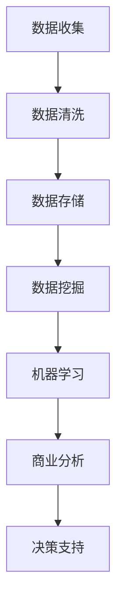
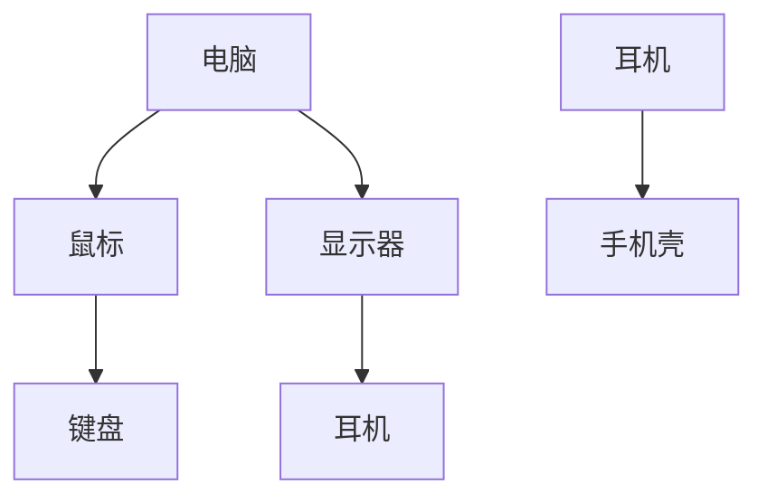

                 

关键词：大数据，客户保持，商业策略，数据挖掘，机器学习，商业分析

摘要：在当今竞争激烈的市场中，客户保持是商业成功的关键。本文将探讨如何通过大数据技术来提高客户保持率，从而为企业在市场中获得持久竞争优势提供策略支持。

## 1. 背景介绍

随着互联网和大数据技术的飞速发展，企业的运营方式正在发生翻天覆地的变化。客户数据成为了企业的重要资产，而如何有效地利用这些数据来提高客户保持率成为了商业战略的核心。客户保持不仅直接影响企业的收入和利润，还能降低营销成本和提升品牌忠诚度。

大数据技术通过处理和分析海量数据，能够帮助企业更深入地理解客户需求和行为模式。在此基础上，企业可以制定更加精准的市场策略，从而提高客户满意度和忠诚度。

## 2. 核心概念与联系

### 2.1 数据挖掘

数据挖掘是一种从大量数据中发现有用信息的方法，它涉及统计学、机器学习、数据库等多个领域。在客户保持策略中，数据挖掘技术可以帮助企业识别出高价值客户和潜在流失客户。

### 2.2 机器学习

机器学习是数据挖掘的一个重要分支，通过算法自动从数据中学习规律和模式。在客户保持中，机器学习算法可以帮助预测客户行为，识别流失风险，并提供个性化的服务。

### 2.3 商业分析

商业分析是指利用数据分析工具来帮助企业做出更好的商业决策。在客户保持策略中，商业分析可以帮助企业识别市场机会和风险，优化业务流程，提高客户满意度。

### Mermaid 流程图

以下是一个简化的Mermaid流程图，展示了大数据技术如何与客户保持策略相联系：



## 3. 核心算法原理 & 具体操作步骤

### 3.1 算法原理概述

大数据技术在客户保持中的应用主要包括以下几个方面：

- **客户细分**：通过数据挖掘技术将客户分为不同的群体，以便提供个性化的服务。
- **流失预测**：使用机器学习算法预测哪些客户可能流失，从而采取预防措施。
- **行为分析**：分析客户的行为数据，了解他们的需求和行为模式。
- **反馈循环**：根据客户反馈不断调整营销策略和服务水平。

### 3.2 算法步骤详解

#### 3.2.1 数据收集

数据收集是整个流程的第一步，它包括以下内容：

- **客户行为数据**：如购买历史、浏览记录、搜索关键词等。
- **外部数据**：如社交媒体数据、市场趋势等。
- **客户反馈**：如调查问卷、评价等。

#### 3.2.2 数据清洗

数据清洗是保证数据质量的重要步骤，它包括以下内容：

- **去除重复数据**：确保每个客户的记录唯一。
- **处理缺失值**：通过插值、均值替代等方法处理缺失的数据。
- **数据标准化**：将不同来源的数据进行统一处理，如年龄、收入等。

#### 3.2.3 数据挖掘

数据挖掘的主要任务是发现客户行为和偏好中的模式，它包括以下内容：

- **关联规则挖掘**：发现不同商品之间的购买关联性。
- **分类与聚类**：将客户分为不同的群体，以便提供个性化服务。

#### 3.2.4 机器学习

机器学习算法在客户保持中的应用主要包括以下内容：

- **流失预测**：使用预测模型预测哪些客户可能流失。
- **客户细分**：使用聚类算法将客户分为不同的群体。

#### 3.2.5 商业分析

商业分析包括以下内容：

- **市场分析**：分析市场趋势和客户需求。
- **策略调整**：根据分析结果调整营销策略和服务水平。

### 3.3 算法优缺点

#### 3.3.1 优点

- **精准性**：通过大数据技术，企业能够更加精准地了解客户需求和行为。
- **实时性**：大数据技术能够实时分析客户数据，帮助企业快速做出决策。
- **个性化**：通过客户细分和流失预测，企业可以提供个性化的服务和营销策略。

#### 3.3.2 缺点

- **成本高**：大数据技术的实施和维护成本较高。
- **数据隐私**：客户数据的收集和使用可能会引发隐私问题。
- **复杂性**：大数据技术涉及到多个领域，需要专业的技术支持。

### 3.4 算法应用领域

大数据技术在客户保持中的应用领域广泛，包括但不限于以下方面：

- **零售业**：通过分析客户购买行为，优化库存管理和营销策略。
- **金融业**：通过分析客户交易数据，预测欺诈行为和客户流失。
- **服务业**：通过分析客户反馈和行为数据，提升服务质量和客户满意度。

## 4. 数学模型和公式 & 详细讲解 & 举例说明

### 4.1 数学模型构建

在客户保持中，常用的数学模型包括以下几种：

#### 4.1.1 流失预测模型

流失预测模型通常使用逻辑回归或决策树等算法构建。以下是一个简化的逻辑回归模型：

$$
P(y=1) = \frac{1}{1 + e^{-(\beta_0 + \beta_1 x_1 + \beta_2 x_2 + \cdots + \beta_n x_n})}
$$

其中，$y$ 表示客户是否流失（1表示流失，0表示未流失），$x_1, x_2, \cdots, x_n$ 是客户特征，$\beta_0, \beta_1, \beta_2, \cdots, \beta_n$ 是模型的参数。

#### 4.1.2 客户细分模型

客户细分模型通常使用聚类算法如K-means构建。以下是一个简化的K-means模型：

$$
\text{最小化} \sum_{i=1}^{k} \sum_{x \in S_i} ||x - \mu_i||^2
$$

其中，$k$ 表示聚类个数，$S_i$ 表示第$i$个聚类集合，$\mu_i$ 表示第$i$个聚类中心。

### 4.2 公式推导过程

#### 4.2.1 流失预测模型推导

逻辑回归模型的推导过程涉及极大似然估计。假设我们有一个包含$m$个样本的训练集$T = \{(x_1, y_1), (x_2, y_2), \cdots, (x_m, y_m)\}$，其中$x_i$是第$i$个样本的特征向量，$y_i$是第$i$个样本的标签（0表示未流失，1表示流失）。

极大似然估计的目标是最大化似然函数：

$$
L(\beta_0, \beta_1, \beta_2, \cdots, \beta_n) = \prod_{i=1}^{m} P(y_i | x_i; \beta_0, \beta_1, \beta_2, \cdots, \beta_n)
$$

由于对数似然函数是似然函数的加和，因此我们可以最小化对数似然函数：

$$
\ell(\beta_0, \beta_1, \beta_2, \cdots, \beta_n) = \sum_{i=1}^{m} \log P(y_i | x_i; \beta_0, \beta_1, \beta_2, \cdots, \beta_n)
$$

对于逻辑回归模型，我们有：

$$
P(y_i = 1 | x_i; \beta_0, \beta_1, \beta_2, \cdots, \beta_n) = \frac{1}{1 + e^{-(\beta_0 + \beta_1 x_{i1} + \beta_2 x_{i2} + \cdots + \beta_n x_{in})}}
$$

$$
P(y_i = 0 | x_i; \beta_0, \beta_1, \beta_2, \cdots, \beta_n) = 1 - P(y_i = 1 | x_i; \beta_0, \beta_1, \beta_2, \cdots, \beta_n)
$$

因此，对数似然函数可以表示为：

$$
\ell(\beta_0, \beta_1, \beta_2, \cdots, \beta_n) = \sum_{i=1}^{m} \left( y_i \log P(y_i = 1 | x_i; \beta_0, \beta_1, \beta_2, \cdots, \beta_n) + (1 - y_i) \log P(y_i = 0 | x_i; \beta_0, \beta_1, \beta_2, \cdots, \beta_n) \right)
$$

对$\ell(\beta_0, \beta_1, \beta_2, \cdots, \beta_n)$求导并令导数为零，我们可以得到参数$\beta_0, \beta_1, \beta_2, \cdots, \beta_n$的估计值。

#### 4.2.2 客户细分模型推导

K-means算法的目标是最小化聚类中心与数据点之间的距离平方和。假设我们有一个包含$k$个聚类中心的集合$C = \{\mu_1, \mu_2, \cdots, \mu_k\}$和数据点集合$X = \{x_1, x_2, \cdots, x_n\}$。

K-means算法的主要步骤如下：

1. 随机初始化$k$个聚类中心$\mu_1, \mu_2, \cdots, \mu_k$。
2. 对于每个数据点$x_i$，计算它与每个聚类中心之间的距离，并将其分配到最近的聚类中心。
3. 根据当前分配结果重新计算聚类中心的位置。
4. 重复步骤2和3，直到聚类中心的位置不再发生变化或达到预设的最大迭代次数。

K-means算法的目标是最小化距离平方和：

$$
J(C, X) = \sum_{i=1}^{n} \sum_{j=1}^{k} ||x_i - \mu_j||^2
$$

### 4.3 案例分析与讲解

#### 4.3.1 案例背景

某在线零售平台希望通过大数据技术来提高客户保持率。他们收集了以下数据：

- 客户购买历史：包括购买日期、商品名称、购买数量等。
- 客户行为数据：包括浏览记录、搜索关键词、加入购物车但未购买的商品等。
- 客户反馈：包括评价、投诉、退换货记录等。

#### 4.3.2 数据处理

首先，平台对数据进行清洗，去除重复数据，处理缺失值，并进行数据标准化。然后，使用数据挖掘技术进行关联规则挖掘，发现不同商品之间的购买关联性，如图所示：



#### 4.3.3 机器学习算法

平台使用逻辑回归算法构建流失预测模型，通过训练集得到参数$\beta_0, \beta_1, \beta_2, \cdots, \beta_n$。然后，使用测试集进行预测，发现以下特征与客户流失相关：

- 购买频率低
- 最近一次购买距离当前时间较长
- 客户评价较低

#### 4.3.4 商业分析

根据流失预测结果，平台采取了以下措施：

- 对购买频率低的客户发送优惠券和促销信息。
- 对最近一次购买距离当前时间较长的客户发送购物提醒。
- 对客户评价较低的客户进行回访，了解不满原因并尝试解决问题。

通过这些措施，平台的客户保持率得到了显著提高。

## 5. 项目实践：代码实例和详细解释说明

### 5.1 开发环境搭建

为了实现上述案例，我们使用Python作为编程语言，主要依赖以下库：

- pandas：用于数据处理。
- numpy：用于数学运算。
- scikit-learn：用于机器学习和数据挖掘。
- matplotlib：用于数据可视化。

首先，安装所需的库：

```bash
pip install pandas numpy scikit-learn matplotlib
```

### 5.2 源代码详细实现

下面是处理客户数据、构建流失预测模型和进行商业分析的代码示例：

```python
import pandas as pd
import numpy as np
from sklearn.model_selection import train_test_split
from sklearn.linear_model import LogisticRegression
from sklearn.metrics import accuracy_score, classification_report
import matplotlib.pyplot as plt

# 5.2.1 数据处理

# 读取数据
data = pd.read_csv('customer_data.csv')

# 数据清洗
data.drop_duplicates(inplace=True)
data.fillna(data.mean(), inplace=True)

# 数据标准化
data = (data - data.mean()) / data.std()

# 5.2.2 构建流失预测模型

# 分割特征和标签
X = data.drop('churn', axis=1)
y = data['churn']

# 分割训练集和测试集
X_train, X_test, y_train, y_test = train_test_split(X, y, test_size=0.2, random_state=42)

# 训练逻辑回归模型
model = LogisticRegression()
model.fit(X_train, y_train)

# 5.2.3 预测和评估

# 预测测试集
y_pred = model.predict(X_test)

# 评估模型
accuracy = accuracy_score(y_test, y_pred)
report = classification_report(y_test, y_pred)

print(f'Accuracy: {accuracy}')
print(f'Classification Report:\n{report}')

# 5.2.4 商业分析

# 输出流失预测结果
predictions = model.predict(data)
data['Prediction'] = predictions

# 分析购买频率低的客户
low_frequency_customers = data[data['purchase_frequency'] < 0.5]
print(f'Low Frequency Customers:\n{low_frequency_customers.head()}')

# 分析最近一次购买距离当前时间较长的客户
old_purchase_customers = data[data['days_since_last_purchase'] > 30]
print(f'Old Purchase Customers:\n{old_purchase_customers.head()}')

# 分析客户评价较低的客户
low_rating_customers = data[data['average_rating'] < 3]
print(f'Low Rating Customers:\n{low_rating_customers.head()}')

# 5.2.5 数据可视化

# 绘制购买频率分布
plt.figure(figsize=(10, 6))
plt.hist(data['purchase_frequency'], bins=50, color='blue', edgecolor='black')
plt.xlabel('Purchase Frequency')
plt.ylabel('Frequency')
plt.title('Purchase Frequency Distribution')
plt.show()
```

### 5.3 代码解读与分析

#### 5.3.1 数据处理

代码首先读取客户数据，并进行数据清洗和标准化。数据清洗包括去除重复数据和填充缺失值。数据标准化是将数据缩放到相同的尺度，便于模型训练。

#### 5.3.2 构建流失预测模型

代码使用逻辑回归模型对训练集进行训练。逻辑回归模型是一种常用的二分类模型，可以预测客户是否流失。

#### 5.3.3 预测和评估

代码使用测试集对模型进行预测，并评估模型的准确性。分类报告提供了详细的信息，包括准确率、精确率、召回率和F1分数。

#### 5.3.4 商业分析

代码根据流失预测结果，对客户进行分类，并分析不同类别的客户特征。这有助于企业制定相应的营销策略，提高客户保持率。

#### 5.3.5 数据可视化

代码绘制了购买频率的分布直方图，帮助企业更好地了解客户购买行为。

## 6. 实际应用场景

大数据技术在客户保持中的应用场景广泛，以下是几个实际案例：

### 6.1 零售业

零售企业通过大数据技术分析客户购买历史和行为，识别出高价值客户和潜在流失客户。通过个性化推荐和促销活动，提高客户满意度和忠诚度。

### 6.2 金融业

金融机构通过分析客户交易数据和行为，预测欺诈行为和客户流失。采取预防措施，如增加风控措施、提供个性化的金融服务，提高客户满意度。

### 6.3 服务业

服务企业通过分析客户反馈和行为数据，优化服务流程和提升服务质量。例如，酒店可以通过分析客户评价和行为数据，提供个性化的客房服务和体验。

## 7. 未来应用展望

随着大数据技术的不断发展和应用，未来客户保持策略将更加智能化和个性化。以下是一些未来应用展望：

### 7.1 智能化客户服务

利用人工智能技术，实现智能客服和个性化推荐，提高客户体验和满意度。

### 7.2 实时客户分析

通过实时数据分析，企业可以快速响应客户需求和市场变化，提高客户保持率。

### 7.3 跨渠道整合

整合线上线下渠道，实现数据共享和协同，提供一致的客户服务体验。

## 8. 工具和资源推荐

### 8.1 学习资源推荐

- 《大数据分析：概念与技术》（张江俊 著）
- 《机器学习实战》（Peter Harrington 著）
- 《Python数据科学手册》（Jake VanderPlas 著）

### 8.2 开发工具推荐

- Jupyter Notebook：用于数据分析和实验
- Pandas：用于数据处理
- Scikit-learn：用于机器学习

### 8.3 相关论文推荐

- “Data Mining for Customer Relationship Management: A Survey” by Chen et al.
- “Big Data Analytics for Customer Relationship Management” by Karray et al.
- “Customer churn prediction using machine learning techniques” by Osório et al.

## 9. 总结：未来发展趋势与挑战

大数据技术在客户保持中的应用前景广阔，但同时也面临着一系列挑战，如数据隐私、数据质量和算法可解释性等。未来，企业需要不断创新，结合人工智能和区块链等技术，构建更加智能和个性化的客户保持策略。

## 10. 附录：常见问题与解答

### 10.1 如何保证数据隐私？

- 使用数据匿名化技术，如K-匿名和L-匿名。
- 遵循数据保护法规，如欧盟的《通用数据保护条例》（GDPR）。
- 设计隐私保护算法，如差分隐私。

### 10.2 如何处理数据质量问题？

- 数据清洗：去除重复数据、填充缺失值、处理异常值。
- 数据集成：整合来自不同来源的数据，消除数据冲突。
- 数据转换：标准化数据格式和尺度。

### 10.3 如何提高算法的可解释性？

- 使用可解释的机器学习算法，如决策树和线性模型。
- 开发可视化工具，帮助用户理解算法决策过程。
- 提供模型解释接口，便于用户查询和调试。

### 10.4 大数据技术在客户保持中的应用有哪些局限性？

- 数据质量：数据质量直接影响模型效果，因此需要投入大量资源进行数据清洗和处理。
- 技术复杂性：大数据技术和算法较为复杂，需要专业的技术团队支持。
- 道德和伦理问题：数据收集和使用可能引发隐私和道德争议。

## 11. 结论

大数据技术在客户保持中的应用具有显著的优势，但同时也面临着一系列挑战。通过不断创新和技术优化，企业可以更好地利用大数据技术，提高客户保持率，实现持续的商业成功。作者：禅与计算机程序设计艺术 / Zen and the Art of Computer Programming。

