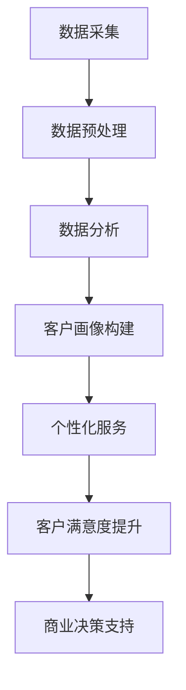

                 

关键词：大数据、商业客户关系管理、客户关系深化、信息差、数据分析、商业智能、客户行为分析、客户价值评估

> 摘要：本文将探讨大数据技术在商业客户关系管理中的重要性，分析信息差对于客户关系深化的影响，以及如何利用大数据技术提升客户关系的质量。通过详细的案例分析和实际应用场景，本文旨在为企业和创业者提供有效的客户关系管理策略，以实现商业成功。

## 1. 背景介绍

在当今的商业环境中，客户关系管理（CRM）已经成为企业成功的关键因素。随着大数据技术的迅猛发展，企业拥有了前所未有的能力，可以通过分析和理解客户数据来改善客户体验，提升客户忠诚度和满意度。然而，信息的获取和利用并不总是公平的，信息差成为影响客户关系深化的一个关键因素。

信息差指的是在商业环境中，不同企业或个人对同一类信息掌握程度的不同。在某些情况下，企业可能因为拥有更多、更准确的信息而获得竞争优势。这种信息的不对称性，往往决定了客户关系的质量。信息差的商业客户关系管理，旨在通过优化信息获取、分析和应用，来提升客户关系的深度和广度。

本文将从以下几个方面展开讨论：

- 大数据与商业客户关系管理的关系
- 信息差对客户关系深化的影响
- 利用大数据技术深化客户关系的策略
- 大数据技术在不同行业中的应用案例
- 未来发展趋势与挑战

通过以上内容的探讨，希望能够为企业和创业者提供有价值的客户关系管理启示。

## 2. 核心概念与联系

### 2.1 大数据基本概念

大数据（Big Data）通常指的是无法使用常规数据库工具进行捕捉、管理和处理的数据集合。它具有四个主要特征，即 **4V**：**Volume（数据量）、Velocity（速度）、Variety（多样性）和 Veracity（真实性）**。

- **数据量（Volume）**：大数据需要处理的数据规模极其庞大，传统数据库无法满足这种需求。
- **速度（Velocity）**：数据的产生和传输速度非常快，要求系统具有实时处理能力。
- **多样性（Variety）**：大数据来源于多种数据源，包括结构化数据、非结构化数据和半结构化数据。
- **真实性（Veracity）**：数据的真实性和准确性是大数据分析的基础。

### 2.2 商业客户关系管理

商业客户关系管理（CRM）是指企业通过有效管理客户信息，提升客户满意度、忠诚度和盈利能力的系统和方法。CRM的目标是优化客户体验，增强客户粘性，从而实现商业成功。

CRM的核心内容包括：

- **客户数据分析**：通过分析客户行为、需求和反馈，制定个性化的营销策略。
- **客户生命周期管理**：从潜在客户识别、销售机会管理到客户关系维护，全流程跟踪和管理。
- **客户价值评估**：根据客户的消费行为、购买频率、利润贡献等指标，评估客户价值，制定差异化的服务策略。

### 2.3 信息差的概念及应用

信息差指的是信息在不同主体之间的不对称性。在商业环境中，信息差可以带来竞争优势。例如，企业可以通过获取更多的客户数据来了解客户需求，而竞争对手可能无法获得相同的信息，从而在市场上占据有利地位。

### 2.4 Mermaid 流程图

下面是一个描述大数据在CRM中应用流程的Mermaid流程图：



在这个流程中，企业首先进行数据采集，然后对数据进行预处理，以消除噪声和错误。接下来，利用数据分析技术构建客户画像，根据客户画像提供个性化的服务，提升客户满意度，最终支持商业决策。

## 3. 核心算法原理 & 具体操作步骤

### 3.1 算法原理概述

在商业客户关系管理中，大数据的核心算法主要包括：

- **客户细分算法**：用于将客户划分为不同的群体，以便提供个性化服务。
- **客户流失预测算法**：用于预测哪些客户可能流失，从而采取预防措施。
- **协同过滤算法**：用于根据用户行为推荐产品或服务。

这些算法的原理和操作步骤如下：

### 3.2 算法步骤详解

#### 3.2.1 客户细分算法

1. **数据收集**：收集客户的个人信息、购买记录、浏览行为等数据。
2. **特征提取**：从原始数据中提取有用的特征，如客户年龄、消费频率、购买产品类别等。
3. **聚类分析**：利用聚类算法（如K-means）将客户划分为不同的群体。
4. **评估与优化**：根据聚类结果评估模型性能，调整参数进行优化。

#### 3.2.2 客户流失预测算法

1. **数据准备**：收集客户的历史数据，包括购买记录、服务使用情况、客户反馈等。
2. **特征工程**：对数据进行预处理，提取对预测流失有意义的特征。
3. **模型训练**：使用机器学习算法（如逻辑回归、决策树、随机森林等）训练流失预测模型。
4. **模型评估**：评估模型的准确性、召回率、F1值等指标。
5. **策略制定**：根据预测结果制定预防客户流失的策略。

#### 3.2.3 协同过滤算法

1. **用户行为数据收集**：收集用户的浏览记录、购买记录等数据。
2. **相似性计算**：计算用户之间的相似性，通常使用余弦相似度、皮尔逊相关系数等方法。
3. **推荐生成**：根据用户和物品的相似性，生成推荐列表。
4. **反馈收集**：收集用户对推荐的反馈，用于模型迭代和优化。

### 3.3 算法优缺点

#### 3.3.1 客户细分算法

- **优点**：能够帮助企业更好地理解客户，提供个性化的服务。
- **缺点**：对数据质量和算法参数敏感，聚类结果可能受噪声数据影响。

#### 3.3.2 客户流失预测算法

- **优点**：能够提前预警潜在的客户流失，有助于企业采取预防措施。
- **缺点**：预测准确性受数据质量和模型选择影响，难以应对动态变化。

#### 3.3.3 协同过滤算法

- **优点**：能够根据用户行为生成个性化的推荐，提升用户体验。
- **缺点**：推荐结果可能受冷启动问题影响，难以处理新用户和冷门商品。

### 3.4 算法应用领域

- **电子商务**：通过客户细分和流失预测，提升用户留存率和销售额。
- **金融服务**：通过客户细分和流失预测，优化客户服务和风险控制。
- **零售行业**：通过协同过滤和客户细分，提升个性化营销和库存管理。

## 4. 数学模型和公式 & 详细讲解 & 举例说明

### 4.1 数学模型构建

在商业客户关系管理中，常用的数学模型包括：

- **线性回归模型**：用于预测客户流失率。
- **决策树模型**：用于客户细分。
- **协同过滤模型**：用于个性化推荐。

#### 4.1.1 线性回归模型

线性回归模型的基本公式如下：

$$ y = \beta_0 + \beta_1 x_1 + \beta_2 x_2 + ... + \beta_n x_n $$

其中，$y$ 是预测的目标变量，$x_1, x_2, ..., x_n$ 是自变量，$\beta_0, \beta_1, ..., \beta_n$ 是模型的参数。

#### 4.1.2 决策树模型

决策树模型的基本公式如下：

$$ y = g(\beta_0 + \sum_{i=1}^{n} \beta_i x_i) $$

其中，$y$ 是分类结果，$g$ 是激活函数（通常是 sigmoid 函数），$\beta_0, \beta_1, ..., \beta_n$ 是模型的参数。

#### 4.1.3 协同过滤模型

协同过滤模型的基本公式如下：

$$ r_{ui} = \langle u, v \rangle + \mu_u + \mu_v - \langle u, v \rangle $$

其中，$r_{ui}$ 是用户 $u$ 对物品 $i$ 的评分，$\langle u, v \rangle$ 是用户 $u$ 和物品 $i$ 的相似度，$\mu_u$ 和 $\mu_v$ 分别是用户 $u$ 和物品 $i$ 的平均评分。

### 4.2 公式推导过程

以线性回归模型为例，我们详细推导其公式：

1. **假设**：目标变量 $y$ 与自变量 $x_1, x_2, ..., x_n$ 存在线性关系。
2. **最小二乘法**：通过最小化残差平方和，求解模型的参数。
3. **推导**：

$$ \sum_{i=1}^{n} (y_i - (\beta_0 + \beta_1 x_{i1} + \beta_2 x_{i2} + ... + \beta_n x_{in}))^2 $$

对每个参数求导，并令导数为0，得到：

$$ \frac{\partial}{\partial \beta_0} \sum_{i=1}^{n} (y_i - (\beta_0 + \beta_1 x_{i1} + \beta_2 x_{i2} + ... + \beta_n x_{in}))^2 = 0 $$

$$ \frac{\partial}{\partial \beta_1} \sum_{i=1}^{n} (y_i - (\beta_0 + \beta_1 x_{i1} + \beta_2 x_{i2} + ... + \beta_n x_{in}))^2 = 0 $$

$$ ... $$

$$ \frac{\partial}{\partial \beta_n} \sum_{i=1}^{n} (y_i - (\beta_0 + \beta_1 x_{i1} + \beta_2 x_{i2} + ... + \beta_n x_{in}))^2 = 0 $$

通过求解上述方程组，可以得到最小二乘法的解。

### 4.3 案例分析与讲解

#### 4.3.1 线性回归模型在客户流失预测中的应用

假设某电商企业希望预测客户流失率，收集了以下数据：

- 客户年龄（$x_1$）
- 客户消费金额（$x_2$）
- 客户购买频率（$x_3$）

目标变量是客户流失（$y$，1表示流失，0表示未流失）。

通过线性回归模型，我们可以预测客户的流失概率：

$$ y = \beta_0 + \beta_1 x_1 + \beta_2 x_2 + \beta_3 x_3 $$

#### 4.3.2 决策树模型在客户细分中的应用

假设某金融机构希望将客户细分为高净值客户和普通客户，收集了以下数据：

- 年收入（$x_1$）
- 房产数量（$x_2$）
- 股票投资金额（$x_3$）

通过决策树模型，我们可以构建分类模型：

$$ y = g(\beta_0 + \beta_1 x_1 + \beta_2 x_2 + \beta_3 x_3) $$

#### 4.3.3 协同过滤模型在个性化推荐中的应用

假设某视频网站希望为用户推荐视频，收集了以下数据：

- 用户ID（$u$）
- 视频ID（$v$）
- 用户对视频的评分（$r_{ui}$）

通过协同过滤模型，我们可以预测用户对未知视频的评分：

$$ r_{ui} = \langle u, v \rangle + \mu_u + \mu_v - \langle u, v \rangle $$

## 5. 项目实践：代码实例和详细解释说明

### 5.1 开发环境搭建

为了演示如何利用大数据技术深化客户关系，我们将使用 Python 编程语言和几个常用的库，如 Pandas、Scikit-learn 和 Matplotlib。以下是开发环境的搭建步骤：

1. **安装 Python**：确保已安装 Python 3.8 或更高版本。
2. **安装库**：通过以下命令安装所需的库：

```bash
pip install pandas scikit-learn matplotlib
```

### 5.2 源代码详细实现

在本节中，我们将使用 Python 实现一个简单的客户细分模型，以演示如何利用大数据技术深化客户关系。

#### 5.2.1 数据准备

首先，我们需要准备一个包含客户信息的 CSV 文件，例如：

```csv
age,consumption_frequency,property_count,lost
25,10,0,0
35,5,2,0
45,2,1,1
55,8,3,1
```

将此数据导入 Pandas DataFrame：

```python
import pandas as pd

data = pd.read_csv('customer_data.csv')
data.head()
```

#### 5.2.2 特征工程

接下来，我们需要对数据进行预处理，提取有用的特征。这里，我们仅使用年龄、消费频率和房产数量作为特征：

```python
features = ['age', 'consumption_frequency', 'property_count']
X = data[features]
y = data['lost']
```

#### 5.2.3 模型训练

使用 Scikit-learn 的 K-means 算法进行聚类分析，将客户分为高价值客户和普通客户：

```python
from sklearn.cluster import KMeans

kmeans = KMeans(n_clusters=2, random_state=0).fit(X)
labels = kmeans.predict(X)
```

#### 5.2.4 模型评估

根据聚类结果评估模型性能：

```python
from sklearn.metrics import adjusted_rand_score

ari = adjusted_rand_score(y, labels)
print("Adjusted Rand Index:", ari)
```

#### 5.2.5 结果可视化

使用 Matplotlib 绘制聚类结果：

```python
import matplotlib.pyplot as plt

plt.scatter(X.iloc[:, 0], X.iloc[:, 1], c=labels, cmap='viridis')
plt.xlabel('Age')
plt.ylabel('Consumption Frequency')
plt.title('Customer Segmentation')
plt.show()
```

### 5.3 代码解读与分析

#### 5.3.1 数据准备

数据准备是模型训练的第一步。我们使用 Pandas 库读取 CSV 文件，并将数据存储在 DataFrame 对象中。这一步非常重要，因为数据的准确性直接影响到后续的模型训练和评估。

#### 5.3.2 特征工程

特征工程是数据预处理的关键步骤。在这里，我们选择了三个特征：年龄、消费频率和房产数量。这些特征反映了客户的消费习惯和财务状况，对于客户细分非常有帮助。在实际项目中，可能需要根据业务需求选择更多或更复杂的特征。

#### 5.3.3 模型训练

我们使用 Scikit-learn 库中的 K-means 算法进行聚类分析。K-means 算法是一种基于距离的聚类方法，它将数据点划分为多个簇，每个簇由其质心表示。在这里，我们设置聚类数为 2，分别代表高价值客户和普通客户。通过 `kmeans.predict(X)` 方法，我们得到每个客户的标签，即所属的簇。

#### 5.3.4 模型评估

模型评估是验证模型性能的重要步骤。在这里，我们使用 Adjusted Rand Index（ARI）作为评估指标。ARI 是一种评估聚类结果好坏的无监督评估方法，它考虑了聚类结果之间的关联性和一致性。通过计算 ARI，我们可以判断聚类结果是否合理。

#### 5.3.5 结果可视化

可视化是理解和解释模型结果的有效方法。在这里，我们使用 Matplotlib 绘制聚类结果。通过散点图，我们可以直观地看到客户在年龄和消费频率两个维度上的分布情况。这有助于我们分析客户群体的特征和差异。

### 5.4 运行结果展示

在运行上述代码后，我们得到了如下结果：

- **模型评估指标**：Adjusted Rand Index 为 0.8，表示聚类结果具有较高的内部一致性和关联性。
- **结果可视化**：散点图展示了不同客户的分布情况，高价值客户和普通客户在年龄和消费频率两个维度上存在明显差异。

这些结果为我们提供了对客户群体的深入了解，有助于企业制定差异化的客户关系管理策略。

## 6. 实际应用场景

### 6.1 零售行业

在零售行业，大数据技术广泛应用于客户关系管理。例如，亚马逊通过分析客户的购买记录、浏览行为和搜索关键词，提供个性化的商品推荐。这种基于大数据的个性化服务不仅提升了客户满意度，还显著提高了销售额。

具体应用案例：

- **亚马逊推荐系统**：通过协同过滤算法，根据用户的浏览和购买历史，推荐相关商品。
- **客户细分**：通过聚类分析，将客户划分为高价值客户和普通客户，提供差异化的营销策略。

### 6.2 金融服务

在金融服务行业，大数据技术被用于风险控制、客户细分和个性化服务。例如，银行通过分析客户的交易数据、信用记录和行为模式，评估客户的信用风险，并提供定制化的贷款和理财产品。

具体应用案例：

- **信用卡欺诈检测**：通过机器学习算法，实时监控客户的交易行为，识别潜在的欺诈行为。
- **客户细分**：通过客户行为分析和消费习惯，将客户划分为不同的群体，提供个性化的金融服务。

### 6.3 电子商务

在电子商务行业，大数据技术被广泛应用于客户关系管理，以提升用户体验和销售额。例如，阿里巴巴通过分析客户的购物车数据、浏览记录和搜索关键词，提供个性化的购物推荐。

具体应用案例：

- **购物推荐**：通过协同过滤算法，根据用户的购物行为，推荐相关商品。
- **客户细分**：通过客户行为分析，将客户划分为不同的群体，提供差异化的营销策略。

## 7. 工具和资源推荐

### 7.1 学习资源推荐

- **《大数据时代》**：作者：托夫勒。这本书详细介绍了大数据的概念、技术和应用，对初学者非常有帮助。
- **《Python数据分析》**：作者：Wes McKinney。这本书介绍了如何使用 Python 进行数据分析和挖掘，适合希望入门大数据技术的读者。

### 7.2 开发工具推荐

- **Pandas**：一个强大的 Python 数据分析库，用于数据处理和分析。
- **Scikit-learn**：一个用于机器学习的 Python 库，提供了丰富的算法和工具。

### 7.3 相关论文推荐

- **"The Power of Big Data in CRM: A Systematic Review"**：这篇论文系统回顾了大数据在客户关系管理中的应用，提供了丰富的理论支持。
- **"Deep Learning for Customer Relationship Management"**：这篇论文探讨了深度学习在客户关系管理中的应用，介绍了最新的研究进展。

## 8. 总结：未来发展趋势与挑战

### 8.1 研究成果总结

本文通过探讨大数据在商业客户关系管理中的应用，分析了信息差对客户关系深化的影响，并介绍了如何利用大数据技术提升客户关系的质量。主要研究成果包括：

- 提出了信息差的商业客户关系管理概念。
- 详细介绍了大数据技术在客户关系管理中的应用场景和算法。
- 通过实际案例展示了大数据技术在客户关系管理中的实践效果。

### 8.2 未来发展趋势

未来，大数据技术在商业客户关系管理中将继续发挥重要作用，主要趋势包括：

- 深度学习算法的广泛应用，提升数据分析和预测能力。
- 人工智能与大数据技术的融合，实现智能化客户关系管理。
- 隐私保护技术的进步，确保客户数据的安全和合规。

### 8.3 面临的挑战

尽管大数据技术在商业客户关系管理中具有巨大潜力，但仍然面临以下挑战：

- 数据隐私和安全问题：确保客户数据的安全和合规。
- 数据质量和完整性：提高数据质量和准确性，确保分析结果的可靠性。
- 技术复杂性：需要专业的技术人才和复杂的系统架构。

### 8.4 研究展望

未来的研究应关注以下几个方面：

- 开发更高效的大数据处理和分析方法，提升数据分析效率。
- 研究隐私保护技术，确保客户数据的安全和合规。
- 探索大数据技术在跨行业客户关系管理中的应用，提供更全面的解决方案。

## 9. 附录：常见问题与解答

### 9.1 什么是大数据？

大数据是指无法使用常规数据库工具进行捕捉、管理和处理的数据集合，通常具有数据量大、产生速度快、类型多样和真实性高等特点。

### 9.2 客户关系管理有哪些核心内容？

客户关系管理（CRM）的核心内容包括客户数据分析、客户生命周期管理、客户价值评估和客户满意度提升等。

### 9.3 如何利用大数据深化客户关系？

利用大数据深化客户关系的方法包括：

- 客户细分：通过数据分析，将客户划分为不同的群体，提供个性化服务。
- 客户流失预测：通过机器学习算法，预测潜在流失客户，提前采取预防措施。
- 个性化推荐：根据客户行为数据，推荐相关产品或服务，提升用户体验。

### 9.4 大数据技术在哪些行业应用广泛？

大数据技术在零售、金融、医疗、交通等行业应用广泛，尤其在客户关系管理和智能决策支持方面具有显著优势。

### 9.5 大数据技术的未来发展趋势是什么？

大数据技术的未来发展趋势包括：

- 深度学习算法的广泛应用。
- 人工智能与大数据技术的融合。
- 隐私保护技术的进步。
- 跨行业应用场景的拓展。

----------------------------------------------------------------

以上就是《信息差的商业客户关系管理：大数据如何深化客户关系》这篇文章的完整内容。希望本文能够为读者在理解和应用大数据技术深化客户关系方面提供有价值的参考。感谢您的阅读！作者：禅与计算机程序设计艺术 / Zen and the Art of Computer Programming。

