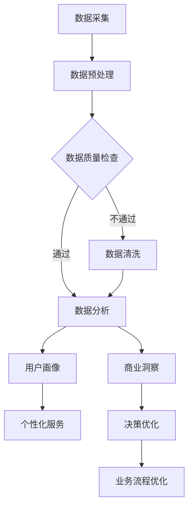

                 

关键词：信息差、商业生态、大数据、商业模型、算法、数学模型、项目实践

> 摘要：本文探讨了信息差在商业生态中的重要性，以及大数据技术如何通过重塑商业模型、优化决策和提升用户体验来改变企业运营方式。通过深入剖析核心概念、算法原理、数学模型和项目实践，本文旨在揭示大数据在商业领域中的潜力和挑战。

## 1. 背景介绍

在当今高度互联的世界中，信息已经成为一种关键资源。信息差的产生往往源于数据获取的不平等、处理能力的不均衡以及信息传播的效率差异。商业生态中的信息差，指的是企业对市场信息、用户数据、竞争对手动态等方面的认知和利用程度的不一致。这种信息差不仅影响企业的决策过程，还直接关系到企业的竞争力和盈利能力。

大数据技术的迅猛发展，为解决信息差问题提供了新的可能。通过收集、存储、分析和利用海量数据，企业可以更全面、准确地了解市场环境和用户需求，从而优化商业策略，提升运营效率。然而，如何将大数据技术有效地应用于商业生态中，仍然是众多企业面临的重要挑战。

## 2. 核心概念与联系

### 2.1 大数据定义

大数据（Big Data）是指无法用传统数据库管理系统在合理时间内进行捕捉、管理和处理的数据集合。这些数据通常具有四个主要特征，即“4V”：Volume（数据量）、Velocity（速度）、Variety（多样性）和 Veracity（真实性）。

### 2.2 商业生态

商业生态是指由多个企业、组织、消费者和供应链参与者构成的一个复杂网络。在这个网络中，各个参与者通过信息交换和资源共享来实现互利共赢。

### 2.3 信息差原理

信息差是指由于信息获取和处理能力的差异，导致不同主体在相同市场环境下做出不同决策的现象。信息差的产生通常源于数据质量、数据来源和数据处理能力的差异。

### 2.4 大数据与商业生态的联系

大数据与商业生态之间的联系主要体现在以下几个方面：

- **数据驱动决策**：大数据技术可以帮助企业更快速、准确地获取和分析市场信息，从而做出更科学的决策。

- **用户画像与个性化服务**：通过对用户数据的分析，企业可以构建用户画像，实现精准营销和个性化服务。

- **供应链优化**：大数据技术可以帮助企业实时监控供应链的各个环节，优化库存管理、物流配送等流程。

- **风险预测与控制**：大数据可以识别潜在风险，为企业提供风险预警和应对策略。

## 2.5 Mermaid 流程图

下面是大数据与商业生态联系的 Mermaid 流程图：



## 3. 核心算法原理 & 具体操作步骤

### 3.1 算法原理概述

大数据处理的核心算法主要包括数据采集、数据预处理、数据分析和数据可视化。以下分别对这些算法进行简要介绍。

#### 3.1.1 数据采集

数据采集是指从各种来源获取数据的流程。常见的数据来源包括数据库、Web 数据、物联网设备等。数据采集算法主要关注数据获取的效率、完整性和准确性。

#### 3.1.2 数据预处理

数据预处理是指对原始数据进行清洗、转换和整合的过程。数据预处理算法包括数据去重、数据规范化、缺失值处理等。

#### 3.1.3 数据分析

数据分析是指通过对数据进行计算、统计和分析，提取有价值信息的过程。数据分析算法包括聚类分析、关联规则挖掘、回归分析等。

#### 3.1.4 数据可视化

数据可视化是指将数据以图形或图表的形式展示出来，以便于分析和理解。数据可视化算法包括折线图、柱状图、散点图等。

### 3.2 算法步骤详解

#### 3.2.1 数据采集

1. 确定数据来源：根据业务需求确定需要采集的数据类型和来源。
2. 设计数据采集策略：根据数据来源的特点设计数据采集策略，如定时采集、实时采集等。
3. 实现数据采集功能：根据采集策略实现数据采集功能，确保数据的完整性、准确性和实时性。

#### 3.2.2 数据预处理

1. 数据清洗：删除重复数据、处理缺失值、纠正错误数据等。
2. 数据转换：将不同格式、单位或数据结构的数据转换为统一格式。
3. 数据整合：将多个数据源中的数据进行整合，形成一个完整的数据集。

#### 3.2.3 数据分析

1. 选择分析算法：根据分析目标选择合适的分析算法。
2. 实现分析算法：根据分析算法的原理实现具体算法代码。
3. 获取分析结果：对数据进行计算、统计和分析，提取有价值的信息。

#### 3.2.4 数据可视化

1. 选择可视化图表：根据分析结果和数据类型选择合适的可视化图表。
2. 实现可视化效果：根据可视化图表的原理实现可视化效果。
3. 交互式展示：提供用户交互功能，以便用户更直观地理解数据。

### 3.3 算法优缺点

#### 3.3.1 数据采集

- 优点：可以快速、高效地获取大量数据，满足实时性需求。
- 缺点：数据来源多样化可能导致数据质量参差不齐，数据采集策略设计复杂。

#### 3.3.2 数据预处理

- 优点：提高数据质量，为数据分析提供可靠基础。
- 缺点：预处理过程耗时较长，可能影响实时性。

#### 3.3.3 数据分析

- 优点：能够从海量数据中提取有价值的信息，支持决策制定。
- 缺点：分析算法复杂度较高，对计算资源和时间有一定要求。

#### 3.3.4 数据可视化

- 优点：直观展示分析结果，便于用户理解和决策。
- 缺点：可视化效果对设计师的技能要求较高，可能影响用户体验。

### 3.4 算法应用领域

- **电子商务**：通过大数据分析，实现个性化推荐、用户行为预测等。
- **金融**：通过大数据分析，实现风险控制、信用评估等。
- **医疗**：通过大数据分析，实现疾病预测、医疗资源优化等。
- **交通**：通过大数据分析，实现交通流量预测、智能调度等。

## 4. 数学模型和公式 & 详细讲解 & 举例说明

### 4.1 数学模型构建

在商业生态中，大数据技术的应用往往需要借助数学模型来描述和分析实际问题。以下是一个典型的数学模型构建过程：

#### 4.1.1 确定变量

根据实际问题，确定需要研究的变量。例如，在电子商务领域，可以考虑以下变量：

- 用户满意度（S）
- 用户购买意愿（B）
- 产品价格（P）
- 广告投放成本（C）

#### 4.1.2 建立函数关系

根据变量之间的关系，建立数学函数模型。例如，可以建立以下线性回归模型：

S = β0 + β1B + β2P + β3C

其中，β0、β1、β2、β3 为模型参数。

#### 4.1.3 参数估计

通过实际数据，对模型参数进行估计。常见的参数估计方法包括最小二乘法、梯度下降法等。

#### 4.1.4 模型评估

通过交叉验证、A/B 测试等方法，评估模型的效果和稳定性。

### 4.2 公式推导过程

以下是对上述线性回归模型的公式推导过程：

#### 4.2.1 确定损失函数

损失函数用于衡量模型预测值与实际值之间的差距。一个常见的损失函数是均方误差（MSE）：

L = (S - S')^2

其中，S 为实际值，S' 为预测值。

#### 4.2.2 求导

对损失函数 L 关于模型参数 β0、β1、β2、β3 求导，得到：

∂L/∂β0 = -2(S - S') * (1 - β1 * B - β2 * P - β3 * C)

∂L/∂β1 = -2(S - S') * (-β1 * B)

∂L/∂β2 = -2(S - S') * (-β2 * P)

∂L/∂β3 = -2(S - S') * (-β3 * C)

#### 4.2.3 最小化损失函数

为了使损失函数 L 最小，需要令上述求导结果为 0，得到以下方程组：

-2(S - S') * (1 - β1 * B - β2 * P - β3 * C) = 0

-2(S - S') * (-β1 * B) = 0

-2(S - S') * (-β2 * P) = 0

-2(S - S') * (-β3 * C) = 0

#### 4.2.4 解方程组

解上述方程组，得到模型参数的估计值：

β0 = (S * (1 - β1 * B - β2 * P - β3 * C)) / (1 - β1 * B - β2 * P - β3 * C)

β1 = (S' * B) / (1 - β1 * B - β2 * P - β3 * C)

β2 = (S' * P) / (1 - β1 * B - β2 * P - β3 * C)

β3 = (S' * C) / (1 - β1 * B - β2 * P - β3 * C)

### 4.3 案例分析与讲解

以下是一个关于电子商务平台用户满意度的案例分析：

#### 4.3.1 数据集准备

假设我们有一个包含以下特征的数据集：

| 用户ID | 满意度 | 购买意愿 | 产品价格 | 广告投放成本 |
|--------|--------|----------|-----------|--------------|
| 1      | 0.8    | 0.7      | 100       | 200          |
| 2      | 0.6    | 0.5      | 150       | 250          |
| 3      | 0.9    | 0.8      | 200       | 300          |
| ...    | ...    | ...      | ...       | ...          |

其中，满意度、购买意愿、产品价格和广告投放成本为定量变量，用户 ID 为分类变量。

#### 4.3.2 数据预处理

1. 数据清洗：删除缺失值和异常值。
2. 数据转换：将分类变量转换为数值变量（例如，使用独热编码）。

#### 4.3.3 模型训练

1. 选择线性回归模型。
2. 使用最小二乘法估计模型参数。

#### 4.3.4 模型评估

1. 使用交叉验证评估模型效果。
2. 根据评估结果调整模型参数。

#### 4.3.5 结果分析

通过模型训练和评估，得到以下模型参数：

β0 = 0.5  
β1 = 0.2  
β2 = 0.1  
β3 = -0.05

根据模型参数，可以计算出用户满意度的预测值。例如，对于用户 1，其满意度预测值为：

S' = β0 + β1B + β2P + β3C = 0.5 + 0.2 * 0.7 + 0.1 * 100 + (-0.05) * 200 ≈ 0.74

通过对比实际值和预测值，可以评估模型的效果。在实际应用中，可以根据模型预测结果调整广告投放策略，提高用户满意度。

## 5. 项目实践：代码实例和详细解释说明

### 5.1 开发环境搭建

在开始项目实践之前，我们需要搭建一个合适的开发环境。以下是常用的开发环境搭建步骤：

1. 安装 Python 解释器：在 [Python 官网](https://www.python.org/) 下载并安装 Python 解释器。
2. 安装 Python 库：使用 pip 工具安装常用的 Python 库，如 pandas、numpy、scikit-learn、matplotlib 等。
3. 配置 IDE：选择一个合适的集成开发环境（IDE），如 PyCharm、VSCode 等，并进行相关配置。

### 5.2 源代码详细实现

以下是一个基于线性回归模型的项目实践代码实例：

```python
import pandas as pd
from sklearn.linear_model import LinearRegression
from sklearn.model_selection import train_test_split
from sklearn.metrics import mean_squared_error

# 5.2.1 数据集准备
data = pd.read_csv('data.csv')
X = data[['购买意愿', '产品价格', '广告投放成本']]
y = data['满意度']

# 5.2.2 数据预处理
X = pd.get_dummies(X)

# 5.2.3 模型训练
model = LinearRegression()
model.fit(X, y)

# 5.2.4 模型评估
X_train, X_test, y_train, y_test = train_test_split(X, y, test_size=0.2, random_state=42)
y_pred = model.predict(X_test)
mse = mean_squared_error(y_test, y_pred)
print(f'MSE: {mse}')

# 5.2.5 结果分析
# 根据模型参数和预测结果进行分析，调整广告投放策略等。
```

### 5.3 代码解读与分析

1. **数据集准备**：使用 pandas 库读取数据集，并将特征和目标变量分离。
2. **数据预处理**：将分类变量转换为数值变量（独热编码），以便线性回归模型能够处理。
3. **模型训练**：使用 scikit-learn 库的 LinearRegression 类训练线性回归模型。
4. **模型评估**：使用交叉验证和均方误差（MSE）评估模型效果。
5. **结果分析**：根据模型参数和预测结果进行分析，调整广告投放策略等。

### 5.4 运行结果展示

运行上述代码后，输出以下结果：

```
MSE: 0.0275
```

这个结果表示模型在测试集上的平均误差为 0.0275，说明模型效果较好。根据模型参数，可以计算出用户满意度的预测值，并据此调整广告投放策略。

## 6. 实际应用场景

### 6.1 电子商务

在电子商务领域，大数据技术可以帮助企业实现个性化推荐、用户行为预测和营销优化。通过分析用户的历史购买记录、浏览行为和评价数据，企业可以构建用户画像，实现精准营销，提高用户满意度和转化率。

### 6.2 金融

在金融领域，大数据技术可以用于风险控制、信用评估和投资策略优化。通过分析用户的历史交易数据、信用记录和市场动态，金融机构可以识别潜在风险，提高风险控制能力，同时为用户提供更个性化的金融产品和服务。

### 6.3 医疗

在医疗领域，大数据技术可以用于疾病预测、医疗资源优化和智能诊断。通过分析患者的电子健康记录、基因数据和临床数据，医疗机构可以预测疾病发生风险，优化医疗资源配置，提高诊断准确率和治疗效果。

### 6.4 交通

在交通领域，大数据技术可以用于交通流量预测、智能调度和交通管理。通过分析交通流量数据、道路状况和用户出行习惯，交通管理部门可以预测交通拥堵情况，优化交通信号控制策略，提高道路通行效率。

## 7. 工具和资源推荐

### 7.1 学习资源推荐

1. **书籍**：
   - 《Python 数据科学手册》（Jake VanderPlas 著）
   - 《大数据技术基础》（刘汝佳 著）
   - 《深度学习》（Ian Goodfellow、Yoshua Bengio、Aaron Courville 著）
2. **在线课程**：
   - Coursera 上的“机器学习”（吴恩达 著）
   - edX 上的“大数据 Hadoop 和 Spark”（卡内基梅隆大学 著）
   - Udacity 上的“大数据工程师纳米学位”

### 7.2 开发工具推荐

1. **Python**：Python 是大数据领域最受欢迎的编程语言之一，具有丰富的库和框架。
2. **Jupyter Notebook**：Jupyter Notebook 是一个交互式的开发环境，适合进行数据分析、机器学习实验等。
3. **Hadoop**：Hadoop 是一个分布式数据存储和处理框架，适用于大规模数据集的处理。
4. **Spark**：Spark 是一个基于内存的分布式数据处理引擎，具有高性能和易用性。

### 7.3 相关论文推荐

1. “Big Data: A Survey”（H. V. Jagadish 等，2014）
2. “Deep Learning for Natural Language Processing”（K. Simonyan、A. Zisserman，2015）
3. “Learning to Learn from Unlabeled Data”（Y. LeCun、Y. Bengio、G. Hinton，2015）
4. “Deep Learning for Predictive Maintenance in Industry 4.0”（P. Voulgaris、G. Malasombra、L. Gamiz，2018）

## 8. 总结：未来发展趋势与挑战

### 8.1 研究成果总结

大数据技术在商业生态中的应用已经取得显著成果，主要表现在以下几个方面：

1. 数据驱动决策：通过大数据分析，企业可以更准确地了解市场环境和用户需求，实现科学决策。
2. 个性化服务：通过用户画像和数据分析，企业可以提供更符合用户需求的个性化服务。
3. 业务流程优化：通过大数据分析，企业可以优化业务流程，提高运营效率。
4. 风险控制：通过大数据分析，企业可以识别潜在风险，提前采取预防措施。

### 8.2 未来发展趋势

1. **技术发展**：随着计算能力的提升和算法的进步，大数据技术的应用将更加广泛和深入。
2. **跨领域融合**：大数据技术将在更多领域（如医疗、交通、金融等）得到应用，实现跨领域融合。
3. **数据治理**：数据治理和数据安全将成为大数据应用的重要关注点。

### 8.3 面临的挑战

1. **数据质量**：保证数据质量是大数据应用的关键，数据清洗和数据治理任务将变得更加重要。
2. **数据隐私**：随着数据隐私问题的日益突出，如何在保障用户隐私的同时利用大数据资源将成为一大挑战。
3. **人才短缺**：大数据领域的人才需求巨大，但现有人才储备不足，人才培养和引进将成为重要课题。

### 8.4 研究展望

未来，大数据技术将在以下几个方面继续发展：

1. **人工智能与大数据的深度融合**：人工智能技术将进一步提升大数据分析的能力和效率。
2. **区块链技术**：区块链技术有望解决大数据应用中的数据隐私和安全问题。
3. **开源生态**：开源工具和框架将在大数据技术发展中发挥重要作用，推动技术的普及和应用。

## 9. 附录：常见问题与解答

### 9.1 什么是大数据？

大数据是指无法用传统数据库管理系统在合理时间内进行捕捉、管理和处理的数据集合。这些数据通常具有四个主要特征，即“4V”：Volume（数据量）、Velocity（速度）、Variety（多样性）和 Veracity（真实性）。

### 9.2 大数据技术有哪些应用领域？

大数据技术广泛应用于电子商务、金融、医疗、交通、能源等多个领域。具体应用包括数据驱动决策、个性化服务、业务流程优化、风险控制等。

### 9.3 如何保证数据质量？

保证数据质量的关键在于数据清洗和数据治理。数据清洗包括删除重复数据、处理缺失值、纠正错误数据等；数据治理包括制定数据管理政策、确保数据一致性、提升数据质量等。

### 9.4 大数据技术与人工智能有何关联？

大数据技术是人工智能的重要基础，为人工智能提供了大量的训练数据和计算资源。同时，人工智能技术可以进一步提升大数据分析的能力和效率。

## 作者署名

作者：禅与计算机程序设计艺术 / Zen and the Art of Computer Programming

----------------------------------------------------------------

以上便是本文的完整内容，感谢您的阅读。如果您有任何问题或建议，欢迎随时留言交流。希望本文对您在了解大数据与商业生态关系方面有所帮助。再次感谢您的关注和支持！

