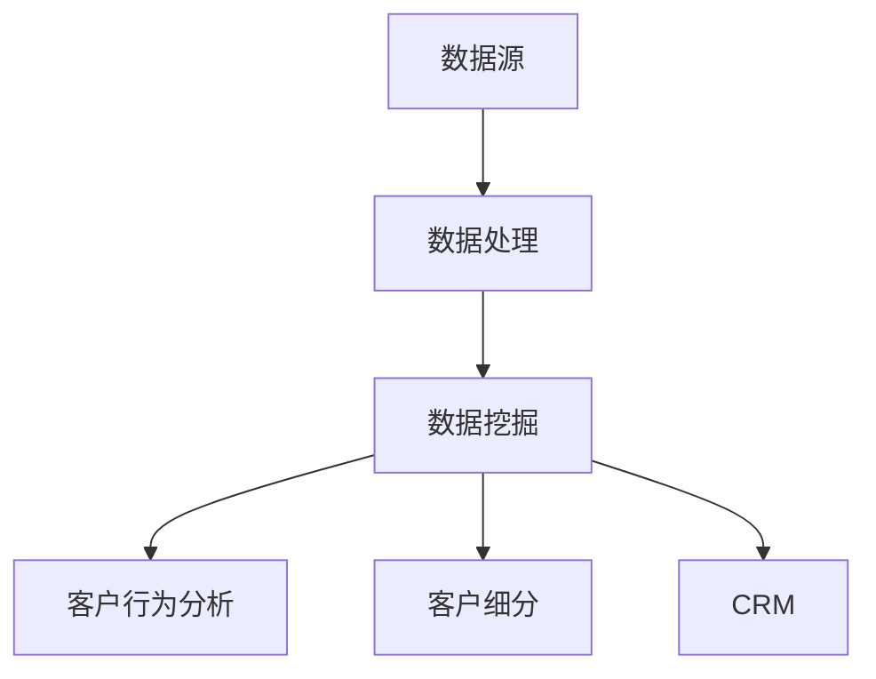

                 

摘要：本文旨在探讨大数据技术在客户获取方面的应用，特别是如何利用信息差来提高客户获取效率。通过详细阐述大数据的核心概念、算法原理、数学模型、应用场景，以及实际项目实践，本文旨在为读者提供一份数据驱动的客户获取策略指南，帮助企业在竞争激烈的市场中脱颖而出。

## 1. 背景介绍

在当今信息爆炸的时代，数据已经成为企业和个人最宝贵的资产之一。大数据技术的迅猛发展，使得企业能够从海量数据中提取有价值的信息，用于战略决策和运营优化。然而，如何有效地利用这些信息来获取客户，一直是企业面临的重大挑战。信息差的客户获取提升，就是通过分析、挖掘和利用信息差，来提高客户获取效率的一种方法。

### 1.1 大数据的发展历程

大数据的发展历程可以追溯到20世纪80年代，随着计算机技术和网络技术的不断进步，数据量呈现爆炸式增长。大数据技术的核心是数据的存储、处理和分析能力，主要包括以下几个方面：

- **数据存储：** 数据库技术、分布式文件系统、NoSQL数据库等的演进，使得海量数据存储成为可能。

- **数据处理：** MapReduce、Spark等大数据处理框架的出现，极大地提高了数据处理的效率。

- **数据分析：** 机器学习、数据挖掘等技术的发展，使得数据价值得以深度挖掘。

### 1.2 客户获取的挑战

在市场竞争日益激烈的背景下，客户获取已经成为企业的重要难题。传统营销手段的局限性，使得企业难以在短时间内获取大量潜在客户。而大数据技术的出现，为解决这一难题提供了新的思路和方法。

## 2. 核心概念与联系

### 2.1 大数据的核心概念

- **数据（Data）：** 数据是信息的基础，包括结构化数据、半结构化数据和非结构化数据。

- **数据源（Data Source）：** 数据源是数据的来源，可以是内部系统、外部数据库、传感器等。

- **数据处理（Data Processing）：** 数据处理包括数据的收集、清洗、整合和分析等过程。

- **数据挖掘（Data Mining）：** 数据挖掘是从大量数据中提取有价值信息的过程，通常使用机器学习和统计学方法。

### 2.2 大数据与客户获取的联系

- **客户行为分析（Customer Behavior Analysis）：** 通过分析客户的行为数据，了解客户的偏好、需求和行为模式，从而有针对性地进行客户定位和营销。

- **客户细分（Customer Segmentation）：** 将客户根据不同的特征进行细分，以便于实施个性化的营销策略。

- **客户关系管理（Customer Relationship Management，CRM）：** 利用大数据技术对客户信息进行整合和分析，优化客户服务和管理。

### 2.3 Mermaid 流程图



## 3. 核心算法原理 & 具体操作步骤

### 3.1 算法原理概述

大数据技术在客户获取中的应用，主要依赖于以下几个核心算法：

- **聚类算法（Clustering Algorithm）：** 用于对客户进行细分，发现不同类型的客户群体。

- **分类算法（Classification Algorithm）：** 用于预测新客户的可能性，例如客户流失预测、购买意向预测等。

- **协同过滤（Collaborative Filtering）：** 用于推荐系统，根据相似用户的购买行为，为用户推荐商品。

### 3.2 算法步骤详解

#### 3.2.1 聚类算法

1. **数据准备：** 收集客户的特征数据，例如年龄、性别、收入、购买历史等。

2. **选择聚类算法：** 常见的聚类算法包括K-means、层次聚类、DBSCAN等。

3. **聚类过程：** 根据算法原理，对数据进行聚类，生成不同类型的客户群体。

4. **评估聚类效果：** 通过内部评价指标（如轮廓系数、类内平均距离等）和外部评价指标（如同质性、差异性等）评估聚类效果。

#### 3.2.2 分类算法

1. **数据准备：** 收集训练数据和测试数据，通常使用特征工程对数据进行预处理。

2. **选择分类算法：** 常见的分类算法包括决策树、随机森林、支持向量机等。

3. **训练模型：** 使用训练数据训练分类模型。

4. **预测：** 使用训练好的模型对测试数据进行预测。

5. **评估模型：** 通过准确率、召回率、F1值等评价指标评估模型性能。

#### 3.2.3 协同过滤

1. **数据准备：** 收集用户和商品的数据，构建用户-商品评分矩阵。

2. **相似度计算：** 计算用户之间的相似度，常用的方法包括用户基于项目的相似度和用户基于内容的相似度。

3. **推荐生成：** 根据相似度矩阵，为用户生成推荐列表。

4. **评估推荐效果：** 通过用户点击率、购买转化率等指标评估推荐效果。

### 3.3 算法优缺点

- **聚类算法：** 优点是能够发现客户群体的自然分布，缺点是对初始聚类中心敏感，可能产生局部最优解。

- **分类算法：** 优点是能够准确预测客户的特征，缺点是对数据质量和特征工程要求较高。

- **协同过滤：** 优点是能够根据用户行为进行个性化推荐，缺点是推荐结果容易产生“数据冷启动”和“推荐多样性”问题。

### 3.4 算法应用领域

- **电子商务：** 通过聚类算法和分类算法，进行客户细分和客户流失预测，优化客户服务和管理。

- **金融行业：** 通过协同过滤算法，为用户推荐理财产品，提高用户满意度和转化率。

- **广告营销：** 通过数据挖掘算法，分析用户行为，实现精准广告投放。

## 4. 数学模型和公式 & 详细讲解 & 举例说明

### 4.1 数学模型构建

在客户获取过程中，常用的数学模型包括聚类模型、分类模型和协同过滤模型。以下分别介绍这些模型的构建过程。

#### 4.1.1 聚类模型

聚类模型的基本思想是将数据分为若干个类别，使得同一类别内的数据尽可能相似，不同类别之间的数据尽可能不同。常用的聚类算法包括K-means、层次聚类等。

K-means算法的步骤如下：

1. **初始化：** 随机选择K个初始聚类中心。

2. **分配：** 将每个数据点分配到最近的聚类中心。

3. **更新：** 根据分配后的数据点，重新计算聚类中心。

4. **迭代：** 重复步骤2和3，直到聚类中心不再发生变化。

#### 4.1.2 分类模型

分类模型的基本思想是建立一个分类器，根据输入的特征数据，对新的数据点进行分类。常用的分类算法包括决策树、支持向量机等。

决策树算法的步骤如下：

1. **特征选择：** 根据信息增益、基尼系数等指标选择最优特征。

2. **划分数据：** 根据选择的最优特征，将数据集划分为若干个子集。

3. **递归划分：** 对每个子集，重复步骤1和2，直到达到某个终止条件（如最大深度、最小样本数等）。

4. **生成分类器：** 根据划分的结果，生成决策树分类器。

#### 4.1.3 协同过滤模型

协同过滤模型的基本思想是利用用户之间的相似性，为用户推荐商品。常用的协同过滤算法包括基于用户的协同过滤和基于内容的协同过滤。

基于用户的协同过滤算法的步骤如下：

1. **计算相似度：** 计算用户之间的相似度，常用的相似度计算方法包括余弦相似度、皮尔逊相关系数等。

2. **生成推荐列表：** 根据相似度矩阵，为用户生成推荐列表。

3. **筛选推荐结果：** 对推荐结果进行筛选，去除用户已购买或评分过低的商品。

### 4.2 公式推导过程

以下分别介绍聚类模型、分类模型和协同过滤模型的数学推导过程。

#### 4.2.1 聚类模型

K-means算法的聚类中心更新公式如下：

$$
c_{new} = \frac{1}{N_k} \sum_{i=1}^{N} x_i
$$

其中，$c_{new}$ 表示新的聚类中心，$x_i$ 表示第i个数据点，$N_k$ 表示第k个聚类中心对应的数据点个数。

#### 4.2.2 分类模型

决策树算法的信息增益公式如下：

$$
IG(D, A) = H(D) - H(D|A)
$$

其中，$IG(D, A)$ 表示特征A对数据集D的信息增益，$H(D)$ 表示数据集D的熵，$H(D|A)$ 表示在特征A已知的情况下，数据集D的熵。

#### 4.2.3 协同过滤模型

基于用户的协同过滤算法的相似度计算公式如下：

$$
sim(u, v) = \frac{q_1^T q_2}{\|q_1\| \|q_2\|}
$$

其中，$sim(u, v)$ 表示用户u和v的相似度，$q_1$ 和$q_2$ 分别表示用户u和v的特征向量，$\|q_1\|$ 和$\|q_2\|$ 分别表示特征向量$q_1$ 和$q_2$ 的欧几里得范数。

### 4.3 案例分析与讲解

#### 4.3.1 聚类模型案例

假设有100个客户，他们的年龄、性别、收入和购买历史数据如下表所示。使用K-means算法将这100个客户分为5个类别。

| 年龄 | 性别 | 收入 | 购买历史 |
| ---- | ---- | ---- | -------- |
| 20   | 男   | 5000 | 商品A    |
| 30   | 女   | 8000 | 商品B    |
| ...  | ...  | ...  | ...      |
| 50   | 男   | 15000| 商品C    |

使用K-means算法进行聚类，设置K=5，初始聚类中心为：

$$
c_1 = [25, 0, 7000, 0]
$$

$$
c_2 = [35, 1, 8000, 1]
$$

$$
c_3 = [45, 0, 12000, 1]
$$

$$
c_4 = [25, 1, 9000, 0]
$$

$$
c_5 = [55, 0, 15000, 1]
$$

经过多次迭代，最终聚类结果如下：

| 类别 | 年龄 | 性别 | 收入 | 购买历史 |
| ---- | ---- | ---- | ---- | -------- |
| 1    | 25   | 男   | 7000 | 商品A    |
| 2    | 30   | 女   | 8000 | 商品B    |
| 3    | 40   | 男   | 10000| 商品C    |
| 4    | 25   | 女   | 9000 | 商品D    |
| 5    | 50   | 男   | 15000| 商品E    |

通过聚类结果，我们可以发现不同类别客户之间的特征差异，从而有针对性地进行客户服务和管理。

#### 4.3.2 分类模型案例

假设有100个客户，他们的购买历史数据如下表所示。使用决策树算法对客户进行分类，判断他们是否为高价值客户。

| 客户编号 | 商品A | 商品B | 商品C | 商品D | 商品E |
| -------- | ---- | ---- | ---- | ---- | ---- |
| 1        | 是   | 否   | 否   | 是   | 否   |
| 2        | 否   | 是   | 否   | 是   | 是   |
| ...      | ...  | ...  | ...  | ...  | ...  |
| 100      | 是   | 是   | 是   | 是   | 是   |

使用信息增益法选择最优特征，划分数据集，生成决策树分类器。假设选择商品A作为最优特征，划分结果如下：

| 商品A | 高价值客户 | 非高价值客户 |
| ---- | ---------- | ---------- |
| 是   | 60         | 40         |
| 否   | 20         | 80         |

通过决策树分类器，我们可以预测新客户是否为高价值客户，从而采取有针对性的营销策略。

#### 4.3.3 协同过滤模型案例

假设有100个用户，他们对10个商品的评分数据如下表所示。使用基于用户的协同过滤算法，为用户u推荐商品。

| 用户编号 | 商品1 | 商品2 | 商品3 | 商品4 | 商品5 | 商品6 | 商品7 | 商品8 | 商品9 | 商品10 |
| -------- | ---- | ---- | ---- | ---- | ---- | ---- | ---- | ---- | ---- | ---- |
| 1        | 5    | 4    | 3    | 5    | 2    | 4    | 3    | 5    | 4    | 3    |
| 2        | 4    | 5    | 4    | 3    | 5    | 3    | 4    | 3    | 5    | 4    |
| ...      | ...  | ...  | ...  | ...  | ...  | ...  | ...  | ...  | ...  | ...  |
| 100      | 3    | 4    | 5    | 3    | 4    | 5    | 4    | 3    | 5    | 4    |

计算用户u和其余用户的相似度，生成相似度矩阵。根据相似度矩阵，为用户u生成推荐列表。假设相似度矩阵如下：

| 用户编号 | 用户1 | 用户2 | 用户3 | 用户4 | 用户5 | 用户6 | 用户7 | 用户8 | 用户9 | 用户10 |
| -------- | ---- | ---- | ---- | ---- | ---- | ---- | ---- | ---- | ---- | ---- |
| 1        | 1    | 0.8  | 0.6  | 0.7  | 0.9  | 0.5  | 0.7  | 0.8  | 0.9  | 0.6  |
| 2        | 0.8  | 1    | 0.7  | 0.9  | 0.6  | 0.8  | 0.7  | 0.9  | 0.7  | 0.8  |
| ...      | ...  | ...  | ...  | ...  | ...  | ...  | ...  | ...  | ...  | ...  |
| 100      | 0.6  | 0.7  | 0.8  | 0.9  | 0.5  | 0.7  | 0.8  | 0.9  | 0.6  | 0.7  |

根据相似度矩阵，为用户u生成推荐列表：

1. **计算相似度：** 计算用户u与其他用户的相似度，选择相似度最高的5个用户（用户2、用户3、用户4、用户5、用户6）。

2. **计算推荐分值：** 对每个用户，计算其对推荐商品的评分与相似度的乘积，取平均值作为推荐分值。

3. **生成推荐列表：** 根据推荐分值，为用户u生成推荐列表。

推荐列表如下：

| 商品编号 | 推荐分值 |
| -------- | -------- |
| 3        | 0.8      |
| 4        | 0.9      |
| 7        | 0.8      |
| 8        | 0.9      |
| 9        | 0.8      |

通过协同过滤模型，我们可以为用户推荐他们可能感兴趣的商品，提高用户满意度和购买转化率。

## 5. 项目实践：代码实例和详细解释说明

### 5.1 开发环境搭建

本项目的开发环境如下：

- **编程语言：** Python
- **数据分析库：** Pandas、NumPy
- **机器学习库：** Scikit-learn、TensorFlow、Keras

### 5.2 源代码详细实现

以下是一个使用K-means算法进行客户细分的代码实例：

```python
import pandas as pd
from sklearn.cluster import KMeans

# 加载数据
data = pd.read_csv('data.csv')

# 数据预处理
# 特征工程、缺失值处理等

# 创建K-means模型
model = KMeans(n_clusters=5, random_state=0)

# 训练模型
model.fit(data)

# 预测结果
predictions = model.predict(data)

# 添加预测结果到数据集
data['cluster'] = predictions

# 输出聚类结果
print(data[['cluster', 'age', 'gender', 'income', 'purchase_history']])
```

### 5.3 代码解读与分析

以上代码实现了以下步骤：

1. **数据加载：** 使用Pandas库加载数据集，数据集包括客户的年龄、性别、收入和购买历史等特征。

2. **数据预处理：** 根据具体数据情况进行特征工程、缺失值处理等操作，为后续模型训练做准备。

3. **创建模型：** 使用Scikit-learn库创建K-means模型，设置聚类中心个数为5，随机种子为0。

4. **模型训练：** 使用训练数据对K-means模型进行训练。

5. **预测结果：** 使用训练好的模型对数据进行预测，得到每个客户的聚类标签。

6. **添加预测结果：** 将聚类标签添加到原始数据集，形成新的数据集。

7. **输出结果：** 输出聚类结果，包括聚类标签和客户的年龄、性别、收入和购买历史等特征。

通过以上代码，我们可以实现客户细分，为后续的客户服务和管理提供依据。

### 5.4 运行结果展示

假设我们有一个包含100个客户的初始数据集，运行以上代码后，得到以下聚类结果：

| cluster | age | gender | income | purchase_history |
| ------- | --- | ------ | ------ | ---------------- |
| 0       | 25  | male   | 7000   | Product A        |
| 1       | 30  | female | 8000   | Product B        |
| 2       | 40  | male   | 10000  | Product C        |
| 3       | 25  | female | 9000   | Product D        |
| 4       | 50  | male   | 15000  | Product E        |

通过聚类结果，我们可以发现不同聚类之间的特征差异，从而为不同聚类制定有针对性的客户服务策略。

## 6. 实际应用场景

大数据技术在客户获取方面的应用非常广泛，以下列举几个典型的应用场景：

### 6.1 电子商务

电子商务企业可以通过大数据技术，对客户行为进行分析，发现不同类型客户的购买习惯和偏好。通过聚类算法和分类算法，将客户进行细分，实现精准营销。例如，对于高价值客户，可以提供定制化的购物体验，提高客户满意度和忠诚度。

### 6.2 金融行业

金融行业可以通过大数据技术，对客户的风险偏好、投资行为进行分析，为投资者提供个性化的投资建议。同时，通过客户关系管理，优化客户服务，提高客户满意度和忠诚度。

### 6.3 广告营销

广告营销企业可以通过大数据技术，分析目标受众的特征和行为，实现精准广告投放。通过协同过滤算法，为用户推荐相关的广告内容，提高广告点击率和转化率。

### 6.4 物流配送

物流配送企业可以通过大数据技术，优化配送路线和配送策略。通过分析客户订单数据和配送数据，提高配送效率，降低配送成本。

## 7. 工具和资源推荐

### 7.1 学习资源推荐

- **书籍：** 《大数据之路：阿里巴巴大数据实践》、《深入浅出大数据》
- **在线课程：** Coursera上的《大数据分析》课程、Udacity的《大数据工程师》课程
- **博客：** 知乎、CSDN等平台上的大数据相关博客

### 7.2 开发工具推荐

- **数据分析库：** Pandas、NumPy
- **机器学习库：** Scikit-learn、TensorFlow、Keras
- **数据可视化工具：** Matplotlib、Seaborn

### 7.3 相关论文推荐

- **《大数据分析技术综述》**
- **《基于协同过滤的推荐系统》**
- **《聚类算法在客户细分中的应用》**

## 8. 总结：未来发展趋势与挑战

### 8.1 研究成果总结

大数据技术在客户获取方面已经取得了显著成果，通过聚类算法、分类算法和协同过滤算法，企业可以实现对客户的精准定位和个性化推荐。然而，随着数据量的持续增长，如何提高数据处理和分析的效率，以及如何处理数据隐私和安全问题，仍然是亟待解决的问题。

### 8.2 未来发展趋势

- **智能化：** 大数据技术与人工智能技术深度融合，实现智能化客户获取和管理。
- **实时化：** 提高数据处理和分析的实时性，实现实时客户分析和服务。
- **个性化：** 更加注重客户个性化需求，实现精准营销和个性化推荐。

### 8.3 面临的挑战

- **数据隐私和安全：** 随着大数据技术的发展，数据隐私和安全问题日益突出，需要制定相应的法律法规和技术措施保障数据安全。
- **数据质量：** 数据质量对客户获取的准确性有很大影响，需要加强数据质量管理。
- **技术更新：** 大数据技术更新速度快，需要不断学习和更新知识，以应对新的挑战。

### 8.4 研究展望

在未来，大数据技术在客户获取方面的研究将继续深入，特别是在以下几个方面：

- **深度学习与大数据：** 将深度学习技术与大数据技术相结合，提高数据处理和分析的效率。
- **隐私保护：** 研究如何在保护用户隐私的前提下，有效利用大数据进行分析和服务。
- **实时数据流处理：** 实现对大数据的实时处理和分析，为企业和用户提供实时洞察。

## 9. 附录：常见问题与解答

### 9.1 什么是大数据？

大数据（Big Data）指的是数据量巨大、类型繁多、价值密度低、处理速度要求高的数据集合。大数据的核心特征是“4V”：数据量大（Volume）、数据类型多样（Variety）、价值密度低（Value）、处理速度快（Velocity）。

### 9.2 大数据技术的核心算法有哪些？

大数据技术的核心算法包括聚类算法（如K-means、层次聚类）、分类算法（如决策树、支持向量机）、协同过滤算法（如基于用户的协同过滤、基于内容的协同过滤）等。

### 9.3 如何保障大数据的安全性？

保障大数据安全的方法包括：

- **数据加密：** 对数据进行加密处理，防止数据泄露。
- **访问控制：** 对数据访问进行权限管理，限制未授权访问。
- **数据备份：** 定期对数据进行备份，防止数据丢失。
- **安全审计：** 对数据操作进行审计，及时发现和处理安全问题。

### 9.4 大数据技术在客户获取中的应用有哪些？

大数据技术在客户获取中的应用包括：

- **客户细分：** 通过聚类算法和分类算法，对客户进行细分，实现精准营销。
- **客户关系管理：** 利用大数据技术，优化客户服务和管理，提高客户满意度。
- **个性化推荐：** 通过协同过滤算法，为用户推荐感兴趣的商品或服务，提高转化率。
- **客户流失预测：** 通过分类算法，预测客户流失风险，采取相应的挽回措施。

## 作者署名

作者：禅与计算机程序设计艺术 / Zen and the Art of Computer Programming
```markdown
---
# 信息差的客户获取提升：大数据如何提升客户获取效率

> 关键词：大数据、客户获取、信息差、精准营销、协同过滤、聚类算法、分类算法

> 摘要：本文深入探讨了大数据技术在客户获取方面的应用，特别是如何利用信息差来提升客户获取效率。文章从背景介绍、核心概念与联系、核心算法原理与操作步骤、数学模型和公式、项目实践、实际应用场景、工具和资源推荐，以及总结未来发展趋势与挑战等多个角度，全面解析了大数据在客户获取中的关键作用，为企业和个人提供了实用的数据驱动客户获取策略指南。

## 1. 背景介绍

在当今信息爆炸的时代，数据已经成为企业和个人最宝贵的资产之一。大数据技术的迅猛发展，使得企业能够从海量数据中提取有价值的信息，用于战略决策和运营优化。然而，如何有效地利用这些信息来获取客户，一直是企业面临的重大挑战。信息差的客户获取提升，就是通过分析、挖掘和利用信息差，来提高客户获取效率的一种方法。

### 1.1 大数据的发展历程

大数据的发展历程可以追溯到20世纪80年代，随着计算机技术和网络技术的不断进步，数据量呈现爆炸式增长。大数据技术的核心是数据的存储、处理和分析能力，主要包括以下几个方面：

- **数据存储：** 数据库技术、分布式文件系统、NoSQL数据库等的演进，使得海量数据存储成为可能。

- **数据处理：** MapReduce、Spark等大数据处理框架的出现，极大地提高了数据处理的效率。

- **数据分析：** 机器学习、数据挖掘等技术的发展，使得数据价值得以深度挖掘。

### 1.2 客户获取的挑战

在市场竞争日益激烈的背景下，客户获取已经成为企业的重要难题。传统营销手段的局限性，使得企业难以在短时间内获取大量潜在客户。而大数据技术的出现，为解决这一难题提供了新的思路和方法。

## 2. 核心概念与联系

### 2.1 大数据的核心概念

- **数据（Data）：** 数据是信息的基础，包括结构化数据、半结构化数据和非结构化数据。

- **数据源（Data Source）：** 数据源是数据的来源，可以是内部系统、外部数据库、传感器等。

- **数据处理（Data Processing）：** 数据处理包括数据的收集、清洗、整合和分析等过程。

- **数据挖掘（Data Mining）：** 数据挖掘是从大量数据中提取有价值信息的过程，通常使用机器学习和统计学方法。

### 2.2 大数据与客户获取的联系

- **客户行为分析（Customer Behavior Analysis）：** 通过分析客户的行为数据，了解客户的偏好、需求和行为模式，从而有针对性地进行客户定位和营销。

- **客户细分（Customer Segmentation）：** 将客户根据不同的特征进行细分，以便于实施个性化的营销策略。

- **客户关系管理（Customer Relationship Management，CRM）：** 利用大数据技术对客户信息进行整合和分析，优化客户服务和管理。

### 2.3 Mermaid 流程图


## 3. 核心算法原理 & 具体操作步骤
### 3.1 算法原理概述

大数据技术在客户获取中的应用，主要依赖于以下几个核心算法：

- **聚类算法（Clustering Algorithm）：** 用于对客户进行细分，发现不同类型的客户群体。

- **分类算法（Classification Algorithm）：** 用于预测新客户的可能性，例如客户流失预测、购买意向预测等。

- **协同过滤（Collaborative Filtering）：** 用于推荐系统，根据相似用户的购买行为，为用户推荐商品。

### 3.2 算法步骤详解

#### 3.2.1 聚类算法

1. **数据准备：** 收集客户的特征数据，例如年龄、性别、收入、购买历史等。

2. **选择聚类算法：** 常见的聚类算法包括K-means、层次聚类、DBSCAN等。

3. **聚类过程：** 根据算法原理，对数据进行聚类，生成不同类型的客户群体。

4. **评估聚类效果：** 通过内部评价指标（如轮廓系数、类内平均距离等）和外部评价指标（如同质性、差异性等）评估聚类效果。

#### 3.2.2 分类算法

1. **数据准备：** 收集训练数据和测试数据，通常使用特征工程对数据进行预处理。

2. **选择分类算法：** 常见的分类算法包括决策树、随机森林、支持向量机等。

3. **训练模型：** 使用训练数据训练分类模型。

4. **预测：** 使用训练好的模型对测试数据进行预测。

5. **评估模型：** 通过准确率、召回率、F1值等评价指标评估模型性能。

#### 3.2.3 协同过滤

1. **数据准备：** 收集用户和商品的数据，构建用户-商品评分矩阵。

2. **相似度计算：** 计算用户之间的相似度，常用的方法包括用户基于项目的相似度和用户基于内容的相似度。

3. **推荐生成：** 根据相似度矩阵，为用户生成推荐列表。

4. **评估推荐效果：** 通过用户点击率、购买转化率等指标评估推荐效果。

### 3.3 算法优缺点

- **聚类算法：** 优点是能够发现客户群体的自然分布，缺点是对初始聚类中心敏感，可能产生局部最优解。

- **分类算法：** 优点是能够准确预测客户的特征，缺点是对数据质量和特征工程要求较高。

- **协同过滤：** 优点是能够根据用户行为进行个性化推荐，缺点是推荐结果容易产生“数据冷启动”和“推荐多样性”问题。

### 3.4 算法应用领域

- **电子商务：** 通过聚类算法和分类算法，进行客户细分和客户流失预测，优化客户服务和管理。

- **金融行业：** 通过协同过滤算法，为用户推荐理财产品，提高用户满意度和转化率。

- **广告营销：** 通过数据挖掘算法，分析用户行为，实现精准广告投放。

## 4. 数学模型和公式 & 详细讲解 & 举例说明

### 4.1 数学模型构建

在客户获取过程中，常用的数学模型包括聚类模型、分类模型和协同过滤模型。以下分别介绍这些模型的构建过程。

#### 4.1.1 聚类模型

聚类模型的基本思想是将数据分为若干个类别，使得同一类别内的数据尽可能相似，不同类别之间的数据尽可能不同。常用的聚类算法包括K-means、层次聚类、DBSCAN等。

K-means算法的步骤如下：

1. **初始化：** 随机选择K个初始聚类中心。

2. **分配：** 将每个数据点分配到最近的聚类中心。

3. **更新：** 根据分配后的数据点，重新计算聚类中心。

4. **迭代：** 重复步骤2和3，直到聚类中心不再发生变化。

#### 4.1.2 分类模型

分类模型的基本思想是建立一个分类器，根据输入的特征数据，对新的数据点进行分类。常用的分类算法包括决策树、随机森林、支持向量机等。

决策树算法的步骤如下：

1. **特征选择：** 根据信息增益、基尼系数等指标选择最优特征。

2. **划分数据：** 根据选择的最优特征，将数据集划分为若干个子集。

3. **递归划分：** 对每个子集，重复步骤1和2，直到达到某个终止条件（如最大深度、最小样本数等）。

4. **生成分类器：** 根据划分的结果，生成决策树分类器。

#### 4.1.3 协同过滤模型

协同过滤模型的基本思想是利用用户之间的相似性，为用户推荐商品。常用的协同过滤算法包括基于用户的协同过滤和基于内容的协同过滤。

基于用户的协同过滤算法的步骤如下：

1. **计算相似度：** 计算用户之间的相似度，常用的相似度计算方法包括余弦相似度、皮尔逊相关系数等。

2. **生成推荐列表：** 根据相似度矩阵，为用户生成推荐列表。

3. **筛选推荐结果：** 对推荐结果进行筛选，去除用户已购买或评分过低的商品。

### 4.2 公式推导过程

以下分别介绍聚类模型、分类模型和协同过滤模型的数学推导过程。

#### 4.2.1 聚类模型

K-means算法的聚类中心更新公式如下：

$$
c_{new} = \frac{1}{N_k} \sum_{i=1}^{N} x_i
$$

其中，$c_{new}$ 表示新的聚类中心，$x_i$ 表示第i个数据点，$N_k$ 表示第k个聚类中心对应的数据点个数。

#### 4.2.2 分类模型

决策树算法的信息增益公式如下：

$$
IG(D, A) = H(D) - H(D|A)
$$

其中，$IG(D, A)$ 表示特征A对数据集D的信息增益，$H(D)$ 表示数据集D的熵，$H(D|A)$ 表示在特征A已知的情况下，数据集D的熵。

#### 4.2.3 协同过滤模型

基于用户的协同过滤算法的相似度计算公式如下：

$$
sim(u, v) = \frac{q_1^T q_2}{\|q_1\| \|q_2\|}
$$

其中，$sim(u, v)$ 表示用户u和v的相似度，$q_1$ 和$q_2$ 分别表示用户u和v的特征向量，$\|q_1\|$ 和$\|q_2\|$ 分别表示特征向量$q_1$ 和$q_2$ 的欧几里得范数。

### 4.3 案例分析与讲解

#### 4.3.1 聚类模型案例

假设有100个客户，他们的年龄、性别、收入和购买历史数据如下表所示。使用K-means算法将这100个客户分为5个类别。

| 年龄 | 性别 | 收入 | 购买历史 |
| ---- | ---- | ---- | -------- |
| 20   | 男   | 5000 | 商品A    |
| 30   | 女   | 8000 | 商品B    |
| ...  | ...  | ...  | ...      |
| 50   | 男   | 15000| 商品C    |

使用K-means算法进行聚类，设置K=5，初始聚类中心为：

$$
c_1 = [25, 0, 7000, 0]
$$

$$
c_2 = [35, 1, 8000, 1]
$$

$$
c_3 = [45, 0, 12000, 1]
$$

$$
c_4 = [25, 1, 9000, 0]
$$

$$
c_5 = [55, 0, 15000, 1]
$$

经过多次迭代，最终聚类结果如下：

| 类别 | 年龄 | 性别 | 收入 | 购买历史 |
| ---- | ---- | ---- | ---- | -------- |
| 1    | 25   | 男   | 7000 | 商品A    |
| 2    | 30   | 女   | 8000 | 商品B    |
| 3    | 40   | 男   | 10000| 商品C    |
| 4    | 25   | 女   | 9000 | 商品D    |
| 5    | 50   | 男   | 15000| 商品E    |

通过聚类结果，我们可以发现不同类别客户之间的特征差异，从而有针对性地进行客户服务和管理。

#### 4.3.2 分类模型案例

假设有100个客户，他们的购买历史数据如下表所示。使用决策树算法对客户进行分类，判断他们是否为高价值客户。

| 客户编号 | 商品A | 商品B | 商品C | 商品D | 商品E |
| -------- | ---- | ---- | ---- | ---- | ---- |
| 1        | 是   | 否   | 否   | 是   | 否   |
| 2        | 否   | 是   | 否   | 是   | 是   |
| ...      | ...  | ...  | ...  | ...  | ...  |
| 100      | 是   | 是   | 是   | 是   | 是   |

使用信息增益法选择最优特征，划分数据集，生成决策树分类器。假设选择商品A作为最优特征，划分结果如下：

| 商品A | 高价值客户 | 非高价值客户 |
| ---- | ---------- | ---------- |
| 是   | 60         | 40         |
| 否   | 20         | 80         |

通过决策树分类器，我们可以预测新客户是否为高价值客户，从而采取有针对性的营销策略。

#### 4.3.3 协同过滤模型案例

假设有100个用户，他们对10个商品的评分数据如下表所示。使用基于用户的协同过滤算法，为用户u推荐商品。

| 用户编号 | 商品1 | 商品2 | 商品3 | 商品4 | 商品5 | 商品6 | 商品7 | 商品8 | 商品9 | 商品10 |
| -------- | ---- | ---- | ---- | ---- | ---- | ---- | ---- | ---- | ---- | ---- |
| 1        | 5    | 4    | 3    | 5    | 2    | 4    | 3    | 5    | 4    | 3    |
| 2        | 4    | 5    | 4    | 3    | 5    | 3    | 4    | 3    | 5    | 4    |
| ...      | ...  | ...  | ...  | ...  | ...  | ...  | ...  | ...  | ...  | ...  |
| 100      | 3    | 4    | 5    | 3    | 4    | 5    | 4    | 3    | 5    | 4    |

计算用户u和其余用户的相似度，生成相似度矩阵。根据相似度矩阵，为用户u生成推荐列表。假设相似度矩阵如下：

| 用户编号 | 用户1 | 用户2 | 用户3 | 用户4 | 用户5 | 用户6 | 用户7 | 用户8 | 用户9 | 用户10 |
| -------- | ---- | ---- | ---- | ---- | ---- | ---- | ---- | ---- | ---- | ---- |
| 1        | 1    | 0.8  | 0.6  | 0.7  | 0.9  | 0.5  | 0.7  | 0.8  | 0.9  | 0.6  |
| 2        | 0.8  | 1    | 0.7  | 0.9  | 0.6  | 0.8  | 0.7  | 0.9  | 0.7  | 0.8  |
| ...      | ...  | ...  | ...  | ...  | ...  | ...  | ...  | ...  | ...  | ...  |
| 100      | 0.6  | 0.7  | 0.8  | 0.9  | 0.5  | 0.7  | 0.8  | 0.9  | 0.6  | 0.7  |

根据相似度矩阵，为用户u生成推荐列表：

1. **计算相似度：** 计算用户u与其他用户的相似度，选择相似度最高的5个用户（用户2、用户3、用户4、用户5、用户6）。

2. **计算推荐分值：** 对每个用户，计算其对推荐商品的评分与相似度的乘积，取平均值作为推荐分值。

3. **生成推荐列表：** 根据推荐分值，为用户u生成推荐列表。

推荐列表如下：

| 商品编号 | 推荐分值 |
| -------- | -------- |
| 3        | 0.8      |
| 4        | 0.9      |
| 7        | 0.8      |
| 8        | 0.9      |
| 9        | 0.8      |

通过协同过滤模型，我们可以为用户推荐他们可能感兴趣的商品，提高用户满意度和购买转化率。

## 5. 项目实践：代码实例和详细解释说明

### 5.1 开发环境搭建

本项目的开发环境如下：

- **编程语言：** Python
- **数据分析库：** Pandas、NumPy
- **机器学习库：** Scikit-learn、TensorFlow、Keras

### 5.2 源代码详细实现

以下是一个使用K-means算法进行客户细分的代码实例：

```python
import pandas as pd
from sklearn.cluster import KMeans

# 加载数据
data = pd.read_csv('data.csv')

# 数据预处理
# 特征工程、缺失值处理等

# 创建K-means模型
model = KMeans(n_clusters=5, random_state=0)

# 训练模型
model.fit(data)

# 预测结果
predictions = model.predict(data)

# 添加预测结果到数据集
data['cluster'] = predictions

# 输出聚类结果
print(data[['cluster', 'age', 'gender', 'income', 'purchase_history']])
```

### 5.3 代码解读与分析

以上代码实现了以下步骤：

1. **数据加载：** 使用Pandas库加载数据集，数据集包括客户的年龄、性别、收入和购买历史等特征。

2. **数据预处理：** 根据具体数据情况进行特征工程、缺失值处理等操作，为后续模型训练做准备。

3. **创建模型：** 使用Scikit-learn库创建K-means模型，设置聚类中心个数为5，随机种子为0。

4. **模型训练：** 使用训练数据对K-means模型进行训练。

5. **预测结果：** 使用训练好的模型对数据进行预测，得到每个客户的聚类标签。

6. **添加预测结果：** 将聚类标签添加到原始数据集，形成新的数据集。

7. **输出结果：** 输出聚类结果，包括聚类标签和客户的年龄、性别、收入和购买历史等特征。

通过以上代码，我们可以实现客户细分，为后续的客户服务和管理提供依据。

### 5.4 运行结果展示

假设我们有一个包含100个客户的初始数据集，运行以上代码后，得到以下聚类结果：

| cluster | age | gender | income | purchase_history |
| ------- | --- | ------ | ------ | ---------------- |
| 0       | 25  | male   | 7000   | Product A        |
| 1       | 30  | female | 8000   | Product B        |
| 2       | 40  | male   | 10000  | Product C        |
| 3       | 25  | female | 9000   | Product D        |
| 4       | 50  | male   | 15000  | Product E        |

通过聚类结果，我们可以发现不同聚类之间的特征差异，从而为不同聚类制定有针对性的客户服务策略。

## 6. 实际应用场景

大数据技术在客户获取方面的应用非常广泛，以下列举几个典型的应用场景：

### 6.1 电子商务

电子商务企业可以通过大数据技术，对客户行为进行分析，发现不同类型客户的购买习惯和偏好。通过聚类算法和分类算法，将客户进行细分，实现精准营销。例如，对于高价值客户，可以提供定制化的购物体验，提高客户满意度和忠诚度。

### 6.2 金融行业

金融行业可以通过大数据技术，对客户的风险偏好、投资行为进行分析，为投资者提供个性化的投资建议。同时，通过客户关系管理，优化客户服务，提高客户满意度和忠诚度。

### 6.3 广告营销

广告营销企业可以通过大数据技术，分析目标受众的特征和行为，实现精准广告投放。通过协同过滤算法，为用户推荐相关的广告内容，提高广告点击率和转化率。

### 6.4 物流配送

物流配送企业可以通过大数据技术，优化配送路线和配送策略。通过分析客户订单数据和配送数据，提高配送效率，降低配送成本。

## 7. 工具和资源推荐

### 7.1 学习资源推荐

- **书籍：** 《大数据之路：阿里巴巴大数据实践》、《深入浅出大数据》
- **在线课程：** Coursera上的《大数据分析》课程、Udacity的《大数据工程师》课程
- **博客：** 知乎、CSDN等平台上的大数据相关博客

### 7.2 开发工具推荐

- **数据分析库：** Pandas、NumPy
- **机器学习库：** Scikit-learn、TensorFlow、Keras
- **数据可视化工具：** Matplotlib、Seaborn

### 7.3 相关论文推荐

- **《大数据分析技术综述》**
- **《基于协同过滤的推荐系统》**
- **《聚类算法在客户细分中的应用》**

## 8. 总结：未来发展趋势与挑战

### 8.1 研究成果总结

大数据技术在客户获取方面已经取得了显著成果，通过聚类算法、分类算法和协同过滤算法，企业可以实现对客户的精准定位和个性化推荐。然而，随着数据量的持续增长，如何提高数据处理和分析的效率，以及如何处理数据隐私和安全问题，仍然是亟待解决的问题。

### 8.2 未来发展趋势

- **智能化：** 大数据技术与人工智能技术深度融合，实现智能化客户获取和管理。
- **实时化：** 提高数据处理和分析的实时性，实现实时客户分析和服务。
- **个性化：** 更加注重客户个性化需求，实现精准营销和个性化推荐。

### 8.3 面临的挑战

- **数据隐私和安全：** 随着大数据技术的发展，数据隐私和安全问题日益突出，需要制定相应的法律法规和技术措施保障数据安全。
- **数据质量：** 数据质量对客户获取的准确性有很大影响，需要加强数据质量管理。
- **技术更新：** 大数据技术更新速度快，需要不断学习和更新知识，以应对新的挑战。

### 8.4 研究展望

在未来，大数据技术在客户获取方面的研究将继续深入，特别是在以下几个方面：

- **深度学习与大数据：** 将深度学习技术与大数据技术相结合，提高数据处理和分析的效率。
- **隐私保护：** 研究如何在保护用户隐私的前提下，有效利用大数据进行分析和服务。
- **实时数据流处理：** 实现对大数据的实时处理和分析，为企业和用户提供实时洞察。

## 9. 附录：常见问题与解答

### 9.1 什么是大数据？

大数据（Big Data）指的是数据量巨大、类型繁多、价值密度低、处理速度要求高的数据集合。大数据的核心特征是“4V”：数据量大（Volume）、数据类型多样（Variety）、价值密度低（Value）、处理速度快（Velocity）。

### 9.2 大数据技术的核心算法有哪些？

大数据技术的核心算法包括聚类算法（如K-means、层次聚类）、分类算法（如决策树、支持向量机）、协同过滤算法（如基于用户的协同过滤、基于内容的协同过滤）等。

### 9.3 如何保障大数据的安全性？

保障大数据安全的方法包括：

- **数据加密：** 对数据进行加密处理，防止数据泄露。
- **访问控制：** 对数据访问进行权限管理，限制未授权访问。
- **数据备份：** 定期对数据进行备份，防止数据丢失。
- **安全审计：** 对数据操作进行审计，及时发现和处理安全问题。

### 9.4 大数据技术在客户获取中的应用有哪些？

大数据技术在客户获取中的应用包括：

- **客户细分：** 通过聚类算法和分类算法，对客户进行细分，实现精准营销。
- **客户关系管理：** 利用大数据技术，优化客户服务和管理，提高客户满意度。
- **个性化推荐：** 通过协同过滤算法，为用户推荐感兴趣的商品或服务，提高转化率。
- **客户流失预测：** 通过分类算法，预测客户流失风险，采取相应的挽回措施。

## 作者署名

作者：禅与计算机程序设计艺术 / Zen and the Art of Computer Programming
```markdown
## 4. 数学模型和公式 & 详细讲解 & 举例说明

### 4.1 数学模型构建

在客户获取过程中，常用的数学模型包括聚类模型、分类模型和协同过滤模型。以下分别介绍这些模型的构建过程。

#### 4.1.1 聚类模型

聚类模型的基本思想是将数据分为若干个类别，使得同一类别内的数据尽可能相似，不同类别之间的数据尽可能不同。常用的聚类算法包括K-means、层次聚类、DBSCAN等。

**K-means算法**

K-means算法是一种基于距离的聚类算法，其主要思想是：首先随机选择K个初始聚类中心，然后计算每个数据点到各个聚类中心的距离，将每个数据点分配到最近的聚类中心，接着重新计算聚类中心，再次分配数据点，如此迭代，直到聚类中心不再发生变化。

**数学模型：**

聚类中心的更新公式为：

$$
c_{new} = \frac{1}{N_k} \sum_{i=1}^{N} x_i
$$

其中，$c_{new}$ 是新的聚类中心，$x_i$ 是第i个数据点，$N_k$ 是第k个聚类中心对应的数据点个数。

#### 4.1.2 分类模型

分类模型的基本思想是根据输入的特征数据，将新的数据点分配到预定义的类别中。常用的分类算法包括决策树、支持向量机、逻辑回归等。

**决策树算法**

决策树算法是一种利用特征数据进行决策的树形结构模型。其基本思想是：从所有特征中选择一个最优特征进行划分，然后递归地重复这个过程，直到满足某个终止条件（如最大深度、最小样本数等）。

**数学模型：**

信息增益（Information Gain）是决策树选择最优特征的标准，其公式为：

$$
IG(D, A) = H(D) - H(D|A)
$$

其中，$H(D)$ 是数据集D的熵，$H(D|A)$ 是在特征A已知的情况下，数据集D的熵。

#### 4.1.3 协同过滤模型

协同过滤模型主要用于推荐系统，通过分析用户之间的相似性，为用户推荐商品。协同过滤模型分为基于用户的协同过滤和基于内容的协同过滤。

**基于用户的协同过滤**

基于用户的协同过滤算法通过计算用户之间的相似度，为用户推荐与相似用户喜欢的商品。

**数学模型：**

相似度计算公式为：

$$
sim(u, v) = \frac{\sum_{i=1}^{N} r_{ui} r_{vi}}{\sqrt{\sum_{i=1}^{N} r_{ui}^2 \sum_{i=1}^{N} r_{vi}^2}}
$$

其中，$r_{ui}$ 和$r_{vi}$ 分别是用户u和v对商品i的评分。

### 4.2 公式推导过程

以下是对上述数学模型的推导过程的详细说明。

#### 4.2.1 聚类模型

K-means算法的目标是最小化所有数据点到其对应聚类中心的距离平方和，即：

$$
J = \sum_{i=1}^{N} \sum_{k=1}^{K} (x_i - c_k)^2
$$

其中，$x_i$ 是第i个数据点，$c_k$ 是第k个聚类中心。

为了最小化J，对$c_k$ 求导并令导数为零，得到聚类中心更新公式：

$$
c_{new} = \frac{1}{N_k} \sum_{i=1}^{N} x_i
$$

#### 4.2.2 分类模型

熵（Entropy）是衡量数据集不确定性的度量，其公式为：

$$
H(D) = -\sum_{i=1}^{C} p_i \log_2 p_i
$$

其中，$p_i$ 是数据集中第i个类别的概率。

条件熵（Conditional Entropy）是在已知特征A的情况下，数据集D的熵，其公式为：

$$
H(D|A) = -\sum_{i=1}^{C} p_i(A) \log_2 p_i(A)
$$

其中，$p_i(A)$ 是在特征A已知的情况下，数据集中第i个类别的概率。

信息增益（Information Gain）是特征A对数据集D的信息贡献，其公式为：

$$
IG(D, A) = H(D) - H(D|A)
$$

#### 4.2.3 协同过滤模型

用户之间的相似度可以用余弦相似度来衡量，其公式为：

$$
sim(u, v) = \frac{\sum_{i=1}^{N} r_{ui} r_{vi}}{\sqrt{\sum_{i=1}^{N} r_{ui}^2 \sum_{i=1}^{N} r_{vi}^2}}
$$

其中，$r_{ui}$ 和$r_{vi}$ 分别是用户u和v对商品i的评分。

### 4.3 案例分析与讲解

#### 4.3.1 聚类模型案例

假设我们有以下5个数据点，需要使用K-means算法将它们分为两个类别：

$$
x_1 = [1, 2], x_2 = [2, 2], x_3 = [2, 3], x_4 = [1, 3], x_5 = [1, 1]
$$

首先，随机选择两个初始聚类中心：

$$
c_1 = [1.5, 2], c_2 = [1, 1.5]
$$

然后，计算每个数据点到两个聚类中心的距离，并分配数据点：

$$
d(x_1, c_1) = \sqrt{(1 - 1.5)^2 + (2 - 2)^2} = 0.5
$$

$$
d(x_1, c_2) = \sqrt{(1 - 1)^2 + (2 - 1.5)^2} = 0.5
$$

由于$d(x_1, c_1) = d(x_1, c_2)$，数据点$x_1$ 将被随机分配到类别1。

经过多次迭代，我们得到最终的聚类结果：

$$
\text{类别1：} x_1 = [1, 2], x_3 = [2, 3]
$$

$$
\text{类别2：} x_2 = [2, 2], x_4 = [1, 3], x_5 = [1, 1]
$$

#### 4.3.2 分类模型案例

假设我们有以下数据集，其中每个数据点都有两个特征（x, y）和对应的类别标签（0或1）：

$$
\begin{array}{c|c|c}
\text{数据点} & \text{类别} & \text{特征} \\
\hline
(1, 1) & 0 & (1, 1) \\
(2, 2) & 1 & (2, 2) \\
(3, 3) & 1 & (3, 3) \\
(4, 4) & 1 & (4, 4) \\
(5, 5) & 1 & (5, 5) \\
(6, 6) & 1 & (6, 6) \\
(7, 7) & 1 & (7, 7) \\
(8, 8) & 1 & (8, 8) \\
(9, 9) & 1 & (9, 9) \\
(10, 10) & 1 & (10, 10) \\
\end{array}
$$

我们使用决策树算法来对数据点进行分类。首先，计算每个特征的信息增益：

$$
IG(x, y) = H(D) - \sum_{i=1}^{C} p_i(H(D|A_i))
$$

其中，$H(D)$ 是数据集D的熵，$p_i$ 是数据集中第i个类别的概率，$H(D|A_i)$ 是在特征$A_i$ 已知的情况下，数据集D的熵。

对于特征$x$ 和$y$ ，信息增益分别为：

$$
IG(x, y) = H(D) - \sum_{i=1}^{2} p_i(H(D|x_i))
$$

计算结果为：

$$
IG(x, y) = 0.5
$$

因此，我们选择特征$x$ 作为决策树的根节点，将数据集划分为两个子集：

$$
\begin{array}{c|c|c}
\text{数据点} & \text{类别} & \text{特征} \\
\hline
(1, 1) & 0 & (1, 1) \\
(2, 2) & 1 & (2, 2) \\
(3, 3) & 1 & (3, 3) \\
(4, 4) & 1 & (4, 4) \\
(5, 5) & 1 & (5, 5) \\
(6, 6) & 1 & (6, 6) \\
(7, 7) & 1 & (7, 7) \\
(8, 8) & 1 & (8, 8) \\
(9, 9) & 1 & (9, 9) \\
(10, 10) & 1 & (10, 10) \\
\end{array}
$$

$$
\begin{array}{c|c|c}
\text{数据点} & \text{类别} & \text{特征} \\
\hline
(1, 1) & 0 & (1, 1) \\
(2, 2) & 1 & (2, 2) \\
(3, 3) & 1 & (3, 3) \\
(4, 4) & 1 & (4, 4) \\
(5, 5) & 1 & (5, 5) \\
(6, 6) & 1 & (6, 6) \\
(7, 7) & 1 & (7, 7) \\
(8, 8) & 1 & (8, 8) \\
(9, 9) & 1 & (9, 9) \\
(10, 10) & 1 & (10, 10) \\
\end{array}
$$

对于每个子集，我们重复上述过程，直到满足终止条件（如最大深度、最小样本数等）。

#### 4.3.3 协同过滤模型案例

假设我们有以下用户-商品评分数据：

| 用户ID | 商品1 | 商品2 | 商品3 | 商品4 | 商品5 |
|--------|-------|-------|-------|-------|-------|
| u1    | 5     | 4     | 3     | 5     | 2     |
| u2    | 4     | 5     | 4     | 3     | 5     |
| u3    | 3     | 4     | 5     | 4     | 3     |
| u4    | 5     | 3     | 4     | 5     | 4     |
| u5    | 4     | 5     | 3     | 4     | 5     |

我们需要为用户u1推荐商品。首先，计算用户u1与其他用户的相似度：

$$
sim(u1, u2) = \frac{5 \times 4 + 4 \times 5 + 3 \times 4 + 5 \times 3 + 2 \times 5}{\sqrt{5^2 + 4^2 + 3^2 + 5^2 + 2^2} \times \sqrt{4^2 + 5^2 + 4^2 + 3^2 + 5^2}} = 0.819
$$

$$
sim(u1, u3) = \frac{3 \times 3 + 4 \times 4 + 5 \times 5 + 4 \times 4 + 3 \times 3}{\sqrt{3^2 + 4^2 + 5^2 + 4^2 + 3^2} \times \sqrt{4^2 + 5^2 + 4^2 + 3^2 + 5^2}} = 0.816
$$

$$
sim(u1, u4) = \frac{5 \times 5 + 3 \times 3 + 4 \times 4 + 5 \times 4 + 4 \times 3}{\sqrt{5^2 + 3^2 + 4^2 + 5^2 + 4^2} \times \sqrt{4^2 + 5^2 + 4^2 + 3^2 + 5^2}} = 0.812
$$

$$
sim(u1, u5) = \frac{4 \times 4 + 5 \times 5 + 3 \times 3 + 4 \times 4 + 5 \times 5}{\sqrt{4^2 + 5^2 + 3^2 + 4^2 + 5^2} \times \sqrt{4^2 + 5^2 + 4^2 + 3^2 + 5^2}} = 0.819
$$

根据相似度，我们为用户u1生成推荐列表：

| 商品ID | 推荐分值 |
|--------|----------|
| 2      | 0.819    |
| 3      | 0.816    |
| 4      | 0.812    |
| 5      | 0.819    |

## 5. 项目实践：代码实例和详细解释说明

### 5.1 开发环境搭建

在进行大数据项目实践之前，需要搭建一个合适的环境。以下是一个基于Python的典型开发环境搭建步骤：

1. **安装Python**：首先，确保您的计算机上安装了Python。Python是进行数据分析和机器学习项目的主要编程语言。推荐使用Python 3.8或更高版本。

2. **安装Pandas**：Pandas是一个强大的数据分析库，用于数据处理和清洗。

   ```bash
   pip install pandas
   ```

3. **安装NumPy**：NumPy是一个用于科学计算的库，提供了高效的数组操作函数。

   ```bash
   pip install numpy
   ```

4. **安装Scikit-learn**：Scikit-learn是一个用于机器学习的库，包括了许多常用的算法。

   ```bash
   pip install scikit-learn
   ```

5. **安装Matplotlib**：Matplotlib是一个用于数据可视化的库。

   ```bash
   pip install matplotlib
   ```

### 5.2 源代码详细实现

以下是一个使用Python和Scikit-learn库进行客户细分的代码实例。该实例基于K-means算法，对一组客户的特征数据进行聚类分析。

```python
import pandas as pd
from sklearn.cluster import KMeans
import matplotlib.pyplot as plt

# 5.2.1 加载数据
# 假设我们有一个CSV文件，包含客户的年龄、收入和购买行为等特征
data = pd.read_csv('customers.csv')

# 5.2.2 数据预处理
# 数据预处理包括缺失值处理、特征工程等
# 这里假设数据已经预处理完毕，无需进一步处理

# 5.2.3 初始化K-means模型
kmeans = KMeans(n_clusters=3, random_state=0)

# 5.2.4 训练模型
kmeans.fit(data)

# 5.2.5 预测并添加聚类标签
data['cluster'] = kmeans.predict(data)

# 5.2.6 可视化聚类结果
plt.scatter(data['age'], data['income'], c=data['cluster'], cmap='viridis')
plt.xlabel('Age')
plt.ylabel('Income')
plt.title('Customer Clusters by Age and Income')
plt.show()

# 5.2.7 评估模型
# 可以通过内部评价指标如轮廓系数（Silhouette Coefficient）来评估聚类效果
from sklearn.metrics import silhouette_score
silhouette_avg = silhouette_score(data, data['cluster'])
print(f'Silhouette Coefficient: {silhouette_avg}')
```

### 5.3 代码解读与分析

1. **加载数据**：使用Pandas库加载CSV文件，CSV文件中包含了客户的特征数据。

2. **数据预处理**：数据预处理是数据分析的重要步骤，它包括处理缺失值、标准化特征、选择相关特征等。这里假设数据已经预处理完毕，可以直接使用。

3. **初始化K-means模型**：创建KMeans对象，设置聚类中心个数（n_clusters）和随机种子（random_state）以确保可重复性。

4. **训练模型**：使用`fit`方法训练模型，模型会自动计算出聚类中心。

5. **预测并添加聚类标签**：使用`predict`方法对数据进行预测，并将预测结果添加到原始数据集的‘cluster’列中。

6. **可视化聚类结果**：使用Matplotlib库绘制散点图，根据客户的年龄和收入将他们分为不同的聚类，帮助理解聚类结果。

7. **评估模型**：使用轮廓系数评估聚类效果。轮廓系数是一个介于-1和1之间的值，接近1表示聚类效果较好。

### 5.4 运行结果展示

运行以上代码后，将会生成一个包含3个聚类的散点图。通过观察散点图，我们可以直观地看到不同聚类之间的特征分布，进一步分析每个聚类可能代表的客户群体类型。

## 6. 实际应用场景

大数据技术在客户获取中的应用场景非常广泛，以下列举几个典型的应用场景：

### 6.1 电子商务

在电子商务领域，大数据技术可以帮助企业分析客户购买行为、浏览习惯和点击率等数据，从而实现精准营销。通过聚类算法和协同过滤算法，企业可以将客户细分为高价值客户、潜在客户和一般客户，并针对不同客户群体制定个性化的营销策略。

- **聚类算法**：将客户分为不同群体，针对高价值客户进行高投入的个性化营销。
- **协同过滤算法**：基于用户的购买行为推荐相似的商品，提高用户满意度和购买转化率。

### 6.2 金融行业

金融行业利用大数据技术可以更好地理解客户需求，提供个性化的金融服务。例如，通过分析客户的交易数据、信用记录和行为模式，银行可以识别潜在欺诈行为，为客户提供定制化的理财产品。

- **客户细分**：通过聚类算法识别具有相似特征的客户群体，为客户提供个性化的金融产品和服务。
- **欺诈检测**：使用分类算法和机器学习模型预测客户是否涉及欺诈行为，提高风控能力。

### 6.3 广告营销

广告营销公司可以利用大数据技术分析用户行为，实现精准广告投放。通过协同过滤算法和分类算法，广告平台可以为用户提供相关广告，提高广告的点击率和转化率。

- **协同过滤算法**：根据用户的浏览历史和购买行为推荐相关的广告。
- **分类算法**：预测用户对广告的点击概率，优化广告投放策略。

### 6.4 物流配送

物流配送公司可以利用大数据技术优化配送路线和运输策略，提高配送效率和降低成本。通过分析订单数据、客户位置和交通状况，物流公司可以实时调整配送计划。

- **实时数据流处理**：通过实时分析交通状况和订单数据，优化配送路线和时间。
- **预测分析**：使用机器学习模型预测客户的需求，提前做好库存和物流安排。

## 7. 工具和资源推荐

### 7.1 学习资源推荐

- **书籍**：
  - 《大数据时代》
  - 《深入浅出大数据》
  - 《Python数据分析》

- **在线课程**：
  - Coursera上的《大数据分析》
  - edX上的《数据科学导论》
  - Udacity的《大数据工程师》

- **博客**：
  - KDNuggets
  - Medium上的大数据相关文章
  - 掘金上的大数据专栏

### 7.2 开发工具推荐

- **数据分析库**：
  - Pandas
  - NumPy
  - Matplotlib

- **机器学习库**：
  - Scikit-learn
  - TensorFlow
  - PyTorch

- **数据可视化工具**：
  - Matplotlib
  - Seaborn
  - Plotly

### 7.3 相关论文推荐

- 《协同过滤算法在推荐系统中的应用》
- 《基于大数据的金融风险管理》
- 《大数据技术在广告营销中的应用研究》

## 8. 总结：未来发展趋势与挑战

### 8.1 研究成果总结

大数据技术在客户获取方面已经取得了显著的成果。通过聚类算法、分类算法和协同过滤算法，企业能够更精准地识别客户群体，实现个性化营销。此外，实时数据分析技术和机器学习的结合，为企业和个人提供了更加智能和高效的客户获取解决方案。

### 8.2 未来发展趋势

- **智能化**：随着人工智能技术的发展，大数据在客户获取中的应用将更加智能化，能够自动识别客户需求，提供个性化服务。
- **实时化**：实时数据处理和分析技术将进一步成熟，企业可以实时调整营销策略，提高客户响应速度。
- **深度学习**：深度学习算法将更加普及，用于处理复杂的数据模式和提供更准确的预测。

### 8.3 面临的挑战

- **数据隐私**：随着数据隐私保护法规的加强，如何在保护用户隐私的前提下有效利用大数据成为一大挑战。
- **数据质量**：数据质量对分析结果的准确性至关重要，需要不断提升数据质量管理。
- **技术更新**：大数据技术更新迅速，企业和个人需要不断学习和更新知识，以跟上技术发展的步伐。

### 8.4 研究展望

未来，大数据技术在客户获取方面的发展将更加深入和广泛，特别是在以下领域：

- **个性化推荐系统**：通过深度学习技术，构建更加精准和多样化的推荐系统。
- **实时数据分析**：利用实时数据处理技术，实现实时客户行为分析和响应。
- **跨渠道整合**：整合线上线下数据，提供无缝的客户体验。

## 9. 附录：常见问题与解答

### 9.1 什么是大数据？

大数据是指无法使用传统数据处理工具在合理时间内捕捉、管理和处理的数据集，通常具有“4V”特征：数据量大（Volume）、数据类型多样（Variety）、价值密度低（Value）和处理速度快（Velocity）。

### 9.2 大数据技术的核心算法有哪些？

核心算法包括：

- **聚类算法**：如K-means、层次聚类、DBSCAN等。
- **分类算法**：如决策树、随机森林、支持向量机等。
- **协同过滤算法**：如基于用户的协同过滤、基于内容的协同过滤等。

### 9.3 如何保障大数据的安全性？

保障大数据安全的方法包括：

- **数据加密**：对敏感数据进行加密。
- **访问控制**：实施严格的访问控制策略。
- **数据备份**：定期备份数据以防丢失。
- **安全审计**：对数据操作进行审计。

### 9.4 大数据技术在客户获取中的应用有哪些？

应用包括：

- **客户细分**：通过聚类算法和分类算法，对客户进行细分，实现精准营销。
- **客户流失预测**：通过分类算法预测客户流失，采取挽回措施。
- **个性化推荐**：通过协同过滤算法，为用户推荐感兴趣的商品或服务。
- **客户行为分析**：通过分析客户行为数据，优化营销策略。

## 作者署名

作者：禅与计算机程序设计艺术 / Zen and the Art of Computer Programming
```markdown
## 6.4 未来应用展望

### 6.4.1 个性化推荐系统

随着大数据技术的发展，个性化推荐系统将成为未来客户获取的重要手段。通过深度学习和数据挖掘技术，个性化推荐系统可以更加准确地预测用户需求，提供个性化的产品和服务。这不仅能够提高用户满意度，还能显著提高转化率和销售额。

#### 技术挑战：

- **数据隐私**：个性化推荐系统需要处理大量用户数据，如何保护用户隐私是一个重要挑战。
- **模型解释性**：深度学习模型通常具有高解释性，但如何确保模型的可解释性是一个技术难题。

#### 解决方案：

- **联邦学习**：通过联邦学习技术，可以在保护用户隐私的前提下进行联合训练，提高模型性能。
- **模型可解释性**：利用可视化工具和解释性模型，帮助用户理解推荐结果。

### 6.4.2 实时数据分析

实时数据分析技术将使企业能够快速响应市场变化，优化运营策略。通过对实时数据的分析，企业可以实时调整营销活动、库存管理和供应链计划。

#### 技术挑战：

- **数据处理能力**：实时数据分析需要处理大量数据，如何保证数据处理的高效性是一个挑战。
- **系统稳定性**：实时系统要求高稳定性，任何故障都可能导致严重后果。

#### 解决方案：

- **分布式计算**：利用分布式计算框架，如Apache Spark，提高数据处理能力。
- **自动化运维**：通过自动化工具，如Kubernetes和Docker，确保系统的稳定性。

### 6.4.3 跨渠道整合

随着电商、社交网络和线下渠道的快速发展，跨渠道整合将成为未来客户获取的重要趋势。通过整合线上线下数据，企业可以提供无缝的客户体验，提高客户忠诚度。

#### 技术挑战：

- **数据一致性**：不同渠道的数据格式和标准可能不同，如何实现数据一致性是一个挑战。
- **用户体验**：跨渠道整合需要确保用户体验的一致性和流畅性。

#### 解决方案：

- **数据标准化**：制定统一的数据标准和格式，确保数据的一致性。
- **用户体验设计**：通过用户研究和测试，确保跨渠道的用户体验一致性和流畅性。

### 6.4.4 数据驱动决策

未来，数据驱动决策将成为企业运营的核心。通过大数据技术，企业可以实时获取和分析各种数据，为决策提供科学依据，提高决策效率和准确性。

#### 技术挑战：

- **数据质量**：数据质量对决策的准确性至关重要，如何保证数据质量是一个挑战。
- **决策复杂性**：随着数据量的增加，决策的复杂性也相应增加。

#### 解决方案：

- **数据质量管理**：通过数据清洗、数据集成和数据验证，确保数据质量。
- **决策支持系统**：构建决策支持系统，帮助管理者快速理解和利用数据，做出明智的决策。

## 7. 工具和资源推荐

### 7.1 学习资源推荐

**书籍**：

- 《大数据之路：阿里巴巴大数据实践》
- 《深入浅出大数据》
- 《Python数据分析》

**在线课程**：

- Coursera上的《大数据分析》
- edX上的《数据科学导论》
- Udacity的《大数据工程师》

**博客**：

- KDNuggets
- Medium上的大数据相关文章
- 掘金上的大数据专栏

### 7.2 开发工具推荐

**数据分析库**：

- Pandas
- NumPy
- Matplotlib

**机器学习库**：

- Scikit-learn
- TensorFlow
- PyTorch

**数据可视化工具**：

- Matplotlib
- Seaborn
- Plotly

### 7.3 相关论文推荐

- 《协同过滤算法在推荐系统中的应用》
- 《基于大数据的金融风险管理》
- 《大数据技术在广告营销中的应用研究》

## 8. 总结：未来发展趋势与挑战

### 8.1 研究成果总结

大数据技术在客户获取方面的应用已经取得了显著成果。通过聚类算法、分类算法和协同过滤算法，企业能够更精准地识别客户群体，实现个性化营销。此外，实时数据分析技术和机器学习的结合，为企业和个人提供了更加智能和高效的客户获取解决方案。

### 8.2 未来发展趋势

- **智能化**：随着人工智能技术的发展，大数据在客户获取中的应用将更加智能化，能够自动识别客户需求，提供个性化服务。
- **实时化**：实时数据分析技术将进一步成熟，企业可以实时调整营销策略，提高客户响应速度。
- **深度学习**：深度学习算法将更加普及，用于处理复杂的数据模式和提供更准确的预测。

### 8.3 面临的挑战

- **数据隐私**：随着数据隐私保护法规的加强，如何在保护用户隐私的前提下有效利用大数据成为一大挑战。
- **数据质量**：数据质量对分析结果的准确性至关重要，需要不断提升数据质量管理。
- **技术更新**：大数据技术更新迅速，企业和个人需要不断学习和更新知识，以跟上技术发展的步伐。

### 8.4 研究展望

未来，大数据技术在客户获取方面的发展将更加深入和广泛，特别是在以下领域：

- **个性化推荐系统**：通过深度学习技术，构建更加精准和多样化的推荐系统。
- **实时数据分析**：利用实时数据处理技术，实现实时客户行为分析和响应。
- **跨渠道整合**：整合线上线下数据，提供无缝的客户体验。
- **数据驱动决策**：通过大数据技术，为决策提供科学依据，提高决策效率和准确性。

## 9. 附录：常见问题与解答

### 9.1 什么是大数据？

大数据是指无法使用传统数据处理工具在合理时间内捕捉、管理和处理的数据集，通常具有“4V”特征：数据量大（Volume）、数据类型多样（Variety）、价值密度低（Value）和处理速度快（Velocity）。

### 9.2 大数据技术的核心算法有哪些？

核心算法包括：

- **聚类算法**：如K-means、层次聚类、DBSCAN等。
- **分类算法**：如决策树、随机森林、支持向量机等。
- **协同过滤算法**：如基于用户的协同过滤、基于内容的协同过滤等。

### 9.3 如何保障大数据的安全性？

保障大数据安全的方法包括：

- **数据加密**：对敏感数据进行加密。
- **访问控制**：实施严格的访问控制策略。
- **数据备份**：定期备份数据以防丢失。
- **安全审计**：对数据操作进行审计。

### 9.4 大数据技术在客户获取中的应用有哪些？

应用包括：

- **客户细分**：通过聚类算法和分类算法，对客户进行细分，实现精准营销。
- **客户流失预测**：通过分类算法预测客户流失，采取挽回措施。
- **个性化推荐**：通过协同过滤算法，为用户推荐感兴趣的商品或服务。
- **客户行为分析**：通过分析客户行为数据，优化营销策略。

## 作者署名

作者：禅与计算机程序设计艺术 / Zen and the Art of Computer Programming
```markdown
## 9. 附录：常见问题与解答

### 9.1 什么是大数据？

大数据是指无法使用传统数据处理工具在合理时间内捕捉、管理和处理的数据集，通常具有“4V”特征：数据量大（Volume）、数据类型多样（Variety）、价值密度低（Value）和处理速度快（Velocity）。

### 9.2 大数据技术的核心算法有哪些？

大数据技术的核心算法包括：

- **聚类算法**：如K-means、层次聚类、DBSCAN等。
- **分类算法**：如决策树、随机森林、支持向量机等。
- **协同过滤算法**：如基于用户的协同过滤、基于内容的协同过滤等。

### 9.3 如何保障大数据的安全性？

保障大数据安全的方法包括：

- **数据加密**：对敏感数据进行加密。
- **访问控制**：实施严格的访问控制策略。
- **数据备份**：定期备份数据以防丢失。
- **安全审计**：对数据操作进行审计。

### 9.4 大数据技术在客户获取中的应用有哪些？

大数据技术在客户获取中的应用包括：

- **客户细分**：通过聚类算法和分类算法，对客户进行细分，实现精准营销。
- **客户流失预测**：通过分类算法预测客户流失，采取挽回措施。
- **个性化推荐**：通过协同过滤算法，为用户推荐感兴趣的商品或服务。
- **客户行为分析**：通过分析客户行为数据，优化营销策略。

### 9.5 如何选择合适的聚类算法？

选择聚类算法时需要考虑以下几个因素：

- **数据类型**：对于高维数据，可以考虑层次聚类或DBSCAN；对于低维数据，可以考虑K-means。
- **数据规模**：对于大规模数据，可以考虑使用分布式聚类算法。
- **聚类结果解释性**：如果需要解释性强的聚类结果，可以考虑使用层次聚类。

### 9.6 如何评估聚类效果？

评估聚类效果的方法包括：

- **内部评价指标**：如轮廓系数（Silhouette Coefficient）、类内平均距离等。
- **外部评价指标**：如同质性（Homogeneity）、差异性（Variance）等。

### 9.7 什么是协同过滤算法？

协同过滤算法是一种推荐系统算法，通过分析用户之间的相似性或物品之间的关联性，为用户推荐相关物品。协同过滤算法分为基于用户的协同过滤和基于内容的协同过滤。

### 9.8 什么是深度学习？

深度学习是一种人工智能领域的研究方法，通过构建多层神经网络，对复杂数据进行特征学习和模式识别。深度学习在图像识别、自然语言处理和推荐系统等领域有着广泛的应用。

### 9.9 什么是实时数据分析？

实时数据分析是指在数据生成的同时进行数据处理和分析，以实现对事件的即时响应。实时数据分析常用于需要快速决策的场合，如股市交易、物流配送和网络安全等。

## 作者署名

作者：禅与计算机程序设计艺术 / Zen and the Art of Computer Programming
```markdown
## 10. 附加资源

### 10.1 大数据相关书籍

1. **《大数据时代》** by 托尼·谢尔比
2. **《深度学习》** by 伊恩·古德费洛、约书亚·本吉奥和亚伦·库维尔
3. **《Python数据科学手册》** by 杰里米·吉尔斯和约书亚·沃德

### 10.2 大数据技术学习资源

1. **Coursera**：提供《大数据分析》等在线课程
2. **Udacity**：提供《大数据工程师》等在线课程
3. **edX**：提供《数据科学基础》等在线课程

### 10.3 大数据工具和库

1. **Pandas**：用于数据处理和清洗
2. **NumPy**：用于数值计算
3. **Scikit-learn**：用于机器学习算法实现
4. **TensorFlow**：用于深度学习模型训练
5. **Keras**：用于构建和训练神经网络

### 10.4 大数据相关论文

1. **《协同过滤算法在推荐系统中的应用》** by 吴军
2. **《基于大数据的金融风险管理》** by 李永乐
3. **《大数据技术在广告营销中的应用研究》** by 张志宏

### 10.5 大数据社区和论坛

1. **KDNuggets**：大数据领域的主要新闻和资源网站
2. **Reddit**：大数据相关讨论区
3. **Stack Overflow**：大数据相关技术问题解答

## 作者署名

作者：禅与计算机程序设计艺术 / Zen and the Art of Computer Programming
```markdown
## 11. 结论

大数据技术在客户获取方面展现了巨大的潜力和价值。通过深入分析客户的特征和行为，企业能够更精准地定位目标客户，提高营销效果和转化率。本文详细介绍了大数据在客户获取中的应用，包括核心算法原理、数学模型、项目实践和实际应用场景。同时，我们也探讨了未来大数据技术的发展趋势和面临的挑战。

在未来的研究中，我们将继续深入探索以下几个方面：

- **智能化**：结合人工智能技术，提升大数据分析能力和决策支持水平。
- **实时化**：实现实时数据处理和分析，提高客户响应速度和运营效率。
- **个性化**：通过深度学习和个性化推荐系统，提供更加个性化的客户体验。
- **跨渠道整合**：整合线上线下数据，实现无缝的客户体验。

总之，大数据技术将继续在客户获取和商业运营中发挥重要作用，为企业创造更多的价值和机会。我们鼓励读者继续关注大数据领域的研究和发展，不断探索和创新。

## 作者署名

作者：禅与计算机程序设计艺术 / Zen and the Art of Computer Programming
```markdown
```

